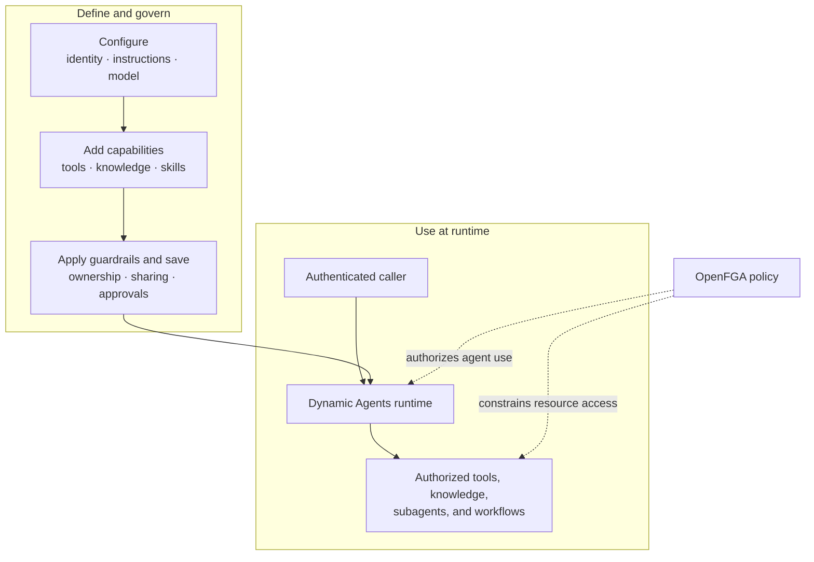

# Agent Builder

Use Agent Builder to create team-owned agents without writing application code.
The guided UI brings together instructions, configured models, tools,
organizational knowledge, reusable skills, and runtime guardrails.

**Quick links**:
[Dynamic Agents Helm chart](../installation/helm-charts/ai-platform-engineering/dynamic-agents-chart) ·
[Developer guide](../development/creating-an-agent)

## How it works

Agent Builder saves the agent definition. The Dynamic Agents runtime loads that
definition when an authenticated caller starts a chat. At runtime, CAIPE checks
the caller's access to both the agent and the resources it uses.

## Build an agent

Agent Builder guides you through six steps:

| Step | Configure |
|------|-----------|
| **Basic Info** | Name, description, owner team, and team or global visibility |
| **Instructions** | System prompt, model, and model parameters |
| **Tools** | Registered MCP tools and CAIPE built-in tools |
| **Knowledge** | Individual data sources and reusable collections |
| **Skills** | Reusable instructions and packaged capabilities |
| **Advanced** | Subagents, human approval rules, middleware, and workflow access |

After you save an agent, you can test it in chat without redeploying the runtime.
You can also clone it, enable or disable it, and export it as YAML.

## Knowledge and tool scope

- MCP servers can connect over `stdio`, SSE, or Streamable HTTP.
- Built-in tools include URL fetch, current date and time, user information,
  wait, human input requests, and workflow execution.
- Selecting data sources or collections narrows the knowledge available to the agent.
- The effective knowledge scope is the intersection of the agent's selection and
  the invoking caller's search access. Configuring knowledge never grants the
  caller additional access.
- Sensitive tools can require human approval before execution.

## Ownership and sharing

Every agent has an owner team.

- **Team visibility** grants use according to the selected team relationships.
- **Global visibility** makes the agent discoverable across the organization
  while retaining team ownership for management.
- OpenFGA relationships control who can discover, use, manage, share, or delete an agent.
- Resource authorization is checked when the agent runs; hiding an action in the UI is not a security boundary.

## GitOps bootstrap

Use `appConfig` in the `caipe-ui` chart to preconfigure resources at installation time.

| Key | Purpose |
|-----|---------|
| `appConfig.models` | Model endpoints available for agent selection |
| `appConfig.mcp_servers` | MCP server registrations |
| `appConfig.agents` | Agent definitions, capabilities, and visibility |
| `appConfig.workflow_configs` | Workflow definitions that agents can run when granted access |

Bootstrapped resources are marked `config_driven` and initially remain read-only
in the UI. An admin can adopt supported config-driven agents into database-backed
management when interactive editing is required.

Applying the configuration is idempotent: upgrades do not duplicate entries, and removed config-driven entries are cleaned up on a later startup.

## Runtime and operations

- REST and SSE APIs support browser, bot, workflow, and service callers.
- MongoDB stores UI-managed definitions, agent state, and conversation history.
- The Dynamic Agents Helm chart supports replicas, resource settings, and horizontal autoscaling.
- `AGENT_RUNTIME_TTL_SECONDS` expires idle agent runtimes.
- Kubernetes Secrets or External Secrets Operator can supply model and integration credentials.
- Prometheus metrics are exposed at `/metrics`.
