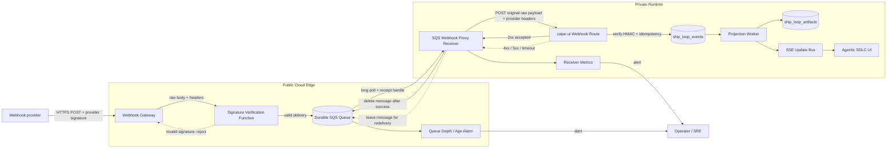

# SQS Webhook Proxy Receiver

The SQS webhook receiver is a small outbound proxy for deployments where a public webhook endpoint cannot directly call `caipe-ui`. It follows the older webhook proxy pattern: a public edge receives provider webhooks, verifies the provider signature, writes the delivery to SQS for durability, and a private receiver polls SQS and forwards the original payload to CAIPE.

CAIPE uses this pattern for Agentic SDLC GitHub events, but the receiver shape is intentionally generic: SQS provides persistence, the receiver preserves provider headers and raw payload bytes, and `caipe-ui` owns final HMAC verification, idempotency, event storage, projection, and UI fanout.

## Architecture



The public gateway and verification function are deployment-owned. CAIPE does not require a specific gateway product, account layout, or queue name. The only contract is that verified deliveries are placed on SQS with the raw payload and provider headers needed by the downstream CAIPE route.

## Why Use It

- Private deployments can receive public webhooks without exposing `caipe-ui` directly to the internet.
- SQS gives durable retry when CAIPE is temporarily unavailable.
- The receiver can run inside the same private network as CAIPE.
- CAIPE still verifies the original provider signature before accepting the event.
- Queue depth can be monitored separately from CAIPE application health.

## Runtime Contract

The receiver expects each SQS message body to be JSON with:

```json
{
  "headers": {
    "x-github-event": "issues",
    "x-github-delivery": "delivery-id",
    "x-hub-signature-256": "sha256=..."
  },
  "payload": "{\"action\":\"opened\"}"
}
```

For GitHub Agentic SDLC events, the receiver forwards:

- `Content-Type: application/json`
- `X-GitHub-Event`
- `X-GitHub-Delivery`
- `X-Hub-Signature-256`
- `X-CAIPE-Forwarder: sqs-webhook-proxy-receiver`

The body is forwarded as the original raw JSON string. Do not parse and re-serialize it before forwarding, because provider signatures are calculated over the exact bytes sent by the provider.

## CAIPE Flow

1. The provider sends a webhook to the public gateway.
2. The gateway verifies the shared provider secret.
3. The verified delivery is stored in SQS.
4. The receiver long-polls SQS in batches.
5. The receiver POSTs the original payload and signature headers to `caipe-ui`.
6. `caipe-ui` verifies the HMAC again and rejects mismatches.
7. Accepted events are written to `ship_loop_events`.
8. The projector derives board state into `ship_loop_artifacts`.
9. Connected clients receive SSE updates.

## Configuration

| Variable | Default | Description |
|---|---|---|
| `AWS_REGION` | `us-east-1` in Docker | SQS queue region. |
| `AWS_DEFAULT_REGION` | from AWS SDK config | Fallback region if `AWS_REGION` is unset. |
| `SQS_QUEUE_NAME` | `webhook-deliveries` | SQS queue name. |
| `CAIPE_WEBHOOK_URL` | `http://caipe-ui:3000/api/agentic-sdlc/webhooks/github` | CAIPE route that receives forwarded deliveries. |
| `RECEIVER_BATCH_SIZE` | `10` | Number of SQS messages to request per poll. |
| `RECEIVER_WAIT_SECONDS` | `20` | SQS long-poll wait time. |
| `RECEIVER_REQUEST_TIMEOUT` | `15` | Forwarding request timeout in seconds. |
| `RECEIVER_EMPTY_BACKOFF_SECONDS` | `0.5` | Delay after empty polls. |
| `LOG_PAYLOAD` | `0` | Set to `1` only for local debugging. Payloads may contain sensitive data. |
| `AWS_ASSUME_ROLE_ARN` | unset | Optional role to assume before reading SQS. |
| `AWS_ASSUME_ROLE_EXTERNAL_ID` | unset | Optional external ID for role assumption. |
| `AWS_ASSUME_ROLE_SESSION_NAME` | `sqs-webhook-proxy-receiver` | STS session name. |
| `AWS_ASSUME_ROLE_DURATION_SECONDS` | `3600` | STS credential duration. |

Use your normal AWS credential chain for the base identity: environment variables, workload identity, instance metadata, or a named local profile. Do not commit access keys, webhook secrets, or queue credentials to source control.

## Local Development

```bash
cd integrations/sqs-webhook-proxy-receiver
python3 -m venv .venv
. .venv/bin/activate
pip install -r app/requirements.txt

AWS_REGION=us-east-1 \
SQS_QUEUE_NAME=webhook-deliveries \
CAIPE_WEBHOOK_URL=http://localhost:3000/api/agentic-sdlc/webhooks/github \
python3 app/src/caipe_forwarder.py
```

For Docker Compose, use the receiver service with the Agentic SDLC profile and set queue/credential values through your local environment or `.env` file.

```bash
docker compose -f docker-compose.dev.yaml --profile agentic-sdlc up sqs-webhook-proxy-receiver
```

## Operations

- Monitor SQS queue depth and oldest-message age. Rising depth usually means CAIPE is unavailable, the receiver lacks permissions, or downstream verification is failing.
- Keep SQS visibility timeout longer than the receiver's request timeout plus expected CAIPE processing latency.
- Treat repeated `401` responses from CAIPE as a signature or secret mismatch.
- Treat repeated `5xx` or network failures as downstream availability issues.
- Leave messages in SQS on transient failures so SQS can redeliver.
- Delete permanently malformed envelopes to avoid infinite poison-message loops.

## Security

- Verify provider signatures before enqueueing when the public gateway supports it.
- Verify provider signatures again inside `caipe-ui`; SQS is durable transport, not a trust boundary.
- Store webhook secrets and AWS credentials in a secret manager or Kubernetes Secret.
- Do not log full payloads except during local debugging.
- Use least-privilege IAM: the receiver needs read/delete access only to the configured queue, plus optional `sts:AssumeRole` if used.
- Prefer private networking between the receiver and CAIPE.
