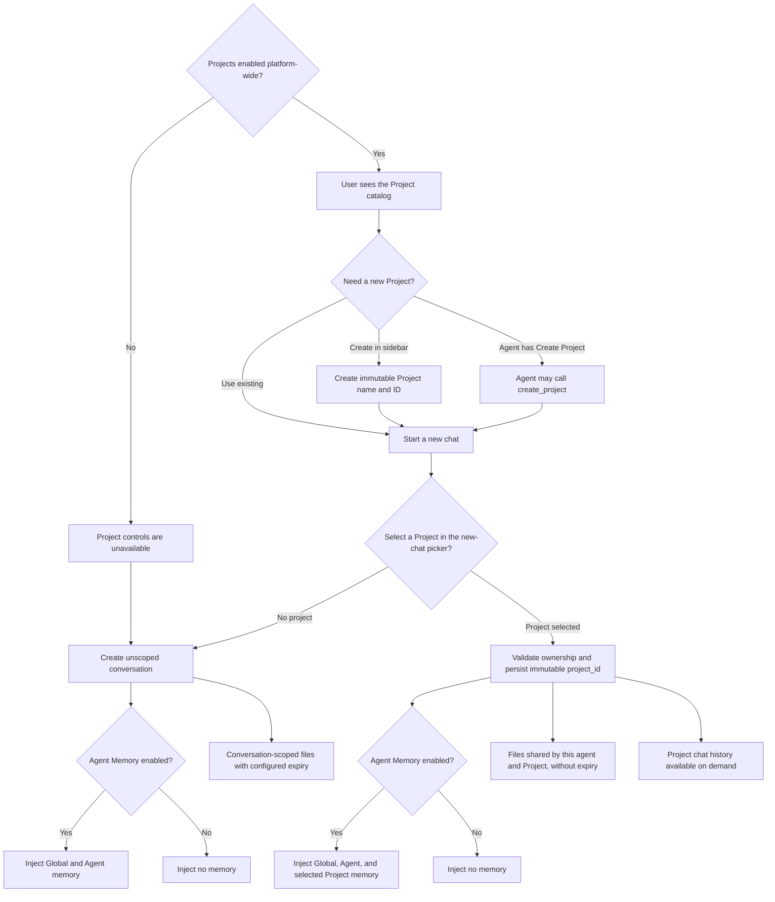

# User Memory and Projects

User Memory gives a Dynamic Agent durable notes that carry across
conversations. Projects group chats, memory, and files around a named body of
work. They are related at runtime, but they are configured independently:

- **Projects** are enabled once for the whole platform.
- **Memory** is enabled separately on each agent.
- **Create Project** only decides whether that agent may create a Project from
  chat. It does not enable Projects or control Project access.

Memory is private to the signed-in user and is separate from chat history.

## Controls at a glance

| Control | Set by | Effect |
| --- | --- | --- |
| **Enable Projects** | Administrator, in Platform Settings | Shows Projects for every user and agent |
| **Memory** | Agent author | Mounts durable Global and Agent memory, plus Project memory in a Project chat |
| **Create Project** | Agent author | Gives only that agent's model the `create_project` tool |
| **Project** on a new chat | User | Permanently scopes that conversation to one Project |
| **Memory** on a turn | User | Suppresses memory injection and memory writes for that turn only |

The persisted Platform Settings value overrides the deployment default:

```yaml
PROJECTS_ENABLED: "true"
```

The optional agent capability is deliberately named after the one action it
grants:

```yaml
builtin_tools:
  create_project:
    enabled: true
```

## End-to-end flow



Memory injection, shared files, and history access are resolved from the
conversation's stored scope. The model cannot supply a different user or
Project ID.

## Memory scopes

| Scope | Used by | File |
| --- | --- | --- |
| Global | All memory-enabled agents used by one user | `/memories/global/AGENTS.md` |
| Agent | One user and one Dynamic Agent | `/memories/agents/<agent-id>/AGENTS.md` |
| Project | Memory-enabled chats in one selected Project | `/memories/projects/<project-id>/AGENTS.md` |

Every memory-enabled chat mounts Global and current-Agent memory. A Project
chat additionally mounts exactly its selected Project. Other Project memory is
not mounted, searchable, or exposed to that agent.

Projects are private to the user's immutable Keycloak subject. A Project has
an immutable display name and an ID generated from that name, such as
`Project A` → `project_a`. Case- or spacing-equivalent duplicates are rejected
without overwriting the existing Project or its memory. Project names and IDs
cannot currently be renamed.

## Project catalog versus chat selection

The two Project controls have different jobs:

- The **Projects list above History** is catalog and history navigation. It
  lets the user create a Project or filter History to one Project. Clicking a
  Project there does not rescope the active conversation. Use **Back to all
  chats** to clear that filter.
- The **Project picker on a new chat** selects the actual conversation scope.
  **No project** creates an unscoped chat. Once the conversation is created,
  its Project cannot change; switching Projects always starts a new chat and
  does not copy the old transcript.

When Projects are disabled platform-wide, the catalog, picker, Project memory,
shared Project workspace, and Project history are unavailable to every agent.
Global and Agent memory continue to work normally.

There is no MCP server mapping, key path, label path, bind argument, static
context, dynamic context, or custom namespace setting. A Project is a generic
CAIPE working context. An agent may independently use an MCP tool to find
structured external data with a matching name, but the Project does not become
or duplicate that external record.

## Memory records

A memory file contains individually addressable records. Each record has:

- a required, free-form title;
- a required Markdown body;
- a hidden stable record ID;
- provenance shown as **Added by you** or **Added by agent**; and
- created and updated timestamps.

Titles must be unique after case and punctuation normalization within the same
memory file. Adding `Release preference` when an equivalent title already
exists returns a duplicate error and offers the existing record for editing;
records are never silently merged.

When a user adds a record, the title and body are stored as entered. The UI
does not ask AI to generate or rewrite either field. When an agent saves a new
fact, it must create a new uniquely titled `##` section. It may update an
existing section only when changing that same fact.

`General memory` is a compatibility record created only when existing
heading-less Markdown is imported. Agents cannot append to or modify it. New
agent-authored facts must receive their own titles. A user may edit or delete
the imported record through **Memories**.

The stable ID is internal bookkeeping. It lets edits, transcript badges, and
deep-links continue targeting the same record even if its title changes.

## Manage Memory

Select the book icon beside the composer to open **Manage Memory**. The left
rail separates files **Active in this chat** from **Other** memory files and
shows the number of records in each file.

The dialog has exactly two views:

- **Memories** lists titled records and supports Add, Edit, and Delete.
- **Source** displays the complete internal `AGENTS.md` read-only, with Copy
  and Download.

Raw Markdown cannot be overwritten through the UI or memory API. Source is
available for inspection and export, while all user edits go through the
structured record operations. ETags prevent an agent's concurrent update from
being silently overwritten; the UI asks the user to reload on conflict.

Clearing Project memory preserves its immutable Project marker and empty
placeholder. It does not delete the Project. Transcript badges identify
records injected or changed during a turn and open Manage Memory focused on
those records.

The per-turn Memory toggle suppresses both memory injection and memory writes
for that turn. It does not change the active Project, shared workspace, or
Project history scope.

## Files and Project history

Unscoped files use `(agent_id, conversation_id, "filesystem")` and retain the
configured expiry. Project files use `(agent_id, project_id, "filesystem")`
and do not expire. Therefore:

- two chats using the same agent and Project share files;
- different agents do not share Project files, even in the same Project; and
- unscoped chats remain isolated.

The server derives the namespace from the owned conversation. Clients cannot
construct or redirect Project filesystem namespaces.

A Project chat can list, search, and read bounded user/assistant content from
the user's past chats in that Project. Past chats are fetched only when the
agent needs them; they are never injected wholesale. System messages, hidden
reasoning, traces, and file contents are excluded from history results.

## Storage and privacy

Memory files use the non-expiring `agent_memory` GridFS bucket under
`(Keycloak sub, "memory")`. Project metadata is stored in the Project memory
file, while chat metadata and messages remain in the conversation collections.

Memory text is sent to the configured model provider when mounted. Do not save
passwords, tokens, API keys, regulated secrets, or data the model provider must
not receive.

See [User Memory Architecture](../architecture/user-memory-design) for the
storage, authorization, and request sequence.
