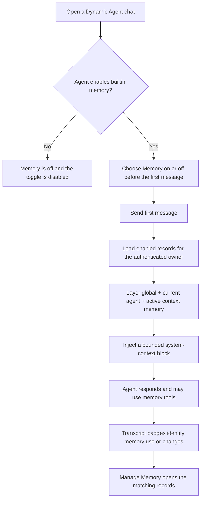

# User Memory

User Memory lets a Dynamic Agent retain useful preferences, instructions, and
facts across conversations. Memories are stored separately from chat history,
belong to one authenticated user, and are supplied only to agents and contexts
that match their scope.

Memory is opt-in for each agent. An agent must explicitly enable the memory
built-in tool before its chats can use saved memory. Existing and legacy agents
that do not configure memory remain memory-disabled.

:::info What “global” means
Global memory is global across **the current user's memory-enabled agents**. It
is not shared with other users, teams, or the organization.
:::

## What Memory Does

When memory is enabled for a chat, CAIPE can:

- inject the user's enabled global and current-agent memories into the first
  request in a conversation;
- attach relevant context memory after a configured context-provider tool
  identifies a domain object;
- let the agent remember, recall, list, update, or forget the current user's
  memories;
- show transcript badges when memory was injected, used for a context, or
  changed by the agent; and
- let the user inspect and manage saved records from the chat composer.

Memory is not the same as conversation history. Conversation history preserves
messages within a chat; User Memory stores selected information for reuse in
future chats.

## Memory Scopes

| Scope | Applies to | Example | Display in Manage Memory |
| --- | --- | --- | --- |
| `global` | All of the current user's memory-enabled agents | “Prefer concise answers.” | **Global** |
| `agent` | One specific agent | “For the incident agent, put active incidents first.” | `Agent: <agent-id>` |
| `context` | One domain object established by a configured provider | “For catalog/item/payments-api, include deployment risk.” | `catalog / item / payments-api` |

Agent-scoped records always store the target `agent_id`. Context scope is a
relevance boundary, not authorization to the underlying object; the MCP or
provider service remains responsible for authorizing access to that object.

Memories can also be categorized as `preference`, `instruction`, `fact`, or
`formatting`. Categories help users and agents organize and find records; they
do not change access control.

## How a Chat Uses Memory



The Memory toggle locks after the first user message. This keeps one
conversation on a consistent memory policy. Turning memory off skips automatic
retrieval and makes the memory tools return a disabled response for that run.

Only the initial request receives the layered memory prompt. Later context
memory is attached when a configured context-provider tool succeeds.

## Using Memory in the Chat UI

### Turn memory on or off

The **Memory** button appears beside the message composer.

- If the selected agent allows memory, the button starts on and can be changed
  until the first message is sent.
- After the first message, the button is locked for that conversation.
- If the agent does not allow memory, the button is off and cannot be clicked.
  The tooltip directs the user to contact an administrator.

### Manage saved memory

Select the book icon beside the Memory button to open **Manage Memory**. The
dialog lists both enabled and disabled records owned by the signed-in user.

From the dialog, a user can:

- add an agent-scoped memory for the current agent;
- add a global memory for all of their memory-enabled agents;
- edit the key, value, or category;
- enable or disable a record without deleting it; and
- delete a record.

Creating global memory does not require a separate confirmation. Deleting a
memory still asks for confirmation because deletion is destructive.

Context memories are normally created by the agent after a configured provider
establishes the active context. They are visible and editable in the dialog,
but the current dialog does not offer context scope for manual creation.

### Understand transcript badges

An assistant response can show clickable badges such as:

- **memory injected** — records were placed in the initial prompt;
- **context memory used** — records were attached after a context-provider
  tool call; or
- **memory updated** — the agent created, changed, or deleted records.

Selecting a badge opens Manage Memory focused on the associated record IDs.
The transcript event contains IDs, not the memory values themselves.

## Agent Memory Tools

A memory-enabled root agent receives these built-in tools:

```text
remember(scope, category, value, key?, context_namespace?, context_type?, context_id?)
recall_memory(query?, scope?, context_namespace?, context_type?, context_id?)
list_memories(scope?, context_namespace?, context_type?, context_id?)
update_memory(memory_id, value?, category?, key?, enabled?)
forget_memory(memory_id)
```

Agent-created global, agent, and context memories are saved without a separate
user-confirmation step. Changes are still surfaced through transcript events.
Memory is root-agent only: subagents do not automatically inherit the user's
memory tools or prompt unless a future explicit handoff policy is added.

## Enabling Memory for an Agent

Administrators and agent authors enable memory in the agent's built-in tool
configuration:

```yaml
builtin_tools:
  memory:
    enabled: true
```

To activate context memory after a domain tool succeeds, configure one or more
context providers:

```yaml
builtin_tools:
  memory:
    enabled: true
    context_providers:
      - server: catalog
        tool: get_item
        context_namespace: catalog
        context_type: item
        context_id_arg: item_id
        context_id_result_path: _id
        display_name_result_path: name
```

In this example, a successful `catalog_get_item` call establishes
`catalog/item/<item_id>` as an active context. Matching context memories are
then appended to the tool result seen by the model.

Memory also requires:

- MongoDB available to both CAIPE UI and Dynamic Agents;
- authenticated user context reaching Dynamic Agents; and
- `memory_enabled: true` on the chat start or resume request, which the UI
  derives from the chat toggle.

The default collections are `user_memories` and `user_memory_contexts`.

## Storage and User Isolation

Every memory record contains an `owner_user_id`. Browser and agent memory
operations add the authenticated user's owner value to every MongoDB query,
update, and delete. Knowing another record's memory ID is therefore not enough
to read, modify, or delete it.

The current memory API provides no team sharing, cross-user listing, role-based
grant, or administrator override. These are not required for private,
owner-only memory. If sharing is added later, it should use an explicit
authorization model rather than changing the meaning of global scope.

Current security considerations:

- the owner key is the authenticated email rather than immutable Keycloak
  `sub`;
- SSO-disabled local development uses a shared anonymous identity and is not a
  multi-user security boundary; and
- Dynamic Agents must remain behind the trusted BFF path because its user
  context header is part of the service trust boundary.

## Limits and Retention

| Limit | Current behavior |
| --- | --- |
| Memory value | Maximum 4,000 characters |
| Initial injection | Maximum 12 records |
| Formatted prompt block | Maximum 3,500 characters |
| Disabled records | Stored and shown in Manage Memory, but not recalled or injected |
| Retention | No memory TTL; disabled records remain stored until deleted |

`AGENT_RUNTIME_TTL_SECONDS`, whose default is 300 seconds, controls idle agent
runtime caching. It does **not** expire stored user memories.

Memory values are ordinary MongoDB document fields and are sent to the
configured model provider when injected. Do not store passwords, API keys,
tokens, regulated secrets, or information the configured model provider must
not receive.

## Troubleshooting

### The Memory button is disabled

The selected agent does not have `builtin_tools.memory.enabled: true`. Update
the agent configuration or contact an administrator. This is expected for
legacy agents without memory configuration.

### The Memory button is enabled but cannot be changed

The conversation already contains a user message. Start a new chat to choose a
different memory setting.

### Manage Memory reports that storage is unavailable

Confirm MongoDB is configured for CAIPE UI and Dynamic Agents and that both
services use the intended database.

### A saved memory was not injected

Check that the record is enabled, its scope matches the selected agent or
active context, memory was on before the first message, and the injection limits
were not reached.

## Further Reading

See [User Memory Architecture](../architecture/user-memory-design) for the
schema, request lifecycle, streaming events, API behavior, implementation map,
and current architectural limitations.
