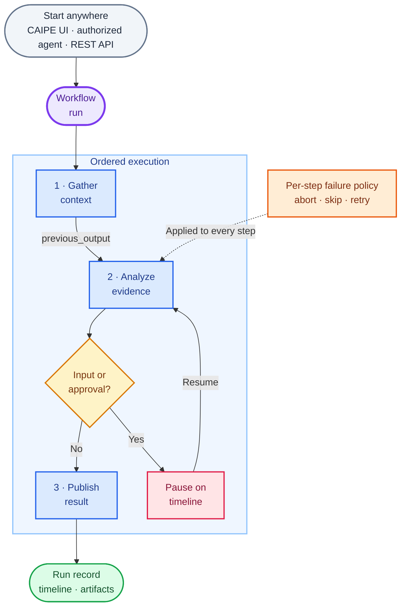

# Workflows

Use Workflows to compose agents into repeatable, inspectable processes. Each
workflow runs an ordered sequence of agent steps, passes context forward, applies
a failure policy to each step, and records the complete run timeline.

**Quick links**:
[CAIPE UI Helm chart](../installation/helm-charts/ai-platform-engineering/caipe-ui-chart) ·
[Workflow RBAC](../security/rbac/workflows)

## How it works



## Visual workflow builder

Build an ordered workflow in the CAIPE UI without writing orchestration code.

- Add or insert agent steps on the visual canvas.
- Assign a named agent and custom prompt to each step.
- Apply optional model, tool, or runtime configuration overrides to a step.
- Choose `abort`, `skip`, or `retry` when a step fails.
- Set the maximum attempt count for retrying steps.
- Import or export workflow definitions as YAML.

Workflow definitions are stored in MongoDB and can also be bootstrapped through `appConfig.workflow_configs` in the CAIPE UI Helm chart.

## Passing context between steps

Step prompts use Jinja-compatible templates. The available context includes:

| Variable | Purpose |
|----------|---------|
| `previous_output` | Output from the most recently completed step |
| `steps` | Named results and metadata from completed steps |
| `user_context` | Context supplied when the workflow run starts |

For example:

```jinja2
Review the release evidence below and identify blocking risks:

{{ previous_output }}
```

## Run history and timelines

Every execution creates a persistent workflow-run record.

- Status progression includes `pending`, `running`, `waiting_for_input`, `completed`, `failed`, and `cancelled`.
- The run timeline shows agent responses, tool calls, errors, human input events,
  and approvals.
- Files produced during a run are retained as artifacts.
- A running workflow can be cancelled.
- Runs are private by default. The owner can share a run with the workspace for
  collaborative review.

## Human input and approval

An agent step can pause the workflow when it needs structured input or approval
to use a protected tool.

1. The agent emits an interrupt containing a prompt and form fields.
2. The workflow enters `waiting_for_input`.
3. The run timeline presents the request to an authorized user.
4. The submitted data is validated and returned to the waiting step.
5. Execution resumes from that step and preserves the existing run history.

Interrupts raised by a subagent are propagated to the parent workflow run.

## Starting a workflow

Supported trigger paths are:

- **CAIPE UI** — start and inspect a run interactively.
- **Agent** — add the `workflows` built-in tool and grant the agent access to
  specific workflow definitions.
- **REST API** — create a run through `POST /api/workflow-runs` with a valid
  bearer token.

Workflow definitions do not currently contain cron schedules. For scheduled
automation, configure a scheduled or autonomous agent and grant that agent
access to the workflow.

## Access control

Workflow definitions and workflow runs use separate visibility models.

- Definition visibility can be `private`, `team`, or `global`.
- Run visibility can be `private`, `workspace`, or `admin`.
- Sharing a run creates workspace-readable access; it does not change the definition's team grants.
- OpenFGA relationships authorize access to definitions and runs on API requests.
- Admins can inspect runs for authorized troubleshooting.

UI controls help explain the current access state, but server-side authorization remains authoritative.
