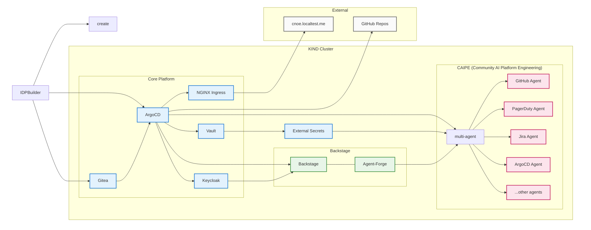

# Run with IDPBuilder 🏗️ 💻

[IDPBuilder](https://cnoe.io/docs/idpbuilder) is a tool for creating local Internal Developer Platform environments using KIND clusters. It provides a fast way to deploy and test platform components including ArgoCD, Vault, Backstage, and AI Platform Engineering agents.

<div style={{paddingBottom: '56.25%', position: 'relative', display: 'block', width: '100%'}}>
	<iframe src="https://app.vidcast.io/share/embed/3dc7f168-c8b0-40d3-aa45-66f74ec0ec03?disableCopyDropdown=1" width="100%" height="100%" title="Run CAIPE (Community AI Platform Engineering) using IDPBuilder" loading="lazy" allow="fullscreen *;autoplay *;" style={{position: 'absolute', top: 0, left: 0, border: 'solid', borderRadius: '12px'}}></iframe>
</div>


## Quick Start Options

## Step 1: Install Pre-requisities (Recommended)

> **Note:** These instructions are based on a Ubuntu/Debian VM

For a complete development environment with i3 desktop and VNC access on a vanilla Ubuntu VM or Ubuntu EC2 instance:

**System Requirements:**
- 8 CPUs
- 16 GB RAM
- 80 GB Disk Space
- Docker installed and ready

> Setup Ubuntu Pre-requisities

```bash
curl -sSL https://raw.githubusercontent.com/sriaradhyula/stacks/refs/heads/main/caipe/scripts/setup-ubuntu-prerequisites.sh -o /tmp/setup-ubuntu-prerequisites.sh && chmod +x /tmp/setup-ubuntu-prerequisites.sh && /tmp/setup-ubuntu-prerequisites.sh
```

This script will:
- Install all prerequisites (Docker, kubectl, Vault, etc.)
- Set up i3 desktop environment with VNC

### Option 2: Manual Setup
For detailed manual installation and configuration steps, see [Manual Setup Guide](./ubuntu-prerequisites.md).

## Architecture Overview

IDPBuilder creates a KIND cluster and deploys platform components via ArgoCD. The CAIPE (Community AI Platform Engineering) stack adds authentication, secret management, and multi-agent AI capabilities:



### Component Flow

1. **IDPBuilder Initialization**: Creates KIND cluster and deploys ArgoCD + Gitea as foundation
2. **Platform Deployment**: ArgoCD deploys all platform components from Git repositories
3. **Authentication Setup**: Keycloak provides SSO for Backstage and other platform services
4. **Secret Management**: Vault stores secrets, External Secrets distributes to applications
5. **Developer Access**: NGINX Ingress routes traffic, Backstage provides developer portal
6. **AI Integration**: Agent-Forge plugin in Backstage connects to CAIPE MAS Agent
7. **Multi-Agent System**: Orchestrator manages individual agents for different platform domains

## CAIPE Runtime/Deployment Profiles

CAIPE (Community AI Platform Engineering) offers multiple runtime/deployment profiles to suit different use cases:

### Available Profiles

| Profile | Description | Use Case |
|---------|-------------|----------|
| `caipe-basic-p2p` | Basic peer-to-peer AI platform with essential components | Quick testing, minimal setup, *best for learning* |
| `caipe-complete-p2p` **(recommended)** | Full-featured platform with all AI agents and integrations | Production-like with complete with CAIPE + A2A Peer-to-Peer betwen agents |
| `caipe-complete-slim` | Complete platform with SLIM pub/sub | Production-like with complete with CAIPE + A2A over AGNTCY SLIM  |

## Step 2: Pick your runtime/deployment CAIPE profile

IDPBuilder supports different profiles as listed above:

#### Option 1: CAIPE Basic A2A P2P Profile (for learning)
```bash
# Create cluster with CAIPE basic-p2p profile
idpbuilder create \
  --use-path-routing \
  --package https://github.com/cnoe-io/stacks//ref-implementation \
  --package https://github.com/sriaradhyula/stacks//caipe/base
```

#### Option 2: CAIPE Complete A2A P2P Profile (recommended)
```bash
# Create cluster with CAIPE complete-p2p profile
idpbuilder create \
  --use-path-routing \
  --package https://github.com/cnoe-io/stacks//ref-implementation \
  --package https://github.com/sriaradhyula/stacks//caipe/complete
```

#### Option 3: CAIPE Complete A2A over Slim Profile
```bash
# Create cluster with CAIPE complete-slim profile
idpbuilder create \
  --use-path-routing \
  --package https://github.com/cnoe-io/stacks//ref-implementation \
  --package https://github.com/sriaradhyula/stacks//caipe/complete-slim
```
Run your preferred runtime option. This process will:
* Create a KIND cluster
* Install core platform components
* Deploy ArgoCD, Vault, and Backstage
* Configure ingress with path-based routing

This takes around 5-10 minutes. Feel free to grab a coffee while it's deploying :coffee:

## Step 3: Verify Kubernetes Cluster

```bash
# Check cluster status
kubectl get nodes
```

```bash
# Verify all pods are running
kubectl get pods --all-namespaces
```

```bash
# Check ingress configuration
kubectl get ingress --all-namespaces
```

## Step 4. Access ArgoCD and Monitor Deployments

Once the cluster is created, IDPBuilder outputs the ArgoCD URL.

### Get ArgoCD Credentials

```bash
# Get admin password
idpbuilder get secrets -p argocd
```


### Access ArgoCD

Open https://cnoe.localtest.me:8443/argocd/ and login with:
- Username: `admin`
- Password: From the command above

Monitor application sync status for vault, ai-platform-engineering. Initial synchronization takes 3-5 minutes.

### Configure Vault Secrets

After Vault application syncs on ArgoCD successfully:

<div class="img-quarter-width">


</div>

## Step 5. Setup  Secrets

After Vault application syncs successfully on ArgoCD, configure your LLM provider credentials:

### Run setup-secrets.sh (Recommended)

```bash
# Download, make executable, and run in one command
curl -sSL https://raw.githubusercontent.com/sriaradhyula/stacks/refs/heads/main/caipe/scripts/setup-secrets.sh -o /tmp/setup-secrets.sh && chmod +x /tmp/setup-secrets.sh && /tmp/setup-secrets.sh
```

> This script will prompt you to select your LLM provider. Collect the required credentials securely and store them in cluster local Vault automatically

### Sample Output

Here's what you can expect when running the setup script:

```bash
ubuntu@ip-10-175-49-111:~$ curl -sSL https://raw.githubusercontent.com/sriaradhyula/stacks/refs/heads/main/caipe/scripts/setup-secrets.sh -o /tmp/setup-secrets.sh && chmod +x /tmp/setup-secrets.sh && /tmp/setup-secrets.sh
[2025-09-24 05:11:17] 🔧 Setting up LLM credentials and agent secrets
[2025-09-24 05:11:17] 🔗 Starting Vault port forward...
Forwarding from 127.0.0.1:8200 -> 8200
Forwarding from [::1]:8200 -> 8200
[2025-09-24 05:11:20] 🔍 Checking active agents...
NAME                                   READY   UP-TO-DATE   AVAILABLE   AGE
ai-platform-engineering-agent-github   1/1     1            1           3h10m
[2025-09-24 05:11:20] ✅ GitHub agent detected
NAME                                   READY   UP-TO-DATE   AVAILABLE   AGE
ai-platform-engineering-agent-argocd   1/1     1            1           3h10m
[2025-09-24 05:11:21] ✅ ArgoCD agent detected
NAME                                      READY   UP-TO-DATE   AVAILABLE   AGE
ai-platform-engineering-agent-backstage   1/1     1            1           3h10m
[2025-09-24 05:11:21] ✅ Backstage agent detected
[2025-09-24 05:11:22] 📝 Configuring secrets for agents: github argocd backstage


Supported LLM Providers:
1) azure-openai
2) openai
3) aws-bedrock
4) google-gemini
5) gcp-vertex

Select LLM provider (1-5): 3
[2025-09-24 05:11:27] 📝 Selected provider: aws-bedrock

[2025-09-24 05:11:27] 🔒 Note: Sensitive credentials will not be displayed on screen
[2025-09-24 05:11:27] 🤖 Configuring LLM credentials...

AWS Access Key ID:
AWS Secret Access Key:
AWS Region:
AWS Bedrock Model ID:
AWS Bedrock Provider:

[2025-09-24 05:12:04] 🐙 Configuring GitHub agent secrets...
GitHub Personal Access Token:

[2025-09-24 05:12:18] 🚀 Populating ArgoCD secrets with local ArgoCD set up and grab following values:
[2025-09-24 05:12:18] 1. ARGOCD_TOKEN will be from k8s secret argocd-admin-token in namespace vault, key: token
[2025-09-24 05:12:18] 2. ARGOCD_API_URL will be from the same k8s secret but key: apiUrl
[2025-09-24 05:12:18] 3. ARGOCD_VERIFY_SSL set to 'false'
[2025-09-24 05:12:18] ✅ ARGOCD_TOKEN retrieved from Kubernetes secret
[2025-09-24 05:12:18] ✅ ARGOCD_API_URL retrieved from Kubernetes secret: http://argocd-server.argocd.svc:443
[2025-09-24 05:12:18] ✅ ARGOCD_VERIFY_SSL set to: false

[2025-09-24 05:12:18] 🎭 Populating Backstage secrets with local Backstage set up and grab following values:
[2025-09-24 05:12:18] 1. BACKSTAGE_API_TOKEN from k8s secret backstage-auth-secrets in namespace backstage, key: AUTH_API_TOKEN_TEST
[2025-09-24 05:12:18] 2. BACKSTAGE_URL set to http://backstage.backstage.svc.cluster.local:7007
[2025-09-24 05:12:18] ✅ BACKSTAGE_API_TOKEN retrieved from Kubernetes secret
[2025-09-24 05:12:18] ✅ BACKSTAGE_URL set to: http://backstage.backstage.svc.cluster.local:7007
[2025-09-24 05:12:18] 💾 Storing secrets in Vault...
[2025-09-24 05:12:18] 🤖 Storing global LLM credentials in Vault...
Handling connection for 8200
[2025-09-24 05:12:18] ✅ Global LLM credentials stored
Handling connection for 8200
[2025-09-24 05:12:19] ✅ GitHub secrets stored
Handling connection for 8200
[2025-09-24 05:12:19] ✅ ArgoCD secrets stored
Handling connection for 8200
[2025-09-24 05:12:19] ✅ Backstage secrets stored
[2025-09-24 05:12:19] ✅ Agent secrets successfully stored in Vault

[2025-09-24 05:12:19] 🔍 You can verify individual agent secrets at:
[2025-09-24 05:12:19]   🐙 GitHub: https://vault.cnoe.localtest.me:8443/ui/vault/secrets/secret/kv/ai-platform-engineering%2Fgithub-secret
[2025-09-24 05:12:19]   🚀 ArgoCD: https://vault.cnoe.localtest.me:8443/ui/vault/secrets/secret/kv/ai-platform-engineering%2Fargocd-secret
[2025-09-24 05:12:19]   🎭 Backstage: https://vault.cnoe.localtest.me:8443/ui/vault/secrets/secret/kv/ai-platform-engineering%2Fbackstage-secret
[2025-09-24 05:12:19]   🤖 Global LLM: https://vault.cnoe.localtest.me:8443/ui/vault/secrets/secret/kv/ai-platform-engineering%2Fglobal
[2025-09-24 05:12:19] 🔄 Creating Kubernetes secret for agents...
secret/agent-secrets created
[2025-09-24 05:12:19] ✅ Kubernetes secret created/updated

[2025-09-24 05:12:19] 📊 Configuration Summary:
[2025-09-24 05:12:19]   🤖 Global LLM: aws-bedrock credentials configured
[2025-09-24 05:12:19]   🐙 GitHub: Personal Access Token configured
[2025-09-24 05:12:19]   🚀 ArgoCD: Token and API URL configured
[2025-09-24 05:12:19]   🎭 Backstage: API Token and URL configured
[2025-09-24 05:12:19] 🎉 Combined secrets setup complete!
```


### Refresh Secrets

After configuring your secrets in Vault, refresh the Kubernetes secrets to ensure all agents pick up the new credentials:

```bash
# Download and run the refresh secrets script
curl -sSL https://raw.githubusercontent.com/sriaradhyula/stacks/refs/heads/main/caipe/scripts/refresh-secrets.sh -o /tmp/refresh-secrets.sh && chmod +x /tmp/refresh-secrets.sh && /tmp/refresh-secrets.sh
```

This script will:
- Delete all existing secrets in the ai-platform-engineering namespace
- Wait for External Secrets to recreate them from Vault
- Restart all deployments to pick up the new secrets
- Verify that all pods are running and ready

## Step 4: Access Backstage Portal

### Get Backstage Credentials

```bash
# Get user1 password
idpbuilder get secrets | grep USER_PASSWORD | sed 's/.*USER_PASSWORD=\([^,]*\).*/\1/'
```

### Login to Backstage

Open https://cnoe.localtest.me:8443/ and login with:
- Username: `user1`
- Password: From the command above

## Useful Addresses for IDPBuilder Cluster

- ArgoCD: https://cnoe.localtest.me:8443/argocd/
- Backstage: https://cnoe.localtest.me:8443/
- Vault: https://vault.cnoe.localtest.me:8443/
- Keycloak: https://cnoe.localtest.me:8443/keycloak/admin/master/console/
- Gitea: https://cnoe.localtest.me:8443/gitea/


## Troubleshooting

### Manual Refresh Commands

If you prefer to run the commands manually:

```bash
# Delete all secrets
kubectl delete secret --all -n ai-platform-engineering
```

```bash
# Restart all deployments
kubectl rollout restart deployment -n ai-platform-engineering
```

```bash
# Wait for deployments to be ready
kubectl rollout status deployment -n ai-platform-engineering --timeout=300s
```

```bash
# Check final status
kubectl get pods -n ai-platform-engineering
```

```bash
kubectl get deployments -n ai-platform-engineering
```

### Troubleshooting Not-Ready Pods

If pods are running but not ready (0/1 Ready), the script will automatically:
- Show pod events to identify startup issues
- Display container logs for troubleshooting
- Wait additional time for readiness checks
- Provide guidance for manual investigation

Common issues and solutions:
- **Readiness probe failures**: Check application health endpoints
- **Missing secrets**: Ensure secrets are properly configured in Vault
- **Application startup time**: Some applications need more time to initialize
- **Dependency issues**: Verify all required services are available

## Manual Setup Secrets

If you prefer to configure secrets manually instead of using the automated script:

### Get Vault Token

```bash
# Extract root token
kubectl get secret vault-root-token -n vault -o jsonpath="{.data}" | \
  jq -r 'to_entries[] | "\(.key): \(.value | @base64d)"'
```

### Access Vault UI

Open https://vault.cnoe.localtest.me:8443/. When you are asked to log in to the Vault UI, use the root token from the previous step.

### Configure Global LLM Settings

Navigate to `secrets/ai-platform-engineering` in Vault UI: https://vault.cnoe.localtest.me:8443/ui/vault/secrets/secret/kv/list/ai-platform-engineering/

The `global` secret is required and contains LLM provider configuration shared across all agents:

**For Azure OpenAI (`azure-openai`):**
```yaml
LLM_PROVIDER: "azure-openai"
AZURE_OPENAI_API_KEY: <your-api-key>
AZURE_OPENAI_ENDPOINT: <your-endpoint>
AZURE_OPENAI_API_VERSION: <your-api-version>
AZURE_OPENAI_DEPLOYMENT: <your-deployment-name>
```

**For OpenAI (`openai`):**
```yaml
LLM_PROVIDER: "openai"
OPENAI_API_KEY: <your-api-key>
OPENAI_ENDPOINT: <your-endpoint>
OPENAI_MODEL_NAME: <your-model-name>
```

**For AWS Bedrock (`aws-bedrock`):**
```yaml
LLM_PROVIDER: "aws-bedrock"
AWS_ACCESS_KEY_ID: <your-access-key>
AWS_SECRET_ACCESS_KEY: <your-secret-key>
AWS_REGION: <your-region>
AWS_BEDROCK_MODEL_ID: <your-model-id>
AWS_BEDROCK_PROVIDER: <your-provider>
```

**For Google Gemini (`google-gemini`):**
```yaml
LLM_PROVIDER: "google-gemini"
GOOGLE_API_KEY: <your-api-key>
GOOGLE_MODEL_NAME: <your-model-name>
```

**For GCP Vertex (`gcp-vertex`):**
```yaml
LLM_PROVIDER: "gcp-vertex"
GCP_PROJECT_ID: <your-project-id>
GCP_LOCATION: <your-location>
GCP_MODEL_NAME: <your-model-name>
```

### Configure Agent-Specific Secrets

For each agent you plan to use, populate all required fields in their respective secrets (e.g., `github-secret`, `pagerduty-secret`, `jira-secret`). All fields are required for the agent to function properly.

## VNC Management Commands

```bash
# List VNC sessions
vncserver -list
```

```bash
# Kill VNC session
vncserver -kill :1
```

```bash
# Restart VNC with new resolution
vncserver :1 -geometry 2560x1400 -depth 24 -localhost yes
```

```bash
# Start VNC viewer with SSH tunnel
ssh -i ~/.ssh/private.pem -L 5903:localhost:5901 ubuntu@<YOUR UBUNTU IP> -f -N && vncviewer localhost:5903
```

## Cleanup

```bash
# Destroy the cluster and all resources
kind delete cluster --name localdev
```

```bash
# Stop VNC server (if running)
vncserver -kill :1
```

