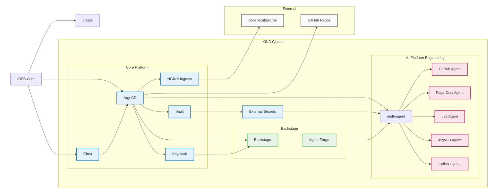

# Run with IDPBuilder 🏗️ 💻

[IDPBuilder](https://cnoe.io/docs/intro/idpbuilder) is a tool for creating local Internal Developer Platform environments using KIND clusters. It provides a fast way to deploy and test platform components including ArgoCD, Vault, Backstage, and AI Platform Engineering agents.

<div style={{paddingBottom: '56.25%', position: 'relative', display: 'block', width: '100%'}}>
	<iframe src="https://app.vidcast.io/share/embed/3dc7f168-c8b0-40d3-aa45-66f74ec0ec03?disableCopyDropdown=1" width="100%" height="100%" title="Run AI Platform Engineering using IDPBuilder" loading="lazy" allow="fullscreen *;autoplay *;" style={{position: 'absolute', top: 0, left: 0, border: 'solid', borderRadius: '12px'}}></iframe>
</div>

## Prerequisites

- [kubectl](https://kubernetes.io/docs/tasks/tools/) installed
- [IDPBuilder](https://cnoe.io/docs/reference-implementation/idpbuilder) binary installed

## Architecture Overview

IDPBuilder creates a KIND cluster and deploys platform components via ArgoCD. The AI Platform Engineering stack adds authentication, secret management, and multi-agent AI capabilities:



### Component Flow

1. **IDPBuilder Initialization**: Creates KIND cluster and deploys ArgoCD + Gitea as foundation
2. **Platform Deployment**: ArgoCD deploys all platform components from Git repositories
3. **Authentication Setup**: Keycloak provides SSO for Backstage and other platform services
4. **Secret Management**: Vault stores secrets, External Secrets distributes to applications
5. **Developer Access**: NGINX Ingress routes traffic, Backstage provides developer portal
6. **AI Integration**: Agent-Forge plugin in Backstage connects to AI Platform Engineering
7. **Multi-Agent System**: Orchestrator manages individual agents for different platform domains

## Section Outline

1. Create KIND Cluster with IDPBuilder
2. Access ArgoCD and Monitor Deployments
3. Configure Vault Secrets
4. Access Backstage Portal
5. Use AI Platform Engineering Agent

## Create KIND Cluster with IDPBuilder

### Step 1: Create the Platform

```bash
# Create cluster with reference implementation + lightweight AI stack
idpbuilder create \
  --use-path-routing \
  --package https://github.com/cnoe-io/stacks//ref-implementation \
  --package https://github.com/suwhang-cisco/stacks//ai-platform-engineering
```

This command will:
* Create a KIND cluster
* Install core platform components
* Deploy ArgoCD, Vault, and Backstage
* Configure ingress with path-based routing

This takes around 5-10 minutes. Feel free to grab a coffee while it's deploying :coffee:

### Step 2: Verify Cluster

```bash
# Check cluster status
kubectl get nodes

# Verify all pods are running
kubectl get pods --all-namespaces

# Check ingress configuration
kubectl get ingress --all-namespaces
```

## Access ArgoCD and Monitor Deployments

Once the cluster is created, IDPBuilder outputs the ArgoCD URL.

### Step 1: Get ArgoCD Credentials

```bash
# Get admin password
idpbuilder get secrets -p argocd
```

### Step 2: Access ArgoCD

Open https://cnoe.localtest.me:8443/argocd/ and login with:
- Username: `admin`
- Password: From the command above

Monitor application sync status. Initial synchronization takes 3-5 minutes.

## Configure Vault Secrets

After Vault application syncs on ArgoCD successfully:

<div class="img-quarter-width">


</div>

### Step 1: Get Vault Token

```bash
# Extract root token
kubectl get secret vault-root-token -n vault -o jsonpath="{.data}" | \
  jq -r 'to_entries[] | "\(.key): \(.value | @base64d)"'
```

### Step 2: Access Vault

Open https://vault.cnoe.localtest.me:8443/. When you are asked to log in to the Vault UI, use the root token from the previous step.


### Step 3: Update Secrets

1. Navigate to `secrets/ai-platform-engineering` in Vault UI: https://vault.cnoe.localtest.me:8443/ui/vault/secrets/secret/kv/list/ai-platform-engineering/

2. **Configure Global LLM Settings**: 

The `global` secret is required and contains LLM provider configuration shared across all agents:
   - `LLM_PROVIDER`: Defaults to `azure-openai`. Available options are: `azure-openai`, `openai`, `aws-bedrock`
   - Configure only the fields for your chosen provider:

   **For AWS Bedrock (`aws-bedrock`):**
   ```yaml
   LLM_PROVIDER: "aws-bedrock"
   AWS_ACCESS_KEY_ID: <your-access-key>
   AWS_SECRET_ACCESS_KEY: <your-secret-key>
   AWS_REGION: <your-region>
   AWS_BEDROCK_MODEL_ID: <your-model-id>
   AWS_BEDROCK_PROVIDER: <your-provider>
   ```

   **For OpenAI (`openai`):**
   ```yaml
   LLM_PROVIDER: "openai"
   OPENAI_API_KEY: <your-api-key>
   OPENAI_ENDPOINT: <your-endpoint>
   OPENAI_MODEL_NAME: <your-model-name>
   ```

   **For Azure OpenAI (`azure-openai`):**
   ```yaml
   LLM_PROVIDER: "azure-openai"
   AZURE_OPENAI_API_KEY: <your-api-key>
   AZURE_OPENAI_ENDPOINT: <your-endpoint>
   AZURE_OPENAI_API_VERSION: <your-api-version>
   ```

3. **Configure Agent-Specific Secrets**: For each agent you plan to use, populate all required fields in their respective secrets (e.g., `github-secret`, `pagerduty-secret`, `jira-secret`). All fields are required for the agent to function properly.
3. Force secret refresh:

```bash
# Refresh secrets
kubectl delete secret --all -n ai-platform-engineering
# Once new secrets are created, delete pods to pick up new secrets
kubectl delete pod --all -n ai-platform-engineering
```

## Access Backstage Portal

### Step 1: Get Backstage Credentials

```bash
# Get user1 password
idpbuilder get secrets | grep USER_PASSWORD | sed 's/.*USER_PASSWORD=\([^,]*\).*/\1/'
```

### Step 2: Login to Backstage

Open https://cnoe.localtest.me:8443/ and login with:
- Username: `user1`
- Password: From Step 1 above

## Use AI Platform Engineering Agent

Once logged into Backstage:

1. Look for the agent icon in the bottom-right corner
2. Click to open the AI assistant
3. Start chatting with the platform engineering agent

## Useful Addresses for IDPBuilder Cluster

- ArgoCD: https://cnoe.localtest.me:8443/argocd/
- Backstage: https://cnoe.localtest.me:8443/
- Vault: https://vault.cnoe.localtest.me:8443/
- Keycloak: https://cnoe.localtest.me:8443/keycloak/admin/master/console/
- Gitea: https://cnoe.localtest.me:8443/gitea/

## Cleanup

```bash
# Destroy the cluster and all resources
kind delete cluster --name localdev
```
