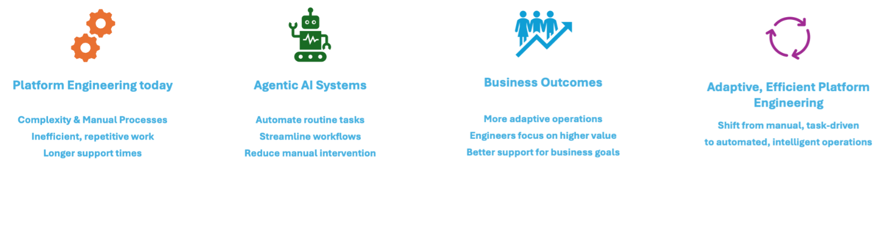

# Introduction

## What is AI Platform Engineering

As [Platform Engineering](https://platformengineering.org/blog/what-is-platform-engineering), [SRE](https://en.wikipedia.org/wiki/Site_reliability_engineering) and [DevOps](https://en.wikipedia.org/wiki/DevOps) environments grow in complexity, traditional approaches often lead to delays, increased operational overhead, and developer frustration. By adopting Multi-Agentic Systems and Agentic AI, Platform Engineering teams can move from manual, task-driven processes to more adaptive and automated operations, better supporting development and business goals.

**AI Platform Engineering** project provides a *customizable*, *secure*, *enterprise-ready*, and *cloud deployable* reference multi-agent system that streamlines platform operations through persona-driven “usecase agents” such as _Platform Engineer_, _Incident Engineer_, and _Product Owner_ etc. Each usecase agent is empowered by a set of specialized sub-agents that integrate seamlessly with essential engineering tools. Below are some common platform agents leveraged by the persona agents:

* 🚀 **ArgoCD Agent** for continuous deployment
* 🚨 **PagerDuty Agent** for incident management
* 🐙 **GitHub Agent** for version control
* 🗂️ **Jira Agent** for project management
* 💬 **Slack Agent** for team communication

*...and many more platform agents are available for additional tools and use cases.*

Together, these sub-agents enable users to perform complex operations using agentic workflows by invoking relavant APIs using MCP tools. The system also includes:

* **A curated prompt library**: A carefully evaluated collection of prompts designed for high accuracy and optimal workflow performance in multi-agent systems. These prompts guide persona agents (such as "Platform Engineer" or "Incident Engineer") using standardized instructions and questions, ensuring effective collaboration, incident response, platform operations, and knowledge sharing.
* **Multiple End-user interfaces**: Easily invoke agentic workflows programmatically using standard A2A protocol or through intuitive UIs, enabling seamless integration with existing systems like Backstage (Internal Developer Portals).
* **End-to-end security**: Secure agentic communication and task execution across all agents, ensuring API RBACs to meet enterprise requirements.
* **Enterprise-ready cloud deployment architecture**: Reference deployment patterns for scalable, secure, and resilient multi-agent systems in cloud and hybrid environments

## Goals of the project

- Enable Platform Engineering teams with a curated, validated set of persona-specific multi-agent systems (MAS) tailored to their unique enterprise requirements.

- Foster an ecosystem of AI Platform Engineering practitioners to collaboratively develop high-quality, reusable prompt engineering libraries and commonly used platform tools.
- A carefully curated library of meta-prompts, continuously evaluated for effectiveness with both our agents and the MCP server to drive optimal performance in agentic workflows.

## Who we are

We are Platform Engineers, SREs, and Developers from a variety of companies in the [CNCF](https://www.cncf.io/) and [CNOE.io](https://cnoe.io/) ecosystems, passionate about open source and advancing the use of agentic AI in Platform Engineering.
