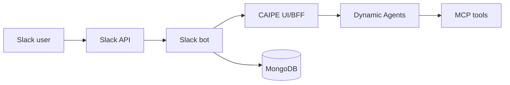

# Slack Bot Integration

The CAIPE Slack bot brings dynamic-agent chat into Slack channels and DMs.

## Architecture



The bot calls the UI/BFF through `CAIPE_API_URL`. The BFF enforces access,
creates or resumes conversations, and streams responses through Dynamic Agents.

## Core Features

- Channel and DM routing to configured dynamic-agent IDs
- Thread-aware follow-ups with bounded Slack thread context
- MongoDB-backed route, team, and link metadata
- Human-in-the-loop forms rendered as Slack blocks
- Feedback actions and audit events
- Optional service-account authentication for BFF calls
- Just-in-time Keycloak user creation for Slack users when enabled

## Required Slack Scopes

| Scope | Purpose |
|---|---|
| `app_mentions:read` | Detect mentions |
| `channels:history`, `groups:history`, `im:history`, `mpim:history` | Read messages where the bot participates |
| `channels:read`, `groups:read`, `im:read` | Resolve channel and DM metadata |
| `chat:write` | Post replies |
| `reactions:write` | Add feedback/status reactions |

## Important Environment Variables

| Variable | Purpose |
|---|---|
| `CAIPE_API_URL` | UI/BFF base URL |
| `SLACK_BOT_MODE` | `socket` or `http` |
| `SLACK_AGENT_ROUTES_MODE` | `db_prefer`, `config`, or `db_only` |
| `SLACK_DEFAULT_TEAM_SLUG` | Team used for auto-assignment |
| `SLACK_DEFAULT_AGENT_ID` | Dynamic-agent ID used for auto-assignment |
| `MONGODB_URI` | Route/link/team metadata storage |
| `MONGODB_DATABASE` | MongoDB database name |
| `SLACK_JIT_CREATE_USER` | Enable Keycloak user creation for Slack-only users |

Sensitive Slack and OAuth values belong in Kubernetes Secrets or ExternalSecrets.

## Helm

```yaml
tags:
  slack-bot: true

slack-bot:
  config:
    CAIPE_API_URL: http://ai-platform-engineering-caipe-ui:3000
    SLACK_AGENT_ROUTES_MODE: db_prefer
    SLACK_DEFAULT_AGENT_ID: platform-engineer
  existingSecret: slack-bot-secrets
```

See the [slack-bot chart reference](../installation/helm-charts/ai-platform-engineering/slack-bot.md)
for chart values.
