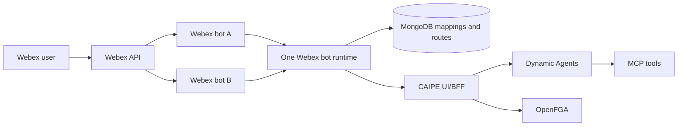

# Webex Bot

The CAIPE Webex bot brings dynamic-agent chat into Webex spaces and direct
messages. One runtime pod can serve multiple Webex bot identities while keeping
each bot's routes and direct-message allowlist separate.

## Architecture



The runtime starts one Webex client for each configured bot token. Every event
retains its `bot_id` while the runtime resolves its space or direct-message route.
The runtime then calls the UI/BFF through `CAIPE_API_URL`; the BFF enforces
access, creates or resumes conversations, and streams responses through Dynamic
Agents.

## Features

- Direct-message and group-space support
- Multiple Webex bot identities in one runtime pod
- Bot-specific space, agent, and direct-message routes
- Thread-aware follow-ups with bounded Webex thread context
- MongoDB-backed route, team, and link metadata
- Adaptive Cards for structured responses, HITL forms, and feedback
- Optional service-account authentication for BFF calls

## Configure Multiple Bots

Define the same bot catalog in both places:

- `webex-bot.bots` tells the runtime which bot clients to start.
- `caipe-ui.webexBots` lets the admin UI discover spaces and configure routes
  for those bots.

Each entry has a stable `id`, a display `name`, and a `tokenEnv`. The token
itself must be supplied through `existingSecret` or `externalSecrets`; it must
not be placed in Helm values. The two catalogs must use the same IDs and token
environment variable names.

```yaml
tags:
  webex-bot: true

caipe-ui:
  webexBots:
    - id: primary
      name: Primary Webex bot
      tokenEnv: WEBEX_PRIMARY_BOT_TOKEN
    - id: secondary
      name: Secondary Webex bot
      tokenEnv: WEBEX_SECONDARY_BOT_TOKEN
  config:
    WEBEX_DM_ACCESS_MODE: allowlist
  existingSecret: webex-bot-tokens

webex-bot:
  bots:
    - id: primary
      name: Primary Webex bot
      tokenEnv: WEBEX_PRIMARY_BOT_TOKEN
    - id: secondary
      name: Secondary Webex bot
      tokenEnv: WEBEX_SECONDARY_BOT_TOKEN
  config:
    CAIPE_API_URL: http://ai-platform-engineering-caipe-ui:3000
    WEBEX_AGENT_ROUTES_MODE: db_prefer
    WEBEX_DM_ACCESS_MODE: allowlist
  existingSecret: webex-bot-tokens
```

The referenced Secret must expose both token keys to both workloads:

```yaml
apiVersion: v1
kind: Secret
metadata:
  name: webex-bot-tokens
type: Opaque
stringData:
  WEBEX_PRIMARY_BOT_TOKEN: <primary-bot-token>
  WEBEX_SECONDARY_BOT_TOKEN: <secondary-bot-token>
```

Use a distinct bot token for each live CAIPE deployment. Reusing one token starts
multiple listeners for the same bot identity and can produce duplicate replies.

## Admin Onboarding

Go to **Admin > Integrations > Webex**. Both **Configure spaces** and **1:1
Messages** have a **Webex bot** selector at the top. The selected bot scopes
discovery and configuration for the entire tab.

For a group space, select a bot, refresh its spaces, and choose the team, agent,
and listen mode. A space containing multiple configured bots can intentionally
be onboarded once for each bot; each bot retains its own route.

For a direct message in `allowlist` mode, select a bot, then assign a deployment
user and agent. The same user can be onboarded independently for multiple bots.
Messages to a bot without a matching active allowlist entry are ignored.

### Direct-Message Modes

| Mode | Behavior |
|---|---|
| `disabled` | The runtime does not handle direct messages. |
| `allowlist` | Only bot/user pairs explicitly configured by an admin are handled. |
| `all_users` | Deployment users may use the first configured bot and `WEBEX_DEFAULT_AGENT_ID`. |

Set `WEBEX_DM_ACCESS_MODE` to the same value on the UI and Webex bot workloads.
`allowlist` is the recommended mode when admins must control access and agent
assignment explicitly.

## Routing and Authorization

Bot-specific ownership is stored in MongoDB:

- Space mapping: `bot_id`, `workspace_id`, and `space_id`
- Agent route: `bot_id`, `workspace_id`, `space_id`, and `agent_id`
- Direct-message route: `bot_id` and Keycloak user ID

OpenFGA grants remain attached to the physical Webex space as
`webex_space:<workspace>--<space>`. This allows two bots in the same physical
space to share the space's authorization boundary while preserving separate
MongoDB routes. Runtime lookup never falls back to another bot's route.

## Important Environment Variables

| Variable | Purpose |
|---|---|
| `WEBEX_INTEGRATION_BOTS_JSON` | Bot catalog generated from Helm `bots` or `webexBots` |
| `WEBEX_INTEGRATION_BOT_ACCESS_TOKEN` | Legacy single-bot token used only when no bot catalog is configured |
| `CAIPE_API_URL` | UI/BFF base URL |
| `WEBEX_AGENT_ROUTES_MODE` | `db_prefer`, `config`, or `db_only` |
| `WEBEX_DM_ACCESS_MODE` | `disabled`, `allowlist`, or `all_users` |
| `WEBEX_DEFAULT_TEAM_SLUG` | Team used for auto-assignment |
| `WEBEX_DEFAULT_AGENT_ID` | Dynamic-agent ID used for auto-assignment |
| `WEBEX_THREAD_CONTEXT_ENABLED` | Include bounded thread context |
| `MONGODB_URI` | Route/link/team metadata storage |
| `MONGODB_DATABASE` | MongoDB database name |

Sensitive Webex and OAuth values belong in Kubernetes Secrets or ExternalSecrets.

See the [webex-bot chart reference](../installation/helm-charts/ai-platform-engineering/webex-bot.md)
for chart values.
