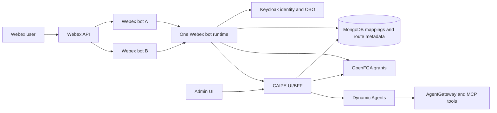
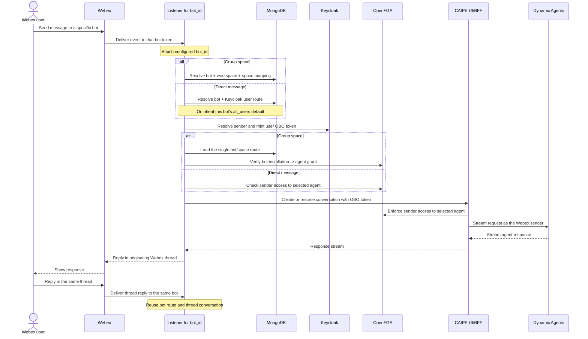

# Webex Bot

The CAIPE Webex bot brings dynamic-agent chat into Webex spaces and direct
messages. One runtime pod can serve multiple Webex bot identities while keeping
each bot's routes and direct-message allowlist separate.

## Component Architecture



The runtime starts one Webex client for each configured bot token. Every event
retains its `bot_id` while the runtime resolves its space or direct-message route.
The runtime then calls the UI/BFF through `CAIPE_API_URL`; the BFF enforces
access, creates or resumes conversations, and streams responses through Dynamic
Agents.

## Current Multi-Bot Architecture

The component diagram above shows what communicates with what. The sequence
below shows how one inbound event keeps its bot identity through routing and
authorization. The event cannot select `bot_id`; the listener that owns the
receiving Webex token attaches its configured ID.



For a group space, the durable route identity is
`(bot_id, workspace_id, space_id)`; changing `agent_id` updates that route. For
a direct message, the durable route identity is `(bot_id, Keycloak user ID)`.
The two bots may therefore use different agents and policies in the same
physical Webex space or for the same deployment user.

## Features

- Direct-message and group-space support
- Multiple Webex bot identities in one runtime pod
- Bot-specific space mappings, agent routes, and direct-message routes
- Thread-aware follow-ups with bounded Webex thread context
- MongoDB-backed route, team, and link metadata
- Adaptive Cards for structured responses, HITL forms, and feedback
- Optional service-account authentication for BFF calls

## Configure Multiple Bots

Define each bot once in `webex-bot.bots`. The runtime starts the configured bot
clients and exposes a token-free catalog, policy, and space-discovery API to the
UI. The UI does not receive bot tokens and does not maintain a second catalog.

Each entry has a stable `id`, display `name`, `tokenEnv`, and independent policy
for group spaces and direct messages. The token itself must be supplied through
`existingSecret` or `externalSecrets`; it must not be placed in Helm values.
Bot identity is always selected explicitly; there is no deployment default bot.

```yaml
tags:
  webex-bot: true

webex-bot:
  bots:
    - id: primary
      name: Primary Webex bot
      tokenEnv: WEBEX_PRIMARY_BOT_TOKEN
      spaces:
        accessMode: allowlist
      directMessages:
        accessMode: allowlist
    - id: secondary
      name: Secondary Webex bot
      tokenEnv: WEBEX_SECONDARY_BOT_TOKEN
      spaces:
        accessMode: all_spaces
        defaultTeamSlug: platform
        defaultAgentId: agent-platform
      directMessages:
        accessMode: all_users
        defaultAgentId: agent-personal
  config:
    CAIPE_API_URL: http://ai-platform-engineering-caipe-ui:3000
    WEBEX_AGENT_ROUTES_MODE: db_prefer
  existingSecret: webex-bot-tokens
```

The referenced Secret must expose both token keys to the Webex bot pod:

```yaml
apiVersion: v1
kind: Secret
metadata:
  name: webex-bot-tokens
type: Opaque
stringData:
  WEBEX_PRIMARY_BOT_TOKEN: <primary-bot-token>
  WEBEX_SECONDARY_BOT_TOKEN: <secondary-bot-token>
```

Use a distinct bot token for each live CAIPE deployment. Reusing one token starts
multiple listeners for the same bot identity and can produce duplicate replies.

## Admin Onboarding

Go to **Admin > Integrations > Webex**. Both **Configure spaces** and **1:1
Messages** have a **Webex bot** selector at the top. The selected bot scopes
discovery and configuration for the entire tab.

For a group space in `allowlist` mode, select a bot, refresh its spaces, and
choose the team and agent. Initial onboarding creates a mention route. Use the
space's **Configured spaces** details to change the route to `mention`,
`message`, or `all`. A space containing multiple configured bots can
intentionally be onboarded once for each bot; each bot retains its own mapping
and route.

| Space mode | Behavior |
|---|---|
| `disabled` | The runtime ignores group-space messages for this bot. |
| `allowlist` | Only bot/space pairs explicitly configured by an admin are handled. |
| `all_spaces` | An unmapped bot-visible space is assigned to `spaces.defaultTeamSlug` and `spaces.defaultAgentId` when its first eligible message arrives. |

There is one mutable agent route per `(bot_id, workspace_id, space_id)`. An
existing explicit route wins over the `all_spaces` default. Changing the agent
in **Configured spaces** replaces that route; it does not create another route
for the same bot and space. Auto-assignment does not overwrite an existing
mapping or explicit route.

For a direct message in `allowlist` mode, select a bot, then assign a deployment
user and agent. The same user can be onboarded independently for multiple bots.
Messages to a bot without a matching active allowlist entry are ignored.

### Direct-Message Modes

| Mode | Behavior |
|---|---|
| `disabled` | The runtime does not handle direct messages. |
| `allowlist` | Only bot/user pairs explicitly configured by an admin are handled; the admin-selected agent is authoritative. |
| `all_users` | Any enabled deployment user may use the bot. Without an explicit per-user route, the bot uses `directMessages.defaultAgentId`. |

Set `directMessages.accessMode` independently on every bot. `allowlist` is the
recommended mode when admins must control access and agent assignment
explicitly. In `all_users` mode, the UI lists every enabled deployment user as
allowed with the bot default selected. An admin can save a per-user agent
override, explicitly deny that user for the selected bot, or reset the row to
the inherited bot policy. Direct-message routes do not have a team.

For an inherited `all_users` route, `use <agent>` creates an in-memory override
for that Webex user and direct-message room. It is cleared when the bot pod
restarts. An explicit admin route remains authoritative. Before dispatch, the
runtime exchanges the matched deployment user's identity for an OBO bearer and
checks that user can access the selected agent through OpenFGA. A missing,
disabled, or mismatched user mapping fails closed.

## Routing and Authorization

Bot-specific ownership is stored in MongoDB:

- Space mapping: `bot_id`, `workspace_id`, and `space_id`
- Agent route key: `bot_id`, `workspace_id`, and `space_id`; `agent_id` and
  listen metadata are mutable route values
- Direct-message route: `bot_id` and Keycloak user ID

The space mapping selects the CAIPE team for that bot/space pair. Saving a new
space agent updates the single Mongo route and replaces the previous
bot-installation-to-agent tuple. A direct-message route stores only the selected
agent and user identity; it does not use the group-space team mapping.

Agent route grants use a bot-scoped OpenFGA subject:
`webex_bot_installation:<bot_id>--<workspace>--<space>`. Each installation is
linked to its `webex_bot:<bot_id>` and physical
`webex_space:<workspace>--<space>` objects. Team visibility remains attached to
the physical space, while runtime agent authorization cannot cross bot IDs.

For group messages, the runtime resolves the Webex person to a Keycloak user,
mints that user's OBO token, and checks the bot installation's space/agent grant.
The UI/BFF then enforces the user's own access when creating or resuming the
Dynamic Agent conversation. For direct messages, the configured Webex user must
resolve to the same enabled Keycloak user, and the runtime checks that user's
OBO token directly against the selected agent. Authorization or identity
dependency failures fail closed.

## Conversation Context

Each Webex root message and its replies map to one CAIPE conversation. The
conversation ID is deterministic from the Webex space and root message, so
replies in the same Webex thread resume the same conversation. A new top-level
message starts a separate conversation.

When `WEBEX_THREAD_CONTEXT_ENABLED` is `true`, the bot also includes a bounded
view of earlier messages from that Webex thread. Use
`WEBEX_THREAD_CONTEXT_MAX_MESSAGES` and `WEBEX_THREAD_CONTEXT_MAX_CHARS` to cap
that additional context.

## Legacy Single-Bot Records

Legacy ownership is never inferred at startup. Go to **Admin > Integrations >
Webex > Legacy migration** and select **Probe legacy data**. The probe lists
botless Mongo mappings/routes and legacy physical-space OpenFGA agent grants.
For each space, an administrator must either select the bot that originally
owned it and migrate it, or delete the legacy records. Applying a migration
writes the bot-scoped OpenFGA identity and agent tuples, stamps the matching
Mongo records with `bot_id`, and then deletes that space's old physical-space
agent tuples.

The current model permits one agent route per bot/space. If a legacy space has
conflicting agent routes, review it under **Configured spaces** after migration
and save the intended agent; that save converges the records to the canonical
single-route key.

The migration intentionally does not modify:

- `webex_space_grants`, which remain attached to the physical Webex space and
  are shared by bot-specific routes.
- `webex_direct_user_routes`, which were introduced with multi-bot ownership
  and already require `bot_id`.

Legacy MongoDB documents do not contain the historical bot identity. The
platform therefore cannot independently prove which bot originally owned a
record; the admin selection is intentionally mandatory.

## Important Environment Variables

| Variable | Purpose |
|---|---|
| `WEBEX_INTEGRATION_BOTS_JSON` | Runtime bot catalog generated by Helm from `webex-bot.bots` |
| `CAIPE_API_URL` | UI/BFF base URL |
| `WEBEX_AGENT_ROUTES_MODE` | `db_prefer`, `config`, or `db_only` |
| `WEBEX_THREAD_CONTEXT_ENABLED` | Include bounded thread context |
| `WEBEX_THREAD_CONTEXT_MAX_MESSAGES` | Maximum earlier Webex thread messages included |
| `WEBEX_THREAD_CONTEXT_MAX_CHARS` | Maximum characters of Webex thread context included |
| `MONGODB_URI` | Route/link/team metadata storage |
| `MONGODB_DATABASE` | MongoDB database name |
| `OPENFGA_HTTP` | OpenFGA API used for bot-installation and agent grants |
| `KEYCLOAK_URL` / `KEYCLOAK_REALM` | User lookup, identity linking, and OBO token exchange |

Sensitive Webex and OAuth values belong in Kubernetes Secrets or ExternalSecrets.

See the [webex-bot chart reference](../installation/helm-charts/ai-platform-engineering/webex-bot.md)
for chart values.
