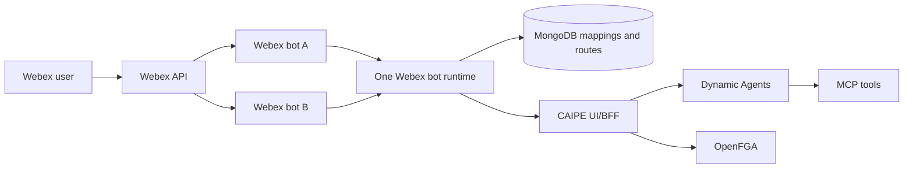

# Webex Bot

The CAIPE Webex bot brings dynamic-agent chat into Webex spaces and direct
messages. One runtime pod can serve multiple Webex bot identities while keeping
each bot's routes and direct-message allowlist separate.

## Architecture



The runtime starts one Webex client for each configured bot token. Every event
retains its `bot_id` while the runtime resolves its space or direct-message route.
The runtime then calls the UI/BFF through `CAIPE_API_URL`; the BFF enforces
access, creates or resumes conversations, and streams responses through Dynamic
Agents.

## Features

- Direct-message and group-space support
- Multiple Webex bot identities in one runtime pod
- Bot-specific space, agent, and direct-message routes
- Thread-aware follow-ups with bounded Webex thread context
- MongoDB-backed route, team, and link metadata
- Adaptive Cards for structured responses, HITL forms, and feedback
- Optional service-account authentication for BFF calls

## Configure Multiple Bots

Define each bot once in `webex-bot.bots`. The runtime starts the configured bot
clients and exposes a token-free catalog, policy, and space-discovery API to the
UI. The UI does not receive bot tokens and does not maintain a second catalog.

Each entry has a stable `id`, display `name`, `tokenEnv`, and independent policy
for group spaces and direct messages. The token itself must be supplied through
`existingSecret` or `externalSecrets`; it must not be placed in Helm values.
Bot identity is always selected explicitly; there is no deployment default bot.

```yaml
tags:
  webex-bot: true

webex-bot:
  bots:
    - id: primary
      name: Primary Webex bot
      tokenEnv: WEBEX_PRIMARY_BOT_TOKEN
      spaces:
        accessMode: allowlist
      directMessages:
        accessMode: allowlist
    - id: secondary
      name: Secondary Webex bot
      tokenEnv: WEBEX_SECONDARY_BOT_TOKEN
      spaces:
        accessMode: all_spaces
        defaultTeamSlug: platform
        defaultAgentId: agent-platform
      directMessages:
        accessMode: all_users
        defaultAgentId: agent-personal
  config:
    CAIPE_API_URL: http://ai-platform-engineering-caipe-ui:3000
    WEBEX_AGENT_ROUTES_MODE: db_prefer
  existingSecret: webex-bot-tokens
```

The referenced Secret must expose both token keys to both workloads:

```yaml
apiVersion: v1
kind: Secret
metadata:
  name: webex-bot-tokens
type: Opaque
stringData:
  WEBEX_PRIMARY_BOT_TOKEN: <primary-bot-token>
  WEBEX_SECONDARY_BOT_TOKEN: <secondary-bot-token>
```

Use a distinct bot token for each live CAIPE deployment. Reusing one token starts
multiple listeners for the same bot identity and can produce duplicate replies.

## Admin Onboarding

Go to **Admin > Integrations > Webex**. Both **Configure spaces** and **1:1
Messages** have a **Webex bot** selector at the top. The selected bot scopes
discovery and configuration for the entire tab.

For a group space in `allowlist` mode, select a bot, refresh its spaces, and
choose the team, agent, and listen mode. A space containing multiple configured
bots can intentionally be onboarded once for each bot; each bot retains its own
route. `disabled` ignores all group spaces for that bot. `all_spaces`
automatically creates missing routes using that bot's
`spaces.defaultTeamSlug` and `spaces.defaultAgentId`.

For a direct message in `allowlist` mode, select a bot, then assign a deployment
user and agent. The same user can be onboarded independently for multiple bots.
Messages to a bot without a matching active allowlist entry are ignored.

### Direct-Message Modes

| Mode | Behavior |
|---|---|
| `disabled` | The runtime does not handle direct messages. |
| `allowlist` | Only bot/user pairs explicitly configured by an admin are handled; the admin-selected agent is authoritative. |
| `all_users` | Any enabled deployment user may use the bot. The runtime resolves a temporary `use` override and then that bot's live `directMessages.defaultAgentId`. |

Set `directMessages.accessMode` independently on every bot. `allowlist` is the
recommended mode when admins must control access and agent assignment
explicitly. In `all_users` mode, the UI lists every enabled deployment user as
allowed with the bot defaults selected. An admin can save a per-user agent/team
override, explicitly deny that user for the selected bot, or reset the row to
the inherited bot policy. `use <agent>` remains an in-memory override for that
user and direct-message room and is cleared when the bot pod restarts. Every
selected agent is checked against the linked user's effective OpenFGA access
before dispatch. The final bot fallback additionally requires membership in
the configured default team and that team's grant to the configured agent.

## Routing and Authorization

Bot-specific ownership is stored in MongoDB:

- Space mapping: `bot_id`, `workspace_id`, and `space_id`
- Agent route: `bot_id`, `workspace_id`, `space_id`, and `agent_id`
- Direct-message route: `bot_id` and Keycloak user ID

Agent route grants use a bot-scoped OpenFGA subject:
`webex_bot_installation:<bot_id>--<workspace>--<space>`. Each installation is
linked to its `webex_bot:<bot_id>` and physical
`webex_space:<workspace>--<space>` objects. Team visibility remains attached to
the physical space, while runtime agent authorization cannot cross bot IDs.

### Legacy single-bot records

Legacy ownership is never inferred at startup. Go to **Admin > Integrations >
Webex > Legacy migration** and select **Probe legacy data**. For each botless
Mongo mapping/route or physical-space OpenFGA agent grant, an administrator must
select the bot that originally owned the space. Applying a row writes the new
bot-scoped OpenFGA tuples, stamps the matching Mongo records with `bot_id`, and
then deletes that space's old physical-space agent tuples.

The migration intentionally does not modify:

- `webex_space_grants`, which remain attached to the physical Webex space and
  are shared by bot-specific routes.
- `webex_direct_user_routes`, which were introduced with multi-bot ownership
  and already require `bot_id`.

Legacy MongoDB documents do not contain the historical bot identity. The
platform therefore cannot independently prove which bot originally owned a
record; the admin selection is intentionally mandatory.

## Important Environment Variables

| Variable | Purpose |
|---|---|
| `WEBEX_INTEGRATION_BOTS_JSON` | Runtime bot catalog generated by Helm from `webex-bot.bots` |
| `CAIPE_API_URL` | UI/BFF base URL |
| `WEBEX_AGENT_ROUTES_MODE` | `db_prefer`, `config`, or `db_only` |
| `WEBEX_THREAD_CONTEXT_ENABLED` | Include bounded thread context |
| `MONGODB_URI` | Route/link/team metadata storage |
| `MONGODB_DATABASE` | MongoDB database name |

Sensitive Webex and OAuth values belong in Kubernetes Secrets or ExternalSecrets.

See the [webex-bot chart reference](../installation/helm-charts/ai-platform-engineering/webex-bot.md)
for chart values.
