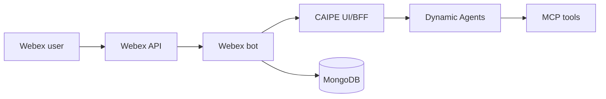

# Webex Bot

The CAIPE Webex bot brings dynamic-agent chat into Webex spaces.

## Architecture



The bot calls the UI/BFF through `CAIPE_API_URL`. The BFF enforces access,
creates or resumes conversations, and streams responses through Dynamic Agents.

## Features

- Direct-message and group-space support
- Thread-aware follow-ups with bounded Webex thread context
- MongoDB-backed route, team, and link metadata
- Adaptive Cards for structured responses, HITL forms, and feedback
- Optional service-account authentication for BFF calls

## Important Environment Variables

| Variable | Purpose |
|---|---|
| `WEBEX_INTEGRATION_BOT_ACCESS_TOKEN` | Webex bot token |
| `CAIPE_API_URL` | UI/BFF base URL |
| `WEBEX_AGENT_ROUTES_MODE` | `db_prefer`, `config`, or `db_only` |
| `WEBEX_DEFAULT_TEAM_SLUG` | Team used for auto-assignment |
| `WEBEX_DEFAULT_AGENT_ID` | Dynamic-agent ID used for auto-assignment |
| `WEBEX_THREAD_CONTEXT_ENABLED` | Include bounded thread context |
| `MONGODB_URI` | Route/link/team metadata storage |
| `MONGODB_DATABASE` | MongoDB database name |

Sensitive Webex and OAuth values belong in Kubernetes Secrets or ExternalSecrets.

## Helm

```yaml
tags:
  webex-bot: true

webex-bot:
  config:
    CAIPE_API_URL: http://ai-platform-engineering-caipe-ui:3000
    WEBEX_AGENT_ROUTES_MODE: db_prefer
    WEBEX_DEFAULT_AGENT_ID: platform-engineer
  existingSecret: webex-bot-secrets
```

See the [webex-bot chart reference](../installation/helm-charts/ai-platform-engineering/webex-bot.md)
for chart values.
