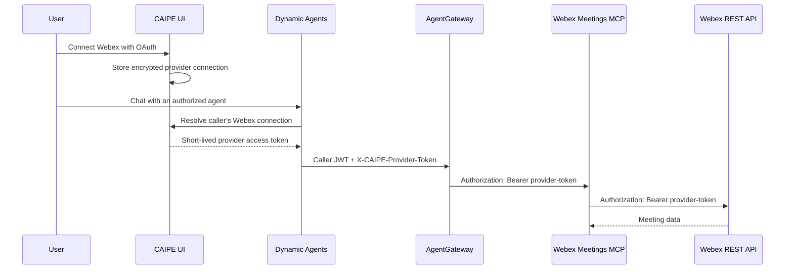

# Webex Meetings MCP

The Webex Meetings MCP exposes per-user Webex meeting, participant, recording,
and transcript operations to Dynamic Agents. It runs as one shared MCP service,
but each tool call uses the connected Webex account of the caller.

## Authentication flow



The CAIPE caller JWT remains in the request `Authorization` header until
AgentGateway authorizes the tool call. The provider token is carried separately
in `X-CAIPE-Provider-Token`. AgentGateway then rewrites the provider token into
the upstream `Authorization` header for the MCP server.

The MCP service does not store OAuth credentials or query MongoDB. Credential
storage, refresh, and caller-scoped connection selection belong to the CAIPE UI
credential service and Dynamic Agents runtime.

## Tools

| Tool | Purpose |
|---|---|
| `webex_list_meetings` | List or search meetings |
| `webex_userhub_calendar` | Best-effort User Hub calendar lookup |
| `webex_resolve_meeting_link` | Resolve a Webex join link through the meetings API |
| `webex_get_meeting_status` | Read meeting details and optional participants |
| `webex_create_meeting` | Schedule a meeting |
| `webex_update_meeting` | Update a scheduled meeting |
| `webex_delete_meeting` | Delete a scheduled meeting |
| `webex_list_recordings` | List meeting recordings |
| `webex_list_transcripts` | List and optionally download transcripts |

## Minimum Webex scopes

The local MCP calls the Webex REST API directly. For read-only meeting listing
and lookup, the minimum is `meeting:schedules_read`. To support the MCP's full
tool surface, enable the scopes required by the capabilities you expose:

| Scope | Required by |
|---|---|
| `meeting:schedules_read` | List/get meetings, resolve links, and read the current meeting before an update |
| `meeting:schedules_write` | Create, update, and delete meetings |
| `meeting:participants_read` | Optional participant expansion in `webex_get_meeting_status` |
| `meeting:recordings_read` | `webex_list_recordings` |
| `meeting:transcripts_read` | `webex_list_transcripts` and transcript downloads |

Add `spark:people_read` when CAIPE should display the connected user's Webex
profile through `/v1/people/me`. This scope is useful for the Connected Apps UI,
but the meeting tools themselves do not require it.

The following scopes are not required by the current local MCP:

- `spark:mcp` is for the Webex-hosted MCP service, not this local REST proxy.
- `meeting:summaries_read` is unnecessary because this MCP has no summary tool.
- Messaging, membership, room, admin, compliance, and write scopes unrelated to
  the tools above should not be requested unless another integration needs them.

`webex_userhub_calendar` calls a best-effort Webex User Hub endpoint rather than
a public Webex REST resource. Webex does not publish a separate OAuth scope
contract for that endpoint, so do not treat it as a guaranteed integration API.

Every scope in an OAuth authorization request must also be enabled on the Webex
Integration in the Webex developer portal. Otherwise Webex returns
`invalid_scope`. After changing scopes, restart the UI so deployment-configured
connectors are reconciled, then reconnect the Webex account to obtain a token
with the new grants.

See the Webex documentation for the
[Meetings API scopes](https://developer.webex.com/meeting/docs/meetings).

## Helm configuration

This example enables the MCP, provisions a Webex OAuth provider, routes tool
calls through AgentGateway, and registers the MCP with Dynamic Agents. Replace
the release name, namespace, public URL, and secret store values for your
environment.

```yaml
tags:
  caipe-ui: true
  dynamic-agents: true
  mcp-webex-meetings: true

global:
  agentgateway:
    enabled: true

mcp-webex-meetings:
  nameOverride: mcp-webex-meetings
  mcpSecrets:
    requiresSecret: false
  mcp:
    mode: http
    port: 8000
    agentgateway:
      enabled: true
      id: webex_meetings
      pathPrefix: /mcp/webex_meetings
      protocol: StreamableHTTP
      credential_sources:
        - kind: provider_connection
          name: X-CAIPE-Provider-Token
          provider: webex
          target: header

caipe-ui:
  config:
    CAIPE_CREDENTIALS_ENABLED: "true"
    CREDENTIAL_BOOTSTRAP_OAUTH_CONNECTORS: "false"

  oauthConnectors:
    - provider: webex
      name: Webex
      clientIdEnv: WEBEX_CLIENT_ID
      clientSecretEnv: WEBEX_CLIENT_SECRET
      authorizationUrl: https://webexapis.com/v1/authorize
      tokenUrl: https://webexapis.com/v1/access_token
      redirectUri: https://caipe.example.com/api/credentials/oauth/webex/callback
      scopes:
        - meeting:schedules_read
        - meeting:schedules_write
        - meeting:participants_read
        - meeting:recordings_read
        - meeting:transcripts_read
        - spark:people_read

  externalSecrets:
    enabled: true
    secretStoreRef:
      name: vault
      kind: ClusterSecretStore
    data:
      - secretKey: WEBEX_CLIENT_ID
        remoteRef:
          key: projects/caipe/oauth-connectors
          property: WEBEX_CLIENT_ID
      - secretKey: WEBEX_CLIENT_SECRET
        remoteRef:
          key: projects/caipe/oauth-connectors
          property: WEBEX_CLIENT_SECRET

  appConfig:
    mcp_servers:
      - id: webex_meetings
        name: Webex Meetings
        description: Webex meeting, recording, and transcript tools
        transport: http
        enabled: true
        endpoint: http://caipe-agentgateway:4000/mcp/webex_meetings
        source: agentgateway
        agentgateway_endpoint: http://caipe-agentgateway:4000/mcp/webex_meetings
        agentgateway_target_endpoint: http://caipe-mcp-webex-meetings-mcp.caipe.svc.cluster.local:8000/mcp
        credential_sources:
          - kind: provider_connection
            name: X-CAIPE-Provider-Token
            provider: webex
            target: header
```

The redirect URI path must use the same provider ID as `provider`. Register that
exact URI on the Webex Integration before users connect.

## Multiple provider variants

Multiple logical MCP entries can share the same Webex Meetings pod. Give each
OAuth connector a unique provider ID, then use that ID in the MCP row's
`credential_sources`:

```yaml
caipe-ui:
  oauthConnectors:
    - provider: webex_secondary
      name: Webex Secondary
      clientIdEnv: WEBEX_SECONDARY_CLIENT_ID
      clientSecretEnv: WEBEX_SECONDARY_CLIENT_SECRET
      authorizationUrl: https://webexapis.com/v1/authorize
      tokenUrl: https://webexapis.com/v1/access_token
      redirectUri: https://caipe.example.com/api/credentials/oauth/webex_secondary/callback
      scopes:
        - meeting:schedules_read
        - meeting:schedules_write
        - meeting:participants_read
        - meeting:recordings_read
        - meeting:transcripts_read

  appConfig:
    mcp_servers:
      - id: webex_meetings_secondary
        name: Webex Meetings Secondary
        transport: http
        enabled: true
        endpoint: http://caipe-agentgateway:4000/mcp/webex_meetings_secondary
        agentgateway_target_endpoint: http://caipe-mcp-webex-meetings-mcp.caipe.svc.cluster.local:8000/mcp
        credential_sources:
          - kind: provider_connection
            name: X-CAIPE-Provider-Token
            provider: webex_secondary
            target: header

global:
  agentgateway:
    extraMcpTargets:
      - id: webex_meetings_secondary
        host: caipe-mcp-webex-meetings-mcp.caipe.svc.cluster.local
        port: 8000
        pathPrefix: /mcp/webex_meetings_secondary
        protocol: StreamableHTTP
        providerTokenAuth: true
```

This creates a second credential and routing identity, not a second MCP
Deployment. Agents select a variant by listing its MCP server ID under
`allowed_tools`.
