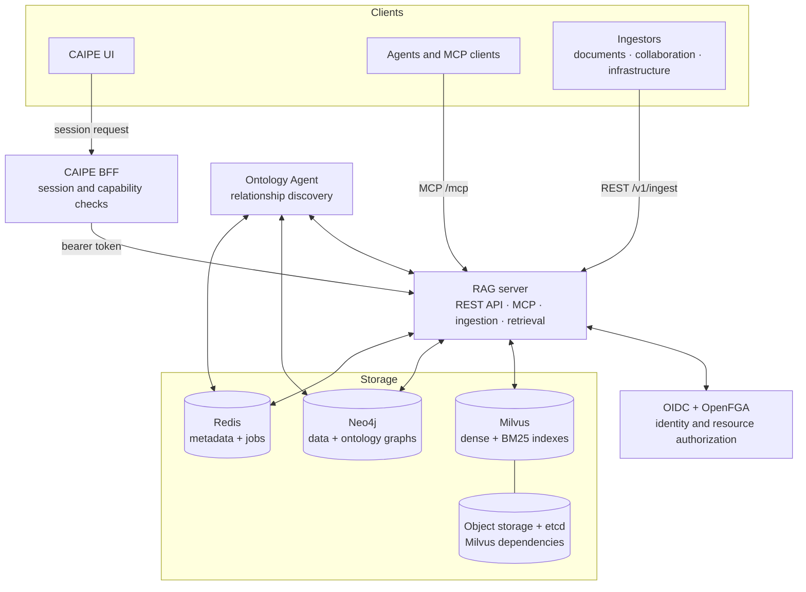
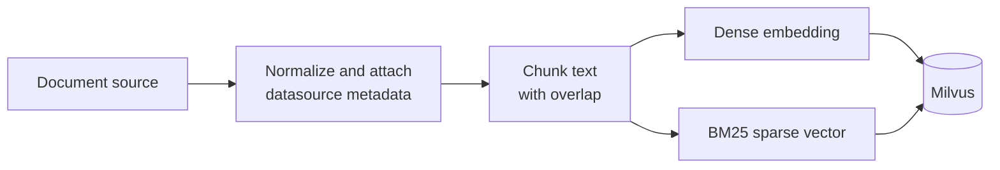
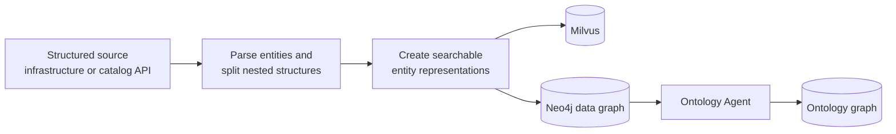
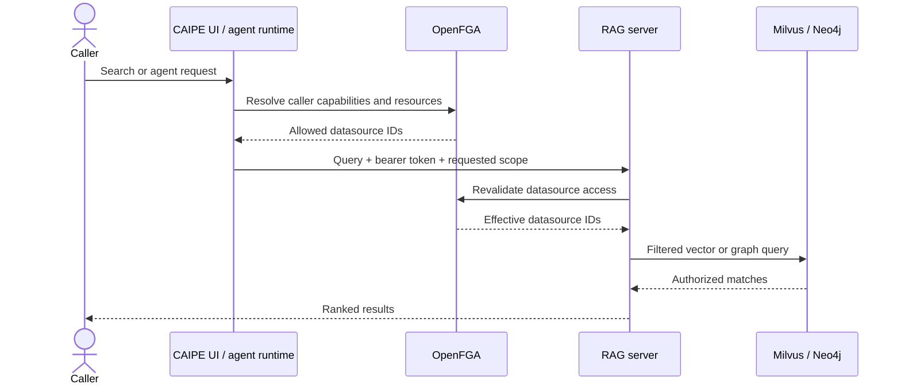

# Knowledge Bases architecture

This page describes how CAIPE ingests, authorizes, searches, and serves organizational knowledge. For implementation details and environment variables, see the [RAG codebase architecture](https://github.com/caipe-io/ai-platform-engineering/tree/main/ai_platform_engineering/knowledge_bases/rag/Architecture.md).

## Component architecture

### Core components

| Component | Default port | Responsibility |
|-----------|--------------|----------------|
| **CAIPE UI and BFF** | 3000 | Datasource management, collections, search, graph exploration, and authenticated API proxying |
| **RAG server** | 9446 | Ingestion, hybrid search, graph operations, REST APIs, and MCP tools |
| **Ontology Agent** | 8098 | Optional background discovery and validation of entity relationships |
| **Ingestors** | Varies | Retrieve data from external systems and submit normalized content or entities |

OIDC establishes caller identity. OpenFGA relationships decide which knowledge-base actions and resources that identity may use. The RAG server enforces datasource authorization even when a request has already passed through the UI BFF.

## Document ingestion

1. An ingestor retrieves source content and associates every item with a datasource ID.
2. The RAG server normalizes and chunks the text while preserving useful metadata.
3. An embedding provider creates dense semantic vectors.
4. Milvus produces and indexes BM25 sparse vectors for keyword matching.
5. Milvus stores both representations for filtered hybrid retrieval.

Datasource IDs are part of the security boundary. Reloading a datasource replaces its indexed content and removes stale pages while preserving its ownership and Search grants.

## Structured-entity ingestion

Structured ingestors can submit entities and relationships instead of document pages. The server splits nested structures into connected entities, makes their properties searchable, and stores their relationships in Neo4j when Graph RAG is enabled.

The Ontology Agent examines entity types and properties, finds candidate relationships, evaluates them, and writes accepted relationships to the ontology graph.

## Authorized query flow

For a direct user search, the requested scope may include every datasource for which the caller has Search access. For an agent request, CAIPE intersects those grants with the data sources and collections selected on the agent. Both paths fail closed when authorization cannot be verified.

## Hybrid retrieval

A query produces a dense vector and a sparse keyword representation. Milvus runs both searches within the authorized datasource filter, then CAIPE combines the result scores with configurable weights.

| Strategy | Semantic weight | Keyword weight | Useful for |
|----------|-----------------|----------------|------------|
| Balanced | 50% | 50% | General-purpose retrieval |
| Semantic | 90% | 10% | Concepts and paraphrased language |
| Keyword | 10% | 90% | Exact identifiers and terms |

These values describe the standard presets. Deployments can tune the weights for their content and evaluation results.

## Storage and supporting services

| Service | Purpose |
|---------|---------|
| **Milvus** | Dense HNSW and sparse BM25 indexes |
| **Neo4j** | Optional data and ontology graphs |
| **Redis** | Datasource metadata, ingestion jobs, and ontology state |
| **Object storage** | Milvus object persistence |
| **etcd** | Milvus metadata coordination |

## Embedding providers

The embedding factory supports provider configurations for:

- Azure OpenAI
- OpenAI
- AWS Bedrock
- Cohere
- Hugging Face
- LiteLLM
- Ollama

Use deployment-owned secrets for credentials. Do not place provider keys in reusable source configuration or documentation examples.

## Port reference

| Port | Service | Protocol |
|------|---------|----------|
| 3000 | CAIPE UI | HTTP |
| 9446 | RAG REST API and MCP server | HTTP / Streamable HTTP |
| 8098 | Ontology Agent | HTTP |
| 7687 | Neo4j | Bolt |
| 7474 | Neo4j Browser | HTTP |
| 19530 | Milvus | gRPC |
| 6379 | Redis | TCP |

Neo4j and the Ontology Agent are required only for the Graph RAG profile.

## Further reading

- [RAG server architecture](https://github.com/caipe-io/ai-platform-engineering/tree/main/ai_platform_engineering/knowledge_bases/rag/server/ARCHITECTURE.md)
- [Ontology Agent](ontology-agent.md)
- [RAG API reference](api-reference.md)
- [Authentication](authentication-overview.md)
