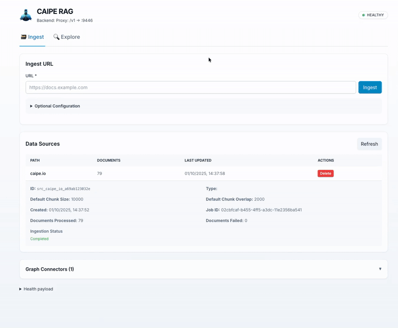

# Knowledge Base Systems

## Overview

CAIPE RAG is an intelligent knowledge platform that combines vector-based retrieval and graph-based reasoning to provide comprehensive, contextually relevant information for AI agents and users.

The platform:

- **Ingests data** from multiple sources (web pages, AWS, Kubernetes, Backstage, Slack, Confluence, and more)
- **Performs hybrid search** combining semantic understanding with keyword matching
- **Maintains a knowledge graph** for entity relationships and complex reasoning
- **Automatically discovers relationships** between entity types using AI-powered ontology agents
- **Exposes MCP tools** for AI agents to search, fetch, and explore the knowledge base


## Key Capabilities

### Hybrid Search

CAIPE RAG uses a dual-vector approach for search:

- **Semantic Search**: Dense vector embeddings capture meaning and context
- **Keyword Search**: BM25 sparse vectors match exact terms and phrases
- **Weighted Reranking**: Configurable balance between semantic and keyword results

### Knowledge Graph

When Graph RAG is enabled, the system stores structured entities in Neo4j:

- **Entity Storage**: Structured data with properties and relationships
- **Graph Traversal**: Explore entity neighborhoods and find paths between entities
- **Automatic Splitting**: Nested structures are split into connected sub-entities

### Automatic Ontology Discovery

The [Ontology Agent](ontology-agent.md) automatically discovers relationships between entity types:

- Uses fuzzy matching and LLM evaluation to identify valid relationships
- Runs in the background with configurable intervals
- Syncs discovered relationships back to the data graph

## Documentation

| Page | Description |
|------|-------------|
| [Architecture](architecture.md) | System components, data flows, and technology stack |
| [Ingestors](ingestors.md) | Overview of available data source integrations |
| [Ontology Agent](ontology-agent.md) | Automatic relationship discovery system |
| [MCP Tools](mcp-tools.md) | AI agent integration via Model Context Protocol |
| [Authentication](authentication-overview.md) | Security concepts and RBAC overview |

## Getting Started



### Prerequisites

- Docker and Docker Compose
- Environment variables configured (see [Server README](https://github.com/cnoe-io/ai-platform-engineering/tree/main/ai_platform_engineering/knowledge_bases/rag/server/README.md))

### Start All Services

```bash
# Clone the repository
git clone https://github.com/cnoe-io/ai-platform-engineering.git
cd ai-platform-engineering/ai_platform_engineering/knowledge_bases/rag

# Start all services using Docker Compose
docker compose --profile apps up
```

### Access Points

| Interface | URL | Description |
|-----------|-----|-------------|
| Web UI | [http://localhost:9447](http://localhost:9447) | Interactive search and graph visualization |
| API Docs | [http://localhost:9446/docs](http://localhost:9446/docs) | Swagger UI for REST API |
| MCP Endpoint | http://localhost:9446/mcp | Model Context Protocol for AI agents |
| Neo4j Browser | [http://localhost:7474](http://localhost:7474) | Graph database explorer |

### Connect AI Agents

If you use Claude Desktop, VS Code with Copilot, Cursor, or other MCP-compatible tools, connect to the MCP server at:

```
http://localhost:9446/mcp
```

## Supported Data Sources

CAIPE RAG includes ingestors for various data sources. See [Ingestors](ingestors.md) for details.

| Source | Type | Description |
|--------|------|-------------|
| Web Pages | Documents | Crawl sitemaps and web pages |
| AWS | Graph Entities | EC2, S3, RDS, Lambda, EKS, DynamoDB |
| Kubernetes | Graph Entities | Pods, Deployments, Services, CRDs |
| Backstage | Graph Entities | Service catalog entities |
| ArgoCD | Graph Entities | Applications, projects, clusters |
| GitHub | Graph Entities | Organizations, repositories, teams |
| Confluence | Documents | Space pages with incremental sync |
| Slack | Documents | Channel conversations and threads |
| Webex | Documents | Space messages |

## Further Reading

- [Architecture Overview](architecture.md) - Detailed system design and data flows
- [Server README](https://github.com/cnoe-io/ai-platform-engineering/tree/main/ai_platform_engineering/knowledge_bases/rag/server/README.md) - Configuration and deployment
- [GitHub Discussion](https://github.com/cnoe-io/ai-platform-engineering/discussions/196) - Unified RAG design discussion
