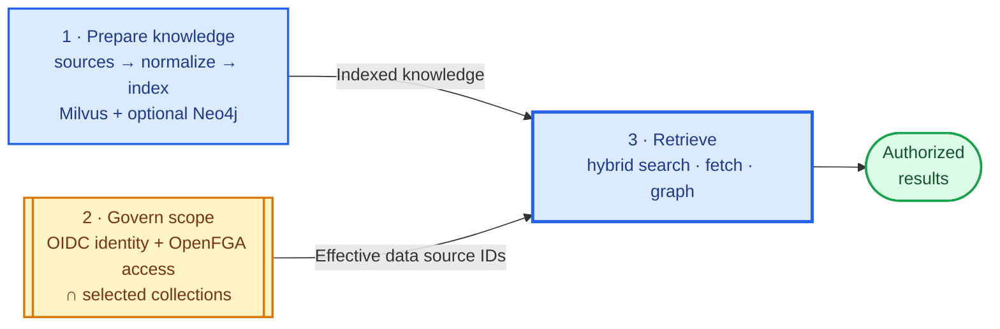
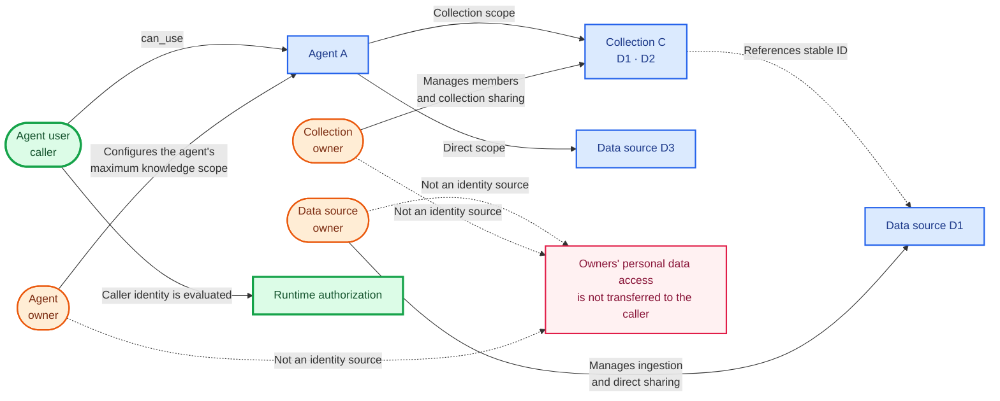
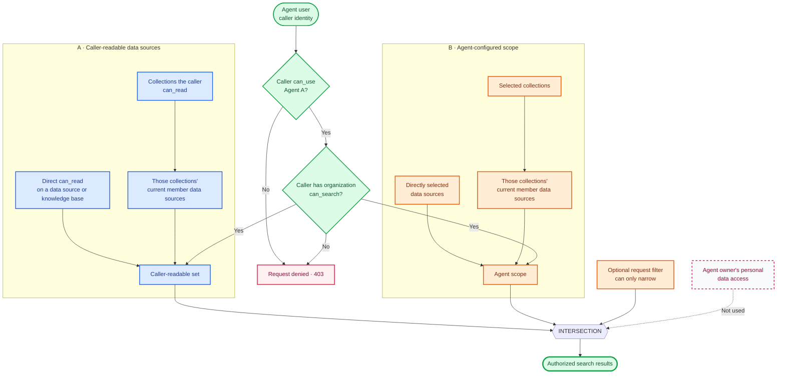

# Knowledge Bases

Use Knowledge Bases to turn organizational information into governed context for
people and agents. They combine hybrid retrieval, optional graph reasoning,
reusable collections, and resource-level access control.

**Quick links**:
[Architecture](architecture.md) · [Ingestors](ingestors.md) ·
[MCP tools](mcp-tools.md) · [Authentication](authentication-overview.md)

## How it works


```mermaid
flowchart LR
  S["1 · Prepare knowledge<br/>sources → normalize → index<br/>Milvus + optional Neo4j"]
  G[["2 · Govern scope<br/>OIDC identity + OpenFGA access<br/>∩ selected collections"]]
  Q["3 · Retrieve<br/>hybrid search · fetch · graph"]
  R(["Authorized<br/>results"])

  S -->|"Indexed knowledge"| Q
  G -->|"Effective data source IDs"| Q
  Q --> R

  classDef process fill:#dbeafe,stroke:#2563eb,color:#1e3a8a,stroke-width:2px
  classDef policy fill:#fef3c7,stroke:#d97706,color:#78350f,stroke-width:2px
  classDef query fill:#dbeafe,stroke:#2563eb,color:#1e3a8a,stroke-width:3px
  classDef outcome fill:#dcfce7,stroke:#16a34a,color:#14532d,stroke-width:2px

  class S process
  class G policy
  class Q query
  class R outcome
```

## Knowledge Bases in the UI

The CAIPE UI includes these Knowledge Bases areas:

| Area | Purpose |
|------|---------|
| **Search** | Run hybrid searches across data sources the caller can access |
| **Data Sources** | Create sources and manage ingestion, ownership, and search access |
| **Collections** | Group stable data source IDs into reusable scopes without copying content |
| **Graph** | Explore authorized entity relationships when Graph RAG is enabled |
| **MCP Tools** | Review tools available to agents created in Agent Builder and other MCP clients |

## Data sources

CAIPE supports both self-service sources and deployment-managed ingestors.

### Self-service sources

Users can create these sources from the CAIPE UI when the corresponding ingestor is enabled:

- File
- Web
- Slack
- Confluence
- Jira
- Webex

### Deployment-managed ingestors

Platform operators can configure additional ingestors for sources such as:

- AWS
- Kubernetes
- Backstage
- Argo CD
- GitHub

See [Ingestors](ingestors.md) for availability, configuration, and the type of content each ingestor produces.

## Hybrid search

Document retrieval combines two complementary signals:

- **Semantic search** uses dense vector embeddings to match meaning and context.
- **Keyword search** uses BM25 sparse vectors for exact terms and phrases.
- **Weighted reranking** combines both result sets with configurable weights.

Milvus stores the dense and sparse indexes. Search requests apply data source
constraints before returning ranked results.

## Knowledge graph and ontology

When Graph RAG is enabled, Neo4j stores structured entities and relationships.

- Nested structures can be split into connected sub-entities.
- Authorized users can explore entity neighborhoods and paths.
- The [Ontology Agent](ontology-agent.md) discovers potential relationships
  between entity types, validates them, and synchronizes accepted relationships
  to the data graph.
- The deployment-wide ontology requires unrestricted data source access. Ordinary
  data-graph exploration is filtered to the caller's accessible sources.

## Ownership, search access, and collections

CAIPE keeps ownership, sharing, and runtime access separate. There are four
independent subjects:

| Subject | What they control | What sharing grants |
|---------|-------------------|---------------------|
| **Data source owner** | Connector configuration, ingestion, and direct Search sharing | Read access to that data source |
| **Collection owner** | Collection metadata, member data sources, maintainers, and readers | Read access inherited by the collection's current members |
| **Agent owner** | Agent configuration, including selected data sources and collections | Permission to use the agent |
| **Agent user** | The request being run | Nothing automatically; this caller's existing permissions are evaluated at runtime |

Ownership controls configuration. When another person runs an agent, CAIPE does
not borrow the data access of the data source, collection, or agent owner.


```mermaid
flowchart LR
  DSO(["Data source<br/>owner"]) -->|"Manages ingestion<br/>and direct sharing"| DS["Data source D1"]
  CO(["Collection<br/>owner"]) -->|"Manages members<br/>and collection sharing"| C["Collection C<br/>D1 · D2"]
  AO(["Agent<br/>owner"]) -->|"Configures the agent's<br/>maximum knowledge scope"| A["Agent A"]
  U(["Agent user<br/>caller"]) -->|"can_use"| A

  C -. "References stable ID" .-> DS
  A -->|"Collection scope"| C
  A -->|"Direct scope"| D3["Data source D3"]
  U -->|"Caller identity is evaluated"| R["Runtime authorization"]

  N["Owners' personal data access<br/>is not transferred to the caller"]
  AO -. "Not an identity source" .-> N
  CO -. "Not an identity source" .-> N
  DSO -. "Not an identity source" .-> N

  classDef owner fill:#ffedd5,stroke:#ea580c,color:#7c2d12,stroke-width:2px
  classDef resource fill:#dbeafe,stroke:#2563eb,color:#1e3a8a,stroke-width:2px
  classDef caller fill:#dcfce7,stroke:#16a34a,color:#14532d,stroke-width:3px
  classDef warning fill:#fff1f2,stroke:#e11d48,color:#881337,stroke-width:2px

  class DSO,CO,AO owner
  class DS,C,A,D3 resource
  class U,R caller
  class N warning
```

A collection is a control-plane grouping. It references data source IDs without
copying chunks or changing vector storage. A caller with `can_read` on a
collection inherits `can_read` on its current member data sources. Collection
publishing and management remain separate from content read access.

## Agent knowledge scope

Agent Builder can attach individual data sources and collections to an agent.

Runtime access is evaluated in this order:

1. The caller must have `can_use` on the agent.
2. The caller must have the organization-level `can_search` capability.
3. CAIPE resolves data sources the caller can read. Direct data source or
   knowledge-base grants and collection-inherited grants are combined.
4. CAIPE resolves the agent's configured scope from its directly selected data
   sources and the current members of its selected collections.
5. Search receives only the intersection of the caller-readable set, the agent
   scope, and any narrower request filter.


```mermaid
flowchart TB
  U(["Agent user<br/>caller identity"])
  G1{"Caller can_use<br/>Agent A?"}
  G2{"Caller has organization<br/>can_search?"}
  DENY["Request denied · 403"]

  U --> G1
  G1 -->|"No"| DENY
  G1 -->|"Yes"| G2
  G2 -->|"No"| DENY

  subgraph CALLER["A · Caller-readable data sources"]
    DIRECT["Direct can_read<br/>on a data source or knowledge base"]
    CR["Collections the caller<br/>can_read"]
    MEMBERS["Those collections'<br/>current member data sources"]
    READABLE["Caller-readable set"]
    DIRECT --> READABLE
    CR --> MEMBERS --> READABLE
  end

  subgraph AGENT["B · Agent-configured scope"]
    ADS["Directly selected<br/>data sources"]
    AC["Selected collections"]
    ACM["Those collections'<br/>current member data sources"]
    SCOPE["Agent scope"]
    ADS --> SCOPE
    AC --> ACM --> SCOPE
  end

  G2 -->|"Yes"| READABLE
  G2 -->|"Yes"| SCOPE
  READABLE --> I{{"INTERSECTION"}}
  SCOPE --> I
  F["Optional request filter<br/>can only narrow"] --> I
  I --> RESULT(["Authorized search results"])

  OWNER["Agent owner's personal<br/>data access"] -. "Not used" .-> I

  classDef gate fill:#dcfce7,stroke:#16a34a,color:#14532d,stroke-width:2px
  classDef denied fill:#fff1f2,stroke:#e11d48,color:#881337,stroke-width:2px
  classDef permission fill:#dbeafe,stroke:#2563eb,color:#1e3a8a,stroke-width:2px
  classDef scope fill:#ffedd5,stroke:#ea580c,color:#7c2d12,stroke-width:2px
  classDef result fill:#dcfce7,stroke:#16a34a,color:#14532d,stroke-width:3px
  classDef excluded fill:#f8fafc,stroke:#e11d48,color:#881337,stroke-width:2px,stroke-dasharray:5 5

  class U,G1,G2 gate
  class DENY denied
  class DIRECT,CR,MEMBERS,READABLE permission
  class ADS,AC,ACM,SCOPE,F scope
  class RESULT result
  class OWNER excluded
```

The caller's readable set is therefore:

```text
direct data source or knowledge-base access
UNION
data sources inherited through readable collections
```

The effective agent result is:

```text
caller-readable data sources
INTERSECT agent-selected data sources and collection members
INTERSECT optional request filter
```

The agent's knowledge configuration is a scope, not a grant. For example, if a
caller can read data source `D1` directly and an agent includes `D1` through a
collection, `D1` remains available even if the caller cannot manage or discover
that collection. Conversely, selecting a collection on an agent never gives the
caller the collection owner's permissions.

For interactive calls, the invoking user's bearer identity is evaluated. For
scheduled or autonomous calls, CAIPE evaluates the task owner's delegated
identity. Explicit service-account calls use that service account's grants. A
missing delegated identity fails closed instead of falling back to the agent
owner or the Dynamic Agents service account.

## MCP access

The RAG server exposes MCP tools for:

- Hybrid search
- Full-document fetch
- Data source and entity-type discovery
- Graph neighborhood exploration
- Path finding and raw graph queries when the caller has the required access

See [MCP Tools](mcp-tools.md) for the current tool names and usage pattern.

## Getting started

Use the repository-level [Quick Start](../getting-started/quick-start) to
configure and start CAIPE. The canonical Docker Compose files live at the
repository root.

After startup, the default local access points are:

| Interface | URL | Availability |
|-----------|-----|--------------|
| CAIPE Knowledge Bases UI | [http://localhost:3000/knowledge-bases](http://localhost:3000/knowledge-bases) | CAIPE UI profile |
| RAG API documentation | [http://localhost:9446/docs](http://localhost:9446/docs) | RAG profile |
| MCP endpoint | `http://localhost:9446/mcp` | RAG profile |
| Neo4j Browser | [http://localhost:7474](http://localhost:7474) | Graph RAG profile only |

For deployment settings, see the
[RAG server README](https://github.com/caipe-io/ai-platform-engineering/tree/main/ai_platform_engineering/knowledge_bases/rag/server/README.md).
