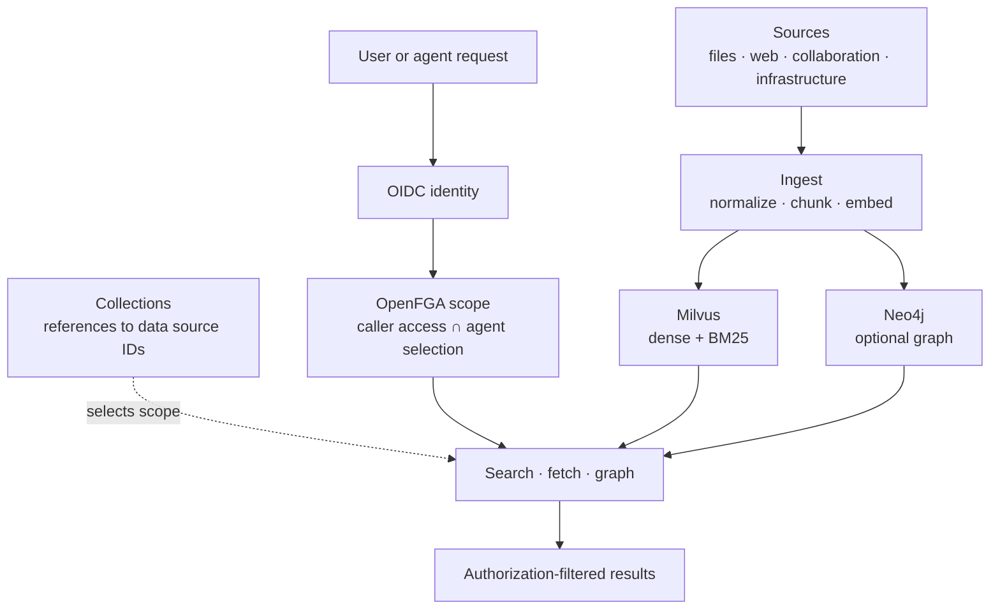

# Knowledge Bases

Use Knowledge Bases to turn organizational information into governed context for
people and agents. They combine hybrid retrieval, optional graph reasoning,
reusable collections, and resource-level access control.

**Quick links**:
[Architecture](architecture.md) · [Ingestors](ingestors.md) ·
[MCP tools](mcp-tools.md) · [Authentication](authentication-overview.md)

## How it works


```mermaid
flowchart TB
  S["Sources<br/>files · web · collaboration · infrastructure"]
  I["Ingest<br/>normalize · chunk · embed"]
  V["Milvus<br/>dense + BM25"]
  N["Neo4j<br/>optional graph"]
  C["Collections<br/>references to data source IDs"]
  U["User or agent request"]
  A["OIDC identity"]
  X["OpenFGA scope<br/>caller access ∩ agent selection"]
  Q["Search · fetch · graph"]
  R["Authorization-filtered results"]

  S --> I
  I --> V
  I --> N
  C -. "selects scope" .-> Q
  U --> A --> X --> Q
  V --> Q
  N --> Q
  Q --> R
```

## Knowledge Bases in the UI

The CAIPE UI includes these Knowledge Bases areas:

| Area | Purpose |
|------|---------|
| **Search** | Run hybrid searches across data sources the caller can access |
| **Data Sources** | Create sources and manage ingestion, ownership, and search access |
| **Collections** | Group stable data source IDs into reusable scopes without copying content |
| **Graph** | Explore authorized entity relationships when Graph RAG is enabled |
| **MCP Tools** | Review tools available to agents created in Agent Builder and other MCP clients |

## Data sources

CAIPE supports both self-service sources and deployment-managed ingestors.

### Self-service sources

Users can create these sources from the CAIPE UI when the corresponding ingestor is enabled:

- File
- Web
- Slack
- Confluence
- Jira
- Webex

### Deployment-managed ingestors

Platform operators can configure additional ingestors for sources such as:

- AWS
- Kubernetes
- Backstage
- Argo CD
- GitHub

See [Ingestors](ingestors.md) for availability, configuration, and the type of content each ingestor produces.

## Hybrid search

Document retrieval combines two complementary signals:

- **Semantic search** uses dense vector embeddings to match meaning and context.
- **Keyword search** uses BM25 sparse vectors for exact terms and phrases.
- **Weighted reranking** combines both result sets with configurable weights.

Milvus stores the dense and sparse indexes. Search requests apply data source
constraints before returning ranked results.

## Knowledge graph and ontology

When Graph RAG is enabled, Neo4j stores structured entities and relationships.

- Nested structures can be split into connected sub-entities.
- Authorized users can explore entity neighborhoods and paths.
- The [Ontology Agent](ontology-agent.md) discovers potential relationships
  between entity types, validates them, and synchronizes accepted relationships
  to the data graph.
- The deployment-wide ontology requires unrestricted data source access. Ordinary
  data-graph exploration is filtered to the caller's accessible sources.

## Ownership, search access, and collections

Data source administration and content access are separate.

- Each data source has one owner: a person or team that manages its configuration.
- Search access is granted independently to people or teams.
- A collection references data source IDs without duplicating chunks or changing
  vector storage.
- Updating collection membership changes the scope used by connected agents without editing each agent.
- Authorization fails closed when CAIPE cannot verify access.

## Agent knowledge scope

Agent Builder can attach individual data sources and collections to an agent.

The effective scope is:

```text
agent-selected sources and collection members
∩
data sources the invoking caller can search
```

The agent selection can narrow the caller's scope but never grants access to
additional knowledge. An agent with no selected sources or collections cannot
use RAG tools.

## MCP access

The RAG server exposes MCP tools for:

- Hybrid search
- Full-document fetch
- Data source and entity-type discovery
- Graph neighborhood exploration
- Path finding and raw graph queries when the caller has the required access

See [MCP Tools](mcp-tools.md) for the current tool names and usage pattern.

## Getting started

Use the repository-level [Quick Start](../getting-started/quick-start) to
configure and start CAIPE. The canonical Docker Compose files live at the
repository root.

After startup, the default local access points are:

| Interface | URL | Availability |
|-----------|-----|--------------|
| CAIPE Knowledge Bases UI | [http://localhost:3000/knowledge-bases](http://localhost:3000/knowledge-bases) | CAIPE UI profile |
| RAG API documentation | [http://localhost:9446/docs](http://localhost:9446/docs) | RAG profile |
| MCP endpoint | `http://localhost:9446/mcp` | RAG profile |
| Neo4j Browser | [http://localhost:7474](http://localhost:7474) | Graph RAG profile only |

For deployment settings, see the
[RAG server README](https://github.com/caipe-io/ai-platform-engineering/tree/main/ai_platform_engineering/knowledge_bases/rag/server/README.md).
