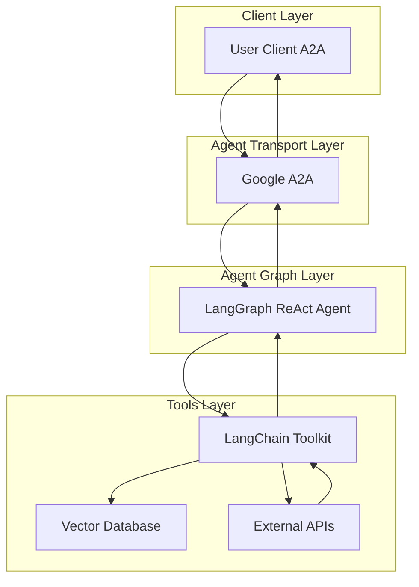

# RAG Agent

- 🤖 **RAG Agent** is an LLM-powered Retrieval-Augmented Generation agent built using the [LangGraph ReAct Agent](https://langchain-ai.github.io/langgraph/agents/agents/) workflow.
- 📚 **Knowledge Retrieval:** Integrates with vector databases like Milvus to retrieve relevant context for queries.
- 🌐 **Protocol Support:** Compatible with [A2A](https://github.com/google/A2A) protocol for seamless integration with external user clients.
- 🛡️ **Secure by Design:** Supports token-based authentication and RBAC for controlled access to data sources.
- 🏭 **Integrations:** Utilizes [langchain-toolkit](https://github.com/langchain-ai/langchain-toolkit) for connecting external APIs and databases to the agent graph.

---

## Architecture



---

## ⚙️ Local Development Setup

### Prerequisites

- Docker and Docker Compose installed
- A configured `.env` file with necessary environment variables

### 1️⃣ Environment Configuration

Update your `.env` file with the following KB-RAG specific variables:

```bash
# Enable KB-RAG functionality
ENABLE_KB_RAG=true

# Vector store collection name (derived from ingestion API)
# Format: rag_YYYYMMDD_<hash>
VSTORE_COLLECTION=rag_default
```

### 2️⃣ Configure Routing Prompt

Update the `prompt_config.yaml` file to customize how the supervisor agent routes questions to the KB-RAG agent. You'll need to modify the `kb-rag` section to match your specific RAG documentation and use case.

The default prompt configuration is:
```yaml
kb-rag:
  system_prompt: |
    If the user's prompt platform outshift docs, so if it sounds like an internal question that would refer to a documentation, then route to kb-rag.
```

**Example prompts for different use cases:**

For general documentation:
```yaml
kb-rag:
  system_prompt: |
    Route to kb-rag when users ask questions about documentation, how-to guides, API references, troubleshooting steps, or any knowledge that would be found in technical documentation.
```

For platform-specific documentation:
```yaml
kb-rag:
  system_prompt: |
    Route to kb-rag for questions about our internal platform documentation, deployment guides, architecture decisions, best practices, runbooks, or any company-specific technical knowledge.
```

For product documentation:
```yaml
kb-rag:
  system_prompt: |
    Route to kb-rag when users ask about product features, user guides, configuration options, integration instructions, or any product-related documentation questions.
```

**💡 Prompt Engineering Tips:**
- Be specific about what types of questions should be routed to KB-RAG
- Include keywords that are common in your documentation domain
- Consider the context of your ingested knowledge base
- Test different prompts to ensure proper routing accuracy

### 3️⃣ Start the RAG Services

Run the following command from the main repository root to start the KB-RAG services:

```bash
docker compose --profile kb-rag --profile p2p up
```

This command will start:
- **kb-rag-agent**: The main RAG agent service (accessible on port 8009)
- **milvus-standalone**: Vector database for storing embeddings (port 19530)
- **etcd**: Coordination service for Milvus
- **milvus-minio**: Object storage for Milvus (port 9000)
- **platform-engineer-p2p**: Main platform engineer with KB-RAG integration (port 8000)

### 4️⃣ Verify Setup

Once the services are running, you can verify the setup by:

1. **Check service health**: All containers should be running and healthy
2. **Access the main platform engineer**: Available at `http://localhost:8000`
3. **Access the RAG agent directly**: Available at `http://localhost:8009`
4. **Milvus Admin UI**: Available at `http://localhost:9091`

### 5️⃣ Configuration Details

#### Environment Variables

Add these two variables to your `.env` file along with all your other existing environment variables:

**ENABLE_KB_RAG**: Set to `true` to enable the KB-RAG functionality in the platform engineer. When enabled, the platform engineer will route documentation-related queries to the RAG agent for enhanced responses using the ingested knowledge base.

**VSTORE_COLLECTION**: Specifies which collection in the Milvus vector database to use for document retrieval. By default, the ingestion API creates collections with the name `rag_default`, so you can use this default value unless you've customized the collection name in your ingestion API configuration. If you have changed the default collection name in the ingestion API config, then use whatever collection name you configured.

Example `.env` configuration:
```bash
# ... your other existing environment variables ...

# KB-RAG Configuration
ENABLE_KB_RAG=true
VSTORE_COLLECTION=rag_default
```

### 6️⃣ Using the RAG Agent

Once configured and running, the RAG agent can:
- Answer questions based on ingested documentation
- Provide contextual responses using retrieved knowledge
- Integrate seamlessly with the platform engineer's multi-agent workflow

The agent is accessible through the A2A protocol and will automatically be included in the platform engineer's routing when `ENABLE_KB_RAG=true`.