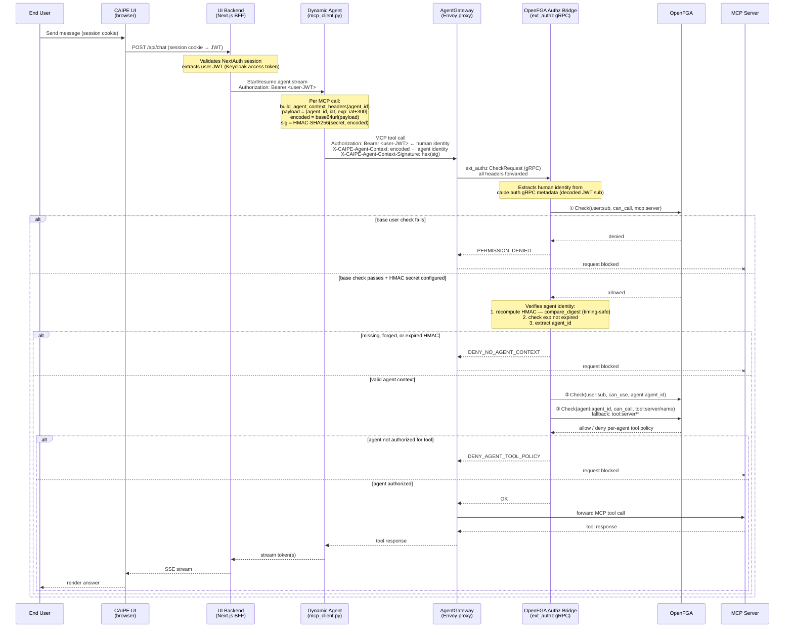

# Agent Context HMAC

When an agent makes an MCP tool call, CAIPE uses a short-lived HMAC-signed
context header to bind the call to a specific agent identity. The
OpenFGA Authz Bridge uses this to enforce per-agent tool policy on top of the
base user authorization check.

## How it works



## Key points

| Property | Detail |
|---|---|
| Header | `X-CAIPE-Agent-Context` (base64url payload) + `X-CAIPE-Agent-Context-Signature` (hex HMAC-SHA256) |
| TTL | 5 minutes (`exp = iat + 300`) — prevents replay; created fresh per MCP call |
| Comparison | `hmac.compare_digest` — timing-safe |
| Secret | `CAIPE_AGENT_CONTEXT_HMAC_SECRET` shared between Dynamic Agents and the Authz Bridge |
| Fallback | Secret not set → headers omitted → bridge skips per-agent check (coarse user-level authz only) |

## OpenFGA checks

The bridge runs three checks in sequence:

1. **User → MCP server** — `user:sub can_call mcp:server`
2. **User → Agent** — `user:sub can_use agent:agent_id`
3. **Agent → Tool** — `agent:agent_id can_call tool:server/name` (falls back to `tool:server/*` wildcard)

All three must pass for the request to reach the MCP server.

## Configuration

```yaml
# Dynamic Agents
CAIPE_AGENT_CONTEXT_HMAC_SECRET: <random-256-bit-hex>

# OpenFGA Authz Bridge (same value)
AGENT_CONTEXT_HMAC_SECRET: <same-value>
```

Generate a secret with:

```bash
openssl rand -hex 32
```
