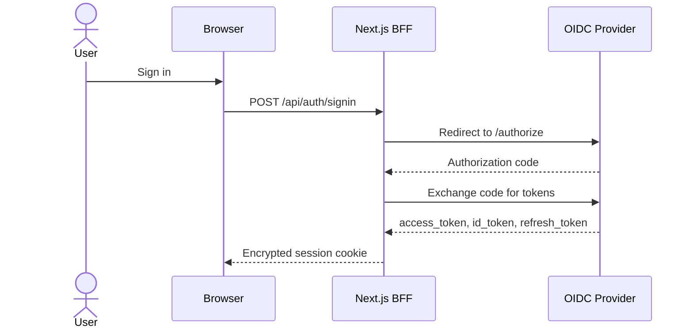
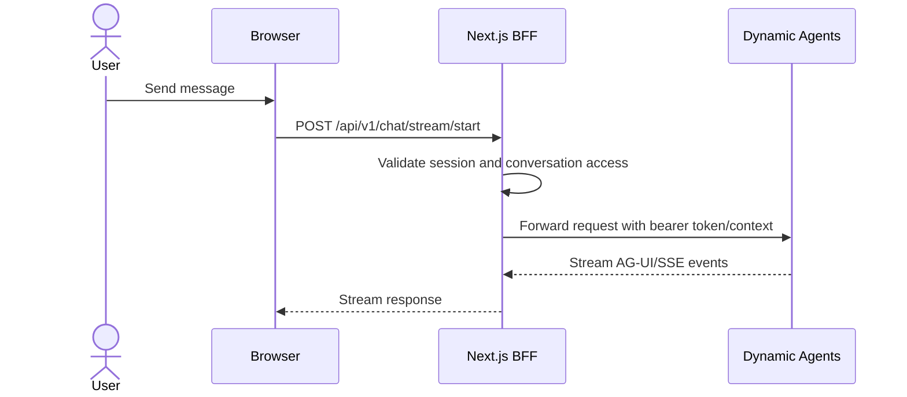

# Authentication Flow

The CAIPE UI uses NextAuth for browser sessions and forwards validated server
credentials from the BFF to backend services such as Dynamic Agents, RAG, and
AgentGateway.

## Components

- **Browser**: renders the React UI and calls Next.js API routes.
- **Next.js BFF**: owns session validation, RBAC checks, service-account flows,
  and backend proxying.
- **OIDC provider**: Keycloak, Okta, Azure AD, or another OpenID Connect IdP.
- **Dynamic Agents**: validates bearer tokens for direct service calls and
  receives BFF-forwarded chat requests.
- **OpenFGA / AgentGateway**: enforces tool and MCP-server access on the data
  path when RBAC runtime is enabled.

## Login



## Chat Request



The browser does not need direct network access to Dynamic Agents. Set
`DYNAMIC_AGENTS_URL` on the UI server so the BFF can reach the runtime.

## Token Refresh

NextAuth refreshes access tokens before expiry when the provider issues refresh
tokens. If refresh fails, the session receives an error flag and the UI prompts
the user to sign in again.

## Required Environment

```bash
SSO_ENABLED=true
OIDC_ISSUER=https://idp.example.com/realms/caipe
OIDC_CLIENT_ID=caipe-ui
OIDC_CLIENT_SECRET=<secret>
NEXTAUTH_SECRET=<random-secret>
NEXTAUTH_URL=https://caipe.example.com
DYNAMIC_AGENTS_URL=http://dynamic-agents:8001
```

For local Docker Compose with bundled Keycloak, `.env.example` provides working
development defaults.
