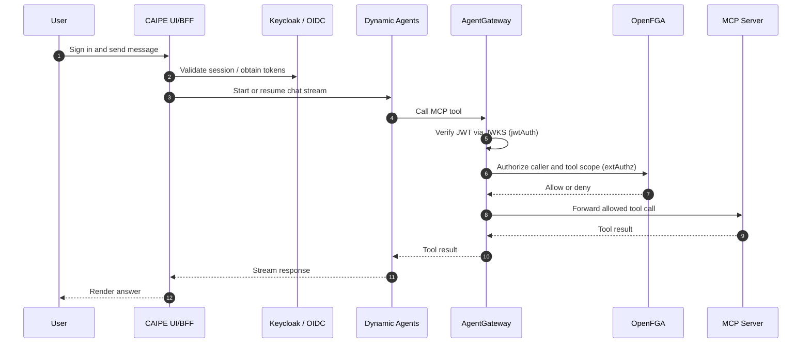

# Security & Auth Flows

CAIPE security is enforced in layers: the BFF owns the browser session, Dynamic
Agents validates bearer tokens, AgentGateway is the single MCP Policy
Enforcement Point, and OpenFGA handles all relationship-based authorization
decisions.

## Overview

## Controls

| Control | Purpose |
|---|---|
| NextAuth / OIDC | Browser session authentication |
| Keycloak | Identity provider, service accounts, token exchange |
| OpenFGA | Relationship and scope authorization (ReBAC) |
| AgentGateway | MCP route enforcement — jwtAuth + extAuthz |
| Agent Context HMAC | Per-agent tool policy via signed request headers |
| Audit service | Central audit log ingestion and querying |

## Flows

| Flow | Where |
|---|---|
| Login and session (OIDC, NextAuth, token refresh) | [Auth Flow](./auth-flow.md) |
| AgentGateway jwtAuth + extAuthz + MCP proxy | [AgentGateway](../architecture/gateway.md) |
| Agent identity HMAC — end to end with OpenFGA checks | [Agent Context HMAC](./agent-context-hmac.md) |
| RBAC role assignment and permission workflows | [RBAC Workflows](./rbac/workflows.md) |
| Enterprise identity federation (Keycloak + external IdP) | [Enterprise Identity Federation](../architecture/enterprise-identity-federation.md) |
| Slack bot authorization flows | [Slack Bot Authorization](../architecture/slack-bot-authorization.md) |
| Service accounts (bot credentials, create/rotate/revoke) | [RBAC Architecture — Service Accounts](./rbac/architecture.md#service-accounts-self-service-bot-identities) |

## RBAC

See the [RBAC section](./rbac/index.md) for the OpenFGA policy model, role
definitions, deployment guidance, and per-component authorization details.
