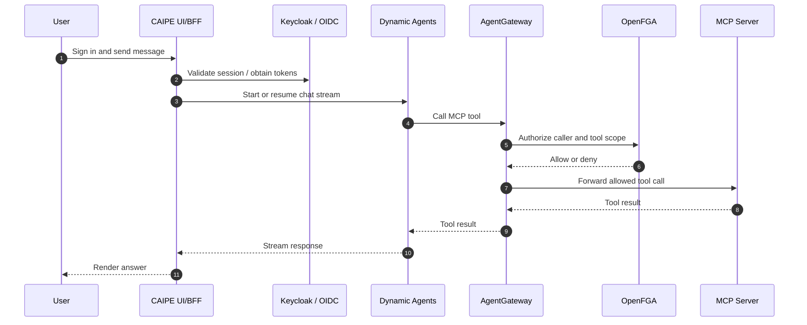

# Security

CAIPE security is enforced across the UI/BFF, Dynamic Agents, MCP routing, and
supporting platform services.

## Request Flow

## Main Controls

| Control | Purpose |
|---|---|
| NextAuth / OIDC | Browser session authentication |
| Keycloak | Identity provider, service accounts, token exchange |
| OpenFGA | Relationship and scope authorization |
| AgentGateway | MCP route enforcement and ext_authz integration |
| Audit service | Central audit log ingestion and querying |
| MongoDB | Persistent UI, agent, route, and checkpoint state |

See the RBAC section for policy model details and deployment guidance.
