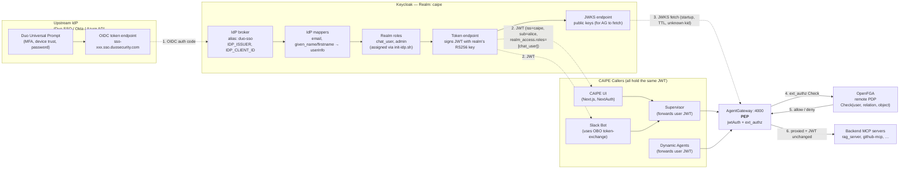
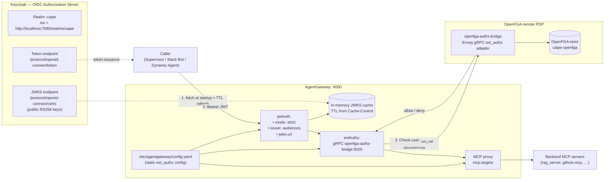

# RBAC Architecture

Component-by-component reference. Each section describes **what it owns**, **what it does NOT own**, and **the env vars / config files / extension points** you'd touch to change its behavior.

> Read [the index](./index.md) first if you want the big-picture mental model and the JWT primer.
> Read [Workflows](./workflows.md) for the request-flow sequence diagrams that tie all of this together.

---

## Component 1: Keycloak — HR & The Front Desk

> **Badge analogy:** HR issues ID badges. The front desk verifies them on entry. Every other door in the building trusts the badge's chip — they don't call HR each time. When a contractor arrives via a partner agency (Duo SSO), the front desk checks with the agency once, creates an internal record, and issues a standard building badge. From that point on, the contractor uses the same badge as everyone else.

**Technically:** Keycloak acts as an OIDC Authorization Server and IdP broker. It proxies login to Duo SSO via an OIDC client, maps external claims to local realm roles, and issues its own signed JWT — so downstream services only ever need to trust one issuer.

### Realm Roles (`caipe` realm)

| Role | Default? | Purpose |
|------|----------|---------|
| `chat_user` | Yes — all authenticated users | Grants baseline chat/supervisor access and first-run OpenFGA bootstrap paths |
| `admin` | No — explicit assignment | Full CAIPE admin UI: user management, team CRUD, role assignment, Keycloak Admin API proxy |
| `kb_admin` | No | Knowledge base management: upload documents, configure RAG pipelines |
| `team_member` | No | Legacy team marker — superseded by `team_member:<slug>` (spec 104) |

`chat_user` is in the `default-roles-caipe` composite, so every newly-created or brokered user gets it automatically. This is patched at runtime by `init-idp.sh` because Keycloak's realm import doesn't reliably populate composite role members.

#### Resource-scoped roles (spec 104 — team-scoped RBAC)

Spec 104 introduced a second tier of realm roles that bind *resources* (tools, agents, teams) to *callers*. They use a `<category>:<id>` naming convention with `:` as the separator. Dynamic Agents still read these roles from `jwt.realm_access.roles`; the AgentGateway path is moving the authoritative decision to OpenFGA through `ext_authz`.

| Pattern | Example | Meaning |
|---------|---------|---------|
| `tool_user:<tool_name>` | `tool_user:jira_search_issues` | Caller may invoke this MCP tool. The tool name is the LangChain-prefixed `<server_id>_<tool>` produced by Dynamic Agents. |
| `tool_user:*` | `tool_user:*` | Wildcard — caller may invoke any MCP tool (admin convenience). |
| `tool_user:<server>_*` | `tool_user:jira_*` | All tools from one MCP server (seeded by `init-idp.sh`; also projected to OpenFGA tuples by Team Resources). |
| `agent_user:<agent_id>` | `agent_user:test-april-2025` | Caller may chat with this dynamic agent (enforced in DA, not AG). |
| `agent_admin:<agent_id>` | `agent_admin:test-april-2025` | Caller may modify the agent's config. Implies `agent_user:<agent_id>`. |
| `team_member:<slug>` | `team_member:demo-team` | Caller belongs to the team. **The role name is keyed on the team `slug`, not the Mongo ObjectId**. The BFF's `members/route.ts` and the reconcile script both write slug-keyed roles and OpenFGA team-member tuples; an earlier ObjectId-keyed implementation existed and is migrated by `scripts/reconcile-keycloak-from-mongo.sh` on first run. |
| `team_admin:<slug>` | `team_admin:demo-team` | Caller manages team membership and resource assignments. |
| `admin_user` | `admin_user` | Realm-wide superuser for the spec-104 model. Bypasses every per-resource check. Distinct from the legacy flat `admin` so we can deprecate the old model later. Granted automatically to every email in `BOOTSTRAP_ADMIN_EMAILS` by `init-idp.sh`. |

Roles are created and assigned by:
- `init-idp.sh` (dev/CI seed; runs in the `keycloak-init` job; reads `BOOTSTRAP_ADMIN_EMAILS` to seed the demo bundle).
- The Admin UI **Team Resources panel** (`Admin → Teams → <team> → Resources` tab, spec 104 Story 4) — checking an agent or tool box calls `PUT /api/admin/teams/[id]/resources`, which:
  1. Ensures the realm role (`agent_user:<id>`, `agent_admin:<id>`, `tool_user:<server>_*`, or `tool_user:*` for the wildcard) exists in Keycloak (idempotent — `ensureRealmRole`).
  2. Resolves each team member's email to a Keycloak `sub` (`findUserIdByEmail`) and applies the add/remove diff via `assignRealmRolesToUser` / `removeRealmRolesFromUser`.
  3. If `OPENFGA_RECONCILE_ENABLED=true`, writes the same relationship intent to OpenFGA before Mongo persistence: `user:<sub> member team:<slug>`, `team:<slug>#member can_use agent:<id>`, `team:<slug>#member can_manage agent:<id>`, and `team:<slug>#member can_call tool:<prefix|*>`.
  4. Persists the selection on the team document in Mongo (`team.resources = { agents, agent_admins, tools, tool_wildcard }`).
  The Resources tab covers Use+Manage per agent and per-MCP-server tool grants plus a single "All tools" wildcard checkbox. Members without a Keycloak account yet (invited but never logged in) are returned in `members_skipped`; the rest of the operation still completes so a single absent user can't brick the panel. Mongo persistence happens **after** Keycloak and OpenFGA reconciliation so an authz-store outage doesn't leave Mongo ahead of the enforcement stores.
- The Admin UI **Team Slack Channels panel** (`Admin → Teams → <team> → Slack Channels` tab, spec 098 US9) — bind Slack channels to a team so the bot resolves the channel's effective team via `channel_team_mappings` (and optionally a default agent via `channel_agent_mappings`). `PUT /api/admin/teams/[id]/slack-channels` is an idempotent full-replace: it deactivates this team's previous mappings that aren't in the new payload (only when `team_id` still matches — never touches another team's rows), upserts the active set, mirrors the bound-agent dropdown into `channel_agent_mappings`, and denormalises a thin `slack_channels` array onto the team document for the team-card chip count. The UI offers a live `conversations.list` discovery picker (server-side `SLACK_BOT_TOKEN` only, 60s in-process cache) plus a manual ID entry fallback for when the bot isn't in the channel yet. The bound-agent dropdown is constrained to `team.resources.agents` so admins can't accidentally bind a channel to an agent the team doesn't otherwise have access to (the backend re-validates).
- The Admin UI **Team Roles panel** (`Admin → Teams → <team> → Roles` tab) — for everything *not* covered by the Resources tab (`admin_user`, `chat_user`, `kb_admin`, `kb_reader:<kb>`, `kb_ingestor:<kb>`, custom roles, etc.). Calls `PUT /api/admin/teams/[id]/roles` with the same idempotent ensure-role + diff-reconcile-members + persist-on-team flow. The GET endpoint surfaces the full realm-role catalog (minus system roles like `default-roles-caipe`/`offline_access`/`uma_authorization`) grouped by category prefix so admins can pick or paste in role names; orphan assignments (roles assigned but no longer in the catalog) are surfaced as a warning so they can be removed.

#### When Realm Roles Are Created

Keycloak realm roles are **not created for every possible resource upfront**. We create them when they become part of policy:

- **Bootstrap roles** (`admin`, `chat_user`, `admin_user`, `tool_user:*`, demo `team_member:<slug>`, demo agent/tool roles) are seeded by `init-idp.sh` so a fresh dev/RBAC stack works immediately.
- **Team membership roles** (`team_member:<slug>`) are created on demand when a team is created or member reconciliation runs. They back Slack active-team checks and are mirrored into OpenFGA team-member tuples.
- **Team resource roles** (`agent_user:<id>`, `agent_admin:<id>`, `tool_user:<prefix>`) are created on demand when an admin saves Team Resources. The BFF calls `ensureRealmRole` for the roles in the diff before assigning/removing them from team members.
- **Catch-all/custom roles** are created from the Team Roles or Roles admin surfaces when an admin explicitly adds them.

Rule of thumb: **Keycloak owns identity and JWT role claims; OpenFGA owns relationship tuples for who is related to which team/resource.** Keycloak does not need a realm role for every OpenFGA tuple, and OpenFGA does not mint JWT claims.

### External IdP Brokering (Duo SSO, Okta, or any OIDC provider)

> **Badge analogy:** The partner agency desk. Whether it's Duo SSO, Okta, or any other corporate identity provider, they all speak the same language (OIDC). Keycloak is the single translator — it talks to whichever agency is configured and converts their badges into standard building badges. The rest of the building never needs to know which agency originally issued the contractor's credentials.

Keycloak acts as a **relying party** to the upstream IdP (OIDC). From the user's perspective it's invisible — they see only the upstream IdP login page. From a security perspective:

```
Browser ──OIDC auth code flow──▶ Keycloak
                                      │
                   ──OIDC auth code──▶ Upstream IdP (Duo SSO / Okta / any OIDC)
                                      │
                   ◀── id_token ───────┘  (external claims: email, name, groups)
                        │
                   Maps external claims to local roles via IdP mappers
                   Issues new Keycloak JWT with realm_access.roles
                        │
Browser ◀── Keycloak JWT ──────────────┘
```

**Supported upstream IdPs** — the `init-idp.sh` script configures any OIDC provider generically via OIDC discovery (`/.well-known/openid-configuration`):

| Provider | `IDP_ALIAS` (in realm) | `IDP_ISSUER` example | Notes |
|----------|----------------------|----------------------|-------|
| Duo SSO | `duo-sso` | `https://sso-xxx.sso.duosecurity.com/oidc/xxx` | Uses `firstname`/`lastname` (non-standard); extra IdP mappers handle both `given_name` and `firstname` |
| Okta (OIDC) | `okta-oidc` | `https://your-org.okta.com` or `https://your-org.okta.com/oauth2/default` | Standard OIDC claims; groups come from Okta's `groups` claim (requires Okta app config) |
| Okta (SAML) | `okta-saml` | — | SAML 2.0; configured as a SAML IdP in Keycloak; attribute mappers needed for groups |
| Microsoft Entra ID (OIDC) | `entra-oidc` | `https://login.microsoftonline.com/{tenant-id}/v2.0` | Standard OIDC; groups claim requires Entra app manifest `groupMembershipClaims` config |
| Microsoft Entra ID (SAML) | `entra-saml` | — | SAML 2.0; common in enterprise M365 environments |
| Generic OIDC | any alias | any OIDC-compliant issuer URL | Works as long as the provider exposes `/.well-known/openid-configuration` |

**To wire up a new IdP**, set these env vars and run `init-idp.sh` (or restart the `init-idp` container — it is idempotent):

```bash
IDP_ALIAS=okta                                 # short alias, used in kc_idp_hint
IDP_DISPLAY_NAME="Okta SSO"                    # shown on Keycloak login page (if visible)
IDP_ISSUER=https://your-org.okta.com           # OIDC issuer URL
IDP_CLIENT_ID=<okta-app-client-id>
IDP_CLIENT_SECRET=<okta-app-client-secret>
IDP_ACCESS_GROUP=caipe-users                   # Okta group → chat_user role (optional)
IDP_ADMIN_GROUP=caipe-admins                   # Okta group → admin role (optional)
OIDC_IDP_HINT=okta                             # auto-redirect browser to this IdP alias
```

**`OIDC_IDP_HINT`** (set in `ui/.env.local`) is passed to Keycloak as `kc_idp_hint` on every auth request. It skips the Keycloak login page entirely and redirects straight to the named IdP. Set it to the same value as `IDP_ALIAS`.

**Claim mapping chain:** The IdP sends `email`, `given_name`/`firstname`, `family_name`/`lastname`, and `groups` claims. Keycloak IdP mappers write these to the local user record. Role mappers translate `IDP_ACCESS_GROUP` membership to `chat_user` and `IDP_ADMIN_GROUP` to `admin`. If neither group var is set, all brokered users receive `chat_user` automatically via a hardcoded role mapper.

> The login sequence diagram (one-time login + the silent first-broker-login flow) lives in [Workflows › Login](./workflows.md#login--first-time-broker-login).

### User Profile & Custom Attributes

Keycloak 26+ enforces a user profile schema. Custom attributes are silently dropped unless declared or `unmanagedAttributePolicy=ADMIN_EDIT` is set. `init-idp.sh` patches both:

- Adds `slack_user_id` to the user profile schema with `admin`-only view/edit permissions
- Sets `unmanagedAttributePolicy=ADMIN_EDIT` so other Admin API attribute writes succeed

### Account Linking (Slack)

Three onboarding paths, evaluated in order:

- **Auto-bootstrap** (default, `SLACK_FORCE_LINK=false`) — bot looks up the Slack user's email, finds an existing Keycloak user, writes `slack_user_id` silently. Zero user action required.
- **Just-In-Time user creation** (default ON, `SLACK_JIT_CREATE_USER=true`, spec 103) — when no existing Keycloak user matches, the bot creates a federated-only shell user via `POST /admin/realms/{realm}/users` using the same `caipe-platform` admin credential. Optional domain allowlist via `SLACK_JIT_ALLOWED_EMAIL_DOMAINS`. 409 races are resolved by re-querying.
- **Explicit link** (`SLACK_FORCE_LINK=true`, or fallback when JIT is off / not allowed / fails) — bot sends an HMAC-signed link prompt; user clicks → SSO login → `slack_user_id` written via Admin API.

The full sequence (including HMAC URL shape, TTL enforcement, JIT request body, error kinds, and post-link OBO flow) is in [Workflows › Slack identity linking](./workflows.md#slack-identity-linking-auto-bootstrap--jit--forced-link).

---

## Component 2: CAIPE UI — The Reception Desk

> **Badge analogy:** The reception desk at each department entrance. When you badge in, it reads your chip (JWT), checks your clearance level for this department, and either waves you through or says "sorry, you don't have access here." It doesn't phone HR — the badge chip already carries everything needed to make the decision.

**Technically:** Next.js App Router with NextAuth (Auth.js v5) for OIDC session management. Every API route handler runs `requireRbacPermission()` which validates the server-side session and enforces role requirements before proxying to backend services.

### Authentication Flow

```
1. Browser visits http://localhost:3000
2. NextAuth detects no session → 302 to Keycloak (OIDC auth code flow)
3. Keycloak → Duo SSO (kc_idp_hint=duo-sso auto-redirects, user never sees KC)
4. Duo SSO login → auth code returned to Keycloak
5. Keycloak issues JWT → NextAuth exchanges code for tokens
6. NextAuth stores { accessToken, refreshToken, sub, roles } in encrypted server-side session cookie
7. Browser receives httpOnly session cookie — raw JWT never touches the browser
```

**Security note:** The JWT is stored in an httpOnly, Secure, SameSite=Lax session cookie managed by NextAuth. Client-side JavaScript cannot read it. The session is encrypted with `NEXTAUTH_SECRET`.

### Server-Side Authorization (`api-middleware.ts`)

```typescript
// Every protected API route:
const { user, session } = await getAuthFromBearerOrSession(request);
await requireRbacPermission(session, "rag", "kb.query");
```

Two authorization paths:

1. **Primary PDP:** `requireRbacPermission()` calls Keycloak Authorization Services with the caller's bearer/session access token and the requested `resource#scope`.
2. **Role-based fallback:** `hasRoleFallback()` checks `realm_access.roles` from the session JWT when the PDP is unavailable or not configured.
3. **Bootstrap admin bypass:** `isBootstrapAdmin(email)` checks the email against `BOOTSTRAP_ADMIN_EMAILS`. This exists for the chicken-and-egg problem: the first admin must be able to log in before Keycloak roles are properly configured. **Remove this env var once roles are working.**

Routes that have not yet been rewritten inline no longer remain session-only: the deprecated `withAuth()` compatibility wrapper now uses `getAuthFromBearerOrSession()`, resolves the route family to a least-privilege RBAC policy, and calls `requireRbacPermission()` before invoking the handler.

### Token Refresh

NextAuth holds the refresh token and silently refreshes the access token before it expires. If the refresh fails (revoked session, Keycloak down), the user is redirected to login. The access token in the session is always the current live token — it's what gets forwarded to backend services.

### Identity Group Sync Hybrid Source Model

Identity Group Sync deliberately has two upstream sources:

1. **OIDC `memberOf` / `groups` claims on login** — Keycloak imports the upstream IdP `groups` claim into the `idp_groups` user attribute and emits it to the `caipe-ui` client as a multivalued `groups` claim in ID token/userinfo responses. When `IDENTITY_SYNC_LOGIN_CLAIMS_ENABLED=true`, `auth-config.ts` extracts the signed-in user's group claims and runs a best-effort reconciliation for only that user. This is additive and fast: it refreshes the user's managed `team_membership_sources` and OpenFGA `user:<sub> member team:<slug>` tuples without storing the full group list in the session cookie. Login is not failed if reconciliation cannot run.
2. **Direct Okta directory API for admin dry-runs** — `/api/admin/identity-group-sync/dry-run` can fetch full group inventory from Okta using server-side IdP credentials when `fetch_from_provider=true` and `provider_id` is an Okta provider. This path is the authoritative source for scheduled/admin sync because it can see users who are not actively logging in, detect removals, produce drift findings, and surface users that still need identity linking before tuples can be written.

The claim path is not a replacement for direct directory querying. It improves freshness for the current user while the directory connector remains responsible for complete inventory and removals.

Identity Group Sync admin APIs use the shared `getAuthFromBearerOrSession` path before `requireRbacPermission`, so browser sessions and validated first-party bearer tokens both reach the same `admin_ui#view` / `admin_ui#admin` PDP checks. Keycloak identity and user administration APIs follow the same pattern: list/detail/stats require `admin_ui#view`, while per-user profile updates, team membership edits, realm role edits, and legacy Mongo role edits require `admin_ui#admin`. Admin observability APIs, including instant/batch PromQL, skill statistics, and checkpoint persistence statistics, require `admin_ui#view` before reaching Prometheus or MongoDB-backed metrics. This keeps Playwright persona tests and future service-triggered sync previews aligned with the UI BFF authorization path.

Manual team management is also provenance-aware. Teams created through `/api/admin/teams` are stamped with `source=manual`, `status=active`, and creator/updater metadata. Manual membership edits create or remove non-managed `team_membership_sources` rows (`source_type=manual`, `managed=false`) so automated Okta/AD/OIDC sync can prune only managed sources. The Team Details members tab reads `/api/admin/identity-group-sync/teams/[teamId]/membership-sources` and displays each member's manual/synced/stale/pending source labels. Team-level admins can edit membership only for teams where they are `owner` or `admin`; unrelated team edits remain denied unless the caller has platform admin permission.

### OpenFGA ReBAC Admin UI

Admins can create and visualize OpenFGA policy/resource relationships at `Admin → Security & Policy → OpenFGA ReBAC`.

The UI is intentionally BFF-first:

1. The browser loads a safe catalog from `/api/admin/openfga/catalog` (teams, dynamic agents, MCP tool prefixes, known KB IDs, and OpenFGA status).
2. The **Relationship Builder** turns guided choices into validated OpenFGA tuples, for example `team:platform#member can_use agent:incident-agent`, and writes/revokes them through `/api/admin/openfga/relationship`.
3. The **Effective Access** panel runs `/api/admin/openfga/check` for the same tuple shape so admins can preview whether OpenFGA would allow the relationship.
4. The **Policy Graph** calls `/api/admin/openfga/graph` and renders tuple usersets as nodes and edges so the team → resource relationship is visible without reading raw tuple rows. Admins can switch between a single-team scope and an all-relationships system scope, open a full-screen graph workspace, drag catalog resources onto the canvas, connect valid nodes to stage grants, select existing edges to stage revokes, and save the reviewed tuple diff through `/api/admin/openfga/tuples`.
5. The **Tuple Inspector** calls `/api/admin/openfga/tuples` for capped, filtered reads and admin-only deletes.

Raw OpenFGA HTTP endpoints stay on the Docker/private service network. The browser never talks to OpenFGA directly, and the BFF only accepts tuple shapes that match the CAIPE model (`user:<sub> member team:<slug>`, `team:<slug>#member can_use/can_manage agent:<id>`, `team:<slug>#member can_call tool:<prefix>`, and KB relations).

The universal ReBAC catalog lives behind `/api/admin/rebac/catalog`. It returns the complete protected resource vocabulary, per-type action map, and discovered resource instances from teams, users, dynamic agents, MCP servers/tools, KB ownership, Slack mappings, conversations, and built-in admin/system resources. `/api/admin/rebac/enforcement-status` reports transition state for every resource type (`not_gated`, `role_gated`, `rebac_shadowed`, `rebac_enforced`, or `deprecated`) by merging defaults with `rebac_enforcement_status` overrides. The older OpenFGA admin endpoints use the same session-or-bearer authentication path, and `/api/admin/openfga/catalog` now embeds these universal resources while preserving its legacy `agents`, `tools`, and `knowledge_bases` picker shape.

Policy authoring is staged through `policy_change_sets` instead of direct browser-to-tuple writes. The BFF creates a draft change set, validates every requested grant/revocation against the universal action vocabulary, delegated-scope guardrails, circular-grant checks, and last-admin risk, then applies the validated diff to OpenFGA and records provenance in `rebac_relationships`. The OpenFGA admin tab uses this create/validate/apply sequence for guided builder edits, graph edits, and tuple revocations so administrators see the staged diff before the write is committed.

Graph and access explanation APIs read OpenFGA tuples and join them with `rebac_relationships` provenance. `/api/admin/rebac/graph` supports all-relationship views and scoped filters for team, subject, resource, and Slack channel, returning source metadata with each edge. `/api/admin/rebac/check` runs the same universal relationship check and explains allow outcomes with the recorded source path or deny outcomes with the missing OpenFGA prerequisite. The legacy `/api/admin/openfga/graph` endpoint delegates to the universal graph service so older UI code gets the same source-aware graph.

Slack channel ReBAC is managed through `/api/admin/slack/channels` and the per-channel resources/access-check routes under `/api/admin/slack/channels/[workspaceId]/[channelId]`. A channel can now hold many active grants in `slack_channel_grants`, each writing OpenFGA tuples such as `slack_channel:<workspace>--<channel> can_use agent:<id>`. The OpenFGA ReBAC tab includes a Slack Channels panel for adding channel resource grants without replacing the older team channel binding panel. At runtime, the Slack bot carries the channel's workspace id from `channel_agent_mappings`, mints the user's team-scoped OBO token, then calls the Slack channel ReBAC evaluator before dispatching to the mapped agent. The request is denied unless both the channel grant and the user's team/resource relationship allow the selected resource.

Keycloak realm roles remain supported as migration compatibility signals, but `/api/rbac/enforcement-comparison` now compares legacy role decisions with ReBAC decisions for a selected subject/action/resource. `keycloak-transition.ts` classifies bootstrap, system, team, and resource-specific roles and ignores stale per-resource roles for resource types marked `rebac_enforced`. Task/skill role helpers and Keycloak resource sync honor the same enforcement status so new permanent Keycloak resources are not created once ReBAC is authoritative.

### Key Environment Variables

| Variable | Purpose | Security note |
|----------|---------|---------------|
| `OPENFGA_RECONCILE_ENABLED` | Enables Team Resources → OpenFGA tuple reconciliation in the BFF | Defaults to `false` so non-RBAC local UI runs do not require OpenFGA; enable only when the OpenFGA profile is healthy. |
| `OPENFGA_HTTP` | Docker-internal OpenFGA HTTP API URL used by the BFF tuple writer | Keep this on the private service network; do not point browser clients at OpenFGA. |
| `OPENFGA_STORE_NAME` / `OPENFGA_STORE_ID` | Selects the OpenFGA store for tuple writes | Prefer `OPENFGA_STORE_ID` in locked-down deployments to avoid discovery ambiguity. |
| `OIDC_ACCEPTED_AUDIENCES` | Additional bearer JWT audiences accepted by the UI BFF | The dev compose stack defaults this to `caipe-platform` so RBAC persona tokens minted by the Keycloak resource-server client can exercise BFF routes; production deployments should set the narrow audience list they actually issue. |
| `IDENTITY_SYNC_LOGIN_CLAIMS_ENABLED` | Enables best-effort login-time reconciliation from OIDC group claims | Defaults off; do not make login availability depend on directory sync health. |
| `IDENTITY_SYNC_OIDC_CLAIM_PROVIDER_ID` | Provider id used to select mapping rules for claim-derived sync | Defaults to `oidc-claims`; keep separate from direct Okta providers so provenance stays clear. |
| `IDENTITY_SYNC_OKTA_ORG_URL` / `IDENTITY_SYNC_OKTA_API_TOKEN` | Server-side Okta Management API connector for full inventory dry-runs | Store the token in runtime secrets only; never expose it to the browser or commit it. |

The `deploy/keycloak/init-idp.sh` bootstrap keeps the IdP group importer on per-mapper `syncMode=FORCE`, so the `idp_groups` attribute is refreshed on login without resetting unrelated user attributes such as Slack links. The same idempotent init job seeds the RBAC test personas and assigns their realm roles before e2e runs. The `caipe-ui` mapper intentionally leaves `access.token.claim=false` to avoid sending large group arrays through every downstream bearer-token path.

---

## Component 3: Supervisor A2A Server — The Dispatcher

> **Badge analogy:** The dispatcher at the internal mail room. When you drop off a work order, they scan your badge, note your name and clearance on the paperwork, and attach a photo-copy of your badge to every sub-order sent to other departments. Downstream departments never need to ask who initiated the original request — it's stapled to everything.

**Technically:** A Starlette/FastAPI application running the LangGraph multi-agent supervisor. It has a layered middleware stack. The JWT is validated once at the outer layer, then decoded and stored in a per-request contextvar by `JwtUserContextMiddleware` so all downstream code can read user identity without re-parsing the header.

### Middleware Stack (outermost → innermost)

```
CORSMiddleware
    │
PrometheusMetricsMiddleware   (metrics, skips /health)
    │
OAuth2Middleware / SharedKeyMiddleware   (validates JWT signature + expiry)
    │
JwtUserContextMiddleware   (decodes claims → stores in contextvar)
    │
A2A request handler + LangGraph agent
```

`JwtUserContextMiddleware` is intentionally read-only. It does not re-validate the token — that's already done by the auth middleware above it. It decodes the JWT payload without verification, fetches the OIDC userinfo endpoint (cached 10 min) for authoritative email/name/groups, and stores the result in a `ContextVar`:

```python
# Set once per request by JwtUserContextMiddleware
_jwt_user_context_var: ContextVar[JwtUserContext | None]

# Read anywhere in the same request (agent executor, tools, sub-calls)
ctx = get_jwt_user_context()
# ctx.email, ctx.name, ctx.groups, ctx.token
```

### JWT Forwarding to MCP Tools

When `FORWARD_JWT_TO_MCP=true`, the supervisor forwards the **original, unmodified** bearer token from the incoming request to AgentGateway. This means:

- The token that reaches AgentGateway has `sub` = the real user (or OBO token with `act.sub` = bot)
- AgentGateway can evaluate the user's actual roles, not the supervisor's service account
- MCP servers that do their own JWT validation (e.g. RAG) see the real user identity

```
User JWT  →  Supervisor  →  (same JWT)  →  AgentGateway  →  MCP Server
```

**Security implication:** The supervisor must not modify or strip the bearer token before forwarding. If it substituted its own service account token, the entire per-user authorization chain would collapse.

### Key Environment Variables

| Variable | Purpose | Security note |
|----------|---------|---------------|
| `A2A_AUTH_OAUTH2=true` | Enable JWT signature validation | Off in dev; mandatory in prod |
| `A2A_AUTH_SHARED_KEY` | Shared-key auth alternative | Use only for service-to-service; not for user-facing flows |
| `ENABLE_USER_INFO_TOOL=true` | Extract identity from JWT (vs. `"by user: email"` prefix) | The JWT is the authoritative source; prefer this over message prefix |
| `FORWARD_JWT_TO_MCP=true` | Forward incoming JWT to MCP tools | Required for per-user enforcement at AgentGateway |
| `ISSUER` / `OIDC_ISSUER` | OIDC issuer for userinfo endpoint discovery | Must match `iss` claim in tokens |

---

## Component 4: AgentGateway — The Security Checkpoint

> **Badge analogy:** The armed security checkpoint at the entrance to the server room. Everyone must badge in — no exceptions, no tailgating. The checkpoint verifies the badge locally, then calls the central relationship desk (OpenFGA) to ask whether this person is allowed through.

**Technically:** AgentGateway is the single **Policy Enforcement Point (PEP)** for all MCP tool calls. It proxies HTTP/SSE requests to registered MCP backend servers, validates the Keycloak JWT, and calls OpenFGA through `extAuthz` for the PDP decision before allowing each request through. MCP servers still mount a shared custom middleware package for **authentication defense-in-depth** (JWT/shared-key validation, token passthrough context, and an optional local-dev localhost bypass). For embedded/local MCP servers that do not sit behind AgentGateway, the same package can also perform an **optional Keycloak PDP scope check** (for example `mcp_jira#invoke`) so they still have a real authz gate.

### Request Flow

```
Supervisor POST /rag/v1/query
  Authorization: Bearer <JWT>
         │
         ▼
  AgentGateway
  ┌────────────────────────────────────────────┐
  │  1. Extract JWT from Authorization header  │
  │  2. Validate signature against JWKS        │
  │  3. ext_authz → OpenFGA Check              │
  │  4a. OpenFGA DENY → 403 Forbidden          │
  │  4b. OpenFGA ALLOW → proxy to MCP server   │
  └────────────────────────────────────────────┘
         │ ALLOW
         ▼
  RAG MCP Server
  (receives same JWT for its own validation)
```

### Authorization Model

AgentGateway uses `jwtAuth` for authentication and `extAuthz` for authorization.
The `openfga-authz-bridge` adapts Envoy's gRPC authorization check into an
OpenFGA `Check`, so gateway authorization is maintained through ReBAC tuples
rather than CEL policy authoring.

### Why This Is the Right Architecture for a PEP

- **Decoupled policy from business logic:** MCP servers implement domain logic, not authz. Changing a policy means editing `config.yaml`, not redeploying an MCP server.
- **Consistent enforcement:** Every tool — RAG, GitHub, ArgoCD, Slack — goes through the same gateway with the same JWT. No tool can be accidentally left unenforced.
- **Externalized relationship decisions:** OpenFGA gives us a remote PDP for relationship checks without putting that logic inside each MCP server.
- **Token passthrough:** AgentGateway forwards the JWT to the MCP backend unchanged. The backend can do its own secondary validation (e.g. tenant isolation).

### Local / Embedded MCP Exception Path

Most production MCP traffic should still go through AgentGateway. The repository also ships a **shared custom MCP middleware** for the exception cases:

- **Local dev** — when an engineer runs a FastMCP server directly on `localhost` for `mcp dev`, `MCP_TRUSTED_LOCALHOST=true` can bypass auth for the real loopback peer only.
- **Embedded MCPs** — when an MCP lives inside another Python service and therefore cannot be registered as a standalone AgentGateway backend, the same package validates the bearer token locally and can optionally call Keycloak's PDP for a per-MCP scope decision.

That package lives under `ai_platform_engineering/agents/common/mcp-auth/` and is intentionally **authn-focused by default**. In the normal standalone path, AgentGateway remains the source of truth for RBAC.

---

## AgentGateway + OIDC + Keycloak — The Integrated Picture

> **Badge analogy:** **Duo SSO is the national ID office** — it issues the underlying identity. **Keycloak is HR** — it takes that national ID, prints a CAIPE-branded employee badge with your roles stamped on it, and publishes a **public fingerprint scanner** (JWKS) in the lobby so anyone can verify a badge is really HR-issued. **AgentGateway is the armed checkpoint** at the server room door. The checkpoint verifies the badge locally, then calls the OpenFGA authorization desk through `ext_authz` before opening the door.

**Technically:** Keycloak, OpenFGA, and AgentGateway cooperate to put a verified, relationship-checked, role-carrying JWT in front of every MCP request. AG itself is the **Policy Enforcement Point (PEP)** — it doesn't authenticate users, it doesn't store roles, and it never talks to Duo. It verifies that the JWT in the request was signed by Keycloak (using a cached copy of Keycloak's JWKS), then calls OpenFGA through `extAuthz` for the authorization decision.

| Layer | Role | What it owns | What it does NOT own |
|-------|------|--------------|----------------------|
| **Upstream IdP** (e.g. Duo SSO, Okta, Azure AD) | Identity provider | User authentication (password, MFA, device trust), email ownership | Application roles, per-tool access rules |
| **Keycloak** | OIDC AS + IdP broker | Realm roles (`chat_user`, `admin`), JWT issuance, JWKS publication, OBO token exchange (RFC 8693) | Tool-level decisions, user password (delegated to Duo) |
| **OpenFGA** | Remote PDP | Relationship decisions such as `user:<sub> can_call document:mcp` and team resource tuples (`team:<slug>#member can_use agent:<id>`) | JWT validation, token minting, proxying traffic |
| **AgentGateway (PEP)** | Policy Enforcement Point | `jwtAuth`, `extAuthz`, local JWT verification against cached JWKS | Identity store, role store, token minting, CEL policy storage |

Keycloak **brokers** the upstream IdP — Duo SSO doesn't issue the JWT that AG sees. Duo authenticates the user, returns an OIDC authorization code to Keycloak, and Keycloak then mints the CAIPE JWT with the realm roles that CEL evaluates. From AG's perspective, **Keycloak is the only issuer it trusts** (`iss = http://localhost:7080/realms/caipe`); the existence of Duo is invisible to AG. This is the standard OIDC/OAuth 2.0 resource-server pattern applied to an MCP-aware proxy.

### Identity Provenance: Duo SSO → Keycloak → JWT → AG → MCP



**Read this as the badge's lifecycle:**

1. **Duo SSO authenticates the human.** It doesn't know about CAIPE roles. It only proves "this really is `alice@example.com` with working MFA" and hands an OIDC authorization code to Keycloak. Duo's issuer (`IDP_ISSUER`) is configured in Keycloak as `IDP_ALIAS=duo-sso`; this is the only direct contact between CAIPE and Duo.
2. **Keycloak brokers and rebrands the identity.** It validates the Duo code, runs its IdP mappers (e.g. `firstname` → `given_name` to handle Duo's non-standard claim), assigns realm roles (`chat_user` via the default role composite, plus `admin` if explicitly granted), and signs a **fresh JWT** with its own RS256 key. This is the only token CAIPE services ever see. Duo's identity token is discarded at the Keycloak boundary.
3. **Every CAIPE caller holds the same JWT.** The Slack Bot additionally does an RFC 8693 token-exchange to produce an **OBO (On-Behalf-Of) JWT** that pins `sub=alice` and `act.sub=caipe-slack-bot` — but it's still a Keycloak-signed JWT with `iss = http://localhost:7080/realms/caipe`. From AG's perspective there's no difference between a UI JWT and an OBO JWT; both pass `jwtAuth` as long as they're signed by a key in AG's JWKS cache.
4. **AG verifies locally, calls OpenFGA, forwards unchanged.** The JWT reaches the MCP server with Alice's identity intact, so MCP-level defense-in-depth checks (e.g. the RAG server's per-tenant document ACLs) see the real user — not the supervisor's service account and not the Slack bot.

The practical consequence: **to switch CAIPE from Duo SSO to Okta or Azure AD you don't touch AgentGateway at all.** You change `IDP_ISSUER`, `IDP_CLIENT_ID`, `IDP_CLIENT_SECRET`, `IDP_ALIAS`, and maybe a mapper in Keycloak, and every component downstream continues to trust Keycloak-issued JWTs. This is the whole point of making Keycloak the IdP broker instead of having each service integrate directly with the upstream IdP.

### How AG Is Wired to Keycloak and OpenFGA (at boot and at steady state)



**Four independent channels feed the AG decision:**

| # | Channel | Direction | Purpose | Cadence |
|---|---------|-----------|---------|---------|
| 1 | JWKS | AG → Keycloak | Fetch public keys to verify JWT signatures | On startup; on unknown `kid`; on Cache-Control TTL expiry |
| 2 | Token issuance | Client → Keycloak → Client | Users/bots obtain JWTs to present to AG; AG **never** mints tokens | On login / OBO exchange |
| 3 | Relationship decision | AG → `openfga-authz-bridge` → OpenFGA | Remote PDP check before MCP proxying | Every MCP request |

There is **no direct API call from AG to Keycloak per request**. JWKS fetching is a pure cache-refresh operation, not a live auth check.

### The Exact `jwtAuth` Contract (from `config.yaml`)

```yaml
binds:
- port: 4000
  listeners:
  - protocol: HTTP
    policies:
      jwtAuth:
        mode: strict           # reject request if no valid JWT present
        issuer: https://caipe.example.com/realms/caipe
        audiences: [caipe-platform, agentgateway]
        jwks:
          url: http://keycloak:7080/realms/caipe/protocol/openid-connect/certs
    routes:
    - policies:
        extAuthz:
          host: openfga-authz-bridge:9100
          failureMode:
            denyWithStatus: 403
          protocol:
            grpc:
              metadata:
                caipe.auth: '{"sub": jwt.sub}'
```

What `mode: strict` means in practice:

- **`iss` must equal `issuer`** — tokens from any other realm or IdP are rejected with 401.
- **`aud` must contain at least one of `audiences`** — protects against token substitution where a token was issued to a different service client.
- **`exp`, `nbf`, `iat` enforced** — expired or not-yet-valid tokens rejected.
- **Signature verified against JWKS** — `kid` in the JWT header must match a cached key.
- **Unknown `kid` triggers one forced JWKS refresh** — handles Keycloak key rotation without manual intervention.

Only after `jwtAuth` passes does AG call `extAuthz`. AG sends an Envoy `CheckRequest` over gRPC with `caipe.auth.sub` metadata derived from `jwt.sub`; the OpenFGA bridge maps that subject to `user:<sub>` and calls OpenFGA `Check`. The route-level bridge still checks the coarse `document:mcp` object, while the Team Resources UI now writes the richer `team`/`agent`/`tool` tuples that can become the authoritative per-resource PDP checks when AGW exposes MCP tool context to `extAuthz`. If `jwtAuth` fails, the request never reaches policy evaluation; if OpenFGA/bridge is unavailable or denies, AG returns 403 because `failureMode.denyWithStatus=403`.

### OpenFGA ReBAC Model

The dev PDP model keeps the coarse AgentGateway gate and adds admin-configured team relationships:

| Type | Relation | Tuple written by |
|------|----------|------------------|
| `document:mcp` | `can_call: [user]` | `openfga-init` seed / manual bootstrap for the current AGW coarse gate |
| `team:<slug>` | `member: [user]` | Team Resources save, using Keycloak `sub` values resolved from team member emails |
| `agent:<agent_id>` | `can_use: [team#member]`, `can_manage: [team#member]` | Team Resources agent Use / Manage checkboxes |
| `tool:<server>_*` and `tool:*` | `can_call: [team#member]` | Team Resources MCP-server prefix checkboxes and the All Tools wildcard |
| `knowledge_base:<id>` | `can_read`, `can_ingest`, `can_admin` | Model support is present for the next KB admin surface; tuple writer is not wired until that UI lands. |

The BFF tuple writer is idempotent: it checks tuples before writes/deletes to avoid duplicate-write failures and to tolerate missing tuples during removals.

### AgentGateway Policy Model

AgentGateway no longer maintains a Mongo-backed CEL policy surface for MCP
authorization. The checked-in `deploy/agentgateway/config.yaml` is intentionally
static: it authenticates with `jwtAuth`, delegates authorization to the OpenFGA
bridge through `extAuthz`, and then proxies to the configured MCP targets.

The Admin UI's former "AG MCP Policies" tab, `/api/rbac/ag-policies`,
`/api/rbac/ag-sync-status`, `ag_mcp_policies`, `ag_mcp_backends`, and
`ag_sync_state` are retired. Relationship changes should be modeled as OpenFGA
tuples through the ReBAC admin surfaces instead of editing AgentGateway CEL.

### Operational Guarantees

| Guarantee | Mechanism |
|-----------|-----------|
| AG restart does not invalidate user sessions | User JWTs are self-contained; AG just re-fetches JWKS on startup |
| Keycloak key rotation is zero-downtime | Unknown `kid` triggers one forced JWKS refresh; cached keys remain valid until `exp` |
| Policy update is zero-downtime | OpenFGA tuple writes are independent of AG process restarts; AG keeps using `extAuthz` |
| Admin UI edit audit trail | ReBAC relationship/policy surfaces write audit events through the BFF |
| MongoDB outage doesn't take AG down | AG uses static config plus OpenFGA; it does not depend on Mongo-rendered CEL rules |
| Keycloak outage doesn't take AG down for already-issued tokens | JWKS is cached; new logins fail at Keycloak, not at AG |

> The end-to-end per-request sequence diagram (and the demo walkthrough that proves all three outcomes — 200, 403, 401) lives in [Workflows › Per-request authorization](./workflows.md#per-request-authorization-end-to-end). Use that to demo the system live.

---

## Component 5: Dynamic Agents — The Workshop Floor

> **Badge analogy:** A workshop where employees build and operate their own machines. The workshop checks your badge at the door (JWT validation on every request). Once inside, each machine has its own access tag — some are personal (Private), some are shared with your team (Team), some anyone can use (Global). Your badge level determines which machines you can touch. When a machine makes a tool call, it presents your badge — not its own — so the security checkpoint still sees *you*, not the machine.

**Technically:** A FastAPI service where every route handler uses `get_current_user()` as a FastAPI `Depends()`. Unlike the supervisor (which uses a middleware contextvar), the dynamic agents service validates the JWT on every request at the route level, giving precise control per endpoint.

### JWT Validation Chain

```python
# FastAPI dependency injection — runs before every protected handler
user: UserContext = Depends(get_current_user)
```

Inside `get_current_user()`:

```
1. Extract Bearer token from Authorization header
2. Fetch JWKS from Keycloak (cached in-process)
3. Validate:
   - Signature (RS256 against JWKS public key)
   - expiry (exp)
   - issuer (iss == OIDC_ISSUER)
   - audience (aud == OIDC_CLIENT_ID, if set)
4. Call OIDC userinfo endpoint (cached 10 min by token hash)
   → authoritative email, name, groups (OIDC tokens often omit these)
5. Extract realm_access.roles from JWT claims
   (Keycloak puts roles here; also checked in userinfo)
6. Evaluate oidc_required_group (if set) — 403 if missing
7. Set is_admin via check_admin_role() pattern match against OIDC_REQUIRED_ADMIN_GROUP
8. Return UserContext { email, name, groups, is_admin, access_token, obo_jwt }
```

### Agent-Level Authorization (CEL or Visibility Rules)

After the user is authenticated, `can_use_agent(agent, user)` decides whether they can invoke a specific agent:

```
CEL expression configured? ──YES──▶ evaluate cel_dynamic_agent_access_expression
        │ NO
        ▼
  is_admin  →  ALLOW (admins can use any agent)
  owner_id == user.email  →  ALLOW
  visibility == GLOBAL  →  ALLOW
  visibility == TEAM && user.groups ∩ agent.shared_with_teams ≠ ∅  →  ALLOW
  visibility == PRIVATE  →  DENY
```

### Token Forwarding to MCP Tools

The `UserContext.obo_jwt` (set from `X-OBO-JWT` header) or `UserContext.access_token` is forwarded as the `Authorization: Bearer` header on all MCP tool calls made by the agent runtime. This gives the same per-user enforcement at AgentGateway as the supervisor path provides.

### Key Environment Variables

| Variable | Default | Security note |
|----------|---------|---------------|
| `AUTH_ENABLED` | `false` | **Must be `true` in production.** `false` returns a hardcoded `dev@localhost` admin — never deploy with `false`. |
| `OIDC_ISSUER` | — | Validated against `iss` claim; tokens from other issuers are rejected |
| `OIDC_CLIENT_ID` | — | Used as expected `aud` claim; prevents token substitution from other clients |
| `OIDC_REQUIRED_GROUP` | — | Blanket access gate; set to `chat_user` to mirror AgentGateway policy |
| `OIDC_REQUIRED_ADMIN_GROUP` | — | Group/role that grants `is_admin`; defaults to pattern matching "admin" |

---

## Service-to-Service Authentication (Slack bot → caipe-ui)

The Slack bot calls caipe-ui's API as a machine client, not as a logged-in user. It uses the OAuth2 `client_credentials` grant against the `caipe` realm:

| Env var | Purpose |
|---------|---------|
| `SLACK_INTEGRATION_ENABLE_AUTH=true` | Enables Bearer-token path in `app.py` |
| `SLACK_INTEGRATION_AUTH_TOKEN_URL` | `${KEYCLOAK_URL}/realms/caipe/protocol/openid-connect/token` |
| `SLACK_INTEGRATION_AUTH_CLIENT_ID` | `caipe-slack-bot` (pre-created in `realm-config.json`) |
| `SLACK_INTEGRATION_AUTH_CLIENT_SECRET` | Fetched from Keycloak — see "Provisioning service-client secrets" below |

**Token shape** (fields that matter):

- `iss` — `${KEYCLOAK_URL}/realms/caipe`
- `aud` — `[caipe-ui, caipe-platform]` — both audiences are needed. `caipe-platform` is added by Keycloak's default audience resolution; `caipe-ui` comes from an `oidc-audience-mapper` protocol mapper (`aud-caipe-ui`) on the `caipe-slack-bot` client. caipe-ui's JWT validator rejects tokens whose audience doesn't include `OIDC_CLIENT_ID` (i.e. `caipe-ui`), so this mapper is required.
- `azp` — `caipe-slack-bot`
- `sub` — service account UUID (stable)
- `preferred_username` — `service-account-caipe-slack-bot`
- `scope` — `groups email profile org roles`

The mapper is created automatically by `deploy/keycloak/init-idp.sh` (idempotent).

**This token represents the bot, not the user.** User identity is carried separately by the OBO flow in `utils/obo_exchange.py` (RFC 8693 token exchange), which produces a second token with `act.sub=caipe-slack-bot` and the real user's `sub`/`email`.

### Provisioning service-client secrets in production

In dev, secrets are embedded in `deploy/keycloak/realm-config.json`. In production, operators should treat them as rotating credentials:

**Option A — manual (Keycloak Admin UI):**

1. Log into Keycloak Admin Console → `caipe` realm → Clients → `caipe-slack-bot` → Credentials tab.
2. Copy the Secret value (or click **Regenerate Secret** for rotation).
3. Store it in your secret manager (Vault, AWS SSM, K8s Secret) as `SLACK_INTEGRATION_AUTH_CLIENT_SECRET`.
4. Redeploy / restart the Slack bot pod so it picks up the new secret.

**Option B — scripted (`deploy/keycloak/export-client-secrets.sh`):**

The script fetches secrets via the Keycloak Admin API and emits them in one of three formats:

```bash
# shell (source into current session)
eval "$(KC_URL=https://keycloak.example.com ./export-client-secrets.sh)"

# dotenv (append to a .env file)
KC_URL=https://keycloak.example.com FORMAT=dotenv \
  ./export-client-secrets.sh >> slack-bot.env

# kubernetes Secret (pipe to kubectl)
KC_URL=https://keycloak.example.com FORMAT=k8s \
  K8S_NAMESPACE=caipe K8S_SECRET_NAME=caipe-service-secrets \
  ./export-client-secrets.sh | kubectl apply -f -
```

The Helm chart can wire this up as a post-install Job so fresh installs get the Secret populated without operator intervention. Rotation is the same call — the Secret is overwritten in place.

## Slack bot → Keycloak Admin REST API (identity lookup)

Separate from the OBO flow above. The Slack bot also calls Keycloak's **Admin REST API** to find a Keycloak user by `slack_user_id` attribute (and to read/write `team_id`). This is the call that fires when someone @mentions the bot for the first time. It uses `client_credentials` and a **different** Keycloak client than the OBO flow.

| Env var | Purpose |
|---------|---------|
| `KEYCLOAK_SLACK_BOT_ADMIN_CLIENT_ID` | Confidential Keycloak client for slack-bot's Admin API calls (lookup + JIT create). **Default `caipe-platform`** — that client's service account is granted `view-users` + `query-users` + `manage-users` on `realm-management` by the realm seeder. |
| `KEYCLOAK_SLACK_BOT_ADMIN_CLIENT_SECRET` | Matching client_secret. In dev, defaults to `caipe-platform-dev-secret`. |
| `KEYCLOAK_URL`, `KEYCLOAK_REALM` | Same values as everywhere else. |
| `SLACK_JIT_CREATE_USER` (spec 103) | `true` (default) auto-creates a federated-only Keycloak shell user on first DM when no Keycloak user with the Slack email exists. `false` falls through to the HMAC link URL so onboarding requires the web UI. Reuses `KEYCLOAK_SLACK_BOT_ADMIN_*` — no new secret. See [plan R-8](../../specs/103-slack-jit-user-creation/plan.md) for the single-credential trade-off. |
| `SLACK_JIT_ALLOWED_EMAIL_DOMAINS` (spec 103) | Optional comma-separated allowlist (e.g. `corp.com,acme.io`). Empty = any domain. Recommended for prod when the federated IdP can return non-corporate emails. |

> **Why `KEYCLOAK_SLACK_BOT_ADMIN_*` and not just `KEYCLOAK_ADMIN_*` or `KEYCLOAK_BOT_ADMIN_*`?** Two reasons:
>
> 1. **No collision with the UI BFF.** Pre-098 the slack-bot read the same `KEYCLOAK_ADMIN_*` env names as the UI BFF. Both services share `docker-compose.dev.yaml` env interpolation, so a single `KEYCLOAK_ADMIN_CLIENT_ID=admin-cli` line in `.env` (intended for the UI's password-grant fallback) silently overrode the slack-bot's client_credentials path, producing `HTTP 401 "Public client not allowed to retrieve service account"` on every Slack mention.
> 2. **Room for future surfaces.** The surface-specific prefix (`KEYCLOAK_<surface>_BOT_ADMIN_*`) means future bot integrations like `KEYCLOAK_WEBEX_BOT_ADMIN_*` or `KEYCLOAK_TEAMS_BOT_ADMIN_*` can each have their own dedicated namespace without yet another rename.

**Required client config in Keycloak** (any client you point this at):

- `publicClient: false`
- `serviceAccountsEnabled: true`
- `clientAuthenticatorType: client-secret`
- Service-account user has these `realm-management` client roles: `view-users`, `query-users` (add `manage-users` if you need the bot to write user attributes).

The realm seeder already provisions `caipe-platform` with all of those, so the default values "just work" in dev.

## Spec 104 — `active_team` JWT claim (team-scope refactor)

> **Status: implemented in this branch.** Replaces the legacy `X-Team-Id`
> header. Full design + spike notes + sequence diagrams live in
> [`docs/docs/specs/104-team-scoped-rbac/active-team-design.md`](../../specs/104-team-scoped-rbac/active-team-design.md).

### What changed

| Before | After |
|---|---|
| Slack bot set `X-Team-Id: <slug>` on outbound A2A / RAG / AGW calls | Slack bot mints the OBO token with a Keycloak client scope (`team-<slug>` or `team-personal`) so the resulting JWT carries a signed `active_team` claim |
| Header could be dropped, swapped, or forged at any hop between bot → caipe-ui → DA → AGW | Claim is signed by Keycloak; tampering invalidates the JWT signature |
| `dynamic-agents` outbound MCP traffic ran with the slack-bot service-account JWT (`chat_user` only) → AGW returned 0 tools | DA forwards the user's OBO token unchanged via `current_user_token`; SA fallback is gone, mismatch is logged loudly |
| AGW inline role rules could allow broad `chat_user` tool access | AGW delegates to OpenFGA `ext_authz`; team/resource grants are represented as tuples written by the BFF |

### Components touched

1. **Keycloak**
   - `team-personal` client scope (hardcoded `active_team=__personal__`) bound as **optional** to `caipe-slack-bot`. Provisioned by the realm-init script on every boot.
   - `team-<slug>` client scopes (hardcoded `active_team=<slug>`) created on demand by the BFF when a team is created in Mongo, and on startup auto-sync for pre-existing teams.

2. **BFF (`caipe-ui`)**
   - `Team` schema gains an immutable `slug` field. `POST /api/admin/teams` derives one from `name`, calls `ensureTeamClientScope(slug)`, and rolls back the Mongo insert if Keycloak provisioning fails.
   - `DELETE /api/admin/teams/[id]` best-effort unbinds and deletes `team-<slug>`.
   - Startup hook (`instrumentation.ts` → `team-scope-sync.ts`) backfills slugs and ensures every team has its KC scope.
   - `/api/rag/*` proxy routes no longer add `X-Team-Id`.

3. **Slack bot (`integrations/slack_bot/`)**
   - `obo_exchange.impersonate_user(active_team=...)` adds `scope=openid team-<slug>` (or `team-personal`) to the token-exchange request and **verifies** the returned JWT's `active_team` claim matches what was requested. Mismatch raises `OboExchangeError` (load-bearing security invariant).
   - `channel_team_resolver.py` resolves Slack channel → team slug via `channel_team_mappings` + `teams.slug`, and pre-checks user membership. DMs short-circuit to `__personal__`.
   - `app._rbac_enrich_context` hard-rejects when a group channel has no team mapping or the user isn't in the mapped team — there is no silent fallback to personal mode for group channels.
   - `downstream_auth_headers` now returns only `Authorization: Bearer …`; the legacy `X-Team-Id` header is gone.

4. **Dynamic agents**
   - `JwtAuthMiddleware` accepts `aud=caipe-platform,agentgateway` (comma-separated env, default covers both) and logs `sub`/`aud`/`active_team` on every validated request.
   - `AgentRuntime.__init__` logs a WARNING when no per-request user token is bound — never falls back to a service-account token.

5. **AgentGateway**
   - Listener `audiences: [caipe-platform, agentgateway]`.
   - Authorization is delegated through `extAuthz` to the OpenFGA bridge; the Mongo-backed CEL config bridge and `mcpAuthorization` rules are retired.

6. **RAG server**
   - `UserContext.active_team: Optional[str]` populated from the JWT claim by `extract_active_team_from_claims`.
   - `_kb_cel_context` exposes the slug in `user.teams` so existing CEL like `"<slug>" in user.teams` keeps working.
   - `check_kb_datasource_access` and `inject_kb_filter` prefer `user_context.active_team` over the legacy `X-Team-Id` header (header is still read as a fallback so mid-rollout tokens without the claim don't 403).

### Failure modes (intentional)

- **Group channel without a team mapping** → bot replies "this channel isn't assigned to a CAIPE team yet"; nothing reaches AGW.
- **User not in the mapped team** → bot replies "you aren't a member of `<team>`".
- **Keycloak scope provisioning fails on team create** → BFF rolls back the Mongo insert and returns HTTP 502.
- **OBO exchange fails / returns wrong `active_team`** → bot hard-rejects the request (no SA fallback).
- **DA receives a request without a user JWT** → middleware logs WARNING, MCP call goes out without `Authorization`, AGW 401s.
