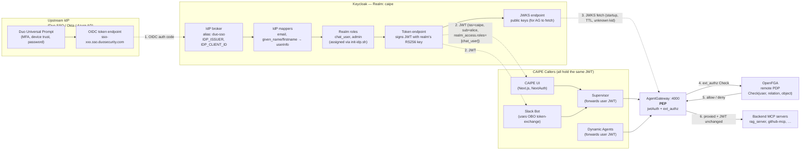

# RBAC Architecture

Component-by-component reference. Each section describes **what it owns**, **what it does NOT own**, and **the env vars / config files / extension points** you'd touch to change its behavior.

> Read [the index](./index.md) first if you want the big-picture mental model and the JWT primer.
> Read [Workflows](./workflows.md) for the request-flow sequence diagrams that tie all of this together.

---

## Helm Runtime Packaging

The `0.5.0` umbrella chart can own the RBAC runtime stack for demo and managed environments:

- `tags.keycloak=true` enables the Keycloak subchart, realm import, and IdP/token-exchange init hooks.
- The Keycloak subchart packages the `caipe` login theme by default and mounts it as a ConfigMap under `/opt/keycloak/themes/caipe`. Deployments can customize branding with `keycloak.theme.brandName`, `keycloak.theme.colors.`*, or full `keycloak.theme.files.*` overrides; `keycloak.theme.existingConfigMap` remains available for externally managed theme ConfigMaps.
- `openfga.enabled=true` enables the OpenFGA service and the CAIPE authorization model loader hook. The loader can also write idempotent bootstrap tuples through `openfga.init.seedTuples`; production RBAC installs use this to grant initial bootstrap administrators `manager` on `system_config:platform_settings` before runtime migrations need the object-level PDP.
- `openfgaAuthzBridge.enabled=true` enables the gRPC `ext_authz` bridge that validates the bearer JWT again, extracts the verified `sub`, and translates AgentGateway checks into OpenFGA checks.
- `agentgateway.enabled=true` enables the standalone AgentGateway proxy chart. `global.agentgateway.enabled=true` is still the Gateway API route-resource path for clusters using the AgentGateway controller model.

Production installs must still supply ExternalSecrets and persistent datastore settings; the chart defaults are conservative and disabled by default.

---

## Component 1: Keycloak — HR & The Front Desk

> **Badge analogy:** HR issues ID badges. The front desk verifies them on entry. Every other door in the building trusts the badge's chip — they don't call HR each time. When a contractor arrives via a partner agency (Duo SSO), the front desk checks with the agency once, creates an internal record, and issues a standard building badge. From that point on, the contractor uses the same badge as everyone else.

**Technically:** Keycloak acts as an OIDC Authorization Server and IdP broker. It proxies login to Duo SSO via an OIDC client, mirrors external group claims into identity attributes for sync, and issues its own signed JWT — so downstream services only ever need to trust one issuer. CAIPE authorization decisions are no longer encoded as Keycloak realm roles.

### Realm Roles (`caipe` realm)


| Role                   | Default? | Purpose                                      |
| ---------------------- | -------- | -------------------------------------------- |
| `default-roles-caipe`  | Yes      | Keycloak composite default role.             |
| `offline_access`       | Yes      | Keycloak protocol role for refresh/offline.  |
| `uma_authorization`    | Built-in | Keycloak protocol role; not CAIPE authz.     |


There are no CAIPE business/resource realm roles. A CAIPE admin is represented as `user:<sub> admin organization:<org_key>` in OpenFGA, optionally via `team:<slug>#admin admin organization:<org_key>`. `BOOTSTRAP_ADMIN_EMAILS` is only a break-glass fallback until those durable organization tuples exist.

#### Resource-scoped roles (legacy)

Legacy role names such as `chat_user`, `admin`, `admin_user`, `team_member:*`, `kb_reader:*`, `agent_user:*`, and `tool_user:*` are cleanup targets only. New installs do not create them, and new authorization code must not check them.


Relationships are created and assigned by:

- `init-idp.sh` (runs in the `keycloak-init` job) is the first-run bootstrap escape hatch. It uses direct Keycloak admin credentials before the Web UI backend is healthy, which avoids a bootstrap cycle where BFF startup needs Keycloak config that only the BFF can create. It should keep only baseline app-realm prerequisites, IdP broker login bootstrap, optional demo personas (`KEYCLOAK_SEED_DEMO_USERS=true`), and operational master-realm settings such as admin-console `frontendUrl`.
- The Web UI backend runs a startup Keycloak RBAC reconciliation migration (`keycloak_rbac_mapping_reconciliation_v1`) in TypeScript. MongoDB `teams` remain the source of truth; the migration creates/validates `team-<slug>` client scopes with `active_team` mappers, binds those scopes to Slack/Webex bot clients, repairs bot OBO token-exchange permissions for the `CAIPE_PLATFORM_AUDIENCE` target client, assigns bot service-account impersonation roles, and records status in `migration_manifest`, `schema_migrations`, and `data_schema_versions`.
- Slack/Webex bot onboarding can still repair OBO prerequisites on-demand, but the BFF startup migration is the canonical environment-wide reconciliation path after bootstrap. Its last run, counts, warnings, and errors are exposed through Admin → Security & Policy → Keycloak via `GET /api/admin/keycloak/migration-health`, plus the persistent header migration status indicator. The same endpoint also performs a read-only Keycloak inspection for the tile details modal, returning actual realm values such as `team-*` client scopes, `active_team` mapper values, bot optional/default scope bindings, token-exchange permission strategy, attached OBO policies, and bot service-account impersonation roles. When the migration is behind or failed, the Keycloak tab's **Reconcile now** button invokes the same typed migration apply path for `keycloak_rbac_mapping_reconciliation_v1` and refreshes the persisted health result. The `caipe-platform` target-audience token-exchange permission must use `AFFIRMATIVE` when both Slack and Webex bot policies are attached; otherwise Keycloak requires a single caller to satisfy both client policies and rejects OBO with `Client not allowed to exchange`.
- Production Slack/Webex bot OBO client secrets are Keeper-backed ExternalSecrets (`keycloak.tokenExchange.externalSecret` and `keycloak.webexTokenExchange.externalSecret`) rather than chart-generated random Secrets. The same Kubernetes Secret feeds the bot pod and the Keycloak reconciliation hook so Keycloak's stored client secret stays aligned with runtime OBO callers across upgrades.
- The Admin UI **Team Resources panel** (`Admin → Teams → selected team → Resources` tab, spec 104 Story 4) — checking an agent or tool box calls `PUT /api/admin/teams/[id]/resources`, which:
  1. Writes base relationship intent to OpenFGA before Mongo persistence: `team:<slug>#member user agent:<id>`, `team:<slug>#member manager agent:<id>`, and `team:<slug>#member caller tool:<prefix|*>`.
  2. Resolves current team members to Keycloak `sub` values and writes OpenFGA `user:<sub> member team:<slug>` membership tuples when possible.
  3. Persists the selection on the team document in Mongo (`team.resources = { agents, agent_admins, tools, tool_wildcard }`).
  The Resources tab covers Use+Manage per agent and per-MCP-server tool grants plus a single "All tools" wildcard checkbox. Mongo persistence happens **after** OpenFGA reconciliation so a PDP outage doesn't leave Mongo ahead of the enforcement store.
- The Admin UI **Team Slack Channels panel** (`Admin → Teams → <team> → Slack Channels` tab, spec 098 US9) — bind Slack channels to a team so the bot resolves the channel's effective team via `channel_team_mappings`. Slack runtime agent access is configured separately in the OpenFGA ReBAC Slack Channels panel, where admins grant a channel access to selected Dynamic Agents. `PUT /api/admin/teams/[id]/slack-channels` is an idempotent full-replace: it deactivates this team's previous mappings that aren't in the new payload (only when `team_id` still matches — never touches another team's rows), upserts the active set, and denormalises a thin `slack_channels` array onto the team document for the team-card chip count. The UI offers a live `conversations.list` discovery picker (server-side `SLACK_BOT_TOKEN` only, 60s in-process cache) plus a manual ID entry fallback for when the bot isn't in the channel yet.
- The Admin UI **Team Webex Spaces panel** (`Admin → Teams → <team> → Webex Spaces` tab, spec 2026-05-18 Webex RBAC parity) — binds Webex spaces to a team through `webex_space_team_mappings`. Runtime agent access is configured separately in the OpenFGA ReBAC Webex Spaces panel. `PUT /api/admin/teams/[id]/webex-spaces` is an idempotent full-replace, preserves mappings owned by other teams, and denormalises `webex_spaces` onto the team document for display.
- Identity group sync — upstream Okta/AD group ids map to `external_group:<provider>/<group_id>` and then to CAIPE teams, for example `external_group:okta/00g... member team:platform`. Application code consumes the resulting team relationships; it does not check upstream group strings directly.

`BOOTSTRAP_ADMIN_EMAILS` is an explicit break-glass/initial-admin list. The UI and Python helpers treat those emails as temporary organization admins if OpenFGA has not yet been seeded. Keep the list small, audit it, and replace it with durable `admin organization:<org_key>` relationships as soon as setup is complete.

#### When Authorization Relationships Are Created

Keycloak realm roles are **not created for CAIPE permissions**. New deployments keep Keycloak focused on identity and login:

- **Organization access** is `user:<sub> member|admin|auditor organization:<org_key>` or team-mediated variants. The release migration `organization_membership_backfill_v1` writes direct `member organization:<org_key>` tuples for existing Mongo users with a stable Keycloak `sub`, restoring baseline `supervisor:invoke`/RAG `query` access after the OpenFGA cutover.
- **Team membership** is `user:<sub> member|admin team:<slug>`.
- **Resource access** is team-mediated where possible, for example `team:<slug>#member user agent:<id>` or `team:<slug>#member reader knowledge_base:<id>`.
- **Runtime checks** use derived `can_*` permissions from those base relationships.

Rule of thumb: **Keycloak owns identity and JWT claims; OpenFGA owns who is related to which organization, team, or resource.**

The Web UI backend now uses shared object-level OpenFGA checks for UI-owned resource surfaces whenever the authorization model has a concrete resource type. `list` and `discover` map to `can_discover`, runtime/content access maps to `can_read` or `can_use`, mutations map to `can_write`, sharing maps to `can_share`, and platform configuration maps to `can_manage` on `system_config:<key>`. Dynamic Agent create requires an explicit owner team: platform admins may select any team, while scoped team admins may create agents only for teams they administer. Creation writes durable relationships before MongoDB persistence: `user:<creator_sub> owner agent:<id>`, `organization:<org>#admin manager agent:<id>`, `team:<slug>#member user agent:<id>`, `team:<slug>#admin manager agent:<id>`, and the agent-to-tool caller tuples. Dynamic Agent update/delete paths check the concrete `agent:<id>` object before MongoDB writes or tuple reconciliation. Chat agent pickers (`/api/dynamic-agents/available`) and subagent pickers (`/api/dynamic-agents/available-subagents`) load enabled candidates and filter through `agent#can_use`; conversation creation also checks `agent#can_use` before storing a selected agent. Skill config reads no longer prefilter by MongoDB `visibility`, `owner_id`, `shared_with_teams`, or legacy realm roles; they load candidates and let `skill#can_discover`/`skill#can_read` decide. Task Builder reads follow the same pattern with `task#can_discover`/`task#can_read`. Workflow configs are mapped to the existing OpenFGA `task` namespace until the authorization model grows a first-class `workflow` type. Dynamic Agent built-in tool metadata is guarded as pseudo-resource `tool:dynamic-agents-builtin#can_discover`; platform admins use the local admin bypass while non-admin callers still need an explicit OpenFGA relationship.

Conversations use a hybrid ownership model to avoid creating high-cardinality owner tuples for every private chat. Private ownership is implicit from MongoDB (`owner_subject` for normalized records, legacy `owner_id` email fallback for old records). Explicit OpenFGA relationships remain the enforcement store for cross-boundary sharing and admin surfaces. The Web UI backend now fetches non-deleted conversation candidates without MongoDB team-sharing prefilters, then applies the same implicit-or-explicit conversation check on chat list/detail routes, Dynamic Agent v1 stream/invoke/resume/cancel proxy routes, and conversation metadata updates. This lets Slack OBO requests write their own thread conversations and bookkeeping metadata without requiring explicit owner tuples while still allowing OpenFGA-only conversation grants to appear in the UI. The Admin → System → Migrations tab seeds a DB-managed `migration_manifest` from the runtime bundle, shows the active runtime migration release beside per-collection `data_schema_versions`, hides completed migrations by default, and runs the release migration handlers, including `conversation_owner_identity_v1` for `owner_subject`/`owner_identity_version=2`, `organization_membership_backfill_v1` for direct baseline organization membership, universal team-resource OpenFGA backfill, Dynamic Agent tool tuple reconciliation, Dynamic Agent organization-admin inheritance backfill, Slack channel and Webex space ReBAC grant backfills, messaging team mapping reconciliation, RBAC index creation, and Webex messaging ReBAC index creation. Migration runs are recorded in `schema_migrations`; blocking required migrations and the migration status API are admin-only surfaces.

Conversation secondary views and mutations now use the same model: shared, search, and trash routes fetch candidates and filter through the implicit-or-explicit OpenFGA helper; pin, archive, restore, and share actions require the concrete conversation relationship instead of raw `owner_id` equality. Skill nested routes and import overwrite paths also load candidates by id and require `skill#read`, `skill#write`, or `skill#admin` as appropriate; legacy skill visibility fields remain metadata only. Workflow run list/start/poll/update/delete/resume/cancel operations authorize against the parent workflow config through the temporary `task` namespace mapping. MCP server list/update/delete and team RAG tool list/read/write/delete add concrete `mcp_server` and `tool` resource checks on top of the existing coarse route gates; platform admins bypass missing concrete MCP tuples so pre-cutover legacy server rows remain visible and removable during AgentGateway onboarding.

Knowledge Base UI routes are enforced at the Web UI backend before proxying to the RAG server. `caipe-ui` authenticates the browser session, applies the coarse `rag` route gate, requires `admin_surface:rag_datasources#can_manage` for the Data Sources admin surface, checks concrete `knowledge_base:<id>` operations for non-admin callers, filters datasource list responses by `knowledge_base#can_read`, constrains search/MCP invocations to the caller's readable datasource IDs for non-admin callers, and then forwards the Keycloak bearer token to RAG. Platform admins keep the BFF admin bypass for concrete datasource operations such as re-ingest, matching datasource list/search behavior. RAG validates the token signature, issuer, audience, and expiry against Keycloak, then repeats OpenFGA checks for direct API/MCP requests using the caller's Keycloak `sub`. The default authenticated RAG role no longer grants access by itself; team-derived tuples such as `team:<slug>#member reader knowledge_base:<id>` are the source of truth for per-datasource access, while **OpenFGA ReBAC → RAG Team Access** grants team admin access to the Data Sources surface.

Slack and Webex bot channel/space team resolution still uses Mongo mappings to find the owning CAIPE team and mint the correct `active_team` OBO scope. Membership prechecks are OpenFGA-first: the bot checks `user:<sub> member team:<slug>` and only falls back to legacy `teams.members` when the PDP is not configured or unavailable. A negative OpenFGA decision denies the bot interaction before OBO so users get the friendly "not a member" response.

RAG accepts both browser user tokens and ingestor client-credentials tokens from Keycloak. For local Docker Compose, `OIDC_DISCOVERY_URL` and `INGESTOR_OIDC_DISCOVERY_URL` may be either the realm base URL (`http://keycloak:7080/realms/caipe`) or the full `.well-known/openid-configuration` URL; the server normalizes both forms before fetching metadata. Keycloak service-account tokens use `preferred_username=service-account-<client>`, so RAG treats that token shape as machine-to-machine and assigns `RBAC_CLIENT_CREDENTIALS_ROLE` instead of running the human userinfo/group lookup path.

#### User-facing Role Cleanup

The Admin UI intentionally separates **team/resource authorization** from **raw Keycloak plumbing**:

- Keycloak system roles (`default-roles-caipe`, `offline_access`, `uma_authorization`) are hidden from the table and role filter because they are OIDC/UMA plumbing, not product permissions.
- Teams are the human-facing source for membership and most resource grants.
- Legacy resource roles (`agent_user:`*, `agent_admin:*`, `tool_user:*`, `kb_reader:*`, `task_user:*`, `skill_user:*`) are stale compatibility data only; cleanup scripts can remove them from local/dev realms.

`GET /api/admin/users` may still expose raw Keycloak protocol roles for diagnostics, but product authorization should be read through teams and OpenFGA relationships. Local/dev realms can remove stale legacy CAIPE roles with `scripts/cleanup-local-keycloak-legacy-roles.py`.

Do not delete Keycloak system roles as part of cleanup. They may be required by Keycloak or OIDC flows even though CAIPE hides them from the main admin UX.

### External IdP Brokering (Duo SSO, Okta, or any OIDC provider)

> **Badge analogy:** The partner agency desk. Whether it's Duo SSO, Okta, or any other corporate identity provider, they all speak the same language (OIDC). Keycloak is the single translator — it talks to whichever agency is configured and converts their badges into standard building badges. The rest of the building never needs to know which agency originally issued the contractor's credentials.

Keycloak acts as a **relying party** to the upstream IdP (OIDC). From the user's perspective it's invisible — they see only the upstream IdP login page. From a security perspective:

```
Browser ──OIDC auth code flow──▶ Keycloak
                                      │
                   ──OIDC auth code──▶ Upstream IdP (Duo SSO / Okta / any OIDC)
                                      │
                   ◀── id_token ───────┘  (external claims: email, name, groups)
                        │
                   Preserves external group claims for team sync
                   Issues new Keycloak JWT with identity claims
                        │
Browser ◀── Keycloak JWT ──────────────┘
```

**Supported upstream IdPs** — the `init-idp.sh` script configures any OIDC provider generically via OIDC discovery (`/.well-known/openid-configuration`):


| Provider                  | `IDP_ALIAS` (in realm) | `IDP_ISSUER` example                                                      | Notes                                                                                                  |
| ------------------------- | ---------------------- | ------------------------------------------------------------------------- | ------------------------------------------------------------------------------------------------------ |
| Duo SSO                   | `duo-sso`              | `https://sso-xxx.sso.duosecurity.com/oidc/xxx`                            | Uses `firstname`/`lastname` (non-standard); extra IdP mappers handle both `given_name` and `firstname` |
| Okta (OIDC)               | `okta-oidc`            | `https://your-org.okta.com` or `https://your-org.okta.com/oauth2/default` | Standard OIDC claims; groups come from Okta's `groups` claim (requires Okta app config)                |
| Okta (SAML)               | `okta-saml`            | —                                                                         | SAML 2.0; configured as a SAML IdP in Keycloak; attribute mappers needed for groups                    |
| Microsoft Entra ID (OIDC) | `entra-oidc`           | `https://login.microsoftonline.com/{tenant-id}/v2.0`                      | Standard OIDC; groups claim requires Entra app manifest `groupMembershipClaims` config                 |
| Microsoft Entra ID (SAML) | `entra-saml`           | —                                                                         | SAML 2.0; common in enterprise M365 environments                                                       |
| Generic OIDC              | any alias              | any OIDC-compliant issuer URL                                             | Works as long as the provider exposes `/.well-known/openid-configuration`                              |


**To wire up a new IdP**, set these env vars and run `init-idp.sh` (or restart the `init-idp` container — it is idempotent):

```bash
IDP_ALIAS=okta                                 # short alias, used in kc_idp_hint
IDP_DISPLAY_NAME="Okta SSO"                    # shown on Keycloak login page (if visible)
IDP_ISSUER=https://your-org.okta.com           # OIDC issuer URL
IDP_CLIENT_ID=<okta-app-client-id>
IDP_CLIENT_SECRET=<okta-app-client-secret>
IDP_ACCESS_GROUP=caipe-users                   # Okta group → chat_user role (optional)
IDP_ADMIN_GROUP=caipe-admins                   # Okta group → admin role (optional)
KEYCLOAK_ADMIN_FRONTEND_URL=http://localhost:18080  # optional private master-realm admin URL
KEYCLOAK_FORCE_IDP_REDIRECT=true               # disable local app-realm login fallback
OIDC_IDP_HINT=okta                             # auto-redirect browser to this IdP alias
```

`**OIDC_IDP_HINT**` (set in `ui/.env.local`) is passed to Keycloak as `kc_idp_hint` on every auth request. It skips the Keycloak login page entirely and redirects straight to the named IdP. Set it to the same value as `IDP_ALIAS`.

`**KEYCLOAK_FORCE_IDP_REDIRECT=true**` makes the app realm configured-IdP only: `init-idp.sh` sets the browser flow's Identity Provider Redirector `defaultProvider` to `IDP_ALIAS`, marks that redirector as required, and disables the local username/password form. This prevents CAIPE users from seeing the Keycloak login screen even if a client omits `kc_idp_hint`. Keep the `master` realm admin console on its private URL for operational access.

`**KEYCLOAK_ADMIN_FRONTEND_URL**` is optional and only affects the `master` realm admin console. Use it when public ingress intentionally exposes only `/realms/caipe` and `/resources`; the `caipe` realm issuer and Duo broker redirect remain on the public Keycloak hostname.

In production, the browser-facing issuer is Keycloak, not the upstream IdP. For the Grid RBAC environment the UI uses:

```bash
OIDC_ISSUER=https://idp.caipe.example.com/realms/caipe
OIDC_CLIENT_ID=caipe-ui
OIDC_IDP_HINT=duo-sso
NEXTAUTH_URL=https://caipe.example.com
```

Duo credentials stay on the Keycloak IdP broker only. The Duo application's redirect URI points to Keycloak's broker endpoint (`https://idp.caipe.example.com/realms/caipe/broker/duo-sso/endpoint`), while the Keycloak `caipe-ui` client allows NextAuth's callback (`https://caipe.example.com/api/auth/callback/oidc`). Keycloak must be started with a public hostname such as `KC_HOSTNAME=https://idp.caipe.example.com` and `KC_PROXY_HEADERS=xforwarded` so discovery metadata and JWT `iss` match the public issuer. The Docker Compose public-host override (`docker-compose.caipe-rbac-https.yaml`) sets those Keycloak values alongside the UI/RAG/Dynamic Agents `OIDC_ISSUER` overrides; otherwise browser login links can point back at the local dev default (`http://localhost:7080`).

**Claim mapping chain:** The IdP sends `email`, `given_name`/`firstname`, `family_name`/`lastname`, and `groups` claims. Keycloak IdP mappers write identity attributes to the local user record. Group claims are input to the identity-group-to-team sync path, which writes OpenFGA team relationships; they are not translated into CAIPE realm roles.

> The login sequence diagram (one-time login + the silent first-broker-login flow) lives in [Workflows › Login](./workflows.md#login--first-time-broker-login).

### Keycloak Auth Reconciliation Job

Keycloak browser-flow and identity-provider settings are persisted inside Keycloak's database, not in Kubernetes objects. Upgrades can recreate pods and chart resources without automatically reasserting the `Identity Provider Redirector`, local-login disablement, first-broker-login flow, or required-action settings. The durable design is:

- Keep an idempotent `keycloak-auth-reconcile` Job.
- Make it chart-owned, not a Grid-only `extraDeploy` override.
- Run it as an early ArgoCD/Helm sync hook on install and upgrade.
- Use `BeforeHookCreation,HookSucceeded` cleanup.
- Remove any temporary Grid-specific reconcile job once the chart contains the same behavior.
- Reassert realm token/session lifetimes on upgrade: access tokens remain short-lived at 1 hour, SSO idle timeout is 8 hours, and the absolute SSO max lifespan is 24 hours unless overridden through the Keycloak chart values.

A `CronJob` is intentionally avoided. Periodic reconciliation would hide ownership drift and repeatedly exercise Keycloak admin credentials when nothing changed. The desired model is one job pod per install/upgrade event, with idempotent Admin API calls that restore the browser-flow and IdP invariants for every downstream install.

### User Profile & Custom Attributes

Keycloak 26+ enforces a user profile schema. Custom attributes are silently dropped unless declared or `unmanagedAttributePolicy=ADMIN_EDIT` is set on the user profile API. The Helm realm import JSON must not include `unmanagedAttributePolicy` as a top-level realm field because Keycloak 26.3 rejects that `RealmRepresentation` property during import. `init-idp.sh` patches both supported user-profile settings after the server starts:

- Adds `slack_user_id` to the user profile schema with `admin`-only view/edit permissions
- Sets `unmanagedAttributePolicy=ADMIN_EDIT` so other Admin API attribute writes succeed
- Makes `firstName` and `lastName` optional, disables Keycloak's `VERIFY_PROFILE` required-action provider, and clears any assigned `VERIFY_PROFILE` actions from existing users so enterprise SSO users are never stopped at Keycloak's "Update Account Information" form

The Keycloak container exposes login/API traffic on `8080` and management health on `9000`; Helm readiness/liveness probes target the management port.

### Account Linking (Slack)

Three onboarding paths, evaluated in order:

- **Auto-bootstrap** (default, `SLACK_FORCE_LINK=false`) — bot looks up the Slack user's email, finds an existing Keycloak user, writes `slack_user_id` silently. Zero user action required.
- **Just-In-Time user creation** (default ON, `SLACK_JIT_CREATE_USER=true`, spec 103) — when no existing Keycloak user matches, the bot creates a federated-only shell user via `POST /admin/realms/{realm}/users` using the same `caipe-platform` admin credential. Optional domain allowlist via `SLACK_JIT_ALLOWED_EMAIL_DOMAINS`. 409 races are resolved by re-querying.
- **Explicit link** (`SLACK_FORCE_LINK=true`, or fallback when JIT is off / not allowed / fails) — bot sends an HMAC-signed link prompt; user clicks → SSO login → `slack_user_id` written via Admin API.

The full sequence (including HMAC URL shape, TTL enforcement, JIT request body, error kinds, and post-link OBO flow) is in [Workflows › Slack identity linking](./workflows.md#slack-identity-linking-auto-bootstrap--jit--forced-link).

### Account Linking (Webex)

Webex uses the same Keycloak identity boundary as Slack but stores the Webex
person identifier in `webex_user_id`. The Webex link callback lives in the Web UI
backend at `/api/auth/webex-link` and uses single-use, 10-minute nonces in
`webex_link_nonces`; HMAC links are converted into nonce-backed completion URLs
before the user reaches the OIDC session. The callback rejects attempts to bind
one Webex person ID to multiple Keycloak users.

For group spaces, the default Webex bootstrap path keeps signed linking URLs out
of the shared room. The bot posts only a generic thread notice in the group, then
sends the requesting person a 1:1 Adaptive Card with the SSO linking URL. If the
1:1 send fails, the group fallback still avoids posting the signed URL publicly.
Slack-style implicit/profile linking is treated as a user-choice path, not the
default: it should only be enabled when Webex org and verified-email trust checks
can prove the Webex profile maps unambiguously to one Keycloak user.

After linking, the Webex bot exchanges its service-account token for a user OBO
token with the selected active team scope. The Webex bot clients are
`caipe-webex-bot` and `caipe-webex-bot-admin`; the `caipe-ui` client receives the
`webex-bot-admin-audience` mapper so runtime admin calls can use
client-credentials tokens. The full runtime sequence is in
[Workflows › Webex space ReBAC](./workflows.md#webex-space-rebac-and-bot-dispatch).

---

## Component 2: CAIPE UI — The Reception Desk

> **Badge analogy:** The reception desk at each department entrance. When you badge in, it reads your chip (JWT), checks your clearance level for this department, and either waves you through or says "sorry, you don't have access here." It doesn't phone HR — the badge chip already carries everything needed to make the decision.

**Technically:** Next.js App Router with NextAuth (Auth.js v5) for OIDC session management. Every API route handler runs `requireRbacPermission()` which validates the server-side session and enforces role requirements before proxying to backend services.

### Authentication Flow

```
1. Browser visits http://localhost:3000
2. NextAuth detects no session → 302 to Keycloak (OIDC auth code flow)
3. Keycloak → Duo SSO (kc_idp_hint=duo-sso auto-redirects, user never sees KC)
4. Duo SSO login → auth code returned to Keycloak
5. Keycloak issues JWT → NextAuth exchanges code for tokens
6. NextAuth stores small session metadata in the encrypted httpOnly cookie
7. Large OAuth tokens (access, refresh, ID token) stay in the UI server's in-process token cache and are rehydrated server-side
```

**Security note:** The session cookie is httpOnly, Secure, SameSite=Lax, and encrypted with `NEXTAUTH_SECRET`. Large OAuth tokens are kept out of the browser cookie to avoid oversized request headers when Keycloak emits RBAC scopes, groups, or relationship-derived claims. If the UI process restarts and the in-process token cache is lost while a browser still has a valid slim session cookie, the session is marked `AccessTokenMissing` and the token-expiry guard sends the user back through login instead of allowing tokenless backend proxy calls. For multi-replica deployments, use sticky sessions or replace the in-process token cache with a shared store.

### Server-Side Authorization (`api-middleware.ts`)

```typescript
// Every protected API route:
const { user, session } = await getAuthFromBearerOrSession(request);
await requireRbacPermission(session, "rag", "kb.query");
```

Two authorization paths:

1. **Primary PDP:** `requireRbacPermission()` calls Keycloak Authorization Services with the caller's bearer/session access token and the requested `resource#scope`.
2. **Role-based fallback:** `hasRoleFallback()` checks `realm_access.roles` from the session JWT when the PDP is unavailable or not configured.
3. **Bootstrap admin bypass:** `isBootstrapAdmin(email)` checks the email against `BOOTSTRAP_ADMIN_EMAILS`. This exists for the chicken-and-egg problem: the first admin must be able to log in before Keycloak roles are properly configured. **Remove this env var once roles are working.**

Routes that have not yet been rewritten inline no longer remain session-only: the deprecated `withAuth()` compatibility wrapper now uses `getAuthFromBearerOrSession()`, resolves the route family to a least-privilege RBAC policy, and calls `requireRbacPermission()` before invoking the handler.

### Dynamic Agent Execution Gate

Dynamic Agent execution is a data-plane ReBAC decision, not a Keycloak UMA
management-plane decision. The Web UI backend chat proxy routes authenticate the caller,
extract the stable session or bearer-token subject, and check OpenFGA before
proxying execution to Dynamic Agents:

```text
user:<sub> can_use agent:<agent_id>
```

For compatibility with existing team data that was originally keyed by email,
the Web UI backend and Dynamic Agents runtime check the stable subject first and then
fallback to `user:<email> can_use agent:<agent_id>` when the token carries an
email claim. New relationship writers should prefer Keycloak `sub` values.
The UI auth middleware also persists the verified Keycloak subject into
MongoDB `users.keycloak_sub` and `users.metadata.keycloak_sub` during session or
bearer authentication. This gives migrations and admin tooling a durable
email-to-sub mapping without depending on transient session cookies.

`POST /api/v1/chat/stream/start`, `POST /api/v1/chat/invoke`,
`POST /api/v1/chat/stream/resume`, and `POST /api/v1/chat/stream/cancel`
fail closed before any backend call unless the caller can use the selected
agent and can write the target conversation through implicit ownership or an
explicit OpenFGA relationship. The older plain SSE proxy at
`POST /api/chat/stream` also forwards the authenticated session access token to
the supervisor backend and applies the same implicit-or-explicit conversation
write check before proxying.

The Web UI backend emits a unified RBAC Audit event for every OpenFGA agent-use decision,
and the Dynamic Agents runtime persists the same structured `openfga_rebac`
event to MongoDB `audit_events` for direct bearer-token calls. Both use
`pdp=openfga`; the Web UI backend stores the checked tuple in a resource reference shaped
like:

```text
user:<sub> can_use agent:<agent_id>
```

This gives operators a single RBAC Audit view for runtime OpenFGA allows,
denies, and PDP-unavailable failures alongside admin ReBAC graph/check actions.
The AgentGateway `openfga-authz-bridge` also writes each external `ext_authz`
decision into the same `audit_events` collection with `source=openfga_authz_bridge`,
so gateway-level OpenFGA allow/deny/error decisions appear without a trace
backend. MongoDB is the durable audit record and the Admin UI reads it directly.

### OpenFGA Relationship Backfill

Existing MongoDB team/resource assignments can be reconciled into OpenFGA with
`scripts/backfill-universal-rebac.ts`. The backfill is a production migration,
not a demo seed: it reads `teams`, `team_membership_sources`,
`users`, `platform_config`, and `dynamic_agents`, then writes idempotent
OpenFGA tuples plus Mongo provenance in `team_membership_sources` and
`rebac_relationships`.
It records first-run status in `rbac_migrations` using the stable migration id
`openfga_relationship_backfill_v1`.

For team membership subjects, the backfill prefers `users.keycloak_sub`, then
`users.metadata.keycloak_sub`, and only falls back to legacy subject fields. If
none of those mappings exist, it may use the member email for compatibility;
operators should run the migration after users have logged in at least once so
the stable subject mapping is available.

The migration materializes team grants such as:

```text
user:<sub> member team:<slug>
user:<sub> admin team:<slug>
team:<slug>#member user agent:<agent_id>
team:<slug>#admin manager agent:<agent_id>
team:<slug>#member caller tool:<tool_prefix>
team:<slug>#member reader knowledge_base:<kb_id>
team:<slug>#member user skill:<skill_id>
team:<slug>#member user task:<task_id>
```

Skill Hub imports use the same `skill:<id>` resource model as locally-authored
skills. Hub skills are projected into stable catalog ids
`hub-<hub_id>-<hub_skill_id>`, so team grants write
`team:<slug>#member user skill:hub-<hub_id>-<hub_skill_id>`. The skills catalog
filters non-admin list responses with `can_read skill:<id>` and content-bearing
runtime responses with `can_use skill:<id>`; admins keep full catalog visibility.
Locally-created team-visible skills and bulk `.zip` imports now reconcile selected
teams into OpenFGA `skill#user` relationships as part of save/import. Skill Hubs
also persist `shared_with_teams`; every force-refresh grants those teams access to
all refreshed hub skill ids, and the `skill_hub_team_grants_backfill_v1` migration
does the same for hub skills that were already crawled before the hub-level team
policy existed.
GitHub Skill Hub crawl/import uses the hub's validated `credentials_ref` when
configured, otherwise falls back to the server-side `GITHUB_TOKEN` environment
variable on `caipe-ui`. In dev compose, `caipe-ui` receives `GITHUB_TOKEN` from
`.env` or the shell, with `GITHUB_PERSONAL_ACCESS_TOKEN` as a local fallback.

To preserve the default chat path after Dynamic Agent PDP enforcement, the
OpenFGA model allows a typed wildcard subject on `agent.user`, and the
migration writes this tuple when a dynamic default agent is configured:

```text
user:* user agent:<default_agent_id>
```

Default-agent resolution matches the Admin Settings feature: persisted
`platform_config.default_agent_id` first, then `DEFAULT_AGENT_ID`, then the
supervisor fallback. Supervisor fallback is not a Dynamic Agent and does not
produce a default-agent OpenFGA tuple.

Per-agent MCP tool restrictions are reconciled separately with
`scripts/backfill-agent-tool-openfga.ts`. That migration reads each dynamic
agent's `allowed_tools` map and reconciles tuples shaped as:

```text
agent:<agent_id> caller tool:<server_id>/<tool_name>
agent:<agent_id> caller tool:<server_id>/*
```

Run it after enabling signed agent context so existing agents have the same
AgentGateway/OpenFGA enforcement as newly-created or edited agents. Apply mode
also removes stale agent-tool tuples that no longer match `allowed_tools`.

Schema-versioned migration `agent_org_admin_inheritance_v1` backfills the
organization-admin inheritance tuple for existing Dynamic Agents:

```text
organization:<org>#admin manager agent:<agent_id>
```

This grants organization admins `can_manage` through the OpenFGA model without
guessing owner teams for legacy agents. New agents get this tuple during create.

### Token Refresh

NextAuth holds the refresh token and silently refreshes the access token before it expires. The bundled Keycloak realm keeps access tokens at 1 hour, sets SSO idle timeout to 8 hours, and uses a 24-hour absolute SSO max lifespan. As long as the user keeps using the app and Keycloak accepts the refresh token, the UI asks Keycloak for a new access token instead of expiring the browser session based on local access-token staleness. If Keycloak rejects refresh (`invalid_grant`), the realm session is revoked, or Keycloak is unavailable, the user is redirected to login. The access token in the session is always the current live token — it's what gets forwarded to backend services.

### Identity Group Sync Hybrid Source Model

Identity Group Sync deliberately has two upstream sources:

1. **OIDC `memberOf` / `groups` claims on login** — Keycloak imports the upstream IdP `groups` claim into the `idp_groups` user attribute and emits it to the `caipe-ui` client as a multivalued `groups` claim in ID token/userinfo responses. Login-claim reconciliation is enabled by default; set `IDENTITY_SYNC_LOGIN_CLAIMS_ENABLED=false` only when a deployment needs to disable it. `auth-config.ts` extracts the signed-in user's group claims and runs a best-effort reconciliation for only that user. This is additive and fast: it refreshes the user's managed `team_membership_sources` and OpenFGA `user:<sub> member team:<slug>` tuples without storing the full group list in the session cookie. Login is not failed if reconciliation cannot run.
2. **Direct Okta directory API for admin dry-runs** — `/api/admin/identity-group-sync/dry-run` can fetch full group inventory from Okta using server-side IdP credentials when `fetch_from_provider=true` and `provider_id` is an Okta provider. This path is the authoritative source for scheduled/admin sync because it can see users who are not actively logging in, detect removals, produce drift findings, and surface users that still need identity linking before tuples can be written.

The claim path is not a replacement for direct directory querying. It improves freshness for the current user while the directory connector remains responsible for complete inventory and removals. Admins can also use `GET /api/admin/identity-group-sync/claim-suggestions` from the Identity Group Sync tab to read the current admin's server-side cached login claim groups, convert them through the same OIDC claim mapper, run existing rules, and review suggested teams for unmatched groups before creating anything. The endpoint intentionally does not call the OIDC userinfo endpoint on demand; if the in-process session claim cache is empty after a UI restart, the admin signs out and back in to refresh the cached claim groups. The UI lets admins filter large AD group sets, select one or more detected groups, and apply a reviewed `teams_to_create` plan to create those CAIPE teams without granting memberships or deleting anything.

Reviewed admin apply flows can materialize missing teams from `teams_to_create` when a reviewed rule has `auto_create_team=true`. Login-time reconciliation is intentionally narrower: it reconciles existing teams only, and never creates teams or grants access to missing teams. Later syncs may remove managed membership sources and matching OpenFGA `user:<sub> member/admin team:<slug>` tuples when a user's IdP claim or group membership disappears, but Identity Group Sync never deletes teams it previously created. Dry-runs include safety warnings for disruptive removals such as admin membership loss, large removal batches, and teams that would be left without active managed identity-sync memberships. Apply requests that include acknowledged removal risks require an explicit `acknowledge_removal_risks=true` review flag before the Web UI backend removes access. These warnings are also the operator signal to inspect orphaned or abandoned resource grants on now-empty teams.

Identity Group Sync admin APIs use the shared `getAuthFromBearerOrSession` path before `requireRbacPermission`, so browser sessions and validated first-party bearer tokens both reach the same OpenFGA organization checks. Keycloak identity and user administration APIs follow the same pattern: list/detail/stats require organization `can_audit`, while profile updates, team membership edits, and relationship writes require organization `can_manage`. Admin observability APIs, including instant/batch PromQL, skill statistics, and checkpoint persistence statistics, require organization `can_audit` before reaching Prometheus or MongoDB-backed metrics. This keeps Playwright persona tests and future service-triggered sync previews aligned with the Web UI backend authorization path.

Manual team management is also provenance-aware. Teams created through `/api/admin/teams` are stamped with `source=manual`, `status=active`, and creator/updater metadata. Manual membership edits create or remove non-managed `team_membership_sources` rows (`source_type=manual`, `managed=false`) so automated Okta/AD/OIDC sync can prune only managed sources. The Team Details members tab reads `/api/admin/identity-group-sync/teams/[teamId]/membership-sources` and displays each member's manual/synced/stale/pending source labels. Team-level admins can edit membership only for teams where they are `owner` or `admin`; unrelated team edits remain denied unless the caller has platform admin permission.

### OpenFGA ReBAC Admin UI

Admins can create and visualize OpenFGA policy/resource relationships at `Admin → Security & Policy → OpenFGA ReBAC`.

The older user-facing `Policy` tab has been removed. It edited CEL tab-visibility
and legacy policy surfaces that are no longer part of the operational model.
Admin tab visibility is now a deterministic Web UI backend gate (`/api/rbac/admin-tab-gates`)
based on session role plus feature flags; resource authorization is modeled in
OpenFGA relationships.

The Admin UI also includes a read-only effective-permissions simulator. Platform
admins can add `simulate_type=user&simulate_id=<keycloak_sub>` or
`simulate_type=team&simulate_id=<slug>&simulate_relation=member|admin` to the
Admin URL through the **View As Effective Permissions** control. The browser stays
authenticated as the real admin; the Web UI backend simply evaluates tab gates as
the simulated OpenFGA subject (`user:<sub>` or `team:<slug>#admin`). Simulation is
not Keycloak impersonation, never mints a token for the target principal, and
disables mutation-oriented integration panels while previewing.

The UI is intentionally Web UI backend first:

1. The browser loads a safe catalog from `/api/admin/openfga/catalog` (teams, dynamic agents, MCP tool prefixes, known KB IDs, universal resources, and OpenFGA status).
2. The **Access Manager** combines relationship authoring and effective-access checks in one catalog-driven form. It searches/selects subjects, resources, and actions; previews the derived check relation such as `team:platform#member can_use agent:incident-agent`; and applies admin grant/revoke mutations through the staged ReBAC change-set API.
3. The **Policy Graph** calls `/api/admin/rebac/graph` and renders tuple usersets as typed nodes and edges so relationships across the universal resource catalog are visible without reading raw tuple rows. Admins can switch between a single-team scope and an all-relationships system scope, open a full-screen graph workspace, search/select catalog resources in the palette, drag resources onto the canvas, connect valid nodes to stage grants, select existing edges to stage revokes, and save the reviewed tuple diff through `/api/admin/openfga/tuples`.
4. The **OpenFGA Tuples** tab is the default sub-tab. It calls `/api/admin/openfga/tuples` for capped, filtered reads and admin-only deletes, and can be deep-linked with `openfgaTab=tuples`.

The OpenFGA ReBAC sub-tabs are URL-addressable with `openfgaTab=<tab>` so admins can share links to specific views. Supported values are `tuples`, `graph`, and `access`; old `builder` and `explorer` links open Access Manager, while legacy `rag`, `slack`, and `webex` links canonicalize to Settings or Integrations.

Raw OpenFGA HTTP endpoints stay on the Docker/private service network. The browser never talks to OpenFGA directly, and the Web UI backend only accepts writable tuple shapes that match the CAIPE base model (`user:<sub> member team:<slug>`, `team:<slug>#member user/manager agent:<id>`, `team:<slug>#member caller tool:<prefix>`, and KB base relations). Materialized `can_*` relations are derived by the OpenFGA model for checks and are rejected on tuple writes.

The universal ReBAC catalog lives behind `/api/admin/rebac/catalog`. It returns the complete protected resource vocabulary, per-type action map, and discovered resource instances from teams, users, dynamic agents, AgentGateway's `mcp_gateway:list` gate, MCP servers/tools, KB ownership, Slack mappings, Webex mappings, conversations, and built-in admin/system resources. `/api/admin/rebac/enforcement-status` reports transition state for every resource type (`not_gated`, `role_gated`, `rebac_shadowed`, `rebac_enforced`, or `deprecated`) by merging defaults with `rebac_enforcement_status` overrides. The older OpenFGA admin endpoints use the same session-or-bearer authentication path, and `/api/admin/openfga/catalog` now embeds these universal resources while preserving its legacy `agents`, `tools`, and `knowledge_bases` picker shape.

Policy authoring is staged through `policy_change_sets` instead of direct browser-to-tuple writes. The Web UI backend creates a draft change set, validates every requested grant/revocation against the universal action vocabulary, delegated-scope guardrails, circular-grant checks, and last-admin risk, then applies the validated diff to OpenFGA and records provenance in `rebac_relationships`. The OpenFGA admin tab uses this create/validate/apply sequence for Access Manager edits, graph edits, and tuple revocations so administrators see the staged diff before the write is committed.

Graph and access explanation APIs read OpenFGA tuples and join them with `rebac_relationships` provenance. `/api/admin/rebac/graph` supports all-relationship views and scoped filters for team, subject, resource, and Slack channel, returning source metadata with each edge. `/api/admin/rebac/check` runs the same universal relationship check and explains allow outcomes with the recorded source path or deny outcomes with the missing OpenFGA prerequisite. Access Manager is catalog-driven: operators can search/select team, user, Slack channel, Webex space, external group, or service-account subjects and check any catalog resource type/action, including AgentGateway `mcp_gateway:list` and tool `can_call` paths. Admins can remediate denied results by creating the selected relationship, or revoke allowed results, through the same staged change-set validation/apply path used by the graph editor. The legacy `/api/admin/openfga/graph` endpoint delegates to the universal graph service so older UI code gets the same source-aware graph.

Slack channel ReBAC is managed through `/api/admin/slack/channels` and the per-channel resources/routes/access-check routes under `/api/admin/slack/channels/[workspaceId]/[channelId]`. The `[workspaceId]` value is the configured workspace alias from `SLACK_WORKSPACE_ALIAS` (for example, `CAIPE`), not Slack's opaque `team_id`. The admin UI exposes the currently enforced Slack runtime path: channel-agent associations write base OpenFGA tuples such as `slack_channel:CAIPE--C0123456789 user agent:<id>`; runtime checks ask for derived `can_use`.

OpenFGA is the source of truth for whether a Slack channel may invoke a Dynamic Agent. `slack_channel_agent_routes` is retained only for dependent dispatch metadata such as listen mode and priority, and a metadata row is valid only while the matching OpenFGA tuple exists. The Slack bot resolves candidate agents from OpenFGA first, joins optional Mongo route metadata for ordering/listen filters, and never lets a stale Mongo route keep a deleted OpenFGA association alive. Deleting a channel-agent association removes both the OpenFGA tuple and the saved route metadata row. Route misses fail closed but are not silent: the bot sends an ephemeral Slack notice when OpenFGA route reads fail or when routes exist but do not listen to the incoming message type. The Admin Slack Channels panel exposes runtime diagnostics for the selected channel so operators can see OpenFGA read failures, stale Mongo metadata, missing tuples, listen-mode mismatches, and the latest Slack runtime audit error without checking container logs. Fix buttons in diagnostics repair common drift by removing stale route metadata when its OpenFGA tuple is gone, or by switching a tuple-backed route to listen to both mentions and plain messages.

Slack bot deployments now default to `SLACK_AGENT_ROUTES_MODE=db_prefer`, so OpenFGA-backed UI-managed routes are preferred when present and static Slack bot config remains the fallback; `config` remains available for static-only environments and `db_only` is available for canaries that should ignore static route bindings. At runtime, the Slack bot maps any incoming Slack `team_id` to `SLACK_WORKSPACE_ALIAS`, resolves the channel's team from `channel_team_mappings`, mints the user's team-scoped OBO token, selects an OpenFGA-backed channel agent, and authorizes the selected agent before dispatch. The request is denied unless both the channel association and the user's team/resource relationship allow the selected agent.

For hands-off channel onboarding, operators may set `SLACK_AUTO_ASSIGN_UNMAPPED_CHANNELS=true` with `SLACK_DEFAULT_TEAM_SLUG` and `SLACK_DEFAULT_AGENT_ID`. When a group-channel message arrives and no active `channel_team_mappings` row exists, the Slack bot writes the configured channel-team mapping, writes `slack_channel:<workspace_alias>--<channel_id> user agent:<default_agent_id>` to OpenFGA, and stores a `slack_channel_agent_routes` metadata row with `listen: all`. The feature is disabled by default in Helm and fails closed if MongoDB, OpenFGA, the default team, or either required env var is missing; existing active channel mappings are never overwritten.

For migrations, the Slack Channels panel includes **Slack Channel Association Default** backed by `GET`/`POST /api/admin/slack/channels/defaults`. The UI shows the currently configured default team and Dynamic Agent from `SLACK_DEFAULT_TEAM_SLUG` and `SLACK_DEFAULT_AGENT_ID`. Admins may apply those defaults to all managed channels, or use bot-member discovery to select individual channels and override the team and Dynamic Agent per selected row. The Web UI backend writes the selected channel-team mappings, ensures `slack_channel:<workspace_alias>--<channel_id> user agent:<id>`, ensures `team:<slug>#member user agent:<id>` for each selected team/agent pair, and optionally creates matching bootstrap routes in `slack_channel_agent_routes`. This is intentionally an explicit bulk write rather than an OpenFGA wildcard/default subject, so every relationship appears in the tuple store and Policy Graph.

The Slack Channels panel also includes **Slack Bot Runtime Sync** for the running bot process. Browser requests still terminate at the Web UI backend: `caipe-ui` checks the signed-in user's `admin_ui#admin` permission, obtains a Keycloak client-credentials token for the Slack bot admin audience, and calls the Slack bot's internal admin API. The Slack bot verifies that token with Keycloak JWKS before returning route-cache status, clearing its in-memory route cache, or upserting static YAML channel-agent routes into `slack_channel_agent_routes` and OpenFGA. The sync operation is intentionally **upsert-only**: it creates missing records and updates matching channel/agent metadata, but it does not delete existing UI-managed associations that are absent from static config.

Webex space ReBAC follows the same shape with Webex-specific types and storage:
`webex_space:<workspace_alias>--<space_id> user agent:<id>` is the OpenFGA source
of truth, while `webex_space_agent_routes` stores dependent dispatch metadata
such as listen mode, priority, and enabled state. The Webex bot never trusts
workspace identifiers from incoming Webex events; policy namespace selection
comes from `WEBEX_WORKSPACE_ALIAS` or `WEBEX_WORKSPACE_ID`. Route reads use
server-side OpenFGA tuple filters for the selected `webex_space` subject and fail
closed on PDP outages.

Threaded Webex replies are anchored with Webex `parentId`. After an allow decision
and before Dynamic Agent dispatch, the bot may fetch bounded prior thread context
from the Webex Messages API: the root message plus recent replies filtered by the
same `parentId` and capped by `WEBEX_THREAD_CONTEXT_MAX_MESSAGES` /
`WEBEX_THREAD_CONTEXT_MAX_CHARS`. The context is sent only to the already selected
and authorized Dynamic Agent under the user's OBO token; fetch failures do not
weaken authorization and fall back to sending only the current message. Bot replies
include the selected `agent_id` and tell users to continue in the same Webex
thread. Whether the bot processes follow-up posts still depends on route listen
mode: `mention`, `message`, or `all`.

The Webex Spaces panel includes diagnostics and runtime sync through
`/api/admin/webex/*` BFF routes. The Web UI backend obtains a
`caipe-webex-bot-admin` audience token, calls the internal Webex bot admin API,
and the bot verifies that token with Keycloak JWKS. Runtime sync is upsert-only:
it creates or updates configured `webex_space_agent_routes` rows and corresponding
OpenFGA tuples, but it does not delete UI-managed associations absent from static
config. Diagnostics compares tuple-backed agents with Mongo route metadata and
offers one-click repairs for zero-agent spaces, stale metadata, and listen-mode
mismatches; the zero-agent repair creates a default/selected agent association
with `listen: all` through the same route API used by manual association saves.

For opt-in onboarding, `WEBEX_AUTO_ASSIGN_UNMAPPED_SPACES=true` with
`WEBEX_DEFAULT_TEAM_SLUG` and `WEBEX_DEFAULT_AGENT_ID` creates an explicit
space-team mapping, route metadata row, and OpenFGA tuple for a previously
unmapped space. The feature is disabled by default, writes MongoDB before
OpenFGA to avoid orphan grants, rolls back on failure, and never overwrites an
existing active space mapping.

Future PDP consolidation note: OpenFGA should remain the source of truth for all relationship decisions, but the OpenFGA auth bridge should not be treated as the universal application PDP until it exposes a stable, domain-neutral JSON authorization API in addition to its Envoy `ext_authz` adapter. Until then, keep the bridge focused on network enforcement for AgentGateway/MCP traffic and keep Slack using `/api/admin/slack/channels/[workspaceId]/[channelId]/access-check` for domain-aware dispatch checks. The later consolidation path is to extract shared OpenFGA decision helpers and audit/result shapes first, then optionally let Slack, Web UI backend routes, and the bridge call a common PDP service rather than duplicating tuple logic.

Legacy Keycloak realm roles may still appear in old local data, but they are not an authorization source. `/api/rbac/enforcement-comparison` remains available only as an engineer-facing migration aid for comparing stale role-shaped data with ReBAC decisions for a selected subject/action/resource.

### Key Environment Variables


| Variable                                                      | Purpose                                                                                                                                                            | Security note                                                                                                                                                                                                                                    |
| ------------------------------------------------------------- | ------------------------------------------------------------------------------------------------------------------------------------------------------------------ | ------------------------------------------------------------------------------------------------------------------------------------------------------------------------------------------------------------------------------------------------ |
| `OPENFGA_RECONCILE_ENABLED`                                   | Enables Team Resources → OpenFGA tuple reconciliation in the Web UI backend                                                                                        | Defaults to `false` so non-RBAC local UI runs do not require OpenFGA; enable only when the OpenFGA profile is healthy.                                                                                                                           |
| `OPENFGA_HTTP`                                                | Docker-internal OpenFGA HTTP API URL used by the Web UI backend tuple writer and Slack bot route resolver                                                          | Keep this on the private service network; do not point browser clients at OpenFGA.                                                                                                                                                               |
| `OPENFGA_STORE_NAME` / `OPENFGA_STORE_ID`                     | Selects the OpenFGA store for tuple writes                                                                                                                         | Prefer `OPENFGA_STORE_ID` in locked-down deployments to avoid discovery ambiguity.                                                                                                                                                               |
| `OPENFGA_SEED_TUPLES`                                         | JSON list of exact OpenFGA tuple keys consumed by the OpenFGA init hook after the authorization model is loaded                                                     | Chart-generated from `openfga.init.seedTuples`; use only non-secret relationship identifiers such as Keycloak subjects and resource ids.                                                                                                         |
| `AGENT_GATEWAY_ADMIN_URL`                                     | Optional Web UI backend URL for AgentGateway admin config discovery; defaults to `http://agentgateway:15000/config`                                                | Keep the AgentGateway admin port on the private service network. The browser calls only the Web UI backend discovery/sync APIs, which require `mcp_server#view` for discovery and `mcp_server#manage` for sync.                                                                               |
| `AGENT_GATEWAY_URL`                                           | AgentGateway data-plane base URL used when onboarding discovered MCP targets; defaults to `http://agentgateway:4000` and the UI backend appends `/mcp` when needed | AgentGateway-discovered MCP server records should route through this URL so JWT/authz enforcement remains on the gateway path. The backend target URL from AgentGateway config is stored only as operator metadata.                              |
| `CAIPE_AGENT_CONTEXT_HMAC_SECRET`                             | Shared secret used by Dynamic Agents and the OpenFGA authz bridge to sign/verify `agent_id` context for per-agent MCP tool enforcement                             | Store only in runtime secrets. When unset, AgentGateway still enforces the coarse user `mcp_gateway:list` gate, but the bridge cannot enforce derived `agent:<id> can_call tool:<server>/<tool>` decisions.                                              |
| `MONGODB_URI` / `MONGODB_DATABASE`                            | Enables Python OpenFGA audit writers, including Dynamic Agents and `openfga-authz-bridge`, to persist durable `openfga_rebac` rows into `audit_events`             | Store `MONGODB_URI` in runtime secrets for Helm/production; dev compose uses the local MongoDB service.                                                                                                                                          |
| `SLACK_AGENT_ROUTES_MODE`                                     | Slack bot route source: `db_prefer` (default; prefer OpenFGA-backed UI-managed channel-agent routes, fall back to static config), `config`, or `db_only`             | `db_prefer` and `db_only` require OpenFGA access; MongoDB is used only to enrich tuple-backed routes with listen/priority metadata. Use `config` only for static-only environments that should ignore UI-managed channel routes.                  |
| `SLACK_WORKSPACE_ALIAS`                                       | Canonical Slack workspace namespace used by the Web UI backend, Slack bot, Mongo route/grant rows, and OpenFGA `slack_channel:<alias>--<channel_id>` subjects      | Configure per deployment (for example, `CAIPE` or `Splunk`). The Slack bot maps incoming Slack `team_id` values to this alias before route and ReBAC lookups.                                                                                       |
| `SLACK_BOT_TOKEN`                                             | Web UI backend Slack Web API token used only for admin channel discovery in the Slack Channel Setup flow                                                           | Source from Vault/ExternalSecret, normally the same bot token used by `slack-bot`. Never place the value in ConfigMaps or logs.                                                                                                                   |
| `SLACK_AGENT_ROUTES_ENABLED`                                  | Legacy rollout alias; when `true` and `SLACK_AGENT_ROUTES_MODE` is unset, behaves as `SLACK_AGENT_ROUTES_MODE=db_prefer`                                           | Prefer `SLACK_AGENT_ROUTES_MODE` for new deployments so the fallback behavior is explicit.                                                                                                                                                       |
| `SLACK_AGENT_ROUTES_TTL_SECONDS`                              | Slack bot in-process cache TTL for OpenFGA-backed channel agent routes; defaults to `60`                                                                           | Short TTLs make UI route changes visible faster at the cost of more OpenFGA reads and Mongo metadata joins.                                                                                                                                      |
| `CAIPE_PLATFORM_AUDIENCE`                                     | Audience requested by Slack/Webex OBO exchanges for bot → CAIPE UI BFF access checks; defaults to `caipe-platform`                                                | Keep this aligned with the Keycloak client accepted by the Web UI backend. Do not use `agentgateway` for bot pre-dispatch access checks because the next hop is the BFF.                                                                          |
| `WEBEX_THREAD_CONTEXT_ENABLED`                                | Enables Webex bot thread-context fetch before Dynamic Agent dispatch; defaults to `true`                                                                           | Reads only messages visible to the bot in the same Webex thread and sends bounded context to the authorized agent under the user's OBO path. Set to `false` where message-history minimization is required.                                     |
| `WEBEX_THREAD_CONTEXT_MAX_MESSAGES`                           | Caps prior Webex thread replies fetched with the Webex Messages API; defaults to `10`                                                                              | Keep this low to limit prompt size and data exposure.                                                                                                                                                                                            |
| `WEBEX_THREAD_CONTEXT_MAX_CHARS`                              | Caps formatted Webex thread context sent to Dynamic Agents; defaults to `4000`                                                                                     | Prevents unbounded prompt growth and avoids sending entire long conversations to downstream agents.                                                                                                                                              |
| `TENANT_ID` / `AUDIT_SUBJECT_SALT`                            | Controls tenant scoping and privacy-preserving subject hashing for Python OpenFGA audit events                                                                     | Keep the salt stable per environment so subject hashes remain correlatable without storing raw tokens.                                                                                                                                           |
| `AUTHZ_TRACING_ENABLED`                                       | Enables optional Web UI backend OpenFGA/ReBAC OTLP span export                                                                                                     | Defaults off in dev compose. Trace spans are observational only; do not put raw tokens, request bodies, or PII in span attributes.                                                                                                               |
| `OTEL_EXPORTER_OTLP_TRACES_ENDPOINT`                          | Optional OTLP HTTP endpoint for Web UI backend authz spans                                                                                                         | Leave unset unless an external collector is explicitly configured. RBAC Audit uses MongoDB `audit_events` and does not need a trace backend.                                                                                                     |
| `KEYCLOAK_ADMIN_CLIENT_ID`                                    | Confidential Keycloak client used by Web UI backend admin APIs for Keycloak Admin REST calls such as user listing, role assignment, and team scope provisioning    | Use a service-account client with only the required `realm-management` roles; production should not rely on the dev `admin-cli` password-grant fallback.                                                                                         |
| `KEYCLOAK_ADMIN_CLIENT_SECRET`                                | Matching client secret for `KEYCLOAK_ADMIN_CLIENT_ID`                                                                                                              | Store in Vault/ExternalSecret/Kubernetes Secret only; never commit the secret value.                                                                                                                                                             |
| `KEYCLOAK_ACCESS_TOKEN_LIFESPAN`                              | Keycloak init/reconcile job override for realm access-token lifetime; chart default is `3600` seconds                                                              | Keep access tokens short and rely on refresh tokens for active sessions.                                                                                                                                                                         |
| `KEYCLOAK_SSO_SESSION_IDLE_TIMEOUT`                           | Keycloak init/reconcile job override for realm SSO idle timeout; chart default is `28800` seconds                                                                  | This is the user-facing idle logout window. Increasing it should be a deliberate security decision.                                                                                                                                              |
| `KEYCLOAK_SSO_SESSION_MAX_LIFESPAN`                           | Keycloak init/reconcile job override for absolute realm SSO max lifespan; chart default is `86400` seconds                                                         | Must be longer than the idle timeout if active users should keep refreshing throughout the workday.                                                                                                                                              |
| `OIDC_ACCEPTED_AUDIENCES`                                     | Additional bearer JWT audiences accepted by the Web UI backend                                                                                                     | The dev compose stack defaults this to `caipe-platform` so RBAC persona tokens minted by the Keycloak resource-server client can exercise Web UI backend routes; production deployments should set the narrow audience list they actually issue. |
| `IDENTITY_SYNC_LOGIN_CLAIMS_ENABLED`                          | Controls best-effort login-time reconciliation from OIDC group claims                                                                                              | Defaults on; set to `false` to disable. Login remains best-effort and must not depend on directory sync health.                                                                                                                                  |
| `IDENTITY_SYNC_OIDC_CLAIM_PROVIDER_ID`                        | Provider id used to select mapping rules for claim-derived sync                                                                                                    | Defaults to `oidc-claims`; keep separate from direct Okta providers so provenance stays clear.                                                                                                                                                   |
| `IDENTITY_SYNC_OKTA_ORG_URL` / `IDENTITY_SYNC_OKTA_API_TOKEN` | Server-side Okta Management API connector for full inventory dry-runs                                                                                              | Store the token in runtime secrets only; never expose it to the browser or commit it.                                                                                                                                                            |


The `deploy/keycloak/init-idp.sh` bootstrap keeps the IdP group importer on per-mapper `syncMode=FORCE`, so the `idp_groups` attribute is refreshed on login without resetting unrelated user attributes such as Slack links. The same idempotent init job may seed identity-only test personas before e2e runs. The `caipe-ui` mapper intentionally leaves `access.token.claim=false` to avoid sending large group arrays through every downstream bearer-token path.

---

## Component 3: Supervisor A2A Server — The Dispatcher

> **Badge analogy:** The dispatcher at the internal mail room. When you drop off a work order, they scan your badge, note your name and clearance on the paperwork, and attach a photo-copy of your badge to every sub-order sent to other departments. Downstream departments never need to ask who initiated the original request — it's stapled to everything.

**Technically:** A Starlette/FastAPI application running the LangGraph multi-agent supervisor. It has a layered middleware stack. The JWT is validated once at the outer layer, then decoded and stored in a per-request contextvar by `JwtUserContextMiddleware` so all downstream code can read user identity without re-parsing the header.

### Middleware Stack (outermost → innermost)

```
CORSMiddleware
    │
PrometheusMetricsMiddleware   (metrics, skips /health)
    │
OAuth2Middleware / SharedKeyMiddleware   (validates JWT signature + expiry)
    │
JwtUserContextMiddleware   (decodes claims → stores in contextvar)
    │
A2A request handler + LangGraph agent
```

`JwtUserContextMiddleware` is intentionally read-only. It does not re-validate the token — that's already done by the auth middleware above it. It decodes the JWT payload without verification, fetches the OIDC userinfo endpoint (cached 10 min) for authoritative email/name/groups, and stores the result in a `ContextVar`:

```python
# Set once per request by JwtUserContextMiddleware
_jwt_user_context_var: ContextVar[JwtUserContext | None]

# Read anywhere in the same request (agent executor, tools, sub-calls)
ctx = get_jwt_user_context()
# ctx.email, ctx.name, ctx.groups, ctx.token
```

### JWT Forwarding to MCP Tools

When `FORWARD_JWT_TO_MCP=true`, the supervisor forwards the **original, unmodified** bearer token from the incoming request to AgentGateway. This means:

- The token that reaches AgentGateway has `sub` = the real user (or OBO token with `act.sub` = bot)
- AgentGateway can evaluate the user's actual roles, not the supervisor's service account
- MCP servers that do their own JWT validation (e.g. RAG) see the real user identity

```
User JWT  →  Supervisor  →  (same JWT)  →  AgentGateway  →  MCP Server
```

**Security implication:** The supervisor must not modify or strip the bearer token before forwarding. If it substituted its own service account token, the entire per-user authorization chain would collapse.

### Key Environment Variables


| Variable                     | Purpose                                                   | Security note                                                        |
| ---------------------------- | --------------------------------------------------------- | -------------------------------------------------------------------- |
| `A2A_AUTH_OAUTH2=true`       | Enable JWT signature validation                           | Off in dev; mandatory in prod                                        |
| `A2A_AUTH_SHARED_KEY`        | Shared-key auth alternative                               | Use only for service-to-service; not for user-facing flows           |
| `ENABLE_USER_INFO_TOOL=true` | Extract identity from JWT (vs. `"by user: email"` prefix) | The JWT is the authoritative source; prefer this over message prefix |
| `FORWARD_JWT_TO_MCP=true`    | Forward incoming JWT to MCP tools                         | Required for per-user enforcement at AgentGateway                    |
| `ISSUER` / `OIDC_ISSUER`     | OIDC issuer for userinfo endpoint discovery               | Must match `iss` claim in tokens                                     |


---

## Component 4: AgentGateway — The Security Checkpoint

> **Badge analogy:** The armed security checkpoint at the entrance to the server room. Everyone must badge in — no exceptions, no tailgating. The checkpoint verifies the badge locally, then calls the central relationship desk (OpenFGA) to ask whether this person is allowed through.

**Technically:** AgentGateway is the single **Policy Enforcement Point (PEP)** for all MCP tool calls. It proxies HTTP/SSE requests to registered MCP backend servers, validates the Keycloak JWT, and calls OpenFGA through `extAuthz` for the PDP decision before allowing each request through. MCP servers still mount a shared custom middleware package for **authentication defense-in-depth** (JWT/shared-key validation, token passthrough context, and an optional local-dev localhost bypass). For embedded/local MCP servers that do not sit behind AgentGateway, the same package can also perform an **optional Keycloak PDP scope check** (for example `mcp_jira#invoke`) so they still have a real authz gate.

### Request Flow

```
Supervisor POST /rag/v1/query
  Authorization: Bearer <JWT>
         │
         ▼
  AgentGateway
  ┌────────────────────────────────────────────┐
  │  1. Extract JWT from Authorization header  │
  │  2. Validate signature against JWKS        │
  │  3. ext_authz → OpenFGA Check              │
  │  4a. OpenFGA DENY → 403 Forbidden          │
  │  4b. OpenFGA ALLOW → proxy to MCP server   │
  └────────────────────────────────────────────┘
         │ ALLOW
         ▼
  RAG MCP Server
  (receives same JWT for its own validation)
```

### Authorization Model

AgentGateway uses `jwtAuth` for authentication and `extAuthz` for authorization.
The `openfga-authz-bridge` adapts Envoy's gRPC authorization check into an
OpenFGA `Check`, so gateway authorization is maintained through ReBAC tuples
rather than CEL policy authoring.
For observability and compliance, the bridge also writes a best-effort
`openfga_rebac` document to MongoDB `audit_events` for every terminal
authorization result: missing subject, bypass, OpenFGA allow, OpenFGA deny, and
OpenFGA unavailable. These writes never affect the allow/deny response returned
to AgentGateway.

### Data-Plane Ingress

The Helm chart can expose AgentGateway's MCP data path with
`agentgateway.ingress.enabled=true`. That ingress always routes to the service
HTTP port (`service.port`, default `4000`). The admin listener
(`service.adminPort`, default `15000`) is not exposed by the ingress and should
remain reachable only from inside the cluster.

### Admin UI MCP Discovery and Migration

The Web UI backend owns AgentGateway MCP discovery and sync through
`/api/mcp-servers/agentgateway/discover` and `/api/mcp-servers/agentgateway/sync`.
Both routes first require the normal organization-level `mcp_server` permission
(`view` for discovery, `manage` for sync), then check the singleton
`mcp_server:agentgateway` resource. Organization admins can use the existing
admin-bypass path for that singleton object so bootstrap admins are not blocked
by a missing self-referential AgentGateway grant.

Sync is intentionally one-click for migrations: the backend reads the private
AgentGateway admin config, imports every discovered target with status `new` as a
config-driven `source: "agentgateway"` MCP server, leaves already-managed targets
unchanged, and never overwrites conflicting legacy MCP servers. Conflicts are
returned as migration warnings with the legacy endpoint and AgentGateway target
endpoint so operators can remove or rename the old row manually.

### Why This Is the Right Architecture for a PEP

- **Decoupled policy from business logic:** MCP servers implement domain logic, not authz. Changing a policy means editing `config.yaml`, not redeploying an MCP server.
- **Consistent enforcement:** Every tool — RAG, GitHub, ArgoCD, Slack — goes through the same gateway with the same JWT. No tool can be accidentally left unenforced.
- **Externalized relationship decisions:** OpenFGA gives us a remote PDP for relationship checks without putting that logic inside each MCP server.
- **Token passthrough:** AgentGateway forwards the JWT to the MCP backend unchanged. The backend can do its own secondary validation (e.g. tenant isolation).

### Local / Embedded MCP Exception Path

Most production MCP traffic should still go through AgentGateway. The repository also ships a **shared custom MCP middleware** for the exception cases:

- **Local dev** — when an engineer runs a FastMCP server directly on `localhost` for `mcp dev`, `MCP_TRUSTED_LOCALHOST=true` can bypass auth for the real loopback peer only.
- **Embedded MCPs** — when an MCP lives inside another Python service and therefore cannot be registered as a standalone AgentGateway backend, the same package validates the bearer token locally and can optionally call Keycloak's PDP for a per-MCP scope decision.

That package lives under `ai_platform_engineering/agents/common/mcp-auth/` and is intentionally **authn-focused by default**. In the normal standalone path, AgentGateway remains the source of truth for RBAC.

---

## AgentGateway + OIDC + Keycloak — The Integrated Picture

> **Badge analogy:** **Duo SSO is the national ID office** — it issues the underlying identity. **Keycloak is HR** — it takes that national ID, prints a CAIPE-branded employee badge with your roles stamped on it, and publishes a **public fingerprint scanner** (JWKS) in the lobby so anyone can verify a badge is really HR-issued. **AgentGateway is the armed checkpoint** at the server room door. The checkpoint verifies the badge locally, then calls the OpenFGA authorization desk through `ext_authz` before opening the door.

**Technically:** Keycloak, OpenFGA, and AgentGateway cooperate to put a verified, relationship-checked, role-carrying JWT in front of every MCP request. AG itself is the **Policy Enforcement Point (PEP)** — it doesn't authenticate users, it doesn't store roles, and it never talks to Duo. It verifies that the JWT in the request was signed by Keycloak (using a cached copy of Keycloak's JWKS), then calls OpenFGA through `extAuthz` for the authorization decision.


| Layer                                           | Role                     | What it owns                                                                                                                         | What it does NOT own                                          |
| ----------------------------------------------- | ------------------------ | ------------------------------------------------------------------------------------------------------------------------------------ | ------------------------------------------------------------- |
| **Upstream IdP** (e.g. Duo SSO, Okta, Azure AD) | Identity provider        | User authentication (password, MFA, device trust), email ownership                                                                   | Application roles, per-tool access rules                      |
| **Keycloak**                                    | OIDC AS + IdP broker     | Realm roles (`chat_user`, `admin`), JWT issuance, JWKS publication, OBO token exchange (RFC 8693)                                    | Tool-level decisions, user password (delegated to Duo)        |
| **OpenFGA**                                     | Remote PDP               | Relationship decisions such as `user:<sub> can_call mcp_gateway:list` and team resource tuples (`team:<slug>#member can_use agent:<id>`) | JWT validation, token minting, proxying traffic               |
| **AgentGateway (PEP)**                          | Policy Enforcement Point | `jwtAuth`, `extAuthz`, local JWT verification against cached JWKS                                                                    | Identity store, role store, token minting, CEL policy storage |


Keycloak **brokers** the upstream IdP — Duo SSO doesn't issue the JWT that AG sees. Duo authenticates the user, returns an OIDC authorization code to Keycloak, and Keycloak then mints the CAIPE JWT whose identity claims feed the OpenFGA `extAuthz` check. From AG's perspective, **Keycloak is the only issuer it trusts** (`iss = http://localhost:7080/realms/caipe`); the existence of Duo is invisible to AG. This is the standard OIDC/OAuth 2.0 resource-server pattern applied to an MCP-aware proxy.

### Identity Provenance: Duo SSO → Keycloak → JWT → AG → MCP




**Read this as the badge's lifecycle:**

1. **Duo SSO authenticates the human.** It doesn't know about CAIPE roles. It only proves "this really is `alice@example.com` with working MFA" and hands an OIDC authorization code to Keycloak. Duo's issuer (`IDP_ISSUER`) is configured in Keycloak as `IDP_ALIAS=duo-sso`; this is the only direct contact between CAIPE and Duo.
2. **Keycloak brokers and rebrands the identity.** It validates the Duo code, runs its IdP mappers (e.g. `firstname` → `given_name` to handle Duo's non-standard claim), and signs a **fresh JWT** with its own RS256 key. Product authorization is evaluated later through OpenFGA organization, team, and resource relationships. This is the only token CAIPE services ever see. Duo's identity token is discarded at the Keycloak boundary.
3. **Every CAIPE caller holds the same JWT.** The Slack Bot additionally does an RFC 8693 token-exchange to produce an **OBO (On-Behalf-Of) JWT** that pins `sub=alice` and `act.sub=caipe-slack-bot` — but it's still a Keycloak-signed JWT with `iss = http://localhost:7080/realms/caipe`. From AG's perspective there's no difference between a UI JWT and an OBO JWT; both pass `jwtAuth` as long as they're signed by a key in AG's JWKS cache.
4. **AG verifies locally, calls OpenFGA, forwards unchanged.** The JWT reaches the MCP server with Alice's identity intact, so MCP-level defense-in-depth checks (e.g. the RAG server's per-tenant document ACLs) see the real user — not the supervisor's service account and not the Slack bot.

The practical consequence: **to switch CAIPE from Duo SSO to Okta or Azure AD you don't touch AgentGateway at all.** You change `IDP_ISSUER`, `IDP_CLIENT_ID`, `IDP_CLIENT_SECRET`, `IDP_ALIAS`, and maybe a mapper in Keycloak, and every component downstream continues to trust Keycloak-issued JWTs. This is the whole point of making Keycloak the IdP broker instead of having each service integrate directly with the upstream IdP.

### How AG Is Wired to Keycloak and OpenFGA (at boot and at steady state)


**Four independent channels feed the AG decision:**


| #   | Channel               | Direction                             | Purpose                                                            | Cadence                                                   |
| --- | --------------------- | ------------------------------------- | ------------------------------------------------------------------ | --------------------------------------------------------- |
| 1   | JWKS                  | AG → Keycloak                         | Fetch public keys to verify JWT signatures                         | On startup; on unknown `kid`; on Cache-Control TTL expiry |
| 2   | Token issuance        | Client → Keycloak → Client            | Users/bots obtain JWTs to present to AG; AG **never** mints tokens | On login / OBO exchange                                   |
| 3   | Relationship decision | AG → `openfga-authz-bridge` → OpenFGA | Remote PDP check before MCP proxying                               | Every MCP request                                         |


There is **no direct API call from AG to Keycloak per request**. JWKS fetching is a pure cache-refresh operation, not a live auth check.

### The Exact `jwtAuth` Contract (from `config.yaml`)

```yaml
binds:
- port: 4000
  listeners:
  - protocol: HTTP
    policies:
      jwtAuth:
        mode: strict           # reject request if no valid JWT present
        issuer: https://caipe.example.com/realms/caipe
        audiences: [caipe-platform, agentgateway]
        jwks:
          url: http://keycloak:7080/realms/caipe/protocol/openid-connect/certs
    routes:
    - policies:
        extAuthz:
          host: openfga-authz-bridge:9100
          failureMode:
            denyWithStatus: 403
          protocol:
            grpc:
              metadata:
                caipe.auth: '{"sub": jwt.sub}'
```

What `mode: strict` means in practice:

- `**iss` must equal `issuer**` — tokens from any other realm or IdP are rejected with 401.
- `**aud` must contain at least one of `audiences**` — protects against token substitution where a token was issued to a different service client.
- `**exp`, `nbf`, `iat` enforced** — expired or not-yet-valid tokens rejected.
- **Signature verified against JWKS** — `kid` in the JWT header must match a cached key.
- **Unknown `kid` triggers one forced JWKS refresh** — handles Keycloak key rotation without manual intervention.

Only after `jwtAuth` passes does AG call `extAuthz`. AG sends an Envoy `CheckRequest` over gRPC with `caipe.auth.sub` metadata derived from `jwt.sub`; the OpenFGA bridge maps that subject to `user:<sub>` and calls OpenFGA `Check`. The route-level bridge checks the coarse `mcp_gateway:list` object for MCP browse/list/init traffic, while signed Dynamic Agent `tools/call` requests additionally check the agent/tool relationships. If `jwtAuth` fails, the request never reaches policy evaluation; if OpenFGA/bridge is unavailable or denies, AG returns 403 because `failureMode.denyWithStatus=403`.

### OpenFGA ReBAC Model

The dev PDP model keeps the coarse AgentGateway gate and adds admin-configured team relationships:


| Type                           | Relation                                              | Tuple written by                                                                                       |
| ------------------------------ | ----------------------------------------------------- | ------------------------------------------------------------------------------------------------------ |
| `mcp_gateway:list`             | `can_call: [user]`                                    | `openfga-init` seed / manual bootstrap for the current AGW coarse browse/list gate                     |
| `team:<slug>`                  | `member: [user]`                                      | Team Resources save, using Keycloak `sub` values resolved from team member emails                      |
| `agent:<agent_id>`             | base `user`, `manager`; derived `can_use`, `can_manage` | Team Resources agent Use / Manage checkboxes write base relations                                      |
| `tool:<server>_`* and `tool:*` | base `caller`; derived `can_call`                     | Team Resources MCP-server prefix checkboxes and the All Tools wildcard write base relations            |
| `knowledge_base:<id>`          | base `reader`, `ingestor`, `manager`; derived `can_read`, `can_ingest`, `can_admin` | Team Knowledge Bases/Data Sources assignments and **Settings → Knowledge Bases** write `reader`, `ingestor`, or `manager` relationships before persisting Mongo assignment metadata. BFF and RAG server list/search/MCP paths filter or deny using derived OpenFGA checks unless the caller is an admin. |
| `skill:<id>`                   | base `reader`, `user`, `writer`, `manager`; derived `can_read`, `can_use`, `can_write`, `can_manage` | Team Resources skill selection writes `user` relationships for local and Skill Hub catalog ids; `/api/skills` filters by `can_read`/`can_use`. |
| `conversation:<id>`            | base `owner`, `reader`, `writer`, `sharer`, `manager`; derived `can_read`, `can_write`, `can_share`, `can_delete` | Chat list/read/write/share and Dynamic Agent stream/invoke/resume/cancel paths check implicit Mongo ownership first, then explicit OpenFGA conversation access. |
| `mcp_server:agentgateway`      | base `reader`, `writer`, `manager`; derived `can_discover`, `can_read`, `can_manage` | AgentGateway discovery uses `can_discover`; selected-server sync/onboarding uses `can_manage`. |
| `system_config:platform_settings` | base `reader`, `manager`; derived `can_read`, `can_manage` | Platform config GET/PATCH checks the concrete system config object in addition to admin session gates. |


The Web UI backend tuple writer is idempotent: it checks tuples before writes/deletes to avoid duplicate-write failures and to tolerate missing tuples during removals. It intentionally rejects writable `can_*` tuples; callers must write base relationships and let OpenFGA derive the `can_*` permissions.

### AgentGateway Policy Model

AgentGateway no longer maintains a Mongo-backed CEL policy surface for MCP
authorization. The checked-in `deploy/agentgateway/config.yaml` is intentionally
static: it authenticates with `jwtAuth`, delegates authorization to the OpenFGA
bridge through `extAuthz`, and then proxies to the configured MCP targets.

The Admin UI's former "AG MCP Policies" tab, `/api/rbac/ag-policies`,
`/api/rbac/ag-sync-status`, `ag_mcp_policies`, `ag_mcp_backends`, and
`ag_sync_state` are retired. Relationship changes should be modeled as OpenFGA
tuples through the ReBAC admin surfaces instead of editing AgentGateway CEL.

The Web UI backend's former CEL overlay is also retired: `CEL_RBAC_EXPRESSIONS`,
`/api/rbac/admin-tab-policies`, editable `admin_tab_policies`, and the browser CEL
editor are no longer part of the UI authorization path. Keep custom authorization
logic in OpenFGA tuples and audited ReBAC change sets.

### Operational Guarantees


| Guarantee                                                      | Mechanism                                                                                        |
| -------------------------------------------------------------- | ------------------------------------------------------------------------------------------------ |
| AG restart does not invalidate user sessions                   | User JWTs are self-contained; AG just re-fetches JWKS on startup                                 |
| Keycloak key rotation is zero-downtime                         | Unknown `kid` triggers one forced JWKS refresh; cached keys remain valid until `exp`             |
| Policy update is zero-downtime                                 | OpenFGA tuple writes are independent of AG process restarts; AG keeps using `extAuthz`           |
| Admin UI edit audit trail                                      | ReBAC relationship/policy surfaces write `openfga_rebac` audit events through the Web UI backend |
| MongoDB outage doesn't take AG down                            | AG uses static config plus OpenFGA; it does not depend on Mongo-rendered CEL rules               |
| Keycloak outage doesn't take AG down for already-issued tokens | JWKS is cached; new logins fail at Keycloak, not at AG                                           |


> The end-to-end per-request sequence diagram (and the demo walkthrough that proves all three outcomes — 200, 403, 401) lives in [Workflows › Per-request authorization](./workflows.md#per-request-authorization-end-to-end). Use that to demo the system live.

---

## Component 5: Dynamic Agents — The Workshop Floor

> **Badge analogy:** A workshop where employees build and operate their own machines. The workshop checks your badge at the door (JWT validation on every request). Once inside, each machine has its own access tag — some are personal (Private), some are shared with your team (Team), some anyone can use (Global). Your badge level determines which machines you can touch. When a machine makes a tool call, it presents your badge — not its own — so the security checkpoint still sees *you*, not the machine.

**Technically:** A FastAPI service where every route handler uses `get_current_user()` as a FastAPI `Depends()`. Unlike the supervisor (which uses a middleware contextvar), the dynamic agents service validates the JWT on every request at the route level, giving precise control per endpoint.

### JWT Validation Chain

```python
# FastAPI dependency injection — runs before every protected handler
user: UserContext = Depends(get_current_user)
```

Inside `get_current_user()`:

```
1. Extract Bearer token from Authorization header
2. Fetch JWKS from Keycloak (cached in-process)
3. Validate:
   - Signature (RS256 against JWKS public key)
   - expiry (exp)
   - issuer (iss == OIDC_ISSUER)
   - audience (aud == OIDC_CLIENT_ID, if set)
4. Call OIDC userinfo endpoint (cached 10 min by token hash)
   → authoritative email, name, groups (OIDC tokens often omit these)
5. Extract realm_access.roles from JWT claims
   (Keycloak puts roles here; also checked in userinfo)
6. Evaluate the configured required-access group (if set) — 403 if missing
7. Preserve group claims as identity context only; product admin is decided by OpenFGA organization relationships
8. Return UserContext { email, name, groups, access_token, obo_jwt }
```

### Agent-Level Authorization (OpenFGA Execution Gate)

After the bearer token is validated by `JwtAuthMiddleware`, Dynamic Agents
decodes the already-validated JWT payload only to extract `sub` and repeats the
same OpenFGA check used by the Web UI backend:

```text
user:<sub> can_use agent:<agent_id>
```

The runtime check runs before agent lookup, MCP server lookup, runtime cache
creation, non-streaming invocation, or stream resume work. This second layer is
required because the runtime must not trust the Web UI backend as the only enforcement
point. Denials return `403 / pdp_denied`; OpenFGA outages return
`503 / pdp_unavailable`; missing or malformed bearer context returns a
structured `401`.

The older visibility-rule and CEL authorization paths are no longer the
authoritative execution gate for start, invoke, and resume. Downstream tool
authorization continues to be enforced by AgentGateway and OpenFGA.

### Token Forwarding to MCP Tools

The `UserContext.obo_jwt` (set from `X-OBO-JWT` header) or `UserContext.access_token` is forwarded as the `Authorization: Bearer` header on all MCP tool calls made by the agent runtime. This gives the same per-user enforcement at AgentGateway as the supervisor path provides.

Dynamic Agents also forwards the validated per-request bearer when probing MCP servers for tool manifests. The MCP client connection config carries an explicit `Authorization` header in addition to the HTTP client factory hook, because AgentGateway denies tokenless probe traffic before any upstream MCP server can return tools.

Only MCP server IDs listed in `AGENT_GATEWAY_MCP_SERVER_IDS` are rewritten to
`AGENT_GATEWAY_URL/mcp/<server_id>`. Other HTTP MCP servers keep their stored
endpoint, so a shared AgentGateway backend cannot accidentally return Jira tool
schemas under a Knowledge Base connection name. In the dev stack the default is
`jira`, matching the current AgentGateway config where RAG is intentionally not
registered as a gateway target.

For runtime `tools/call` requests, Dynamic Agents can also attach a signed
`X-CAIPE-Agent-Context` header containing the calling `agent_id`. The OpenFGA
bridge verifies this header with `CAIPE_AGENT_CONTEXT_HMAC_SECRET`, then checks
both relationships before allowing the call:

```text
user:<sub> can_use agent:<agent_id>
agent:<agent_id> can_call tool:<server_id>/<tool_name>
```

The Web UI backend reconciles the second tuple family from each agent's
`allowed_tools` whenever an agent is created, updated, or deleted. Empty
per-server tool lists are represented as `tool:<server_id>/*` so the runtime
allowlist and the enforcement graph use the same wildcard semantics.

### Key Environment Variables


| Variable                          | Default                                         | Security note                                                                                                                                                                                  |
| --------------------------------- | ----------------------------------------------- | ---------------------------------------------------------------------------------------------------------------------------------------------------------------------------------------------- |
| `AUTH_ENABLED`                    | `false`                                         | **Must be `true` in production.** `false` returns a hardcoded `dev@localhost` admin — never deploy with `false`.                                                                               |
| `OIDC_ISSUER`                     | —                                               | Validated against `iss` claim; tokens from other issuers are rejected                                                                                                                          |
| `OIDC_CLIENT_ID`                  | —                                               | Identifies the Web UI client used by browser-facing flows. Dynamic Agents audience validation uses `KEYCLOAK_AUDIENCE` / `OIDC_AUDIENCE`.                                                      |
| `KEYCLOAK_URL` / `KEYCLOAK_REALM` | —                                               | Cluster-internal Keycloak base URL and realm used to fetch JWKS. Required when `OIDC_ISSUER` is a public hostname that is not reachable through the pod's localhost.                           |
| `KEYCLOAK_AUDIENCE` / `OIDC_AUDIENCE` | `caipe-platform,agentgateway`               | Comma-separated audiences accepted for Dynamic Agents bearer validation. Include `caipe-ui` when browser session tokens carry that audience.                                                     |
| `OIDC_REQUIRED_GROUP`             | —                                               | Optional deployment-specific Web UI admission gate; users missing this upstream group are denied before product authorization runs                                                              |
| `OIDC_REQUIRED_ADMIN_GROUP`       | —                                               | Deprecated for CAIPE product admin. Map enterprise admin groups to CAIPE teams through Identity Group Sync, then grant OpenFGA `admin` on `organization:<org>`.                                 |
| `DA_REQUIRE_BEARER`               | `false`                                         | Set to `true` to require validated bearer identity for runtime OpenFGA enforcement                                                                                                             |
| `OPENFGA_HTTP`                    | — (`http://openfga:8080` in Docker Compose dev) | OpenFGA API base URL used for runtime `can_use` checks                                                                                                                                         |
| `OPENFGA_STORE_ID`                | —                                               | Optional explicit OpenFGA store id; takes precedence over store-name discovery                                                                                                                 |
| `OPENFGA_STORE_NAME`              | `caipe-openfga`                                 | Store name used when discovering the OpenFGA store id; Docker Compose dev wires this into Dynamic Agents alongside the Web UI backend                                                          |
| `AGENT_GATEWAY_MCP_SERVER_IDS`    | `jira`                                          | Comma-separated MCP server IDs that Dynamic Agents should reach through `AGENT_GATEWAY_URL`; all other MCP servers keep direct endpoints to preserve accurate tool names and upstream routing. |
| `CAIPE_AGENT_CONTEXT_HMAC_SECRET` | —                                               | Optional shared secret for signing Dynamic Agents → AgentGateway `agent_id` context used by the OpenFGA bridge for per-agent MCP tool enforcement. Use a secret manager; do not commit values. |
| `SLACK_BOT_ADMIN_URL`             | `http://ai-platform-engineering-slack-bot:3001` | Web UI backend URL for the Slack bot internal admin API used for runtime route status, cache reload, and static-config sync. Keep cluster-internal. |
| `SLACK_BOT_ADMIN_CLIENT_ID`       | `caipe-ui`                                      | Web UI backend Keycloak confidential client used with client credentials for Slack bot admin calls. `init-idp.sh` enables this client's service account. |
| `SLACK_BOT_ADMIN_CLIENT_SECRET`   | —                                               | Web UI backend client-credentials secret for the Slack bot admin API. Store in a secret manager; do not place in ConfigMaps. |
| `SLACK_ADMIN_API_ENABLED`         | `false`                                         | Enables the Slack bot's internal admin API. It must remain internal-only and require JWKS-verified Bearer tokens. |
| `SLACK_ADMIN_JWKS_URL`            | —                                               | Optional Docker/cluster-internal JWKS URL for Slack bot token verification when the public issuer is not directly reachable from the bot container. |
| `SLACK_ADMIN_JWT_AUDIENCE`        | `caipe-slack-bot-admin`                         | Expected audience for Web UI backend service tokens calling Slack bot admin endpoints. |


---

## Service-to-Service Authentication (Slack bot → caipe-ui)

The Slack bot calls caipe-ui's API as a machine client, not as a logged-in user. It uses the OAuth2 `client_credentials` grant against the `caipe` realm:


| Env var                                | Purpose                                                                                                             |
| -------------------------------------- | ------------------------------------------------------------------------------------------------------------------- |
| `SLACK_INTEGRATION_ENABLE_AUTH=true`   | Enables Bearer-token path in `app.py`                                                                               |
| `SLACK_INTEGRATION_AUTH_TOKEN_URL`     | `${KEYCLOAK_URL}/realms/caipe/protocol/openid-connect/token`                                                        |
| `SLACK_INTEGRATION_AUTH_CLIENT_ID`     | `caipe-slack-bot` (pre-created in `realm-config.json`)                                                              |
| `SLACK_INTEGRATION_AUTH_CLIENT_SECRET` | Fetched from Keycloak — see "Provisioning service-client secrets" below                                             |
| `OAUTH2_CLIENT_SECRET`                 | Helm fallback env var for the same `caipe-slack-bot` client secret, normally sourced from the `keycloak-bot` Secret |
| `KEYCLOAK_BOT_CLIENT_SECRET`           | Same secret again for the Slack OBO helper (`utils/obo_exchange.py`)                                                |


**Token shape** (fields that matter):

- `iss` — `${KEYCLOAK_URL}/realms/caipe`
- `aud` — `[caipe-ui, caipe-platform]` — both audiences are needed. `caipe-platform` is added by Keycloak's default audience resolution; `caipe-ui` comes from an `oidc-audience-mapper` protocol mapper (`aud-caipe-ui`) on the `caipe-slack-bot` client. caipe-ui's JWT validator rejects tokens whose audience doesn't include `OIDC_CLIENT_ID` (i.e. `caipe-ui`), so this mapper is required.
- `azp` — `caipe-slack-bot`
- `sub` — service account UUID (stable)
- `preferred_username` — `service-account-caipe-slack-bot`
- `scope` — `groups email profile org roles`

The mapper is created automatically by `deploy/keycloak/init-idp.sh` (idempotent).

**This token represents the bot, not the user.** User identity is carried separately by the OBO flow in `utils/obo_exchange.py` (RFC 8693 token exchange), which produces a second token with `act.sub=caipe-slack-bot` and the real user's `sub`/`email`.

### Provisioning service-client secrets in production

In dev, secrets are embedded in `deploy/keycloak/realm-config.json`. In production, operators should treat them as rotating credentials:

**Option A — manual (Keycloak Admin UI):**

1. Log into Keycloak Admin Console → `caipe` realm → Clients → `caipe-slack-bot` → Credentials tab.
2. Copy the Secret value (or click **Regenerate Secret** for rotation).
3. Store it in your secret manager (Vault, AWS SSM, K8s Secret) as `SLACK_INTEGRATION_AUTH_CLIENT_SECRET`.
4. Redeploy / restart the Slack bot pod so it picks up the new secret.

**Option B — scripted (`deploy/keycloak/export-client-secrets.sh`):**

The script fetches secrets via the Keycloak Admin API and emits them in one of three formats:

```bash
# shell (source into current session)
eval "$(KC_URL=https://keycloak.example.com ./export-client-secrets.sh)"

# dotenv (append to a .env file)
KC_URL=https://keycloak.example.com FORMAT=dotenv \
  ./export-client-secrets.sh >> slack-bot.env

# kubernetes Secret (pipe to kubectl)
KC_URL=https://keycloak.example.com FORMAT=k8s \
  K8S_NAMESPACE=caipe K8S_SECRET_NAME=caipe-service-secrets \
  ./export-client-secrets.sh | kubectl apply -f -
```

The Helm chart can wire this up as a post-install Job so fresh installs get the Secret populated without operator intervention. Rotation is the same call — the Secret is overwritten in place.

## Slack bot → Keycloak Admin REST API (identity lookup)

Separate from the OBO flow above. The Slack bot also calls Keycloak's **Admin REST API** to find a Keycloak user by `slack_user_id` attribute (and to read/write `team_id`). This is the call that fires when someone @mentions the bot for the first time. It uses `client_credentials` and a **different** Keycloak client than the OBO flow.


| Env var                                      | Purpose                                                                                                                                                                                                                                                                                                                                                                   |
| -------------------------------------------- | ------------------------------------------------------------------------------------------------------------------------------------------------------------------------------------------------------------------------------------------------------------------------------------------------------------------------------------------------------------------------- |
| `KEYCLOAK_SLACK_BOT_ADMIN_CLIENT_ID`         | Confidential Keycloak client for slack-bot's Admin API calls (lookup + JIT create). **Default `caipe-platform`** — that client's service account is granted `view-users` + `query-users` + `manage-users` on `realm-management` by the realm seeder.                                                                                                                      |
| `KEYCLOAK_SLACK_BOT_ADMIN_CLIENT_SECRET`     | Matching client_secret. In dev, defaults to `caipe-platform-dev-secret`.                                                                                                                                                                                                                                                                                                  |
| `KEYCLOAK_URL`, `KEYCLOAK_REALM`             | Same values as everywhere else.                                                                                                                                                                                                                                                                                                                                           |
| `SLACK_RBAC_ENABLED`                         | Enables Slack-side identity lookup, team/channel resolution, OBO exchange, and channel ReBAC checks before the bot forwards a request.                                                                                                                                                                                                                                    |
| `SLACK_JIT_CREATE_USER` (spec 103)           | `true` (default) auto-creates a federated-only Keycloak shell user on first DM when no Keycloak user with the Slack email exists. `false` falls through to the HMAC link URL so onboarding requires the web UI. Reuses `KEYCLOAK_SLACK_BOT_ADMIN_*` — no new secret. See [plan R-8](../../specs/103-slack-jit-user-creation/plan.md) for the single-credential trade-off. |
| `SLACK_JIT_ALLOWED_EMAIL_DOMAINS` (spec 103) | Optional comma-separated allowlist (e.g. `corp.com,acme.io`). Empty = any domain. Recommended for prod when the federated IdP can return non-corporate emails.                                                                                                                                                                                                            |


In Helm and GitOps installs, `charts/ai-platform-engineering/charts/slack-bot/templates/deployment.yaml` wires `OAUTH2_CLIENT_SECRET` and `KEYCLOAK_BOT_CLIENT_SECRET` from the Keycloak bot Secret, while the Slack tokens and `KEYCLOAK_SLACK_BOT_ADMIN_CLIENT_SECRET` can come from an ExternalSecret such as Vault path `projects/caipe/rbac/slackbot`.

> **Why `KEYCLOAK_SLACK_BOT_ADMIN_*` and not just `KEYCLOAK_ADMIN_*` or `KEYCLOAK_BOT_ADMIN_*`?** Two reasons:
>
> 1. **No collision with the Web UI backend.** Pre-098 the slack-bot read the same `KEYCLOAK_ADMIN_*` env names as the Web UI backend. Both services share `docker-compose.dev.yaml` env interpolation, so a single `KEYCLOAK_ADMIN_CLIENT_ID=admin-cli` line in `.env` (intended for the UI's password-grant fallback) silently overrode the slack-bot's client_credentials path, producing `HTTP 401 "Public client not allowed to retrieve service account"` on every Slack mention.
> 2. **Room for future surfaces.** The surface-specific prefix (`KEYCLOAK_<surface>_BOT_ADMIN_*`) means future bot integrations like `KEYCLOAK_WEBEX_BOT_ADMIN_*` or `KEYCLOAK_TEAMS_BOT_ADMIN_*` can each have their own dedicated namespace without yet another rename.

**Required client config in Keycloak** (any client you point this at):

- `publicClient: false`
- `serviceAccountsEnabled: true`
- `clientAuthenticatorType: client-secret`
- Service-account user has these `realm-management` client roles: `view-users`, `query-users` (add `manage-users` if you need the bot to write user attributes).

The realm seeder already provisions `caipe-platform` with all of those, so the default values "just work" in dev.

## Spec 104 — `active_team` JWT claim (team-scope refactor)

> **Status: implemented in this branch.** Replaces the legacy `X-Team-Id`
> header. Full design + spike notes + sequence diagrams live in
> `[docs/docs/specs/104-team-scoped-rbac/active-team-design.md](../../specs/104-team-scoped-rbac/active-team-design.md)`.

### What changed


| Before                                                                                                                     | After                                                                                                                                                   |
| -------------------------------------------------------------------------------------------------------------------------- | ------------------------------------------------------------------------------------------------------------------------------------------------------- |
| Slack bot set `X-Team-Id: <slug>` on outbound A2A / RAG / AGW calls                                                        | Slack bot mints the OBO token with a Keycloak client scope (`team-<slug>` or `team-personal`) so the resulting JWT carries a signed `active_team` claim |
| Header could be dropped, swapped, or forged at any hop between bot → caipe-ui → DA → AGW                                   | Claim is signed by Keycloak; tampering invalidates the JWT signature                                                                                    |
| `dynamic-agents` outbound MCP traffic ran with the slack-bot service-account JWT (`chat_user` only) → AGW returned 0 tools | DA forwards the user's OBO token unchanged via `current_user_token`; SA fallback is gone, mismatch is logged loudly                                     |
| AGW inline role rules could allow broad `chat_user` tool access                                                            | AGW delegates to OpenFGA `ext_authz`; team/resource grants are represented as tuples written by the Web UI backend                                      |


### Components touched

1. **Keycloak**
  - `team-personal` client scope (hardcoded `active_team=__personal_`_) bound as **optional** to `caipe-slack-bot`. Provisioned by the realm-init script on every boot.
  - `team-<slug>` client scopes (hardcoded `active_team=<slug>`) created on demand by the Web UI backend when a team is created in Mongo, and on startup auto-sync for pre-existing teams.
2. **Web UI backend (`caipe-ui`)**
  - `Team` schema gains an immutable `slug` field. `POST /api/admin/teams` derives one from `name`, calls `ensureTeamClientScope(slug)`, and rolls back the Mongo insert if Keycloak provisioning fails.
  - `DELETE /api/admin/teams/[id]` best-effort unbinds and deletes `team-<slug>`.
  - Startup hook (`instrumentation.ts` → `team-scope-sync.ts`) backfills slugs and ensures every team has its KC scope.
  - `/api/rag/*` proxy routes no longer add `X-Team-Id`.
3. **Slack bot (`integrations/slack_bot/`)**
  - `obo_exchange.impersonate_user(active_team=...)` adds `scope=openid team-<slug>` (or `team-personal`) to the token-exchange request and **verifies** the returned JWT's `active_team` claim matches what was requested. Mismatch raises `OboExchangeError` (load-bearing security invariant).
  - `channel_team_resolver.py` resolves Slack channel → team slug via `channel_team_mappings` + `teams.slug`, and pre-checks user membership. DMs short-circuit to `__personal__`.
  - `app._rbac_enrich_context` hard-rejects when a group channel has no team mapping or the user isn't in the mapped team — there is no silent fallback to personal mode for group channels.
  - `downstream_auth_headers` now returns only `Authorization: Bearer …`; the legacy `X-Team-Id` header is gone.
4. **Dynamic agents**
  - `JwtAuthMiddleware` accepts `aud=caipe-platform,agentgateway` (comma-separated env, default covers both) and logs `sub`/`aud`/`active_team` on every validated request.
  - `AgentRuntime.__init__` logs a WARNING when no per-request user token is bound — never falls back to a service-account token.
5. **AgentGateway**
  - Listener `audiences: [caipe-platform, agentgateway]`.
  - Authorization is delegated through `extAuthz` to the OpenFGA bridge; the Mongo-backed CEL config bridge and `mcpAuthorization` rules are retired.
6. **RAG server**
  - `UserContext.active_team: Optional[str]` populated from the JWT claim by `extract_active_team_from_claims`.
  - `_kb_cel_context` exposes the slug in `user.teams` so existing CEL like `"<slug>" in user.teams` keeps working.
  - `check_kb_datasource_access` and `inject_kb_filter` prefer `user_context.active_team` over the legacy `X-Team-Id` header (header is still read as a fallback so mid-rollout tokens without the claim don't 403).

### Failure modes (intentional)

- **Group channel without a team mapping** → bot replies "this channel isn't assigned to a CAIPE team yet"; nothing reaches AGW.
- **User not in the mapped team** → bot replies "you aren't a member of `<team>`".
- **Keycloak scope provisioning fails on team create** → Web UI backend rolls back the Mongo insert and returns HTTP 502.
- **OBO exchange fails / returns wrong `active_team`** → bot hard-rejects the request (no SA fallback).
- **DA receives a request without a user JWT** → middleware logs WARNING, MCP call goes out without `Authorization`, AGW 401s.
