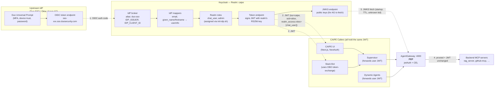
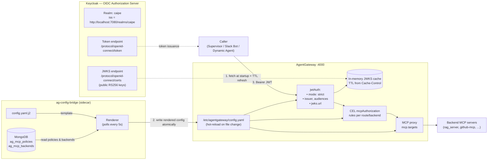

# RBAC Architecture

Component-by-component reference. Each section describes **what it owns**, **what it does NOT own**, and **the env vars / config files / extension points** you'd touch to change its behavior.

> Read [the index](./index.md) first if you want the big-picture mental model and the JWT primer.
> Read [Workflows](./workflows.md) for the request-flow sequence diagrams that tie all of this together.

---

## Component 1: Keycloak — HR & The Front Desk

> **Badge analogy:** HR issues ID badges. The front desk verifies them on entry. Every other door in the building trusts the badge's chip — they don't call HR each time. When a contractor arrives via a partner agency (Duo SSO), the front desk checks with the agency once, creates an internal record, and issues a standard building badge. From that point on, the contractor uses the same badge as everyone else.

**Technically:** Keycloak acts as an OIDC Authorization Server and IdP broker. It proxies login to Duo SSO via an OIDC client, maps external claims to local realm roles, and issues its own signed JWT — so downstream services only ever need to trust one issuer.

### Realm Roles (`caipe` realm)

| Role | Default? | Purpose |
|------|----------|---------|
| `chat_user` | Yes — all authenticated users | Grants access to supervisor, Slack bot, RAG tools via AgentGateway CEL |
| `admin` | No — explicit assignment | Full CAIPE admin UI: user management, team CRUD, role assignment, Keycloak Admin API proxy |
| `kb_admin` | No | Knowledge base management: upload documents, configure RAG pipelines |
| `team_member` | No | Scoped to team-visibility dynamic agents |

`chat_user` is in the `default-roles-caipe` composite, so every newly-created or brokered user gets it automatically. This is patched at runtime by `init-idp.sh` because Keycloak's realm import doesn't reliably populate composite role members.

### External IdP Brokering (Duo SSO, Okta, or any OIDC provider)

> **Badge analogy:** The partner agency desk. Whether it's Duo SSO, Okta, or any other corporate identity provider, they all speak the same language (OIDC). Keycloak is the single translator — it talks to whichever agency is configured and converts their badges into standard building badges. The rest of the building never needs to know which agency originally issued the contractor's credentials.

Keycloak acts as a **relying party** to the upstream IdP (OIDC). From the user's perspective it's invisible — they see only the upstream IdP login page. From a security perspective:

```
Browser ──OIDC auth code flow──▶ Keycloak
                                      │
                   ──OIDC auth code──▶ Upstream IdP (Duo SSO / Okta / any OIDC)
                                      │
                   ◀── id_token ───────┘  (external claims: email, name, groups)
                        │
                   Maps external claims to local roles via IdP mappers
                   Issues new Keycloak JWT with realm_access.roles
                        │
Browser ◀── Keycloak JWT ──────────────┘
```

**Supported upstream IdPs** — the `init-idp.sh` script configures any OIDC provider generically via OIDC discovery (`/.well-known/openid-configuration`):

| Provider | `IDP_ALIAS` (in realm) | `IDP_ISSUER` example | Notes |
|----------|----------------------|----------------------|-------|
| Duo SSO | `duo-sso` | `https://sso-xxx.sso.duosecurity.com/oidc/xxx` | Uses `firstname`/`lastname` (non-standard); extra IdP mappers handle both `given_name` and `firstname` |
| Okta (OIDC) | `okta-oidc` | `https://your-org.okta.com` or `https://your-org.okta.com/oauth2/default` | Standard OIDC claims; groups come from Okta's `groups` claim (requires Okta app config) |
| Okta (SAML) | `okta-saml` | — | SAML 2.0; configured as a SAML IdP in Keycloak; attribute mappers needed for groups |
| Microsoft Entra ID (OIDC) | `entra-oidc` | `https://login.microsoftonline.com/{tenant-id}/v2.0` | Standard OIDC; groups claim requires Entra app manifest `groupMembershipClaims` config |
| Microsoft Entra ID (SAML) | `entra-saml` | — | SAML 2.0; common in enterprise M365 environments |
| Generic OIDC | any alias | any OIDC-compliant issuer URL | Works as long as the provider exposes `/.well-known/openid-configuration` |

**To wire up a new IdP**, set these env vars and run `init-idp.sh` (or restart the `init-idp` container — it is idempotent):

```bash
IDP_ALIAS=okta                                 # short alias, used in kc_idp_hint
IDP_DISPLAY_NAME="Okta SSO"                    # shown on Keycloak login page (if visible)
IDP_ISSUER=https://your-org.okta.com           # OIDC issuer URL
IDP_CLIENT_ID=<okta-app-client-id>
IDP_CLIENT_SECRET=<okta-app-client-secret>
IDP_ACCESS_GROUP=caipe-users                   # Okta group → chat_user role (optional)
IDP_ADMIN_GROUP=caipe-admins                   # Okta group → admin role (optional)
OIDC_IDP_HINT=okta                             # auto-redirect browser to this IdP alias
```

**`OIDC_IDP_HINT`** (set in `ui/.env.local`) is passed to Keycloak as `kc_idp_hint` on every auth request. It skips the Keycloak login page entirely and redirects straight to the named IdP. Set it to the same value as `IDP_ALIAS`.

**Claim mapping chain:** The IdP sends `email`, `given_name`/`firstname`, `family_name`/`lastname`, and `groups` claims. Keycloak IdP mappers write these to the local user record. Role mappers translate `IDP_ACCESS_GROUP` membership to `chat_user` and `IDP_ADMIN_GROUP` to `admin`. If neither group var is set, all brokered users receive `chat_user` automatically via a hardcoded role mapper.

> The login sequence diagram (one-time login + the silent first-broker-login flow) lives in [Workflows › Login](./workflows.md#login--first-time-broker-login).

### User Profile & Custom Attributes

Keycloak 26+ enforces a user profile schema. Custom attributes are silently dropped unless declared or `unmanagedAttributePolicy=ADMIN_EDIT` is set. `init-idp.sh` patches both:

- Adds `slack_user_id` to the user profile schema with `admin`-only view/edit permissions
- Sets `unmanagedAttributePolicy=ADMIN_EDIT` so other Admin API attribute writes succeed

### Account Linking (Slack)

Three onboarding paths, evaluated in order:

- **Auto-bootstrap** (default, `SLACK_FORCE_LINK=false`) — bot looks up the Slack user's email, finds an existing Keycloak user, writes `slack_user_id` silently. Zero user action required.
- **Just-In-Time user creation** (default ON, `SLACK_JIT_CREATE_USER=true`, spec 103) — when no existing Keycloak user matches, the bot creates a federated-only shell user via `POST /admin/realms/{realm}/users` using the same `caipe-platform` admin credential. Optional domain allowlist via `SLACK_JIT_ALLOWED_EMAIL_DOMAINS`. 409 races are resolved by re-querying.
- **Explicit link** (`SLACK_FORCE_LINK=true`, or fallback when JIT is off / not allowed / fails) — bot sends an HMAC-signed link prompt; user clicks → SSO login → `slack_user_id` written via Admin API.

The full sequence (including HMAC URL shape, TTL enforcement, JIT request body, error kinds, and post-link OBO flow) is in [Workflows › Slack identity linking](./workflows.md#slack-identity-linking-auto-bootstrap--jit--forced-link).

---

## Component 2: CAIPE UI — The Reception Desk

> **Badge analogy:** The reception desk at each department entrance. When you badge in, it reads your chip (JWT), checks your clearance level for this department, and either waves you through or says "sorry, you don't have access here." It doesn't phone HR — the badge chip already carries everything needed to make the decision.

**Technically:** Next.js App Router with NextAuth (Auth.js v5) for OIDC session management. Every API route handler runs `requireRbacPermission()` which validates the server-side session and enforces role requirements before proxying to backend services.

### Authentication Flow

```
1. Browser visits http://localhost:3000
2. NextAuth detects no session → 302 to Keycloak (OIDC auth code flow)
3. Keycloak → Duo SSO (kc_idp_hint=duo-sso auto-redirects, user never sees KC)
4. Duo SSO login → auth code returned to Keycloak
5. Keycloak issues JWT → NextAuth exchanges code for tokens
6. NextAuth stores { accessToken, refreshToken, sub, roles } in encrypted server-side session cookie
7. Browser receives httpOnly session cookie — raw JWT never touches the browser
```

**Security note:** The JWT is stored in an httpOnly, Secure, SameSite=Lax session cookie managed by NextAuth. Client-side JavaScript cannot read it. The session is encrypted with `NEXTAUTH_SECRET`.

### Server-Side Authorization (`api-middleware.ts`)

```typescript
// Every protected API route:
await requireRbacPermission(request, {
  resource: 'rag',
  action: 'read',
  user: session.user,
  accessToken: session.accessToken,
  sub: session.sub,
  org: session.org,
})
```

Two authorization paths:

1. **Role-based (JWT claim):** `hasRoleFallback()` checks `realm_access.roles` from the session JWT against the required role for the resource+action pair.
2. **Bootstrap admin bypass:** `isBootstrapAdmin(email)` checks the email against `BOOTSTRAP_ADMIN_EMAILS`. This bypasses **all** resource/action checks. It exists for the chicken-and-egg problem: the first admin must be able to log in before Keycloak roles are properly configured. **Remove this env var once roles are working.**

### Token Refresh

NextAuth holds the refresh token and silently refreshes the access token before it expires. If the refresh fails (revoked session, Keycloak down), the user is redirected to login. The access token in the session is always the current live token — it's what gets forwarded to backend services.

---

## Component 3: Supervisor A2A Server — The Dispatcher

> **Badge analogy:** The dispatcher at the internal mail room. When you drop off a work order, they scan your badge, note your name and clearance on the paperwork, and attach a photo-copy of your badge to every sub-order sent to other departments. Downstream departments never need to ask who initiated the original request — it's stapled to everything.

**Technically:** A Starlette/FastAPI application running the LangGraph multi-agent supervisor. It has a layered middleware stack. The JWT is validated once at the outer layer, then decoded and stored in a per-request contextvar by `JwtUserContextMiddleware` so all downstream code can read user identity without re-parsing the header.

### Middleware Stack (outermost → innermost)

```
CORSMiddleware
    │
PrometheusMetricsMiddleware   (metrics, skips /health)
    │
OAuth2Middleware / SharedKeyMiddleware   (validates JWT signature + expiry)
    │
JwtUserContextMiddleware   (decodes claims → stores in contextvar)
    │
A2A request handler + LangGraph agent
```

`JwtUserContextMiddleware` is intentionally read-only. It does not re-validate the token — that's already done by the auth middleware above it. It decodes the JWT payload without verification, fetches the OIDC userinfo endpoint (cached 10 min) for authoritative email/name/groups, and stores the result in a `ContextVar`:

```python
# Set once per request by JwtUserContextMiddleware
_jwt_user_context_var: ContextVar[JwtUserContext | None]

# Read anywhere in the same request (agent executor, tools, sub-calls)
ctx = get_jwt_user_context()
# ctx.email, ctx.name, ctx.groups, ctx.token
```

### JWT Forwarding to MCP Tools

When `FORWARD_JWT_TO_MCP=true`, the supervisor forwards the **original, unmodified** bearer token from the incoming request to AgentGateway. This means:

- The token that reaches AgentGateway has `sub` = the real user (or OBO token with `act.sub` = bot)
- AgentGateway can evaluate the user's actual roles, not the supervisor's service account
- MCP servers that do their own JWT validation (e.g. RAG) see the real user identity

```
User JWT  →  Supervisor  →  (same JWT)  →  AgentGateway  →  MCP Server
```

**Security implication:** The supervisor must not modify or strip the bearer token before forwarding. If it substituted its own service account token, the entire per-user authorization chain would collapse.

### Key Environment Variables

| Variable | Purpose | Security note |
|----------|---------|---------------|
| `A2A_AUTH_OAUTH2=true` | Enable JWT signature validation | Off in dev; mandatory in prod |
| `A2A_AUTH_SHARED_KEY` | Shared-key auth alternative | Use only for service-to-service; not for user-facing flows |
| `ENABLE_USER_INFO_TOOL=true` | Extract identity from JWT (vs. `"by user: email"` prefix) | The JWT is the authoritative source; prefer this over message prefix |
| `FORWARD_JWT_TO_MCP=true` | Forward incoming JWT to MCP tools | Required for per-user enforcement at AgentGateway |
| `ISSUER` / `OIDC_ISSUER` | OIDC issuer for userinfo endpoint discovery | Must match `iss` claim in tokens |

---

## Component 4: AgentGateway — The Security Checkpoint

> **Badge analogy:** The armed security checkpoint at the entrance to the server room. Everyone must badge in — no exceptions, no tailgating. The checkpoint has a physical rulebook (CEL policies) specifying exactly which badge types (roles) can enter which server rack (MCP tool). If your badge says `chat_user` and the rack requires `kb_admin`, you're turned away at the door, not inside the rack.

**Technically:** AgentGateway is the single **Policy Enforcement Point (PEP)** for all MCP tool calls. It proxies HTTP/SSE requests to registered MCP backend servers and evaluates a CEL (Common Expression Language) policy against the JWT claims before allowing each request through. It is the only place in the architecture where tool-level authorization is enforced — MCP servers do not need their own authz logic beyond JWT signature validation.

### Request Flow

```
Supervisor POST /rag/v1/query
  Authorization: Bearer <JWT>
         │
         ▼
  AgentGateway
  ┌────────────────────────────────────────────┐
  │  1. Extract JWT from Authorization header  │
  │  2. Validate signature against JWKS        │
  │  3. Evaluate CEL policy against claims:    │
  │                                            │
  │     jwt.claims.realm_access.roles          │
  │       .exists(r, r == "chat_user")         │
  │                                            │
  │  4a. Policy DENY  →  403 Forbidden         │
  │  4b. Policy ALLOW →  proxy to MCP server   │
  └────────────────────────────────────────────┘
         │ ALLOW
         ▼
  RAG MCP Server
  (receives same JWT for its own validation)
```

### CEL Policy Examples

CEL is a lightweight expression language. Policies are evaluated per-route and per-method.

```cel
# Basic access: must have chat_user role
jwt.claims.realm_access.roles.exists(r, r == "chat_user")

# Elevated access: admin or kb_admin
jwt.claims.realm_access.roles.exists(r, r == "admin" || r == "kb_admin")

# Tenant-scoped: user can only query their own tenant's data
jwt.claims.tenant == resource.tenant

# Combine role and tenant
jwt.claims.realm_access.roles.exists(r, r == "chat_user")
  && jwt.claims.tenant != ""
```

### Why This Is the Right Architecture for a PEP

- **Decoupled policy from business logic:** MCP servers implement domain logic, not authz. Changing a policy means editing `config.yaml`, not redeploying an MCP server.
- **Consistent enforcement:** Every tool — RAG, GitHub, ArgoCD, Slack — goes through the same gateway with the same JWT. No tool can be accidentally left unenforced.
- **Token passthrough:** AgentGateway forwards the JWT to the MCP backend unchanged. The backend can do its own secondary validation (e.g. tenant isolation).

---

## AgentGateway + OIDC + Keycloak — The Integrated Picture

> **Badge analogy:** **Duo SSO is the national ID office** — it issues the underlying identity. **Keycloak is HR** — it takes that national ID, prints a CAIPE-branded employee badge with your roles stamped on it, and publishes a **public fingerprint scanner** (JWKS) in the lobby so anyone can verify a badge is really HR-issued. **AgentGateway is the armed checkpoint** at the server room door. The checkpoint has a photocopy of the scanner taped to its desk so it can verify badges instantly without calling HR (or Duo). The checkpoint's rulebook (CEL) is kept up to date by a small courier (`ag-config-bridge`) that walks between the head office (MongoDB) and the checkpoint every few seconds with the latest rule updates.

**Technically:** Three distinct services cooperate to put a verified, role-carrying JWT in front of AgentGateway on every request. AG itself is the **Policy Enforcement Point (PEP)** — it doesn't authenticate users, it doesn't store roles, and it never talks to Duo. It only verifies that the JWT in the request was signed by Keycloak (using a cached copy of Keycloak's JWKS) and that the claims inside satisfy the CEL policy for the target MCP tool.

| Layer | Role | What it owns | What it does NOT own |
|-------|------|--------------|----------------------|
| **Upstream IdP** (e.g. Duo SSO, Okta, Azure AD) | Identity provider | User authentication (password, MFA, device trust), email ownership | Application roles, per-tool access rules |
| **Keycloak** | OIDC AS + IdP broker | Realm roles (`chat_user`, `admin`), JWT issuance, JWKS publication, OBO token exchange (RFC 8693) | Tool-level decisions, user password (delegated to Duo) |
| **AgentGateway (PEP)** | Policy Enforcement Point | Per-route CEL rules, per-tool `mcpAuthorization` rules, local JWT verification against cached JWKS | Identity store, role store, token minting |

Keycloak **brokers** the upstream IdP — Duo SSO doesn't issue the JWT that AG sees. Duo authenticates the user, returns an OIDC authorization code to Keycloak, and Keycloak then mints the CAIPE JWT with the realm roles that CEL evaluates. From AG's perspective, **Keycloak is the only issuer it trusts** (`iss = http://localhost:7080/realms/caipe`); the existence of Duo is invisible to AG. This is the standard OIDC/OAuth 2.0 resource-server pattern applied to an MCP-aware proxy.

### Identity Provenance: Duo SSO → Keycloak → JWT → AG → MCP



**Read this as the badge's lifecycle:**

1. **Duo SSO authenticates the human.** It doesn't know about CAIPE roles. It only proves "this really is `alice@cisco.com` with working MFA" and hands an OIDC authorization code to Keycloak. Duo's issuer (`IDP_ISSUER`) is configured in Keycloak as `IDP_ALIAS=duo-sso`; this is the only direct contact between CAIPE and Duo.
2. **Keycloak brokers and rebrands the identity.** It validates the Duo code, runs its IdP mappers (e.g. `firstname` → `given_name` to handle Duo's non-standard claim), assigns realm roles (`chat_user` via the default role composite, plus `admin` if explicitly granted), and signs a **fresh JWT** with its own RS256 key. This is the only token CAIPE services ever see. Duo's identity token is discarded at the Keycloak boundary.
3. **Every CAIPE caller holds the same JWT.** The Slack Bot additionally does an RFC 8693 token-exchange to produce an **OBO (On-Behalf-Of) JWT** that pins `sub=alice` and `act.sub=caipe-slack-bot` — but it's still a Keycloak-signed JWT with `iss = http://localhost:7080/realms/caipe`. From AG's perspective there's no difference between a UI JWT and an OBO JWT; both pass `jwtAuth` as long as they're signed by a key in AG's JWKS cache.
4. **AG verifies locally, evaluates CEL locally, forwards unchanged.** The JWT reaches the MCP server with Alice's identity intact, so MCP-level defense-in-depth checks (e.g. the RAG server's per-tenant document ACLs) see the real user — not the supervisor's service account and not the Slack bot.

The practical consequence: **to switch CAIPE from Duo SSO to Okta or Azure AD you don't touch AgentGateway at all.** You change `IDP_ISSUER`, `IDP_CLIENT_ID`, `IDP_CLIENT_SECRET`, `IDP_ALIAS`, and maybe a mapper in Keycloak, and every component downstream — including the CEL rules on AG — keeps working without modification. This is the whole point of making Keycloak the IdP broker instead of having each service integrate directly with the upstream IdP.

### How AG Is Wired to Keycloak (at boot and at steady state)



**Three independent channels between Keycloak and AG — all pull-based, all public:**

| # | Channel | Direction | Purpose | Cadence |
|---|---------|-----------|---------|---------|
| 1 | JWKS | AG → Keycloak | Fetch public keys to verify JWT signatures | On startup; on unknown `kid`; on Cache-Control TTL expiry |
| 2 | CEL policy rendering | `ag-config-bridge` → AG (file) | Keep `config.yaml` in sync with admin-editable policies in MongoDB | Every 5s poll; hot-reload on file change |
| 3 | Token issuance | Client → Keycloak → Client | Users/bots obtain JWTs to present to AG; AG **never** mints tokens | On login / OBO exchange |

There is **no direct API call from AG to Keycloak per request**. JWKS fetching is a pure cache-refresh operation, not a live auth check.

### The Exact `jwtAuth` Contract (from `config.yaml`)

```yaml
binds:
- port: 4000
  listeners:
  - protocol: HTTP
    policies:
      jwtAuth:
        mode: strict           # reject request if no valid JWT present
        issuer: http://localhost:7080/realms/caipe
        audiences: [caipe-platform]
        jwks:
          url: http://keycloak:7080/realms/caipe/protocol/openid-connect/certs
```

What `mode: strict` means in practice:

- **`iss` must equal `issuer`** — tokens from any other realm or IdP are rejected with 401.
- **`aud` must contain at least one of `audiences`** — protects against token substitution where a token was issued to a different service client.
- **`exp`, `nbf`, `iat` enforced** — expired or not-yet-valid tokens rejected.
- **Signature verified against JWKS** — `kid` in the JWT header must match a cached key.
- **Unknown `kid` triggers one forced JWKS refresh** — handles Keycloak key rotation without manual intervention.

Only after `jwtAuth` passes does AG evaluate the `authorization` and `mcpAuthorization` CEL rules. If `jwtAuth` fails, the request never reaches policy evaluation.

### Policy Storage: Two Surfaces, One Source of Truth

AG's CEL rules can be authored two ways — they end up in the same MongoDB collection:

| Surface | Use case | Path |
|---------|----------|------|
| **Admin UI** (dynamic) | Change policy without a redeploy; audit trail per edit | `CAIPE UI → Admin → AG MCP Policies` → `ui/src/app/api/rbac/ag-policies/route.ts` → MongoDB `ag_mcp_policies` |
| **Static bootstrap** | First-run seed in environments that start from empty MongoDB | `deploy/agentgateway/config-bridge.py` → `SEED_POLICIES` (upserts once if collection empty) |

In both cases the **only consumer** is `ag-config-bridge`, which renders to `config.yaml.j2` and writes the final `config.yaml` that AG reads. There is no other path by which a CEL rule can reach AG.

### CEL Cheat Sheet — JWT Claims Available in Rules

AG evaluates CEL expressions against a context object that includes the **verified** JWT payload. The most useful fields:

```cel
# Realm roles (set in realm-config.json + init-idp.sh composites)
"chat_user" in jwt.realm_access.roles
"admin"     in jwt.realm_access.roles

# Client-level roles (rare — most roles live at the realm level in CAIPE)
"resource_access" in jwt && "caipe-ui" in jwt.resource_access

# User identity
jwt.sub             // opaque Keycloak user UUID
jwt.email           // human-readable
jwt.preferred_username

# Delegation (OBO tokens only — set by Slack bot's token-exchange)
has(jwt.act) && jwt.act.sub == "caipe-slack-bot"

# Multi-tenant scoping
jwt.org == request.headers.x_tenant_id

# MCP tool introspection (only inside mcpAuthorization, not on route-level authorization)
has(mcp.tool) && mcp.tool.name.startsWith("admin_")
```

The existing production ruleset in `deploy/agentgateway/config.yaml` shows the common patterns: admin-only prefixes (`admin_*`, `supervisor_config`), role-gated prefixes (`rag_query`, `rag_ingest`, `rag_tool`, `team_*`, `dynamic_agent_*`, `github_*`), and a catch-all for non-admin, non-ingest tools.

### Operational Guarantees

| Guarantee | Mechanism |
|-----------|-----------|
| AG restart does not invalidate user sessions | User JWTs are self-contained; AG just re-fetches JWKS on startup |
| Keycloak key rotation is zero-downtime | Unknown `kid` triggers one forced JWKS refresh; cached keys remain valid until `exp` |
| Policy update is zero-downtime | Atomic `os.replace()` write in `ag-config-bridge` + AG file watcher = no dropped requests |
| Admin UI edit audit trail | Every policy write to `ag_mcp_policies` records `updated_by` and `updated_at` |
| MongoDB outage doesn't take AG down | AG keeps running against the last-rendered `config.yaml`; `ag-config-bridge` logs `bridge_error` but doesn't crash AG |
| Keycloak outage doesn't take AG down for already-issued tokens | JWKS is cached; new logins fail at Keycloak, not at AG |

> The end-to-end per-request sequence diagram (and the demo walkthrough that proves all three outcomes — 200, 403, 401) lives in [Workflows › Per-request authorization](./workflows.md#per-request-authorization-end-to-end). Use that to demo the system live.

---

## Component 5: Dynamic Agents — The Workshop Floor

> **Badge analogy:** A workshop where employees build and operate their own machines. The workshop checks your badge at the door (JWT validation on every request). Once inside, each machine has its own access tag — some are personal (Private), some are shared with your team (Team), some anyone can use (Global). Your badge level determines which machines you can touch. When a machine makes a tool call, it presents your badge — not its own — so the security checkpoint still sees *you*, not the machine.

**Technically:** A FastAPI service where every route handler uses `get_current_user()` as a FastAPI `Depends()`. Unlike the supervisor (which uses a middleware contextvar), the dynamic agents service validates the JWT on every request at the route level, giving precise control per endpoint.

### JWT Validation Chain

```python
# FastAPI dependency injection — runs before every protected handler
user: UserContext = Depends(get_current_user)
```

Inside `get_current_user()`:

```
1. Extract Bearer token from Authorization header
2. Fetch JWKS from Keycloak (cached in-process)
3. Validate:
   - Signature (RS256 against JWKS public key)
   - expiry (exp)
   - issuer (iss == OIDC_ISSUER)
   - audience (aud == OIDC_CLIENT_ID, if set)
4. Call OIDC userinfo endpoint (cached 10 min by token hash)
   → authoritative email, name, groups (OIDC tokens often omit these)
5. Extract realm_access.roles from JWT claims
   (Keycloak puts roles here; also checked in userinfo)
6. Evaluate oidc_required_group (if set) — 403 if missing
7. Set is_admin via check_admin_role() pattern match against OIDC_REQUIRED_ADMIN_GROUP
8. Return UserContext { email, name, groups, is_admin, access_token, obo_jwt }
```

### Agent-Level Authorization (CEL or Visibility Rules)

After the user is authenticated, `can_use_agent(agent, user)` decides whether they can invoke a specific agent:

```
CEL expression configured? ──YES──▶ evaluate cel_dynamic_agent_access_expression
        │ NO
        ▼
  is_admin  →  ALLOW (admins can use any agent)
  owner_id == user.email  →  ALLOW
  visibility == GLOBAL  →  ALLOW
  visibility == TEAM && user.groups ∩ agent.shared_with_teams ≠ ∅  →  ALLOW
  visibility == PRIVATE  →  DENY
```

### Token Forwarding to MCP Tools

The `UserContext.obo_jwt` (set from `X-OBO-JWT` header) or `UserContext.access_token` is forwarded as the `Authorization: Bearer` header on all MCP tool calls made by the agent runtime. This gives the same per-user enforcement at AgentGateway as the supervisor path provides.

### Key Environment Variables

| Variable | Default | Security note |
|----------|---------|---------------|
| `AUTH_ENABLED` | `false` | **Must be `true` in production.** `false` returns a hardcoded `dev@localhost` admin — never deploy with `false`. |
| `OIDC_ISSUER` | — | Validated against `iss` claim; tokens from other issuers are rejected |
| `OIDC_CLIENT_ID` | — | Used as expected `aud` claim; prevents token substitution from other clients |
| `OIDC_REQUIRED_GROUP` | — | Blanket access gate; set to `chat_user` to mirror AgentGateway policy |
| `OIDC_REQUIRED_ADMIN_GROUP` | — | Group/role that grants `is_admin`; defaults to pattern matching "admin" |

---

## Service-to-Service Authentication (Slack bot → caipe-ui)

The Slack bot calls caipe-ui's API as a machine client, not as a logged-in user. It uses the OAuth2 `client_credentials` grant against the `caipe` realm:

| Env var | Purpose |
|---------|---------|
| `SLACK_INTEGRATION_ENABLE_AUTH=true` | Enables Bearer-token path in `app.py` |
| `SLACK_INTEGRATION_AUTH_TOKEN_URL` | `${KEYCLOAK_URL}/realms/caipe/protocol/openid-connect/token` |
| `SLACK_INTEGRATION_AUTH_CLIENT_ID` | `caipe-slack-bot` (pre-created in `realm-config.json`) |
| `SLACK_INTEGRATION_AUTH_CLIENT_SECRET` | Fetched from Keycloak — see "Provisioning service-client secrets" below |

**Token shape** (fields that matter):

- `iss` — `${KEYCLOAK_URL}/realms/caipe`
- `aud` — `[caipe-ui, caipe-platform]` — both audiences are needed. `caipe-platform` is added by Keycloak's default audience resolution; `caipe-ui` comes from an `oidc-audience-mapper` protocol mapper (`aud-caipe-ui`) on the `caipe-slack-bot` client. caipe-ui's JWT validator rejects tokens whose audience doesn't include `OIDC_CLIENT_ID` (i.e. `caipe-ui`), so this mapper is required.
- `azp` — `caipe-slack-bot`
- `sub` — service account UUID (stable)
- `preferred_username` — `service-account-caipe-slack-bot`
- `scope` — `groups email profile org roles`

The mapper is created automatically by `deploy/keycloak/init-idp.sh` (idempotent).

**This token represents the bot, not the user.** User identity is carried separately by the OBO flow in `utils/obo_exchange.py` (RFC 8693 token exchange), which produces a second token with `act.sub=caipe-slack-bot` and the real user's `sub`/`email`.

### Provisioning service-client secrets in production

In dev, secrets are embedded in `deploy/keycloak/realm-config.json`. In production, operators should treat them as rotating credentials:

**Option A — manual (Keycloak Admin UI):**

1. Log into Keycloak Admin Console → `caipe` realm → Clients → `caipe-slack-bot` → Credentials tab.
2. Copy the Secret value (or click **Regenerate Secret** for rotation).
3. Store it in your secret manager (Vault, AWS SSM, K8s Secret) as `SLACK_INTEGRATION_AUTH_CLIENT_SECRET`.
4. Redeploy / restart the Slack bot pod so it picks up the new secret.

**Option B — scripted (`deploy/keycloak/export-client-secrets.sh`):**

The script fetches secrets via the Keycloak Admin API and emits them in one of three formats:

```bash
# shell (source into current session)
eval "$(KC_URL=https://keycloak.example.com ./export-client-secrets.sh)"

# dotenv (append to a .env file)
KC_URL=https://keycloak.example.com FORMAT=dotenv \
  ./export-client-secrets.sh >> slack-bot.env

# kubernetes Secret (pipe to kubectl)
KC_URL=https://keycloak.example.com FORMAT=k8s \
  K8S_NAMESPACE=caipe K8S_SECRET_NAME=caipe-service-secrets \
  ./export-client-secrets.sh | kubectl apply -f -
```

The Helm chart can wire this up as a post-install Job so fresh installs get the Secret populated without operator intervention. Rotation is the same call — the Secret is overwritten in place.

## Slack bot → Keycloak Admin REST API (identity lookup)

Separate from the OBO flow above. The Slack bot also calls Keycloak's **Admin REST API** to find a Keycloak user by `slack_user_id` attribute (and to read/write `team_id`). This is the call that fires when someone @mentions the bot for the first time. It uses `client_credentials` and a **different** Keycloak client than the OBO flow.

| Env var | Purpose |
|---------|---------|
| `KEYCLOAK_SLACK_BOT_ADMIN_CLIENT_ID` | Confidential Keycloak client for slack-bot's Admin API calls (lookup + JIT create). **Default `caipe-platform`** — that client's service account is granted `view-users` + `query-users` + `manage-users` on `realm-management` by the realm seeder. |
| `KEYCLOAK_SLACK_BOT_ADMIN_CLIENT_SECRET` | Matching client_secret. In dev, defaults to `caipe-platform-dev-secret`. |
| `KEYCLOAK_URL`, `KEYCLOAK_REALM` | Same values as everywhere else. |
| `SLACK_JIT_CREATE_USER` (spec 103) | `true` (default) auto-creates a federated-only Keycloak shell user on first DM when no Keycloak user with the Slack email exists. `false` falls through to the HMAC link URL so onboarding requires the web UI. Reuses `KEYCLOAK_SLACK_BOT_ADMIN_*` — no new secret. See [plan R-8](../../specs/103-slack-jit-user-creation/plan.md) for the single-credential trade-off. |
| `SLACK_JIT_ALLOWED_EMAIL_DOMAINS` (spec 103) | Optional comma-separated allowlist (e.g. `corp.com,acme.io`). Empty = any domain. Recommended for prod when the federated IdP can return non-corporate emails. |

> **Why `KEYCLOAK_SLACK_BOT_ADMIN_*` and not just `KEYCLOAK_ADMIN_*` or `KEYCLOAK_BOT_ADMIN_*`?** Two reasons:
>
> 1. **No collision with the UI BFF.** Pre-098 the slack-bot read the same `KEYCLOAK_ADMIN_*` env names as the UI BFF. Both services share `docker-compose.dev.yaml` env interpolation, so a single `KEYCLOAK_ADMIN_CLIENT_ID=admin-cli` line in `.env` (intended for the UI's password-grant fallback) silently overrode the slack-bot's client_credentials path, producing `HTTP 401 "Public client not allowed to retrieve service account"` on every Slack mention.
> 2. **Room for future surfaces.** The surface-specific prefix (`KEYCLOAK_<surface>_BOT_ADMIN_*`) means future bot integrations like `KEYCLOAK_WEBEX_BOT_ADMIN_*` or `KEYCLOAK_TEAMS_BOT_ADMIN_*` can each have their own dedicated namespace without yet another rename.

**Required client config in Keycloak** (any client you point this at):

- `publicClient: false`
- `serviceAccountsEnabled: true`
- `clientAuthenticatorType: client-secret`
- Service-account user has these `realm-management` client roles: `view-users`, `query-users` (add `manage-users` if you need the bot to write user attributes).

The realm seeder already provisions `caipe-platform` with all of those, so the default values "just work" in dev.
