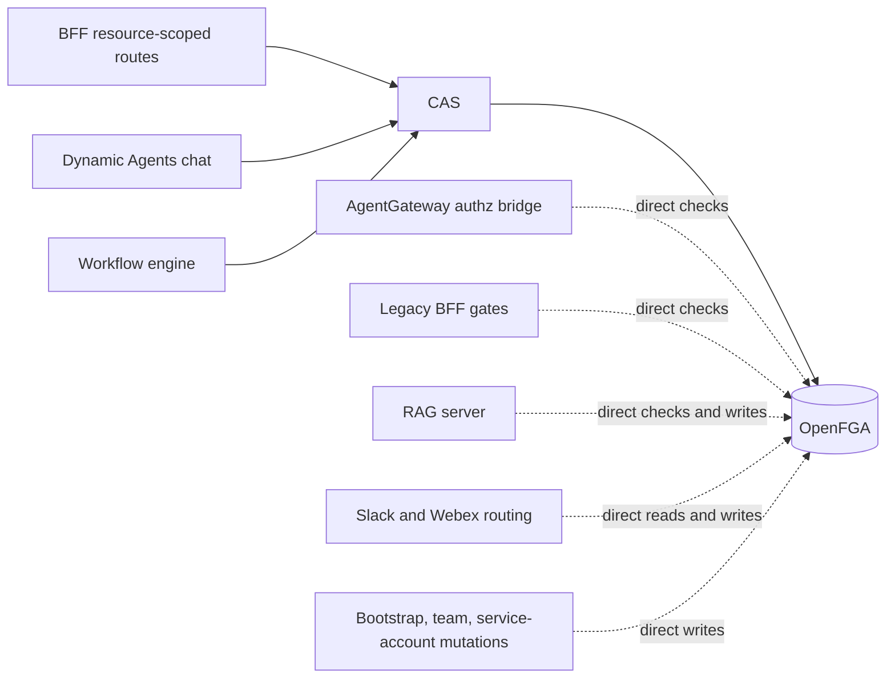

# CAS Coverage and Migration Gaps

**Status:** Living inventory, last reviewed 2026-08-15.

**CAS** means the CAIPE **Centralized Authorization Service** in
`ui/src/lib/authz`. Compare-and-set is a separate mechanism used when publishing
authorization reconciliation state.

## Target state

Runtime authorization decisions and relationship mutations should pass through
CAS so every path gets the same:

- product-policy pre-checks, including private-resource interaction rules;
- OpenFGA capability mapping;
- decision and mutation audit records;
- cache invalidation after relationship changes;
- fail-closed error behavior.



Solid lines are CAS-backed. Dotted lines are migration gaps unless listed as an
intentional exception below.

## Current CAS coverage

| Surface | CAS entry point | Notes |
|---|---|---|
| BFF resource decisions | `ui/src/lib/rbac/resource-authz.ts` | `requireResourcePermission`, `filterResourcesByPermission`, and related helpers use CAS by default. A test-injected `check` function deliberately bypasses CAS. |
| Dynamic Agents chat execution | `ai_platform_engineering/dynamic_agents/src/dynamic_agents/auth/authz.py` | Sends the caller-bound decision to `/api/authz/v1/decisions` and fails closed if CAS is unavailable. |
| Workflow authorization | `ui/src/lib/server/workflow-cas-authz.ts` | Uses in-process `authorize` and `authorizeMany`. |
| Shareable-resource reconciliation | `ui/src/lib/rbac/openfga-owned-resources-reconcile.ts` | Agent, MCP server, credential, and other migrated lifecycles call `reconcileTupleDiff`. |
| CAS tuple reconciliation | `ui/src/lib/authz/reconcile.ts` | Writes the OpenFGA diff, invalidates the CAS decision cache, and emits a reconciliation audit event. |

## Active gaps

### 1. AgentGateway MCP authorization

`deploy/openfga/bridge/main.py` calls OpenFGA directly for gateway, MCP server,
owner, agent, and tool capabilities.

This is the highest-risk gap because it is a runtime data-plane enforcement
point. It cannot safely call the existing public, subject-bound CAS endpoint:
AgentGateway may consume the bearer and send only verified identity metadata to
`ext_authz`.

**Migration requirement:** add an authenticated internal CAS protocol that
accepts only gateway-verified identity and trusted interaction context. Do not
accept a caller-supplied subject header as proof of identity.

### 2. Legacy BFF organization and admin gates

The following helpers perform direct OpenFGA checks instead of calling CAS:

- `requireRbacPermission` in `ui/src/lib/api-middleware.ts`;
- `requireAdminSurfaceManage`, `requireBaselineAdminSurfaceRead`, and profile
  helpers in `ui/src/lib/rbac/require-openfga.ts`;
- `requireAgentUsePermission` in
  `ui/src/lib/rbac/openfga-agent-authz.ts`;
- direct `checkOpenFgaTuple` calls in route handlers and legacy RBAC helpers.

The resource-scoped BFF decision may already use CAS while an outer, coarse
organization gate still uses direct OpenFGA. That hybrid path is protected, but
it produces two authorization implementations and inconsistent audit semantics.

### 3. Slack and Webex authorization

Direct-message agent selection calls `/api/user/check_agent_access`. That route
applies the private-resource context rule locally, then uses the direct-OpenFGA
`evaluateAgentAccess` helper.

Channel and space paths also access OpenFGA directly:

- Slack routing and auto-assignment:
  `ai_platform_engineering/integrations/slack_bot/utils/slack_agent_routes.py`
  and `slack_channel_auto_assign.py`;
- Webex routing and auto-assignment:
  `ai_platform_engineering/integrations/webex_bot/utils/webex_agent_routes.py`
  and `webex_space_auto_assign.py`;
- Slack/Webex admin synchronization writers in the bot admin API modules.

**Migration requirement:** pass server-derived `surface` and
`conversationKind` to CAS. Group paths must never fall back to a direct human
owner grant.

### 4. RAG authorization

`ai_platform_engineering/knowledge_bases/rag/server/src/server/rbac.py`
implements direct OpenFGA checks, list-objects calls, tuple reads, and tuple
writes for data sources, knowledge bases, MCP tools, team capabilities, and
organization administration.

The BFF proxy may perform a CAS-backed resource check before forwarding, but
the RAG server remains an independent policy implementation.

### 5. Relationship mutations outside CAS

Direct `writeOpenFgaTuples`, `writeOpenFgaTupleDiff`, and
`deleteExactOpenFgaTuples` calls remain in these lifecycle families:

- service-account create, scope, revoke, and cleanup;
- team membership, team capabilities, archived-team cleanup, and identity sync;
- Slack channel and Webex space routes, resources, teams, and defaults;
- conversation sharing and implicit conversation grants;
- login, bootstrap-admin, super-admin, and unlinked-service-account repair;
- Tome administrator/data-steward reconciliation;
- RBAC migrations, repair, and backfill paths.

These mutations reach OpenFGA but skip CAS cache invalidation and the canonical
`cas_reconcile` audit event. Product lifecycle writers should migrate to
`reconcileTupleDiff`. Temporary probe grants should use an explicitly scoped CAS
helper with guaranteed cleanup.

## Intentional direct OpenFGA operations

Not every direct call is a migration defect. These operations may remain direct
when they are isolated from product authorization decisions:

- OpenFGA store creation, model publication, and first-install seed tuples;
- raw OpenFGA administration, graph inspection, explain diagnostics, and
  self-check tooling;
- read-only drift reports and migration planning;
- the low-level OpenFGA adapter used internally by CAS.

Mutation-capable administrative tools still require a CAS-backed meta-
authorization gate and must identify their direct writes in audit logs.

The legacy Dynamic Agents module
`dynamic_agents/auth/openfga_authz.py` also calls OpenFGA directly, but the
active chat routes import `dynamic_agents/auth/authz.py`, which uses CAS. Treat
the legacy module as removal work, not an active enforcement gap.

## Source snapshot

The following counts are overlapping indicators, not a total number of unique
gaps. They were measured on 2026-08-15:

| Indicator | API route files |
|---|---:|
| Uses `requireRbacPermission` | 78 |
| Uses a `require-openfga` admin/profile helper | 21 |
| Uses `requireAgentUsePermission` | 5 |
| Directly references `checkOpenFgaTuple` | 17 |
| Directly references an OpenFGA tuple mutation helper | 30 |

Reproduce the inventory from the repository root:

```bash
rg -l 'requireRbacPermission' ui/src/app/api -g '*.ts' -g '!**/__tests__/**' \
  -g '!**/*.test.ts'
rg -l 'requireAdminSurfaceManage|requireBaselineAdminSurfaceRead|requireUserProfileRead' \
  ui/src/app/api -g '*.ts' -g '!**/__tests__/**' -g '!**/*.test.ts'
rg -l 'requireAgentUsePermission' ui/src/app/api -g '*.ts' \
  -g '!**/__tests__/**' -g '!**/*.test.ts'
rg -l 'checkOpenFgaTuple' ui/src/app/api -g '*.ts' -g '!**/__tests__/**' \
  -g '!**/*.test.ts'
rg -l 'writeOpenFgaTuples|writeOpenFgaTupleDiff|deleteExactOpenFgaTuples' \
  ui/src/app/api -g '*.ts' -g '!**/__tests__/**' -g '!**/*.test.ts'
rg -n 'OPENFGA|openfga' ai_platform_engineering -g '*.py' -g '!**/test_*.py'
```

Review each match: imports, read-only diagnostics, CAS's own adapter, and test
injection points are not product-policy bypasses.

## Migration order

1. Add an authenticated internal CAS transport for AgentGateway.
2. Move `/api/user/check_agent_access` and the active bot decision paths to CAS.
3. Move RAG data-plane decisions to CAS.
4. Replace legacy BFF organization/admin gates with CAS actions.
5. Route service-account, team, channel, space, and conversation mutations
   through CAS reconciliation.
6. Retire dead direct-OpenFGA modules and then review bootstrap/migration tools.

## Related documentation

- [CAS implementation architecture](../../specs/2026-06-06-cas-implementation/architecture.md)
- [PDP coverage audit](./pdp-coverage-audit.md)
- [OpenFGA permission evaluation](./openfga-permission-evaluation.md)
