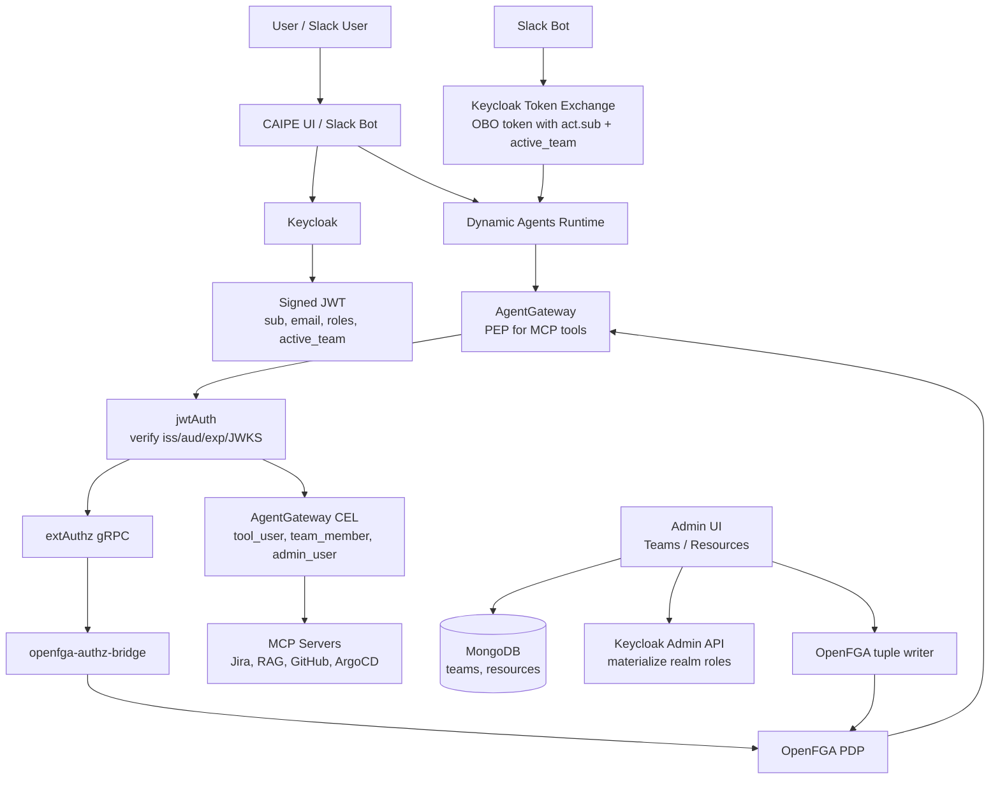
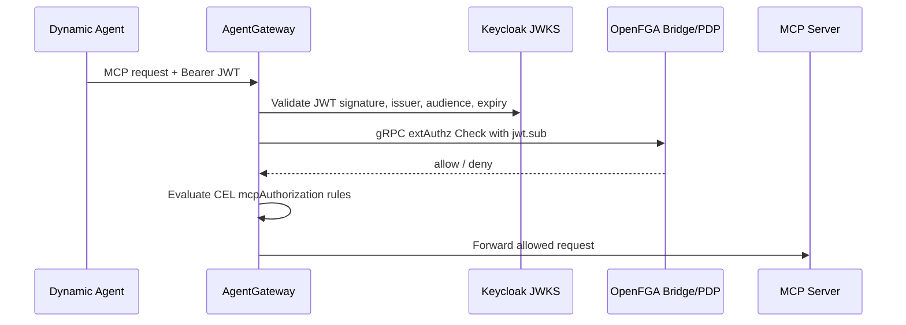
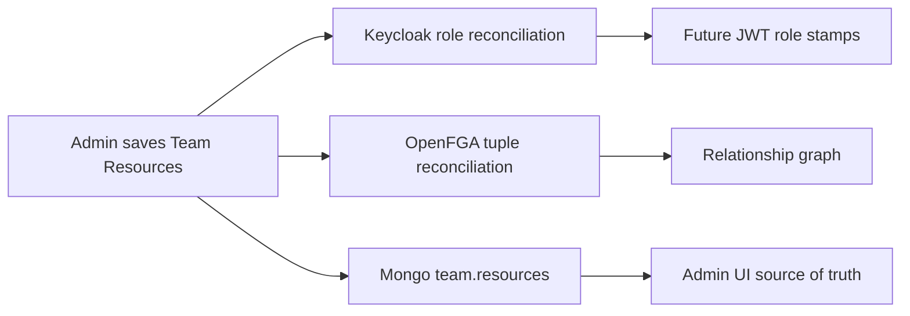
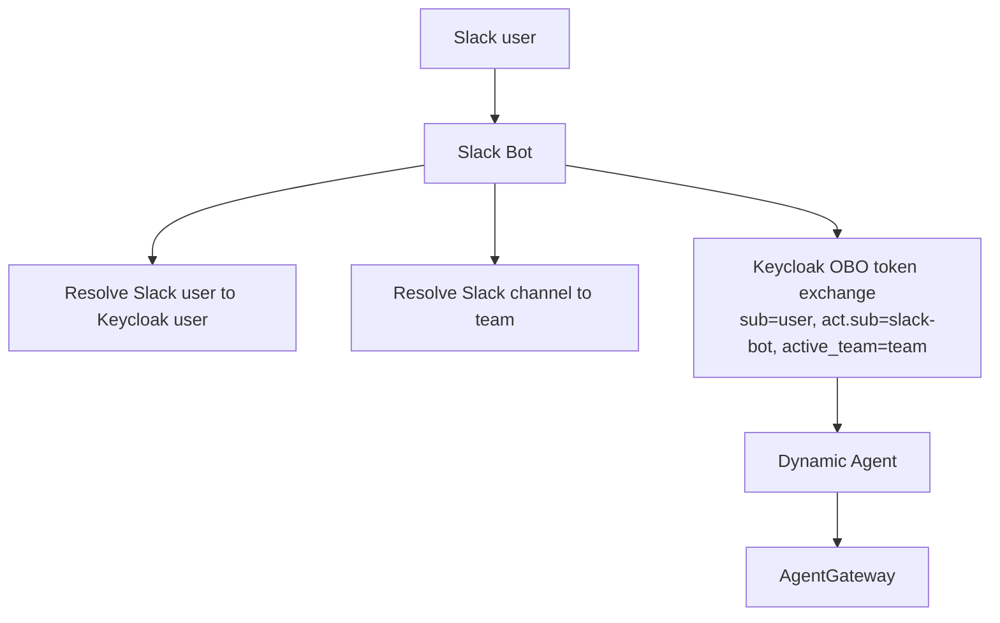

# Comprehensive RBAC Refactor

This page is the short, end-to-end explanation of the Comprehensive RBAC
refactor: what changed, which system owns each decision, and how Keycloak,
AgentGateway, OpenFGA, the Admin UI, Dynamic Agents, and Slack fit together.

## TL;DR

Comprehensive RBAC makes **Keycloak the identity and role issuer**,
**AgentGateway the MCP policy enforcement point**, and **OpenFGA the relationship
policy engine**.

Today, enforcement is hybrid:

- **Keycloak JWT roles** still drive most fine-grained decisions.
- **AgentGateway** validates JWTs, calls **OpenFGA** first, then runs CEL rules
  per MCP tool.
- **Admin UI Team Resources** writes both Keycloak roles and OpenFGA tuples from
  one place.
- **OpenFGA currently gates MCP access coarsely** with
  `user:<sub> can_call document:mcp`; richer team, agent, tool, and KB tuples are
  modeled and written so they can become authoritative per-resource checks.

## Big Picture



## Request Flow

1. A user logs in through Keycloak, usually brokered from an enterprise IdP such
   as Duo SSO or Okta.
2. Keycloak issues a signed JWT.
3. The JWT carries identity and roles such as `admin`, `chat_user`,
   `team_member:platform-engineering`, and `tool_user:jira_*`.
4. Dynamic Agents forwards the user JWT to AgentGateway when calling MCP tools.
5. AgentGateway verifies the JWT with Keycloak JWKS.
6. AgentGateway calls OpenFGA through gRPC `extAuthz`.
7. If OpenFGA allows, AgentGateway evaluates CEL tool rules.
8. If CEL allows, the MCP request reaches Jira, RAG, GitHub, ArgoCD, or another
   backend MCP server.



Failure behavior:

- JWT validation fails: AgentGateway returns `401`.
- OpenFGA denies or is unavailable: AgentGateway returns `403`.
- CEL denies: the request never reaches the MCP server.

## Keycloak Role Model

Keycloak owns authentication, JWT issuance, and realm-role materialization.

| Role | Meaning |
|------|---------|
| `chat_user` | Basic authenticated CAIPE user |
| `admin` | Admin UI access |
| `kb_admin` | Knowledge base administration |
| `admin_user` | Spec 104 superuser for resource checks |
| `team_member:<slug>` | User belongs to a team |
| `team_admin:<slug>` | User can manage a team |
| `agent_user:<agent_id>` | User can chat with a dynamic agent |
| `agent_admin:<agent_id>` | User can manage that agent |
| `tool_user:<tool>` | User can call one MCP tool |
| `tool_user:<server>_*` | User can call all tools from one MCP server, for example `tool_user:jira_*` |
| `tool_user:*` | User can call all MCP tools |

The `active_team` JWT claim tells AgentGateway which team context is active for
the request. Team slugs, not Mongo ObjectIds, are used in team-scoped roles.

## AgentGateway

AgentGateway is the central policy enforcement point for MCP traffic. It is not
the identity store and it does not mint tokens. It validates Keycloak-issued
JWTs, delegates relationship checks to OpenFGA, then applies local CEL rules.

AgentGateway policy order:

1. `jwtAuth`: strict JWT validation against Keycloak issuer, audience, expiry,
   and JWKS signature.
2. `extAuthz`: gRPC call to `openfga-authz-bridge`, passing verified `jwt.sub`
   metadata.
3. `authorization` and `mcpAuthorization`: CEL checks over JWT claims and MCP
   tool context.
4. MCP proxy: forwards the request to the configured backend server only after
   all policy layers allow.

## OpenFGA Rules

The current OpenFGA model contains the existing coarse AgentGateway gate plus
richer ReBAC facts written from the Admin UI.

```text
user:<sub> can_call document:mcp

user:<sub> member team:<slug>
team:<slug>#member can_use agent:<agent_id>
team:<slug>#member can_manage agent:<agent_id>
team:<slug>#member can_call tool:<server>_*
team:<slug>#member can_call tool:*

team:<slug>#member can_read knowledge_base:<id>
team:<slug>#member can_ingest knowledge_base:<id>
team:<slug>#member can_admin knowledge_base:<id>
```

Important nuance: AgentGateway currently checks OpenFGA only for the coarse
`document:mcp` object. The richer `team`, `agent`, `tool`, and `knowledge_base`
tuples are written now so the relationship graph is ready for full per-resource
PDP enforcement once MCP tool context is passed into OpenFGA checks.

## Admin UI As Policy Authoring Surface

The Admin UI has two human-facing ReBAC surfaces:

- **Team Resources** is the source-of-truth editor for team grants. Admins choose
  which agents and MCP tool prefixes a team can use, and the BFF materializes the
  change into Keycloak roles, OpenFGA tuples, and Mongo intent.
- **OpenFGA ReBAC** is the relationship workbench. It provides a guided tuple
  builder, effective-access preview, policy/resource graph, and advanced tuple
  inspector without exposing OpenFGA directly to the browser.

When an admin saves team resources:



Example: granting `platform-engineering` access to Jira writes both:

- Keycloak role assignment: `tool_user:jira_*`
- OpenFGA tuple: `team:platform-engineering#member can_call tool:jira_*`

Most admins should use Team Resources. Platform admins can use OpenFGA ReBAC for
one-off relationship creation, checks, visualization, and safe tuple cleanup.
MongoDB keeps the UI-level intent, Keycloak gets JWT-compatible role
materialization, and OpenFGA gets the relationship graph.

## Slack Path

Slack uses the same authorization model, but gets user context through
On-Behalf-Of token exchange.



If a Slack channel is mapped to `platform-engineering`, the bot requests an OBO
token with `active_team=platform-engineering`. AgentGateway then sees the same
user/team context as the web UI path.

## Ownership Summary

| Component | Owns | Does not own |
|-----------|------|--------------|
| Keycloak | Identity, JWT signing, realm roles, OBO token exchange | MCP proxying, OpenFGA relationships |
| Admin UI | Human policy authoring, team resources, Mongo source of intent | JWT validation for MCP traffic |
| Dynamic Agents | Agent runtime, tool loading, forwarding user JWT to MCP path | Final MCP authorization |
| AgentGateway | JWT validation, OpenFGA `extAuthz`, CEL, MCP proxying | User database, token minting |
| OpenFGA | Relationship graph and PDP decisions | JWT validation, traffic proxying |
| MCP servers | Domain APIs such as Jira, RAG, GitHub, ArgoCD | Primary centralized authorization |

## One-Sentence Mental Model

Keycloak says who you are and what role stamps are on your badge; OpenFGA says
what relationships you have to teams and resources; AgentGateway checks both
before any MCP tool is allowed to run.
