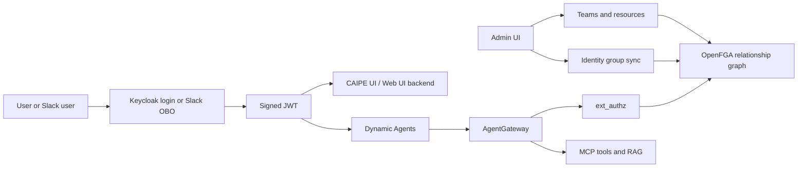
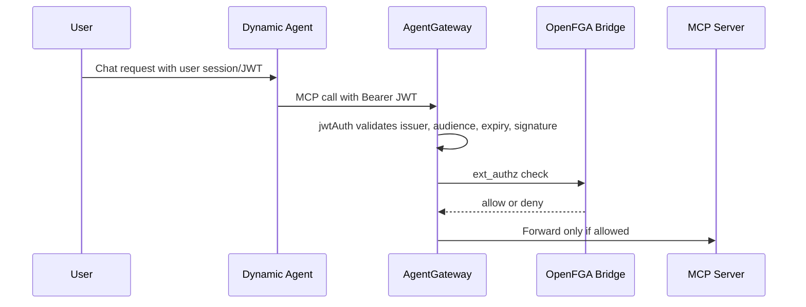

# Enterprise RBAC and ReBAC Feature Guide

**Audience:** CAIPE users, team administrators, platform operators, security reviewers, and engineers who need one linear explanation of the feature.

**Use this page when you need to explain CAIPE authorization front to back:** what the feature does, how the architecture is deployed, how a request is authorized, how teams and identity groups are managed, how Slack fits in, and where to go when something is denied.

---

## 1. What This Feature Does

Enterprise RBAC and ReBAC gives CAIPE a single, auditable authorization model across the UI, Slack, dynamic agents, AgentGateway, MCP tools, and RAG resources.

At a high level:

1. Users authenticate through Keycloak, usually brokered from an enterprise identity provider such as Okta or Duo SSO.
2. Keycloak issues a signed JWT that proves who the user is.
3. CAIPE maps users into teams through manual assignment, login-time IdP group claims, and optional direct Okta directory sync.
4. Team and resource relationships are written into OpenFGA.
5. CAIPE UI API routes enforce management-plane permissions before changing data.
6. Dynamic Agents forward the user's token downstream when a tool is called.
7. AgentGateway validates the token, calls OpenFGA through `ext_authz`, and only then proxies to MCP servers.
8. MCP servers and RAG services keep their own validation and resource filters as defense in depth.

The outcome for a CAIPE user is simple: they see and use only the agents, tools, knowledge bases, Slack channels, teams, and admin capabilities that their identity and relationships allow.

---

## 2. Mental Model

Think of CAIPE like a secure enterprise workspace:

- **Keycloak is HR and the front desk.** It knows who the user is and issues the signed badge.
- **The JWT is the badge.** It contains identity claims and role stamps, and every service can verify that it was issued by Keycloak.
- **Teams are departments.** A user can belong to one or many teams.
- **Identity groups are corporate directory groups.** They can automatically map users into CAIPE teams.
- **OpenFGA is the access graph.** It answers relationship questions such as "can this user, through this team, use this resource?"
- **AgentGateway is the security checkpoint for MCP tools.** It validates the badge and asks OpenFGA before allowing a tool call.
- **The Admin UI is the policy workbench.** Admins manage teams, users, identity-group sync rules, team resources, Slack channel grants, and OpenFGA relationships.
- **Slack is another entrance into the same building.** A Slack message is converted into a Keycloak user context before CAIPE runs an agent or tool.

The feature is not "a Slack-only RBAC change" or "a UI-only admin change." It is the shared authorization layer for every CAIPE path where a human, bot, agent, or tool touches protected resources.

---

## 3. Who Uses It

### End Users

End users log in to CAIPE or interact with CAIPE from Slack. They do not normally edit policy. Their experience is:

- They can chat with agents they are allowed to use.
- They can invoke MCP tools their team or direct relationships allow.
- They can search or ingest knowledge only where their KB permissions allow.
- In Slack, their access is based on their linked Keycloak identity and the Slack channel or DM context.

### Team Administrators

Team admins manage a bounded set of team-level relationships:

- Team membership.
- Team resource grants, such as which agents or MCP tool prefixes a team can use.
- Slack channel mappings or resource grants for channels they administer.
- Team-level troubleshooting using access checkers and provenance views.

Team admins should not need to understand every OpenFGA tuple. The UI should expose the policy in team/resource terms.

### Platform Administrators

Platform admins manage the full system:

- Keycloak realm roles, IdP configuration, OIDC clients, token exchange, and bootstrap admin cleanup.
- OpenFGA model and tuple repair.
- Global ReBAC resource catalog and enforcement state.
- Identity group sync providers and mapping rules.
- Slack bot identity, linking, channel authorization, and OBO exchange.
- Deployment health for Keycloak, CAIPE UI, AgentGateway, OpenFGA, dynamic agents, Slack bot, and MCP services.

### Security Reviewers

Security reviewers use this feature to answer:

- Who can access a resource?
- Why was a user allowed or denied?
- Which identity source granted this user membership?
- Which policy surface owns this decision?
- Does the system fail closed when the PDP is down?
- Are secrets and bootstrap bypasses removed after setup?

---

## 4. Architecture at 100,000 Feet




The important separation is:


| Layer              | Primary job                                                                        |
| ------------------ | ---------------------------------------------------------------------------------- |
| Keycloak           | Authenticate users and issue signed tokens                                         |
| CAIPE UI / Web UI backend     | Enforce management-plane route permissions and write policy intent                 |
| MongoDB            | Store UI intent, teams, mappings, provenance, and operational state                |
| OpenFGA            | Store and answer relationship authorization decisions                              |
| Dynamic Agents     | Run agents and forward the user's JWT to downstream tool paths                     |
| AgentGateway       | Enforce MCP gateway access with `jwtAuth` plus OpenFGA `ext_authz`                 |
| MCP / RAG services | Execute domain operations with service-side validation and filters                 |
| Slack bot          | Convert Slack events into CAIPE user/team context through identity linking and OBO |


---

## 5. Architecture at a Lower Level

### Identity Provider Layer

Keycloak is the CAIPE token issuer. It may broker an upstream enterprise IdP, but CAIPE services trust Keycloak as the issuer.

Keycloak owns:

- OIDC login.
- JWT signing keys and JWKS publication.
- Realm roles such as `admin`, `chat_user`, `team_member:<slug>`, and `tool_user:<prefix>`.
- OIDC clients such as `caipe-ui`, `caipe-slack-bot`, and `agentgateway`.
- Token exchange for Slack OBO flows.
- User attributes such as `slack_user_id`.

Keycloak does not own:

- OpenFGA relationships.
- Team resource intent in the Admin UI.
- AgentGateway proxy configuration.
- MCP tool implementation.

### Management Plane

The management plane is where admins change policy. Most of it lives in the CAIPE UI and Web UI backend API routes.

Protected API routes use dual authentication:

- Browser session from NextAuth.
- Bearer token for service or test callers.

Routes then call RBAC permission checks before performing mutations. This is the path used by admin pages such as teams, users, roles, identity group sync, Slack channel grants, OpenFGA ReBAC, and audit views.

### Relationship Plane

OpenFGA stores relationship tuples. The model represents relationships such as:

```text
user:<sub> member team:<slug>
team:<slug>#member can_use agent:<agent_id>
team:<slug>#member can_call tool:<server>_*
team:<slug>#member can_read knowledge_base:<id>
slack_channel:<channel> can_use agent:<agent_id>
```

The exact vocabulary is owned by the Universal ReBAC resource catalog and tuple builders in the UI codebase. The current AgentGateway bridge uses OpenFGA for the gateway decision, but it defaults to a coarse configured object (`can_call mcp_gateway:list`) unless `OPENFGA_RELATION` and `OPENFGA_OBJECT` are configured differently. Richer per-team, per-agent, per-tool, and per-KB tuples are still authored for ReBAC views, explanations, service-side checks, and finer-grained gateway enforcement work.

### Data Plane

The data plane is where users actually use agents and tools.

For MCP calls:

1. The user has a JWT.
2. Dynamic Agents forwards the JWT to AgentGateway.
3. AgentGateway validates the token using `jwtAuth`.
4. AgentGateway calls the OpenFGA bridge through `ext_authz`.
5. The bridge converts the request into an OpenFGA check. In the current deployed bridge, that check defaults to `can_call mcp_gateway:list`.
6. If OpenFGA allows, AgentGateway proxies to the MCP server.
7. If OpenFGA denies or the bridge is unavailable, AgentGateway returns `403`.
8. If JWT validation fails, AgentGateway returns `401`.

AgentGateway does not manage AG MCP Policies anymore. There is no Mongo-backed AgentGateway CEL policy CRUD surface and no config bridge that renders MCP authorization rules. Gateway access is delegated to OpenFGA through `ext_authz`; richer resource relationships are managed in OpenFGA rather than in AgentGateway policy documents.

The Admin UI no longer exposes the old `Policy` tab or CEL tab-visibility editor.
The Security & Policy area is intentionally centered on audit review and
OpenFGA/ReBAC relationship management.

---

## 6. Core Concepts

### Users

A CAIPE user is represented by a Keycloak user. The most important stable identifier is the JWT `sub` claim, not the email address.

Emails are used for display and linking, but authorization should prefer stable IDs and explicit relationships.

### Roles

Roles are stamps in Keycloak. They are useful for:

- Coarse-grained UI and service permissions.
- Transition compatibility while relationships move to OpenFGA.
- Bootstrap and fallback decisions.
- Human-readable admin intent.

Common examples:


| Role                 | Meaning                                                         |
| -------------------- | --------------------------------------------------------------- |
| `chat_user`          | User can access normal CAIPE chat paths                         |
| `admin`              | User can access admin UI capabilities                           |
| `team_member:<slug>` | Temporary compatibility marker for older team checks            |
| `team_admin:<slug>`  | Temporary compatibility marker for older team admin checks      |
| `agent_user:<id>`    | Legacy compatibility role for a specific dynamic agent          |
| `agent_admin:<id>`   | Legacy compatibility role for managing a specific dynamic agent |
| `tool_user:<prefix>` | Legacy compatibility role for an MCP tool or server prefix      |


Roles are not the final long-term source for relationship decisions. New team membership and resource grants are OpenFGA relationships; Team Resources and Team Roles no longer mirror per-resource Keycloak roles.

In the Admin Users table, CAIPE shows a curated role view: global/business roles are displayed as chips, team membership appears in the Teams column, and Keycloak plumbing roles such as `default-roles-caipe`, `offline_access`, and `uma_authorization` are hidden. The API still keeps raw Keycloak role data available for diagnostics as `raw_roles` and `role_classifications`.

### Teams

Teams are CAIPE's administrative grouping unit. A team has:

- A display name for humans.
- A stable slug used in client scopes, JWT `active_team` claims, and relationship tuples.
- Members and membership provenance.
- Optional team admins.
- Resource grants for agents, tools, KBs, and Slack integrations.

Team slugs are intentionally stable. Do not use Mongo ObjectIds or mutable display names as authorization keys.

### Identity Groups

Identity groups are groups from the enterprise IdP. They can map external group membership into CAIPE team membership.

CAIPE uses a hybrid source model:

- Login-time `memberOf` or `groups` claims refresh the signed-in user's memberships.
- Direct Okta directory queries support full admin dry-runs, removals, and drift checks.
- Manual admin assignments remain possible and are tracked as a separate provenance source.

Membership provenance matters because a user can be in a team for different reasons:


| Source        | Meaning                                                   |
| ------------- | --------------------------------------------------------- |
| `manual`      | Admin explicitly added the user                           |
| `login_claim` | The user's login token carried a matching group           |
| `okta_sync`   | Direct Okta directory sync found the group membership     |
| `bootstrap`   | Setup-time or emergency initialization assigned access    |
| `policy_rule` | A configured identity-group sync rule assigned membership |


### Resources

A resource is something CAIPE can protect. Examples include:

- Teams.
- Agents.
- MCP tool prefixes.
- Knowledge bases and data sources.
- Slack workspaces and channels.
- Admin UI capabilities.
- Audit logs.
- Skill catalog actions.

Resources are represented in the Universal ReBAC model so CAIPE can explain access consistently.

### Capabilities and Actions

A capability is what a user can do to a resource. Common capabilities include:

- `view`.
- `use`.
- `manage`.
- `admin`.
- `read`.
- `ingest`.
- `invoke`.
- `can_call`.

The UI should present capabilities in product language. The backend converts them into RBAC scopes, ReBAC relationships, and OpenFGA tuple operations.

---

## 7. How Users Experience the Feature

### Login

1. The user opens CAIPE.
2. The browser is redirected to Keycloak.
3. Keycloak may redirect to the enterprise IdP.
4. The user authenticates.
5. Keycloak issues a signed token.
6. NextAuth creates a secure server-side session.
7. CAIPE may reconcile login-time identity group claims into team memberships.

The user does not see most of this. They only see that their CAIPE menu, available agents, admin tabs, and resource actions reflect their access.

### Chat and Agent Use

When a user chats with an agent:

1. The Web UI backend validates the user's session or bearer token.
2. The Web UI backend checks the route permission.
3. Dynamic Agents validates the JWT and loads the user context.
4. If the agent calls an MCP tool, the user JWT is forwarded.
5. AgentGateway checks OpenFGA before proxying to the tool. The current bridge defaults to the coarse MCP gateway object; richer tool-specific relationships are still authored and visible in ReBAC.

This preserves end-user identity all the way to the tool boundary.

### Denials

A denial can happen at different layers:


| Symptom                       | Likely layer                                                                          |
| ----------------------------- | ------------------------------------------------------------------------------------- |
| Redirect to login             | No valid UI session                                                                   |
| `401` from API                | Missing, expired, malformed, or invalid JWT                                           |
| `403` from Web UI backend route          | User is authenticated but lacks route permission                                      |
| `403` from AgentGateway       | JWT is valid but OpenFGA denied the configured gateway relationship                   |
| Empty or filtered RAG results | Coarse auth passed, but KB or document filter removed inaccessible data               |
| Slack bot asks user to link   | Slack user is not linked to a Keycloak identity                                       |
| Slack bot denies channel use  | Channel is unmapped, user lacks team membership, or channel/resource grant is missing |


The access checker and audit logs should be the first place to look for "why."

---

## 8. How Administrators Use It

### Create or Update a Team

Use the Admin UI Teams page.

When a team is created:

1. CAIPE creates a stable team slug.
2. CAIPE can create matching Keycloak roles such as `team_member:<slug>`.
3. CAIPE can create or reconcile Keycloak client scopes for active team claims.
4. The team becomes available for resource grants and identity-group mapping.

Operational rule: do not rename a slug casually. Treat it as an authorization key.

### Add Users to a Team

Admins can add users manually, or identity-group sync can add them automatically.

When a user is added to a team:

1. MongoDB records the membership and provenance.
2. Keycloak receives or reconciles `team_member:<slug>`.
3. OpenFGA receives `user:<sub> member team:<slug>`.
4. Future tokens can carry the role stamp.
5. ReBAC checks, explanations, service-side checks, and future finer-grained gateway checks can use the OpenFGA tuple.

### Grant a Team Access to Agents and Tools

Use Team Resources.

For example, granting team `platform-engineering` access to Jira tools writes:

```text
team:platform-engineering#member can_call tool:jira_*
```

For transition compatibility, the UI may also reconcile Keycloak role stamps such as:

```text
tool_user:jira_*
```

Admins should use Team Resources for normal grants. Use the OpenFGA ReBAC workbench for advanced inspection, graph edits, checks, and repairs. These grants are the source of truth for relationship modeling and explanation; confirm the deployed AgentGateway bridge granularity before relying on AgentGateway alone for per-tool enforcement.

### Manage Knowledge Base Access

Knowledge base access has multiple layers:

1. Coarse route permission, such as RAG read or ingest.
2. Team or direct KB relationship in CAIPE.
3. RAG server filters, such as team/KB scope filters and optional document ACL tags.

The important operational point is that a successful login does not imply access to every KB. KB access must be granted or inherited through a team/resource relationship.

### Manage Admin UI Access

Admin UI access is controlled by route permissions and tab gates. A user may have access to one admin capability without having all admin capabilities.

Examples:

- User management.
- Team management.
- Slack mappings.
- Identity group sync.
- OpenFGA ReBAC.
- Audit logs.
- NPS and feedback.
- Metrics and health.

Use the access checker and audit logs to confirm which gate allowed or denied access.

---

## 9. Slack Integration

Slack is integrated into the same RBAC/ReBAC model. It is not a separate authorization island.

### Slack Identity Linking

Before CAIPE can authorize a Slack user, it must know which Keycloak user the Slack user represents.

The system supports:

- Automatic linking by Slack email when the user exists in Keycloak.
- JIT user creation for approved domains, if enabled.
- Forced link flow where the user clicks a secure link and authenticates through SSO.

The linked Keycloak user stores `slack_user_id` so future Slack events can resolve the identity.

### Slack Channel Team Context

For channel messages:

1. Slack sends an event to the bot.
2. The bot identifies the Slack workspace and channel.
3. The bot resolves the channel to a CAIPE team or resource grant.
4. The bot verifies that the user is linked to a Keycloak identity.
5. The bot checks whether the user has the required team/channel access.
6. The bot mints an OBO token through Keycloak token exchange.
7. The OBO token carries the real user as `sub` and the bot as `act.sub`.
8. The agent call proceeds with the user's identity preserved.

### Slack DMs

In a DM, there may be no channel team. CAIPE treats this as a personal context.

The user still needs a valid linked Keycloak identity and the required resource relationship. The bot must not fall back to a broad service-account identity for user actions.

### Slack Channel Resource Grants

Slack channels can be granted access to resources such as agents. This supports use cases where:

- A team channel can invoke a specific agent.
- A channel can be bound to a team.
- A channel can have explicit resource grants.
- The bot can explain why a channel or user was denied.

Agent routes are coupled to authorization. When an admin creates a Slack channel route for `agent:<id>`, the Web UI backend also creates the matching route-owned `slack_channel:<channel> can_use agent:<id>` grant and writes the OpenFGA tuple.

The Slack path writes and checks the same policy concepts as the UI path: users, teams, resources, relationships, and audit events.

---

## 10. AgentGateway and MCP Tool Access

AgentGateway is the MCP policy enforcement point.

The request path is:




Important behavior:

- Invalid token: `401`.
- Valid token but no relationship: `403`.
- OpenFGA bridge unavailable: fail closed with `403`.
- MCP server receives the original user JWT for service-side validation.
- AgentGateway does not store policy in MongoDB.
- Admins do not manage AG MCP Policies.

If someone asks "where do I configure which tools a team can call?", the answer is: use Team Resources or OpenFGA ReBAC, not AgentGateway CEL policy editing. If someone asks "is AgentGateway already checking each individual tool tuple?", the answer is: the current bridge is wired for OpenFGA `ext_authz` but defaults to a coarse gateway object; per-tool tuples are ready for finer-grained bridge enforcement.

---

## 11. Universal ReBAC Workbench

The OpenFGA ReBAC admin surface is for understanding and managing relationships.

It supports:

- Guided tuple creation.
- Access checks.
- Team-scoped graph viewing with an optional selected-user filter for large deployments.
- Relationship provenance.
- Staged policy change sets.
- Validation before apply.
- Tuple inspection and cleanup.

The default OpenFGA ReBAC sub-tab is **OpenFGA Tuples** because raw tuple inspection is the most direct operational view. Use `openfgaTab=tuples`, `openfgaTab=builder`, `openfgaTab=explorer`, `openfgaTab=slack`, or `openfgaTab=graph` in the admin URL to deep-link to a specific sub-tab.

Use it when:

- You need to answer "why does Alice have access to Jira?"
- You need to answer "who can use this agent?"
- You need to stage a policy change and review the diff.
- You need to repair a tuple after drift.
- You need to debug a gateway denial.

Most routine team grants should still go through Team Resources because that keeps Mongo intent, Keycloak compatibility roles, and OpenFGA tuples reconciled from one UI action.

For large deployments, do not render all users in the Policy Graph. Keep the team scope selected and search for a specific user; the graph then loads `user:<keycloak-sub>` membership tuples plus the user's team-derived grants instead of drawing every principal in OpenFGA.

---

## 12. Identity Group Sync

Identity Group Sync maps enterprise groups into CAIPE teams.

### Sources

CAIPE can learn group membership from:

- OIDC login claims such as `groups` or `memberOf`.
- Direct Okta API queries using IdP credentials.
- Manual admin membership.
- Existing Keycloak role state during reconciliation or bootstrap.

### Why Both Login Claims and Direct Okta Sync Exist

Login claims are excellent for the signed-in user's current membership. They are available during login and can refresh that user's team assignments immediately.

Direct Okta sync is needed for operations that login claims cannot solve:

- Full inventory.
- Users who have not logged in recently.
- Removals and drift detection.
- Admin dry-runs.
- Comparing external group state to CAIPE team state.

### Mapping Rules

A mapping rule connects an external group to a CAIPE team.

Example:

```text
external group: cn=platform-eng,ou=groups,dc=example,dc=com
CAIPE team: platform-engineering
action: ensure membership
```

When the rule runs, CAIPE plans adds/removes, records provenance, updates team membership, reconciles Keycloak roles, and writes OpenFGA tuples.

### Dry Run

Use dry run before applying a group sync rule. A dry run should show:

- Users to add.
- Users to remove.
- Users unchanged.
- Missing or ambiguous identities.
- Source group and target team.
- Whether the action would update Keycloak, MongoDB, and OpenFGA.

---

## 13. Resource and Capability Coverage

### Agents

Agents are protected as resources.

Common actions:

- Use an agent.
- Manage an agent.
- See or modify agent configuration.

Team Resources can grant a team use/manage access. OpenFGA stores the relationship and Dynamic Agents performs route-level checks before forwarding tool calls.

### MCP Tools

MCP tools are protected by AgentGateway authentication and the OpenFGA `ext_authz` gate, plus service-side checks where implemented.

Common grants:

- Specific tool: `tool:jira_search`.
- Server prefix: `tool:jira_*`.
- All tools: `tool:*`.

Prefer prefix grants over broad wildcard grants unless the user or team really needs all tools. These grants are modeled in OpenFGA now; confirm the deployed bridge granularity before relying on AgentGateway alone for per-tool enforcement.

### Knowledge Bases and RAG

Knowledge bases are protected by coarse route permissions and finer resource filters.

Common actions:

- Read/retrieve.
- Ingest.
- Admin/manage.

The RAG server applies service-side filters so a user cannot retrieve documents from KBs or data sources they should not see.

### Slack Workspaces and Channels

Slack resources connect external collaboration context to CAIPE relationships.

Common actions:

- Map a channel to a team.
- Bind a channel to an agent.
- Grant a channel access to resources.
- Check whether a Slack user in a channel can invoke a resource.

### Admin Capabilities

Admin capabilities are not all-or-nothing.

Examples:

- User admin.
- Team admin.
- Role management.
- Identity group sync.
- OpenFGA ReBAC.
- Slack admin.
- Audit logs.
- Metrics.

Each route should declare and enforce its own resource/scope.

### Audit and Explanation

Audit logs and access explanations are part of the feature, not an afterthought.

Every important decision should capture:

- Subject.
- Resource.
- Action.
- Decision.
- Reason.
- Source system.
- Correlation or request ID when available.

Do not log raw tokens, secrets, or sensitive payloads.

---

## 14. Deployment Overview

### Local and Dev Compose

The Docker Compose deployment includes:

- `keycloak`.
- `keycloak-postgres`.
- `caipe-ui`.
- `caipe-mongodb`.
- `dynamic-agents`.
- `agentgateway`.
- `openfga`.
- `openfga-postgres`.
- `openfga-init`.
- `openfga-authz-bridge`.
- MCP services.
- Slack bot, when configured.

The `rbac` profile brings up the OpenFGA components. The UI, AgentGateway, and bridge must all be rebuilt when RBAC code or config changes.

### Reference Remote Compose Deployment

For the CAIPE RBAC reference host, the runtime deployment is a compose-based stack on `caipe.example.com`.

The core rebuild set for this feature is:

- `caipe-ui`.
- `agentgateway`.
- `openfga-init`.
- `openfga-authz-bridge`.
- `caipe-rbac-proxy`, restarted after UI rebuilds so it re-resolves the UI container.

Expected health checks:

- Direct UI `/api/health` returns `200`.
- HTTPS proxy `/api/health` returns `200`.
- OpenFGA service is healthy.
- OpenFGA bridge container is healthy.
- AgentGateway is running with the static `extAuthz` configuration.

### Kubernetes and Helm

Kubernetes support exists for core CAIPE deployment pieces through Helm charts, but the RBAC refactor currently has a split packaging model. The Keycloak subchart exists but is not wired as an umbrella-chart dependency, the parent chart renders AgentGateway route resources but not the AgentGateway controller/proxy workload, and OpenFGA plus the OpenFGA bridge are not charted in this repo yet. Use the [Helm installation and upgrade guide](./helm-install-upgrade.md) for the current install path and the remaining chart work.

For this RBAC feature, validate the following before calling a Kubernetes deployment production-ready:

- Keycloak realm initialization includes the required clients, roles, mappers, token exchange, and IdP broker settings.
- CAIPE UI has the RBAC and IdP environment variables set.
- AgentGateway has `jwtAuth` and `extAuthz` configured.
- OpenFGA, its datastore, the authorization model initializer, and the `openfga-authz-bridge` are deployed as Kubernetes workloads.
- Secrets are provided through Kubernetes Secrets or an external secret operator, not hardcoded values.
- Network policies allow AgentGateway to reach the OpenFGA bridge and the bridge to reach OpenFGA.
- Health probes are defined for OpenFGA and the bridge.
- Bootstrap admin bypasses are removed after first admin setup.

If the Helm chart does not yet include every OpenFGA bridge and `extAuthz` resource, treat Kubernetes support as partial and track the remaining chart work explicitly.

---

## 15. How to Roll Out the Feature

### Initial Setup

1. Deploy or upgrade Keycloak.
2. Run realm initialization.
3. Deploy MongoDB or confirm the existing MongoDB schema/indexes.
4. Deploy OpenFGA and its datastore.
5. Run the OpenFGA model initializer.
6. Deploy the OpenFGA authorization bridge.
7. Deploy AgentGateway with `jwtAuth` and `extAuthz`.
8. Deploy CAIPE UI.
9. Deploy Dynamic Agents and MCP services.
10. Deploy Slack bot if Slack integration is enabled.

### Bootstrap Admin

Use bootstrap admin only to create the first real admin path.

After setup:

1. Confirm a real user has the correct admin role.
2. Confirm the user can access the Admin UI.
3. Remove bootstrap admin environment variables.
4. Restart affected services.
5. Verify the bootstrap path no longer grants access.

Leaving bootstrap admin enabled is an operational risk.

### First Team and Resource Grant

1. Create a team.
2. Add one or more users.
3. Grant the team an agent or tool prefix.
4. Confirm Keycloak roles were reconciled.
5. Confirm OpenFGA tuples were written.
6. Use the access checker to verify the expected allow.
7. Test a denied user to verify the expected deny.

### Identity Group Sync Rollout

1. Configure the identity provider connection.
2. Confirm login tokens contain the expected group claim, if using login claims.
3. Configure direct Okta credentials if using full directory sync.
4. Create one mapping rule in dry-run mode.
5. Review adds/removes.
6. Apply to one team.
7. Confirm membership provenance.
8. Expand to more groups after audit review.

### Slack Rollout

1. Configure Slack bot credentials.
2. Configure Keycloak slack-bot client and token exchange.
3. Enable or test Slack identity linking.
4. Map a Slack channel to a team or grant channel resources.
5. Test with a linked allowed user.
6. Test with a linked denied user.
7. Test with an unlinked user.
8. Confirm audit logs distinguish the real user from the bot actor.

---

## 16. Common User Journeys

### Journey A: Admin Grants a Team Access to a Jira Tool

1. Admin opens Teams.
2. Admin selects `platform-engineering`.
3. Admin opens Resources.
4. Admin grants Jira tool prefix access.
5. CAIPE writes Mongo team intent.
6. CAIPE reconciles Keycloak compatibility roles.
7. CAIPE writes OpenFGA tuples.
8. A team member invokes an agent that calls Jira.
9. AgentGateway checks OpenFGA using the deployed bridge's configured relation/object.
10. Jira MCP call is allowed if the gateway check and downstream checks pass.

### Journey B: User Is Denied a Tool

1. User logs in successfully.
2. User chats with an agent.
3. Agent tries to call an MCP tool.
4. AgentGateway validates the JWT.
5. OpenFGA check returns deny for the deployed bridge's configured gateway object, or a downstream service denies a finer resource check.
6. AgentGateway returns `403`.
7. The UI or Slack bot surfaces a structured denial.
8. Admin checks OpenFGA ReBAC or audit logs to see the missing relationship.

### Journey C: External Group Adds a User to a Team

1. Admin maps Okta group `Platform Eng` to CAIPE team `platform-engineering`.
2. Dry run shows Alice will be added.
3. Admin applies the rule.
4. CAIPE records Alice's membership with group-sync provenance.
5. Keycloak receives `team_member:platform-engineering`.
6. OpenFGA receives `user:<alice-sub> member team:platform-engineering`.
7. Alice's future access reflects the team relationship.

### Journey D: Slack User Invokes an Agent from a Team Channel

1. User posts in a mapped Slack channel.
2. Slack bot resolves the Slack user to Keycloak.
3. Slack bot resolves the channel to a CAIPE team and optional agent/resource grant.
4. Slack bot performs OBO token exchange.
5. Dynamic Agents receives the request with user identity.
6. AgentGateway enforces the configured MCP gateway check through OpenFGA.
7. Result returns to Slack.

---

## 17. Troubleshooting

### User Can Log In But Cannot See Admin UI

Check:

- Does the user have the expected Keycloak admin role?
- Does the Web UI backend route permission allow the requested admin capability?
- Is bootstrap admin removed or incorrectly configured?
- Are admin tab gates hiding only the tab, or is the API also denying?

### User Is in the Team But Tool Call Fails

Check:

- Does the user have `user:<sub> member team:<slug>` in OpenFGA?
- Does the team have `can_call` on the expected tool or prefix?
- Is the deployed OpenFGA bridge checking that specific tool object, or only the configured coarse gateway object?
- Is AgentGateway using the expected `extAuthz` bridge endpoint?
- Is the bridge healthy?
- Is the MCP tool name/prefix the same string used in the tuple?

### Slack User Is Denied

Check:

- Is the Slack user linked to the correct Keycloak user?
- Is the Slack channel mapped to a team or granted a resource?
- Does the user belong to the required team?
- Did OBO token exchange succeed?
- Does the OBO token contain the expected `sub`, `act.sub`, and team context?
- Does OpenFGA contain the user/team/resource tuples?

### Identity Group Sync Did Not Add a User

Check:

- Does the login token contain the expected group claim?
- Does direct Okta sync see the user and group?
- Does the mapping rule match the external group exactly?
- Did dry-run show the user as add, unchanged, skipped, or error?
- Is the user's email or external ID ambiguous?
- Is the target CAIPE team slug correct?

### OpenFGA Denies Unexpectedly

Check:

- Subject format: `user:<sub>`.
- Object format: `team:<slug>`, `tool:<prefix>`, `agent:<id>`, or `knowledge_base:<id>`.
- Relation name: `member`, `can_call`, `can_use`, `can_manage`, `can_read`, `can_ingest`, or `can_admin`.
- Tuple exists in the expected store/model.
- The authorization model version matches the bridge.
- The bridge is querying the same OpenFGA store as the admin UI writes to.

---

## 18. What Not To Do

- Do not manage AG MCP Policies. That surface is retired.
- Do not add new AgentGateway CEL policy CRUD for MCP authorization.
- Do not use Mongo ObjectIds as team authorization identifiers.
- Do not rely on display names as authorization keys.
- Do not grant `tool:*` when a narrower prefix works.
- Do not leave bootstrap admin enabled after setup.
- Do not authorize Slack requests as the bot service account when the action is really on behalf of a user.
- Do not log raw JWTs, client secrets, OBO tokens, or Slack tokens.
- Do not treat login-time group claims as the only source for full directory drift and removals.

---

## 19. Where To Point People

Use this guide as the first read for the feature.

Then send readers to the deeper pages based on what they need:


| Need                                 | Next document                                            |
| ------------------------------------ | -------------------------------------------------------- |
| Component-by-component architecture  | [Architecture](./architecture.md)                        |
| Exact sequence diagrams              | [Workflows](./workflows.md)                              |
| Hands-on commands and test users     | [Usage](./usage.md)                                      |
| Roles vs scopes and `active_team`    | [Roles vs Scopes](./roles-scopes-comparison.md)          |
| File ownership and code entry points | [File Map](./file-map.md)                                |
| Secret/bootstrap deployment details  | [Secrets Bootstrap](./secrets-bootstrap.md)              |
| Historical PDP tradeoff rationale    | [Feasibility: PDP Options](./feasibility-pdp-options.md) |


If someone only has ten minutes, tell them to read:

1. [What This Feature Does](#1-what-this-feature-does)
2. [Architecture at 100,000 Feet](#4-architecture-at-100000-feet)
3. [How Users Experience the Feature](#7-how-users-experience-the-feature)
4. [Slack Integration](#9-slack-integration)
5. [What Not To Do](#18-what-not-to-do)

---

## 20. One-Sentence Summary

CAIPE Enterprise RBAC and ReBAC uses Keycloak to prove who a user is, OpenFGA to decide what that user can do through teams and resource relationships, AgentGateway to enforce tool access, and the Admin UI plus Slack integrations to make those decisions manageable and auditable.