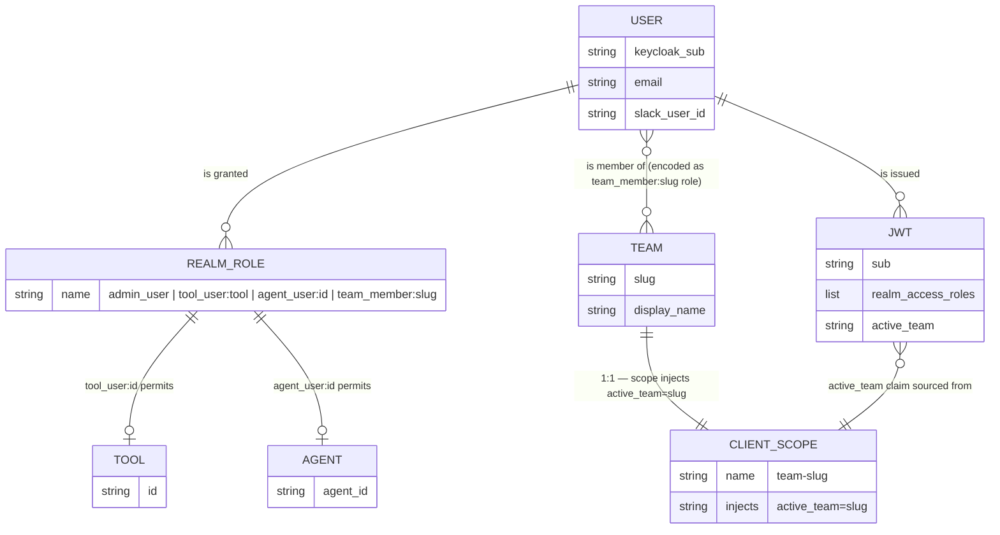
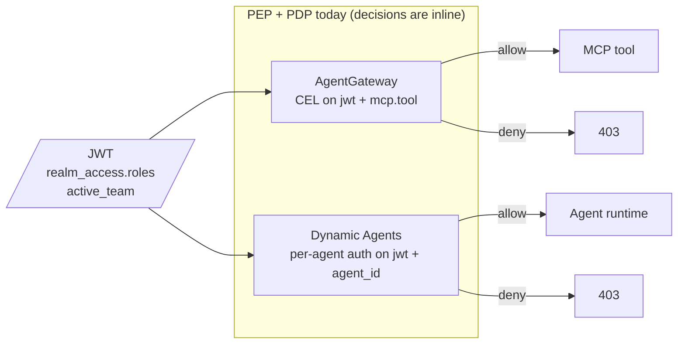
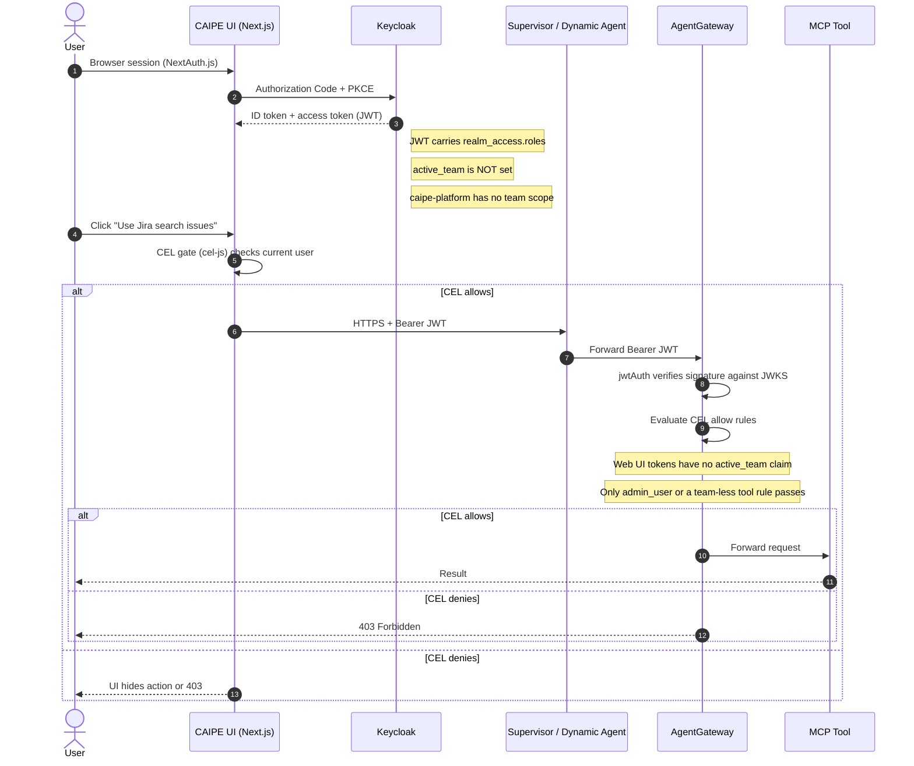
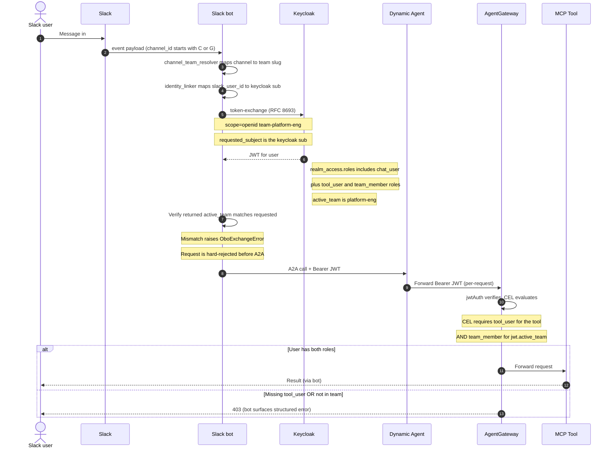
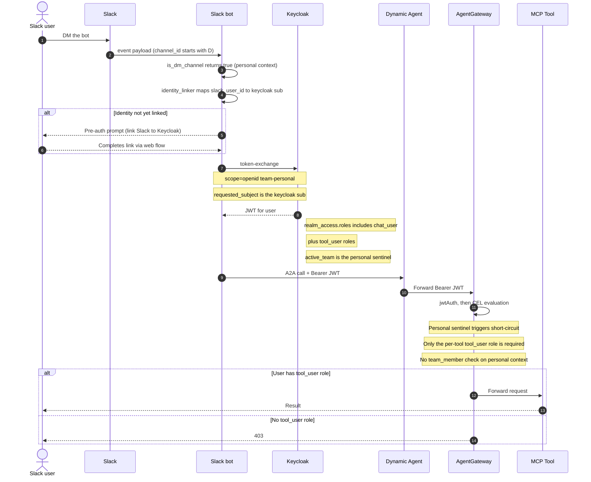

# Roles vs Scopes — How CAIPE RBAC Decides What You Can Do

**Audience:** Anyone who has heard the words "role" and "scope" thrown around and isn't 100% sure why we have both, or what actually happens when you click "Create team" in the admin UI.

This doc has two layers: a plain-English explanation first, then the precise technical detail. Read the analogy, then the technical section — they describe the same thing.

---

## The Plain-English Version

Imagine CAIPE is a corporate office building. To get something done you need two things at every door:

1. **A badge that lists what you're qualified to do.** You're trained to operate the espresso machine, you have first-aid certification, you're authorized to enter Lab B. These are your **roles**.
2. **A name tag that says which team you're representing right now.** You might belong to *both* the Platform team and the Security team. Today you're attending the Security team's standup, so your name tag says "Security." Tomorrow it might say "Platform." This is your **active team**, set by a **scope**.

The security guard at every door checks **both**:

> "Does your badge say you can enter Lab B?  ✅
>  And does your name tag say you're representing a team that's allowed in Lab B today?  ✅
>  OK, go in."

If you have the qualification but you're representing the wrong team — denied. If your name tag is right but you don't have the qualification — denied. You need both.

That's the whole model. The rest of this doc is just the technical mapping of those two ideas onto Keycloak.

### Why both? Why not just one?

Because qualifications and team context are different things that change at different rates.

- **Qualifications (roles)** are about *you as a person*: "Sri can use the Jira search tool." That's stable; it travels with you.
- **Team context (active team scope)** is about *which hat you're wearing right now*: "Sri is acting as a member of the Platform team in this request." That can change request-to-request, especially in Slack where the same user might post in `#platform-eng` (Platform team) and `#security-ops` (Security team) within minutes.

If we tried to bake team context into the role list ("Sri-can-use-Jira-as-Platform", "Sri-can-use-Jira-as-Security"), the role explosion would be quadratic in users × teams, and switching teams would mean rewriting your role assignments. With the scope-as-context-tag design, your roles stay constant; only the per-request `active_team` claim changes.

---

## What is a "slug"?

A **slug** is a URL-safe, lowercase, ASCII-only short identifier derived from a human-readable name. Think of it as the team's machine-readable handle.

| Human name | Slug |
|---|---|
| `Platform Engineering` | `platform-engineering` |
| `SRE — On Call` | `sre-on-call` |
| `🚀 Rocket Squad` | rejected — produces empty slug |

The rules (enforced by `isValidTeamSlug` and `deriveSlug` in `ui/src/app/api/admin/teams/route.ts`):

- Lowercase letters, digits, and hyphens only
- No leading or trailing hyphens
- Maximum 63 characters
- Must produce a non-empty result after stripping non-ASCII

We use slugs (not display names) inside Keycloak and JWT claims for three reasons:

1. **Stable identifier.** A team can be renamed in MongoDB without breaking every JWT in flight or every CEL rule in AgentGateway.
2. **Safe in URLs, headers, and identifiers.** Keycloak client scope names, role names, and JWT claim values shouldn't contain spaces or Unicode.
3. **One canonical form.** No ambiguity between "Platform Eng" / "platform-eng" / "platform engineering" — the slug is the only string the system actually uses for matching.

The display name is a UI concern; the slug is the identity.

---

## What is a Keycloak "client scope"?

In OpenID Connect, a **client** is anything that asks Keycloak for a token (CAIPE UI, Slack bot, AgentGateway). A **scope** is a *named bundle of claims* — when a client requests a token "with scope X," Keycloak attaches whatever claims scope X is configured to inject.

In stock OIDC, scopes usually look like `openid` (gives you `sub`), `email` (gives you `email`), `profile` (gives you `given_name`, `family_name`, etc.). The pattern is: **the client asks for the scope, the scope adds claims to the token**.

We use that exact mechanism for team context. We define one client scope per team:

- `team-personal` — when present, injects `active_team=__personal__` into the JWT.
- `team-platform-eng` — injects `active_team=platform-eng`.
- `team-security-ops` — injects `active_team=security-ops`.
- …one per team.

Each scope is just a Keycloak object with a single **protocol mapper** of type `oidc-hardcoded-claim-mapper` configured to write `active_team=<slug>` into the access token. The scope itself has no permission semantics — it's purely a claim-injection vehicle.

### Default vs optional client scopes

A client (e.g. `agentgateway`, `caipe-slack-bot`) can have client scopes attached two ways:

- **Default scope** — always added to every token issued for that client.
- **Optional scope** — only added when the client explicitly requests it via the `scope` parameter.

We bind `team-<slug>` scopes as **default scopes on the `agentgateway` audience client** because Keycloak's RFC 8693 token-exchange (used in OBO — On-Behalf-Of) silently drops the `scope` request parameter. The audience client's default scopes are the only reliable way to inject the claim during token-exchange.

The known caveat (documented in `architecture.md` around line 625): with multiple `team-<slug>` scopes all bound as defaults, every hardcoded mapper fires on every token, and the *last one wins* (Keycloak does not guarantee mapper ordering). We compensate by having the Slack bot's OBO module **verify** the returned JWT's `active_team` claim matches what was requested — mismatch raises `OboExchangeError`. Follow-up work tracked in Spec 104 is to switch to a script-mapper that reads the requested team from a custom request parameter rather than per-team default scopes.

---

## Why do we still need `team_member:<slug>` if the JWT already has `active_team`?

Excellent question — and this is the security crux of the design.

The `active_team` claim in the JWT only says **what team this token claims to represent**. It does **not** prove the user actually belongs to that team. The claim is injected by a hardcoded mapper that doesn't check anything.

So if we trusted `active_team` alone, an attacker (or a buggy client) who could trigger a token-exchange with `scope=team-finance-prod` would get a token claiming `active_team=finance-prod` — even if they've never been added to the Finance team.

The `team_member:<slug>` realm role is the **proof of membership**. It is a regular Keycloak realm role assigned to the user when an admin adds them to the team in the admin UI (via `ensureRealmRole` + role assignment). Unlike the scope-injected claim, this role is part of the user's identity in Keycloak's database — it can't be self-asserted by manipulating the token request.

AgentGateway CEL rules then require **both**:

```cel
jwt.realm_access.roles.contains("tool_user:" + tool) &&        // role: I have permission for this tool
jwt.realm_access.roles.contains("team_member:" + jwt.active_team)  // role: I really am a member of the team I'm claiming to act as
```

The `active_team` claim says "I want to act as team X." The `team_member:X` role says "Keycloak agrees I'm a member of team X." The conjunction is what makes the system safe.

### Defense-in-depth recap

| Layer | What it asserts | Who controls it | Can it be forged? |
|---|---|---|---|
| `active_team=<slug>` claim | "This request is on behalf of team `<slug>`" | The OBO token-exchange request (via scope binding) | Indirectly — but the slack-bot verifies the returned claim matches the requested scope, raising `OboExchangeError` on mismatch |
| `team_member:<slug>` role | "Keycloak's user database records this user as a member of team `<slug>`" | The admin who added the user to the team | No — it's signed into the JWT by Keycloak using its private key |
| `tool_user:<tool>` role | "This user is permitted to invoke `<tool>`" | The admin who granted tool access | No — same JWT signature |

Compromise any one and you still don't get in. That's the point.

---

## When does `team_member:<slug>` actually land in a JWT?

There is **no scope, mapper, or runtime injection** for `team_member:<slug>`. Unlike `active_team` (which is a hardcoded-claim mapper on a `team-<slug>` client scope), `team_member:<slug>` is a **standard Keycloak realm role**. It enters the JWT the same way `chat_user` and `admin_user` do: it's assigned to the user in Keycloak's user database, and Keycloak automatically embeds all of the user's realm roles into `realm_access.roles` on every JWT it mints for that user.

So the question has two parts.

### When is the role *assigned to the user*?

When an admin adds the user to a team via `POST /api/admin/teams/<id>/members`. The handler at `ui/src/app/api/admin/teams/[id]/members/route.ts` calls `syncKeycloakTeamRole`, which:

1. Looks up the Keycloak user by email.
2. **Lazily creates** the realm role `team_member:<slug>` if it doesn't exist yet (so the very first member of a team triggers the role's creation).
3. Calls `assignRealmRolesToUser` → `POST /admin/realms/{realm}/users/{userId}/role-mappings/realm` to bind the role to the user.

The mirror happens on remove: `removeRealmRolesFromUser` → `DELETE` on the same endpoint.

This is why the team-creation handler doesn't create `team_member:<slug>` itself — there's no point creating an empty role with no members. The role is created lazily on first member-add and persists once it exists (we don't garbage-collect orphaned roles when the last member leaves).

### When does the role *appear in a JWT*?

On the very next token issuance for that user, after the role assignment commits in Keycloak.

- **Web UI (`caipe-platform`)** — on the next NextAuth login, or on the next refresh-token grant. Practically: the user sees the new role after their session refreshes (or after they log out and back in).
- **Slack bot (`caipe-slack-bot`)** — on the next OBO token-exchange. The bot does a fresh exchange on every Slack message and doesn't cache OBO tokens across requests, so the role appears on the user's *next* Slack message.
- **Other flows** — on the next `client_credentials` or password grant for that user.

There is **no cached realm-role list** in any of these clients. Keycloak reads `realm_access.roles` from its database at token-mint time and signs it into the JWT. So role-to-token latency is essentially "the time between the admin's role-assignment write committing in Keycloak and the user's next token request."

### Important nuance: the admin UI is *not* blocking

`syncKeycloakTeamRole` wraps the Keycloak call in `try { ... } catch (err) { console.warn(...) }`. The doc-comment at line 47–48 makes this explicit:

> "Best-effort — logs warnings on failure so that MongoDB membership is never blocked by Keycloak issues."

If Keycloak is briefly unavailable when an admin adds a user to a team, the user shows up in the team in the admin UI immediately, but they will be **denied at AgentGateway** until the role sync succeeds (because their JWT won't carry `team_member:<slug>`). There is currently **no automatic retry/reconciler** — recovery depends on operator awareness from the warning logs. Adding a periodic reconciler that compares MongoDB team membership to Keycloak realm-role assignments and repairs drift is a known follow-up.

### Summary table

| Step | What happens | Where |
|---|---|---|
| 1. Admin clicks "Add member" in team UI | `POST /api/admin/teams/<id>/members` | `ui/src/app/api/admin/teams/[id]/members/route.ts` |
| 2. Mongo `teams.members` updated | source of truth for the admin UI | `teams` collection |
| 3. `syncKeycloakTeamRole(email, teamId, 'assign')` called | best-effort, non-blocking | same file, lines 50–81 |
| 4. Realm role `team_member:<slug>` lazily created if missing | `createRealmRole` → `POST /admin/realms/{realm}/roles` | `ui/src/lib/rbac/keycloak-admin.ts` |
| 5. Role assigned to user | `assignRealmRolesToUser` → `POST /admin/realms/{realm}/users/{userId}/role-mappings/realm` | same |
| 6. Next token mint for that user | Keycloak embeds all of the user's realm roles into `realm_access.roles` | Keycloak internals |
| 7. AgentGateway CEL evaluates | `jwt.realm_access.roles.contains("team_member:" + jwt.active_team)` | AGW config |

---

## Are *all* of the user's `team_member:<slug>` roles in the token, or just the active one?

**All of them. Every team membership the user has is embedded in every JWT issued for that user, regardless of the active team or the requesting client.**

This is a fundamental property of how Keycloak handles realm roles: the entire user's role set lives in `realm_access.roles` on every token mint. There is no filtering by active team or by scope. Each call to `assignRealmRolesToUser` binds one role; the user accumulates them additively.

So a user who belongs to teams `platform-eng`, `security-ops`, and `infra` will have a JWT that looks like:

```json
{
  "iss": "http://localhost:7080/realms/caipe",
  "sub": "...",
  "aud": "agentgateway",
  "realm_access": {
    "roles": [
      "chat_user",
      "tool_user:jira_search_issues",
      "tool_user:github_*",
      "agent_user:test-april-2025",
      "team_member:platform-eng",
      "team_member:security-ops",
      "team_member:infra"
    ]
  },
  "active_team": "platform-eng"
}
```

All three `team_member:*` roles are present simultaneously, but only **one** `active_team` claim — the one corresponding to the team the bot requested via the `team-<slug>` scope on this specific token-exchange.

### Why this is correct (and intentional)

The two pieces of information have different lifetimes and different semantics:

| Property | What it represents | When it changes | Cardinality on a token |
|---|---|---|---|
| `team_member:<slug>` realm roles | "Keycloak's record of which teams this user belongs to" | Only when an admin adds/removes the user from a team | **N — one per team the user is in** |
| `active_team` claim | "Which team this single request is on behalf of" | On every token-exchange (every Slack message, potentially) | **1 — exactly one value** |

The CEL rule at AgentGateway is what reduces N memberships to a single allow/deny decision:

```cel
jwt.realm_access.roles.contains("tool_user:" + tool) &&
jwt.realm_access.roles.contains("team_member:" + jwt.active_team)
```

That `+ jwt.active_team` is the key bit. CEL doesn't ask "is the user a member of any team?" — it asks "is the user a member of *this specific* team that the JWT claims to be acting as right now?" The `active_team` claim selects which of the user's memberships is being exercised; the role list is the universe of what the user *could* exercise.

### Implications

1. **Token size grows with team count.** A user in 50 teams will have ~50 `team_member:*` entries in their JWT. Realm roles in Keycloak are simple strings and `realm_access.roles` is a JSON array — Keycloak does not paginate this. In practice tokens stay well under typical 8–16 KB header limits, but it's a soft upper bound to be aware of for users in extreme numbers of teams.

2. **The "last mapper wins" caveat is about `active_team`, not `team_member:*`.** With multiple `team-<slug>` scopes bound as defaults on `agentgateway`, every hardcoded mapper fires on every token and the *last one wins* (Keycloak does not guarantee mapper ordering). Even though the user has all their `team_member:*` roles, the `active_team` claim may not match what the bot requested. The slack-bot's `obo_exchange.impersonate_user` **verifies** the returned `active_team` matches the requested team and raises `OboExchangeError` on mismatch — that verification is the load-bearing security control, not the scope-binding mechanism itself.

3. **AGW gets the right answer regardless.** Even if Keycloak's mapper ordering produced a "wrong" `active_team`, AGW would still require `team_member:<that-team>`, so a user is never granted access to a team they're not in. The mismatch check exists for a subtler attack: a user in *both* `team-finance-prod` (sensitive) and `team-engineering-staging` (sandbox) requesting staging context. If Keycloak's mappers minted `active_team=finance-prod` instead, AGW would happily allow it because the user is also in finance-prod. The bot's pre-flight check (requested ≠ returned → reject) is what prevents this privilege upgrade.

4. **CEL doesn't iterate; it dereferences.** A common newcomer expectation is "CEL loops through `team_member:*` and checks if any match the active team." It doesn't — `realm_access.roles.contains("team_member:" + jwt.active_team)` is a single string lookup against the role array. O(N) in role count, but N is small enough that it's effectively O(1) for any realistic deployment.

### Mental model in one line

> The role list says **what hats you own.** The `active_team` claim says **which hat you're wearing right now.** AGW checks both: the hat must be in your closet (`team_member:X`) and you must be wearing it (`active_team == X`).

---

## Roles vs Scopes — the technical reference

### Roles — *what a caller is allowed to do*

Realm roles (carried in `jwt.realm_access.roles`) are assigned to users. They answer **"is this user permitted?"**

| Tier | Examples | Meaning |
|---|---|---|
| **Coarse identity** | `chat_user`, `admin_user` | Default user / global admin. `admin_user` bypasses every tool/agent/team gate. |
| **Resource-scoped** (Spec 104) | `tool_user:jira_search_issues`, `tool_user:jira_*`, `tool_user:*`, `agent_user:test-april-2025`, `agent_admin:test-april-2025` | Permission to invoke a specific MCP tool / chat with / admin a specific dynamic agent. Format: `<category>:<id>`. |
| **Team membership** | `team_member:<slug>` | This user belongs to that team. Required alongside `tool_user:*` to actually invoke a tool in team context. |

**Materialization:** when the admin UI grants a user permission to use a tool/agent or adds them to a team, `ensureRealmRole` (in `ui/src/lib/rbac/keycloak-admin.ts` lines 565–610) idempotently creates the role in Keycloak if missing, then assigns it to the user.

### Scopes — *which team context the token represents*

Client scopes are **not** permissions. They are per-team claim injectors that determine the value of the `active_team` claim in the issued JWT.

| Scope | `active_team` claim value | Bound to | Bound how |
|---|---|---|---|
| `team-personal` | `__personal__` | `caipe-slack-bot` | optional (provisioned by the realm-init script on every boot) |
| `team-<slug>` | `<slug>` | `agentgateway` | **default** (auto-created on team creation, plus startup auto-sync for pre-existing teams) |
| `team-<slug>` | `<slug>` | `caipe-slack-bot` | optional (for code symmetry with `team-personal`) |

**Why we need scopes at all:** the `active_team` value has to be **signed into the JWT itself** so AgentGateway and Dynamic Agents can trust it without a callback to MongoDB. Keycloak's RFC 8693 token-exchange silently drops the `scope` request parameter, so the audience client's default scopes are the only reliable injection path.

### How they combine — the actual gate at AgentGateway

A typical CEL rule for a tool call:

```cel
jwt.realm_access.roles.contains("admin_user") ||
(jwt.active_team == "__personal__" && jwt.realm_access.roles.contains("tool_user:" + tool)) ||
(jwt.realm_access.roles.contains("tool_user:" + tool) &&
 jwt.realm_access.roles.contains("team_member:" + jwt.active_team))
```

A request is allowed only if **all three line up**:

1. **Role** says you're permitted to use this specific tool (`tool_user:<name>`).
2. **Role** says you're a member of the team you claim to be acting as (`team_member:<slug>`).
3. **Scope** caused the JWT to carry `active_team=<slug>` matching that team.

If a user belongs to teams A and B, the Slack bot picks the team via OBO — `obo_exchange.impersonate_user(active_team=...)` adds `scope=openid team-<slug>` to the exchange — and then **verifies** the returned JWT's `active_team` claim matches. Mismatch raises `OboExchangeError` (load-bearing security invariant).

---

## What happens when you click "Create team"?

End-to-end flow when an admin POSTs to `/api/admin/teams` (`ui/src/app/api/admin/teams/route.ts`):

1. **Validate input.** Derive `slug` from `name` if not provided; reject if the slug is invalid or already in use.
2. **Insert team document into MongoDB** (`teams` collection) with the creator as `owner`.
3. **Call `ensureTeamClientScope(slug)`** (`ui/src/lib/rbac/keycloak-admin.ts`), which idempotently:
   - Creates a Keycloak **client scope** named `team-<slug>` (`POST /client-scopes`).
   - Adds an `oidc-hardcoded-claim-mapper` to the scope, configured to inject `active_team=<slug>` into the access token.
   - Binds the scope as a **default scope** on the `agentgateway` client.
   - Binds the scope as an **optional scope** on the `caipe-slack-bot` client.
4. **If scope provisioning fails, the Mongo insert is rolled back.** We never want a team without its scope, because that team's channels would silently fail OBO token-exchange.

What is **not** done at team creation:

- **No realm role is created.** No `team_member:<slug>` role is auto-created at team-creation time — that's lazy: it's created the first time a user is added to the team, via `ensureRealmRole("team_member:" + slug)`.
- **No client roles are created.**
- **No users are auto-assigned to anything.** The team has zero members from Keycloak's perspective until you assign them.

### TL;DR mental model

- **Role = capability.** Granted to users. Answers "can this human do X?"
- **Scope = context tag.** Bound to clients. Answers "which team is this token speaking on behalf of?"
- **Slug = the team's machine name.** Lowercase, hyphenated, ASCII. Used everywhere internal.
- **Team creation** = new client scope (so a JWT can be minted with `active_team=<slug>`).
- **Team membership** = new role assignment (`team_member:<slug>`) on the user.
- **Tool/agent permission** = new resource-scoped role (`tool_user:<id>` / `agent_user:<id>`) assigned to the user.

---

## Entity diagram — how roles, scopes, JWTs, and resources relate

The data model in one picture. Everything below the dashed lines is owned by Keycloak; the diagram intentionally omits the IdP itself, the JWKS publishing channel, and the CEL/auth-rule code (those live in the [enforcement diagram](#enforcement--how-decisions-actually-get-made-pep--pdp) below) so the entities you can point at in admin or in a JWT payload stand out.



### How to read it

- A **`USER` is granted `REALM_ROLE`s** directly. The role *name* encodes what the role permits: `admin_user` (bypass), `tool_user:<id>` (per-tool), `agent_user:<id>` (per-agent), `team_member:<slug>` (per-team).
- A **`USER` is a member of a `TEAM`** by virtue of holding the `team_member:<slug>` role — so "team membership" and "having a team_member role" are the same fact, viewed from two angles.
- A **`TEAM` has a 1:1 `CLIENT_SCOPE`** named `team-<slug>` whose only job is to inject `active_team=<slug>` into JWTs minted with that scope. The team and the scope are paired but live in different Keycloak collections (teams are in MongoDB; scopes are Keycloak objects).
- A **`JWT`** carries (a) the user's full role list at `realm_access.roles` and (b) at most one `active_team` claim sourced from whichever team scope was bound to the request.
- **`TOOL` and `AGENT`** are the resource entities. They never appear in Keycloak directly; they're referenced *by name* inside the role names (`tool_user:jira_search`, `agent_user:test-april-2025`).

### Why both `team_member:<slug>` AND `active_team`?

This is the security crux and the only "redundancy" in the model worth keeping. See [Why do we still need `team_member:<slug>` if the JWT already has `active_team`?](#why-do-we-still-need-team_memberslug-if-the-jwt-already-has-active_team) above. Briefly: the role is *Keycloak's record* of who you are, the claim is the *request's assertion* of which hat you're wearing — both are needed so a user can't grant themselves team access by manipulating the token request.

### What's deliberately not in this diagram

| Thing | Why it's not here | Where it does live |
|---|---|---|
| Keycloak (the IdP itself) | It owns every other entity above; drawing it as a node adds clutter without information. | Implicit. Mentioned in [Component 1](./architecture.md#component-1-keycloak--hr--the-front-desk). |
| JWKS / signing keys | Cryptographic plumbing — concerns key rotation, not data shape. | [Workflows — JWT validation](./workflows.md). |
| CEL rules / per-agent auth code | Those are *enforcement code*, not data. | The [enforcement diagram](#enforcement--how-decisions-actually-get-made-pep--pdp) below, and `deploy/agentgateway/config.yaml`. |
| OIDC clients (`caipe-platform`, `caipe-slack-bot`, `agentgateway`) | The client mostly affects audience and which scopes are bound by default, not the per-request decision shape. | [Component 1 — OIDC clients table](./architecture.md#component-1-keycloak--hr--the-front-desk). |
| `ROLE_ASSIGNMENT` / `TEAM_MEMBERSHIP` join tables | These are mechanical M:N joins that the ER notation already represents with the relationship line. | n/a. |

---

## Enforcement — how decisions actually get made (PEP & PDP)

The data model says **what facts exist**. Decisions are made by separate components that consume the JWT.



Two PEPs (Policy Enforcement Points), each evaluating its rules inline against the JWT — there is no separate PDP service in the architecture today. AGW evaluates ~5 CEL rules; Dynamic Agents evaluate per-agent role assignments. Both are fast (no extra network hops) and both depend on the JWT being trustworthy (signed by Keycloak, verified against JWKS).

If we ever introduce a **remote PDP** (e.g. OpenFGA, OPA, Cedar — see [`feasibility-pdp-options.md`](./feasibility-pdp-options.md)), the picture above gains one box: AGW would call the PDP via Envoy ext_authz instead of evaluating CEL inline. The data model above doesn't have to change for that to happen — only the role/team facts would also be projected as PDP-native records (e.g. OpenFGA tuples).

---

## What can each caller actually do?

Three entry points, three slightly different flows, but all converge on the same JWT-based PEP at AgentGateway.

### 1. Web UI user



**Key point about the Web UI:** today the UI client (`caipe-platform`) doesn't bind any `team-<slug>` scope, so its JWTs ship **without** an `active_team` claim. Web UI callers therefore rely on the `admin_user` bypass or on tool rules that don't require team context. Team-scoped tool invocation from the Web UI is on the Spec 104 follow-up list (active-team picker → optional scope on `caipe-platform`).

### 2. Slack user posting in a channel



**Key point about Slack channels:** the channel ID determines the team via MongoDB (`channel_team_resolver`), and the bot trusts Keycloak to enforce that the user actually belongs to that team. If the user isn't in the team, OBO still succeeds (because the user *can* request `scope=team-platform-eng`), but AGW denies because the user lacks `team_member:platform-eng`.

### 3. Slack user in a DM (1:1 with the bot)



**Key point about DMs:** the `__personal__` sentinel says "no team — this user is acting as themselves." CEL has an explicit short-circuit for `active_team == "__personal__"` that requires only the per-tool role, no `team_member` check. This is what lets a user invoke tools in a DM without first being added to a team.

---

## Side-by-side: who needs what?

| Caller | `active_team` claim | Required roles to invoke `tool_user:<X>` | Source of team context |
|---|---|---|---|
| **Web UI user (non-admin)** | ❌ absent | `admin_user`, **or** the tool's CEL rule must allow team-less tokens | (no team context today; Spec 104 follow-up) |
| **Web UI user (admin)** | ❌ absent | `admin_user` (bypasses everything) | n/a — global admin |
| **Slack channel user** | ✅ `<team-slug>` | `tool_user:<X>` **AND** `team_member:<team-slug>` | MongoDB `channel_team_resolver` (channel ID → team slug) |
| **Slack DM user** | ✅ `__personal__` | `tool_user:<X>` only | sentinel `__personal__` (no team) |
| **Slack admin in any channel/DM** | varies | `admin_user` (bypasses everything) | sentinel or team slug, but bypassed |

---

## Cross-references

- [Architecture — Component 1 (Keycloak)](./architecture.md#component-1-keycloak--hr--the-front-desk) — full role/scope tables, env vars, IdP brokering.
- [Architecture — Spec 104 `active_team` section](./architecture.md#spec-104--active_team-jwt-claim-team-scope-refactor) — what changed, components touched, failure modes.
- [Spec 104 — team-scoped RBAC](../../specs/104-team-scoped-rbac/active-team-design.md) — original design doc.
- [Workflows — OBO token-exchange](./workflows.md) — sequence diagrams for how scopes turn into JWT claims at runtime.
- [File map](./file-map.md) — find the source file that owns any piece of the auth path.
