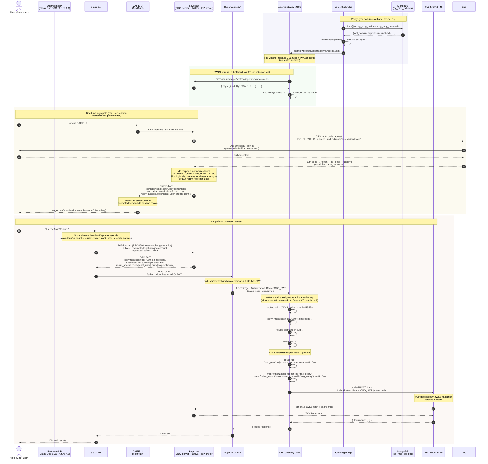
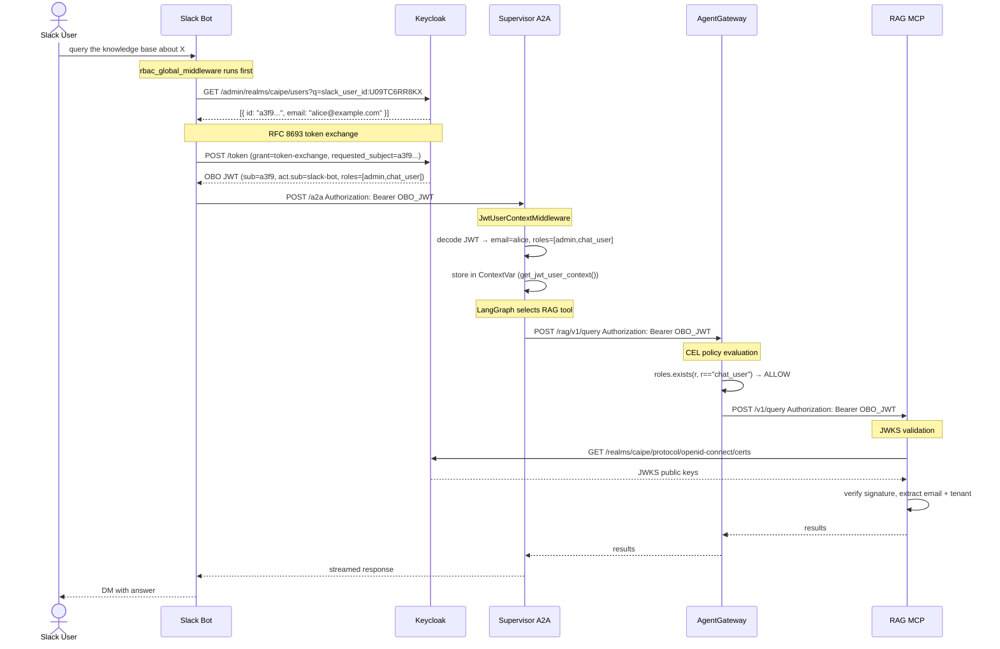

# RBAC Workflows

Sequence diagrams and flow narratives for "what happens when X". Pair this with [Architecture](./architecture.md) (which describes each component) — this doc is about how those components interact over time.

> If you only have 5 minutes, read [Per-request authorization](#per-request-authorization-end-to-end) — it's the most important diagram in CAIPE.

---

## Login + First-Time Broker Login

This is the **once-per-session** flow. After it completes, the user holds a Keycloak-signed JWT in their session and never sees Keycloak (or the upstream IdP — Okta / Duo SSO / etc.) again until the JWT expires.

The default Keycloak "first broker login" flow shows a "Review Profile" page and, if a local account with the same email already exists, a "Confirm Link Account" page. **Both are eliminated** by the custom flow patched in by `init-idp.sh`:

```
caipe-silent-broker-login  (both executions: ALTERNATIVE)
  │
  ├── idp-create-user-if-unique
  │     Condition: no local user with this email exists
  │     Action:    provision new Keycloak user, assign default roles
  │
  └── idp-auto-link
        Condition: local user with matching email already exists
        Action:    link external identity to existing account silently
```

This only works correctly because `trustEmail=true` is set on the IdP. That flag tells Keycloak to treat the email claim from the upstream IdP (Okta, Duo SSO, Azure AD, …) as authoritative for account matching.

**Security implication:** if the upstream IdP can be compromised to issue arbitrary email claims, an attacker could link to any existing account. This is acceptable here because Okta and Duo SSO (and other supported IdPs) are corporate SSO providers — trust in the email claim is the same as trust in the IdP.

The complete one-time login sequence (Browser → Keycloak → upstream IdP → Keycloak → CAIPE UI) is shown inline in [Per-request authorization](#per-request-authorization-end-to-end) below — look for the "One-time login path" rectangle. It only happens once per workday.

---

## Per-Request Authorization (End to End)

This is **the** RBAC sequence diagram. It traces a single Slack message ("list my ArgoCD apps") all the way through OBO token exchange, supervisor middleware, AgentGateway CEL evaluation, and into the MCP server. Three independent timelines run alongside (policy sync, JWKS refresh, one-time login) and the diagram shows how they converge.



**Read this diagram as four independent timelines that happen to converge:**

1. **Policy timeline** — admins edit CEL rules in the UI (`/admin/rbac/ag-policies`), which writes to MongoDB. `ag-config-bridge` polls MongoDB and re-renders `config.yaml` on change. AG hot-reloads via its file watcher. **Mean time from admin save to enforcement: ≤10s.**
2. **Key timeline** — Keycloak publishes its signing keys on a public endpoint. AG fetches them lazily (startup, TTL expiry, or unknown `kid`). **Keycloak is not a runtime dependency of AG** — requests succeed even if Keycloak is briefly unreachable, as long as the cached JWKS has a valid key for the JWT's `kid`.
3. **Login timeline** — Duo SSO authenticates the human exactly **once per session** (typically once per workday; SAML assertion / OIDC id_token then carries forward via Duo's own session). Keycloak exchanges that Duo assertion for a CAIPE-signed JWT that travels through every subsequent request. **Duo is not on the request hot path** — it is only touched on login. This is why AG's CEL rules can assume a JWT exists without ever needing to understand what Duo is.
4. **Request timeline** — the OBO JWT carries the user's identity and roles end-to-end. The *same token* is verified by AG (edge) and optionally re-verified by the MCP server (depth). This is deliberate: a misconfigured CEL rule doesn't leave the MCP open; a compromised AG doesn't let tokens past MCP without signature check.

> **Demo tip:** when presenting this diagram live, start by highlighting the **Login timeline** (steps ~5–13) and note "this happens once per day". Then trace through the **Request timeline** (steps ~14–28) and ask the audience where Duo appears — the answer is *nowhere*, because every downstream check uses the Keycloak-signed JWT. This is the clearest way to explain why CAIPE can swap IdPs without touching agent code.

---

## OBO Token Exchange — Slack Identity Propagation

> **Badge analogy:** The Slack bot is a courier service. When Alice asks the courier to pick something up from the server room on her behalf, the courier can't use their own badge — the server room requires Alice's clearance. Instead, the courier goes to HR (Keycloak), presents their credentials and Alice's employee ID, and HR issues a *delegated badge*: it opens the same doors as Alice's badge, but it has a second chip that says "issued on behalf of Alice, presented by courier bot." The delegation chain is physically stamped on the badge — it's auditable and unforgeable.

**The hardest part to get right technically.** Without OBO, every Slack request carries the bot's service account identity — `realm_access.roles` would be the bot's roles, not the user's, and all per-user authorization would be meaningless.

### RFC 8693 Token Exchange

OBO (On-Behalf-Of) is implemented via [RFC 8693](https://www.rfc-editor.org/rfc/rfc8693) token exchange. The bot uses its `client_credentials` grant to request a token **impersonating** a specific Keycloak user:

```http
POST /realms/caipe/protocol/openid-connect/token
Content-Type: application/x-www-form-urlencoded

grant_type=urn:ietf:params:oauth:grant-type:token-exchange
&client_id=slack-bot
&client_secret=<bot-secret>
&subject_token=<bot-access-token>
&subject_token_type=urn:ietf:params:oauth:token-type:access_token
&requested_subject=<keycloak-user-id>
&requested_token_type=urn:ietf:params:oauth:token-type:access_token
```

Keycloak responds with an OBO JWT where:

- `sub` = the impersonated user's Keycloak ID
- `email` = the user's email
- `realm_access.roles` = the **user's** roles (not the bot's)
- `act.sub` = the bot's client ID — the delegation chain is cryptographically recorded



### Security Properties of OBO

| Property | Mechanism |
|----------|-----------|
| Bot cannot forge a user identity | Keycloak only issues the OBO token if the bot's `client_id` has the `token-exchange` permission granted in the realm |
| Delegation is auditable | `act.sub` in the JWT records the bot as delegating party — verifiable in any JWKS-aware system |
| User roles are enforced, not bot roles | `realm_access.roles` in the OBO token are the user's, not the bot's service account roles |
| Token expiry still applies | OBO tokens have the same `exp` as a normal Keycloak token; expired tokens are rejected at every JWKS validation point |
| Unlinked users are blocked at the edge | `rbac_global_middleware` in the Slack bot rejects unlinked users before they reach the supervisor — the linking prompt is sent at most once per `SLACK_LINKING_PROMPT_COOLDOWN` seconds (default: 3600) |

---

## Slack Identity Linking (Auto-Bootstrap + JIT + Forced Link)

There are three onboarding paths, in priority order: **(1) auto-link to existing Keycloak user**, **(2) JIT-create a new shell user** (spec 103), **(3) HMAC-signed link URL** as fallback.

### 1. Auto-bootstrap (default, `SLACK_FORCE_LINK=false`)

On the user's first Slack message the bot:

1. Calls Slack `users.info` → fetches `profile.email`
2. Queries Keycloak Admin API for a user with that exact email
3. **If found:** writes `slack_user_id` attribute → linked silently, zero user action required
4. **If not found:** the bot continues to step 2 (JIT) below.

### 2. Just-In-Time user creation (default ON, `SLACK_JIT_CREATE_USER=true`)

When no existing Keycloak user matches the Slack email, and JIT is enabled, the bot:

1. **Optionally checks** the email domain against `SLACK_JIT_ALLOWED_EMAIL_DOMAINS` (comma-separated allowlist; empty = any domain).
2. **POSTs to `/admin/realms/{realm}/users`** using the same `KEYCLOAK_SLACK_BOT_ADMIN_*` credentials (`caipe-platform` service account, holds `realm-management:{view-users, query-users, manage-users}`).
3. The created user is **federated-only**: no password, no required actions, `emailVerified=true`, with attributes `slack_user_id`, `created_by=slack-bot:jit`, `created_at=<RFC3339>`.
4. **Race-safe**: an HTTP 409 from a concurrent create is resolved by re-querying the email and returning the surviving UUID.
5. **On failure** (4xx/5xx/network), the bot logs `event=jit_failed error_kind=<auth_failure|forbidden|server_error|network_error|unexpected>` and falls through to step 3.

JIT is **default ON in dev** so first-time DMs work without an admin handshake. **Set `SLACK_JIT_CREATE_USER=false` in production** if you want web-UI onboarding to be a hard prerequisite — in which case all unknown emails go to the link URL below.

> **Single-credential design (spec 103, plan R-8).** JIT deliberately reuses the existing `caipe-platform` admin client rather than introducing a separate `caipe-slack-bot-provisioner`. This trades strict privilege separation (one secret can both read and create users) for operational simplicity (one Secret to manage, one rotation procedure, one audit identity). Compensating mitigations: only the `create_user_from_slack` helper writes `/users`; `init-idp.sh` and `realm-config.json` pin the service account to exactly `{view-users, query-users, manage-users}`; all JIT actions are logged with stable `event=jit_*` tokens for SIEM.

### 3. Explicit link URL (fallback or `SLACK_FORCE_LINK=true`)

Whenever auto-link returns no user **and** JIT is disabled / domain not allow-listed / JIT failed, the bot DMs an HMAC-signed URL:

```
/api/auth/slack-link?slack_user_id=U09TC6RR8KX&ts=1713196400&sig=<HMAC-SHA256>
```

The HMAC signature uses `SLACK_LINK_HMAC_SECRET`, prevents forged links, and is time-bound (TTL enforced server-side). After OIDC login, the server writes `slack_user_id` to the Keycloak user via the Admin API.

The user **always** gets an actionable path forward — the previous "contact your admin" dead-end was removed in spec 103 (FR-007).

In all three modes, once the link is established, all future Slack messages carry the user's Keycloak identity automatically — no repeated login.

### Privacy in logs

All log lines that reference a Slack profile email run it through `mask_email()` (spec 103 FR-010): `alice@corp.com` → `ali***@corp.com`. The domain stays visible for SIEM tenant attribution; the local part is redacted.

---

## Channel → Dynamic Agent Routing

> **Badge analogy:** Each Slack channel is a dedicated help-desk line. An admin assigns each line a specific expert agent (like routing IT tickets to the right tier). When a user calls in, the operator checks the channel's routing table, verifies the user has clearance for that agent, then patches them through. The routing decision and access check happen *before* the message reaches the agent.

### How It Works

Every Slack channel can be mapped to exactly one dynamic agent (1:1 mapping). When a message arrives, the Slack bot resolves the target agent:

1. **Lookup**: query `channel_agent_mappings` in MongoDB by `slack_channel_id`
2. **Existence check**: verify the mapped agent exists in `dynamic_agents` and `enabled = true`
3. **RBAC check** (basic):
   - `visibility = global` → allow any authenticated user
   - `visibility = team` → require `team_member:<team>` Keycloak realm role for one of the agent's `shared_with_teams`
   - `visibility = private` → deny (private agents are not appropriate for channel routing)
4. **Route**: pass the resolved `agent_id` to the chat/stream call; fallback to YAML config default if no mapping exists

### Admin UI

Admins configure mappings in **CAIPE UI → Admin → Channel-to-agent mappings**.

- Dropdown lists all dynamic agents visible to the admin
- Upsert semantics: creating a new mapping for an already-mapped channel replaces the old mapping
- Deactivating a mapping (soft delete) falls back to the YAML config default agent

### MongoDB Collection: `channel_agent_mappings`

```json
{
  "_id": ObjectId,
  "slack_channel_id": "C0123456789",
  "agent_id": "my-k8s-agent",
  "channel_name": "#k8s-support",
  "slack_workspace_id": "T0123456789",
  "created_by": "admin@example.com",
  "created_at": ISODate,
  "active": true
}
```

The `agent_id` field is the dynamic agent's slug (string `_id` in `dynamic_agents` collection).

---

## Compact End-to-End Request Flow (Reference)

A condensed text-only version of the per-request sequence above. Useful for runbooks and incident-response playbooks where a Mermaid diagram is overkill.

```
Slack User: "What's the status of my ArgoCD deployment?"

━━━━━━━━━━━━━━━━━━━━━━━━━━━━━━━━━━━━━━━━━━━━━━━━━━
STEP 1: Identity Resolution  (Slack Bot)
━━━━━━━━━━━━━━━━━━━━━━━━━━━━━━━━━━━━━━━━━━━━━━━━━━
  slack_user_id U09TC6RR8KX
    → Keycloak Admin API lookup by attribute
    → user: { id: "a3f9...", email: "alice@example.com" }
  RFC 8693 exchange → OBO JWT
    sub=alice, act.sub=slack-bot, roles=[chat_user]

━━━━━━━━━━━━━━━━━━━━━━━━━━━━━━━━━━━━━━━━━━━━━━━━━━
STEP 2: Supervisor Ingestion  (A2A + LangGraph)
━━━━━━━━━━━━━━━━━━━━━━━━━━━━━━━━━━━━━━━━━━━━━━━━━━
  POST /a2a  Authorization: Bearer OBO_JWT
    → OAuth2Middleware: validates RS256 signature against JWKS
    → JwtUserContextMiddleware: decodes claims, stores in ContextVar
    → agent_executor: get_jwt_user_context() → email=alice
    → LangGraph selects ArgoCD MCP tool

━━━━━━━━━━━━━━━━━━━━━━━━━━━━━━━━━━━━━━━━━━━━━━━━━━
STEP 3: Policy Enforcement  (AgentGateway)
━━━━━━━━━━━━━━━━━━━━━━━━━━━━━━━━━━━━━━━━━━━━━━━━━━
  POST /argocd/...  Authorization: Bearer OBO_JWT
    → CEL: roles.exists(r, r=="chat_user") → ALLOW
    → Proxy to ArgoCD MCP Server

━━━━━━━━━━━━━━━━━━━━━━━━━━━━━━━━━━━━━━━━━━━━━━━━━━
STEP 4: MCP Tool Execution  (ArgoCD MCP Server)
━━━━━━━━━━━━━━━━━━━━━━━━━━━━━━━━━━━━━━━━━━━━━━━━━━
  Validates OBO JWT against Keycloak JWKS independently
  Extracts email=alice, tenant=acme
  Returns deployments scoped to alice's tenant

━━━━━━━━━━━━━━━━━━━━━━━━━━━━━━━━━━━━━━━━━━━━━━━━━━
Response path: MCP → Gateway → Supervisor → Slack → User
```
