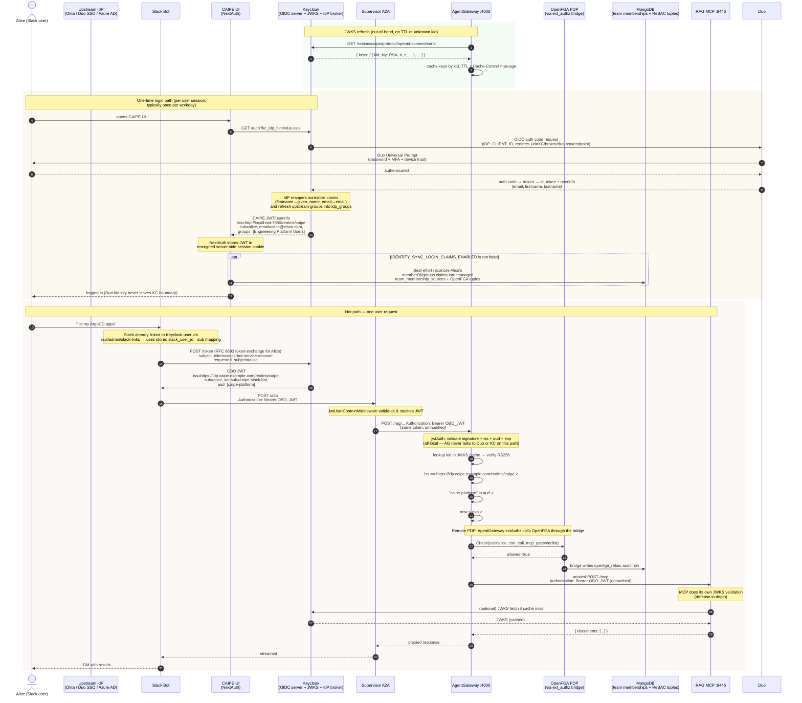
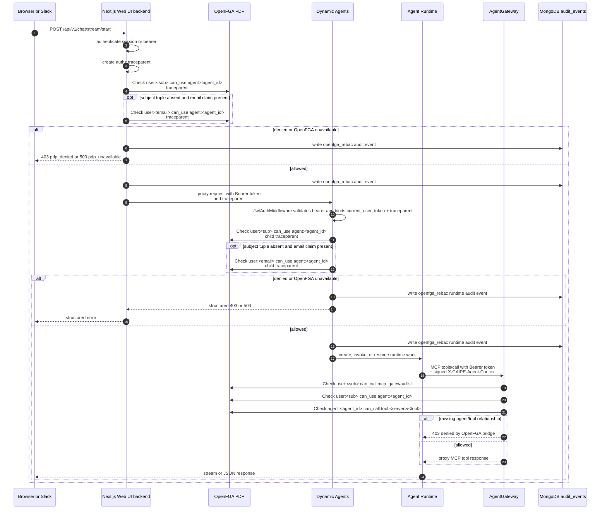
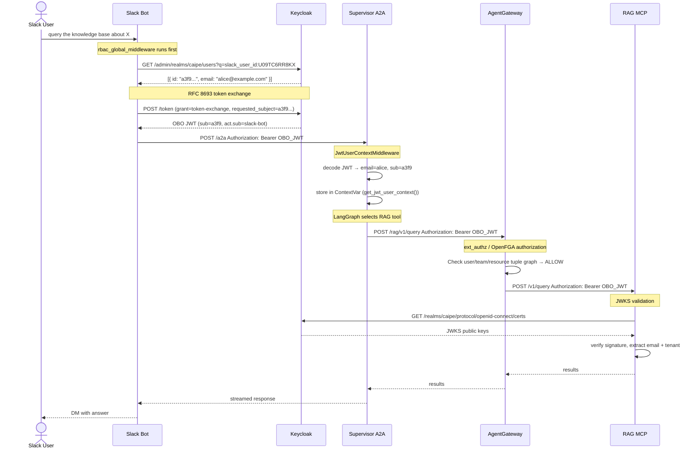

# RBAC Workflows

Sequence diagrams and flow narratives for "what happens when X". Pair this with [Architecture](./architecture.md) (which describes each component) — this doc is about how those components interact over time.

> If you only have 5 minutes, read [Per-request authorization](#per-request-authorization-end-to-end) — it's the most important diagram in CAIPE.

---

## Login + First-Time Broker Login

This is the **once-per-session** flow. After it completes, the user holds a Keycloak-signed JWT in their session and never sees Keycloak (or the upstream IdP — Okta / Duo SSO / etc.) again until the JWT expires.

The default Keycloak "first broker login" flow shows a "Review Profile" page and, if a local account with the same email already exists, a "Confirm Link Account" page. **Both are eliminated** by the custom flow patched in by `init-idp.sh`:

```
caipe-silent-broker-login  (both executions: ALTERNATIVE)
  │
  ├── idp-create-user-if-unique
  │     Condition: no local user with this email exists
  │     Action:    provision new Keycloak user, assign default roles
  │
  └── idp-auto-link
        Condition: local user with matching email already exists
        Action:    link external identity to existing account silently
```

This only works correctly because `trustEmail=true` is set on the IdP. That flag tells Keycloak to treat the email claim from the upstream IdP (Okta, Duo SSO, Azure AD, …) as authoritative for account matching.

Production installs should also keep `keycloak.idp.forceRedirect=true` (exported to `KEYCLOAK_FORCE_IDP_REDIRECT=true`). That makes the app realm's browser flow require the IdP redirector and disables the local Keycloak username/password form, so users go to the enterprise IdP even if a client does not send `kc_idp_hint`.

**Security implication:** if the upstream IdP can be compromised to issue arbitrary email claims, an attacker could link to any existing account. This is acceptable here because Okta and Duo SSO (and other supported IdPs) are corporate SSO providers — trust in the email claim is the same as trust in the IdP.

The complete one-time login sequence (Browser → Keycloak → upstream IdP → Keycloak → CAIPE UI) is shown inline in [Per-request authorization](#per-request-authorization-end-to-end) below — look for the "One-time login path" rectangle. It only happens once per workday.

---

## Per-Request Authorization (End to End)

This is **the** RBAC sequence diagram. It traces a single Slack message ("list my ArgoCD apps") all the way through OBO token exchange, supervisor middleware, AgentGateway `extAuthz` / OpenFGA evaluation, and into the MCP server. JWKS refresh and one-time login timelines run alongside the hot path and the diagram shows how they converge.



**Read this diagram as four independent timelines that happen to converge:**

1. **Policy timeline** — admins change ReBAC relationships through the OpenFGA/ReBAC UI and team resource APIs. Those writes update MongoDB provenance and OpenFGA tuples; AgentGateway does not maintain a CEL policy CRUD surface or Mongo-backed config bridge.
2. **Key timeline** — Keycloak publishes its signing keys on a public endpoint. AG fetches them lazily (startup, TTL expiry, or unknown `kid`). **Keycloak is not a runtime dependency of AG** — requests succeed even if Keycloak is briefly unreachable, as long as the cached JWKS has a valid key for the JWT's `kid`.
3. **Login timeline** — Duo SSO authenticates the human exactly **once per session** (typically once per workday; SAML assertion / OIDC id_token then carries forward via Duo's own session). Keycloak exchanges that Duo assertion for a CAIPE-signed JWT that travels through every subsequent request. If enabled, CAIPE also uses the login-time `memberOf` / `groups` claims to reconcile only the signed-in user's managed team memberships. This claim path is additive; full inventory, removals, and drift still come from direct Okta/AD API sync. **Duo is not on the request hot path** — it is only touched on login. AgentGateway only needs to understand the Keycloak-signed JWT and the OpenFGA decision.
4. **Request timeline** — the OBO JWT carries the user's identity and roles end-to-end. The *same token* is verified by AG (edge) and optionally re-verified by the MCP server (depth). This is deliberate: a compromised AG doesn't let tokens past MCP without signature check.

> **Demo tip:** when presenting this diagram live, start by highlighting the **Login timeline** and note "this happens once per day". Then trace through the **Request timeline** and ask the audience where Duo appears — the answer is *nowhere*, because every downstream check uses the Keycloak-signed JWT. This is the clearest way to explain why CAIPE can swap IdPs without touching agent code.

---

## Dynamic Agent Invocation

Dynamic Agent start, invoke, and resume requests have two OpenFGA enforcement
points. The Web UI backend blocks denied callers before any backend proxy call, and the
Dynamic Agents runtime repeats the same check before agent lookup or runtime
work. Cancellation is deliberately auth-only because it stops work.



The same sequence applies to `POST /api/v1/chat/invoke` and
`POST /api/v1/chat/stream/resume`. `POST /api/v1/chat/stream/cancel` still
requires authentication, but it skips the `can_use` check. The RBAC Audit tab
surfaces Web UI backend and Dynamic Agents OpenFGA decisions as `OpenFGA ReBAC` rows with
`pdp=openfga` and the checked tuple in `resource_ref`. MongoDB `audit_events`
is authoritative for compliance and history; Jaeger/OTel can still be enabled
for request-flow debugging, but the Admin UI does not need it to show authz
decisions.

---

## OBO Token Exchange — Slack Identity Propagation

> **Badge analogy:** The Slack bot is a courier service. When Alice asks the courier to pick something up from the server room on her behalf, the courier can't use their own badge — the server room requires Alice's clearance. Instead, the courier goes to HR (Keycloak), presents their credentials and Alice's employee ID, and HR issues a *delegated badge*: it opens the same doors as Alice's badge, but it has a second chip that says "issued on behalf of Alice, presented by courier bot." The delegation chain is physically stamped on the badge — it's auditable and unforgeable.

**The hardest part to get right technically.** Without OBO, every Slack request carries the bot's service account identity. OpenFGA would evaluate the bot instead of the human, and all per-user/team authorization would be meaningless.

### RFC 8693 Token Exchange

OBO (On-Behalf-Of) is implemented via [RFC 8693](https://www.rfc-editor.org/rfc/rfc8693) token exchange. The bot uses its `client_credentials` grant to request a token **impersonating** a specific Keycloak user:

```http
POST /realms/caipe/protocol/openid-connect/token
Content-Type: application/x-www-form-urlencoded

grant_type=urn:ietf:params:oauth:grant-type:token-exchange
&client_id=slack-bot
&client_secret=<bot-secret>
&subject_token=<bot-access-token>
&subject_token_type=urn:ietf:params:oauth:token-type:access_token
&requested_subject=<keycloak-user-id>
&requested_token_type=urn:ietf:params:oauth:token-type:access_token
```

Keycloak responds with an OBO JWT where:

- `sub` = the impersonated user's Keycloak ID
- `email` = the user's email
- `act.sub` = the bot's client ID — the delegation chain is cryptographically recorded



### Security Properties of OBO

| Property | Mechanism |
|----------|-----------|
| Bot cannot forge a user identity | Keycloak only issues the OBO token if the bot's `client_id` has the `token-exchange` permission granted in the realm |
| Delegation is auditable | `act.sub` in the JWT records the bot as delegating party — verifiable in any JWKS-aware system |
| User/team relationships are enforced, not bot identity | OpenFGA checks use the impersonated user's `sub` and team relationships from the OBO token context |
| Token expiry still applies | OBO tokens have the same `exp` as a normal Keycloak token; expired tokens are rejected at every JWKS validation point |
| Unlinked users are blocked at the edge | `rbac_global_middleware` in the Slack bot rejects unlinked users before they reach the supervisor — the linking prompt is sent at most once per `SLACK_LINKING_PROMPT_COOLDOWN` seconds (default: 3600) |

---

## Slack Identity Linking (Auto-Bootstrap + JIT + Forced Link)

There are three onboarding paths, in priority order: **(1) auto-link to existing Keycloak user**, **(2) JIT-create a new shell user** (spec 103), **(3) HMAC-signed link URL** as fallback.

### 1. Auto-bootstrap (default, `SLACK_FORCE_LINK=false`)

On the user's first Slack message the bot:

1. Calls Slack `users.info` → fetches `profile.email`
2. Queries Keycloak Admin API for a user with that exact email
3. **If found:** writes `slack_user_id` attribute → linked silently, zero user action required
4. **If not found:** the bot continues to step 2 (JIT) below.

### 2. Just-In-Time user creation (default ON, `SLACK_JIT_CREATE_USER=true`)

When no existing Keycloak user matches the Slack email, and JIT is enabled, the bot:

1. **Optionally checks** the email domain against `SLACK_JIT_ALLOWED_EMAIL_DOMAINS` (comma-separated allowlist; empty = any domain).
2. **POSTs to `/admin/realms/{realm}/users`** using the same `KEYCLOAK_SLACK_BOT_ADMIN_*` credentials (`caipe-platform` service account, holds `realm-management:{view-users, query-users, manage-users}`).
3. The created user is **federated-only**: no password, no required actions, `emailVerified=true`, with attributes `slack_user_id`, `created_by=slack-bot:jit`, `created_at=<RFC3339>`.
4. **Race-safe**: an HTTP 409 from a concurrent create is resolved by re-querying the email and returning the surviving UUID.
5. **On failure** (4xx/5xx/network), the bot logs `event=jit_failed error_kind=<auth_failure|forbidden|server_error|network_error|unexpected>` and falls through to step 3.

JIT is **default ON in dev** so first-time DMs work without an admin handshake. **Set `SLACK_JIT_CREATE_USER=false` in production** if you want web-UI onboarding to be a hard prerequisite — in which case all unknown emails go to the link URL below.

> **Single-credential design (spec 103, plan R-8).** JIT deliberately reuses the existing `caipe-platform` admin client rather than introducing a separate `caipe-slack-bot-provisioner`. This trades strict privilege separation (one secret can both read and create users) for operational simplicity (one Secret to manage, one rotation procedure, one audit identity). Compensating mitigations: only the `create_user_from_slack` helper writes `/users`; `init-idp.sh` and `realm-config.json` pin the service account to exactly `{view-users, query-users, manage-users}`; all JIT actions are logged with stable `event=jit_*` tokens for SIEM.

### 3. Explicit link URL (fallback or `SLACK_FORCE_LINK=true`)

Whenever auto-link returns no user **and** JIT is disabled / domain not allow-listed / JIT failed, the bot DMs an HMAC-signed URL:

```
/api/auth/slack-link?slack_user_id=U09TC6RR8KX&ts=1713196400&sig=<HMAC-SHA256>
```

The HMAC signature uses `SLACK_LINK_HMAC_SECRET`, prevents forged links, and is time-bound (TTL enforced server-side). After OIDC login, the server writes `slack_user_id` to the Keycloak user via the Admin API.

The user **always** gets an actionable path forward — the previous "contact your admin" dead-end was removed in spec 103 (FR-007).

In all three modes, once the link is established, all future Slack messages carry the user's Keycloak identity automatically — no repeated login.

### Privacy in logs

All log lines that reference a Slack profile email run it through `mask_email()` (spec 103 FR-010): `alice@corp.com` → `ali***@corp.com`. The domain stays visible for SIEM tenant attribution; the local part is redacted.

---

## Slack Channel → Team + Agent ReBAC

> **Badge analogy:** Each Slack channel is a dedicated help-desk line. An admin assigns the line to a team and grants one or more Dynamic Agents to that line. When a user calls in, the operator checks both the channel grant and the user's team/agent relationship before patching them through.

### How It Works

Slack channel routing now separates "which team owns this channel?" from "which Dynamic Agents may be used here?" The workspace key is a configured alias (`SLACK_WORKSPACE_ALIAS`, for example `CAIPE`) rather than Slack's opaque `team_id`; the Slack bot maps incoming `team_id` values to that alias before looking up routes or grants. When a message arrives, the Slack bot reads OpenFGA tuples for `slack_channel:<workspace_alias>--<channel_id> user agent:<id>`, then joins optional `slack_channel_agent_routes` metadata for listen mode and priority. Stale Mongo route rows without a matching OpenFGA tuple are ignored. Operators can set `config` for static-only routing or `db_only` to use only UI-managed OpenFGA-backed routes. The selected agent is then verified against OpenFGA:

1. **Team lookup**: query `channel_team_mappings` in MongoDB by `slack_channel_id`.
2. **Active team minting**: mint the user's OBO token with the channel team's `active_team` claim.
3. **Channel association lookup**: read OpenFGA channel-agent tuples and join Mongo route metadata only for tuple-backed agents.
4. **Channel ReBAC check**: call the Slack channel access checker for `slack_channel:<workspace_alias>--<channel_id> can_use agent:<id>` and the user's active team/agent relationship.
5. **Route**: dispatch to the selected `agent_id` only after both the channel association and user/team agent grant allow the request.

The Slack YAML config still registers channels and remains the fallback route source in the default `db_prefer` mode. Runtime channel-agent authorization lives in OpenFGA; Mongo route rows are non-authoritative metadata and are deleted when the admin deletes the channel-agent association.

## Keycloak Role → ReBAC Transition Check

The transition comparison API is intentionally read-only and engineer-facing:

1. Engineers call `/api/rbac/enforcement-comparison` with a subject/action/resource plus observed identity/group context.
2. The API checks the same relationship in OpenFGA; legacy realm-role classification is historical-only.
3. If the resource type is `rebac_enforced`, matching per-resource roles are reported as ignored and the effective decision comes only from ReBAC.

### Admin UI

Admins configure channel/team ownership in **Admin → Teams → selected team → Slack Channels** and channel/agent grants in **Security & Policy → OpenFGA ReBAC → Slack Channels**.

- Channel/team ownership is exclusive: a channel cannot be actively mapped to two teams.
- Channel/agent associations are many-to-many OpenFGA tuples: a channel can have multiple Dynamic Agent associations.
- Removing an association deletes the OpenFGA tuple and its saved Mongo listen/priority metadata, denying that resource in the channel even if the user has access elsewhere.
- UI-managed route dispatch is the default with static YAML fallback (`SLACK_AGENT_ROUTES_MODE=db_prefer`). Set `config` only for static YAML routing, and use `db_only` only after the channel's OpenFGA-backed UI routes are complete.

### MongoDB Collection: `channel_team_mappings`

```json
{
  "_id": ObjectId,
  "slack_channel_id": "C0123456789",
  "team_id": "6612...",
  "channel_name": "#k8s-support",
  "slack_workspace_id": "CAIPE",
  "created_by": "admin@example.com",
  "created_at": ISODate,
  "active": true
}
```

### OpenFGA Tuple: Slack Channel Agent Association

```text
slack_channel:CAIPE--C0123456789 user agent:my-k8s-agent
```

The channel-agent association lives in OpenFGA. The `agent:<id>` value is the Dynamic Agent slug (string `_id` in the `dynamic_agents` collection). The legacy `slack_channel_grants` collection may exist during migration, but it is not an allow source for Slack runtime channel-agent decisions.

### MongoDB Collection: `slack_channel_agent_routes`

```json
{
  "workspace_id": "CAIPE",
  "channel_id": "C0123456789",
  "agent_id": "my-k8s-agent",
  "enabled": true,
  "priority": 100,
  "users": { "enabled": true, "listen": "mention" },
  "source_type": "manual",
  "status": "active",
  "created_by": "admin@example.com",
  "created_at": "2026-05-12T00:00:00.000Z"
}
```

This row is metadata for a matching OpenFGA tuple. It does not authorize dispatch by itself, and it is deleted when the channel-agent association is deleted.

---

## Compact End-to-End Request Flow (Reference)

A condensed text-only version of the per-request sequence above. Useful for runbooks and incident-response playbooks where a Mermaid diagram is overkill.

```
Slack User: "What's the status of my ArgoCD deployment?"

━━━━━━━━━━━━━━━━━━━━━━━━━━━━━━━━━━━━━━━━━━━━━━━━━━
STEP 1: Identity Resolution  (Slack Bot)
━━━━━━━━━━━━━━━━━━━━━━━━━━━━━━━━━━━━━━━━━━━━━━━━━━
  slack_user_id U09TC6RR8KX
    → Keycloak Admin API lookup by attribute
    → user: { id: "a3f9...", email: "alice@example.com" }
  RFC 8693 exchange → OBO JWT
    sub=alice, act.sub=slack-bot

━━━━━━━━━━━━━━━━━━━━━━━━━━━━━━━━━━━━━━━━━━━━━━━━━━
STEP 2: Supervisor Ingestion  (A2A + LangGraph)
━━━━━━━━━━━━━━━━━━━━━━━━━━━━━━━━━━━━━━━━━━━━━━━━━━
  POST /a2a  Authorization: Bearer OBO_JWT
    → OAuth2Middleware: validates RS256 signature against JWKS
    → JwtUserContextMiddleware: decodes claims, stores in ContextVar
    → agent_executor: get_jwt_user_context() → email=alice
    → LangGraph selects ArgoCD MCP tool

━━━━━━━━━━━━━━━━━━━━━━━━━━━━━━━━━━━━━━━━━━━━━━━━━━
STEP 3: Policy Enforcement  (AgentGateway)
━━━━━━━━━━━━━━━━━━━━━━━━━━━━━━━━━━━━━━━━━━━━━━━━━━
  POST /argocd/...  Authorization: Bearer OBO_JWT
    → ext_authz: OpenFGA check for caller/team/tool relationship → ALLOW
    → Proxy to ArgoCD MCP Server

━━━━━━━━━━━━━━━━━━━━━━━━━━━━━━━━━━━━━━━━━━━━━━━━━━
STEP 4: MCP Tool Execution  (ArgoCD MCP Server)
━━━━━━━━━━━━━━━━━━━━━━━━━━━━━━━━━━━━━━━━━━━━━━━━━━
  Validates OBO JWT against Keycloak JWKS independently
  Extracts email=alice, tenant=acme
  Returns deployments scoped to alice's tenant

━━━━━━━━━━━━━━━━━━━━━━━━━━━━━━━━━━━━━━━━━━━━━━━━━━
Response path: MCP → Gateway → Supervisor → Slack → User
```
