# RBAC Workflows

Sequence diagrams and flow narratives for "what happens when X". Pair this with [Architecture](./architecture.md) (which describes each component) — this doc is about how those components interact over time.

> If you only have 5 minutes, read [Per-request authorization](#per-request-authorization-end-to-end) — it's the most important diagram in CAIPE.

---

## Login + First-Time Broker Login

This is the **once-per-session** flow. After it completes, the user holds a Keycloak-backed UI session and usually never sees Keycloak (or the upstream IdP — Okta / Duo SSO / etc.) again until the Keycloak SSO session can no longer be refreshed.

The default Keycloak "first broker login" flow shows a "Review Profile" page and, if a local account with the same email already exists, a "Confirm Link Account" page. **Both are eliminated** by the custom flow patched in by `init-idp.sh`:

```
caipe-silent-broker-login  (both executions: ALTERNATIVE)
  │
  ├── idp-create-user-if-unique
  │     Condition: no local user with this email exists
  │     Action:    provision new Keycloak user, assign default roles
  │
  └── idp-auto-link
        Condition: local user with matching email already exists
        Action:    link external identity to existing account silently
```

This only works correctly because `trustEmail=true` is set on the IdP. That flag tells Keycloak to treat the email claim from the upstream IdP (Okta, Duo SSO, Azure AD, …) as authoritative for account matching.

Production installs should also keep `keycloak.idp.forceRedirect=true` (exported to `KEYCLOAK_FORCE_IDP_REDIRECT=true`). That makes the app realm's browser flow require the IdP redirector and disables the local Keycloak username/password form, so users go to the enterprise IdP even if a client does not send `kc_idp_hint`.

The other side of the `kc_idp_hint` contract is on the UI: `ui/src/lib/auth-config.ts` only spreads `kc_idp_hint=${OIDC_IDP_HINT}` into the NextAuth authorization params when `OIDC_IDP_HINT` is **set and non-empty**. Two tests pin this contract end-to-end:

* `ui/src/lib/__tests__/auth-config.test.ts` (describe `OIDC kc_idp_hint forwarding`) asserts the hint is forwarded verbatim when configured and is **omitted** when the env var is unset or empty.
* `tests/integration/test_keycloak_idp_hint_redirect.sh` boots a throwaway Keycloak, runs `init-idp.sh`, and asserts `GET /realms/caipe/protocol/openid-connect/auth` 302/303s to `/broker/${IDP_ALIAS}/login` with no hint, with a valid hint, and degrades gracefully (no 5xx) with an unknown hint. Both are gated in CI via the `idp-hint-test` job in `.github/workflows/ci-keycloak-init.yml` (also runnable locally via `make test-keycloak-idp-hint` or `make test-keycloak-sso-all`). See [Secrets bootstrap → SSO bootstrap — `kc_idp_hint` and the IdP redirector](./secrets-bootstrap.md#sso-bootstrap--kc_idp_hint-and-the-idp-redirector) for the long-form walkthrough.

**Security implication:** if the upstream IdP can be compromised to issue arbitrary email claims, an attacker could link to any existing account. This is acceptable here because Okta and Duo SSO (and other supported IdPs) are corporate SSO providers — trust in the email claim is the same as trust in the IdP.

The complete one-time login sequence (Browser → Keycloak → upstream IdP → Keycloak → CAIPE UI) is shown inline in [Per-request authorization](#per-request-authorization-end-to-end) below — look for the "One-time login path" rectangle. With the default realm policy, active users refresh silently through Keycloak for up to the configured SSO idle and max lifetimes.

---

## Per-Request Authorization (End to End)

This is **the** RBAC sequence diagram. It traces a single Slack message ("list my ArgoCD apps") all the way through OBO token exchange, the Dynamic Agents runtime, AgentGateway `extAuthz` / OpenFGA evaluation, and into the MCP server. JWKS refresh and one-time login timelines run alongside the hot path and the diagram shows how they converge.

```mermaid
sequenceDiagram
    autonumber
    actor User as Alice (Slack user)
    participant IDP as Upstream IdP<br/>(Okta / Duo SSO / Azure AD)
    participant SB as Slack Bot
    participant UI as CAIPE UI<br/>(NextAuth)
    participant KC as Keycloak<br/>(OIDC server + JWKS + IdP broker)
    participant DA as Dynamic Agents :8100
    participant AG as AgentGateway :4000
    participant FGA as OpenFGA PDP<br/>(via ext_authz bridge)
    participant MDB as MongoDB<br/>(team memberships + ReBAC tuples)
    participant RAG as RAG MCP :9446

    rect rgb(245, 252, 245)
      note over AG, KC: JWKS refresh (out-of-band, on TTL or unknown kid)
      AG->>KC: GET /realms/caipe/protocol/openid-connect/certs
      KC-->>AG: { keys: [ { kid, kty: RSA, n, e, ... }, ... ] }
      AG->>AG: cache keys by kid, TTL = Cache-Control max-age
    end

    rect rgb(252, 250, 240)
      note over User, KC: One-time login path (per user session;<br/>refresh is silent while Keycloak SSO remains valid)
      User->>UI: opens CAIPE UI
      UI->>KC: GET /auth?kc_idp_hint=duo-sso
      KC->>Duo: OIDC auth code request<br/>(IDP_CLIENT_ID, redirect_uri=KC/broker/duo-sso/endpoint)
      Duo->>User: Duo Universal Prompt<br/>(password + MFA + device trust)
      User-->>Duo: authenticated
      Duo-->>KC: auth code → /token → id_token + userinfo<br/>(email, firstname, lastname)

      note over KC: IdP mappers normalize claims<br/>(firstname→given_name, email→email)<br/>and refresh upstream groups into idp_groups
      KC-->>UI: CAIPE JWT/userinfo<br/>iss=http://localhost:7080/realms/caipe<br/>sub=alice, email=alice@cisco.com,<br/>groups=[Engineering Platform Users]
      note over UI: NextAuth stores slim session metadata<br/>in encrypted httpOnly cookie;<br/>OAuth tokens stay in UI server cache
      UI->>FGA: Login bootstrap: if OIDC_REQUIRED_GROUP passed,<br/>ensure member organization + system_config reader tuples
      opt user matches OIDC_REQUIRED_ADMIN_GROUP or BOOTSTRAP_ADMIN_EMAILS
        UI->>FGA: ensure admin organization + system_config manager tuples
      end
      opt IDENTITY_SYNC_LOGIN_CLAIMS_ENABLED is not false
        UI->>MDB: Best-effort reconcile Alice's<br/>memberOf/groups claims into managed<br/>team_membership_sources + OpenFGA tuples
      end
      UI-->>User: logged in (Duo identity never leaves KC boundary)
    end

    rect rgb(252, 248, 245)
      note over User, RAG: Hot path — one user request
      User->>SB: "list my ArgoCD apps"
      note over SB: Slack already linked to Keycloak user via<br/>/api/admin/slack-links → uses stored slack_user_id→sub mapping
      SB->>KC: POST /token (RFC 8693 token-exchange for Alice)<br/>subject_token=slack-bot-service-account<br/>requested_subject=alice
      KC-->>SB: OBO JWT<br/>iss=https://idp.caipe.example.com/realms/caipe,<br/>sub=alice, act.sub=caipe-slack-bot,<br/>aud=[caipe-platform]

      SB->>DA: POST /api/v1/chat/... <br/>Authorization: Bearer OBO_JWT

      note over DA: get_current_user() validates JWT per request
      DA->>AG: POST /rag/... Authorization: Bearer OBO_JWT<br/>(same token, unmodified)

      note over AG: jwtAuth: validate signature + iss + aud + exp<br/>(all local — AG never talks to Duo or KC on this path)
      AG->>AG: lookup kid in JWKS cache → verify RS256
      AG->>AG: iss == https://idp.caipe.example.com/realms/caipe ✓
      AG->>AG: "caipe-platform" in aud ✓
      AG->>AG: now < exp ✓

      note over AG,FGA: Remote PDP: AgentGateway extAuthz calls OpenFGA through the bridge
      AG->>FGA: Check(user:alice, can_call, mcp_gateway:list)
      FGA-->>AG: allowed=true
      FGA->>MDB: bridge writes openfga_rebac audit row

      AG->>RAG: proxied POST /mcp<br/>Authorization: Bearer OBO_JWT (untouched)
      note over RAG: MCP does its own JWKS validation<br/>(defense in depth)
      RAG->>KC: (optional) JWKS fetch if cache miss
      KC-->>RAG: JWKS (cached)
      RAG-->>AG: { documents: [...] }
      AG-->>DA: proxied response
      DA-->>SB: streamed (SSE)
      SB-->>User: DM with results
    end
```

**Read this diagram as four independent timelines that happen to converge:**

1. **Policy timeline** — admins change ReBAC relationships through the OpenFGA/ReBAC UI and team resource APIs. Those writes update MongoDB provenance and OpenFGA tuples; AgentGateway does not maintain a CEL policy CRUD surface or Mongo-backed config bridge.
2. **Key timeline** — Keycloak publishes its signing keys on a public endpoint. AG fetches them lazily (startup, TTL expiry, or unknown `kid`). **Keycloak is not a runtime dependency of AG** — requests succeed even if Keycloak is briefly unreachable, as long as the cached JWKS has a valid key for the JWT's `kid`.
3. **Login timeline** — Duo SSO authenticates the human at the start of the Keycloak SSO session. Keycloak exchanges that Duo assertion for CAIPE tokens; the UI keeps refreshing 1-hour access tokens through Keycloak while the 8-hour idle / 24-hour max SSO session remains valid. CAIPE UI keeps large OAuth tokens in a server-side token cache and only stores slim session metadata in the httpOnly cookie. If that cache is lost after a UI restart, RAG and token-enforced data-plane calls redirect through login, while Dynamic Agents browser proxy routes can still forward the signed-in `X-User-Context` fallback for configuration and save flows; AgentGateway-backed MCP probes/tools may still require a fresh Keycloak bearer. On every successful CAIPE login, the BFF reconciles OpenFGA tuples for users who passed `OIDC_REQUIRED_GROUP`; those tuples come from the admin-managed default OpenFGA grant profile bundle when present, otherwise the built-in Org Member / Org Admin defaults. Users in `OIDC_REQUIRED_ADMIN_GROUP` or `BOOTSTRAP_ADMIN_EMAILS` receive the selected admin profile grants. Team-assigned custom profiles override the global member/admin profile for matching team users and are materialized as direct user tuples; multiple team overrides union with each other. Admin changes in Security & Policy → OpenFGA → Default FGA Grants can save future-login templates and reconcile all known users immediately. If enabled, CAIPE also uses the login-time `memberOf` / `groups` claims to reconcile only the signed-in user's managed team memberships. This claim path is additive; full inventory, removals, and drift still come from direct Okta/AD API sync. **Duo is not on the request hot path** — it is only touched on login or when Keycloak/upstream IdP policy requires interactive reauthentication. AgentGateway only needs to understand the Keycloak-signed JWT and the OpenFGA decision.
4. **Request timeline** — the OBO JWT carries the user's identity and roles end-to-end. The *same token* is verified by AG (edge) and optionally re-verified by the MCP server (depth). This is deliberate: a compromised AG doesn't let tokens past MCP without signature check.

> **Demo tip:** when presenting this diagram live, start by highlighting the **Login timeline** and note "this happens once, then Keycloak refreshes the CAIPE access token while the SSO session is active". Then trace through the **Request timeline** and ask the audience where Duo appears — the answer is *nowhere*, because every downstream check uses the Keycloak-signed JWT. This is the clearest way to explain why CAIPE can swap IdPs without touching agent code.

---

## Dynamic Agent Invocation

Dynamic Agent start, invoke, resume, and cancel requests have two authorization
layers. The Web UI backend blocks denied callers before any backend proxy call by
checking agent use plus conversation write access. Conversation write uses the
hybrid model: implicit MongoDB ownership (`owner_subject` or legacy `owner_id`)
is accepted for private conversations, while shared or delegated writes fall
through to explicit OpenFGA `conversation:<id>` relationships. The Dynamic
Agents runtime repeats the agent-use check before agent lookup or runtime work.

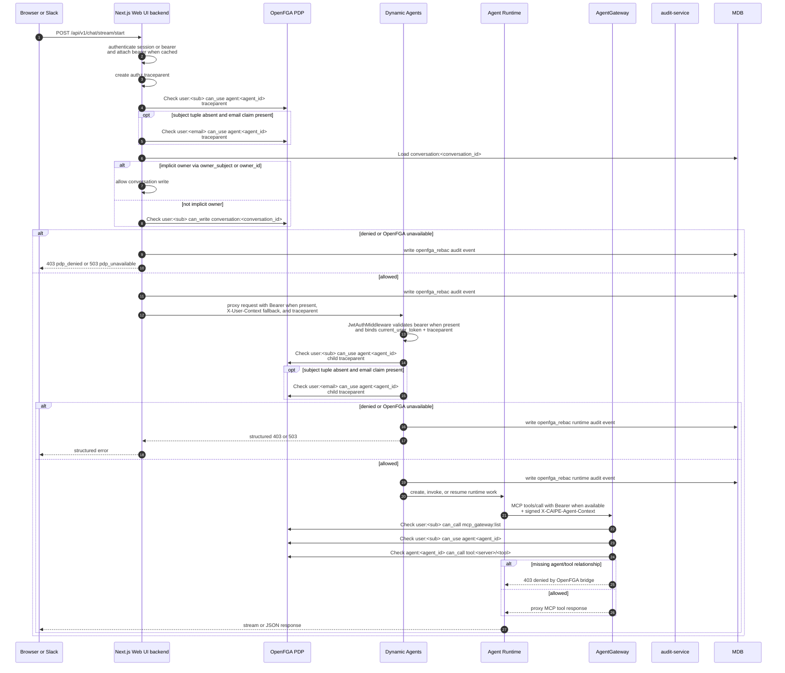

The same sequence applies to `POST /api/v1/chat/invoke`,
`POST /api/v1/chat/stream/resume`, and `POST /api/v1/chat/stream/cancel` (cancel
does not start runtime work, but it still requires agent use and conversation write authorization). The RBAC Audit tab
surfaces Web UI backend and Dynamic Agents OpenFGA decisions as `OpenFGA ReBAC` rows with
`pdp=openfga` and the checked tuple in `resource_ref`. audit-service
is authoritative for compliance and history; Jaeger/OTel can still be enabled
for request-flow debugging, but the Admin UI does not need it to show authz
decisions.

Slack follow-up bookkeeping uses `PATCH /api/chat/conversations/[id]/metadata`
after a response is posted. That endpoint uses the same implicit-owner-or-explicit
conversation write check, so a Slack OBO token for the conversation owner can
update thread metadata such as `last_processed_ts` without a separate
`conversation:<id>#writer` tuple.

## Service Account Create & External Call

Service accounts (spec `2026-06-05-service-accounts`) are self-service, team-owned
bot identities. See [Architecture › Service Accounts](./architecture.md#service-accounts-self-service-bot-identities)
for the identity/authorization model.

### Create flow (US1)

A team member creates an SA scoped only to access they themselves hold. The BFF
orchestrates Keycloak (credential), OpenFGA (access), and Mongo (metadata), and
returns the credential **exactly once**.

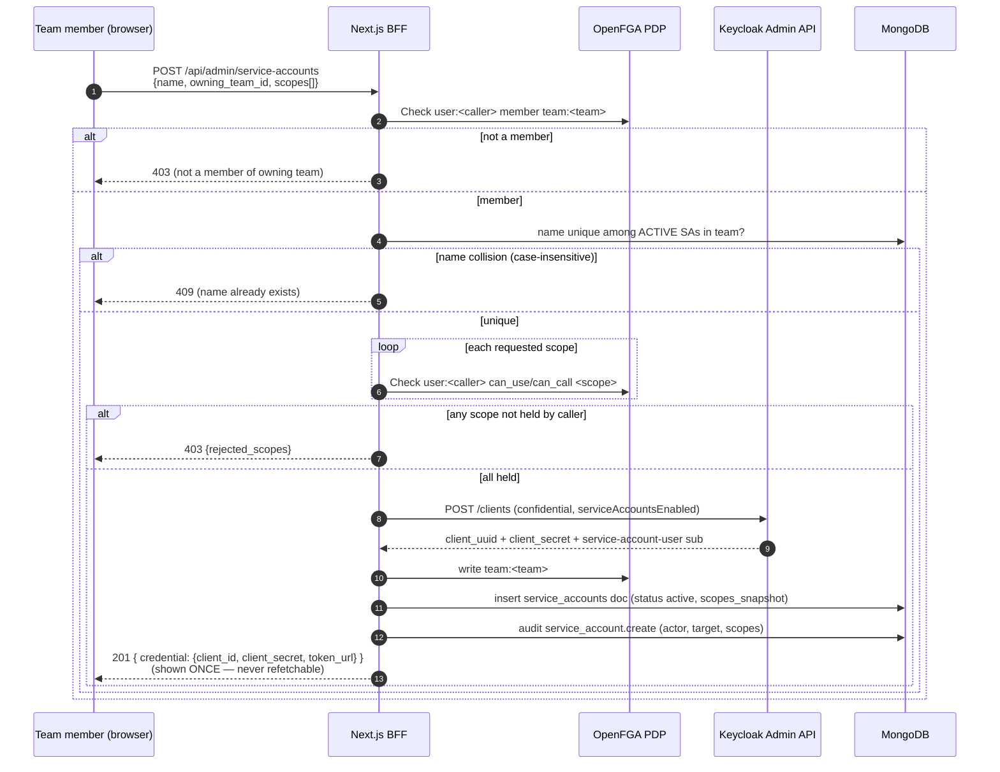

A brand-new SA with no scopes can access nothing (default-deny). Rotate
(`POST …/[id]/rotate`) regenerates the secret (shown once, scopes unchanged);
revoke (`DELETE …/[id]`) deletes the Keycloak client + all tuples and marks the
doc revoked (terminal; name freed for reuse).

### External-call flow (US2) — dual agent + caller tool authorization

An external system authenticates as the SA (client-credentials grant) and calls
a granted agent. Both the agent invocation AND each downstream tool call are
authorized against the **SA's own** grants — holding an agent does not confer its
tools (FR-012).

```mermaid
sequenceDiagram
    autonumber
    participant Ext as External caller (CI / webhook)
    participant KC as Keycloak
    participant BFF as Next.js BFF
    participant DA as Dynamic Agents
    participant AG as AgentGateway (ext_authz bridge)
    participant FGA as OpenFGA PDP

    Ext->>KC: client-credentials grant (client_id + secret)
    KC-->>Ext: SA JWT (preferred_username=service-account-<client>)
    Ext->>BFF: POST /api/v1/chat/* (Authorization: Bearer <SA JWT>)
    BFF->>BFF: validate JWT (JWKS); namespace service_account:<sub>
    BFF->>DA: proxy, forwarding the SA JWT unchanged
    DA->>DA: detect SA (preferred_username rule) → service_account:<sub>
    DA->>FGA: Check service_account:<sub> can_use agent:<id>
    alt SA not granted the agent
        DA-->>Ext: 403 (audited)
    else granted
        DA->>AG: MCP tools/call (Bearer SA JWT + signed agent context)
        AG->>FGA: Check service_account:<sub> can_call mcp_gateway:list
        AG->>FGA: Check service_account:<sub> can_use agent:<id>
        AG->>FGA: Check agent:<id> can_call tool:<server>/<tool>  (agent-keyed)
        AG->>FGA: Check service_account:<sub> can_call tool:<server>/<tool>  (caller-keyed, FR-012)
        alt agent-keyed AND caller-keyed both pass
            AG-->>DA: allow (OK_CALLER_TOOL audited)
        else either missing
            AG-->>DA: 403 (DENY_AGENT_TOOL or DENY_CALLER_TOOL, audited)
        end
    end
```

**Implementation notes (what makes the diagram hold in code):**

- **Agent-use gate = the dynamic-agent path.** External SAs call `/api/v1/chat/*`
  (and browser dynamic-agent conversations call `POST /api/chat/conversations` with an `agent_id`); both
  gate on `requireAgentUsePermission` (`ui/src/lib/rbac/openfga-agent-authz.ts`). **No
  organization-membership grant is written for SAs** (that would over-grant
  coarse member surfaces — credentials/files/directory — violating FR-004). The SA's reachability is
  exactly its explicit agent/tool grants.
- **Canonical subject namespacing is applied at FOUR layers**, all using the same T002 rule
  (`preferred_username` starts `service-account-` → `service_account:<sub>`, else `user:<sub>`):
  (1) BFF resource-authz, (2) **BFF agent-use check `requireAgentUsePermission`** (the layer the SA
  invoke path hits — added for #35), (3) Dynamic Agents backend (`openfga_authz.py`, WS-G), and
  (4) the AgentGateway bridge (WS-F). For SA subjects the BFF agent-use check also **skips** the
  email-principal and team-union fallbacks — those are human concepts; an SA's access is its own direct
  grants only (FR-020 static access).
- **The bridge only receives the data to run the per-tool checks because ext_authz forwards the request
  BODY (#36).** AgentGateway's `extAuthz` policy sets `includeRequestBody` (in
  `deploy/agentgateway/config.yaml`, `config.caipe-rbac.yaml`, `config_bridge.py`, and the Helm static
  config), so the bridge's `mcp_tool_call_from_request` can parse the JSON-RPC `tools/call` name. Headers
  (`x-caipe-agent-context*`) already arrive over gRPC. Without the body, `tool_call` is `None` and the
  ENTIRE per-tool block is skipped. **Blast radius (reviewer-a):** forwarding the body activates not just
  the new caller-keyed check but also the previously-dormant **agent→tool** check for ALL MCP traffic
  (human + SA) — so any pre-existing `agent:<id> can_call tool:<server>/<tool>` grants are now actually
  enforced where before they were silently bypassed. Rollout is gated by `CAIPE_CALLER_TOOL_CHECK_ENABLED`
  (FR-012c) for the *caller-keyed* half; the agent→tool half is unconditional once the body flows.

### Caller-Keyed Tool Authorization (Service Accounts, FR-012a)

The AgentGateway ext_authz bridge historically authorized a `tools/call` against
the **agent's** identity only (`agent:<id> can_call tool:<server>/<tool>`). That
left a confused-deputy gap: a caller's effective tool reach was the *union* of
tools granted to every agent they could invoke. The service-accounts work
(spec `2026-06-05-service-accounts`) closes it by ANDing a **caller-keyed** check
so a tool call is permitted only when **both** the agent and the calling subject
hold the tool grant.

Subject namespacing is consistent across every enforcement layer: a token is a
**service account** iff its `preferred_username` claim starts with
`service-account-` (Keycloak client-credentials tokens). Such callers are graphed
as `service_account:<sub>`; everyone else is `user:<sub>`. The same rule is used
by the BFF (`ui/src/lib/jwt-validation.ts`), the Dynamic Agents backend
(`auth/openfga_authz.py`), and the bridge (`deploy/openfga/bridge/main.py`).

The bridge's per-`tools/call` decision (replaces the single agent-tool check above):

1. `<subject> can_use agent:<agent_id>` — caller may use the agent.
2. `agent:<agent_id> can_call tool:<server>/<tool>` (or `tool:<server>/*`) — agent may call the tool.
3. **NEW:** `<subject> can_call tool:<server>/<tool>` (or `tool:<server>/*`) — **caller** may call the tool.

All three must pass. Each decision is audited (`OK_CALLER_TOOL` on allow,
`DENY_CALLER_TOOL` on the new denial) so call-time decisions under any credential
are recorded (FR-027/SC-009).

#### Rollout safety (FR-012c / SC-011)

Turning the caller-keyed check on in a shared environment **before** callers hold
direct tool grants would break existing human users who rely on transitive
(agent-granted) tool access. The check is therefore **gated behind a config flag,
default-off**, in the bridge:

```
CAIPE_CALLER_TOOL_CHECK_ENABLED   # unset/false/0/no/off (default) → legacy agent-only behavior
                                  # true/1/yes/on               → enforce dual agent+caller tool check
```

**Enable steps (per environment):**

1. **Inventory** current effective tool reach: for every `user:`/`service_account:`
   subject, determine which `tool:<server>/<tool>` it can reach via
   `agent:<id> can_call`. (OpenFGA list/expand over each agent the subject can use.)
2. **Backfill** a direct `<subject> can_call tool:<server>/<tool>` grant for every
   reach you intend to preserve (a one-off OpenFGA write), or intentionally drop
   it per policy.
3. **Flip** `CAIPE_CALLER_TOOL_CHECK_ENABLED=true` on the bridge and verify zero
   unintended denials (SC-011) before considering the rollout complete.

> **Coordinate with the platform owner** before enabling in any shared
> environment. New service accounts are unaffected by the backfill — they are
> granted their caller tool tuples (`service_account:<sub> can_call tool:…`) at
> create/scope-add time, so they work correctly the moment the flag is on.

### Operational caveats (service accounts)

Three behaviors that surprise operators. None block correctness; all are worth
knowing before triaging a support ticket.

#### Revoke/rotate deauthorize — they do NOT invalidate an already-issued JWT

CAIPE validates SA JWTs by **signature only** (Keycloak JWKS); there is no
token-revocation list. SA access tokens have a finite lifespan
(`accessTokenLifespan`, default **3600s/1h**). Consequences:

- **Revoke** deletes the Keycloak client **and every OpenFGA tuple** for
  `service_account:<sub>` (ownership + all scopes + the `mcp_gateway:list`
  baseline). A token minted just before revoke still **authenticates** until its
  `exp`, but it is **deauthorized for everything** — every OpenFGA check returns
  deny, so it can do nothing. So FR-018/SC-006 are enforced by **deauthorization,
  not deauthentication**: the doc phrase "credential no longer authenticates" is
  technically "credential is fully deauthorized; the old token still passes
  signature validation until it expires (≤1h)."
- **Rotate** regenerates the client *secret*. The OLD **secret** stops working
  immediately (can't mint new tokens), but any **token already minted** from the
  old secret remains valid until its `exp` (≤1h) — rotate does not revoke live
  tokens. Scopes are unchanged by rotate.
- **If you need hard cut-off**, shorten the SA client's `accessTokenLifespan`
  (trade-off: more frequent token minting). For most cases the ≤1h
  deauthorization window is acceptable since the revoked SA can't do anything
  meaningful in it.

#### A previously-working tool call starts failing with `DENY_AGENT_TOOL` post-rollout

The gateway ext_authz now forwards the request body (#36), which activates the
**agent→tool** check (`agent:<id> can_call tool:<server>/<tool>`) for **all** MCP
traffic — not just service accounts. This check was dormant before (the bridge
never saw the body, so it was skipped). If an agent's OpenFGA `can_call` grants
do **not** match its declared `allowed_tools`, a tool it could previously call
now returns a tool error mid-conversation (surfaces as a tool failure, **not** a
config error).

- **Signature in the bridge audit log:** `grep DENY_AGENT_TOOL` — the
  `resource_ref` names the exact `agent:<id> can_call tool:<server>/<tool>` that
  was denied.
- **Fix:** grant the agent the missing tool (`agent:<id> can_call
  tool:<server>/<tool>`), or correct its `allowed_tools` to match its real
  grants. Other deny reason codes: `DENY_NO_CAPABILITY` (coarse
  `mcp_gateway:list` gate), `DENY_AGENT_USE` (caller lacks the agent),
  `DENY_CALLER_TOOL` (caller-keyed check, flag-gated).

#### Service-account list `scope_counts` can briefly lag OpenFGA

The SA **list** view's `scope_counts` are read from the Mongo display snapshot,
not OpenFGA (the authoritative store). After a partial mutation failure (e.g. a
503 between the OpenFGA write and the snapshot update) the count can momentarily
disagree with the live grants. This is **cosmetic** and self-heals on the next
successful scope mutation; the SA **detail** view reads scopes authoritatively
from OpenFGA, so it is always correct.

> **Team tool-wildcard migration (follow-up wiring).** The migration that
> rewrites legacy `tool:<server>_*` → `tool:<server>/*` (both OpenFGA tuples and
> Mongo `team.resources.tools[]`) ships as a module + tests in
> `ui/src/lib/rbac/migrations/team-tool-wildcard-slash.ts`. **Registry wiring**
> (a `MIGRATION_DEFINITIONS` entry + plan/apply loader branches in
> `registry.ts`, to make it runnable from the admin Migrations tab) is a
> **fast-follow** — fresh installs don't need it (the team-resources route
> already writes the slash form), only existing deployments with legacy `_*`
> grants do.

## Self-Service Resource Creation

Private and team-scoped Dynamic Agents, MCP servers, and RAG data sources use the
same OpenFGA-backed create flow. MongoDB persists the resource document, while
OpenFGA is the PDP for who can see, use, or manage it.

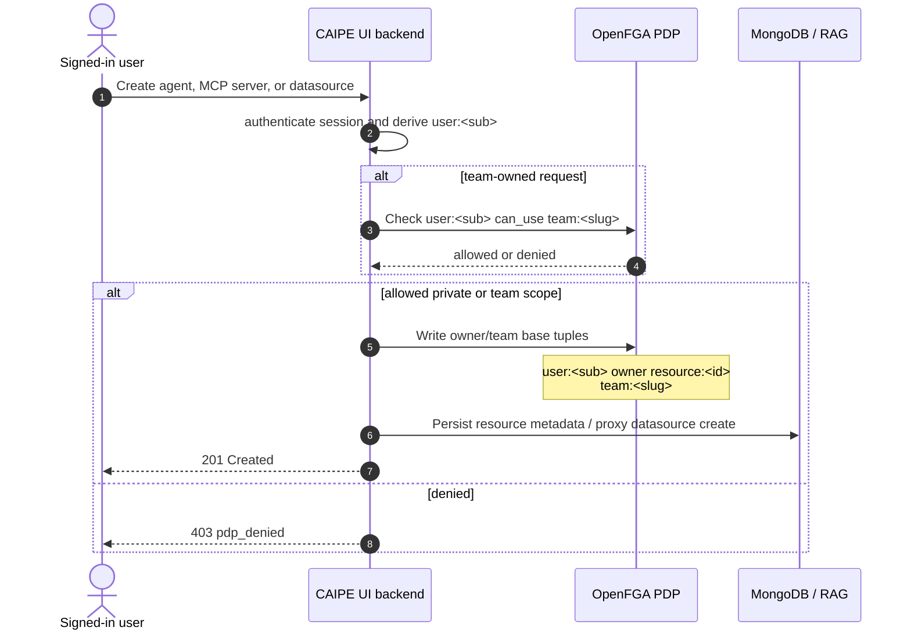

For private resources, the creator's direct `owner` tuple derives management
rights. For team resources, team members get use/read access and team admins get
the manager relationship. Team membership and team-admin status are evaluated by
OpenFGA checks; Mongo team fields are metadata and compatibility context, not the
primary authorization decision.

### Data Source Authoring Capability (explicit `can_ingest`)

Creating a *new* data source is gated by an explicit org-level capability rather
than per-KB `ingestor`. Org admins opt a team in (`team:<slug>#member ingestor
organization:<key>`), which makes its members eligible authors. The Ingest form
only offers owning teams returned by `GET /api/rbac/ingest-teams` (capability
holders the user belongs to), and the RAG server re-checks the capability and the
caller's membership in the chosen owning team before writing ownership tuples.
The same path covers both the web loader and Confluence create endpoints.

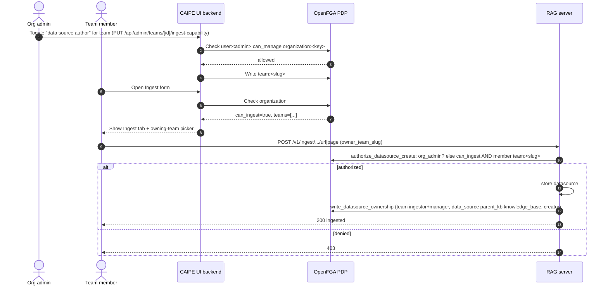

Appending pages/URLs to an *existing* data source still flows through
`check_datasource_access` (per-resource `can_ingest`); only the create branch
requires the org-level authoring capability. Every check fails closed.

### Search Capability (explicit `can_search`)

Using search — the `/v1/query` retrieval path and `/v1/mcp/invoke` for built-in
(`search`, `fetch_document`) **and** custom search tools — is gated by an
explicit org-level capability. It is the feature-level gate, evaluated **before**
the narrower per-tool `mcp_tool#can_call` and per-datasource `data_source#can_read`
checks. Org admins opt a team in (`team:<slug>#member searcher organization:<key>`),
making its members eligible searchers. Both the BFF (early 403) and the RAG
server enforce the capability; the per-datasource ACL still narrows results
afterward. This closes the prior leak where an org-wide tool share (or an
ungated built-in tool) let any org member search regardless of capability.

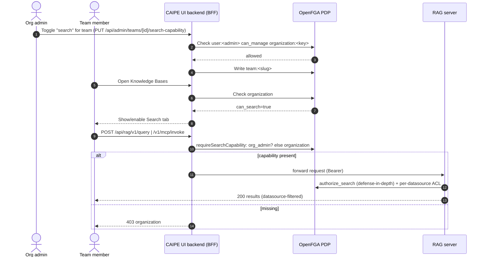

Holding `mcp_tool#can_call` on a shared tool does NOT, by itself, satisfy
`can_search`; both the built-in tools and org-wide-shared custom tools are gated
here. Org admins bypass (kill-switchable). Every check fails closed.

The Search tab is enabled by `can_search` **alone** — it is intentionally
decoupled from whether the member currently has a readable KB. An org admin can
grant a team the capability before assigning any KB; the tab then renders with an
empty, server-scoped result set rather than being greyed out. Symmetrically,
`can_ingest` enables the Data Sources tab so a newly opted-in team can author its
first source. See the "KB tab-gate composition" note in `architecture.md`.

## Credential OAuth Connector Flow

The Connections & Secrets OAuth connector flow is a CAIPE credential-exchange
flow, not a Keycloak login broker flow. Provider client IDs/secrets are seeded
from `.env` in Docker Compose or ESO in Kubernetes into encrypted MongoDB
connector records. Users then create or relink per-provider connections from the
Connections page. The browser navigates in the same tab so the OAuth callback
keeps the signed-in CAIPE session context:

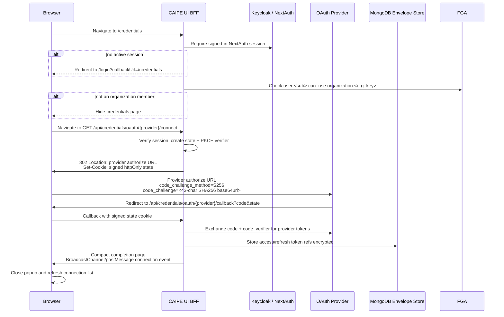

The `/credentials` page is feature-flagged by `CAIPE_CREDENTIALS_ENABLED` and
then gated by OpenFGA organization membership (`can_use
organization:<org_key>`). The Admin → Settings → Credentials tab is separately
feature-flagged and visible only for organization admins (`can_manage
organization:<org_key>`), even if a non-admin has read-only baseline admin
surface grants.

The browser never receives provider tokens or decrypted secret material. Local
development may use `http://localhost` redirect URIs, but production connector
redirect URIs must use HTTPS. The final callback page includes a return link and
still broadcasts a connection event for tabs that are listening. Built-in
GitHub and Webex connector bootstrap normalizes legacy local
`http://localhost:3001/oauth/{provider}/callback` values to the CAIPE UI callback
route at `/api/credentials/oauth/{provider}/callback`, so the provider returns
to the BFF route that stores the encrypted token set.

After a connection exists, the Connections page can run **Check GitHub Profile**,
**Check Atlassian Profile**, **Check Webex Profile**, or **Check PagerDuty
Profile**. The browser calls the BFF profile-check route for its own connection id; the BFF verifies the session,
loads only connections owned by the signed-in Keycloak `sub`, refreshes the
provider token server-side, calls the provider profile endpoint, and returns a
small redacted profile summary. Atlassian checks also fall back to
`/oauth/token/accessible-resources` when the User Identity `/me` endpoint returns
403, so operators can distinguish a valid OAuth grant from a denied profile API.
The route also returns a redacted diagnostics checklist for the Connections page
modal: connection ownership, refresh-token acceptance, provider profile status,
and Atlassian accessible-resource/scope status where applicable. Each diagnostic
includes operator guidance such as relinking the provider or asking an Atlassian
admin to review User Identity API access. The route never returns the OAuth
access or refresh token.

The Connections page also performs an automatic, browser-safe refresh pass on
load for connected providers whose access token is expired or within the refresh
threshold. The BFF `POST /api/credentials/connections/{id}/refresh` route verifies
the same session ownership, refreshes the provider token server-side, persists the
new encrypted access-token reference/expiry metadata, and returns only refresh
metadata (`ok`, provider, and expiry interval), never token material.

Runtime callers that need a provider access token use
`POST /api/credentials/exchange` instead. That route is non-browser only: it
rejects Origin/Referer/cookie requests, validates the service bearer JWT, checks
the expected credential-service audience header, and supports either an explicit
`provider_connection_id` or a provider key such as `atlassian`. Provider-key
exchange selects the connected provider record owned by the JWT `sub`, so a
Dynamic Agent invocation receives the signed-in user's Atlassian token without
hard-coding a per-user connection id. Explicit connection-id exchange still
requires either ownership by JWT `sub` or OpenFGA
`secret_ref:provider_connection:<id>#can_use` before returning a refreshed
provider access token.

For Jira MCP, Dynamic Agents keeps the user's Keycloak JWT on `Authorization` for
MCP authentication and injects the exchanged Atlassian OAuth token on
`X-CAIPE-Provider-Token`. Jira treats that header as a provider Bearer token and
does not require `ATLASSIAN_EMAIL` for that OAuth path; static API-token Basic
auth remains available when impersonation tokens are disabled. Jira MCP also
auto-resolves the Atlassian `cloudId` and rewrites the OAuth base URL to
`api.atlassian.com/ex/jira/{cloudId}` so 3LO tokens validate.

The same `X-CAIPE-Provider-Token` exchange now backs PagerDuty, GitHub, and
GitLab:

- **PagerDuty MCP** uses `Authorization: Bearer <token>` when the provider
  header is present, and falls back to the static `PAGERDUTY_API_KEY` with the
  legacy `Token token=` scheme otherwise.
- **GitHub / GitLab** authenticate per-request. Dynamic Agents resolves the
  caller's own OAuth token, or — when the caller has not connected — the static
  org PAT via `MCPCredentialSource.fallback_env`
  (`GITHUB_PERSONAL_ACCESS_TOKEN` / `GITLAB_PERSONAL_ACCESS_TOKEN`). It forwards
  whichever token resolves on `X-CAIPE-Provider-Token`, and a route-level
  AgentGateway transformation rewrites it into the upstream
  `Authorization: Bearer` header. The old static gateway `backendAuth` PAT is
  removed; connected users act as themselves while unconnected callers fall back
  to the org token. This is a route-level header rewrite (a transformation
  policy), distinct from the unsupported backend-level `extAuthz` response-header
  injection.
- **Knowledge Base (RAG)** also rides the `X-CAIPE-Provider-Token` rewrite, but
  the resolved credential is an *identity* token rather than a provider OAuth
  token, because the RAG server enforces its own Keycloak/OIDC auth on `/mcp`.
  Dynamic Agents resolves a `caller_token` source: it forwards the caller's
  **user JWT** when present (so RAG applies per-user `knowledge_base:<id>` group
  RBAC), and in non-user contexts (background reconcile/probe, `conv=-`) it mints
  and caches a **`caipe-platform` client-credentials** service token from
  Keycloak. The same route-level transformation rewrites the chosen token into the
  upstream `Authorization: Bearer` header. Without this the gateway dropped the
  incoming `Authorization` and the RAG server returned `HTTP 401`, surfacing as
  `MCP server 'knowledge-base' is unavailable`.

`GET /api/credentials/inject/atlassian` is implemented as the future BFF
contract for AgentGateway-style provider-token injection.

## Webex Space ReBAC and Bot Dispatch

Webex follows the Slack bot trust model with Webex spaces in place of channels.
The bot treats Webex as an external event source, not as an identity provider:
every protected message must map to a Keycloak user, a CAIPE team, an
OpenFGA-backed space route, and a user/resource allow decision before dispatch.

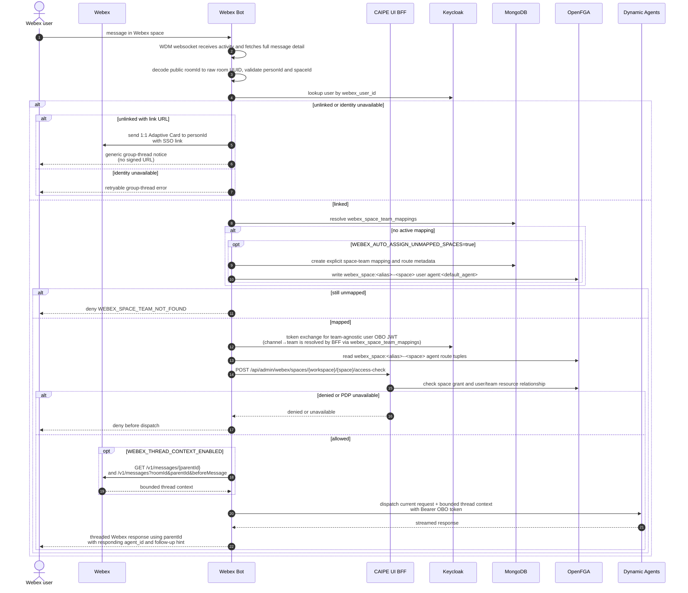

Failure categories are explicit and fail closed: `WEBEX_USER_NOT_LINKED`,
`WEBEX_WORKSPACE_UNCONFIGURED`, `WEBEX_SPACE_TEAM_NOT_FOUND`,
`WEBEX_OBO_FAILED`, `WEBEX_ROUTE_DENIED`, `missing_space_grant`, and
`pdp_unavailable`. Audit records use `component=webex_bot` and hash Webex person
IDs before logging.

`WEBEX_USER_NOT_LINKED` is handled privately by default. In a group space, the
bot sends only a generic thread notice and delivers the signed SSO link in a 1:1
Webex Adaptive Card addressed to the requesting `personId`. If the 1:1 send
fails, the fallback message asks the user to open the app and retry linking
without exposing the signed URL in the shared room. Slack-style implicit Webex
profile linking remains an explicit user-choice path and requires strict Webex
org, verified-email, no-conflict, and audit checks before it can bind
`webex_user_id` without an SSO click.

For Webex spaces, the raw room UUID is the policy identifier in
`webex_space:<alias>--<space>`. Public Webex room IDs are decoded from
`ciscospark://us/ROOM/<uuid>` before MongoDB/OpenFGA lookups and re-encoded only
for outbound Webex API calls.

### Team Creation OpenFGA Sync

When an admin creates a team through `POST /api/admin/teams`, the Web UI
backend synchronizes three pieces of state in one shot — Mongo `teams`,
Mongo `team_membership_sources`, and OpenFGA (membership tuples). The
OpenFGA write is what makes `team:<slug>#can_use` resolve true for the
creator on subsequent requests like Dynamic Agent creation. **Skipping
the OpenFGA step leaves `team:<slug>#can_use` false even though Mongo has
the membership row, and `OWNER_TEAM_FORBIDDEN` fires on the very next
agent-creation API call.**

> Phase 3 of spec 2026-05-24-derive-team-from-channel removed the
> per-team Keycloak client scope (`team-<slug>`). Team creation no
> longer touches Keycloak; teams are a pure Mongo+OpenFGA concept.

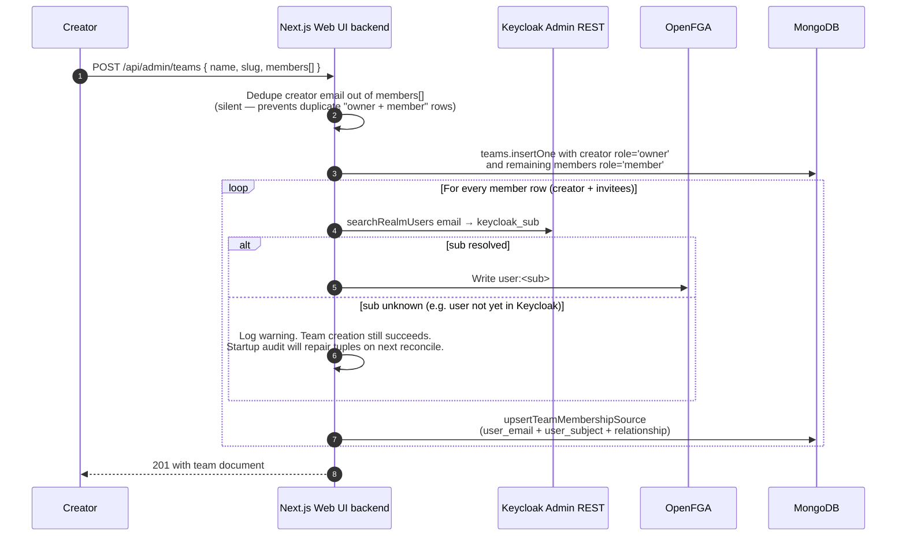

Why the creator gets **both** `admin` and `member` tuples even though `admin`
alone would satisfy `can_use` (model: `can_use = member ∪ admin`):

1. The team Members tab in the Admin UI reads the Mongo `members[]` array
   verbatim. If the creator is only stored as `role: 'owner'`, the tab
   continues to show them as the only member, which matches the visible Mongo
   intent.
2. The redundant `member` tuple keeps the OpenFGA store self-describing — a
   future read of `team:<slug>#member` returns every human-or-admin member,
   not just the team admins.
3. It costs one extra tuple per creator and removes a class of "I'm an
   admin, why don't list endpoints that filter by `team#member` include me?"
   bugs.

The same helpers (`resolveKeycloakUserSubject` and `writeTeamMembershipTuples`
in `ui/src/lib/rbac/team-membership-sync.ts`) are used by
`POST /api/admin/teams/[id]/members` so the add-member path is symmetric:
adding a `member` writes a `member` tuple, adding an `admin` writes an
`admin` tuple, and removing the last source for a relation deletes the
corresponding tuple.

### Team OpenFGA Sync Diagnostic

Even with the team-creation sync wired up correctly, a team can drift out
of step with OpenFGA over time: someone wrote a Mongo source row before
the user had logged in to Keycloak (so we couldn't yet resolve their
`sub`), the OpenFGA store was rebuilt without replaying tuples, or a
legacy team was created before the sync helpers existed. The Teams
settings dialog now surfaces drift directly to the admin instead of
hiding it behind backend logs.

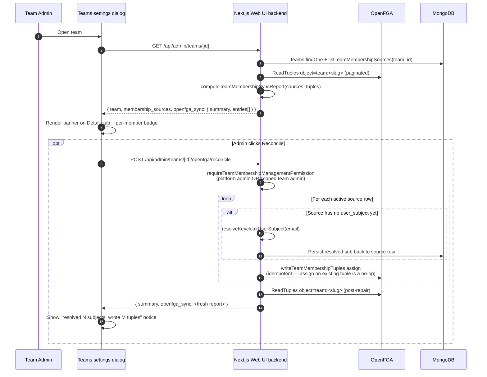

The diagnostic reports four states per source row:

| State | Meaning | Admin action |
| --- | --- | --- |
| `synced` | Source row has `user_subject` AND OpenFGA contains the matching `user:<sub>#<relation> team:<slug>` tuple | None |
| `pending` | Source row exists but `user_subject` is empty (e.g. the user has never signed in to Keycloak yet) | Wait for first sign-in, or click Reconcile once Keycloak knows the user |
| `drifted` | `user_subject` is resolved but OpenFGA is missing the matching tuple | Click Reconcile |
| `unknown` | OpenFGA read failed or the store is unconfigured | Check OpenFGA health in Security & Policy |

`needs_attention` on the summary is true if any row is `drifted` or
`unknown`. `pending` does not flip the banner red — it's an
informational state, not a failure mode.

The Reconcile endpoint is intentionally idempotent: write-on-already-present
is a no-op at the OpenFGA layer, so it is safe to invoke repeatedly. It
returns `unresolved_emails` for any source rows whose subject could not
be re-resolved (e.g. an invitee's Keycloak account still does not exist),
so the admin can chase those manually rather than spinning on the button.

### Dynamic Agent Creation Ownership

New Dynamic Agents must be assigned to an owner team during creation. The Web UI
backend validates the selected team before writing any agent document: platform
admins can choose any team, while scoped team admins can choose only teams where
they are `admin` or `owner`.

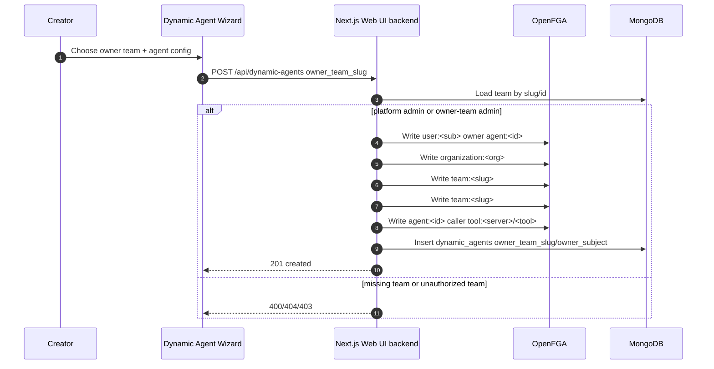

---

### AgentGateway MCP Endpoint Routing

**Invariant.** Every MCP server routed through AgentGateway must persist
an endpoint of the form `{agentgateway_base}/mcp/<server_id>`.
AgentGateway dispatches by **path prefix** (`/mcp/<target>`); a bare
`{agentgateway_base}/mcp` falls through to a non-registered route and
returns `HTTP 404 Not Found` on every probe and tool call. The class
first surfaced in production as the Confluence card showing:

> Failed to connect to MCP server: HTTP 404 Not Found from `http://agentgateway:4000/mcp`

**Defence in depth.** The invariant is enforced in four places — any one
of them is sufficient on its own, but all four together mean a bad
endpoint cannot persist for long:

| Layer | What it does | Code |
|------|------|------|
| Save-side normaliser (BFF) | `POST/PUT /api/mcp-servers` rewrites a bare gateway URL to `/<server_id>` form before insert/update — prevents future drift | `ui/src/lib/rbac/mcp-endpoint-normalizer.ts`, `ui/src/app/api/mcp-servers/route.ts` |
| Editor picker (UI) | `MCPServerEditor` calls `/api/mcp-servers/agentgateway/discover` on open and offers a `Pick AgentGateway target` row that fills the endpoint with the canonical `/<id>` form | `ui/src/components/dynamic-agents/MCPServerEditor.tsx` |
| Read-side self-heal (runtime) | `build_mcp_connection_config` in dynamic-agents re-normalises against `AGENT_GATEWAY_URL` before handing the URL to the MCP transport, so legacy rows still work until repaired | `ai_platform_engineering/dynamic_agents/src/dynamic_agents/services/mcp_client.py`, `services/mcp_endpoint_normalizer.py` |
| Standalone config reconciliation (Docker Compose) | `agentgateway-config-bridge` polls MongoDB for enabled AgentGateway-managed `mcp_servers` rows, renders one hot-reloaded standalone route per server, and writes the generated config volume consumed by AgentGateway | `deploy/agentgateway/config_bridge.py`, `deploy/agentgateway/Dockerfile.config-bridge`, `docker-compose.dev.yaml` |
| Native Kubernetes routing (Helm) | The umbrella chart renders AgentGateway-native `AgentgatewayBackend` and `HTTPRoute` resources for the built-in Knowledge Base target and any configured `global.agentgateway.extraMcpTargets` | `charts/ai-platform-engineering/templates/agentgateway-mcp.yaml`, `charts/ai-platform-engineering/values.yaml` |
| One-shot repair script | `scripts/fix-mcp-endpoint-routing.ts` audits the `mcp_servers` collection (dry-run by default) and rewrites mis-shaped rows under `--apply` | `scripts/fix-mcp-endpoint-routing.ts` |

**Direct upstream URLs are never rewritten.** AgentGateway routing is
opt-in per server, and silently rewriting `http://mcp-confluence:8000/mcp`
would break stdio and in-cluster topologies. The normaliser detects
gateway endpoints by origin match against the configured
`AGENT_GATEWAY_URL`; anything else passes through unchanged.

**Config-driven rows are never rewritten by the repair script.** Their
source of truth is `config.yaml`. If a config-driven row is mis-shaped,
the script logs it under `untouchedConfigDriven` so an operator can fix
the YAML instead.

**Operator workflow for the repair script:**

```bash
# Dry-run — prints which rows would change, no Mongo writes.
MONGODB_URI=mongodb://... \
AGENT_GATEWAY_URL=http://agentgateway:4000 \
  npx ts-node scripts/fix-mcp-endpoint-routing.ts

# Apply the repairs (idempotent — re-running is a no-op).
MONGODB_URI=mongodb://... \
AGENT_GATEWAY_URL=http://agentgateway:4000 \
  npx ts-node scripts/fix-mcp-endpoint-routing.ts --apply
```

The dry-run output includes a `reason` for each candidate
(`bare_gateway_base`, `gateway_root_only`, `wrong_target_suffix`)
so the admin can sanity-check the proposed change before committing.

**Testing the repair script:** the pure helpers (`normalizeMcpEndpointForServer`,
`buildRepairPlan`) are covered by `scripts/__tests__/fix-mcp-endpoint-routing.test.ts`
and run with the same invocation as the other `scripts/__tests__/*.test.ts`
files:

```bash
npx ts-node --compiler-options '{"module":"CommonJS"}' \
  scripts/__tests__/fix-mcp-endpoint-routing.test.ts
```

The Mongo IO half of the script (`main()` / `MongoClient.connect()`) is left
to live verification because it needs a real database; the pure helpers cover
every classification path (`bare_gateway_base`, `gateway_root_only`,
`wrong_target_suffix`), the safety rules (direct upstream / config-driven /
no `_id` / no endpoint), and the customisable AgentGateway base URL.

---

## 0.5.1 Schema Migration Tab

Admins run release migrations from Admin → System → Migrations. The tab loads the
0.5.1 migration manifest, lets the admin select and dry-run each migration, and
requires typing the exact confirmation string before applying writes.

`init-idp.sh` remains the first-run bootstrap escape hatch because it runs before
the Web UI backend is healthy and can use direct Keycloak admin credentials. It
prevents a chicken-and-egg dependency where BFF startup needs Keycloak client/realm
state that only BFF startup could create.

After that bootstrap, the Web UI backend owns the long-term Keycloak reconciliation
path through `keycloak_rbac_mapping_reconciliation_v1`. This migration is
code-backed in TypeScript rather than shell-backed by `init-idp.sh`; on BFF startup
it reconciles bot OBO permissions (token-exchange decision strategy, service-account
impersonation roles, realm-level `users.impersonate` scope-permission), resolves
`BOOTSTRAP_ADMIN_EMAILS` to Keycloak user ids, creates passwordless verified
placeholders for bootstrap emails that have not logged in, writes durable OpenFGA
admin tuples, records the run in Mongo migration tables, and leaves a blocking
migration status if the Keycloak repair fails. (Phase 3 of spec
2026-05-24-derive-team-from-channel removed the per-team and personal client-scope
branches from this migration; teams no longer touch Keycloak.) The header checks
`GET /api/rbac/migration-status` for every authenticated UI session so non-admin
users see the same "migrations required" indicator. Admins can inspect persisted
Keycloak run details, counts, warnings, and errors from `GET
/api/admin/keycloak/migration-health` in Admin → Security & Policy → Keycloak.
The panel surfaces five high-signal tiles at the top (Schema area / Version /
Migration status / Last actor / Bootstrap admins) and the Keycloak Invariants
section below them with per-row **Fix** buttons as the actionable source of truth
for OBO token-exchange permission strategy, attached OBO policies, and
service-account impersonation roles. Bootstrap-admin
diagnostics (configured emails, resolved Keycloak subjects, placeholder
creations, tuple writes, per-email warnings) are still inspectable through the
Bootstrap admins tile at the top of the panel.
If the stored run is failed or the `keycloak_rbac_mappings` schema area is behind,
the **Reconcile now** button posts to the existing migration apply route for
`keycloak_rbac_mapping_reconciliation_v1` and then reloads the health panel from
Mongo.

Dynamic Agent migrations include both tool tuple reconciliation and
`agent_org_admin_inheritance_v1`, which backfills
`organization:<org>#admin manager agent:<id>` for existing agents so
organization admins inherit `can_manage` without assigning owner teams to legacy
records.

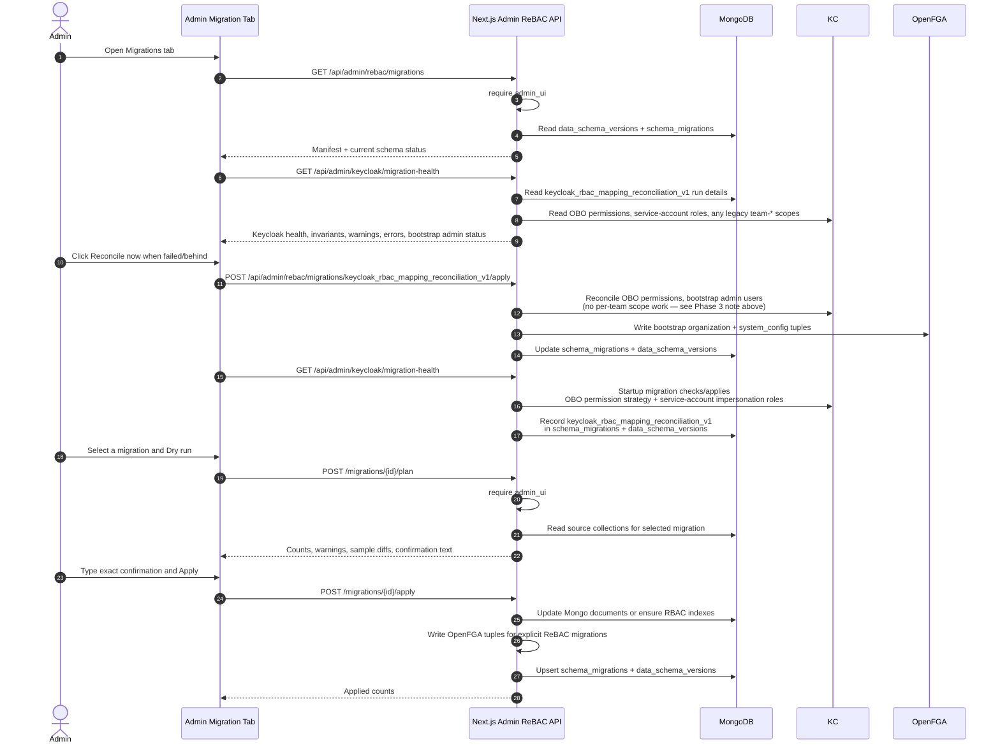

Conversation authorization after the migration remains hybrid: if the caller owns
the conversation by `owner_subject` or legacy `owner_id`, the Web UI backend allows
the private owner path without a per-conversation OpenFGA owner tuple. Non-owners
must still pass explicit OpenFGA checks for shared conversation access.

---

## OBO Token Exchange — Bot Identity Propagation

> **Badge analogy:** The Slack or Webex bot is a courier service. When Alice asks the courier to pick something up from the server room on her behalf, the courier can't use their own badge — the server room requires Alice's clearance. Instead, the courier goes to HR (Keycloak), presents their credentials and Alice's employee ID, and HR issues a *delegated badge*: it opens the same doors as Alice's badge, but it has a second chip that says "issued on behalf of Alice, presented by courier bot." The delegation chain is physically stamped on the badge — it's auditable and unforgeable.

**The hardest part to get right technically.** Without OBO, every Slack or Webex request carries the bot's service account identity. OpenFGA would evaluate the bot instead of the human, and all per-user/team authorization would be meaningless.

### RFC 8693 Token Exchange

OBO (On-Behalf-Of) is implemented via [RFC 8693](https://www.rfc-editor.org/rfc/rfc8693) token exchange. The bot uses its `client_credentials` grant to request a token **impersonating** a specific Keycloak user:

```http
POST /realms/caipe/protocol/openid-connect/token
Content-Type: application/x-www-form-urlencoded

grant_type=urn:ietf:params:oauth:grant-type:token-exchange
&client_id=slack-bot
&client_secret=<bot-secret>
&subject_token=<bot-access-token>
&subject_token_type=urn:ietf:params:oauth:token-type:access_token
&requested_subject=<keycloak-user-id>
&requested_token_type=urn:ietf:params:oauth:token-type:access_token
&audience=${CAIPE_PLATFORM_AUDIENCE:-caipe-platform}
&scope=openid team-<slug-or-personal>
```

Keycloak responds with an OBO JWT where:

- `sub` = the impersonated user's Keycloak ID
- `email` = the user's email
- `act.sub` = the bot's client ID — the delegation chain is cryptographically recorded
- `aud` includes `caipe-platform` by default because the bot's immediate next hop is the CAIPE UI BFF access-check/proxy surface, not AgentGateway

> Phase 3 of spec 2026-05-24-derive-team-from-channel removed the legacy
> `active_team` JWT claim. The bot no longer requests a `team-*` scope and
> the OBO token no longer carries a team identifier. Team identity for a
> Slack channel or Webex space is now derived at request time from
> `channel_team_mappings` / `webex_space_team_mappings` (see "Channel-message
> dispatch" below). DM dispatch follows the personal chain (override →
> preference → `dm_agent_id` → `default_agent_id` → deny).

### Bot → BFF Audience

Slack and Webex use the same audience model. The bot mints a team-agnostic
user OBO token for the **next hop it is calling**: the CAIPE UI BFF. That
is why `CAIPE_PLATFORM_AUDIENCE` defaults to `caipe-platform`. AgentGateway
still accepts `agentgateway` for direct data-plane callers and legacy paths,
but bot pre-dispatch checks should not mint `aud=agentgateway`.

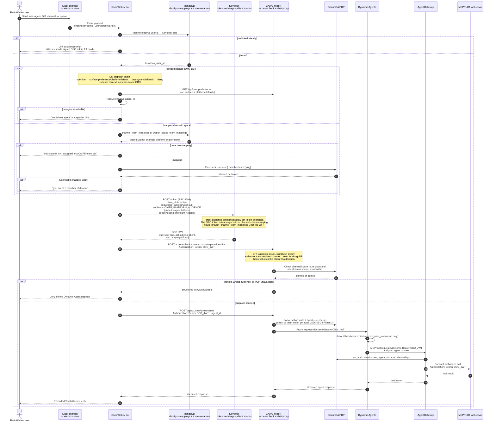

The two load-bearing invariants are:

1. **Audience follows the next hop.** Bot pre-dispatch calls target the CAIPE UI BFF, so OBO uses `CAIPE_PLATFORM_AUDIENCE` (`caipe-platform` by default). The same bearer can still be forwarded later because Dynamic Agents and AgentGateway accept `caipe-platform`.
2. **Team context is data-layer derived, not JWT-signed** (Phase 3 of spec 2026-05-24-derive-team-from-channel). Channel/space → team mapping is read from MongoDB at every request, and the BFF + AgentGateway PDP evaluate the OpenFGA decision against that mapping. The OBO token is team-agnostic.

#### Sharing model: assigning a channel to a team transitively shares its agents

Channel-dispatch authorization deliberately uses the channel's mapped team as
the user-side subject of the `can_use agent:<id>` check
(`team:<slug>#member can_use agent:<id>`). This is **stronger than a direct
per-user grant on the user → agent edge**, because the OpenFGA model lets a
user reach the agent through any team they belong to that has the grant.

Operationally that means:

- Assigning channel `C` to `team:T` and then sharing any agent `A` with `C`
  (via the channel's `can_use agent` tuple) **also makes `A` callable in `C`
  by every member of `team:T`**, including members who were never granted
  `A` directly.
- Removing the channel→team assignment, or unsharing the agent from the
  channel, revokes that transitive access immediately on the next request.
- A DM with the same user does **not** inherit this channel→team cascade
  on its own — DM dispatch uses `user:<sub> can_use agent:<id>` and
  ignores channel/team mappings. However, the DM check **does** fall
  back to a team-union OpenFGA evaluation against existing
  `team:<slug>#member can_use agent:<id>` tuples (see
  `evaluateAgentAccess`), so any agent explicitly shared with a team
  via the Agent editor (next section) **is** callable in DM by every
  member of that team.

If an agent must stay private to a subset of a team, do not pin it to a
channel that is mapped to that team. Either:

1. Share the agent with a smaller team (or with individual users) and keep
   the channel mapped to the broader team for other agents, or
2. Map the channel to a narrower team whose membership matches the intended
   audience for that agent.

The admin UI (Slack channel and Webex space ReBAC panels) surfaces this
trade-off in the top-of-card "Sharing model" callout and in a per-channel
heads-up under the agent-association form. Future work may add an
optional per-channel agent allow-list that is stricter than the team-level
grant; until then, the team cascade is the canonical policy and is
documented behavior, not a bug.

#### Sharing model: explicit "Share with Teams" on an agent

The Agent editor (`DynamicAgentEditor`) has a "Share with Teams"
multi-select that operates on the same two-tuple inheritance pair as
the owner team, but **additively** — selecting a team T writes
`team:T#member can_use agent:<id>` and `team:T#admin can_manage
agent:<id>` to OpenFGA without disturbing the owner-team tuples. The
practical consequence is:

- Every member of team T can DM the agent in a 1:1 chat (because the
  DM dispatch's team-union fallback resolves `user:<sub>` →
  `team:T#member` → `can_use agent:<id>`).
- Every member of team T can use the agent in any Slack channel or
  Webex space whose `channel_team_mappings`/`webex_space_team_mappings`
  row points at team T (because channel dispatch evaluates
  `team:T#member can_use agent:<id>` directly).
- Every admin of team T inherits `can_manage` on the agent and can
  edit, disable, or delete it from the admin surfaces.

Removing a team from the multi-select on the editor is symmetric:
`POST/PUT /api/dynamic-agents` walks the previous `shared_with_teams`
list against the new one and emits OpenFGA *delete* tuples for every
removed slug (via `previousSharedTeamSlugs` on
`reconcileAgentRelationships`). Until 2026-05-27 this field was
Mongo-only — the multi-select silently denied access — see
`agent_shared_team_grants_backfill_v1` for the one-shot replay that
fixes existing agents.

The "Effective access" callout under the multi-select is the
operator-facing render of exactly which `team:<slug>#member` tuples the
next save will write to OpenFGA, so admins can confirm the transitive
grant before the form is submitted.

### Personal defaults and `/use default`

Users save independent Web, Slack, and Webex defaults in Admin → Settings.
Each non-null selection is checked against the user's effective access before
all changed fields are written atomically. A null selection uses the platform
default. Slack `/caipe-use default` and Webex `use default` clear the current
surface preference together with the active conversation override.

```mermaid
sequenceDiagram
    autonumber
    actor U as Signed-in user
    participant UI as Admin → Settings
    participant Bot as Slack/Webex bot
    participant BFF as CAIPE UI BFF
    participant FGA as OpenFGA
    participant MDB as MongoDB user_preferences

    U->>UI: Select Web, Slack, and/or Webex defaults
    UI->>BFF: PUT /api/user/preferences<br/>{ surface_default_agent_id: "my-agent" }
    BFF->>FGA: Check user:{sub} can_use agent:{my-agent}
    FGA-->>BFF: allowed | denied
    alt setting + denied
        BFF-->>UI: "you don't have access to my-agent"
    else allowed
        BFF->>MDB: upsert user_preferences row
        MDB-->>BFF: ok
        BFF-->>UI: saved
    end
    U->>Bot: /caipe-use default or use default
    Bot->>BFF: PUT /api/user/preferences<br/>{ slack_default_agent_id: null }<br/>or { webex_default_agent_id: null }
    BFF->>MDB: clear surface preference
    Bot-->>U: override cleared; platform default restored
```

The historical shared DM field is no longer read or written. Existing users
without a surface-specific selection return to the platform default and can
choose a new value in Settings.

```mermaid
sequenceDiagram
    actor U as Slack User
    participant SB as Slack Bot
    participant KC as Keycloak
    participant DA as Dynamic Agents
    participant AG as AgentGateway
    participant MCP as RAG MCP

    U->>SB: query the knowledge base about X

    note over SB: rbac_global_middleware runs first
    SB->>KC: GET /admin/realms/caipe/users?q=slack_user_id:U09TC6RR8KX
    KC-->>SB: [{ id: "a3f9...", email: "alice@example.com" }]

    note over SB,KC: RFC 8693 token exchange
    SB->>KC: POST /token (grant=token-exchange, requested_subject=a3f9...)
    KC-->>SB: OBO JWT (sub=a3f9, act.sub=slack-bot)

    SB->>DA: POST /api/v1/chat/...  Authorization: Bearer OBO_JWT<br/>(team-agnostic; channel→team is resolved by the BFF<br/>via `channel_team_mappings`, not from the JWT)

    note over DA: get_current_user() (per-request JWT validation)
    DA->>DA: decode JWT → email=alice, sub=a3f9

    note over DA: agent runtime selects RAG tool
    DA->>AG: POST /rag/v1/query  Authorization: Bearer OBO_JWT

    note over AG: ext_authz / OpenFGA authorization
    AG->>AG: Check user/team/resource tuple graph → ALLOW

    AG->>MCP: POST /v1/query  Authorization: Bearer OBO_JWT
    note over MCP: JWKS validation
    MCP->>KC: GET /realms/caipe/protocol/openid-connect/certs
    KC-->>MCP: JWKS public keys
    MCP->>MCP: verify signature, extract email + tenant

    MCP-->>AG: results
    AG-->>DA: results
    DA-->>SB: streamed response (SSE)
    SB-->>U: DM with answer
```

### Security Properties of OBO

| Property | Mechanism |
|----------|-----------|
| Bot cannot forge a user identity | Keycloak only issues the OBO token if the bot's `client_id` has the `token-exchange` permission granted in the realm |
| Delegation is auditable | `act.sub` in the JWT records the bot as delegating party — verifiable in any JWKS-aware system |
| User/team relationships are enforced, not bot identity | OpenFGA checks use the impersonated user's `sub` and team relationships from the OBO token context |
| Token expiry still applies | OBO tokens have the same `exp` as a normal Keycloak token; expired tokens are rejected at every JWKS validation point |
| Unlinked users are blocked at the edge | `rbac_global_middleware` in the Slack bot rejects unlinked users before they reach any backend agent — the linking prompt is sent at most once per `SLACK_LINKING_PROMPT_COOLDOWN` seconds (default: 3600) |

---

## Slack Identity Linking (Auto-Bootstrap + JIT + Forced Link)

There are three onboarding paths, in priority order: **(1) auto-link to existing Keycloak user**, **(2) JIT-create a new shell user** (spec 103), **(3) HMAC-signed link URL** as fallback.

### 1. Auto-bootstrap (default, `SLACK_FORCE_LINK=false`)

On the user's first Slack message the bot:

1. Calls Slack `users.info` → fetches `profile.email`
2. Resolves the user by exact email via the BFF (`GET /api/admin/users/resolve?email=`)
3. **If found:** merges the `slack_user_id` attribute via the BFF (`PATCH /api/admin/users/{id}/attributes`) → linked silently, zero user action required
4. **If not found:** the bot continues to step 2 (JIT) below.

### 2. Just-In-Time user creation (default ON, `SLACK_JIT_CREATE_USER=true`)

When no existing Keycloak user matches the Slack email, and JIT is enabled, the bot:

1. **Optionally checks** the email domain against `SLACK_JIT_ALLOWED_EMAIL_DOMAINS` (comma-separated allowlist; empty = any domain).
2. **POSTs to the BFF `/api/admin/users/provision-shell`** with its `caipe-slack-bot` service-account token (gated `writer admin_surface:user_provisioning` in OpenFGA). The BFF — not the bot — calls Keycloak Admin to create-or-resolve the user.
3. The created user is **federated-only**: no password, no required actions, `emailVerified=true`, with attributes `slack_user_id`, `created_by=slack-bot:jit`, `created_at=<RFC3339>` (the BFF owns the `created_by`/`created_at` stamping).
4. **Race-safe**: an HTTP 409 from a concurrent create is resolved by re-querying the email and returning the surviving UUID (handled BFF-side).
5. **On failure** (4xx/5xx/network), the bot logs `event=jit_failed error_kind=<auth_failure|forbidden|server_error|network_error|unexpected>` and falls through to step 3.

JIT is **default ON in dev** so first-time DMs work without an admin handshake. **Set `SLACK_JIT_CREATE_USER=false` in production** if you want web-UI onboarding to be a hard prerequisite — in which case all unknown emails go to the link URL below.

> **First-party-BFF design.** The bot holds no Keycloak Admin credentials: provisioning (and every other Keycloak user operation) goes through the BFF authenticated by the bot's `caipe-slack-bot` service-account token and authorized by an OpenFGA grant (`writer admin_surface:user_provisioning`). Realm-management privilege lives only in the BFF. All JIT actions are logged with stable `event=jit_*` tokens for SIEM. This superseded spec 103's earlier single-credential design (which reused the `caipe-platform` admin client directly from the bot) — see spec [2026-06-09-slack-bot-remove-direct-keycloak-admin](../../specs/2026-06-09-slack-bot-remove-direct-keycloak-admin/plan.md).

### 3. Explicit link URL (fallback or `SLACK_FORCE_LINK=true`)

Whenever auto-link returns no user **and** JIT is disabled / domain not allow-listed / JIT failed, the bot DMs an HMAC-signed URL:

```
/api/auth/slack-link?slack_user_id=U09TC6RR8KX&ts=1713196400&sig=<HMAC-SHA256>
```

The HMAC signature uses `SLACK_LINK_HMAC_SECRET`, prevents forged links, and is time-bound (TTL enforced server-side). After OIDC login, the server writes `slack_user_id` to the Keycloak user via the Admin API.

The user **always** gets an actionable path forward — the previous "contact your admin" dead-end was removed in spec 103 (FR-007).

In all three modes, once the link is established, all future Slack messages carry the user's Keycloak identity automatically — no repeated login.

### Privacy in logs

All log lines that reference a Slack profile email run it through `mask_email()` (spec 103 FR-010): `alice@corp.com` → `ali***@corp.com`. The domain stays visible for SIEM tenant attribution; the local part is redacted.

---

## Slack Channel → Team + Agent ReBAC

> **Badge analogy:** Each Slack channel is a dedicated help-desk line. An admin assigns the line to a team and grants one or more Dynamic Agents to that line. When a user calls in, the operator checks both the channel grant and the user's team/agent relationship before patching them through.

### How It Works

Slack channel routing now separates "which team owns this channel?" from "which Dynamic Agents may be used here?" The workspace key is a configured alias (`SLACK_WORKSPACE_ALIAS`, for example `CAIPE`) rather than Slack's opaque `team_id`; the Slack bot maps incoming `team_id` values to that alias before looking up routes or grants. When a message arrives, the Slack bot reads OpenFGA tuples for `slack_channel:<workspace_alias>--<channel_id> user agent:<id>`, then joins optional `slack_channel_agent_routes` metadata for listen mode and priority. Stale Mongo route rows without a matching OpenFGA tuple are ignored. Operators can set `config` for static-only routing or `db_only` to use only UI-managed OpenFGA-backed routes. The selected agent is then verified against OpenFGA:

1. **Team lookup**: query `channel_team_mappings` in MongoDB by `slack_channel_id`.
2. **Optional first-message auto-assignment**: when `SLACK_AUTO_ASSIGN_UNMAPPED_CHANNELS=true` and no active mapping exists, write the configured `SLACK_DEFAULT_TEAM_SLUG` mapping, the default `slack_channel:<workspace_alias>--<channel_id> user agent:<id>` OpenFGA tuple, and matching route metadata.
3. **Team-agnostic OBO mint**: mint the user's OBO token without a `team-*` scope (Phase 3 of spec 2026-05-24-derive-team-from-channel removed the per-team scope mint — channel→team is now resolved from `channel_team_mappings` at every request).
4. **Channel association lookup**: read OpenFGA channel-agent tuples and join Mongo route metadata only for tuple-backed agents.
5. **Channel ReBAC check**: call the Slack channel access checker for `slack_channel:<workspace_alias>--<channel_id> can_use agent:<id>` and the user's team/agent relationship (team derived from the channel mapping).
6. **Route**: dispatch to the selected `agent_id` only after both the channel association and user/team agent grant allow the request.

The Slack YAML config still registers channels and remains the fallback route source in the default `db_prefer` mode. Runtime channel-agent authorization lives in OpenFGA; Mongo route rows are non-authoritative metadata and are deleted when the admin deletes the channel-agent association. The OpenFGA Policy Graph overlays `channel_team_mappings` as read-only `assigned_team` routing metadata edges so operators can see channel ownership next to OpenFGA grants without treating that ownership as a mutable tuple.

The Slack Channels admin panel also includes **Slack Runtime Diagnostics** for the selected channel. It calls `/api/admin/slack/channels/{workspaceId}/{channelId}/diagnostics` to perform the same OpenFGA tuple read shape used by the Slack bot, compare tuple-backed agents with `slack_channel_agent_routes`, flag stale Mongo metadata that runtime ignores, flag listen-mode mismatches such as mention-only routes that will ignore plain messages, and show the latest `slack_bot` runtime error from audit-service.

Slack route misses fail closed without turning ambient channel chatter into bot noise. For plain channel messages, the bot still records OpenFGA read failures and listen-mode mismatches for Slack Runtime Diagnostics, but it does not post a route-miss notice unless the user explicitly invoked the bot. During initial setup, `SLACK_INTEGRATION_SILENCE_ENV=true` stops Slack handlers before they can send user-visible responses at all. Diagnostics remains the operator-facing path for common errors: stale metadata without an OpenFGA tuple can be removed, and mention-only/message-only routes can be updated to `listen: all`.

## Keycloak Role → ReBAC Transition Check

The transition comparison API is intentionally read-only and engineer-facing:

1. Engineers call `/api/rbac/enforcement-comparison` with a subject/action/resource plus observed identity/group context.
2. The API checks the same relationship in OpenFGA; legacy realm-role classification is historical-only.
3. If the resource type is `rebac_enforced`, matching per-resource roles are reported as ignored and the effective decision comes only from ReBAC.

### Admin UI

Admins configure channel/team ownership in **Admin → Teams → selected team → Slack Channels** and channel/agent grants in **Admin → Integrations → Slack**.

- Channel/team ownership is exclusive: a channel cannot be actively mapped to two teams.
- Channel/agent associations are many-to-many OpenFGA tuples: a channel can have multiple Dynamic Agent associations.
- Removing an association deletes the OpenFGA tuple and its saved Mongo listen/priority metadata, denying that resource in the channel even if the user has access elsewhere.
- UI-managed route dispatch is the default with static YAML fallback (`SLACK_AGENT_ROUTES_MODE=db_prefer`). Set `config` only for static YAML routing, and use `db_only` only after the channel's OpenFGA-backed UI routes are complete.
- Runtime auto-assignment is opt-in with `SLACK_AUTO_ASSIGN_UNMAPPED_CHANNELS=true`, `SLACK_DEFAULT_TEAM_SLUG`, and `SLACK_DEFAULT_AGENT_ID`. It only handles channels with no active mapping and never changes an already assigned channel.
- Runtime sync/reload uses the Web UI backend as the browser-facing boundary. `caipe-ui` authorizes the admin user, calls the Slack bot admin API with a Keycloak client-credentials token, and the Slack bot verifies that token with JWKS before exposing route status, cache reload, or static-config upsert sync.
- Deep links that include `subtab=slack` or `openfgaTab=slack` canonicalize to **Admin → Integrations → Slack**, even if an older link still carries `cat=system&tab=settings`.

### MongoDB Collection: `channel_team_mappings`

```json
{
  "_id": ObjectId,
  "slack_channel_id": "C0123456789",
  "team_id": "6612...",
  "channel_name": "#k8s-support",
  "slack_workspace_id": "CAIPE",
  "created_by": "admin@example.com",
  "created_at": ISODate,
  "active": true
}
```

### OpenFGA Tuple: Slack Channel Agent Association

```text
slack_channel:CAIPE--C0123456789 user agent:my-k8s-agent
```

The channel-agent association lives in OpenFGA. The `agent:<id>` value is the Dynamic Agent slug (string `_id` in the `dynamic_agents` collection). The legacy `slack_channel_grants` collection may exist during migration, but it is not an allow source for Slack runtime channel-agent decisions.

### MongoDB Collection: `slack_channel_agent_routes`

```json
{
  "workspace_id": "CAIPE",
  "channel_id": "C0123456789",
  "agent_id": "my-k8s-agent",
  "enabled": true,
  "priority": 100,
  "users": { "enabled": true, "listen": "mention" },
  "source_type": "manual",
  "status": "active",
  "created_by": "admin@example.com",
  "created_at": "2026-05-12T00:00:00.000Z"
}
```

This row is metadata for a matching OpenFGA tuple. It does not authorize dispatch by itself, and it is deleted when the channel-agent association is deleted.

---

## Web UI Object-Level Checks

For UI-owned resource surfaces, the BFF performs the coarse session or legacy scope gate first and then checks the concrete OpenFGA object before returning or proxying data.

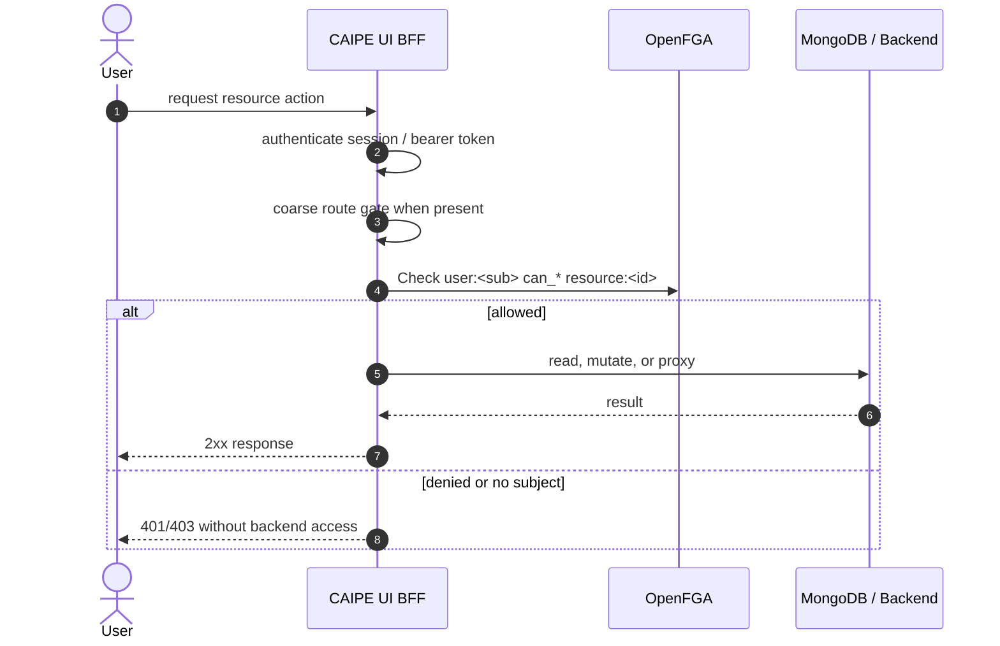

Current strict surfaces include `conversation:<id>` for chat list/read/write/share/stream and message persistence, `skill:<id>` for catalog/config/hub file and scan access, `admin_surface:rag_datasources` for RAG Data Sources tab administration, `knowledge_base:<id>` for RAG proxy paths, datasource list filtering, search filter injection, and direct RAG API/MCP checks, `agent:<id>` for Dynamic Agent listing and mutation, `mcp_server:agentgateway` for AgentGateway discovery/sync, `mcp_server:<id>#can_discover` for the Create Agent → Tools Probe button (probing only enumerates advertised tool metadata, so it is gated on `can_discover` rather than `can_invoke`; the model already grants discover to organization members, organization admins, team-shared members, owners, and channel/group routings), and `system_config:platform_settings` for platform configuration. Conversation checks use implicit owner access first and explicit OpenFGA relationships for non-owner access. RAG proxy calls still forward the Keycloak bearer token after the BFF PDP decision, so RAG validates issuer, audience, signature, and expiry with Keycloak before checking OpenFGA using team-derived `knowledge_base` relationships. The Dynamic Agent **built-in tool catalog** at `GET /api/dynamic-agents/builtin-tools` is intentionally not strict-gated — the catalog is a static metadata listing of supported built-in tool *types* (web_search, file_io, etc.), is needed by every authenticated user who can open the Create Agent wizard, and per-tool authorization happens at MCP invocation time. The route requires an authenticated session and forwards the bearer token to dynamic-agents (where `DA_REQUIRE_BEARER` still applies); it does not consult OpenFGA.

**Workflow configs and runs** are the first surfaces migrated onto the Centralized Authorization Service (CAS). See [Workflow RBAC on CAS](#workflow-rbac-on-cas) below — those routes still pass through the coarse Keycloak scope gate in `api-middleware.ts`, but object-level allow/deny is decided by CAS rather than direct OpenFGA helper calls in the route handler.

---

## Workflow RBAC on CAS

Workflow authorization is the first end-to-end migration onto the **Centralized Authorization Service (CAS)**. CAS is the single PDP: it evaluates OpenFGA capabilities, applies the org-admin bypass, caches decisions, and writes `cas_decision` audit rows. BFF routes and Dynamic Agents act as **Policy Enforcement Points (PEPs)** that call CAS instead of embedding OpenFGA checks.

### BFF workflow PEP (`workflow-cas-authz.ts`)

`GET/POST /api/workflow-configs` and `GET/POST/PATCH/DELETE /api/workflow-runs` (plus run resume/cancel) delegate object-level checks to `ui/src/lib/server/workflow-cas-authz.ts`:

* **Resource mapping** — workflow configs are modeled as `task:<config_id>` in OpenFGA (`read` / `write` / `delete` actions).
* **Org-admin bypass** — callers with `organization:<org>#can_manage` are allowed before per-config checks (mirrors legacy `{ bypassForOrgAdmin: true }`).
* **Run access** — run owners (`owner_subject` on the run document) are allowed without a parent-config check; runs with a different owner are denied; legacy runs without `owner_subject` fall back to parent-config authorization.
* **List filtering** — config lists use batched `authorizeMany` against CAS instead of per-row OpenFGA calls.
* **Clean errors** — denials return stable reason codes (`WORKFLOW_FORBIDDEN`, `WORKFLOW_RUN_FORBIDDEN`, `AUTHZ_UNAVAILABLE`) without leaking OpenFGA relation strings in response bodies.

The coarse session gate in `ui/src/lib/api-middleware.ts` maps workflow-config routes to **`dynamic_agent#view`** for all methods (`GET`/`POST`/`PUT`/`DELETE`). Create/update/delete ownership and `task#write` checks run in `workflow-configs/route.ts` (`requireWorkflowConfigWriteAccess`). Workflow **runs** still use `dynamic_agent#invoke` for mutations via the same legacy resolver.

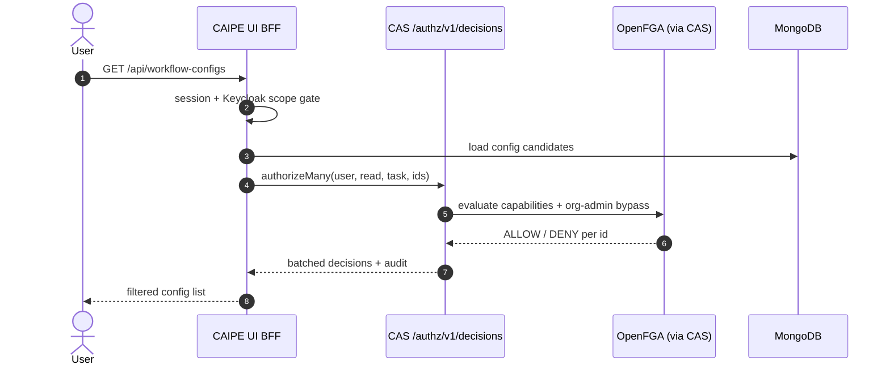

### Dynamic Agents agent-use PEP (`auth/authz.py`)

Dynamic Agents no longer perform in-process OpenFGA checks for agent invocation. `require_agent_use_permission()` in `ai_platform_engineering/dynamic_agents/src/dynamic_agents/auth/authz.py` is a thin PEP:

1. Read `sub` from the already-validated bearer (signature verified upstream).
2. `POST {AUTHZ_SERVICE_URL}/api/authz/v1/decisions` with `{ subject, resource: agent:<id>, action: use }`, forwarding the same OBO bearer so CAS **subject-binding** (`caller == subject`) holds.
3. **Allow** on `decision: ALLOW`; **403** on deny; **same 4xx status** when CAS returns a definitive 4xx (e.g. `403` subject-binding mismatch, `400` bad request, `401` — `reason: pdp_rejected`, `action: contact_admin`); **503** when CAS returns a 5xx, is unreachable, or `AUTHZ_SERVICE_URL` is unset (fail closed, `reason: pdp_unavailable`, `action: retry`). This ensures a misconfigured subject binding surfaces as a real denial signal rather than a misleading "temporarily unavailable".

Workflow step execution in the BFF orchestrates agents in-process (`/api/v1/chat/stream/start` per step), so per-step agent-use checks run through the BFF CAS path rather than this DA HTTP client.

### Global workflow agent grants (PAP)

The workflow editor's "Share agent access" modal writes intent-based grants through CAS (`agent#use` to `team:<slug>` or global `everyone`). CAS's grant parser intentionally allows low-risk `everyone` + `use` grants (but still blocks high-risk `everyone` + `manage`) so operators can expose a workflow's backing agent org-wide without opening admin capabilities.

---

## Compact End-to-End Request Flow (Reference)

A condensed text-only version of the per-request sequence above. Useful for runbooks and incident-response playbooks where a Mermaid diagram is overkill.

```
Slack User: "What's the status of my ArgoCD deployment?"

━━━━━━━━━━━━━━━━━━━━━━━━━━━━━━━━━━━━━━━━━━━━━━━━━━
STEP 1: Identity Resolution  (Slack Bot)
━━━━━━━━━━━━━━━━━━━━━━━━━━━━━━━━━━━━━━━━━━━━━━━━━━
  slack_user_id U09TC6RR8KX
    → BFF GET /api/admin/users/resolve?attribute=slack_user_id (SA token)
    → user: { sub: "a3f9...", enabled: true, attributes: {...} }
  RFC 8693 exchange → OBO JWT
    sub=alice, act.sub=slack-bot

━━━━━━━━━━━━━━━━━━━━━━━━━━━━━━━━━━━━━━━━━━━━━━━━━━
STEP 2: Dynamic Agents Ingestion
━━━━━━━━━━━━━━━━━━━━━━━━━━━━━━━━━━━━━━━━━━━━━━━━━━
  POST /api/v1/chat/...  Authorization: Bearer OBO_JWT
    → get_current_user(): validates RS256 signature against JWKS per request
    → decodes claims → email=alice
    → agent runtime selects ArgoCD MCP tool

━━━━━━━━━━━━━━━━━━━━━━━━━━━━━━━━━━━━━━━━━━━━━━━━━━
STEP 3: Policy Enforcement  (AgentGateway)
━━━━━━━━━━━━━━━━━━━━━━━━━━━━━━━━━━━━━━━━━━━━━━━━━━
  POST /argocd/...  Authorization: Bearer OBO_JWT
    → ext_authz: OpenFGA check for caller/team/tool relationship → ALLOW
    → Proxy to ArgoCD MCP Server

━━━━━━━━━━━━━━━━━━━━━━━━━━━━━━━━━━━━━━━━━━━━━━━━━━
STEP 4: MCP Tool Execution  (ArgoCD MCP Server)
━━━━━━━━━━━━━━━━━━━━━━━━━━━━━━━━━━━━━━━━━━━━━━━━━━
  Validates OBO JWT against Keycloak JWKS independently
  Extracts email=alice, tenant=acme
  Returns deployments scoped to alice's tenant

━━━━━━━━━━━━━━━━━━━━━━━━━━━━━━━━━━━━━━━━━━━━━━━━━━
Response path: MCP → Gateway → Dynamic Agents → Slack → User
```
