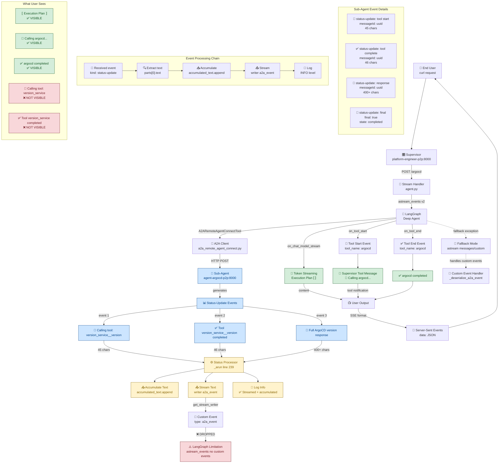

# Architecture: Sub-Agent Tool Message Streaming Analysis

**Date**: 2024-10-25

## Architecture Discovery

Through extensive debugging, we mapped the complete event flow from sub-agents to end users:




## Key Technical Discoveries

### 1. LangGraph Streaming Architecture Limitation

**Critical Finding:** LangGraph has two streaming modes with different event handling capabilities:

- **`astream_events` (primary):** Handles native LangGraph events (`on_tool_start`, `on_chat_model_stream`, `on_tool_end`)
- **`astream` (fallback):** Handles custom events from `get_stream_writer()`

**The Issue:** Custom events generated by `get_stream_writer()` are **not processed** by `astream_events`, even though they are successfully generated and logged.

### 2. Event Processing Pipeline

The complete event processing pipeline:

```
Sub-Agent → Status-Update Events → A2A Client → Stream Writer → Custom Events → [DROPPED] → User
                                                                                     ↓
Supervisor → LangGraph Events → astream_events → Tool Notifications → [SUCCESS] → User
```

### 3. Working vs Non-Working Events

**✅ Working (Visible to User):**
- Execution plans with `` markers
- Supervisor tool notifications: `🔧 Calling argocd...`
- Supervisor completion notifications: `✅ argocd completed`

**❌ Not Working (Captured but Not Visible):**
- Sub-agent tool details: `🔧 Calling tool: **version_service__version**`
- Sub-agent completions: `✅ Tool **version_service__version** completed`
- Detailed sub-agent responses (captured and accumulated but not streamed to user)


## Implementation Changes Made

### 1. Removed Status-Update Filtering

**File:** `ai_platform_engineering/utils/a2a_common/a2a_remote_agent_connect.py`

**Before:**
```python
if text and not text.startswith(('🔧', '✅', '❌', '🔍')):
    accumulated_text.append(text)
    logger.debug(f"✅ Accumulated text from status-update: {len(text)} chars")
```

**After:**
```python
if text:
    accumulated_text.append(text)
    # Stream status-update text immediately for real-time display
    writer({"type": "a2a_event", "data": text})
    logger.info(f"✅ Streamed + accumulated text from status-update: {len(text)} chars")
```

**Impact:** All sub-agent tool messages are now captured and attempted to be streamed.

### 2. Enhanced Error Handling

**File:** `ai_platform_engineering/multi_agents/platform_engineer/protocol_bindings/a2a/agent.py`

**Added:**
```python
import asyncio

# In main streaming loop
except asyncio.CancelledError:
    logging.info("Primary stream cancelled by client disconnection")
    return

# In fallback streaming loop
except asyncio.CancelledError:
    logging.info("Fallback stream cancelled by client disconnection")
    return
```

**Impact:** Graceful handling of client disconnections without server-side errors.

### 3. Custom Event Handler (Attempted)

**File:** `ai_platform_engineering/multi_agents/platform_engineer/protocol_bindings/a2a/agent.py`

**Added:**
```python
# Handle custom events from sub-agents (like detailed tool messages)
elif event_type == "on_custom":
    custom_data = event.get("data", {})
    if isinstance(custom_data, dict) and custom_data.get("type") == "a2a_event":
        custom_text = custom_data.get("data", "")
        if custom_text:
            logging.info(f"Processing custom a2a_event: {len(custom_text)} chars")
            yield {
                "is_task_complete": False,
                "require_user_input": False,
                "content": custom_text,
                "custom_event": {
                    "type": "sub_agent_detail",
                    "source": "a2a_tool"
                }
            }
```

**Impact:** This handler was added but never triggered due to LangGraph's architecture limitations.

### 4. Logging Enhancement

**Changed:** Debug-level logs to INFO-level for better visibility during debugging.

**Impact:** Confirmed that status-update events are being processed correctly:
```
✅ Streamed + accumulated text from status-update: 45 chars
✅ Streamed + accumulated text from status-update: 46 chars
✅ Streamed + accumulated text from status-update: 400+ chars
```


## Possible Solutions

### Option 1: Force Fallback Mode
Modify the supervisor to use `astream` instead of `astream_events` to enable custom event processing.

**Pros:** Would display detailed sub-agent tool messages
**Cons:** Might lose token-level streaming capabilities

### Option 2: Enhanced Supervisor Notifications
Add more detailed information to supervisor-level tool notifications using available metadata.

**Pros:** Works within current architecture
**Cons:** Limited detail compared to actual sub-agent messages

### Option 3: Hybrid Approach
Use both streaming modes or implement custom event bridging.

**Pros:** Best of both worlds
**Cons:** Increased complexity


## Files Modified

- `ai_platform_engineering/utils/a2a_common/a2a_remote_agent_connect.py`
- `ai_platform_engineering/multi_agents/platform_engineer/protocol_bindings/a2a/agent.py`


## Next Steps

1. **Decision on solution approach** - Choose between forcing fallback mode, enhancing supervisor notifications, or hybrid approach
2. **Implementation** - Based on chosen solution
3. **Testing** - Validate that detailed tool messages reach end users
4. **Documentation updates** - Update this diagram as changes are implemented


## Related

- Spec: [spec.md](./spec.md)
