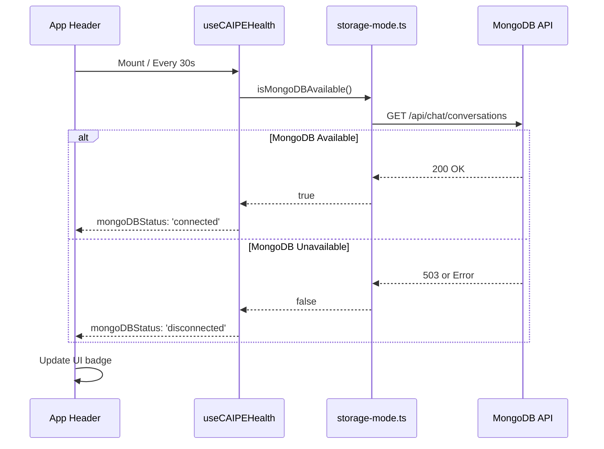

# Architecture: MongoDB Health Status Integration

**Date**: 2026-01-29

## Visual Preview

### Health Button (Header)

**Before**: Only showed CAIPE supervisor status
```
┌──────────────────┐
│ • Connected      │
└──────────────────┘
```

**After**: Same button, but click reveals MongoDB status in popover

### Health Popover (Expanded)

**With MongoDB Connected**:
```
┌────────────────────────────────────┐
│ CAIPE Supervisor                   │
│ http://localhost:8000              │
├────────────────────────────────────┤
│                                    │
│ 🤖 Platform Engineer               │
│    AI-powered platform engineering │
│                                    │
├────────────────────────────────────┤
│ STORAGE BACKEND          • MongoDB │ ← NEW!
│ ✓ Persistent storage with          │
│   cross-device sync                │
├────────────────────────────────────┤
│ CONNECTED INTEGRATIONS        12   │
│ • GitHub  • Jira  • ArgoCD ...     │
├────────────────────────────────────┤
│ • Health check active  Next in 25s │
└────────────────────────────────────┘
```

**With MongoDB Disconnected**:
```
┌────────────────────────────────────┐
│ CAIPE Supervisor                   │
│ http://localhost:8000              │
├────────────────────────────────────┤
│                                    │
│ 🤖 Platform Engineer               │
│    AI-powered platform engineering │
│                                    │
├────────────────────────────────────┤
│ STORAGE BACKEND   • localStorage   │ ← Shows local mode
│ Local browser storage (no sync)    │
├────────────────────────────────────┤
│ CONNECTED INTEGRATIONS        12   │
│ • GitHub  • Jira  • ArgoCD ...     │
├────────────────────────────────────┤
│ • Health check active  Next in 25s │
└────────────────────────────────────┘
```


## Status Indicators

| MongoDB Status | Badge Color | Badge Icon | Description |
|----------------|-------------|------------|-------------|
| **Connected** | Green | • (green dot) | MongoDB is available and working |
| **Disconnected** | Amber | • (amber dot) | MongoDB unavailable, using localStorage |
| **Checking** | Gray | ⟳ (spinner) | Currently checking MongoDB status |


## How It Works




## Configuration

No additional configuration needed! The MongoDB status check:
- Uses the existing storage mode detection
- Shares the same 30-second poll interval
- Works automatically with hybrid storage system


## Performance Impact

**Minimal**: 
- Health check already runs every 30s
- MongoDB check reuses existing `storage-mode.ts` infrastructure
- No additional API calls (uses cached result from storage mode)
- Adds ~1ms to existing health check


## Technical Details

### Hook Changes
```typescript
// Added to useCAIPEHealth return value:
{
  mongoDBStatus: 'connected' | 'disconnected' | 'checking',
  storageMode: 'mongodb' | 'localStorage' | null
}
```

### Component Changes
```typescript
// AppHeader now destructures additional fields:
const { 
  status, 
  url, 
  // ... existing fields ...
  mongoDBStatus,      // NEW
  storageMode         // NEW
} = useCAIPEHealth();
```


## Future Enhancements

Potential improvements:
1. **Last Sync Time**: Show when last MongoDB sync occurred
2. **Manual Refresh**: Button to force check MongoDB status immediately
3. **Sync Queue**: Show pending operations waiting for MongoDB
4. **Historical Uptime**: Track MongoDB availability over time
5. **Notification**: Alert when MongoDB goes offline/online


## Related

- Spec: [spec.md](./spec.md)
