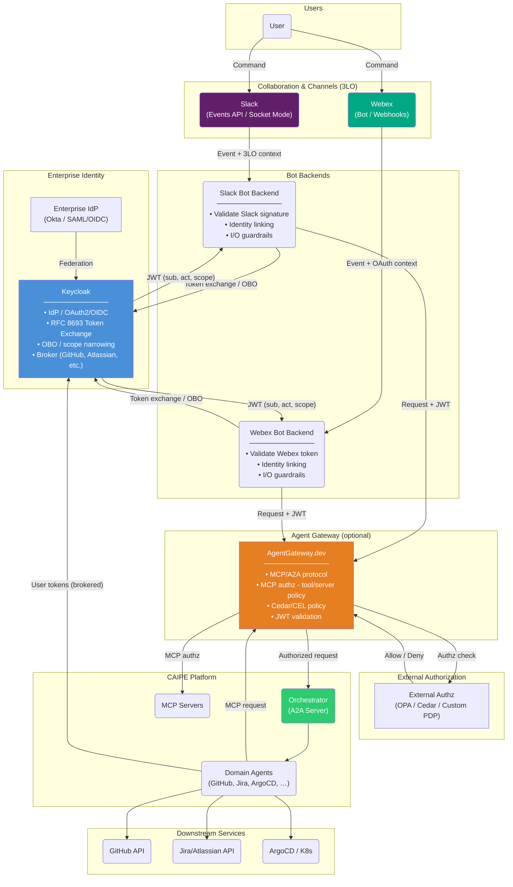

# Unified Architecture: Policy Engines and Enterprise Authorization for Agentic AI

**Single source of truth** for the architecture that covers policy engine comparison, enterprise identity federation, OBO/token exchange, Slack and Webex bot entry points, AgentGateway (optional), external authorization, and CAIPE agents/MCP. All research and deliverables in this spec align to this diagram and narrative.

**Spec**: 093 — Policy Engines and Enterprise Authorization Architecture for Agentic AI (`093-agent-enterprise-identity`)  
**Date**: March 2026

---

## Canonical Architecture Diagram

The following diagram is the **single source of architecture truth** for this capability. It shows user entry via **Slack** or **Webex**, identity and token flow through **Keycloak** (with optional enterprise IdP federation), optional **AgentGateway** and **External Authorization** layer, and the **CAIPE** agent platform.

---

## Flow Summary

| Step | Description |
|------|-------------|
| 1 | **User** sends a command in **Slack** or **Webex**. |
| 2 | **Slack** or **Webex** delivers the event to the respective **bot backend** (3LO / OAuth context). |
| 3 | **Bot backend** (Slack or Webex) uses **Keycloak** for token exchange or OBO: resolves channel user to enterprise identity, obtains JWT (`sub`, `act`, `scope`, `roles`). Applies **I/O guardrails** (input/output compliance). |
| 4 | **Keycloak** may federate with an **Enterprise IdP** (e.g. Okta); stores brokered tokens (GitHub, Atlassian) for user impersonation. |
| 5 | Bot backend sends **request + JWT** to **AgentGateway** (or directly to Orchestrator if AgentGateway is not deployed). |
| 6 | **AgentGateway** validates JWT, may call **External Authz** (OPA/Cedar/custom), enforces Cedar/CEL policy, then forwards to **Orchestrator**. |
| 7 | **Orchestrator** routes to **domain agents**; agents obtain user-scoped tokens from Keycloak and call **downstream services** (GitHub, Jira, ArgoCD). **MCP server** access is via **AgentGateway**: agents send MCP requests to the gateway, which applies **MCP authz** (tool/server policy, e.g. Cedar/CEL) and forwards authorized calls to MCP servers. |

---

## Entry Points: Slack and Webex

Both Slack and Webex are first-class entry points into the same architecture:

- **Slack**: Events API / Socket Mode; Slack signing secret; 3LO for app installation; identity linking via Keycloak broker (e.g. Slack user ID ↔ Keycloak `sub`). See [research-slack-bot-authorization.md](./research-slack-bot-authorization.md), [research-slack-io-guardrails.md](./research-slack-io-guardrails.md).
- **Webex**: Webhooks or Webex SDK; OAuth for bot; identity linking via Keycloak (Webex user ↔ Keycloak `sub`). Same token-exchange and OBO pattern as Slack; bot backend validates Webex token and performs Keycloak token exchange to obtain the platform JWT.

The **canonical diagram above** shows both bots converging on Keycloak and then AgentGateway/Orchestrator so that one architecture document describes the full capability.

---

## Optional vs Required Components

| Component | Role | Required? |
|-----------|------|-----------|
| **Slack / Webex** | User-facing entry (at least one) | At least one channel |
| **Slack Bot / Webex Bot Backend** | Event handling, identity resolution, guardrails, token exchange | Yes |
| **Keycloak** | Identity broker, token exchange, OBO, brokered tokens | Yes |
| **Enterprise IdP** | SSO (e.g. Okta); federated via Keycloak | Optional |
| **AgentGateway** | MCP/A2A gateway, policy (Cedar/CEL), JWT validation | Optional (can call Orchestrator directly) |
| **External Authz** | Centralized policy (OPA, Cedar, custom) | Optional |
| **Orchestrator + Agents + MCP** | CAIPE agent platform | Yes |

---

## Future evolution: dynamic agents and AgentGateway

In a future phase, **dynamic agents** may expose their own access points via **AgentGateway**. The gateway would remain the single policy and routing layer, but instead of only “bots → Supervisor → domain agents,” new agents could register or be discovered and be reached directly through AgentGateway (each with its own route or endpoint). That keeps one authz/policy boundary for all agent access—whether today’s Slack/Webex → Supervisor flow or future third‑party or dynamically registered agents. This doc’s diagram and flow stay valid; AgentGateway is already the natural place to add those access points when needed.

---

## Related Documents

- [spec.md](./spec.md) — Feature specification and requirements.
- [README.md](./README.md) — Research index.
- [research-agentgateway-keycloak-slack-external-authz.md](./research-agentgateway-keycloak-slack-external-authz.md) — Detailed flows (Slack; Webex follows same pattern).
- [research-enterprise-identity-federation.md](./research-enterprise-identity-federation.md) — Keycloak, OBO, connector management.
- [research-slack-bot-authorization.md](./research-slack-bot-authorization.md) — Slack scope validation and pre-authorization.
- [research-slack-io-guardrails.md](./research-slack-io-guardrails.md) — Input/output guardrails (concept applies to Webex similarly).
