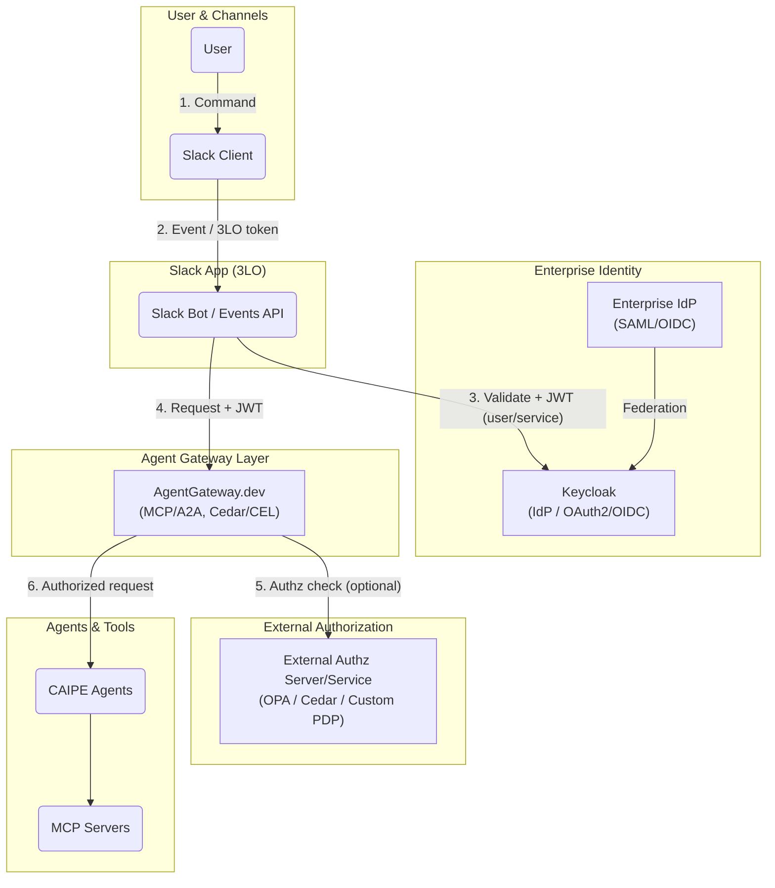
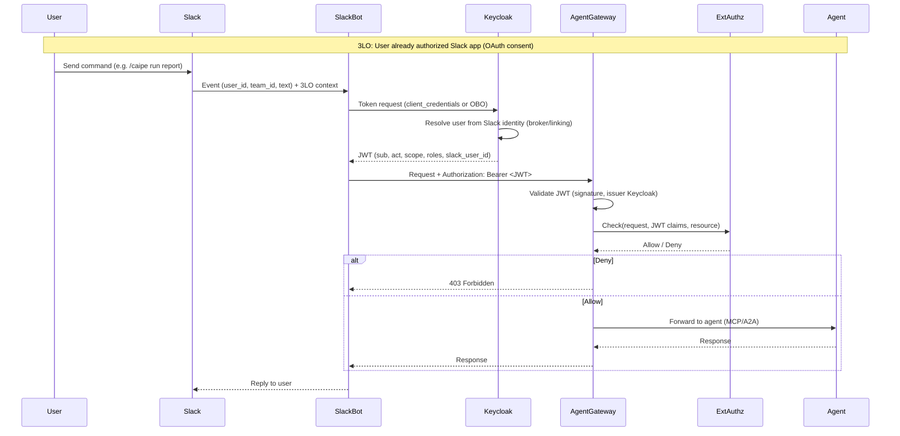
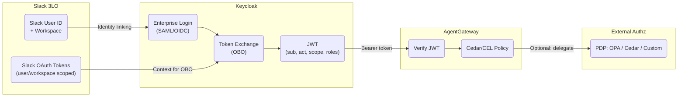
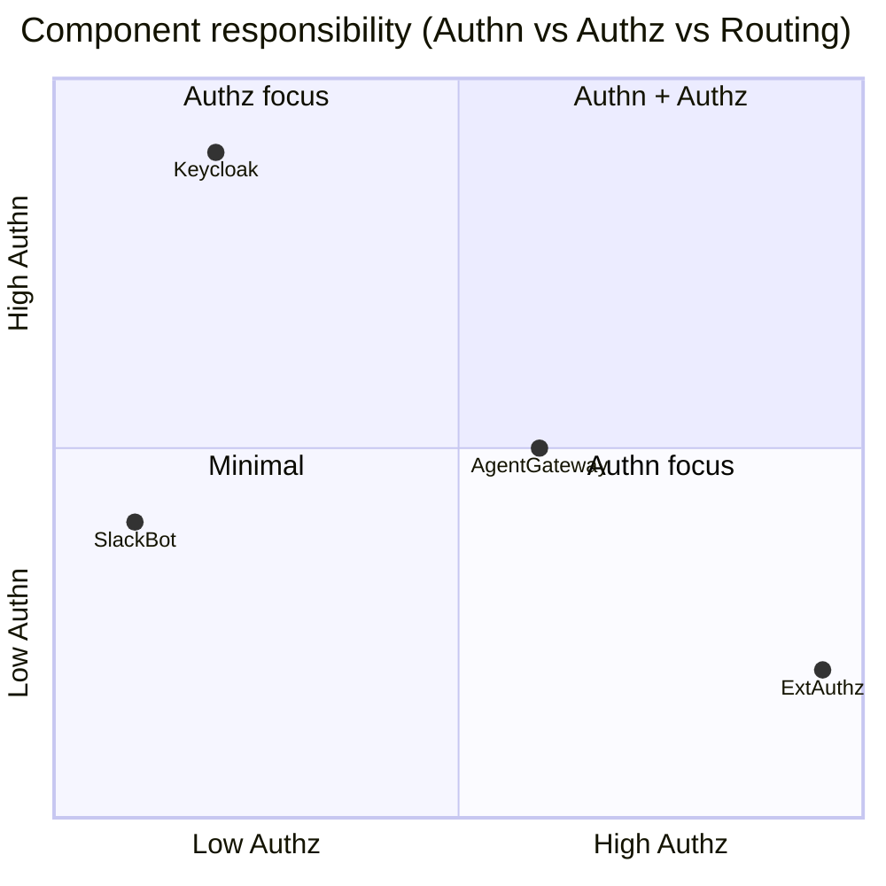
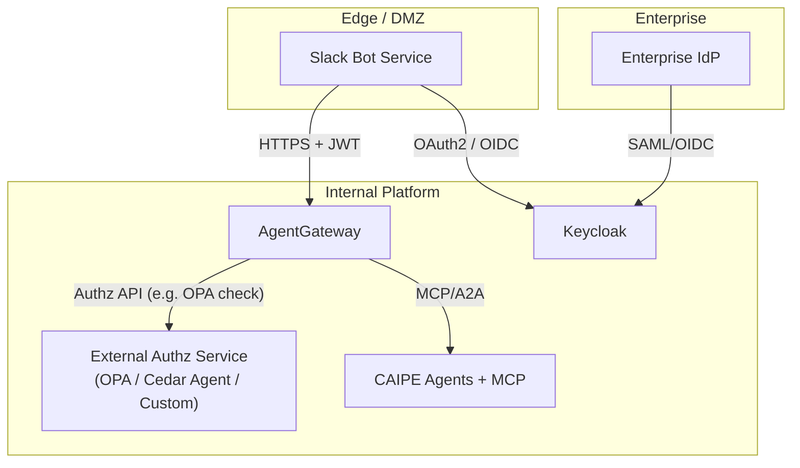
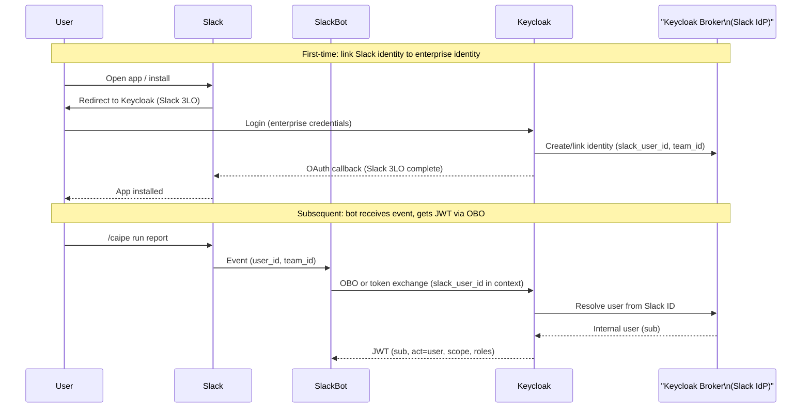
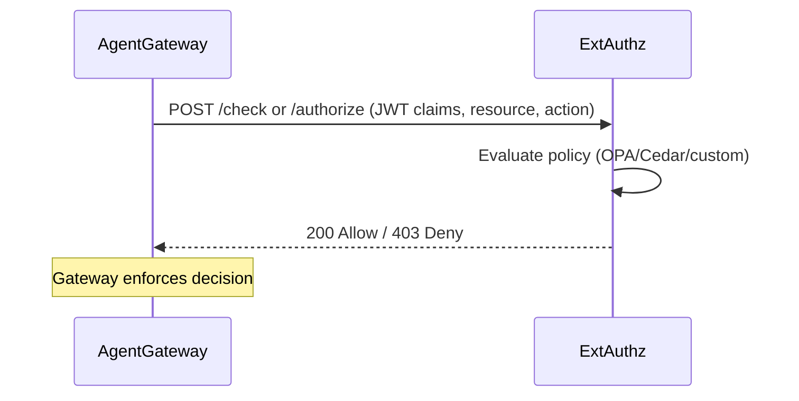
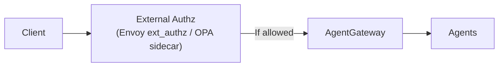
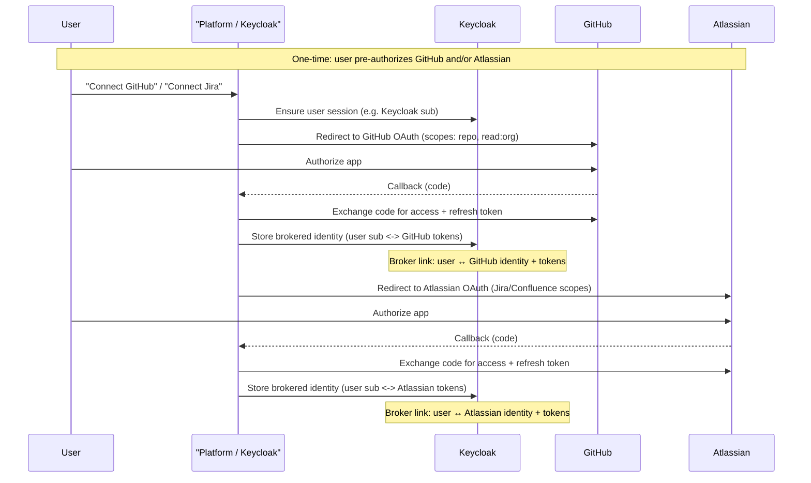
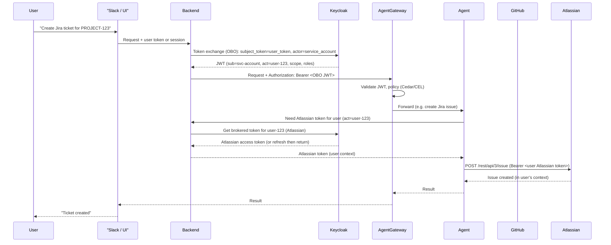

# Research: AgentGateway + Keycloak + Enterprise Auth + 3LO + Slackbot + External Authorization Service

**Focus**: How AgentGateway.dev, Keycloak, enterprise authentication, third-party OAuth (3LO), a Slack bot, and an external authorization server/service can work together for agentic AI workflows.  
**Date**: March 2026  
**Context**: Spec 093 (`093-agent-enterprise-identity`); multi-agent platform with Slack/Webex bot delegation and enterprise identity federation.

---

## Executive Summary

This research describes an integrated architecture where:

1. **AgentGateway** (agentgateway.dev) is the agent-facing gateway: MCP/A2A protocol termination, policy enforcement (Cedar/CEL), and routing to upstream agents/tools.
2. **Keycloak** (or an enterprise IdP behind it) provides **enterprise auth**: user and service-account identity, OAuth 2.0 / OIDC, and optional OBO (on-behalf-of) token exchange.
3. **3LO (three-legged OAuth)** is used when a **Slack bot** needs to act on behalf of a user: the user authorizes the Slack app (OAuth consent), and the bot receives tokens scoped to that user’s Slack context.
4. **Slackbot** is the entry point: users send commands in Slack; the bot authenticates the request (Slack signing + optional Keycloak-backed user mapping) and forwards authorized requests to AgentGateway.
5. **External Authorization Server/Service** is an optional dedicated authz component (e.g. OPA, Cedar Agent, or custom PDP) that AgentGateway or the platform calls for coarse-grained or fine-grained authorization decisions, keeping policy logic out of the gateway when needed.

The diagrams below show how these pieces connect and how tokens and authz flow end-to-end.

---

## 1. High-Level Architecture

**Flow in words:**

- User sends a command in Slack.
- Slack delivers the event to the Slack bot; the bot may have a 3LO token (user OAuth) for that workspace/user.
- The bot (or a backend it calls) uses **Keycloak** to issue or validate a JWT for the request (e.g. service account + OBO for the user, or user identity from enterprise auth).
- The bot sends the request and JWT to **AgentGateway**.
- AgentGateway may call an **External Authorization Server/Service** (e.g. OPA, Cedar) for allow/deny before or in addition to its built-in Cedar/CEL policies.
- AgentGateway routes authorized traffic to **CAIPE agents** and **MCP servers**.

---

## 2. End-to-End Sequence: Slack Command → AgentGateway → External Authz

This sequence shows 3LO, Keycloak, AgentGateway, and optional external authz in one flow.

- **3LO** is implicit in “User already authorized Slack app”: Slack has already performed the OAuth consent; the bot receives events and can use Slack API with user/workspace context.
- **Keycloak** issues the JWT used by the platform (user or OBO); Slack user can be linked to Keycloak (broker or identity linking).
- **AgentGateway** validates the JWT and may call **ExtAuthz** for additional policy (e.g. role-based, resource-based).
- **External Authz** returns Allow/Deny; AgentGateway enforces it before calling the agent.

---

## 3. Token and Identity Flow (Keycloak + 3LO + OBO)

- **Slack 3LO**: User authorizes the Slack app; bot has Slack user/workspace identity and tokens.
- **Keycloak**: Enterprise login (or federation from another IdP) establishes the user; **OBO** (token exchange) can produce a JWT where a service account acts on behalf of that user (`sub` = service account, `act` = user).
- **AgentGateway**: Verifies the JWT and applies built-in policy; can optionally delegate to an **External Authz** PDP for more complex or centralized rules.

---

## 4. Component Responsibilities

| Component | Primary role | Notes |
|-----------|--------------|--------|
| **Keycloak** | Authentication (Authn), token issuance | Enterprise login, OBO, JWT with claims; can federate from enterprise IdP. |
| **Slack (3LO)** | Channel authn & user context | User consented Slack app; bot gets user/team identity. |
| **SlackBot** | Request handling, token acquisition | Maps Slack identity to Keycloak (link/broker), gets JWT, calls AgentGateway. |
| **AgentGateway** | Authz at gateway + routing | Validates JWT, applies Cedar/CEL, optional call to External Authz, routes to agents/MCP. |
| **External Authz** | Authorization (Authz) only | Centralized or complex policy (OPA, Cedar, custom); called by gateway or platform. |

---

## 5. Deployment View: Where External Authz Sits

- **Slack Bot** runs in a DMZ or edge; it talks to **Keycloak** (and optionally **Enterprise IdP**) and to **AgentGateway** with a valid JWT.
- **AgentGateway** and **External Authz Service** are internal; the gateway calls the authz service over an internal API (e.g. OPA’s HTTP API, or a custom PDP).
- **Keycloak** can federate with an **Enterprise IdP** (SAML/OIDC) for enterprise auth.

---

## 6. Slack 3LO and Keycloak Linking (Detail)

- **3LO** completes in Slack’s OAuth flow; Keycloak can act as the OAuth client for “Login with Slack” or as the IdP that links Slack identities to enterprise accounts via a **Keycloak broker** (Slack as identity provider).
- After linking, **SlackBot** uses **Keycloak** (e.g. OBO or token exchange) to get a JWT for the request, with the Slack user mapped to an enterprise identity.

---

## 7. External Authorization Server: Two Integration Patterns

AgentGateway may integrate with an external authorization server in two main ways (depending on product support and design).

**Pattern A: AgentGateway calls External Authz (gateway as PEP)**

**Pattern B: Sidecar or proxy in front of AgentGateway**

- **Pattern A**: AgentGateway is the PEP (Policy Enforcement Point) and calls the External Authz service (PDP) over HTTP/gRPC.
- **Pattern B**: A proxy/sidecar (e.g. Envoy `ext_authz`, OPA sidecar) performs the authz check before forwarding to AgentGateway; AgentGateway may still apply its own Cedar/CEL for tool-level policy.

---

## 8. Summary Table: How the Pieces Work Together

| Concern | Component | Role |
|--------|-----------|------|
| **Enterprise login** | Keycloak + Enterprise IdP | User and service-account authentication; SAML/OIDC federation. |
| **Slack user context** | Slack 3LO | User authorizes Slack app; bot gets user/workspace identity. |
| **Identity linking** | Keycloak (broker) | Map Slack user/team to Keycloak user for JWT issuance. |
| **Token for platform** | Keycloak (OBO / token exchange) | JWT with `sub`, `act`, `scope`, `roles` for AgentGateway. |
| **Gateway authz + routing** | AgentGateway | JWT validation, Cedar/CEL policy, optional External Authz call, MCP/A2A routing. |
| **Centralized / complex policy** | External Authz Server | OPA, Cedar Agent, or custom PDP; called by gateway or proxy. |

---

## 9. Scenario: Identity Brokering and OBO/Token Exchange with GitHub or Atlassian Pre-Authorization

When users **pre-authorize** the platform to access their **GitHub** or **Atlassian** (Jira, Confluence) accounts, Keycloak can act as an **identity broker** that links the user’s enterprise identity to those third-party identities and stores (or obtains on demand) OAuth tokens. Later, when an agent runs **on behalf of** that user, **OBO (on-behalf-of) / token exchange** yields a platform JWT, and the backend uses the **brokered** GitHub or Atlassian tokens so that API calls (e.g. create Jira issue, list GitHub repos) are performed in the **user’s** context, not the service account’s.

### 9.1 Pre-authorization (one-time): User links GitHub / Atlassian

The user has already logged in to the platform (e.g. via Keycloak or Slack-linked identity). To enable agent actions on their behalf against GitHub or Atlassian:

1. **GitHub**: User is sent to GitHub OAuth (Keycloak client or app’s OAuth client). User authorizes the requested scopes (e.g. `repo`, `read:org`). GitHub redirects back with an authorization code; Keycloak (or the platform) exchanges it for access/refresh tokens and **stores them linked to the user’s Keycloak identity** (e.g. in Keycloak’s broker token storage or a separate token store keyed by user id).
2. **Atlassian (Jira/Confluence)**: Same pattern. User is sent to Atlassian OAuth (or OIDC); user authorizes the app. Callback returns tokens; Keycloak (or platform) stores them linked to the user.

Keycloak can implement this via **Identity Brokering** (GitHub or Atlassian as a “social” or “federated” identity provider) so that the external provider’s tokens are stored and refreshed by Keycloak. Alternatively, the application can perform the OAuth flow and store tokens in a backend store keyed by the user’s platform identity (e.g. Keycloak `sub`).

### 9.2 Runtime: OBO + use of brokered tokens for GitHub/Atlassian

When the user triggers an action that requires GitHub or Atlassian (e.g. “Create a Jira ticket” or “List my GitHub repos”):

1. The client (e.g. Slack bot or UI) has a **user context** (e.g. Keycloak user token or session).
2. The backend requests an **OBO token** (or token exchange) from Keycloak: the **principal** is the service account (agent backend), the **actor** is the user. Keycloak returns a JWT with `sub` = service account, `act` = user (and possibly `scope`, `roles`). That JWT is used to call AgentGateway and to prove “this request is on behalf of user X”.
3. For **GitHub or Atlassian API calls**, the backend **does not** use the service account’s credentials. It uses the **brokered tokens** for that user: it looks up the stored GitHub or Atlassian tokens for the user (from Keycloak broker storage or the app’s token store, keyed by the same user id present in the OBO JWT `act` claim). It then calls GitHub or Atlassian APIs with that user’s token so that actions are performed in the **user’s** name (their repos, their Jira projects, etc.).

### 9.3 Identity brokering and OBO: summary

| Step | What happens |
|------|-------------------------------|
| **Pre-auth (GitHub)** | User authorizes platform (or Keycloak client) to access GitHub; tokens stored and linked to user (Keycloak broker or app store). |
| **Pre-auth (Atlassian)** | User authorizes platform to access Jira/Confluence; tokens stored and linked to user. |
| **Runtime (OBO)** | Backend exchanges user token for OBO JWT (principal = service account, actor = user). That JWT is used for AgentGateway and internal authz. |
| **Runtime (brokered tokens)** | When the agent must call GitHub or Atlassian, backend retrieves that user’s brokered tokens (from Keycloak or app store) and passes them to the agent (or agent backend). API calls use the **user’s** tokens so actions are in their context. |

This keeps **agent actions scoped to the user**: the platform JWT identifies “on behalf of whom” (OBO), and the brokered GitHub/Atlassian tokens ensure that third-party API calls are made as that user, not as the service account.

---

## 10. References

- [AgentGateway](https://agentgateway.dev/) — agent gateway with Cedar/CEL, MCP/A2A, JWT/OAuth.
- [Keycloak](https://www.keycloak.org/) — identity and access management, OAuth2/OIDC, token exchange, brokers.
- [Slack OAuth (3LO)](https://api.slack.com/authentication/oauth-v2) — OAuth 2.0 for Slack apps (user/workspace scope).
- [OAuth 2.0 Token Exchange (RFC 8693)](https://datatracker.ietf.org/doc/html/rfc8693) — OBO and token exchange.
- [Envoy External Authorization](https://www.envoyproxy.io/docs/envoy/latest/configuration/http/http_filters/ext_authz_filter) — pattern for external authz in front of a service.
