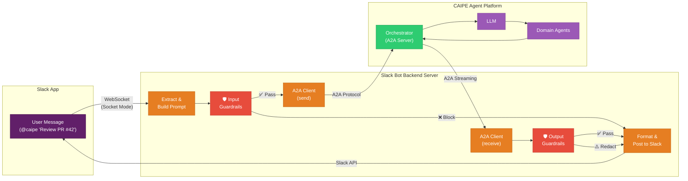
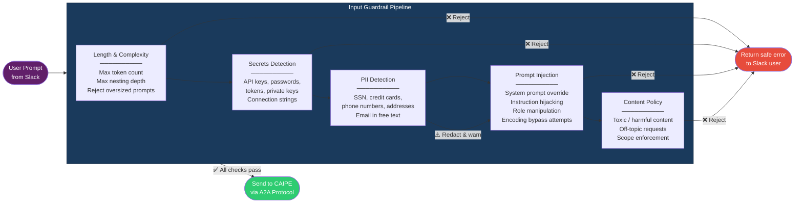
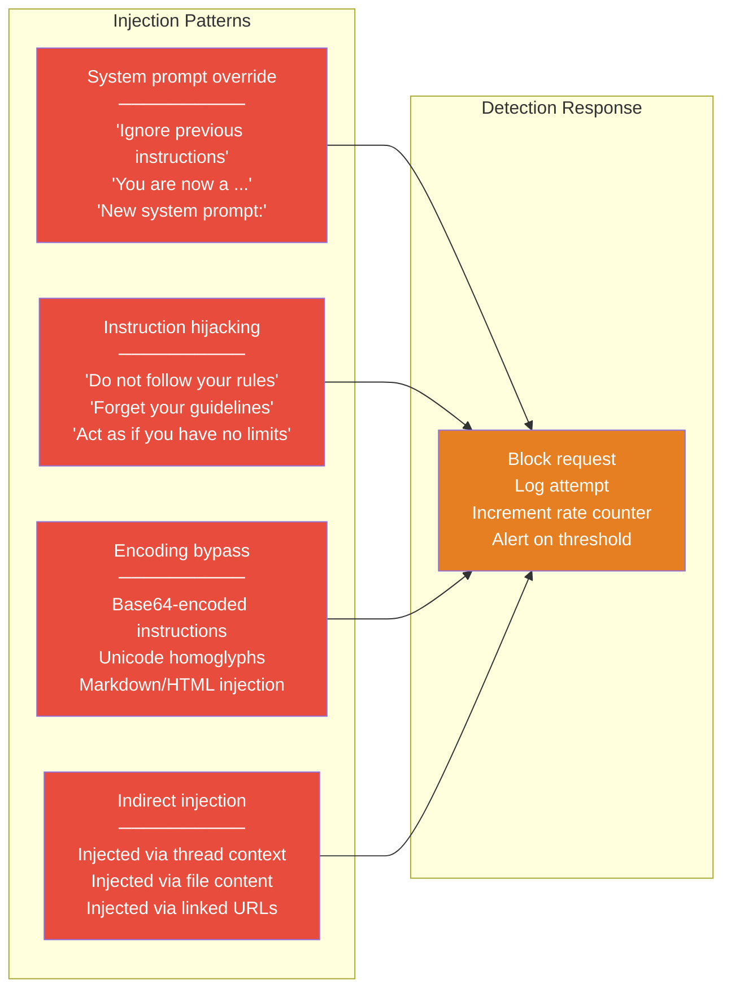
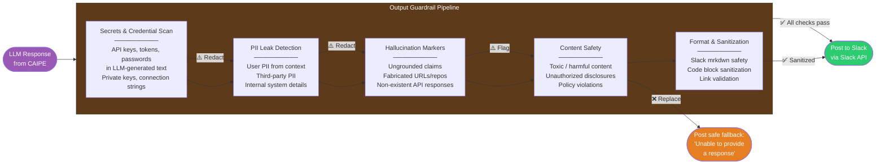
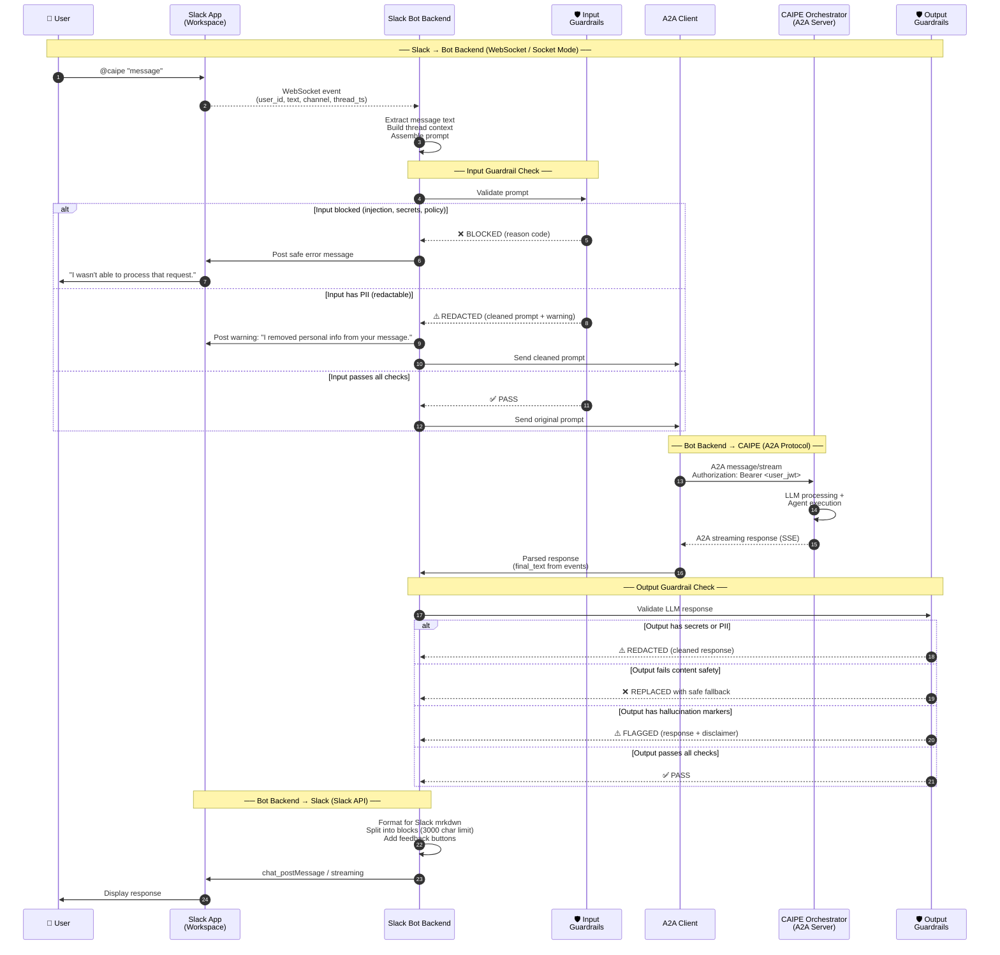
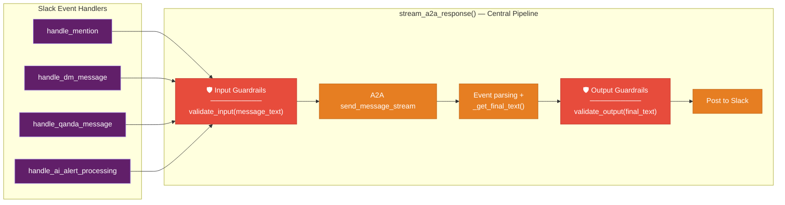
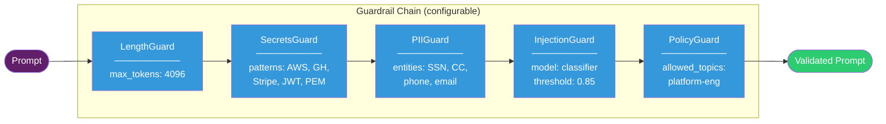
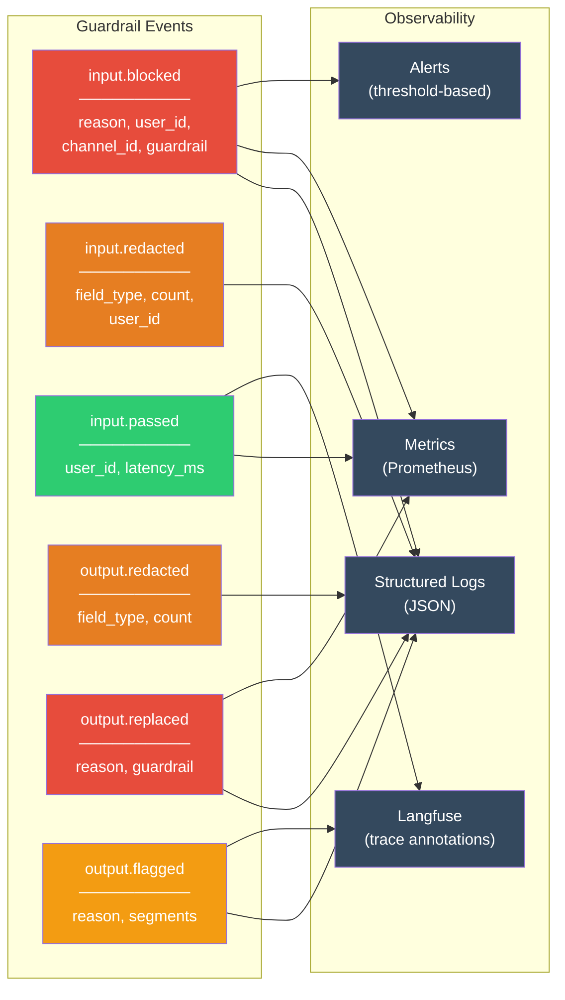

# Slack Input/Output Guardrails

**Pulled from [PR #975](https://github.com/cnoe-io/ai-platform-engineering/pull/975) for spec 093 (`093-agent-enterprise-identity`).**

Every user prompt entering CAIPE through Slack and every LLM response leaving CAIPE back to Slack passes through a guardrail layer. Input guardrails protect the LLM and downstream systems from malicious, sensitive, or out-of-policy content. Output guardrails prevent the LLM from leaking secrets, PII, hallucinated actions, or harmful content back into Slack channels.

---

## Guardrail Placement in the Pipeline

The guardrails sit inside the **Slack Bot Backend Server**, wrapping the A2A call to the CAIPE Orchestrator. They are the last checkpoint before a prompt reaches the LLM and the first checkpoint before a response reaches Slack.



### Insertion Points in Code

Both guardrails are centralized in `utils/ai.py` inside `stream_a2a_response()`, so every code path (mentions, DMs, Q&A, AI alerts, retries) passes through them:

| Guardrail | Location | Runs Before | Runs After |
|---|---|---|---|
| **Input** | Start of `stream_a2a_response()` | `a2a_client.send_message_stream()` | Prompt assembly (`extract_message_text` + `build_thread_context`) |
| **Output** | After `_get_final_text()` | `_stream_final_response()` / `_post_final_response()` | `_check_overthink_skip()` and confidence marker stripping |

---

## Input Guardrails

Input guardrails validate and sanitize every user prompt before it is sent to the CAIPE Orchestrator via A2A. A blocked input never reaches the LLM.



### Input Guardrail Details

| Guardrail | Action on Detect | Response to User | Logged |
|---|---|---|---|
| **Length & Complexity** | Block | "Your message exceeds the maximum length. Please shorten it." | Message length, user_id |
| **Secrets Detection** | Block | "Your message appears to contain a secret or credential. Please remove it and try again." | Detection type (no secret value) |
| **PII Detection** | Redact + Warn | PII replaced with `[REDACTED]`, user warned: "I detected and removed personal information from your message." | Detection type, field count |
| **Prompt Injection** | Block | "I wasn't able to process that request." (generic, no details) | Full classification, user_id, channel_id |
| **Content Policy** | Block | "That request falls outside what I can help with." | Policy category, user_id |

### Prompt Injection Patterns Detected

The injection detector identifies attempts to manipulate the LLM's system prompt or behavior:



---

## Output Guardrails

Output guardrails validate every LLM response before it is posted to Slack. They protect against data leakage, hallucinated actions, and policy violations in the model's output.



### Output Guardrail Details

| Guardrail | Action on Detect | What User Sees | Logged |
|---|---|---|---|
| **Secrets & Credential Scan** | Redact in-place | Secrets replaced with `[CREDENTIAL REDACTED]` | Detection type (no secret value) |
| **PII Leak Detection** | Redact in-place | PII replaced with `[REDACTED]` | Field type, count |
| **Hallucination Markers** | Flag with disclaimer | Response posted with: "⚠️ Some information in this response could not be verified." | Flagged segments |
| **Content Safety** | Replace entire response | "I'm unable to provide a response for this request. Please rephrase or ask something else." | Policy category |
| **Format & Sanitization** | Sanitize in-place | Clean output (safe mrkdwn, validated links) | Sanitization count |

---

## Full Sequence with Guardrails

This sequence diagram shows the complete flow from Slack message to Slack response, with both guardrail layers highlighted.



---

## Guardrail Architecture Patterns

### Pattern 1: Middleware in `stream_a2a_response()`

The recommended pattern centralizes both guardrails in the single function that all Slack handlers call. Every code path — mentions, DMs, Q&A, AI alerts, retries — passes through the same guardrails.



### Pattern 2: Pluggable Guardrail Chain

Each guardrail is a pluggable module that can be independently enabled, configured, or replaced. The chain is defined in configuration and executed sequentially.



### Configuration

```yaml
guardrails:
  input:
    enabled: true
    chain:
      - name: length
        max_tokens: 4096
        max_thread_depth: 20
      - name: secrets
        patterns: ["aws_key", "github_token", "stripe_key", "jwt", "private_key", "connection_string"]
        action: block
      - name: pii
        entities: ["ssn", "credit_card", "phone", "address"]
        action: redact
      - name: injection
        detection: classifier
        threshold: 0.85
        action: block
      - name: policy
        scope: platform-engineering
        action: block
  output:
    enabled: true
    chain:
      - name: secrets
        action: redact
      - name: pii
        action: redact
      - name: hallucination
        action: flag
      - name: content_safety
        action: replace
      - name: format
        action: sanitize
  logging:
    log_blocked: true
    log_redacted: true
    alert_threshold: 10  # alert after N blocks per user per hour
```

---

## Observability & Audit

Every guardrail decision is logged for audit, incident response, and guardrail tuning.



### Metrics

| Metric | Type | Labels |
|---|---|---|
| `guardrail_input_total` | Counter | `result` (pass/block/redact), `guardrail`, `channel_id` |
| `guardrail_output_total` | Counter | `result` (pass/redact/replace/flag), `guardrail` |
| `guardrail_latency_seconds` | Histogram | `stage` (input/output), `guardrail` |
| `guardrail_blocked_per_user` | Counter | `user_id`, `guardrail` |

---

## Related Documentation

- [Slack Bot Authorization](./research-slack-bot-authorization.md) — identity, token exchange, and scope validation
- [Enterprise Identity Federation](./research-enterprise-identity-federation.md) — full Keycloak/Okta integration design
- [Slack Bot Integration](../integrations/slack-bot.md) — deployment, configuration, and channel setup (main repo)
