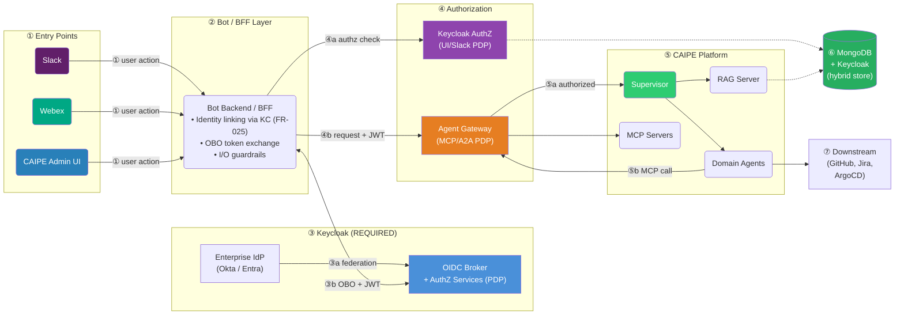
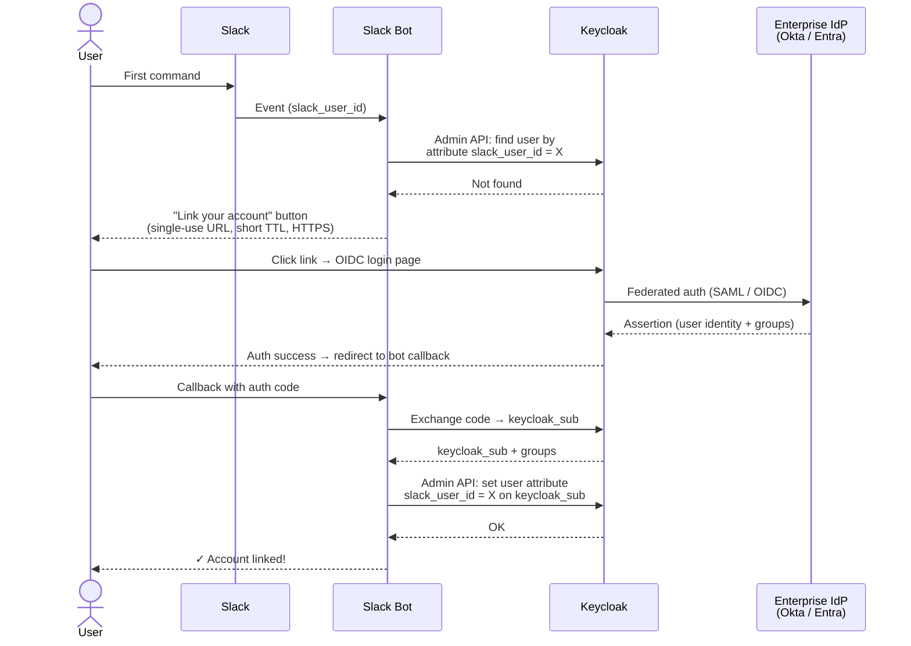
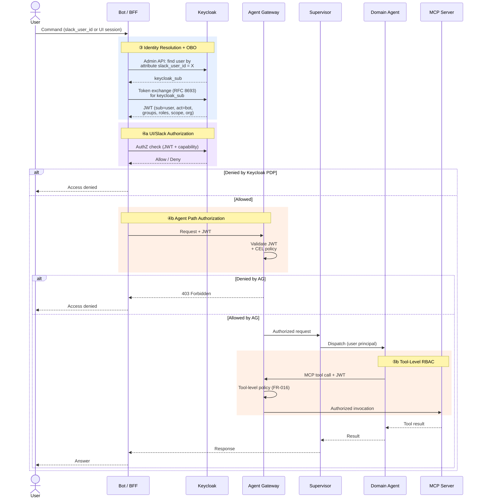
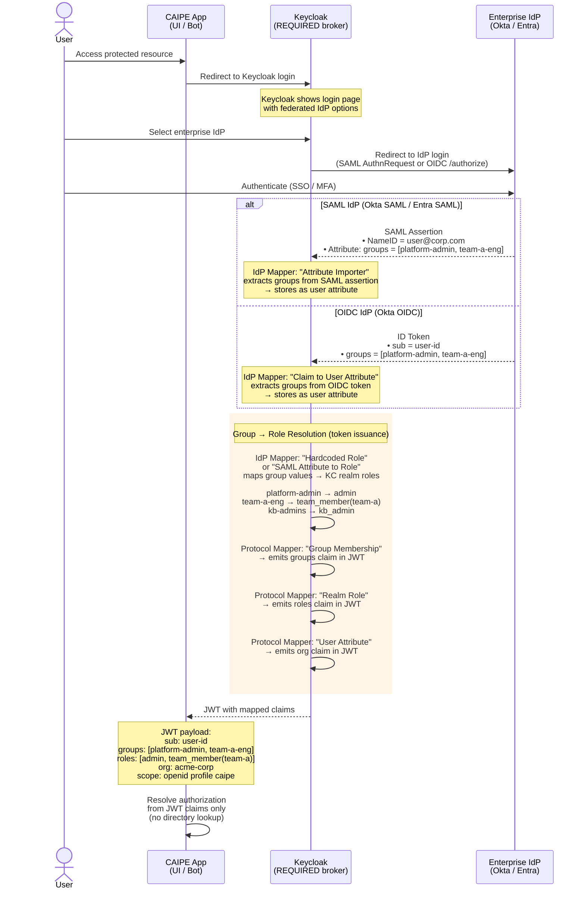
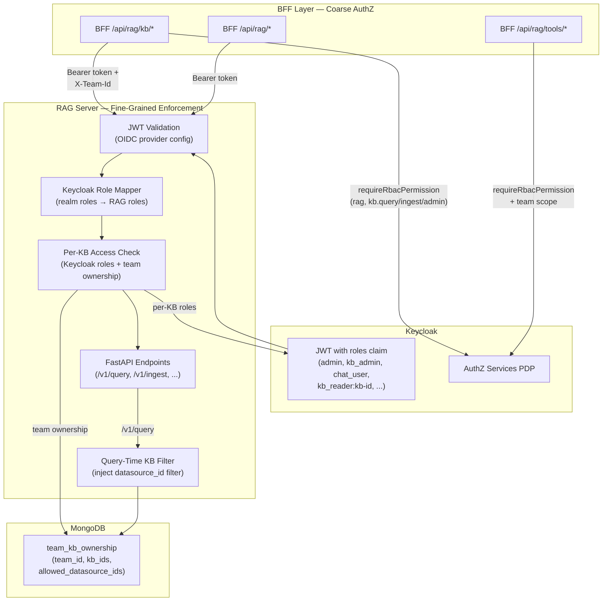
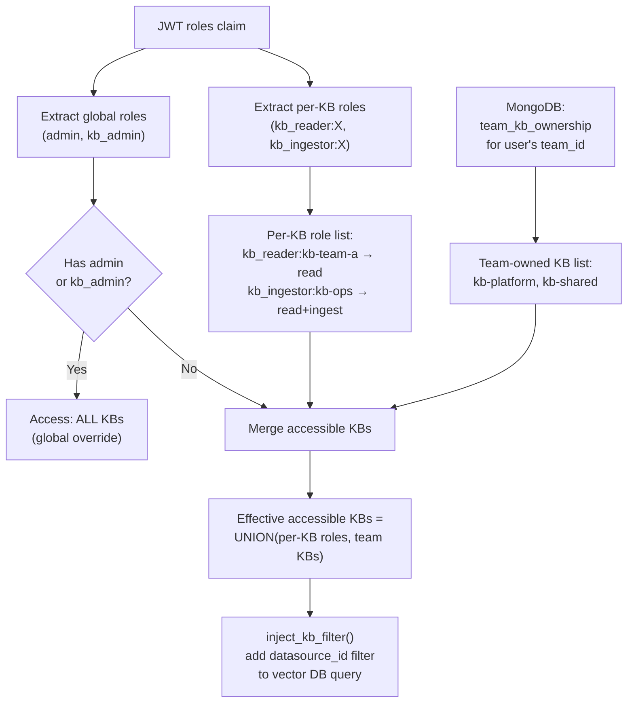

# 098 Architecture: Enterprise RBAC for CAIPE Platform

**Spec**: 098 — Enterprise RBAC for Slack and CAIPE UI (`098-enterprise-rbac-slack-ui`)
**Date**: April 2026
**Supersedes**: [093 architecture](../093-agent-enterprise-identity/architecture.md) (historical reference)

---

## Canonical Architecture Diagram

This is the **single source of architecture truth** for Enterprise RBAC. Numbered arrows correspond to the flow table below the diagram.



### Flow Table

| Step | From | To | Description |
|------|------|----|-------------|
| **①** | User | Slack / Webex / Admin UI | User sends command or performs admin action |
| **②** | Entry point | Bot Backend / BFF | Event delivered with user context (Slack signature, OAuth, NextAuth session) |
| **③a** | Enterprise IdP | Keycloak | Federation: Okta/Entra groups and identity brokered into Keycloak |
| **③b** | Bot/BFF | Keycloak | OBO token exchange (RFC 8693): bot obtains JWT with `sub`=user, `act`=bot, `groups`, `roles`, `scope`, `org` |
| **④a** | Bot/BFF | Keycloak AuthZ (PDP) | UI/Slack authorization: checks JWT + requested capability against 098 matrix → allow/deny |
| **④b** | Bot/BFF | Agent Gateway | MCP/A2A/agent authorization: AG validates JWT, applies CEL policy → allow/deny |
| **⑤a** | Agent Gateway | Supervisor → Agents | Authorized request routed to domain agents |
| **⑤b** | Agents | Agent Gateway → MCP | Agent MCP tool calls re-enter AG for tool-level RBAC (FR-016) |
| **⑥** | PDP / RAG | MongoDB + Keycloak | Hybrid store: Keycloak holds authz policies (resources, scopes, permissions) and Slack identity links (user attributes); MongoDB holds team/KB assignments, ASP policies, app metadata |
| **⑦** | Agents | GitHub / Jira / ArgoCD | Downstream API calls using brokered user tokens |

---

## Authorization Enforcement Points

098 defines **three enforcement zones**, each with its own PDP:

| Zone | Enforcement Point | PDP | Traffic |
|------|-------------------|-----|---------|
| **UI** | Next.js BFF (NextAuth middleware) | **Keycloak Authorization Services** | Admin UI API routes, page access |
| **Slack / Webex** | Bot backend middleware | **Keycloak Authorization Services** | Slack commands, Webex events |
| **MCP / A2A / Agent** | Agent Gateway (required) | AG built-in (CEL policy) | MCP tool calls, A2A tasks, agent dispatch |

All three zones enforce the **same 098 permission matrix** (FR-014). Default deny applies everywhere (FR-002).

---

## Sequence Diagram 1: Slack Identity Linking (FR-025)

One-time flow to establish the `slack_user_id ↔ keycloak_sub` mapping. The mapping is stored as a **Keycloak user attribute** — the bot has **no MongoDB dependency**.



---

## Sequence Diagram 2: Authorized Request Flow

Every subsequent request after identity linking. Shows OBO exchange, PDP check, and agent execution.



---

## IdP Groups → Keycloak Roles Mapping (FR-010)

Enterprise IdP groups (Okta and Microsoft Entra ID / AD-backed groups) are mapped to CAIPE platform roles **at token issuance time** inside Keycloak — **no runtime SCIM sync or directory lookups**. Keycloak acts as a required OIDC broker that federates both IdPs.

### Sequence Diagram 3: IdP Groups → Keycloak Roles (Runtime)

This diagram shows what happens at login time when a user authenticates through a federated IdP. It covers both the SAML path (Okta SAML, Entra SAML) and the OIDC path (Okta OIDC).



### Keycloak Mapper Configuration (One-Time Admin Setup)

Three layers of mappers work together to transform IdP groups into JWT claims:

| Layer | Mapper Type | Keycloak Config | Purpose |
|-------|-------------|-----------------|---------|
| **1. Import** | Identity Provider Mapper | **SAML**: "Attribute Importer" — attribute name `groups` → user attribute `idp_groups` | Extracts groups from IdP assertion/token into Keycloak user profile |
| | | **OIDC**: "Claim to User Attribute" — claim `groups` → user attribute `idp_groups` | |
| **2. Map to Roles** | Identity Provider Mapper | "Hardcoded Role" or "SAML Attribute IdP Role Mapper" — when `groups` contains `platform-admin` → assign KC realm role `admin` | Converts IdP group membership into Keycloak realm roles |
| | | Repeat per group → role mapping | |
| **3. Emit in JWT** | Client Protocol Mapper | "Group Membership" → token claim `groups` | Emits groups in JWT for downstream consumers |
| | | "Realm Role" → token claim `roles` | Emits mapped roles in JWT |
| | | "User Attribute" → token claim `org` | Emits tenant/org context in JWT |

### IdP-Specific Federation Setup

| IdP | Protocol | Group Source | Keycloak Broker Config |
|-----|----------|--------------|------------------------|
| **Okta** (SAML) | SAML 2.0 | SAML Assertion → Attribute Statement `groups` | Identity Provider → SAML → Import SAML attributes |
| **Okta** (OIDC) | OIDC | ID Token → `groups` claim (requires Okta "Groups claim" config in the Okta app) | Identity Provider → OIDC → Import OIDC claims |
| **Microsoft Entra ID** (SAML) | SAML 2.0 | SAML Assertion → `http://schemas.microsoft.com/ws/2008/06/identity/claims/groups` (GUIDs) or custom `groups` attribute | Identity Provider → SAML → Attribute Importer (map GUIDs or group names) |
| **Microsoft Entra ID** (OIDC) | OIDC | ID Token → `groups` claim (requires Entra "Group claims" config in App Registration → Token configuration) | Identity Provider → OIDC → Claim to User Attribute |

> **Entra ID note**: By default Entra sends group **Object IDs** (GUIDs) in SAML/OIDC. To get human-readable names, configure "Emit groups as role claims" or use the `cloud_displayName` source attribute in the enterprise app's SAML claims configuration.

### Group → Role Mapping Table

| IdP Group | Keycloak Realm Role | Capabilities (098 matrix examples) |
|-----------|---------------------|-------------------------------------|
| `platform-admin` | `admin` | All protected capabilities |
| `team-a-eng` | `team_member(team-a)` | Chat, invoke team-a tools, query team-a KBs |
| `kb-admins` | `kb_admin` | Create/update/delete KBs, manage ingest |
| `team-b-ops` | `team_member(team-b)` | Chat, invoke team-b tools, query team-b KBs |
| *(no group)* | *(no role)* | Default deny — no platform access (FR-002) |

### Resulting JWT Claims (Example)

```json
{
  "sub": "a1b2c3d4-...",
  "iss": "https://keycloak.caipe.example.com/realms/caipe",
  "aud": "caipe-platform",
  "groups": ["platform-admin", "team-a-eng"],
  "roles": ["admin", "team_member(team-a)"],
  "org": "acme-corp",
  "scope": "openid profile caipe",
  "exp": 1743900000
}
```

The **CAIPE platform**, **Agent Gateway**, and **Keycloak PDP** all consume these JWT claims directly — no callback to the IdP or Keycloak at authorization time.

---

## Multi-Tenant Isolation (FR-020)

```
┌─────────────────────────────────┐
│          Tenant Boundary        │
│  ┌───────────┐  ┌───────────┐  │
│  │  Org A    │  │  Org B    │  │
│  │           │  │           │  │
│  │ Users A   │  │ Users B   │  │
│  │ Agents A  │  │ Agents B  │  │
│  │ Tools A   │  │ Tools B   │  │
│  │ KBs A     │  │ KBs B     │  │
│  │           │  │           │  │
│  │ JWT.org=A │  │ JWT.org=B │  │
│  └───────────┘  └───────────┘  │
│                                 │
│  PDP + AG enforce: principal    │
│  in org A CANNOT access org B   │
│  resources (FR-020)             │
└─────────────────────────────────┘
```

---

## Slack Identity Linking (FR-025)

The identity linking flow establishes the `slack_user_id ↔ keycloak_sub` mapping required before any OBO exchange. The mapping is stored as a **custom Keycloak user attribute** — the Slack bot has **no MongoDB dependency**.

### Storage mechanism

| Aspect | Detail |
|--------|--------|
| **Where** | Keycloak user profile — custom attribute `slack_user_id` |
| **Write (linking)** | Bot calls **Keycloak Admin API** to set `slack_user_id` on the authenticated user |
| **Read (lookup)** | Bot calls **Keycloak Admin API** to find user by attribute `slack_user_id = X` → returns `keycloak_sub` |
| **Bot dependencies** | Keycloak only (Admin API + OIDC); **no MongoDB** on the Slack path |

### Flow

```
┌──────────┐    ┌──────────────┐    ┌──────────────┐    ┌──────────────┐
│  Slack   │    │  Slack Bot   │    │   Keycloak   │    │  Enterprise  │
│  User    │    │  Backend     │    │   (broker)   │    │  IdP (Okta)  │
└────┬─────┘    └──────┬───────┘    └──────┬───────┘    └──────┬───────┘
     │  1. First       │                    │                   │
     │  command ──────▶│                    │                   │
     │                 │ 2. Admin API:      │                   │
     │                 │ find user by       │                   │
     │                 │ slack_user_id=X ──▶│                   │
     │                 │◀── Not found ──────│                   │
     │                 │                    │                   │
     │◀─── 3. "Link ──│                    │                   │
     │    account" URL │                    │                   │
     │  (single-use,   │                    │                   │
     │   time-bounded) │                    │                   │
     │                 │                    │                   │
     │── 4. Click ────────────────────────▶│                   │
     │    URL          │                    │── 5. Federate ──▶│
     │                 │                    │◀── 6. SAML ──────│
     │◀──── 7. Auth ───────────────────────│                   │
     │    success      │                    │                   │
     │                 │◀── 8. Callback ────│                   │
     │                 │    (keycloak_sub)  │                   │
     │                 │                    │                   │
     │                 │ 9. Admin API: set  │                   │
     │                 │ slack_user_id=X on │                   │
     │                 │ keycloak_sub ─────▶│                   │
     │                 │◀── OK ─────────────│                   │
     │◀─ 10. "Linked!" │                    │                   │
     │                 │                    │                   │
     │  11. Subsequent │                    │                   │
     │  commands ─────▶│ 12. Admin API:     │                   │
     │                 │ find slack_user_id │                   │
     │                 │ → keycloak_sub ───▶│                   │
     │                 │◀── keycloak_sub ───│                   │
     │                 │ 13. OBO exchange   │                   │
     │                 │ (RFC 8693) ───────▶│                   │
     │                 │◀── JWT ────────────│                   │
```

**Security constraints**: Linking URL is **single-use**, **time-bounded** (short TTL), **HTTPS-only**. Unlinked users are **denied** all RBAC-protected operations.

---

## RBAC Configuration Store (FR-023)

```
┌───────────────────────────────────────────────────────┐
│                   CAIPE Admin UI (FR-024)              │
│         Administrators manage RBAC here                │
│                                                       │
│  ┌─────────────────────────────────────────────────┐  │
│  │  Roles & Access Tab (US6)                       │  │
│  │  • Create/delete custom realm roles             │  │
│  │  • Map IdP groups → realm roles                 │  │
│  │  • Assign roles to teams                        │  │
│  └─────────────────────────────────────────────────┘  │
└──────────┬──────────────────────────┬─────────────────┘
           │                          │
           ▼                          ▼
┌──────────────────────┐    ┌──────────────────────┐
│     Keycloak         │    │      MongoDB         │
│  (Admin REST API)    │    │                      │
│                      │    │                      │
│  • Resources         │    │  • Team/KB ownership │
│    (components)      │    │    assignments       │
│  • Scopes            │    │  • Custom RAG tool   │
│    (capabilities)    │    │    bindings           │
│  • Policies          │    │  • App metadata      │
│    (role-based)      │    │  • ASP tool policies │
│  • Realm Roles       │    │  • Team keycloak_    │
│    (CRUD via UI)     │    │    roles assignments │
│  • IdP Mappers       │    │                      │
│    (group→role, UI)  │    │                      │
│  • Permissions       │    │                      │
│  • User attributes   │    │                      │
│    (slack_user_id)   │    │                      │
│    (FR-025)          │    │                      │
│                      │    │                      │
│  PDP for UI/Slack    │    │  Operational state   │
└──────────────────────┘    └──────────────────────┘
```

### Admin UI → Keycloak Admin API Flow (FR-024, US6)

```
┌──────────────────┐   ┌──────────────────┐   ┌──────────────────┐
│  Admin UI        │   │  BFF API Routes  │   │  Keycloak Admin  │
│  RolesAccessTab  │──▶│  /api/admin/     │──▶│  REST API        │
│                  │   │  roles,           │   │                  │
│  CreateRole      │   │  role-mappings,   │   │  client_creds    │
│  Dialog          │   │  teams/:id/roles │   │  grant auth      │
│                  │   │                  │   │                  │
│  GroupMapping    │   │  requireAdmin()  │   │  realm-management│
│  Dialog          │   │  session check   │   │  service account │
└──────────────────┘   └──────────────────┘   └──────────────────┘
```

---

## OBO Delegation Chain (FR-018, FR-019)

The multi-hop delegation chain ensures the **originating user** is always the effective principal:

```
User ──▶ Slack Bot ──▶ Supervisor ──▶ Agent ──▶ MCP Tool
  │         │              │            │           │
  │    OBO exchange    Forwards     Forwards    AG checks
  │    (RFC 8693)      user JWT     user JWT    JWT.sub=user
  │         │              │            │           │
  └─── sub=user ──────────────────────────────────────┘
        act=bot
        scope=user's entitlements (not bot's)
        groups=[user's groups]
        org=user's org

  Effective permissions = intersection of:
    • User's entitlements (098 matrix)
    • Bot service account's scope ceiling
    • Component's matrix row (FR-008)
```

---

## PDP Architecture (FR-022)

**Keycloak is required** (Session 2026-04-03). Enterprise IdPs (Okta, Entra, SAML) federate into Keycloak via identity brokering.

| Path | PDP | How |
|------|-----|-----|
| **UI / Slack / Webex** | **Keycloak Authorization Services** | UMA / resource-based permissions; 098 matrix modeled as KC resources, scopes, policies |
| **MCP / A2A / Agent** | **Agent Gateway** | CEL policy; JWT issued by Keycloak |

Keycloak Authorization Services:
- Consume JWT `groups`, `roles`, `scope`, `org` claims (FR-010)
- 098 permission matrix modeled as Keycloak **resources** (components), **scopes** (capabilities), and **policies** (role-based)
- Return allow/deny with audit-grade detail (FR-005)
- Target sub-5ms decision latency
- Admin manages policies via Keycloak Admin Console or CAIPE Admin UI (which calls Keycloak Admin API)

---

## Map RAG RBAC to Keycloak + Per-KB Access Control Architecture Overview

The RAG server is integrated into the Keycloak RBAC system with **defense-in-depth** enforcement. The BFF performs coarse Keycloak AuthZ checks; the RAG server validates the JWT directly and enforces per-KB access control. This section documents the architecture for **FR-026** (Keycloak JWT integration) and **FR-027** (per-KB access control).

### Dual-Layer Enforcement Flow



### Keycloak Realm Role to RAG Server Role Mapping (FR-026)

The RAG server maps Keycloak realm roles from the JWT `roles` claim to its internal role hierarchy. When the `roles` claim is present, Keycloak role mapping takes precedence. When absent, the existing group-based assignment (`RBAC_*_GROUPS`) is used as fallback.

| Keycloak Realm Role | RAG Server Role | Permissions | KB Access |
|---------------------|-----------------|-------------|-----------|
| `admin` | `admin` | read, ingest, delete | All KBs (global override) |
| `kb_admin` | `ingestonly` | read, ingest | All KBs (global override) |
| `team_member` | `readonly` | read | Team-owned KBs only |
| `chat_user` | `readonly` | read | Per-KB roles or team-owned KBs |
| `kb_reader:<kb-id>` | `readonly` (scoped) | read | Specified KB only |
| `kb_reader:*` | `readonly` (all) | read | All KBs (wildcard) |
| `kb_ingestor:<kb-id>` | `ingestonly` (scoped) | read, ingest | Specified KB only |
| `kb_ingestor:*` | `ingestonly` (all) | read, ingest | All KBs (wildcard) |
| `kb_admin:<kb-id>` | `admin` (scoped) | read, ingest, delete | Specified KB only |
| *(no matching role)* | `anonymous` | *(none)* | No KBs |

### Per-KB Access Resolution (FR-027)

Effective KB access is the **union** of Keycloak per-KB roles and team ownership. Global roles override per-KB restrictions.



### Query-Time KB Filtering

The `/v1/query` endpoint injects a `datasource_id` filter into vector DB queries based on the user's accessible KB list. This is **server-side enforced** and **transparent to the caller** — the API consumer does not need to know which KBs they can access.

```
User calls POST /v1/query { "query": "how do I deploy?", "filters": {} }

    ┌─────────────────────────────────────────────────┐
    │ RAG Server /v1/query handler                    │
    │                                                 │
    │ 1. Validate JWT → UserContext (role, kb_perms)  │
    │ 2. require_role(Role.READONLY) ✓                │
    │ 3. get_accessible_kb_ids(user_context)           │
    │    → ["kb-team-a", "kb-platform"]               │
    │ 4. inject_kb_filter(query, accessible_kbs)       │
    │    → filters.datasource_id IN [...]             │
    │ 5. VectorDBQueryService.query(filtered_request)  │
    │    → results from kb-team-a + kb-platform only  │
    └─────────────────────────────────────────────────┘
```

### Defense-in-Depth Enforcement Layers

Four layers of authorization checks protect KB operations:

| Layer | Check | PDP | Scope | Failure Mode |
|-------|-------|-----|-------|-------------|
| **1. BFF** `/api/rag/kb/*` | `requireRbacPermission("rag", "kb.query")` | Keycloak AuthZ | Coarse capability (can user do KB operations at all?) | 401/403 to UI |
| **2. RAG** global role | `require_role(Role.READONLY)` via JWT → Keycloak role mapper | RAG server (JWT) | Global role check (is user authenticated with sufficient role?) | 401/403 from RAG |
| **3. RAG** per-KB access | `require_kb_access(kb_id, scope)` | RAG server (JWT + MongoDB) | Fine-grained per-KB (can user access THIS specific KB?) | 403 from RAG |
| **4. RAG** query filter | `inject_kb_filter()` in `/v1/query` | RAG server (JWT + MongoDB) | Query-time row filtering (restrict results to accessible KBs) | Empty results / 503 |

If **any** layer denies, the operation is denied. If MongoDB is unavailable for team ownership lookup, the system **fails closed** (deny).

---

## Component Summary

| Component | Role | Required? | Authorization |
|-----------|------|-----------|---------------|
| **Slack / Webex** | User-facing entry (at least one) | At least one channel | Bot validates identity + PDP check |
| **CAIPE Admin UI** | Admin web interface | Yes | NextAuth session + PDP check |
| **Slack Bot / Webex Bot Backend** | Event handling, identity resolution (via Keycloak user attributes), OBO exchange | Yes | PDP for capability checks; **no MongoDB dependency** |
| **Keycloak** (required) | OIDC broker, token issuance, groups→roles mapping, OBO, Authorization Services (PDP), Slack identity link storage (user attributes) | **Required** | Source of JWT claims + PDP for UI/Slack + identity link store |
| **Enterprise IdP** | SSO (Okta SAML, Entra AD); federated into Keycloak | Optional | Federation source |
| **Agent Gateway** | MCP/A2A gateway, JWT validation, CEL policy | **Required** | PDP for agent traffic |
| **Supervisor / Orchestrator** | A2A server, agent routing | Yes | Carries forwarded identity |
| **Domain Agents** | GitHub, Jira, ArgoCD, etc. | Yes | OBO tokens for downstream |
| **MCP Servers** | Tool invocation | Yes | AG-gated access |
| **RAG Server** | KBs, datasources | Yes | PDP-gated admin; AG-gated queries |
| **MongoDB** | Users, policies, permission matrix, team/KB config (no Slack identity links — those are in Keycloak) | Yes | Data store for PDP + Admin UI |

---

## Fail-Closed Behavior

| Failure | Impact | Behavior |
|---------|--------|----------|
| **Agent Gateway down** | MCP/A2A/agent traffic | **Denied** (fail closed). Slack and Admin UI unaffected. |
| **Keycloak down** | Token issuance, login, UI/Slack authz | **No new sessions**; existing valid JWTs may continue until expiry; authz checks **denied** (fail closed). |
| **MongoDB unavailable** | Matrix/config reads | PDP returns **deny** (fail closed). |

---

## Related Documents

- [spec.md](./spec.md) — Feature specification (098)
- [093 architecture](../093-agent-enterprise-identity/architecture.md) — Historical architecture (superseded)
- [093 research index](../093-agent-enterprise-identity/README.md) — Policy engine comparison, AG/Keycloak research
- [Agent Gateway](https://agentgateway.dev/) — Upstream project
- [AG Keycloak tutorial](https://agentgateway.dev/docs/kubernetes/latest/mcp/auth/keycloak/) — OIDC integration reference
