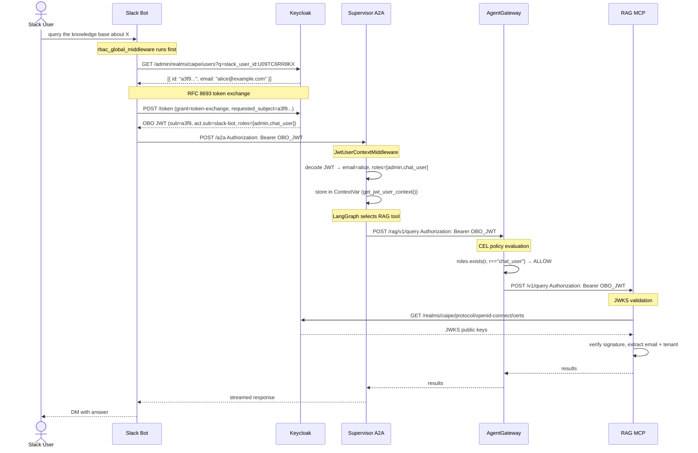

# CAIPE RBAC Architecture

**Audience:** Junior engineers getting oriented + security architects reviewing the design.
Each component opens with a **badge analogy** to build intuition, followed by the
precise technical detail. Read the analogy first, then the technical section — they
describe the same thing at different levels of abstraction.

---

## The Big Picture

Think of CAIPE like a **secure corporate office building**:

- **Keycloak** is HR + the front desk. It issues ID badges, manages who works here, and
  verifies contractors through a partner agency (Duo SSO).
- **Every service** is a room with its own badge reader. You prove who you are once at
  the front desk, get a badge, and that badge is checked at every door — no calling HR
  again each time.
- **AgentGateway** is the armed security checkpoint between the office and the server
  room. Everyone must show their badge, and the checkpoint has a rulebook specifying
  exactly which roles are allowed in which room.
- **The badge itself** is a JWT — a tamper-proof, digitally signed card that any badge
  reader can verify independently without phoning HR.

Technically: CAIPE uses **OpenID Connect (OIDC)** for authentication and **JWT bearer
tokens** for stateless authorization across all service boundaries. There is one token
issuer (Keycloak), and every service verifies tokens against Keycloak's published JWKS
public keys — no shared secrets, no per-hop re-authentication.

```
┌──────────────────────────────────────────────────────────────────────────────┐
│                              CAIPE Trust Boundary                            │
│                                                                              │
│  ┌────────────┐    ┌──────────────┐    ┌─────────────┐    ┌──────────────┐  │
│  │  Keycloak  │    │   CAIPE UI   │    │  Supervisor  │    │   Dynamic    │  │
│  │  (OIDC IdP)│    │  (Next.js)   │    │  A2A Server  │    │   Agents     │  │
│  │  port 7080 │    │  port 3000   │    │  port 8000   │    │  port 8001   │  │
│  └────────────┘    └──────────────┘    └─────────────┘    └──────────────┘  │
│    Token issuer     NextAuth + RBAC     JwtUserContext      get_current_user  │
│    JWKS endpoint    middleware          middleware           FastAPI Depends   │
│    User profile     Session → API       contextvar          JWKS validation   │
│                                                                              │
│  ┌──────────────────────────────────────────────────────────────────────┐   │
│  │                 AgentGateway  (Policy Enforcement Point)              │   │
│  │                 port 4000  ·  CEL policy engine  ·  JWT passthrough   │   │
│  └──────────────────────────────────────────────────────────────────────┘   │
│                                       │                                      │
│         ┌─────────────────────────────┼──────────────────┐                  │
│         ▼                             ▼                   ▼                  │
│   ┌───────────┐                ┌───────────┐       ┌───────────┐            │
│   │  RAG MCP  │                │ ArgoCD MCP│       │GitHub MCP │  ...       │
│   │  Server   │                │  Server   │       │  Server   │            │
│   └───────────┘                └───────────┘       └───────────┘            │
│   JWKS validation at each MCP — tokens verified independently                │
└──────────────────────────────────────────────────────────────────────────────┘
```

**Security properties the architecture is designed to guarantee:**

| Property | How it's achieved |
|----------|-------------------|
| Single source of truth for identity | Keycloak is the only token issuer; all services verify against its JWKS |
| No credentials in transit between services | JWT is a signed assertion — no password or secret is passed between hops |
| User identity preserved end-to-end | The same JWT travels Slack Bot → Supervisor → AgentGateway → MCP unchanged |
| Delegation is auditable | OBO tokens carry `act.sub` (the delegating party) alongside `sub` (the real user) |
| Policy enforcement is centralised | AgentGateway is the single PEP for all MCP tool calls; tools don't implement their own authz |
| Least privilege at tool layer | CEL policies on AgentGateway allow per-tool, per-role access rules |
| Tenant isolation | `tenant` claim in JWT scopes data visible to the MCP server |

---

## Core Concept: The JWT

When you log in, Keycloak issues a **JWT (JSON Web Token)** signed with RS256 using its
realm private key. It's a base64url-encoded envelope of three parts:
`header.payload.signature`.

A decoded payload looks like this:

```json
{
  "iss": "http://localhost:7080/realms/caipe",
  "sub": "a3f9b2c1-...",
  "email": "alice@example.com",
  "name": "Alice Smith",
  "realm_access": {
    "roles": ["admin", "chat_user"]
  },
  "resource_access": {
    "caipe-ui": { "roles": ["uma_protection"] }
  },
  "tenant": "acme",
  "exp": 1713200000,
  "iat": 1713196400,
  "act": {
    "sub": "slack-bot-client"
  }
}
```

Key fields for security architects:

| Claim | Purpose | Where it's enforced |
|-------|---------|---------------------|
| `iss` | Token issuer — services reject tokens from unknown issuers | Dynamic agents JWKS validation, RAG server |
| `sub` | Opaque user ID (Keycloak UUID) — stable, not guessable | Conversation ownership, audit logs |
| `email` | Human-readable identity — used for display and Slack linking | UI, supervisor user context |
| `realm_access.roles` | Realm-level role assignments | AgentGateway CEL, dynamic agents `is_admin` |
| `exp` | Token expiry — enforced cryptographically | All JWKS validators, NextAuth refresh |
| `act.sub` | Delegation chain — set on OBO tokens only | Audit: proves bot acted on behalf of user |
| `tenant` | Multi-tenant data scoping | RAG server query isolation |

**Services never call Keycloak on each request.** They validate the signature offline
using the cached JWKS public key. JWKS is refreshed on cache miss (unknown `kid`) or on
a TTL (1 hour).

---

## Component 1: Keycloak — HR & The Front Desk

> **Badge analogy:** HR issues ID badges. The front desk verifies them on entry. Every
> other door in the building trusts the badge's chip — they don't call HR each time.
> When a contractor arrives via a partner agency (Duo SSO), the front desk checks with
> the agency once, creates an internal record, and issues a standard building badge.
> From that point on, the contractor uses the same badge as everyone else.

**Technically:** Keycloak acts as an OIDC Authorization Server and IdP broker. It
proxies login to Duo SSO via an OIDC client, maps external claims to local realm roles,
and issues its own signed JWT — so downstream services only ever need to trust one issuer.

### Realm Roles (`caipe` realm)

| Role | Default? | Purpose |
|------|----------|---------|
| `chat_user` | Yes — all authenticated users | Grants access to supervisor, Slack bot, RAG tools via AgentGateway CEL |
| `admin` | No — explicit assignment | Full CAIPE admin UI: user management, team CRUD, role assignment, Keycloak Admin API proxy |
| `kb_admin` | No | Knowledge base management: upload documents, configure RAG pipelines |
| `team_member` | No | Scoped to team-visibility dynamic agents |

`chat_user` is in the `default-roles-caipe` composite, so every newly-created or
brokered user gets it automatically. This is patched at runtime by `init-idp.sh` because
Keycloak's realm import doesn't reliably populate composite role members.

### External IdP Brokering (Duo SSO, Okta, or any OIDC provider)

> **Badge analogy:** The partner agency desk. Whether it's Duo SSO, Okta, or any other
> corporate identity provider, they all speak the same language (OIDC). Keycloak is the
> single translator — it talks to whichever agency is configured and converts their
> badges into standard building badges. The rest of the building never needs to know
> which agency originally issued the contractor's credentials.

Keycloak acts as a **relying party** to the upstream IdP (OIDC). From the user's
perspective it's invisible — they see only the upstream IdP login page. From a security
perspective:

```
Browser ──OIDC auth code flow──▶ Keycloak
                                      │
                   ──OIDC auth code──▶ Upstream IdP (Duo SSO / Okta / any OIDC)
                                      │
                   ◀── id_token ───────┘  (external claims: email, name, groups)
                        │
                   Maps external claims to local roles via IdP mappers
                   Issues new Keycloak JWT with realm_access.roles
                        │
Browser ◀── Keycloak JWT ──────────────┘
```

**Supported upstream IdPs** — the `init-idp.sh` script configures any OIDC provider
generically via OIDC discovery (`/.well-known/openid-configuration`):

| Provider | `IDP_ALIAS` (in realm) | `IDP_ISSUER` example | Notes |
|----------|----------------------|----------------------|-------|
| Duo SSO | `duo-sso` | `https://sso-xxx.sso.duosecurity.com/oidc/xxx` | Uses `firstname`/`lastname` (non-standard); extra IdP mappers handle both `given_name` and `firstname` |
| Okta (OIDC) | `okta-oidc` | `https://your-org.okta.com` or `https://your-org.okta.com/oauth2/default` | Standard OIDC claims; groups come from Okta's `groups` claim (requires Okta app config) |
| Okta (SAML) | `okta-saml` | — | SAML 2.0; configured as a SAML IdP in Keycloak; attribute mappers needed for groups |
| Microsoft Entra ID (OIDC) | `entra-oidc` | `https://login.microsoftonline.com/{tenant-id}/v2.0` | Standard OIDC; groups claim requires Entra app manifest `groupMembershipClaims` config |
| Microsoft Entra ID (SAML) | `entra-saml` | — | SAML 2.0; common in enterprise M365 environments |
| Generic OIDC | any alias | any OIDC-compliant issuer URL | Works as long as the provider exposes `/.well-known/openid-configuration` |

**To wire up a new IdP**, set these env vars and run `init-idp.sh` (or restart the
`init-idp` container — it is idempotent):

```bash
IDP_ALIAS=okta                                 # short alias, used in kc_idp_hint
IDP_DISPLAY_NAME="Okta SSO"                    # shown on Keycloak login page (if visible)
IDP_ISSUER=https://your-org.okta.com           # OIDC issuer URL
IDP_CLIENT_ID=<okta-app-client-id>
IDP_CLIENT_SECRET=<okta-app-client-secret>
IDP_ACCESS_GROUP=caipe-users                   # Okta group → chat_user role (optional)
IDP_ADMIN_GROUP=caipe-admins                   # Okta group → admin role (optional)
OIDC_IDP_HINT=okta                             # auto-redirect browser to this IdP alias
```

**`OIDC_IDP_HINT`** (set in `ui/.env.local`) is passed to Keycloak as `kc_idp_hint` on
every auth request. It skips the Keycloak login page entirely and redirects straight to
the named IdP. Set it to the same value as `IDP_ALIAS`.

**Claim mapping chain:** The IdP sends `email`, `given_name`/`firstname`, `family_name`/
`lastname`, and `groups` claims. Keycloak IdP mappers write these to the local user
record. Role mappers translate `IDP_ACCESS_GROUP` membership to `chat_user` and
`IDP_ADMIN_GROUP` to `admin`. If neither group var is set, all brokered users receive
`chat_user` automatically via a hardcoded role mapper.

### Silent First-Login Flow (`caipe-silent-broker-login`)

The default Keycloak "first broker login" flow shows a "Review Profile" page and, if a
local account with the same email already exists, a "Confirm Link Account" page. Both are
eliminated by the custom flow patched in by `init-idp.sh`:

```
caipe-silent-broker-login  (both executions: ALTERNATIVE)
  │
  ├── idp-create-user-if-unique
  │     Condition: no local user with this email exists
  │     Action:    provision new Keycloak user, assign default roles
  │
  └── idp-auto-link
        Condition: local user with matching email already exists
        Action:    link external identity to existing account silently
```

This only works correctly because `trustEmail=true` is set on the IdP. That flag tells
Keycloak to treat the email claim from Duo SSO as authoritative for account matching.
**Security implication:** if the upstream IdP can be compromised to issue arbitrary email
claims, an attacker could link to any existing account. This is acceptable here because
Duo SSO is a corporate SSO — trust in the email claim is the same as trust in the IdP.

### User Profile & Custom Attributes

Keycloak 26+ enforces a user profile schema. Custom attributes are silently dropped
unless declared or `unmanagedAttributePolicy=ADMIN_EDIT` is set. `init-idp.sh` patches
both:

- Adds `slack_user_id` to the user profile schema with `admin`-only view/edit permissions
- Sets `unmanagedAttributePolicy=ADMIN_EDIT` so other Admin API attribute writes succeed

### Account Linking (Slack)

There are two modes, controlled by `SLACK_FORCE_LINK`:

**Auto-bootstrap (default, `SLACK_FORCE_LINK=false`):**

On the user's first Slack message the bot:
1. Calls Slack `users.info` → fetches `profile.email`
2. Queries Keycloak Admin API for a user with that exact email
3. If found: writes `slack_user_id` attribute → **linked silently, zero user action required**
4. If not found (email mismatch or user not yet in Keycloak): falls back to the manual link prompt below

**Explicit link (`SLACK_FORCE_LINK=true`):**

Slack users link their account by clicking an HMAC-signed URL:

```
/api/auth/slack-link?slack_user_id=U09TC6RR8KX&ts=1713196400&sig=<HMAC-SHA256>
```

The HMAC signature uses `SLACK_LINK_HMAC_SECRET`, prevents forged links, and is
time-bound (TTL enforced server-side). After OIDC login, the server writes
`slack_user_id` to the Keycloak user via the Admin API.

In both modes, once the link is established, all future Slack messages carry the user's
Keycloak identity automatically — no repeated login.

---

## Component 2: CAIPE UI — The Reception Desk

> **Badge analogy:** The reception desk at each department entrance. When you badge in,
> it reads your chip (JWT), checks your clearance level for this department, and either
> waves you through or says "sorry, you don't have access here." It doesn't phone HR —
> the badge chip already carries everything needed to make the decision.

**Technically:** Next.js App Router with NextAuth (Auth.js v5) for OIDC session
management. Every API route handler runs `requireRbacPermission()` which validates the
server-side session and enforces role requirements before proxying to backend services.

### Authentication Flow

```
1. Browser visits http://localhost:3000
2. NextAuth detects no session → 302 to Keycloak (OIDC auth code flow)
3. Keycloak → Duo SSO (kc_idp_hint=duo-sso auto-redirects, user never sees KC)
4. Duo SSO login → auth code returned to Keycloak
5. Keycloak issues JWT → NextAuth exchanges code for tokens
6. NextAuth stores { accessToken, refreshToken, sub, roles } in encrypted server-side session cookie
7. Browser receives httpOnly session cookie — raw JWT never touches the browser
```

**Security note:** The JWT is stored in an httpOnly, Secure, SameSite=Lax session cookie
managed by NextAuth. Client-side JavaScript cannot read it. The session is encrypted with
`NEXTAUTH_SECRET`.

### Server-Side Authorization (`api-middleware.ts`)

```typescript
// Every protected API route:
await requireRbacPermission(request, {
  resource: 'rag',
  action: 'read',
  user: session.user,
  accessToken: session.accessToken,
  sub: session.sub,
  org: session.org,
})
```

Two authorization paths:

1. **Role-based (JWT claim):** `hasRoleFallback()` checks `realm_access.roles` from the
   session JWT against the required role for the resource+action pair.

2. **Bootstrap admin bypass:** `isBootstrapAdmin(email)` checks the email against
   `BOOTSTRAP_ADMIN_EMAILS`. This bypasses **all** resource/action checks. It exists for
   the chicken-and-egg problem: the first admin must be able to log in before Keycloak
   roles are properly configured. **Remove this env var once roles are working.**

### Token Refresh

NextAuth holds the refresh token and silently refreshes the access token before it
expires. If the refresh fails (revoked session, Keycloak down), the user is redirected to
login. The access token in the session is always the current live token — it's what gets
forwarded to backend services.

---

## Component 3: Supervisor A2A Server — The Dispatcher

> **Badge analogy:** The dispatcher at the internal mail room. When you drop off a work
> order, they scan your badge, note your name and clearance on the paperwork, and attach
> a photo-copy of your badge to every sub-order sent to other departments. Downstream
> departments never need to ask who initiated the original request — it's stapled to
> everything.

**Technically:** A Starlette/FastAPI application running the LangGraph multi-agent
supervisor. It has a layered middleware stack. The JWT is validated once at the
outer layer, then decoded and stored in a per-request contextvar by
`JwtUserContextMiddleware` so all downstream code can read user identity without
re-parsing the header.

### Middleware Stack (outermost → innermost)

```
CORSMiddleware
    │
PrometheusMetricsMiddleware   (metrics, skips /health)
    │
OAuth2Middleware / SharedKeyMiddleware   (validates JWT signature + expiry)
    │
JwtUserContextMiddleware   (decodes claims → stores in contextvar)
    │
A2A request handler + LangGraph agent
```

`JwtUserContextMiddleware` is intentionally read-only. It does not re-validate the
token — that's already done by the auth middleware above it. It decodes the JWT payload
without verification, fetches the OIDC userinfo endpoint (cached 10 min) for
authoritative email/name/groups, and stores the result in a `ContextVar`:

```python
# Set once per request by JwtUserContextMiddleware
_jwt_user_context_var: ContextVar[JwtUserContext | None]

# Read anywhere in the same request (agent executor, tools, sub-calls)
ctx = get_jwt_user_context()
# ctx.email, ctx.name, ctx.groups, ctx.token
```

### JWT Forwarding to MCP Tools

When `FORWARD_JWT_TO_MCP=true`, the supervisor forwards the **original, unmodified**
bearer token from the incoming request to AgentGateway. This means:

- The token that reaches AgentGateway has `sub` = the real user (or OBO token with `act.sub` = bot)
- AgentGateway can evaluate the user's actual roles, not the supervisor's service account
- MCP servers that do their own JWT validation (e.g. RAG) see the real user identity

```
User JWT  →  Supervisor  →  (same JWT)  →  AgentGateway  →  MCP Server
```

**Security implication:** The supervisor must not modify or strip the bearer token before
forwarding. If it substituted its own service account token, the entire per-user
authorization chain would collapse.

### Key Environment Variables

| Variable | Purpose | Security note |
|----------|---------|---------------|
| `A2A_AUTH_OAUTH2=true` | Enable JWT signature validation | Off in dev; mandatory in prod |
| `A2A_AUTH_SHARED_KEY` | Shared-key auth alternative | Use only for service-to-service; not for user-facing flows |
| `ENABLE_USER_INFO_TOOL=true` | Extract identity from JWT (vs. `"by user: email"` prefix) | The JWT is the authoritative source; prefer this over message prefix |
| `FORWARD_JWT_TO_MCP=true` | Forward incoming JWT to MCP tools | Required for per-user enforcement at AgentGateway |
| `ISSUER` / `OIDC_ISSUER` | OIDC issuer for userinfo endpoint discovery | Must match `iss` claim in tokens |

---

## Component 4: AgentGateway — The Security Checkpoint

> **Badge analogy:** The armed security checkpoint at the entrance to the server room.
> Everyone must badge in — no exceptions, no tailgating. The checkpoint has a physical
> rulebook (CEL policies) specifying exactly which badge types (roles) can enter which
> server rack (MCP tool). If your badge says `chat_user` and the rack requires `kb_admin`,
> you're turned away at the door, not inside the rack.

**Technically:** AgentGateway is the single **Policy Enforcement Point (PEP)** for all
MCP tool calls. It proxies HTTP/SSE requests to registered MCP backend servers and
evaluates a CEL (Common Expression Language) policy against the JWT claims before
allowing each request through. It is the only place in the architecture where
tool-level authorization is enforced — MCP servers do not need their own authz logic
beyond JWT signature validation.

### Request Flow

```
Supervisor POST /rag/v1/query
  Authorization: Bearer <JWT>
         │
         ▼
  AgentGateway
  ┌────────────────────────────────────────────┐
  │  1. Extract JWT from Authorization header  │
  │  2. Validate signature against JWKS        │
  │  3. Evaluate CEL policy against claims:    │
  │                                            │
  │     jwt.claims.realm_access.roles          │
  │       .exists(r, r == "chat_user")         │
  │                                            │
  │  4a. Policy DENY  →  403 Forbidden         │
  │  4b. Policy ALLOW →  proxy to MCP server   │
  └────────────────────────────────────────────┘
         │ ALLOW
         ▼
  RAG MCP Server
  (receives same JWT for its own validation)
```

### CEL Policy Examples

CEL is a lightweight expression language. Policies are evaluated per-route and per-method.

```cel
# Basic access: must have chat_user role
jwt.claims.realm_access.roles.exists(r, r == "chat_user")

# Elevated access: admin or kb_admin
jwt.claims.realm_access.roles.exists(r, r == "admin" || r == "kb_admin")

# Tenant-scoped: user can only query their own tenant's data
jwt.claims.tenant == resource.tenant

# Combine role and tenant
jwt.claims.realm_access.roles.exists(r, r == "chat_user")
  && jwt.claims.tenant != ""
```

### Why This Is the Right Architecture for a PEP

- **Decoupled policy from business logic:** MCP servers implement domain logic, not authz.
  Changing a policy means editing `config.yaml`, not redeploying an MCP server.
- **Consistent enforcement:** Every tool — RAG, GitHub, ArgoCD, Slack — goes through the
  same gateway with the same JWT. No tool can be accidentally left unenforced.
- **Token passthrough:** AgentGateway forwards the JWT to the MCP backend unchanged.
  The backend can do its own secondary validation (e.g. tenant isolation).

---

## Component 5: Dynamic Agents — The Workshop Floor

> **Badge analogy:** A workshop where employees build and operate their own machines.
> The workshop checks your badge at the door (JWT validation on every request). Once
> inside, each machine has its own access tag — some are personal (Private), some are
> shared with your team (Team), some anyone can use (Global). Your badge level determines
> which machines you can touch. When a machine makes a tool call, it presents your badge
> — not its own — so the security checkpoint still sees *you*, not the machine.

**Technically:** A FastAPI service where every route handler uses `get_current_user()`
as a FastAPI `Depends()`. Unlike the supervisor (which uses a middleware contextvar), the
dynamic agents service validates the JWT on every request at the route level, giving
precise control per endpoint.

### JWT Validation Chain

```python
# FastAPI dependency injection — runs before every protected handler
user: UserContext = Depends(get_current_user)
```

Inside `get_current_user()`:

```
1. Extract Bearer token from Authorization header
2. Fetch JWKS from Keycloak (cached in-process)
3. Validate:
   - Signature (RS256 against JWKS public key)
   - expiry (exp)
   - issuer (iss == OIDC_ISSUER)
   - audience (aud == OIDC_CLIENT_ID, if set)
4. Call OIDC userinfo endpoint (cached 10 min by token hash)
   → authoritative email, name, groups (OIDC tokens often omit these)
5. Extract realm_access.roles from JWT claims
   (Keycloak puts roles here; also checked in userinfo)
6. Evaluate oidc_required_group (if set) — 403 if missing
7. Set is_admin via check_admin_role() pattern match against OIDC_REQUIRED_ADMIN_GROUP
8. Return UserContext { email, name, groups, is_admin, access_token, obo_jwt }
```

### Agent-Level Authorization (CEL or Visibility Rules)

After the user is authenticated, `can_use_agent(agent, user)` decides whether they can
invoke a specific agent:

```
CEL expression configured? ──YES──▶ evaluate cel_dynamic_agent_access_expression
        │ NO
        ▼
  is_admin  →  ALLOW (admins can use any agent)
  owner_id == user.email  →  ALLOW
  visibility == GLOBAL  →  ALLOW
  visibility == TEAM && user.groups ∩ agent.shared_with_teams ≠ ∅  →  ALLOW
  visibility == PRIVATE  →  DENY
```

### Token Forwarding to MCP Tools

The `UserContext.obo_jwt` (set from `X-OBO-JWT` header) or `UserContext.access_token`
is forwarded as the `Authorization: Bearer` header on all MCP tool calls made by the
agent runtime. This gives the same per-user enforcement at AgentGateway as the supervisor
path provides.

### Key Environment Variables

| Variable | Default | Security note |
|----------|---------|---------------|
| `AUTH_ENABLED` | `false` | **Must be `true` in production.** `false` returns a hardcoded `dev@localhost` admin — never deploy with `false`. |
| `OIDC_ISSUER` | — | Validated against `iss` claim; tokens from other issuers are rejected |
| `OIDC_CLIENT_ID` | — | Used as expected `aud` claim; prevents token substitution from other clients |
| `OIDC_REQUIRED_GROUP` | — | Blanket access gate; set to `chat_user` to mirror AgentGateway policy |
| `OIDC_REQUIRED_ADMIN_GROUP` | — | Group/role that grants `is_admin`; defaults to pattern matching "admin" |

---

## The OBO Token Exchange — Slack Identity Propagation

> **Badge analogy:** The Slack bot is a courier service. When Alice asks the courier to
> pick something up from the server room on her behalf, the courier can't use their own
> badge — the server room requires Alice's clearance. Instead, the courier goes to HR
> (Keycloak), presents their credentials and Alice's employee ID, and HR issues a
> *delegated badge*: it opens the same doors as Alice's badge, but it has a second chip
> that says "issued on behalf of Alice, presented by courier bot." The delegation chain
> is physically stamped on the badge — it's auditable and unforgeable.

**The hardest part to get right technically.** Without OBO, every Slack request carries
the bot's service account identity — `realm_access.roles` would be the bot's roles, not
the user's, and all per-user authorization would be meaningless.

### RFC 8693 Token Exchange

OBO (On-Behalf-Of) is implemented via [RFC 8693](https://www.rfc-editor.org/rfc/rfc8693)
token exchange. The bot uses its `client_credentials` grant to request a token
**impersonating** a specific Keycloak user:

```http
POST /realms/caipe/protocol/openid-connect/token
Content-Type: application/x-www-form-urlencoded

grant_type=urn:ietf:params:oauth:grant-type:token-exchange
&client_id=slack-bot
&client_secret=<bot-secret>
&subject_token=<bot-access-token>
&subject_token_type=urn:ietf:params:oauth:token-type:access_token
&requested_subject=<keycloak-user-id>
&requested_token_type=urn:ietf:params:oauth:token-type:access_token
```

Keycloak responds with an OBO JWT where:

- `sub` = the impersonated user's Keycloak ID
- `email` = the user's email
- `realm_access.roles` = the **user's** roles (not the bot's)
- `act.sub` = the bot's client ID — the delegation chain is cryptographically recorded



### Security Properties of OBO

| Property | Mechanism |
|----------|-----------|
| Bot cannot forge a user identity | Keycloak only issues the OBO token if the bot's `client_id` has the `token-exchange` permission granted in the realm |
| Delegation is auditable | `act.sub` in the JWT records the bot as delegating party — verifiable in any JWKS-aware system |
| User roles are enforced, not bot roles | `realm_access.roles` in the OBO token are the user's, not the bot's service account roles |
| Token expiry still applies | OBO tokens have the same `exp` as a normal Keycloak token; expired tokens are rejected at every JWKS validation point |
| Unlinked users are blocked at the edge | `rbac_global_middleware` in the Slack bot rejects unlinked users before they reach the supervisor — the linking prompt is sent at most once per `SLACK_LINKING_PROMPT_COOLDOWN` seconds (default: 3600) |

---

## Channel → Dynamic Agent Routing

> **Badge analogy:** Each Slack channel is a dedicated help-desk line. An admin assigns each
> line a specific expert agent (like routing IT tickets to the right tier). When a user calls in,
> the operator checks the channel's routing table, verifies the user has clearance for that agent,
> then patches them through. The routing decision and access check happen *before* the message
> reaches the agent.

### How It Works

Every Slack channel can be mapped to exactly one dynamic agent (1:1 mapping). When a message
arrives, the Slack bot resolves the target agent:

1. **Lookup**: query `channel_agent_mappings` in MongoDB by `slack_channel_id`
2. **Existence check**: verify the mapped agent exists in `dynamic_agents` and `enabled = true`
3. **RBAC check** (basic):
   - `visibility = global` → allow any authenticated user
   - `visibility = team` → require `team_member:<team>` Keycloak realm role for one of the agent's `shared_with_teams`
   - `visibility = private` → deny (private agents are not appropriate for channel routing)
4. **Route**: pass the resolved `agent_id` to the chat/stream call; fallback to YAML config default if no mapping exists

### Admin UI

Admins configure mappings in **CAIPE UI → Admin → Channel-to-agent mappings**.

- Dropdown lists all dynamic agents visible to the admin
- Upsert semantics: creating a new mapping for an already-mapped channel replaces the old mapping
- Deactivating a mapping (soft delete) falls back to the YAML config default agent

### Key Files

| Layer | File |
|-------|------|
| MongoDB channel→agent mapping (read/write) | `ui/src/app/api/admin/slack/channel-mappings/route.ts` |
| Admin UI tab | `ui/src/components/admin/SlackChannelMappingTab.tsx` |
| Slack bot resolver + RBAC check | `ai_platform_engineering/integrations/slack_bot/utils/channel_agent_mapper.py` |
| Slack bot integration point | `ai_platform_engineering/integrations/slack_bot/app.py` (`_rbac_enrich_context`, `_channel_agent_id_from_context`) |

### MongoDB Collection: `channel_agent_mappings`

```json
{
  "_id": ObjectId,
  "slack_channel_id": "C0123456789",
  "agent_id": "my-k8s-agent",
  "channel_name": "#k8s-support",
  "slack_workspace_id": "T0123456789",
  "created_by": "admin@example.com",
  "created_at": ISODate,
  "active": true
}
```

The `agent_id` field is the dynamic agent's slug (string `_id` in `dynamic_agents` collection).

---

## End-to-End Request Flow

```
Slack User: "What's the status of my ArgoCD deployment?"

━━━━━━━━━━━━━━━━━━━━━━━━━━━━━━━━━━━━━━━━━━━━━━━━━━
STEP 1: Identity Resolution  (Slack Bot)
━━━━━━━━━━━━━━━━━━━━━━━━━━━━━━━━━━━━━━━━━━━━━━━━━━
  slack_user_id U09TC6RR8KX
    → Keycloak Admin API lookup by attribute
    → user: { id: "a3f9...", email: "alice@example.com" }
  RFC 8693 exchange → OBO JWT
    sub=alice, act.sub=slack-bot, roles=[chat_user]

━━━━━━━━━━━━━━━━━━━━━━━━━━━━━━━━━━━━━━━━━━━━━━━━━━
STEP 2: Supervisor Ingestion  (A2A + LangGraph)
━━━━━━━━━━━━━━━━━━━━━━━━━━━━━━━━━━━━━━━━━━━━━━━━━━
  POST /a2a  Authorization: Bearer OBO_JWT
    → OAuth2Middleware: validates RS256 signature against JWKS
    → JwtUserContextMiddleware: decodes claims, stores in ContextVar
    → agent_executor: get_jwt_user_context() → email=alice
    → LangGraph selects ArgoCD MCP tool

━━━━━━━━━━━━━━━━━━━━━━━━━━━━━━━━━━━━━━━━━━━━━━━━━━
STEP 3: Policy Enforcement  (AgentGateway)
━━━━━━━━━━━━━━━━━━━━━━━━━━━━━━━━━━━━━━━━━━━━━━━━━━
  POST /argocd/...  Authorization: Bearer OBO_JWT
    → CEL: roles.exists(r, r=="chat_user") → ALLOW
    → Proxy to ArgoCD MCP Server

━━━━━━━━━━━━━━━━━━━━━━━━━━━━━━━━━━━━━━━━━━━━━━━━━━
STEP 4: MCP Tool Execution  (ArgoCD MCP Server)
━━━━━━━━━━━━━━━━━━━━━━━━━━━━━━━━━━━━━━━━━━━━━━━━━━
  Validates OBO JWT against Keycloak JWKS independently
  Extracts email=alice, tenant=acme
  Returns deployments scoped to alice's tenant

━━━━━━━━━━━━━━━━━━━━━━━━━━━━━━━━━━━━━━━━━━━━━━━━━━
Response path: MCP → Gateway → Supervisor → Slack → User
```

---

## How to Use It Right Now

### Start the Stack

```bash
COMPOSE_PROFILES='rbac,caipe-ui,caipe-mongodb' \
  docker compose -f docker-compose.dev.yaml up -d

# Wait for Keycloak to be healthy before logging in
docker compose -f docker-compose.dev.yaml ps keycloak
```

Keycloak admin console: `http://localhost:7080/admin` (admin / admin)

### Built-in Test Users (`caipe` realm)

| Username | Password | Roles | Boundary to test |
|----------|----------|-------|-----------------|
| `admin-user` | `admin` | admin, chat_user | Full admin UI access |
| `standard-user` | `standard` | chat_user, team_member | Chat only, no admin UI |
| `kb-admin-user` | `kbadmin` | chat_user, team_member, kb_admin | RAG management |
| `denied-user` | `denied` | (none) | 403 on all protected routes |
| `org-b-user` | `orgb` | chat_user (tenant: globex) | Tenant isolation — sees only Globex data |

### Verify Role Enforcement

```bash
# Login as denied-user, try to hit a protected API directly
TOKEN=$(curl -s -X POST http://localhost:7080/realms/caipe/protocol/openid-connect/token \
  -d "grant_type=password&client_id=caipe-ui&client_secret=caipe-ui-dev-secret&username=denied-user&password=denied" \
  | python3 -c "import sys,json; print(json.load(sys.stdin)['access_token'])")

curl -s -o /dev/null -w "%{http_code}" \
  -H "Authorization: Bearer $TOKEN" \
  http://localhost:8000/.well-known/agent.json
# → 200 (public endpoint)

curl -s -o /dev/null -w "%{http_code}" \
  -H "Authorization: Bearer $TOKEN" \
  http://localhost:4000/rag/v1/query
# → 403 (AgentGateway CEL denies — no chat_user role)
```

### Enable Dynamic Agents Auth

`AUTH_ENABLED` defaults to `false` in dev (returns a hardcoded admin bypass). To test
the real RBAC path:

```bash
# .env
AUTH_ENABLED=true
OIDC_ISSUER=http://localhost:7080/realms/caipe
OIDC_CLIENT_ID=caipe-ui
OIDC_REQUIRED_ADMIN_GROUP=admin
```

### Slack Identity Linking

**Auto mode (default):**
1. Send any message to the bot
2. Bot silently fetches your Slack email, matches it to your Keycloak account, links automatically
3. Subsequent messages: OBO exchange happens automatically — zero user action required

**Forced-link mode (`SLACK_FORCE_LINK=true`):**
1. DM the Slack bot with any message
2. If unlinked: one-time HMAC-signed link prompt (rate-limited by `SLACK_LINKING_PROMPT_COOLDOWN`)
3. Click link → SSO login → `slack_user_id` written to Keycloak via Admin API
4. Subsequent messages: OBO exchange happens automatically

---

## Threat Model Considerations

| Threat | Mitigation |
|--------|-----------|
| JWT forgery | RS256 signature verified against Keycloak JWKS; private key never leaves Keycloak |
| JWT replay after expiry | `exp` claim enforced at every JWKS validation point |
| Token theft from browser | NextAuth stores tokens in httpOnly server-side session cookie; raw JWT never in JS context |
| Bot impersonating arbitrary user via OBO | Keycloak's `token-exchange` permission must be explicitly granted to the bot client; not available by default |
| Privilege escalation via claim manipulation | JWT is signed; any claim modification invalidates the RS256 signature |
| Tenant data leakage | `tenant` claim in JWT used for query scoping at MCP layer; enforced by CEL policy per-route |
| Unlinked Slack users bypassing RBAC | `rbac_global_middleware` blocks all unlinked users before the supervisor is called |
| `AUTH_ENABLED=false` in production | Startup log emits a `WARNING` when auth is disabled; also documented in the Dynamic Agents env var table above |
| Bootstrap admin left permanently enabled | No automatic enforcement — documented operational risk; must be removed post-setup |

---

## Common Questions

**Q: Why does the UI still work if Keycloak is down?**

The UI and all services cache the JWKS public key. Signature validation is local — no
Keycloak call needed per request. Sessions already in flight remain valid until their
`exp`. Only new logins (which need Keycloak's auth endpoint) fail.

**Q: What is `BOOTSTRAP_ADMIN_EMAILS` and when should I remove it?**

It's an emergency bypass that grants full admin regardless of JWT roles. Intended only
for initial setup when Keycloak role mapping isn't yet configured. Once `admin-user` (or
your real admin account) has the `admin` realm role and can log in successfully, remove
`BOOTSTRAP_ADMIN_EMAILS` from your env. Leaving it in production is a standing
privilege escalation risk.

**Q: Why are there both `access_token` and `obo_jwt` on `UserContext`?**

UI-sourced requests carry the user's own access token (`access_token`). Slack-sourced
requests carry an OBO token (`obo_jwt` from the `X-OBO-JWT` header) — this preserves
the delegator/delegatee distinction for audit purposes. The agent runtime prefers
`obo_jwt` over `access_token` when forwarding to MCP tools.

**Q: What happens when the JWT expires mid-session?**

NextAuth holds the refresh token and silently refreshes before expiry. If the refresh
fails (revoked session, Keycloak unavailable), the next API call returns 401 and the
client redirects to login. OBO tokens issued by the Slack bot are short-lived; the bot
re-exchanges on each message.

**Q: Can I add a custom role and enforce it at AgentGateway?**

Yes. In Keycloak Admin: Realm Roles → Create. Add it to `default-roles-caipe` if it
should be universal. Add an IdP mapper if it should come from a Duo SSO group. Then
update `deploy/agentgateway/config.yaml` with a CEL policy referencing the new role.
No code changes required.

---

## Service-to-Service Authentication (Slack bot → caipe-ui)

The Slack bot calls caipe-ui's API as a machine client, not as a logged-in
user. It uses the OAuth2 `client_credentials` grant against the `caipe`
realm:

| Env var | Purpose |
|---------|---------|
| `SLACK_INTEGRATION_ENABLE_AUTH=true` | Enables Bearer-token path in `app.py` |
| `SLACK_INTEGRATION_AUTH_TOKEN_URL` | `${KEYCLOAK_URL}/realms/caipe/protocol/openid-connect/token` |
| `SLACK_INTEGRATION_AUTH_CLIENT_ID` | `caipe-slack-bot` (pre-created in `realm-config.json`) |
| `SLACK_INTEGRATION_AUTH_CLIENT_SECRET` | Fetched from Keycloak — see "Provisioning service-client secrets" below |

**Token shape** (fields that matter):

- `iss` — `${KEYCLOAK_URL}/realms/caipe`
- `aud` — `[caipe-ui, caipe-platform]` — both audiences are needed. `caipe-platform`
  is added by Keycloak's default audience resolution; `caipe-ui` comes from an
  `oidc-audience-mapper` protocol mapper (`aud-caipe-ui`) on the `caipe-slack-bot`
  client. caipe-ui's JWT validator rejects tokens whose audience doesn't include
  `OIDC_CLIENT_ID` (i.e. `caipe-ui`), so this mapper is required.
- `azp` — `caipe-slack-bot`
- `sub` — service account UUID (stable)
- `preferred_username` — `service-account-caipe-slack-bot`
- `scope` — `groups email profile org roles`

The mapper is created automatically by `deploy/keycloak/init-idp.sh` (idempotent).

**This token represents the bot, not the user.** User identity is carried
separately by the OBO flow in `utils/obo_exchange.py` (RFC 8693 token
exchange), which produces a second token with `act.sub=caipe-slack-bot`
and the real user's `sub`/`email`.

### Provisioning service-client secrets in production

In dev, secrets are embedded in `deploy/keycloak/realm-config.json`. In
production, operators should treat them as rotating credentials:

**Option A — manual (Keycloak Admin UI):**

1. Log into Keycloak Admin Console → `caipe` realm → Clients →
   `caipe-slack-bot` → Credentials tab.
2. Copy the Secret value (or click **Regenerate Secret** for rotation).
3. Store it in your secret manager (Vault, AWS SSM, K8s Secret) as
   `SLACK_INTEGRATION_AUTH_CLIENT_SECRET`.
4. Redeploy / restart the Slack bot pod so it picks up the new secret.

**Option B — scripted (`deploy/keycloak/export-client-secrets.sh`):**

The script fetches secrets via the Keycloak Admin API and emits them in
one of three formats:

```bash
# shell (source into current session)
eval "$(KC_URL=https://keycloak.example.com ./export-client-secrets.sh)"

# dotenv (append to a .env file)
KC_URL=https://keycloak.example.com FORMAT=dotenv \
  ./export-client-secrets.sh >> slack-bot.env

# kubernetes Secret (pipe to kubectl)
KC_URL=https://keycloak.example.com FORMAT=k8s \
  K8S_NAMESPACE=caipe K8S_SECRET_NAME=caipe-service-secrets \
  ./export-client-secrets.sh | kubectl apply -f -
```

The Helm chart can wire this up as a post-install Job so fresh installs
get the Secret populated without operator intervention. Rotation is the
same call — the Secret is overwritten in place.

---

## File Map

| What you want to change | File |
|-------------------------|------|
| Keycloak realm: roles, clients, test users | `deploy/keycloak/realm-config.json` |
| Keycloak runtime patches: silent flow, user profile, role composites, slack-bot audience mapper | `deploy/keycloak/init-idp.sh` |
| Export client secrets to env/dotenv/K8s Secret | `deploy/keycloak/export-client-secrets.sh` |
| UI session & NextAuth OIDC config | `ui/src/lib/auth.ts` |
| UI RBAC middleware (per-route role enforcement) | `ui/src/lib/api-middleware.ts` |
| Supervisor middleware stack (auth + JWT context) | `ai_platform_engineering/multi_agents/platform_engineer/protocol_bindings/a2a/main.py` |
| Per-request user identity (contextvar) | `ai_platform_engineering/utils/auth/jwt_context.py` |
| JWT context middleware (Starlette) | `ai_platform_engineering/utils/auth/jwt_user_context_middleware.py` |
| Supervisor agent executor (ENABLE_USER_INFO_TOOL) | `ai_platform_engineering/multi_agents/platform_engineer/protocol_bindings/a2a/agent_executor.py` |
| Dynamic agents JWT validation & userinfo | `ai_platform_engineering/dynamic_agents/src/dynamic_agents/auth/auth.py` |
| Dynamic agents agent-level authorization (CEL / visibility) | `ai_platform_engineering/dynamic_agents/src/dynamic_agents/auth/access.py` |
| AgentGateway CEL policies | `deploy/agentgateway/config.yaml` |
| Slack OBO token exchange (RFC 8693) | `ai_platform_engineering/integrations/slack_bot/utils/obo_exchange.py` |
| Slack identity auto-bootstrap + manual link | `ai_platform_engineering/integrations/slack_bot/utils/identity_linker.py` |
| Slack account linking UI callback | `ui/src/app/api/auth/slack-link/route.ts` |
| Slack channel → agent routing + RBAC | `ai_platform_engineering/integrations/slack_bot/utils/channel_agent_mapper.py` |
| Admin UI: channel-to-agent mappings | `ui/src/components/admin/SlackChannelMappingTab.tsx` |
| API: channel-to-agent mapping CRUD | `ui/src/app/api/admin/slack/channel-mappings/route.ts` |
| Admin API: Keycloak identities (RBAC mgmt) | `ui/src/app/api/admin/users/route.ts` |
| Admin API: per-user MongoDB activity stats (Keycloak `admin_ui#view`) | `ui/src/app/api/admin/users/stats/route.ts` |
