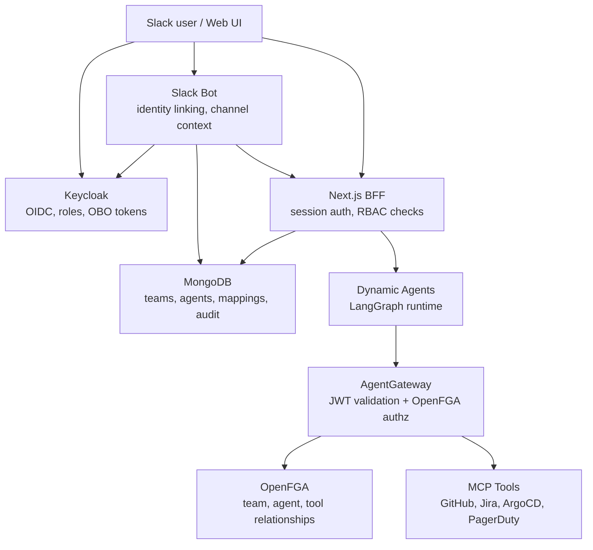
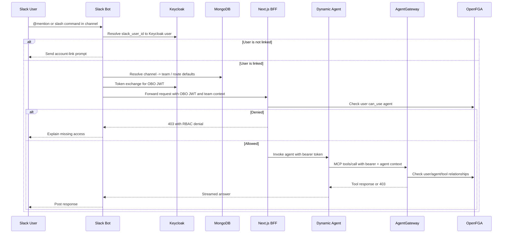

# RBAC Dynamic Agent and Slack Flow Notes

This note folds in the useful examples from the former root-level `RBAC.md`.
The canonical architecture remains [`architecture.md`](./architecture.md);
this file keeps the dynamic-agent and Slack routing examples close to spec 098.

## Current Architecture Snapshot



Keycloak is the identity and token issuer. MongoDB stores operational
configuration such as agents, team membership, and Slack channel mappings.
AgentGateway and OpenFGA are the runtime policy path for MCP calls.

## Slack Channel to Agent Routing

Slack channels provide team context; they do not grant permission by
themselves. The user must still have the required Keycloak roles and OpenFGA
relationships for the target team, agent, and tool.



First-message behavior:

- If the Slack user is already linked to Keycloak, the bot uses that identity.
- If the Slack user is unlinked, the bot sends a link prompt with a short-lived
  URL and does not process the protected request.
- If Slack JIT user creation is enabled, the bot may create a shell Keycloak
  user for an allowed email domain, then continue through the normal OBO path.
- Link prompts are rate-limited to avoid spamming the same user.

## Dynamic Agent Access Model

Dynamic agent access combines three layers from FR-028:

- Keycloak resources and scopes for the agent object.
- Per-agent roles such as `agent_user:<id>` and `agent_admin:<id>`.
- MongoDB visibility (`private`, `team`, `global`), ownership, and team sharing.

OpenFGA is the current runtime relationship model for agent and tool calls.
The `allowed_tools` field becomes relationship data; it is not a standalone
security boundary.

```yaml
agents:
  - id: "devops-helper"
    name: "DevOps Helper"
    visibility: "team"
    shared_with_teams: ["platform"]
    allowed_tools:
      github:
        - "list_repos"
        - "get_pr"
        - "list_issues"
      jira:
        - "list_issues"
        - "get_issue"
```

At runtime:

1. The BFF checks whether the caller can view or invoke the agent.
2. Dynamic Agents repeats the check before executing the runtime.
3. Dynamic Agents signs the agent context for outbound MCP calls.
4. AgentGateway asks OpenFGA whether the user can use the agent and whether
   that agent can call the requested tool.
5. Missing user, agent, or tool relationships fail closed.

## Demo Flow

1. Create or update a dynamic agent with `visibility`, `shared_with_teams`, and
   `allowed_tools`.
2. Assign the agent to the relevant team in Admin UI Team Resources or OpenFGA
   ReBAC.
3. Map the Slack channel to the team if Slack should provide team context.
4. Send a Slack message or invoke the agent from the Web UI.
5. Verify the audit trail shows the human user identity, the agent identity,
   and the tool relationship decision.

## Superseded Root Notes

The old root `RBAC.md` mentioned storing downstream provider tokens in
Keycloak user attributes and using a local token cache for GitHub/Jira calls.
That is not the normative 098 path. Spec 098 uses Keycloak-issued OBO JWTs for
platform-to-platform identity propagation and AgentGateway/OpenFGA for MCP tool
authorization. Any provider-specific credential handling must be documented in
the owning integration spec and must not weaken the RBAC guarantees above.
