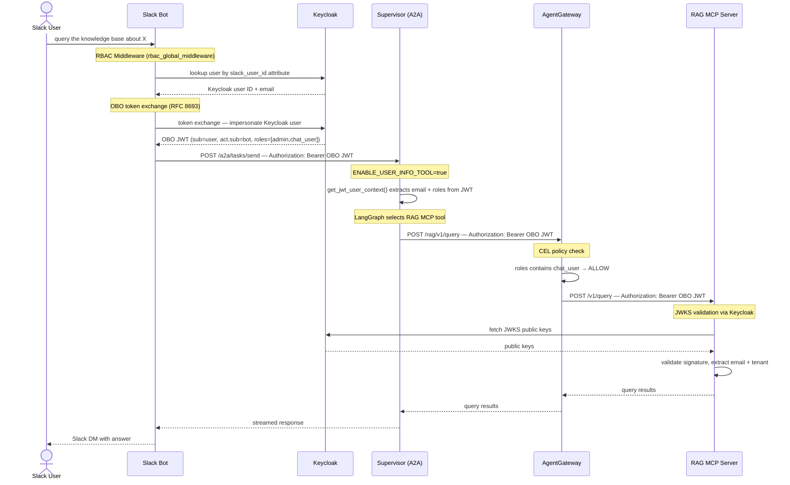

# Slack → RAG MCP Auth Flow

End-to-end sequence showing how a Slack user's identity flows through the RBAC stack to the RAG MCP tools, using OBO token exchange and AgentGateway policy enforcement.

## Sequence Diagram



## Flow Description

### 1. Identity Resolution (Slack Bot)

When a Slack message arrives, `rbac_global_middleware` in `app.py` runs before any handler:

1. Looks up the Slack user ID (`U09TC6RR8KX`) in Keycloak via the Admin API, searching for users with a matching `slack_user_id` attribute.
2. If no match → sends ephemeral "account not linked" message with a linking URL (at most once per hour per user).
3. If matched → proceeds to OBO exchange.

**Relevant code:** `ai_platform_engineering/integrations/slack_bot/app.py` → `_rbac_enrich_context()`  
**Identity storage:** `deploy/keycloak/init-idp.sh` configures the `slack_user_id` user profile attribute.

### 2. OBO Token Exchange (Slack Bot → Keycloak)

`impersonate_user(keycloak_user_id)` calls Keycloak's RFC 8693 token exchange endpoint using the bot's `client_credentials` grant, requesting a token on behalf of the target user (`requested_subject`).

The resulting **OBO JWT** contains:
- `sub` — Keycloak user ID
- `email` — user's email
- `realm_access.roles` — roles assigned in Keycloak (e.g. `admin`, `chat_user`)
- `act.sub` — bot's client ID (delegation chain)

**Relevant code:** `ai_platform_engineering/integrations/slack_bot/utils/obo_exchange.py` → `impersonate_user()`

### 3. Supervisor Call (Slack Bot → Supervisor)

The OBO JWT is forwarded as the `Authorization: Bearer` header on the A2A request to the supervisor. The message body does **not** contain the `"by user: email\n"` prefix when `ENABLE_USER_INFO_TOOL=true` — the JWT is the authoritative identity source.

### 4. JWT User Context Extraction (Supervisor)

`get_jwt_user_context()` in `ai_platform_engineering/utils/auth/jwt_context.py` extracts the user's identity from the incoming request JWT (via a context variable set by the A2A server middleware). Falls back to parsing the `"by user:"` message prefix if the JWT is unavailable.

**Env var:** `ENABLE_USER_INFO_TOOL=true`

### 5. AgentGateway Policy Enforcement

When the LangGraph agent selects a RAG MCP tool, the supervisor forwards the request through AgentGateway with the OBO JWT (`FORWARD_JWT_TO_MCP=true`).

AgentGateway evaluates the configured **CEL policy** before proxying:

```python
# Example policy — user must have chat_user role
jwt.claims.realm_access.roles.exists(r, r == "chat_user")
```

If the policy denies → `403 Forbidden` is returned to the supervisor before RAG is ever called.  
If the policy allows → request is proxied to the RAG MCP server.

**Relevant code:** `deploy/agentgateway/config.yaml`, `ai_platform_engineering/utils/a2a_common/base_langgraph_agent.py`

### 6. RAG JWT Validation

The RAG server validates the OBO JWT by:
1. Fetching Keycloak's JWKS (`/realms/caipe/protocol/openid-connect/certs`)
2. Verifying the JWT signature and expiry
3. Extracting `email` and tenant from claims for multi-tenant data isolation

Falls back to userinfo endpoint if JWKS validation fails.

**Relevant code:** `ai_platform_engineering/knowledge_bases/rag/server/src/server/restapi.py`

## Key Design Properties

| Property | Detail |
|----------|--------|
| **Single token, end-to-end** | The OBO JWT issued by Keycloak is forwarded unchanged from Slack Bot → Supervisor → AgentGateway → RAG. No re-authentication at each hop. |
| **Bot never impersonates silently** | The `act.sub` claim in the OBO token records the bot as the delegating party — the delegation chain is auditable. |
| **Policy enforcement at the gateway** | AgentGateway is the single policy enforcement point for all MCP tool access. RAG doesn't need its own RBAC logic beyond JWT validation. |
| **Unlinked users are blocked early** | If `slack_user_id` is not in Keycloak, the Slack bot blocks the request before it reaches the supervisor. |
| **Linking prompt rate-limited** | Unlinked users see the prompt at most once per hour (`SLACK_LINKING_PROMPT_COOLDOWN`, default 3600s). |

## Environment Variables

| Variable | Component | Purpose |
|----------|-----------|---------|
| `SLACK_RBAC_ENABLED` | Slack Bot | Enable RBAC middleware |
| `SLACK_LINKING_PROMPT_COOLDOWN` | Slack Bot | Seconds between linking prompts per user (default: 3600) |
| `ENABLE_USER_INFO_TOOL` | Supervisor | Extract user identity from JWT instead of message prefix |
| `FORWARD_JWT_TO_MCP` | Supervisor | Forward OBO JWT to MCP tools via AgentGateway |
| `KEYCLOAK_URL` | All | Keycloak base URL |
| `KEYCLOAK_REALM` | All | Keycloak realm name |

## Account Linking Flow

Before the above sequence can work, the Slack user must link their account. See the linking flow:

1. Bot sends ephemeral message with HMAC-signed URL: `/api/auth/slack-link?slack_user_id=...&ts=...&sig=...`
2. User clicks → redirected to OIDC login (Keycloak → Duo SSO)
3. After login → `slack_user_id` attribute written to Keycloak user via Admin API
4. Bot sends DM confirmation: "Your account has been linked ✓"

**Relevant code:** `ui/src/app/api/auth/slack-link/route.ts`, `ai_platform_engineering/integrations/slack_bot/utils/identity_linker.py`
