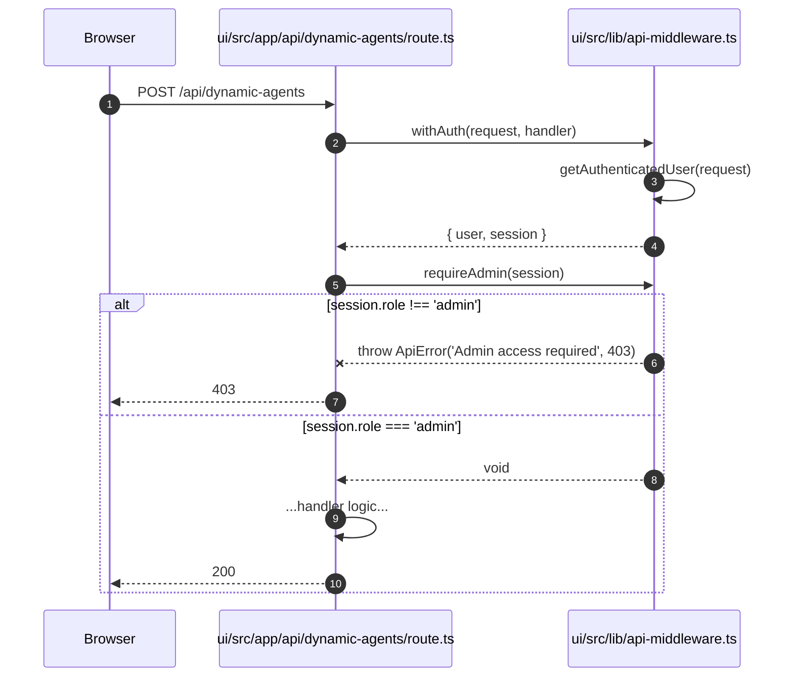
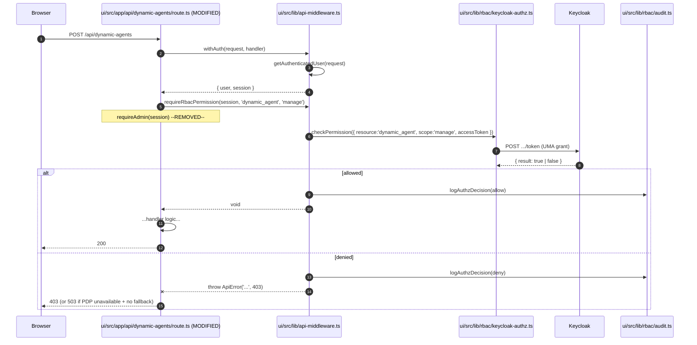
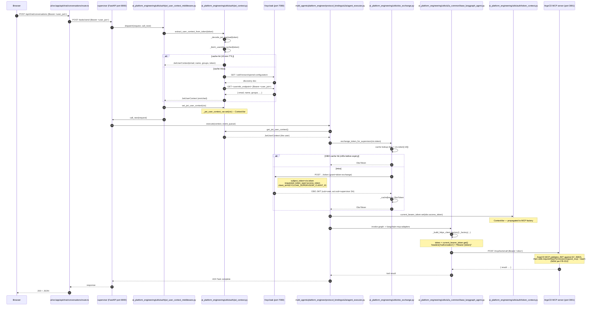
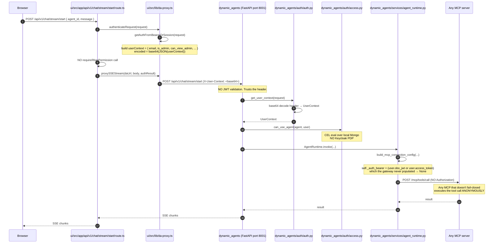
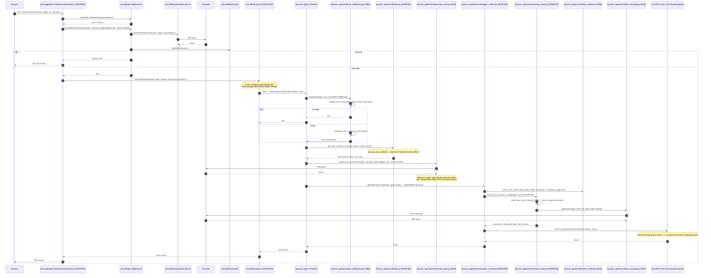
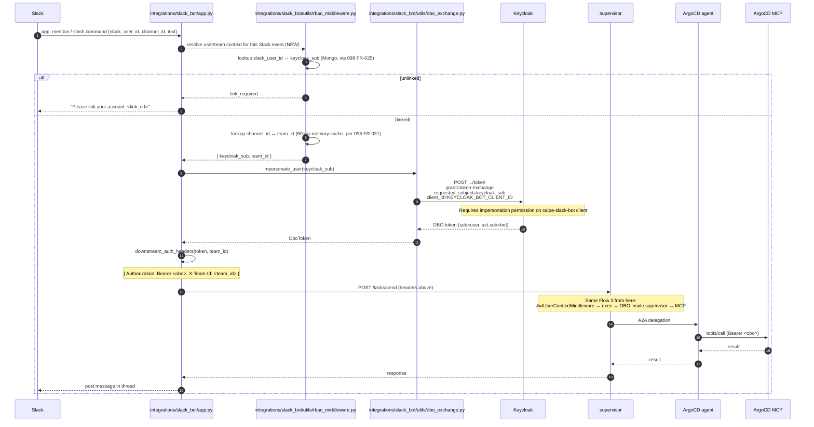
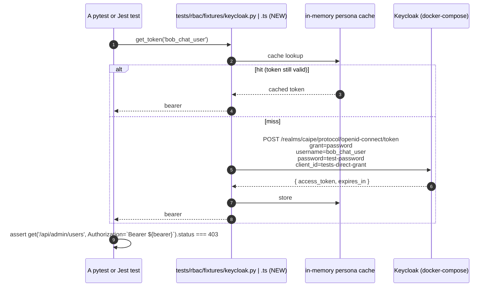
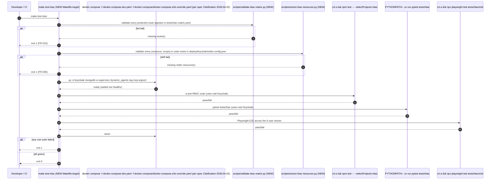

# Code-Level Call Sequence Diagrams

Companion to [`spec.md`](./spec.md). Every box in every diagram below names a **real function in a real file** in this repo (left side of `→`) or the function it will call after the migration in this spec (right side of `→`). When a function is **NEW** (introduced by spec 102), it is annotated `(NEW)`. When a call is **REMOVED** (deprecated by spec 102), the line is annotated `--REMOVED-->`.

This file MUST be kept in sync with the code. It is auto-validated by `scripts/validate-rbac-doc.py` (introduced in this spec — see FR-014).

## Legend

| Symbol | Meaning |
|---|---|
| `file.py::function()` | Python function (full module path) |
| `file.ts::function()` | TypeScript function |
| `(NEW)` | Introduced by this spec |
| `(REMOVED)` | Removed by this spec |
| `(MODIFIED)` | Existing function, signature/behavior changed |
| Solid arrow `->>` | Synchronous call |
| Dashed arrow `-->>` | Return value |
| Note over X | Side effect (audit log, cache write, etc.) |

---

## Flow 1 — Browser hits an Admin BFF route (Story 1)

**Endpoint**: `GET /api/admin/users`

**Today**: Migrated route, already calls `requireRbacPermission`.

**After spec 102**: No change to this specific endpoint, but every other `/api/admin/*` route will follow exactly this pattern.

```mermaid
sequenceDiagram
    autonumber
    participant Browser
    participant Route as ui/src/app/api/admin/users/route.ts
    participant Mw as ui/src/lib/api-middleware.ts
    participant Authz as ui/src/lib/rbac/keycloak-authz.ts
    participant KC as Keycloak (port 7080)
    participant Audit as ui/src/lib/rbac/audit.ts
    participant Mongo as MongoDB (audit collections)
    participant Admin as ui/src/lib/rbac/keycloak-admin.ts

    Browser->>Route: GET /api/admin/users (cookie or Bearer)
    Route->>Mw: withAuth(request, handler)
    Mw->>Mw: getAuthenticatedUser(request)
    Note over Mw: getServerSession(authOptions) - resolves NextAuth session
    Mw-->>Route: { user, session }
    Route->>Mw: requireRbacPermission(session, 'admin_ui', 'view')
    Mw->>Authz: checkPermission({resource:'admin_ui', scope:'view', accessToken})
    Note over Authz: key = sha256(token):admin_ui#view
    Authz->>Authz: pruneExpiredPermissionCache()
    alt cache hit (TTL = RBAC_CACHE_TTL_SECONDS, default 60s; only allow=true is cached)
        Authz-->>Mw: { allowed: true } (cached)
    else cache miss OR previous deny
        Authz->>KC: POST /realms/caipe/protocol/openid-connect/token
        Note right of KC: grant_type=urn:ietf:params:oauth:grant-type:uma-ticket<br/>audience=KEYCLOAK_RESOURCE_SERVER_ID<br/>permission=admin_ui#view<br/>response_mode=decision
        alt PDP returns 200 + result:true
            KC-->>Authz: { result: true }
            Authz->>Authz: permissionDecisionCache.set(key, { result, expiresAt })
            Authz-->>Mw: { allowed: true }
        else PDP returns 403
            KC-->>Authz: 403
            Authz-->>Mw: { allowed: false, reason: 'DENY_NO_CAPABILITY' }
        else PDP unreachable / fetch threw
            KC--xAuthz: network error
            Authz-->>Mw: { allowed: false, reason: 'DENY_PDP_UNAVAILABLE' }
        end
    end

    alt allowed = true
        Mw->>Audit: logAuthzDecision({outcome:'allow', reasonCode:'OK', pdp:'keycloak'})
        Audit->>Mongo: insertOne(authorization_decision_records)
        Audit->>Mongo: insertOne(audit_events)
        Mw-->>Route: void
        Route->>Admin: getKeycloakUsers(page, pageSize)
        Admin->>KC: GET /admin/realms/caipe/users
        KC-->>Admin: User[]
        Admin-->>Route: { users, total }
        Route-->>Browser: 200 + JSON
    else allowed = false (PDP denied)
        Mw->>Mw: hasRoleFallback(token, 'admin_ui', email)
        Note over Mw: RESOURCE_ROLE_FALLBACK['admin_ui'] = 'admin'
        alt user has 'admin' realm role OR isBootstrapAdmin(email)
            Mw->>Audit: logAuthzDecision({outcome:'allow', reasonCode:'OK_ROLE_FALLBACK', pdp:'local'})
            Audit->>Mongo: insertOne(...)
            Mw-->>Route: void  (allow via fallback)
            Route-->>Browser: 200 + JSON
        else no role
            Mw->>Audit: logAuthzDecision({outcome:'deny', reasonCode:'DENY_NO_CAPABILITY', pdp:'keycloak'})
            Audit->>Mongo: insertOne(...)
            Mw--xRoute: throw ApiError('Forbidden', 403)
            Route-->>Browser: 403
        end
    else allowed = false (PDP unreachable, no fallback configured)
        Mw->>Audit: logAuthzDecision({outcome:'deny', reasonCode:'DENY_PDP_UNAVAILABLE', pdp:'keycloak'})
        Audit->>Mongo: insertOne(...)
        Mw--xRoute: throw ApiError('Authorization service unavailable', 503)
        Route-->>Browser: 503
    end
```

**Real code references**:

- Route uses [`withAuth`](../../../../ui/src/lib/api-middleware.ts) — see `ui/src/lib/api-middleware.ts:139` (already exists)
- `requireRbacPermission` body — `ui/src/lib/api-middleware.ts:345` (already exists)
- `checkPermission` body — `ui/src/lib/rbac/keycloak-authz.ts:51` (already exists)
- `logAuthzDecision` body — `ui/src/lib/rbac/audit.ts:107` (already exists)
- `RESOURCE_ROLE_FALLBACK` map — `ui/src/lib/api-middleware.ts:304` (will be **MOVED** to `deploy/keycloak/realm-config-extras.json` per FR-006)

---

## Flow 2 — Migrated legacy route (Story 1, Story 6)

**Endpoint examples** (currently on `requireAdmin`, migrating to Keycloak per spec 102):
- `POST /api/dynamic-agents` (FR-001)
- `GET /api/mcp-servers`
- `POST /api/teams`
- `POST /api/v1/chat/stream/start` (the DA chat route — currently has **no** authz check at all)

**Before** — example, current `POST /api/dynamic-agents/route.ts`:



**After (NEW)** — same endpoint, Keycloak-gated:



The migration is purely **swap `requireAdmin(session)` for `requireRbacPermission(session, '<resource>', '<scope>')`**. Same handler body, same response shape, same error envelope. The `(resource, scope)` tuple comes from `tests/rbac-matrix.yaml` (FR-010).

---

## Flow 3 — Browser → Supervisor → Agent → MCP, with OBO (Story 2)

**Today**: Implemented after PR #1253 + #1145 merges. Untested as a unit.

**After spec 102**: Same wiring, but every box gets a corresponding pytest. The diagram is **unchanged** by this spec — it documents the existing post-merge behaviour we're locking down with tests.



**Real code references**:

- `JwtUserContextMiddleware.dispatch` — `ai_platform_engineering/utils/auth/jwt_user_context_middleware.py:29`
- `extract_user_context_from_token` — `ai_platform_engineering/utils/auth/jwt_context.py:214`
- `_fetch_userinfo_cached` — `ai_platform_engineering/utils/auth/jwt_context.py:188`
- `exchange_token_for_supervisor` — `ai_platform_engineering/utils/obo_exchange.py:60`
- `_build_httpx_client_factory._factory` — `ai_platform_engineering/utils/a2a_common/base_langgraph_agent.py:255`
- `current_bearer_token` ContextVar — `ai_platform_engineering/utils/auth/token_context.py`

**What spec 102 adds (NEW)**:
- The MCP-side `requireRbacPermission('argocd_mcp', 'read')` call — does not exist today (FR-012)
- The supervisor-side per-flow pytest that asserts every step of this diagram against a real Keycloak fixture (FR-008, US-2)

---

## Flow 4 — Custom (Dynamic) Agent chat — current vs. future (Story 6)

This is the largest delta in spec 102. Today the BFF builds an `X-User-Context` header and the DA backend trusts it. After this spec, the BFF forwards the bearer; the DA backend validates it against JWKS and calls Keycloak's PDP.

### 4a — Today (insecure)



**Bugs documented by this diagram** (resolved by spec 102):
- B1: BFF has no per-agent authz check — any signed-in user can chat with any agent
- B2: DA backend trusts a base64 header — anyone who can reach DA directly with a forged header gets admin
- B3: MCP tools called from DA carry no Authorization header — bypasses MCP-side authz entirely

### 4b — After spec 102 (NEW)



**File changes summary for Story 6**:

| File | Change |
|---|---|
| `ui/src/app/api/v1/chat/stream/start/route.ts` | Add `requireRbacPermission(session, 'dynamic_agent:<id>', 'invoke')` |
| `ui/src/app/api/dynamic-agents/route.ts` | Replace `requireAdmin(session)` with `requireRbacPermission(session, 'dynamic_agent', 'manage')` |
| `ui/src/lib/da-proxy.ts` | Remove `X-User-Context` header building; pass through `Authorization` header |
| `ai_platform_engineering/dynamic_agents/src/dynamic_agents/auth/jwt_middleware.py` | **NEW** — Starlette middleware mirroring `JwtUserContextMiddleware` for the supervisor |
| `ai_platform_engineering/dynamic_agents/src/dynamic_agents/auth/auth.py` | Replace base64 header decode with `get_jwt_user_context()` |
| `ai_platform_engineering/dynamic_agents/src/dynamic_agents/auth/access.py` | Add `require_rbac_permission` call as defense-in-depth |
| `ai_platform_engineering/dynamic_agents/src/dynamic_agents/auth/keycloak_authz.py` | **NEW** — Python equivalent of `ui/src/lib/rbac/keycloak-authz.ts` |
| `ai_platform_engineering/dynamic_agents/src/dynamic_agents/auth/token_context.py` | **NEW** — `ContextVar` for the user's bearer (mirrors supervisor) |
| `ai_platform_engineering/dynamic_agents/src/dynamic_agents/auth/obo_exchange.py` | **NEW** — copy of `ai_platform_engineering/utils/obo_exchange.py` for DA's client |
| `ai_platform_engineering/dynamic_agents/src/dynamic_agents/services/mcp_client.py` | Add `httpx_client_factory` reading from `current_user_token` ContextVar |
| `ai_platform_engineering/dynamic_agents/src/dynamic_agents/services/agent_runtime.py` | Set ContextVar at entry; remove direct `_auth_bearer` instance attribute |

---

## Flow 5 — Slack command → Supervisor → MCP, with impersonation OBO (Story 5)

**Today**: Slack bot calls supervisor with its own service account token. User identity is in the Slack message metadata only.

**After spec 102**: Slack bot resolves `slack_user_id → keycloak_sub` (per FR-025 of 098), exchanges via Keycloak impersonation, and forwards the user OBO to the supervisor.



**Real code references**:

- `exchange_token` (subject-token flow) — `ai_platform_engineering/integrations/slack_bot/utils/obo_exchange.py:52`
- `impersonate_user` (subject-id flow used here) — `ai_platform_engineering/integrations/slack_bot/utils/obo_exchange.py:89`
- `downstream_auth_headers` — same file:164
- Existing supervisor flow inherits from Flow 3

**What spec 102 adds (NEW)**:
- `integrations/slack_bot/utils/rbac_middleware.py` already exists — gets a new pytest harness that injects fake Slack events
- The deny-with-explanation path (FR-031 from 098) becomes a tested code path
- The Keycloak realm-config seeds the `caipe-slack-bot` client with token-exchange + impersonation policies (FR-006)

---

## Flow 6 — Test harness: persona-token fixture (Story 7)



The fixture also exposes:
- `with_personas(['alice_admin', 'bob_chat_user', 'dave_no_role'])` — parameterized matrix-driver
- `with_pdp_unavailable()` — context manager that toggles a Keycloak feature flag for the PDP-unavailable path

This fixture is the single mechanism by which **every RBAC test in the repo** obtains identities. New personas added here are immediately usable across Jest, pytest, and Playwright (FR-008).

---

## Flow 7 — `make test-rbac` orchestration (Story 7)



This is the single signal Story 7 cares about — one button, three layers, real Keycloak, hard-gated drift detection.

---

## Flow 8 — Audit-log invariant (Story 1, 6, all stories)

Every gate writes an audit row. This diagram is reused across every flow above; documented once here.

```mermaid
sequenceDiagram
    autonumber
    participant Gate as Any requireRbacPermission call (TS or Py)
    participant Audit as logAuthzDecision()
    participant Stdout
    participant Mongo

    Gate->>Audit: { tenantId, sub, resource, scope, outcome, reasonCode, pdp, email }
    Audit->>Audit: hashSubject(sub) using AUDIT_SUBJECT_SALT
    Audit->>Audit: build AuditEvent { ts, subject_hash, capability, ... }
    Audit->>Stdout: console.log(JSON.stringify(event))
    Note over Stdout: Picked up by log aggregation (Datadog / ELK)

    par dual-write
        Audit->>Mongo: insertOne(authorization_decision_records, doc)
        Note over Mongo: Mongo write is fire-and-forget;<br/>failure logged but does NOT throw
    and
        Audit->>Mongo: insertOne(audit_events, unified shape)
    end

    Audit-->>Gate: AuditEvent (return value, optional)
```

**Real code references**:
- `logAuthzDecision` body — `ui/src/lib/rbac/audit.ts:107`
- `persistAuthzDecisionToMongo` — `ui/src/lib/rbac/audit.ts:21`
- `persistToUnifiedAuditEvents` — `ui/src/lib/rbac/audit.ts:49`

**What spec 102 adds (NEW)**:
- A Python equivalent: `ai_platform_engineering/utils/auth/audit.py::log_authz_decision()` (FR-007)
- Both implementations write to the **same** Mongo collections so a single dashboard surfaces decisions from both layers
- Test assertion helpers in `tests/rbac/fixtures/audit.{py,ts}` that verify a row was written for each tested call

---

## Function-call cross-reference table

Quick lookup: which function lives where, and which tests assert it.

| Function | File | Today | After spec 102 | Tested by |
|---|---|---|---|---|
| `withAuth` | `ui/src/lib/api-middleware.ts:139` | Used | Used | Existing Jest |
| `getAuthenticatedUser` | `ui/src/lib/api-middleware.ts:56` | Used | Used | Existing Jest |
| `requireAdmin` | `ui/src/lib/api-middleware.ts:204` | Used in ~15 routes | **REMOVED** in production routes; kept only for legacy `/api/internal/*` | Negative jest test asserts no production call |
| `requireAdminView` | `ui/src/lib/api-middleware.ts:220` | Used in 1 route | **REMOVED**; replaced by `requireRbacPermission(session, 'admin_ui', 'view')` | jest |
| `requireRbacPermission` | `ui/src/lib/api-middleware.ts:345` | Used in 2 routes | Used in **all** protected routes per FR-001 | Matrix-driven jest |
| `checkPermission` | `ui/src/lib/rbac/keycloak-authz.ts:51` | Used | Used | jest + integration |
| `logAuthzDecision` | `ui/src/lib/rbac/audit.ts:107` | Used | Used | jest |
| `JwtUserContextMiddleware.dispatch` | `ai_platform_engineering/utils/auth/jwt_user_context_middleware.py:29` | Wired in supervisor | Also wired in DA backend (NEW) | pytest |
| `extract_user_context_from_token` | `ai_platform_engineering/utils/auth/jwt_context.py:214` | Used by middleware | Used + **adds Keycloak JWKS validation** | pytest |
| `set_jwt_user_context`, `get_jwt_user_context` | same file:259, 264 | Used | Used | pytest |
| `exchange_token_for_supervisor` | `ai_platform_engineering/utils/obo_exchange.py:60` | Used by supervisor | Used by supervisor; mirror added in `dynamic_agents` | pytest |
| `_build_httpx_client_factory` | `ai_platform_engineering/utils/a2a_common/base_langgraph_agent.py:216` | Used by supervisor | Used by supervisor; mirror added in `dynamic_agents/services/mcp_client.py` | pytest |
| `current_bearer_token` | `ai_platform_engineering/utils/auth/token_context.py` | Used by supervisor | Used by supervisor; mirror added in `dynamic_agents/auth/token_context.py` (NEW) | pytest |
| `exchange_token` | `ai_platform_engineering/integrations/slack_bot/utils/obo_exchange.py:52` | Defined, lightly used | Used in every command path | pytest |
| `impersonate_user` | same file:89 | Defined | Used by every Slack command (preferred over subject-token) | pytest |
| `authenticateRequest` | `ui/src/lib/da-proxy.ts:39` | Builds X-User-Context | **MODIFIED**: drops X-User-Context, passes Authorization through | jest |
| `get_user_context` | `ai_platform_engineering/dynamic_agents/src/dynamic_agents/auth/auth.py` | Reads X-User-Context | **MODIFIED**: reads `get_jwt_user_context()` | pytest |
| `can_view_agent`, `can_use_agent` | `dynamic_agents/auth/access.py` | Local CEL only | **MODIFIED**: also calls Keycloak `dynamic_agent:<id>#invoke` | pytest |
| `build_mcp_connection_config` | `dynamic_agents/services/mcp_client.py` | Static `auth_bearer` from `_auth_bearer` attr | **MODIFIED**: per-request `httpx_client_factory` (FR-005) | pytest |
| `validate_bearer_jwt` (Py) | NEW: `ai_platform_engineering/utils/auth/jwks_validate.py` | n/a | NEW (FR-002) | pytest |
| `require_rbac_permission` (Py) | NEW: `ai_platform_engineering/utils/auth/keycloak_authz.py` | n/a | NEW (FR-003) | pytest |
| `log_authz_decision` (Py) | NEW: `ai_platform_engineering/utils/auth/audit.py` | n/a | NEW (FR-007) | pytest |

---

## How to read these diagrams when reviewing the migration PR

1. **Pick a story** (1 through 8) from `spec.md`.
2. **Read the corresponding flow** (Flow 1 → Story 1, Flow 4 → Story 6, etc.).
3. **For every box** in the diagram, open the file at the line number cited and verify the function does what the diagram says.
4. **For every (NEW) box**, verify the new file exists and has at least one matching pytest/jest in the same PR.
5. **For every (REMOVED) annotation**, run `rg <function-name>` to confirm it has no remaining production callers.
