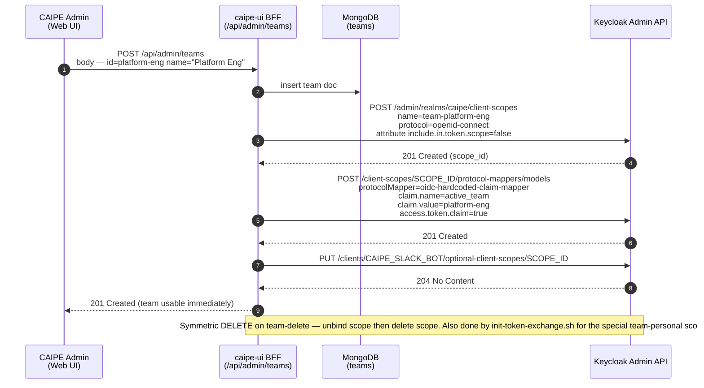
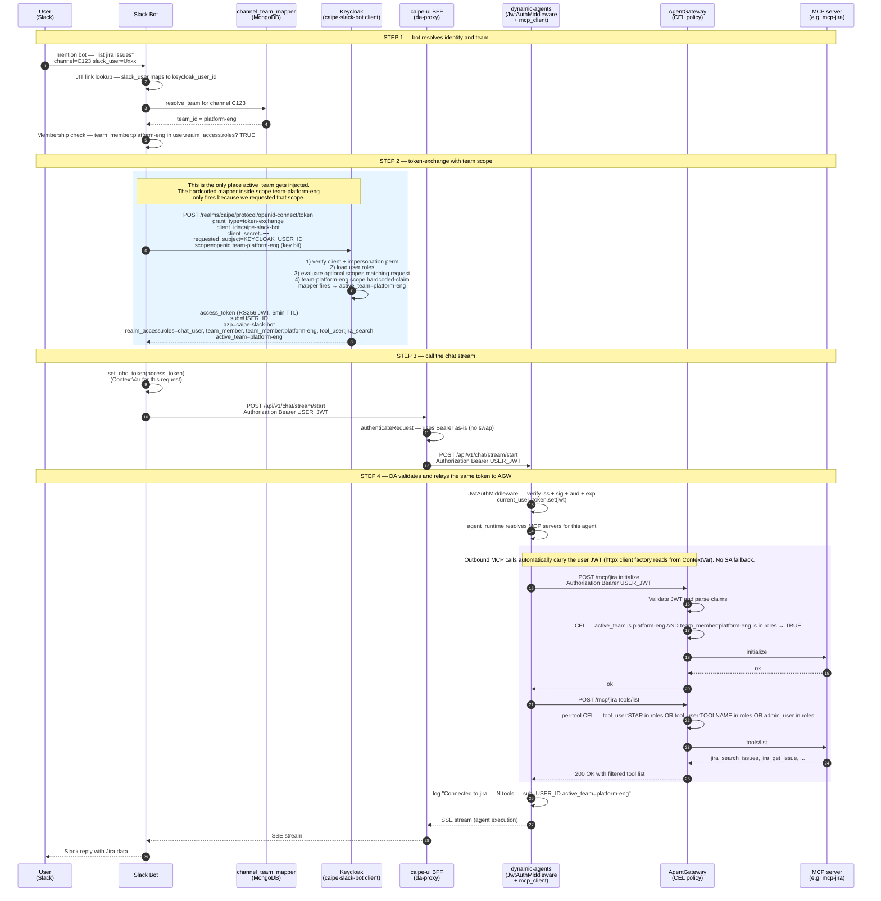
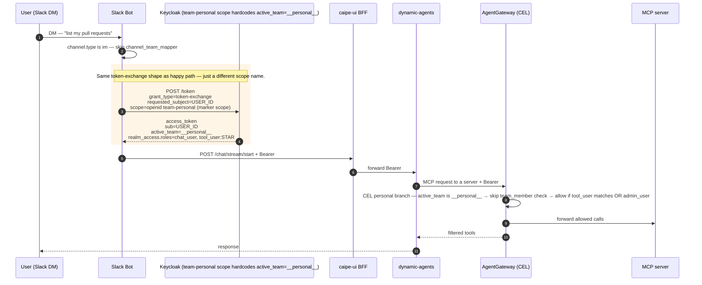
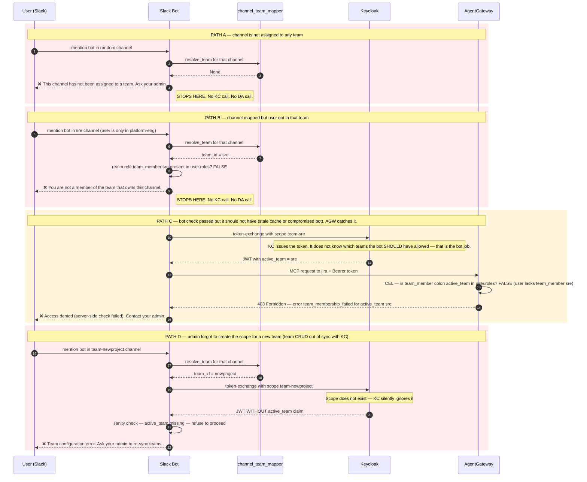

# Active-team Token-scoped RBAC — Design

**Status:** Proposed
**Owner:** Platform Eng
**Spec:** [104 — Team-scoped RBAC](./spec.md)
**Last updated:** 2026-04-22

## Why this exists

Today, the RBAC stack has all the right ingredients but assembles them
inconsistently:

- The Slack bot mints a user-scoped token (RFC 8693 token-exchange / Keycloak
  impersonation) — good.
- It then drops that token somewhere between the bot, the BFF, and
  `dynamic-agents`. Live evidence: AgentGateway logs show `jwt.sub =
  service-account-caipe-slack-bot` even though the bot logs say
  `OBO impersonation succeeded`.
- "Team scope" is half-implemented: the bot resolves a CAIPE `team_id` from
  `channel_team_mappings`, but only the RAG path forwards it (as `X-Team-Id`).
  The chat path drops it entirely.
- `X-Team-Id` is an unsigned out-of-band header — easy to forge, easy to drop,
  invisible in audit logs that only capture the JWT.

This design replaces the ad-hoc header with a signed JWT claim called
`active_team` that rides end-to-end inside the user's access token.

---

## What `active_team` is

`active_team` is a **custom claim** in the user's signed access token. It tells
every downstream service which one of the user's teams the current request is
acting on behalf of.

### Example token (decoded)

```json
{
  "sub": "user-uuid-of-srady",
  "preferred_username": "sraradhy",
  "realm_access": {
    "roles": [
      "chat_user",
      "team_member",
      "team_member:team-platform-eng",
      "team_member:team-sre",
      "tool_user:jira_search_issues"
    ]
  },
  "active_team": "team-platform-eng",
  "aud": "agentgateway",
  "iss": "http://keycloak:7080/realms/caipe",
  "exp": 1776999000
}
```

### Why a signed claim instead of `X-Team-Id`

| Property | `X-Team-Id` (header) | `active_team` (claim) |
|---|---|---|
| Tampering | Forgeable by anything in the request chain | Signed by Keycloak; AGW verifies the signature |
| Audit trail | Lost between hops; needs separate log correlation | One token reveals `sub` + `active_team` + `aud` together |
| Cross-service plumbing | Must be re-added at every hop (BFF, DA, AGW) — easy to drop, which is exactly today's bug | Forwarded automatically with `Authorization: Bearer` |
| Replay/anomaly detection | Custom logic | Same JWT lifetime + revocation rules as identity |
| AGW CEL evaluation | `request.headers["x-team-id"]` (untrusted) | `jwt.active_team` (trusted) |
| Membership safety | Bot must remember to enforce "user ∈ team" before sending | Bot enforces at mint; AGW re-verifies via CEL |

### Special values

| `active_team` value | Meaning |
|---|---|
| `"<team-id>"` | Request is acting on behalf of a specific CAIPE team. AGW enforces user is in that team. |
| `"__personal__"` | Personal mode (Slack DM, web UI for users with no teams). No team-scoped tools allowed; only `tool_user:*`, `tool_user:<name>`, `admin_user`, `chat_user` rules apply. |
| (claim absent) | Treated identically to `__personal__` for back-compat during rollout, but emits a warning log. Should not occur post-rollout. |

---

## Locked design decisions

These were chosen before writing any code:

| Decision | Choice | Rationale |
|---|---|---|
| Where `active_team` is set | **Per-team Keycloak client scope** containing a hardcoded-claim mapper; bot requests `scope=team-<id>` at token-exchange | Confirmed working in spike (Experiment D, see below). Per-token (not per-user), stateless, no race conditions, no per-request user mutation |
| Membership enforcement | **Both bot AND AGW** check that user is in `active_team` (defense-in-depth) | A buggy or compromised bot can't grant access to a team the user isn't in |
| Channel without a team | **Reject in Slack** with "ask your admin" message | Group channels are always team-scoped |
| DM (`im`) | Mint with `active_team="__personal__"` | Users can still chat 1:1 with the bot using their personal tool scopes |
| Web UI | Auto-pick the user's first/only team (or `__personal__` if none) | Avoids extra UI work; team picker is a follow-up |
| Rollout | **Big-bang** — replace AGW CEL atomically; no feature flag | One source of truth; less risk of half-migrated drift |
| `X-Team-Id` | **Removed everywhere** (chat + RAG + UI) | One mechanism, not two |

---

## Sequence diagrams

> **Reading guide.** The Keycloak boxes show what's pre-configured (left of
> the colon) and what fires per request (right of the colon). The team
> client scope is created once per team in the lifecycle diagram below;
> here we show how it gets _used_.

### Diagram 0: Team lifecycle (one-time setup per team)

This happens **once when a team is created**, not on every chat message.



### Diagram 1: Happy path — Slack channel mapped to a team

The full message-time flow. The blue box is where `active_team` enters
the JWT.



### Diagram 2: DM / personal mode

The bot uses a special `team-personal` scope that hardcodes the marker
value. CEL recognizes the marker and skips team-membership checks.



### Diagram 3: Rejection paths

What happens when something is wrong. **Most rejections happen in the bot,
before any token gets minted** — Path C is only triggered if the bot's
state is stale.



---

## File-by-file change summary

| File | Change |
|---|---|
| `charts/ai-platform-engineering/charts/keycloak/scripts/init-token-exchange.sh` | Add a "User Session Note" protocol mapper on `caipe-slack-bot` client: maps session note `active_team` → token claim `active_team` |
| `ai_platform_engineering/integrations/slack_bot/utils/obo_exchange.py` | `impersonate_user(user_id, *, active_team, audience="agentgateway")` — sends session note via token-exchange. **Delete** `downstream_auth_headers()` X-Team-Id branch. |
| `ai_platform_engineering/integrations/slack_bot/app.py` (`_rbac_enrich_context`) | Resolve channel→team, verify membership, choose `__personal__` for DMs, reject for unmapped group channels, then mint token with the right `active_team` |
| `ai_platform_engineering/integrations/slack_bot/sse_client.py` | No change (already forwards Bearer). Drop any place that ever set `X-Team-Id` (none in chat path; sanity check). |
| `ui/src/lib/da-proxy.ts` | No change. Already forwards Bearer as-is. Verify no X-Team-Id forwarding code exists. |
| `ai_platform_engineering/dynamic_agents/src/dynamic_agents/auth/jwt_middleware.py` | Accept tokens with `aud=agentgateway` (in addition to its current expected audience). Log `sub=`, `active_team=`, `aud=` on success. |
| `ai_platform_engineering/dynamic_agents/src/dynamic_agents/services/mcp_client.py` | Add log line in `_factory`: `AGW outbound: sub=<sub> active_team=<at> server=<server_id>`. Confirm no SA-fallback path exists. |
| `deploy/agentgateway/config.yaml` | Rewrite CEL: replace bare `"team_member" in roles` checks with `jwt.realm_access.roles.contains("team_member:" + jwt.active_team)`; add explicit `__personal__` branch; keep `tool_user:*`/`admin_user` short-circuits. Avoid AGW 0.12 CEL forms `has(...)`, `in`, and `.exists(...)` against JWT role arrays because the live playground shows they either return false or panic the gateway. |
| `ai_platform_engineering/knowledge_bases/rag/server/src/server/{rbac.py,restapi.py}` | Remove `X-Team-Id` reads; replace with `jwt.active_team` claim. |
| `ui/src/app/api/rag/[...path]/route.ts`, `ui/src/app/api/rag/kb/[...path]/route.ts` | Remove `X-Team-Id` forwarding. |
| `docs/docs/specs/098-enterprise-rbac-slack-ui/how-rbac-works.md`, `docs/docs/security/rbac/*.md` | Document the new flow + sequence diagrams |
| Tests across `slack_bot/tests/`, `dynamic_agents/tests/`, `ui/src/**/__tests__/` | Update any test that asserts on `X-Team-Id`; add tests for `active_team` end-to-end |

---

## Spike results (Keycloak 26.3.5, run 2026-04-22)

We ran four experiments against the live `keycloak` container in the dev
docker-compose stack to determine which Keycloak mechanism can carry
`active_team` into a token-exchanged JWT.

### Setup

- Keycloak 26.3.5, realm `caipe`, client `caipe-slack-bot`, RFC 8693
  token-exchange + impersonation already configured by the existing
  `init-token-exchange.sh` script.
- Test user: `admin@example.com` (Keycloak `sub` =
  `dc5460b8-1a56-4b58-a5e0-b163b110aded`).
- All token-exchange calls used the bot's `client_id` + `client_secret`
  with `requested_subject=<test-user-id>`.

### Results

| # | Approach | Outcome | Notes |
|---|---|---|---|
| **A** | "User Session Note" mapper, set the note via `session_note:active_team=...` request parameter | ❌ Fails | Mapper installs cleanly (HTTP 201). Token mints. **`active_team` claim does not appear.** Pure token-exchange does not pass request params into the user session model — session notes are only populated during interactive flows or via the SPI. |
| **B** | "User Model Attribute" mapper + bot mutates user attribute via Admin API right before mint | ✅ Works | Token contains `"active_team": "team-platform-eng"`. **Reliable but racy** — concurrent requests for the same user with different teams would interfere unless we serialize on `user_id`. Adds two extra Admin API round-trips per request. |
| **C** | "Claims Parameter Token" mapper + OIDC `claims=…` request parameter | ❌ Fails | Mapper marshals only claims that already have a source (user attributes, roles). It cannot accept arbitrary values from the request. |
| **D** | One client scope per team named `team-<id>`, each containing an `oidc-hardcoded-claim-mapper` that hardcodes `active_team=<id>`; bot requests `scope=team-<id>` at mint time | ✅ **Works cleanly** | Token contains `"active_team": "team-platform-eng"` only when the matching scope is requested. With `include.in.token.scope=false` the team name does NOT leak into the `scope` claim. Stateless; no per-request mutation; no concurrency hazard. |

### Edge cases verified for Approach D

| Edge | Result |
|---|---|
| Bot requests a scope that doesn't exist (`scope=team-nonexistent`) | KC silently ignores it, token mints with no `active_team` claim. **Bot must ensure scope exists before requesting it** (one-time admin call when a team is created). |
| Bot requests no team scope at all | Token mints with no `active_team` claim. CEL can either treat absence as `__personal__`, OR we pre-create a `team-personal` scope with a hardcoded `active_team="__personal__"` mapper. **Recommended: pre-create the explicit scope** for auditability. |
| Same scope requested twice | Idempotent (mapper fires once). |
| Bot requests two team scopes (`scope=team-A team-B`) | Both mappers fire; the resulting `active_team` claim becomes the value of whichever mapper Keycloak evaluates last (undefined). **Bot MUST request exactly one team scope per token-exchange.** |

### Decision

Adopt **Approach D (per-team client scope with hardcoded-claim mapper)** for production.

**Why D over B (user-attribute):**
- D is stateless (no DB writes per request).
- D has zero concurrency hazards.
- D requires only an admin API call when teams are *created*, not on
  every chat message.
- B's two extra round-trips on every Slack message (set attr → mint →
  revert attr) double the Keycloak load and create a window where a
  parallel request would see the wrong attribute.

**Cost of D:** the team-management code path (where teams are created and
deleted in the admin UI) must also create/delete the matching client
scope. This is a small extension to existing CRUD; we can either:

- Embed the call in the BFF team-create endpoint (simpler), or
- Add a Keycloak-sync background job that reconciles teams ↔ scopes
  (more robust to drift; recommended for production).

### Updated implementation plan (delta from original)

| File | Original plan | Revised plan |
|---|---|---|
| `init-token-exchange.sh` | Add User Session Note mapper on `caipe-slack-bot` client | (no change to bot client) Add idempotent block that ensures a `team-personal` client scope exists with a hardcoded mapper `active_team="__personal__"`, and assigns it as an optional scope on the bot client. |
| BFF/admin team CRUD (`ui/src/app/api/admin/teams/route.ts`) | (n/a) | On team create: call KC Admin API to create client scope `team-<id>` with hardcoded-claim mapper `active_team=<id>` and assign as optional scope on `caipe-slack-bot`. On team delete: remove scope. |
| `slack_bot/utils/obo_exchange.py` `impersonate_user(...)` | Add `active_team` arg → session note | Add `active_team` arg → adds `scope=team-<active_team>` (or `team-personal` for `__personal__`) to the form-encoded body. Validation: must be exactly one team scope per call. |
| Everything else | unchanged | unchanged |

### Audience handling

The Slack-bot mint uses `aud=agentgateway`. `dynamic-agents`'
`JwtAuthMiddleware` currently expects its own audience. Two options:

- Have DA accept multiple audiences (`["dynamic-agents", "agentgateway"]`).
- Have the bot mint a token with `aud=["dynamic-agents", "agentgateway"]`
  (Keycloak supports multi-aud).

Both are fine; the second is cleaner long-term.

### Web UI rollout

The first-team auto-pick decision means UI sessions need to learn the user's
teams at sign-in and inject `active_team` into the BFF request. Two viable
implementations:

- BFF reads `session.user.teams[0]` and re-mints a Keycloak impersonation
  token per request (matches the Slack flow exactly).
- NextAuth refreshes the token at sign-in with `active_team` embedded.

Pick whichever lines up with how the BFF currently obtains the access token.

### Dropping `X-Team-Id` from the RAG path

The RAG team headers were a working contract. Removing them is a behavioural
change for any client (including curl scripts and tests) that calls RAG
directly. Inventory all callers before deleting the read-side; clients then
get migrated in lockstep with the AGW CEL change.

---

## Acceptance criteria

The change is done when **all** of these are true:

1. AgentGateway logs for a Slack-originated tool call show
   `jwt.sub=<user-uuid>` (not the slack-bot service account).
2. AgentGateway access logs include `active_team` in the structured fields
   (either parsed from the JWT or echoed in CEL audit).
3. `dynamic-agents` log line on tool load reads
   `Connected to 'jira': N tools (sub=<user>, active_team=<team-id>)` with
   `N > 0` for users in the team.
4. A test user added to `team-platform-eng` only, posting in `#team-sre`,
   gets the rejection message from Path B above and **no** AGW request is
   made.
5. A DM to the bot mints a token with `active_team="__personal__"` and the
   user can use any non-team-scoped tool they're entitled to.
6. `grep -r "X-Team-Id" .` returns zero hits in production paths
   (test fixtures and spec docs may still reference it for historical
   context).
7. AGW CEL contains no bare `"team_member" in roles` checks; every
   team-scoped rule uses `jwt.active_team`.

---

## Related

- [Spec 104 — Team-scoped RBAC](./spec.md)
- [Spec 098 — Enterprise RBAC + Slack UI](../098-enterprise-rbac-slack-ui/spec.md)
- [Spec 102 — Comprehensive RBAC tests and completion](../102-comprehensive-rbac-tests-and-completion/spec.md)
- [How RBAC works (canonical reference)](../098-enterprise-rbac-slack-ui/how-rbac-works.md)
- [AgentGateway CEL config](/Users/sraradhy/outshift/caipe/ai-platform-engineering-feat-comprehensive-rbac/deploy/agentgateway/config.yaml)
