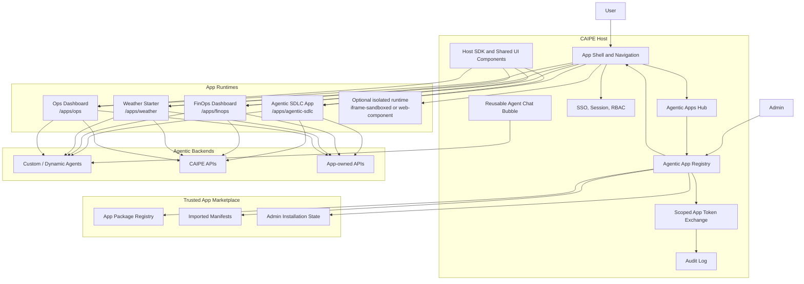
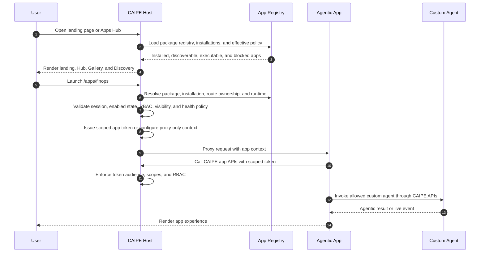

# Agentic Apps Platform — Admin-installed apps for the CAIPE UI

> **Status:** DRAFT — approved direction, pending implementation plan.
> **Author:** Sri Aradhyula (assisted-by Cursor claude-opus-4.7; updated with GPT-5.5)
> **Date:** 2026-05-07
> **Type:** Platform / architecture
> **Companion of:** `docs/docs/specs/2026-05-05-agentic-sdlc-ship-loop-ui/`
> **Tracking PR:** Not opened yet.

---

## Executive summary

CAIPE needs an **Agentic Apps Platform** so organizations can install and run
their own agentic UI apps — for example Agentic SDLC, FinOps Dashboard, Weather
Starter, Ops Dashboard, or a domain-specific operational workbench — without
hardcoding each new experience into the CAIPE shell.

The proposed model keeps CAIPE as the **host and security boundary**. CAIPE owns
SSO, RBAC, app installation state, Apps Hub, app routing, scoped token exchange,
audit logs, shared UI primitives, and the reusable chat bubble. Apps own their
domain UI, app-specific APIs, data views, and custom-agent workflows. The
default runtime is a **separate app process/container** accessed through CAIPE
under a same-origin path such as `/apps/agentic-sdlc` or `/apps/finops`.

The first implementation is a **trusted-admin marketplace**, not a public
self-service marketplace. Admins can import/register app manifests, inspect
available packages in a Gallery/Discovery experience, install and enable apps,
set visibility and RBAC, choose the authenticated landing experience, and launch
apps through CAIPE's execution gateway. Public user-submitted publishing,
approval queues, and package-signing workflows are intentionally deferred, but
the registry stores package, version, and provenance metadata so those controls
can be added later.

The entire platform is deny-by-default behind a server-only install toggle:
`AGENTIC_APPS_INSTALL_ENABLED=true`. When the toggle is unset or false, the host
hides Apps navigation and landing behavior, returns 404 for Agentic Apps user
and admin APIs, and blocks `/apps/:appId` execution before any upstream app
runtime is contacted. The host must not honor `NEXT_PUBLIC_` variants of this
toggle; browser-visible configuration cannot enable app installation.

## 1. Problem

CAIPE’s Next.js UI today hosts a growing set of feature areas — Chat, Skills, Knowledge Bases, Dynamic Agents, Admin, Insights, and Agentic SDLC. Each one is **folder-modular** (`ui/src/components/<feature>/`, `ui/src/app/(app)/<feature>/`, `ui/src/app/api/<feature>/`) but its *integration with the platform* is hand-wired in three or four places:

- Top-nav pill in `ui/src/components/layout/AppHeader.tsx` (manual edit, with feature-specific gating logic inline).
- Per-user feature flag in the static `FEATURE_FLAGS` array in `ui/src/store/feature-flag-store.ts`.
- Server-side env booleans in `ui/src/lib/config.ts` (`Config` and `ClientConfig` interfaces).
- Documentation in `ui/env.example`.

Every new feature — even small ones — must touch all four files, plus its own folders. There is no single place that says *“this is what Agentic SDLC owns”* or *“these are the apps currently installed in the platform.”* This is fine for a handful of features owned by one team, but it does not scale to:

1. Organizations that want to customize CAIPE with their own agentic apps, such as Agentic SDLC, FinOps Dashboard, Weather Starter, Ops Dashboard, or domain-specific operational workbenches.
2. App teams that need independent build/deploy ownership, often as separate processes or containers.
3. Admins who need to install, enable, disable, and audit apps before end users see them.
4. End users who need an **Agentic Apps Hub** and, optionally, an admin-selected app as their CAIPE home page.
5. Apps that need CAIPE-provided identity, RBAC, scoped token exchange, reusable chat, custom-agent access, and common UI components without directly sharing root secrets.
6. A near-term need to extract the Agentic SDLC chat bubble into a reusable host component.

The Python platform side already lives one tier ahead: `ai_platform_engineering/multi_agents/agent_registry.py` discovers enabled agents from `ENABLE_*` env vars and composes them via A2A at runtime. The UI side should adopt an analogous pattern for app installation and composition.

## 2. Goals

- Define a stable **Agentic App manifest** that declares app identity, routes, runtime mode, permissions, RBAC requirements, custom-agent bindings, token scopes, health checks, navigation, and home-page eligibility.
- Provide a persistent **trusted-admin app package registry** backed by MongoDB. Admins can import/register trusted manifests, then install and govern apps.
- Provide an **Agentic Apps Hub** where users launch installed apps and see recently used, recommended, executable, and blocked apps.
- Provide **Gallery and Discovery** surfaces where users and admins browse available app packages by category, capability, owner, required agent, runtime type, health, install status, and visibility.
- Allow an admin to choose an installed app as the authenticated CAIPE landing page.
- Enforce app launch through a host **execution gateway** that validates install state, enabled state, RBAC/visibility, runtime health policy, and scoped capabilities before proxying or launching an app.
- Gate the entire Agentic Apps installation and marketplace surface behind `AGENTIC_APPS_INSTALL_ENABLED=true`.
- Support separately running apps by default, using a same-origin reverse proxy / Next.js Multi-Zones style model under `/apps/:appId`.
- Keep CAIPE as the security owner: host-managed SSO, RBAC, session validation, scoped app tokens, and audit logs.
- Provide a reusable host SDK and component set: app shell bridge, RBAC helpers, API client, live-event helpers, and a reusable agent chat bubble.
- Migrate incrementally. Agentic SDLC becomes the first app, FinOps Dashboard
  proves the separate-runtime contract, and Weather Starter provides a
  CopilotKit/AG-UI-first template that app teams can copy.

## 3. Non-goals

- **Public marketplace / self-service publishing** of arbitrary apps by end users. The first slice supports trusted admin import/register only.
- **Full app signing, moderation, and approval queues.** The registry records provenance metadata and validation status, but hard package-signature enforcement and public submission workflows are later phases.
- **Untrusted third-party code execution** inside the CAIPE React tree. Remote apps are trusted by the deploying organization and reviewed before install.
- **Webpack Module Federation as the default.** Current CAIPE uses Next.js 16 + App Router + Turbopack; Module Federation support for this stack is not a stable default.
- **Direct sharing of root/provider tokens with apps.** Apps get scoped app tokens or proxied capabilities.
- **Replacing the Python `AgentRegistry`** or changing how agents are composed. Apps may require custom agents, but the backend agent model remains separate.
- **Big-bang migration.** Existing feature areas can adopt the registry one at a time.

## 4. Direction at a glance



The primary runtime is **same-origin, route-level composition**. Apps run as
their own processes or containers, but users access them through CAIPE-owned
paths such as `/apps/agentic-sdlc` or `/apps/finops`. This is aligned with
Next.js Multi-Zones, while leaving room for non-Next apps behind the same
proxy contract.

### Generative UI starter pattern

Agentic apps may use CopilotKit and AG-UI inside their own runtime, but CAIPE
does not depend on those libraries to enforce platform security. CAIPE remains
responsible for installation, launch authorization, scoped app context, and
proxying. The app runtime is responsible for rendering its domain UI and for
connecting to a custom agent through a constrained, typed interaction contract.

The Weather Starter app is the first template for this pattern. It demonstrates
an AG-UI-style event envelope and a CopilotKit `useCopilotAction` boundary for
known weather components such as current conditions, forecast timelines, alerts,
and recommendations. The template intentionally favors **static/declarative
generative UI** over arbitrary HTML so app teams get a safe copyable example:
agents choose known surfaces and pass typed props; the app renders predefined
components. This follows the generative UI spectrum described by CopilotKit,
where static/declarative surfaces preserve brand and security controls while
still giving agents room to adapt layout and content.

Weather also demonstrates the first **integrated web UI** shape: `/apps/weather`
is a CAIPE-owned page that keeps the host chrome visible and renders known
weather surfaces from the app's AG-UI endpoint, while `/apps/weather/embed`
proxies the app's fragment endpoint for teams that need a fragment-only
contract. The fragment endpoint returns inner app content only; it is not a full
HTML document and does not own CAIPE navigation, auth, or global styling.

### App launch and token flow



## 5. The Agentic App contract

An Agentic App package is declared through a manifest. The first implementation
persists trusted admin-imported manifests in MongoDB and may also seed built-in
packages from source control or Helm values. Source-control manifests are useful
for packaged defaults such as Agentic SDLC and FinOps, but the registry contract
must not depend on rebuilds for every new trusted app package.

```ts
export interface AgenticAppManifest {
  /** Stable kebab-case id. Also used as the default URL segment. */
  id: string;

  /** Human-readable name shown in Apps Hub, nav, settings, and audit logs. */
  displayName: string;

  /** Short user-facing description for the Apps Hub. */
  description: string;

  /** Manifest contract version. */
  apiVersion: "1.0";

  /** Runtime model used to render this app. */
  runtime: {
    /**
     * - "proxied-next-zone": app runs separately and is reverse-proxied by path.
     * - "iframe-sandboxed": app is embedded with sandbox and postMessage bridge.
     * - "web-component": app exports a custom element/widget.
     * - "in-process": legacy/in-repo module loaded by CAIPE's React tree.
     */
    kind:
      | "proxied-next-zone"
      | "iframe-sandboxed"
      | "web-component"
      | "in-process";
    /** Internal service origin, e.g. http://agentic-sdlc-ui:3000. */
    origin?: string;
    /** Public CAIPE path. Defaults to `/apps/${id}`. */
    mountPath: string;
    /** Optional asset prefix for Next.js zones. */
    assetPrefix?: string;
  };

  /** Apps Hub and navigation contributions. */
  surfaces: {
    showInHub: boolean;
    showInTopNav?: boolean;
    navOrder?: number;
    /** Admin may select this as the authenticated landing page. */
    homeEligible?: boolean;
    /** App can contribute host overlays such as the reusable chat bubble. */
    overlays?: Array<"agent-chat-bubble" | string>;
  };

  /** Security and access requirements enforced by CAIPE host. */
  access: {
    /** Required CAIPE roles/groups. Empty means any authenticated user. */
    requiredRoles?: string[];
    requiredGroups?: string[];
    /**
     * App-scoped token permissions. The host exchanges the user's session for
     * a short-lived app token with these capabilities.
     */
    tokenScopes: string[];
    /** Whether the app may call custom/dynamic agents on behalf of the user. */
    canUseCustomAgents?: boolean;
  };

  /** Agentic capabilities the host can validate and display. */
  agents?: Array<{
    id: string;
    displayName: string;
    required: boolean;
    /** Optional dynamic-agent id or selector. */
    dynamicAgentId?: string;
    capabilities?: string[];
  }>;

  /** Data and event integration points. */
  data?: {
    apiBasePath?: string;
    eventChannels?: string[];
    mongoCollections?: string[];
  };

  /** Operational checks used by Admin and /api/admin/apps. */
  health: {
    endpoint: string;
    timeoutMs?: number;
  };
}
```

### Package and installation records

The manifest describes what an app package is. CAIPE stores two additional
records so Gallery/Discovery and execution are driven by admin policy, not by
hardcoded routes.

```ts
export interface AgenticAppPackage {
  /** Stable package id, usually matching manifest.id. */
  packageId: string;
  /** Manifest contract. Stored as validated JSON, not arbitrary code. */
  manifest: AgenticAppManifest;
  /** Package version shown in Gallery and used for upgrade decisions. */
  version: string;
  /** Who owns/supports the app package. */
  owner: {
    name: string;
    email?: string;
    url?: string;
  };
  /** Discovery metadata. */
  catalog: {
    categories: string[];
    tags: string[];
    capabilities: string[];
    screenshots?: string[];
    documentationUrl?: string;
  };
  /** Trusted-admin provenance metadata. */
  provenance: {
    source: "builtin" | "admin-import" | "helm" | "api";
    importedBy?: string;
    importedAt: string;
    validationStatus: "valid" | "warning" | "blocked";
    validationMessages: string[];
  };
  createdAt: string;
  updatedAt: string;
}

export interface AgenticAppInstallation {
  appId: string;
  packageId: string;
  version: string;
  installed: boolean;
  enabled: boolean;
  visibleInHub: boolean;
  homeEligible: boolean;
  isDefaultLanding: boolean;
  runtimeOverrides?: {
    origin?: string;
    mountPath?: string;
    assetPrefix?: string;
  };
  accessOverrides?: {
    requiredRoles?: string[];
    requiredGroups?: string[];
    tokenScopes?: string[];
    canUseCustomAgents?: boolean;
  };
  health: {
    status: "unknown" | "healthy" | "degraded" | "unreachable";
    lastCheckedAt?: string;
    message?: string;
  };
  installedBy?: string;
  installedAt?: string;
  updatedAt: string;
}
```

Package records power the **Gallery/Discovery** experience. Installation records
power the **Hub, landing page, admin management, and execution gateway**.

### Host-provided contract

CAIPE owns the following surfaces and makes them available to apps:

- **Identity context:** user id, email, display name, groups, CAIPE role, and selected tenant/org.
- **Scoped app token:** short-lived, audienced to the app id, carrying only declared `tokenScopes`.
- **RBAC helpers:** a host endpoint or SDK helper for checking current permissions.
- **Reusable chat bubble:** a host component that can attach to any app and route to a configured custom/dynamic agent with app context.
- **Design system:** shared UI primitives, icons, shell spacing, empty states, and live-status indicators.
- **Event bridge:** standard SSE/browser events for app-scoped live updates.
- **Audit trail:** app launch, token exchange, denied access, and app-admin changes are logged by the host.

### Runtime modes

`proxied-next-zone` is the default. It gives us separate processes/containers,
independent app deployments, and good Next.js App Router compatibility. It
requires unique route ownership and careful asset prefixes, matching the
official Next.js Multi-Zones model.

`iframe-sandboxed` is reserved for apps that need stronger DOM isolation. The
host must use `sandbox`, strict `frame-ancestors`, explicit allowed origins,
and a typed `postMessage` bridge. Apps embedded this way must never receive raw
tokens through URLs or local storage.

`web-component` is for small widgets, not primary full-page apps.

`in-process` remains useful for current CAIPE-native modules and the first
migration slice, but it should not be the default for organization-owned apps
that need independent deployment.

### Legacy in-process module contract

A single typed object per feature, lives at `ui/src/modules/<id>/module.ts`, exports `default`.

```ts
// ui/src/modules/_types.ts
export interface AppModule {
  /** Stable, kebab-case id. Becomes the URL prefix and the registry key. */
  id: string;

  /** Human-readable name shown in nav, settings panel, and audit logs. */
  displayName: string;

  /** lucide-react icon name (string, not the React component, for SSR sanity). */
  icon: string;

  /** SemVer of this module's manifest. Lets the host warn on incompatible
   *  contracts after Tier 2 extraction. Bumped when the manifest shape changes
   *  in a way modules need to know about. */
  apiVersion: "1.0";

  /** Top-nav contribution. Omit if the module has no main pill (e.g. an
   *  overlay-only module or an admin-only module that lives under /admin). */
  nav?: {
    /** Where the pill links to. Must start with `/`. */
    href: string;
    /** Order weight. Lower = further left. Conflicts resolved alphabetically. */
    order: number;
    /** Optional badge text (e.g. "Preview"). */
    badge?: "preview" | "beta" | string;
  };

  /** Server-env declaration. The host generates env.example from this and
   *  exposes a single `getModuleConfig(id)` helper. Secrets stay server-only. */
  env?: {
    /** REQUIRED: env var name → human description for env.example. */
    required?: Record<string, string>;
    /** OPTIONAL with defaults. */
    optional?: Record<string, { default: string | boolean | number; description: string }>;
    /** Names of vars whose values must NEVER reach the browser. Enforced
     *  by the host's getClientConfig() filter. */
    serverOnly?: string[];
  };

  /** Server-level kill switch. Function so it can read process.env at
   *  runtime; called once per request on the server. Defaults to `true`. */
  serverEnabled?: () => boolean;

  /** Per-user feature flag declaration. The host adds this to
   *  feature-flag-store's FEATURE_FLAGS array at registry-build time. Omit
   *  if the module is on whenever serverEnabled() is true. */
  userFlag?: {
    id: string;                  // store key, e.g. "shipLoop"
    label: string;
    description: string;
    detail: string;
    defaultValue: boolean;
    category: "ai" | "chat" | "developer";
    preferencesKey: string;      // MongoDB-side key, kept stable across renames
    docsUrl?: string;
  };

  /** MongoDB collection names this module owns. The host can audit /
   *  generate migration scripts / refuse to start if collections collide. */
  mongoCollections?: string[];

  /** Cross-module UI contributions. Each is optional. */
  contributions?: {
    /** Bottom-right (or other anchored) overlays. The host renders these
     *  in a single floating layer with deterministic z-index. */
    overlays?: Array<{
      id: string;
      load: () => Promise<{ default: React.ComponentType }>;
      placement: "bottom-right" | "bottom-left" | "top-right";
    }>;

    /** Command-palette / user-menu entries. */
    menuItems?: Array<{
      id: string;
      label: string;
      icon?: string;
      href?: string;
      action?: string;            // string id resolved by the module
    }>;

    /** Background workers / projectors / queue consumers. The host starts
     *  these in process at boot when the module is enabled. Each is
     *  responsible for its own lifecycle (graceful shutdown via AbortSignal). */
    workers?: Array<{
      id: string;
      load: () => Promise<{ default: (signal: AbortSignal) => Promise<void> }>;
    }>;
  };

  /** Optional self-test the host can run on startup or via /healthz to
   *  verify the module is configured correctly (DB indexes present, env
   *  vars resolved, etc). Returns null on success or a string explaining
   *  the failure. Does NOT throw. */
  healthcheck?: () => Promise<string | null>;
}
```

**What is NOT in the contract:**

- React components for the module's pages and API routes are still discovered through Next.js's filesystem routing (`ui/src/app/(app)/<id>/`, `ui/src/app/api/<id>/`). The contract is about *cross-cutting* registration, not about routing — Next.js already does routing.
- Direct access to host-internal modules (`@/lib/mongodb`, `@/lib/auth-config`, etc.) is not part of the contract today. Modules import them directly. Tier 2 will introduce a `@caipe/host-sdk` import surface so modules can drop the `@/` aliases — but Tier 1 leaves that as-is to keep the diff small.

## 6. Trusted marketplace registry, admin installation, and execution

```ts
// ui/src/modules/_registry.ts
//
// Tiny, dependency-free registry. Lazy dynamic imports keyed by env flags
// mean disabled modules cost zero KB on the client.
//
// MODULES_ENABLED is a comma-separated env var, e.g.
//   MODULES_ENABLED=agentic-sdlc,dynamic-agents,knowledge-bases

import type { AppModule } from "./_types";

const ALL_MODULE_IDS = [
  "agentic-sdlc",
  "dynamic-agents",
  "skills",
  "knowledge-bases",
  "admin",
  "insights",
] as const;

let cache: ReadonlyArray<AppModule> | null = null;

export async function getEnabledModules(): Promise<ReadonlyArray<AppModule>> {
  if (cache) return cache;
  const enabled = (process.env.MODULES_ENABLED ?? "")
    .split(",")
    .map((s) => s.trim())
    .filter(Boolean);
  const valid = ALL_MODULE_IDS.filter((id) => enabled.includes(id));
  const modules: AppModule[] = [];
  for (const id of valid) {
    const mod = await import(`./${id}/module`);
    if (mod?.default?.id !== id) {
      throw new Error(`module ${id} did not export a default AppModule with matching id`);
    }
    modules.push(mod.default);
  }
  Object.freeze(modules);
  cache = modules;
  return modules;
}
```

The original in-process registry above remains useful for migrating existing
CAIPE-native modules. The broader Agentic Apps Platform adds a trusted
marketplace registry and admin-controlled installation layer on top:

1. **Package registry:** MongoDB stores trusted app packages and validated
   manifests. Packages may be seeded from source control/Helm or imported by an
   admin through the UI/API. Public self-service publishing is not part of this
   slice.
2. **Gallery/Discovery index:** the host materializes package metadata into a
   browseable catalog. Users can discover packages by category, capability,
   owner, required agent, runtime kind, health, install status, and access
   status.
3. **Admin installation state:** MongoDB records whether a package is installed,
   enabled, visible in the hub, home-eligible, default landing, and which
   roles/groups can use it. Runtime origins and mount paths can be overridden by
   admin policy.
4. **Runtime status:** health checks and required-agent checks produce cached
   per-installation status. Admins see the raw health result; users see only
   actionable launch status.
5. **Policy materialization:** the host turns package + installation state into
   landing behavior, Apps Hub cards, Gallery badges, route guards, token-exchange
   policy, execution gateway decisions, and audit-log fields.

Suggested collections:

- `agentic_app_packages` — trusted package metadata, validated manifest JSON,
  catalog metadata, version, owner, and provenance.
- `agentic_app_installations` — admin installation settings, enabled state,
  visibility/RBAC overrides, default landing selection, runtime overrides, and
  health cache.
- `agentic_app_events` — app lifecycle audit trail: import, install, enable,
  disable, RBAC changes, health changes, launch, token exchange, and denied
  execution.
- `agentic_app_tokens` — optional hashed/token metadata if issued tokens need
  revocation tracking.

Admin import/register is package registration, not arbitrary code execution.
The host accepts manifest JSON and metadata from admins, validates the manifest
shape, validates route ownership, rejects unsupported runtime modes, and records
provenance. App code still runs in a separately deployed process/container or as
an existing built-in module; CAIPE does not execute uploaded JavaScript bundles.

### Product surfaces

- **Landing page:** authenticated users land on the admin-selected default
  experience: CAIPE Home, Apps Hub, or an installed/home-eligible app. If the
  selected app is disabled, unhealthy, or inaccessible to the user, the host
  falls back to Apps Hub and explains why.
- **Apps Hub:** shows installed and user-executable apps first, plus recently
  launched apps, recommended apps, blocked apps with reason codes, and active
  execution/health status.
- **Gallery:** shows all trusted packages, including not-yet-installed packages,
  with install status, owner, version, categories, capabilities, required agents,
  runtime kind, and provenance status.
- **Discovery:** filters and search across Gallery and installed apps by
  category, capability, owner, tag, agent requirement, runtime, install status,
  health, and "can launch now".
- **App detail:** explains what the app does, required scopes, required agents,
  launch URL, runtime status, install policy, and user-specific launch
  eligibility.
- **Admin console:** supports import/register manifest, install/uninstall,
  enable/disable, default landing selection, visibility/RBAC editing, runtime
  origin/mount overrides, health inspection, and audit review.

### Execution gateway

Every launch under `/apps/:appId` goes through the host execution gateway:

1. Resolve package and installation records.
2. Reject immediately with 404 when server-only `AGENTIC_APPS_INSTALL_ENABLED`
   is unset or false.
3. Reject unknown, uninstalled, disabled, blocked, or unsupported apps.
4. Validate the current session and user visibility against required
   roles/groups.
5. Validate route ownership and runtime mode.
6. Evaluate health policy. Degraded apps can show a warning; unreachable apps
   are blocked unless an admin explicitly allows launch while degraded.
7. Materialize scoped app context: proxy-only for host APIs, short-lived scoped
   JWT only when the app-owned API must call back into CAIPE.
8. Proxy or launch the app runtime.
9. Audit success, denial, and token-exchange events.

## 7. How existing host code changes

**`ui/src/components/layout/AppHeader.tsx`**

```diff
- {/* hand-rolled per-feature pills, ~50 lines each */}
+ {modules
+   .filter((m) => m.nav)
+   .sort((a, b) => a.nav!.order - b.nav!.order)
+   .map((m) => (
+     <NavPill key={m.id} module={m} />
+   ))}
```

The `NavPill` component is a thin wrapper that handles the `GuardedLink` / unsaved-changes story uniformly. Module-specific gating (the existing `useAgenticSdlcFeature`, `canAccessDynamicAgents`, etc.) moves into each module's `serverEnabled()` + `userFlag.defaultValue` and is consumed via a single `useModuleEnabled(id)` hook.

**`ui/src/store/feature-flag-store.ts`**

The hand-maintained `FEATURE_FLAGS` array becomes generated from the registry:

```ts
export const FEATURE_FLAGS: FeatureFlag[] = [
  ...PLATFORM_FLAGS,                                     // memory, showThinking, etc.
  ...(await getEnabledModules())
    .filter((m) => m.userFlag)
    .map((m) => toFeatureFlag(m.userFlag!)),
];
```

(In practice the file becomes async-aware via a `useEnsureFlagsLoaded()` hook used by the settings panel; details in §10.)

**`ui/src/lib/config.ts`**

`getServerConfig()` and `getClientConfig()` keep their explicit allowlist for *platform-level* keys (`appName`, `caipeUrl`, `mongodbEnabled`, etc.) — because the platform itself owns those — but each module gets a `getModuleConfig(id)` that materializes its `env.required` + `env.optional` declaration into a typed object, with `env.serverOnly` filtering enforced for the client variant.

**`ui/env.example`**

A `scripts/sync-env-example.ts` walks the registry and emits a *generated* section of `env.example` between two markers. The platform-level section (`SSO_ENABLED`, `APP_NAME`, …) stays hand-written.

```text
# === Platform ===
APP_NAME=...

# === Modules (auto-generated from ui/src/modules/*/module.ts) ===
# DO NOT EDIT MANUALLY between BEGIN/END markers.
# >>> BEGIN-MODULES-ENV
MODULES_ENABLED=agentic-sdlc,dynamic-agents

# Agentic SDLC (https://github.com/cnoe-io/ai-platform-engineering)
SHIP_LOOP_GITHUB_WEBHOOK_SECRET=  # required when MODULES_ENABLED includes agentic-sdlc
SHIP_LOOP_ALLOW_NO_AUTH=false     # optional; default false
...
# <<< END-MODULES-ENV
```

The script is run by `npm run lint:env` in CI to fail the build if `env.example` drifts from the registry.

## 8. Pilot: Agentic SDLC as the first app

Agentic SDLC becomes the first app on this platform. The migration should
happen in two steps so we do not mix registry work with a deployment split.

### Step A — in-process app manifest

1. Add an `agentic-sdlc` manifest using the new `AgenticAppManifest` shape.
2. Keep the existing routes and APIs in place.
3. Replace hand-wired nav/flags/config usage with host registry lookups.
4. Show Agentic SDLC in the Apps Hub.
5. Allow the admin to mark Agentic SDLC as home-eligible.
6. Register the current assistant bubble through the host overlay contract.

### Step B — optional separate process / zone

After the host contract is proven, Agentic SDLC can move behind
`runtime.kind = "proxied-next-zone"`:

1. Keep the public URL stable (`/apps/agentic-sdlc` with redirects from
   `/agentic-sdlc` while the UI is still in pilot).
2. Run the app as its own service/container.
3. Proxy requests through the CAIPE host.
4. Use the same host-issued scoped app token and RBAC context.

Pilot success criterion: Agentic SDLC can be launched from the Apps Hub, can
use the reusable chat bubble, respects CAIPE RBAC, and can still process live
webhook/SSE updates with no user-visible regression.

## 9. Phased delivery path

Approved direction:

1. **Extend this draft into the Agentic Apps Platform spec.**
2. **Implement a trusted-admin marketplace registry and persistent
   installation state first.**
3. **Build the end-user surfaces: landing page, Apps Hub, Gallery, Discovery,
   app detail, and launch/execution states.**
4. **Build the admin surfaces: import/register manifest, install/uninstall,
   enable/disable, default landing selection, visibility/RBAC editing, runtime
   overrides, health checks, and audit trail.**
5. **Convert Agentic SDLC into the first app package and keep its current
   behavior stable.**
6. **Extract the chat bubble into a host reusable component.**
7. **Add FinOps Dashboard to prove the separate-process execution contract.**
8. **Add Weather Starter as the CopilotKit/AG-UI-first template app that app
   teams can copy when building their own agentic UX.**

The first implementation is intentionally a full trusted-admin marketplace
slice, not a static config prototype. The smallest useful slice is:

- Admin can import/register trusted app manifests into the package registry.
- The entire feature is gated by server-only
  `AGENTIC_APPS_INSTALL_ENABLED=true`; when off, nav, landing, APIs, admin
  management, and execution are unavailable.
- Admin can install/uninstall packages and enable/disable app installations.
- Admin can configure default landing app, visibility/RBAC, runtime origin/mount
  overrides, and launch policy.
- Users can open Apps Hub, Gallery, and Discovery and understand which apps are
  installed, discoverable, executable, blocked, or unhealthy.
- Users can launch authorized apps through `/apps/:appId` execution gateway.
- The host can proxy app routes under `/apps/:appId` after package,
  installation, RBAC, health, and route-ownership checks pass.
- The host can issue or proxy scoped app capabilities based on the current
  session, installation policy, and manifest scopes.
- Agentic SDLC is represented by an app package and visible in the Hub/Gallery.
- FinOps proves the separate runtime contract.
- Weather Starter proves the CopilotKit/AG-UI-oriented app template using
  constrained static/declarative generative UI surfaces.
- The reusable chat bubble can be mounted by Agentic SDLC and, later, FinOps or
  Weather.

Explicitly out of this first implementation:

- Public end-user app submission/publishing.
- Approval queues and marketplace moderation.
- Mandatory cryptographic signing enforcement for imported packages.
- Uploading executable frontend bundles into CAIPE. Imported packages are
  manifest metadata; app code still runs as deployed services or built-ins.

## 10. Open questions

These are explicit so we resolve them in review, not at code time.

1. **Async manifests vs sync.** The `getEnabledModules()` proposal is async (dynamic imports). `FEATURE_FLAGS` is currently a sync top-level export. Two reasonable resolutions:
   - **Option A (recommended):** The root server component (`ui/src/app/(app)/layout.tsx`) does `await getEnabledModules()`, extracts each module's `userFlag`, and serializes them into `window.__APP_MODULE_FLAGS__` via the same inline-script trick `getClientConfig()` already uses. The Zustand store reads `window.__APP_MODULE_FLAGS__` during `initialize()` and merges into its `FEATURE_FLAGS` array. Sync to client consumers, no Suspense, no waterfall.
   - **Option B:** Switch `FEATURE_FLAGS` to a hook (`useFeatureFlags()`) and accept the Suspense boundary.

   I lean toward A. It's invisible to consumers and matches the existing pattern for `__APP_CONFIG__`.

2. **Marketplace package provenance.** Trusted admin import/register records
   provenance metadata and validation status in the first slice. It does not yet
   enforce signed manifests or public package approval workflows. Before public
   self-service publishing is allowed, the platform needs package signing,
   provenance verification, moderation, and revocation rules.

3. **Module → module communication.** Two modules may legitimately want to talk to each other (e.g. Agentic SDLC asking Dynamic Agents for an agent definition). Tier 1 punts: modules import each other's exported types directly (`@/modules/dynamic-agents/contract`) or call host APIs. Separately deployed apps must communicate only through host APIs, declared event channels, or the scoped app token.

4. **Background workers in serverless deployments.** `contributions.workers` assumes long-running Node processes. Vercel-style deployments don't have those. We will need to document that workers are only honored when `process.env.RUNTIME === "node-server"` and provide an alternative path (cron-triggered route) for serverless.

5. **Versioning the manifest contract.** `apiVersion: "1.0"` is in the type. The host enforces it (registry refuses to load `apiVersion: "2.0"` modules until Tier 2). What we *don't* yet have is a deprecation policy for fields. I propose: any field can be soft-deprecated with a JSDoc `@deprecated` and a runtime warning; hard-removal requires an `apiVersion` major bump. Document in the host SDK README when Tier 2 lands.

6. **What about the Python side?** The Python `AgentRegistry` already does runtime composition by env. UI apps and Python agents are independent. An app may require a specific dynamic/custom agent; if it does, it declares it in `agents`, and the host fails the app healthcheck if a required agent is missing or inaccessible to the current user.

7. **Token exchange shape.** Apps should not receive raw root/provider tokens. The implementation plan must choose between (a) short-lived JWT app tokens signed by CAIPE, (b) proxy-only access where apps never see tokens, or (c) both, depending on runtime mode. Recommendation: proxy-only for host APIs, scoped JWT only for app-owned APIs that need to call back into CAIPE.

   **Phase 2 trust contract (implemented).** For separately-deployed runtimes
   the host gateway forwards the user's OIDC `id_token` as
   `Authorization: Bearer <jwt>` on every proxied request, plus three
   non-authoritative identity hints: `x-caipe-app-id`, `x-caipe-user`, and
   `x-caipe-roles`. Each app independently verifies the JWT (signature, `iss`,
   `aud`, `exp`) against the IdP's JWKS endpoint before trusting any header or
   body. Apps configure their verifier via per-app env vars
   (`AGENTIC_APP_<ID>_JWT_ISSUER`, `AGENTIC_APP_<ID>_JWT_JWKS_URI`,
   `AGENTIC_APP_<ID>_JWT_AUDIENCE`). The id_token is read server-side from the
   NextAuth session and never exposed to the browser. The gateway always
   strips any inbound `Authorization` and `x-caipe-*` headers from the client
   to prevent JWT smuggling. (This replaced an earlier Phase 1 HMAC-shared-key
   prototype; see commit history for rationale.)

8. **Iframe policy.** CAIPE currently uses frame-blocking headers. If `iframe-sandboxed` apps are enabled, the host must explicitly relax frame policy only for approved app origins and only on the embedding route.

## 11. Risks + tradeoffs

- **Operational complexity.** Separate app processes/containers add deployment and health-check complexity. Mitigated by admin install state, health endpoints, and same-origin routing.
- **Marketplace governance complexity.** Persisting package metadata means the host now has to validate manifests, route ownership, runtime modes, and provenance metadata. Mitigated by limiting first import/register to trusted admins and storing metadata only, not executable bundles.
- **RBAC policy mistakes.** Admin-editable visibility and group policy can accidentally expose apps. Mitigated by deny-by-default execution checks, audit logs, explicit blocked reasons in UI, and requiring admin role for policy edits.
- **Indirection cost.** The `AppHeader` and Apps Hub become data-driven instead of explicit JSX. Reading them requires understanding the registry. Mitigated by good `JSDoc` on the manifest type and a one-page "how apps work" doc.
- **Lazy import + SSR interplay.** Next.js App Router with `await import()` on the server is fine for in-process modules, but separately deployed apps should be composed by route/proxy rather than remote React imports.
- **Generated env.example drift.** Solved by CI lint, but it's one more thing that can break a PR. Acceptable.
- **Iframe security.** Iframes improve isolation but complicate CSP, cookies, postMessage, and token handling. Use sparingly and prefer same-origin route-level apps first.
- **Per-app health hides deeper failures.** An app can pass a shallow health check while a required custom agent is unavailable. Health checks must include required-agent and token-exchange validation.
- **Host-SDK extraction risk.** Once external apps exist, imports from `@/lib/*` are no longer enough. The app SDK must expose stable APIs for identity, RBAC, tokens, chat, events, and UI components.

## 12. Success criteria

After the first Agentic Apps Platform slice lands:

- Admins can import/register trusted app manifests into a persistent package registry.
- Admins can view Gallery packages, install/uninstall apps, enable/disable apps, assign access groups, configure visibility, override runtime settings, inspect health, and choose whether an app appears in the Apps Hub.
- Users can open the landing page, Apps Hub, Gallery, and Discovery and launch apps they are authorized to use.
- App detail pages show package metadata, install status, required scopes, required agents, runtime status, and user-specific launch eligibility.
- Admins can choose an installed, home-eligible app as the authenticated CAIPE landing page.
- Agentic SDLC is represented by an app manifest and can be launched from the hub.
- The reusable chat bubble is host-owned and can be mounted by an app through manifest configuration.
- The host can issue or proxy scoped app capabilities based on the current session, RBAC, and manifest scopes.
- The execution gateway denies unknown, uninstalled, disabled, unauthorized, route-conflicting, or health-blocked app launches with auditable reason codes.
- Host endpoints return package registry data, installed apps, manifest metadata, effective policy, and healthcheck results.
- Sample apps (FinOps Dashboard and Weather Starter) can be added without editing `AppHeader.tsx` or hardcoding feature-specific host logic.
- Weather Starter demonstrates how an app can use CopilotKit/AG-UI primitives to ask a custom agent for typed UI surfaces without rendering arbitrary HTML from the agent.

## 13. What this spec does NOT commit to

- Public self-service publishing or user-submitted app uploads.
- Runtime upload/install of arbitrary third-party executable app bundles.
- Mandatory cryptographic signing enforcement, moderation queues, or public marketplace approvals.
- Module Federation for Next.js.
- Any change to the Python platform's `AgentRegistry`.
- Immediate extraction of every current CAIPE feature into its own app.

## 14. Next steps once approved

1. Create implementation tasks for the trusted-admin marketplace slice: package registry, manifest validation, admin import/register, installation state, Hub, Gallery, Discovery, landing, execution gateway, scoped-token exchange, health endpoint, and audit events.
2. Convert Agentic SDLC into the first built-in app package while preserving current behavior.
3. Extract `AgenticSdlcAssistantBubble` into a reusable host chat bubble component with app-context inputs.
4. Add a FinOps Dashboard sample app package and separate-process runtime to prove the contract.
5. Decide which admin settings require MongoDB persistence in the first PR versus which can be seeded as built-in package defaults.

---

*End of spec. Review notes / pushback / "no, do it differently" go below or in the PR thread when this lands.*
