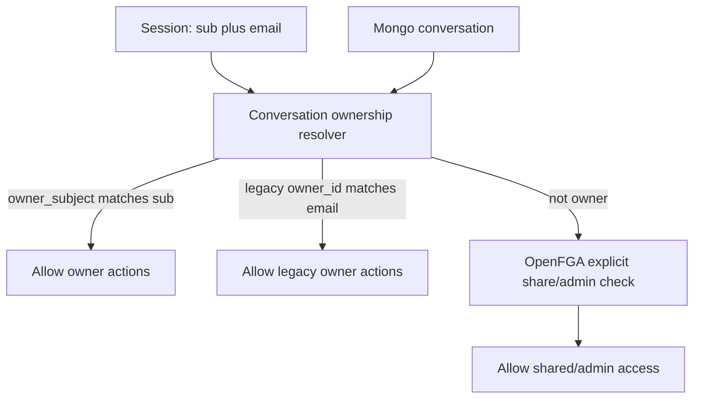

# 0.5.1 Schema-Versioned Migration Admin Tab

## Goal

Add a guarded Admin UI migration tab for the **entire 0.5.1 upgrade from `main`**. Admins should be able to discover legacy data shape issues, preview collection/schema changes, confirm each migration, and apply migration runs with audit/provenance. The framework should support both:

- **Implicit migrations** for high-cardinality records where Mongo ownership remains the source of truth, starting with conversations.
- **Explicit ReBAC migrations** for lower-cardinality resources where OpenFGA tuples are the source of truth, such as teams, agents, KB grants, skills, Slack channel routes, AgentGateway MCP resources, and platform settings.

The branch is `release/0.5.1`; the migration inventory should be derived from changes since `main`.

## Recommended Authorization Model

Use **implicit ownership for high-cardinality private objects** and **explicit OpenFGA for shared/admin/resource grants**:

For 0.5.1, this means private conversations should not create one OpenFGA owner tuple per conversation. Mongo already stores the owner and should remain authoritative for private owner access. OpenFGA should represent explicit sharing, team access, admin/audit access, and lower-cardinality resource grants.

## 0.5.1 Migration Domains

Create a release manifest that groups migrations by domain. Initial domains:

- `conversations`: implicit owner identity normalization from `owner_id` email to `owner_subject` while preserving `owner_id`.
- `conversation_shares`: optional explicit migration for direct/team shares into OpenFGA `reader` or `writer` tuples.
- `teams`: team membership source normalization, identity group sync provenance, and team slug consistency.
- `team_resources`: team-to-agent/tool/skill/task grants already covered by universal ReBAC backfill; expose it in the UI migration tab.
- `team_kb_ownership`: explicit OpenFGA `knowledge_base` reader/ingestor/manager tuple reconciliation.
- `skill_hubs`: stable hub skill ids and explicit `skill:<id>` grants for team resources.
- `slack_channel_routes`: OpenFGA-backed Slack channel-agent associations with Mongo retained only for listen mode and priority metadata.
- `dynamic_agents`: agent tool caller tuple reconciliation and generated-agent write ownership consistency.
- `agentgateway_mcp`: AgentGateway-discovered MCP server records and `mcp_server:agentgateway` admin/discover gates.
- `platform_config`: schema version record for default agent/system settings.
- `audit_events`: ensure RBAC audit/event indexes and version metadata exist.

## Data Schema Versioning

Maintain schema versions in Mongo so all 0.5.1 migrations are explicit and auditable:

- Add a `schema_migrations` collection for migration execution state:
  - `_id`: stable migration id, for example `conversation_owner_identity_v1`
  - `release`: `0.5.1`
  - `schema_area`: `conversations`
  - `from_version`, `to_version`
  - `status`: `planned`, `running`, `completed`, `failed`, `rolled_back`
  - `planned_counts`, `applied_counts`, `warnings`, `sample_diffs`
  - `collections`, `indexes`, `tuple_writes_planned`, `tuple_writes_applied`
  - `started_by`, `started_at`, `completed_at`
- Add a lightweight `data_schema_versions` collection:
  - `_id`: schema area, for example `conversations`
  - `version`: current version, for example `2`
  - `updated_by`, `updated_at`, `last_migration_id`
- Add a `migration_manifests` collection or code-backed manifest response:
  - `release`: `0.5.1`
  - `domains`: migration ids, descriptions, required/optional flags, dependencies, and rollback support.
- For conversations, version `1` is legacy email-only ownership; version `2` adds normalized subject metadata while keeping backwards-compatible email fields.

## Conversation Schema Change

Keep existing fields and add normalized identity fields:

- Existing: `owner_id: string` remains the legacy email owner field.
- New: `owner_subject?: string` stores Keycloak `sub` when resolvable.
- New: `owner_identity_version?: 2` marks records normalized by migration or new writes.
- New optional provenance under metadata, such as `metadata.owner_identity_migration`, records migration id and timestamp.

This avoids breaking old code and avoids per-conversation OpenFGA owner tuples.

## Backend Migration Framework

Add a server-side migration registry in the UI backend:

- Migration definition includes `id`, `schema_area`, `from_version`, `to_version`, `description`, `plan()`, and `apply()`.
- `plan()` is read-only and returns counts, unresolved owners, sample diffs, and target collection changes.
- `apply()` requires admin plus `system_config:platform_settings` `admin` permission and writes only after confirmation.
- Execution should be idempotent: reruns skip already-normalized records.
- Migrations should be chunked/batched to avoid long API timeouts.
- Migrations should declare whether they are:
  - `implicit`: Mongo/schema-only, no OpenFGA owner tuple expansion.
  - `explicit`: writes or reconciles OpenFGA base tuples.
  - `index`: creates Mongo indexes or schema metadata.
- The registry should enforce dependencies, for example `users.keycloak_sub` mappings before `conversations.owner_subject`.

## Admin UI Tab

Add a Migration tab under Admin settings or ReBAC admin:

- Show the `0.5.1 from main` migration manifest with current schema version and status for each domain.
- Admin clicks a migration to run a dry-run preview.
- Preview displays affected collections, proposed schema version, counts, unresolved identities, tuple write counts, index changes, and sample before/after rows with sensitive fields minimized.
- Admin must confirm with a typed confirmation string, for example `MIGRATE conversations TO v2`.
- Apply endpoint records a migration run, applies batches, stores results, and surfaces errors.
- The tab should support:
  - `Dry Run`
  - `Apply`
  - `Resume failed run`
  - `View details`
  - `Download JSON report`
  - `Rollback` only for migrations with a safe rollback contract.

## First Migration: Implicit Conversation Ownership

Implement `conversation_owner_identity_v1`:

- Read distinct `conversations.owner_id` emails.
- Resolve `owner_id` to `users.keycloak_sub` or `users.metadata.keycloak_sub`.
- For resolvable owners, update conversations with `owner_subject` and `owner_identity_version: 2`.
- For unresolved owners, leave `owner_id` untouched and report warnings.
- Do **not** write `user: owner conversation:<id>` tuples.
- Update chat authorization to allow implicit owner access from `owner_subject === session.sub` or legacy `owner_id === session.user.email`; only call OpenFGA for non-owner explicit shares/admin checks.

## Release-Wide Migration Behavior

For the rest of 0.5.1:

- Reuse existing `scripts/backfill-universal-rebac.ts` logic as a backend migration, not just a CLI script, for teams/resources/default-agent relationships.
- Reuse `scripts/backfill-agent-tool-openfga.ts` logic for dynamic-agent tool caller tuples.
- Add migration implementations for KB ownership, skill hub grants, Slack channel-agent route tuples, and AgentGateway MCP onboarding if the corresponding Mongo state exists.
- Avoid writing explicit tuples for high-cardinality private documents unless the tuple represents sharing or delegation.
- Store provenance in `rebac_relationships` for explicit relationships, but do not require one `rebac_relationships` row for every private conversation owner.

## Files To Change Later

Likely implementation surface:

- `ui/src/types/mongodb.ts` for conversation schema fields and migration collection types.
- `ui/src/lib/api-middleware.ts` for identity-aware conversation ownership/access helpers.
- `ui/src/app/api/chat/**/route.ts` to use implicit owner access before OpenFGA checks.
- New `ui/src/lib/rbac/migrations/` registry and conversation migration implementation.
- New `ui/src/app/api/admin/rebac/migrations/` or `ui/src/app/api/admin/migrations/` endpoints.
- New Admin UI tab component, likely under `ui/src/components/admin/`.
- Existing migration scripts to adapt or wrap: `scripts/backfill-universal-rebac.ts`, `scripts/backfill-agent-tool-openfga.ts`, and `scripts/init-rbac-mongo-indexes.ts`.
- Update `docs/docs/security/rbac/architecture.md`, `docs/docs/security/rbac/workflows.md`, and `docs/docs/security/rbac/file-map.md`.

## Verification

Add tests for:

- Migration dry-run counts and sample diffs.
- Apply idempotency and unresolved owner warnings.
- `data_schema_versions` and `schema_migrations` updates.
- Release manifest dependency ordering for `0.5.1`.
- Existing backfill script behavior when invoked through the migration registry.
- Conversation list/read/write behavior for `owner_subject`, legacy `owner_id`, explicit OpenFGA share, and denial.
- Explicit low-cardinality migrations write base tuples and never derived `can_*` tuples.
- Admin UI confirmation flow.

## Non-Goals

Do not write per-conversation owner OpenFGA tuples for private conversations. Do not make Task Builder a 0.5.1 migration target because it is scheduled for a separate refactor. Do not require every historical record to be fully migratable before the UI is usable; unresolved identities should remain legacy-compatible and visible to their email owner while flagged in migration warnings.
