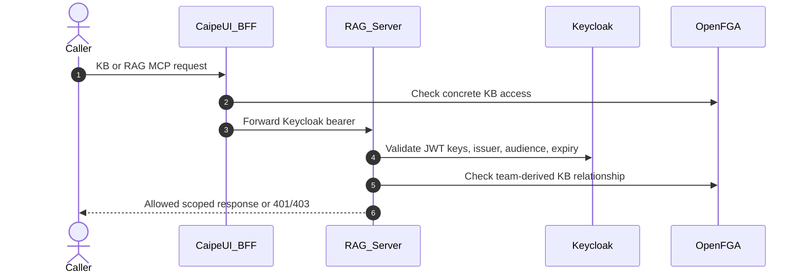

# RAG Team ReBAC Plan

**Branch**: `release/0.5.1` | **Date**: 2026-05-18
**Input**: Cursor plan `RAG Team ReBAC`

## Summary

Replace RAG's environment-driven default authorization fallback with team-based OpenFGA/ReBAC grants. Keycloak remains the authentication and token validation authority. Authorization for Knowledge Bases, Data Sources, and RAG MCP tool use should come from OpenFGA relationships derived from team membership. Data Sources tab administration is a separate admin-surface grant; individual datasource read/ingest/admin grants remain `knowledge_base:<datasource_id>` relationships.

The target access shape is:

```text
user:<sub> member team:<slug>
team:<slug>#member reader knowledge_base:<datasource_id>
team:<slug>#member ingestor knowledge_base:<datasource_id>
team:<slug>#member manager knowledge_base:<datasource_id>
```

RAG and the `caipe-ui` BFF should both fail closed unless OpenFGA allows the concrete resource operation.

## Goal

Move RAG authorization to team-based OpenFGA grants, editable from `Admin -> Security & Policy -> OpenFGA ReBAC`.

The target flow is:



## Design

- Keep Keycloak as authentication only for RAG: JWT validation, user subject, issuer, audience, expiry, and claims extraction.
- Use teams as the authorization unit: `user:<sub> member team:<slug>` plus `team:<slug>#member reader|ingestor|manager knowledge_base:<datasource_id>`.
- Treat OpenFGA as the only authorization source. An unmatched authenticated user does not receive broad RAG access without a concrete team-derived OpenFGA relationship.
- Extend the OpenFGA ReBAC admin tab with a RAG Team Access panel that grants team access to the Data Sources admin surface via `team:<slug>#member manager admin_surface:rag_datasources`. Keep individual datasource permission management in the existing Team Knowledge Base/Data Sources UI.
- Preserve `team_kb_ownership` as operational metadata for UI display and migration compatibility, but make OpenFGA tuples the enforcement source of truth.
- For direct RAG calls, add a small OpenFGA client to the RAG server and update RAG auth dependencies so every read/ingest/admin decision is checked as `user:<sub> can_read|can_ingest|can_manage knowledge_base:<id>` or derived through team membership.

## Files To Change

- `ai_platform_engineering/knowledge_bases/rag/server/src/server/rbac.py`: remove default authenticated role fallback as an authz source; add OpenFGA decision helpers for RAG read/ingest/admin checks, including team-derived checks.
- `ai_platform_engineering/knowledge_bases/rag/server/src/server/restapi.py`: use RAG OpenFGA checks where endpoints currently rely only on `require_role(...)`, especially datasource listing, query, ingest, delete, MCP schema, and MCP invoke paths.
- `deploy/openfga/model.fga` plus generated authorization model JSON files: verify existing `team#member` support for `knowledge_base` is sufficient; avoid adding organization-wide baseline access unless a later explicit requirement needs it.
- `ui/src/components/admin/OpenFgaRebacTab.tsx`: add a RAG Team Access policy panel under the existing OpenFGA ReBAC admin tab for Data Sources admin-surface grants.
- `ui/src/app/api/admin/openfga/...`: add API route(s) to read/update team RAG grants, preview tuple impact, and apply tuple reconciliation.
- `ui/src/app/api/admin/teams/[id]/kb-assignments/route.ts`: keep existing team KB assignment APIs as the per-datasource tuple writer for `knowledge_base:<id>` grants.
- `ui/src/app/api/rag/[...path]/route.ts`: keep current BFF PDP filtering and bearer forwarding; ensure it remains consistent with the new team policy.
- `docs/docs/security/rbac/`: update architecture, workflows, usage, and file map.

## Implementation Tasks

- [x] Map existing RAG role/default tests and identify new failing tests for OpenFGA decisions.
- [x] Confirm OpenFGA team-to-knowledge-base tuple strategy and avoid organization-wide baseline grants.
- [x] Add RAG server OpenFGA PDP helper and replace default-role fallback authorization.
- [x] Add Admin OpenFGA API routes for team-based RAG access read/update/preview/apply.
- [x] Add RAG team access policy panel to OpenFGA ReBAC admin tab.
- [x] Update RBAC docs and run focused UI/Python verification.

## Test Strategy

- Add RAG server tests proving unmatched authenticated users no longer get env default access unless a team-derived OpenFGA relationship allows it.
- Add RAG server tests for direct API/MCP request allow/deny by OpenFGA team-derived relation.
- Add UI API tests for team RAG grant read/update, tuple preview, and tuple reconciliation.
- Add Admin UI tests for the new OpenFGA ReBAC RAG Team Access panel.
- Extend focused BFF tests around `ui/src/app/api/rag/[...path]/route.ts` to keep bearer forwarding plus PDP filtering intact.

## Rollout Notes

- Do not rely on legacy role or trusted-network configuration; deployments should grant RAG access through OpenFGA relationships only.
- Default to no team KB grants for safety.
- Provide a migration/backfill action from the OpenFGA ReBAC tab to materialize team KB tuples for existing `team_kb_ownership` rows and Team Resources selections.
- Do not change upstream IdP integration: RAG should validate Keycloak-issued tokens only.
