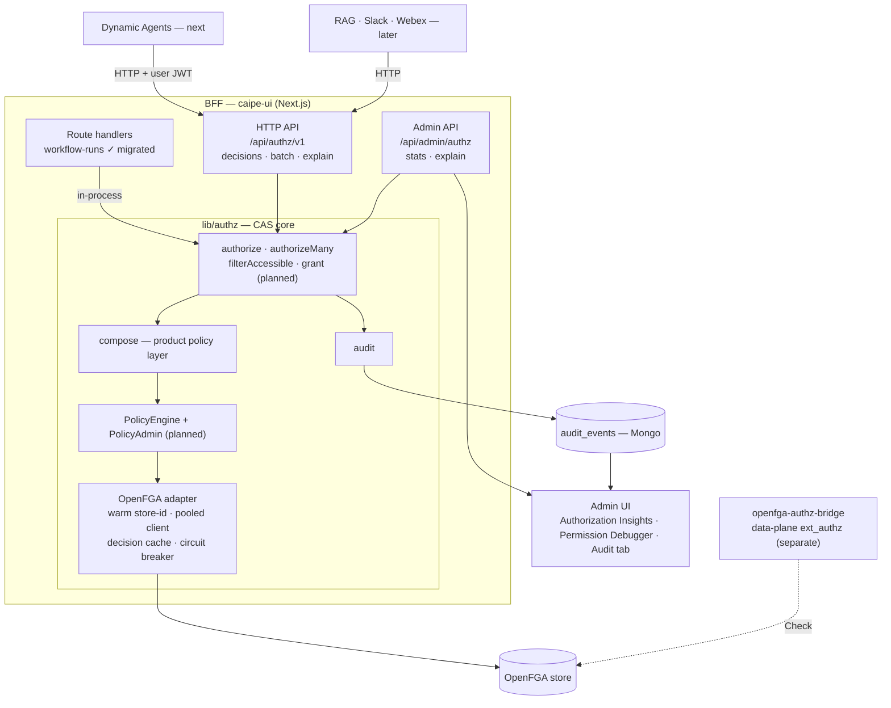
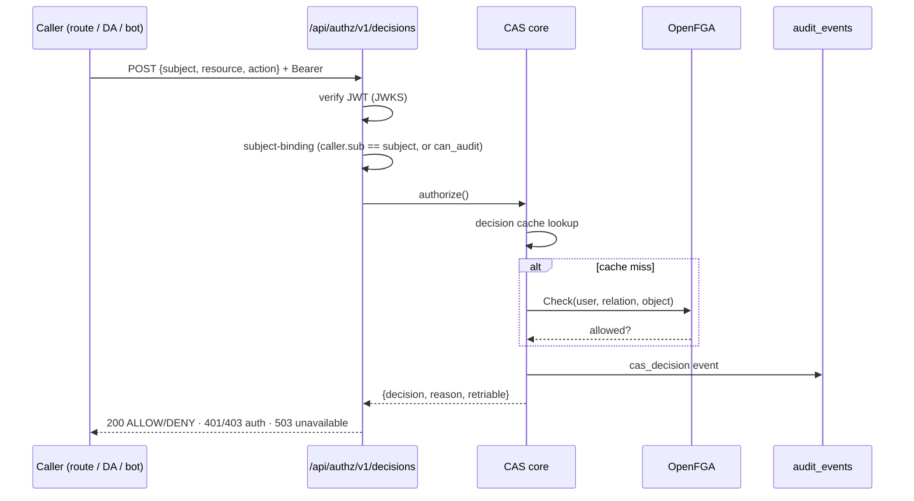
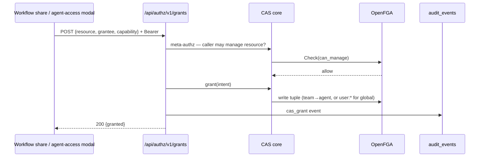
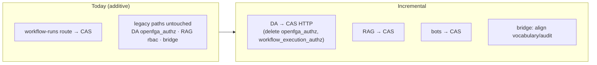

# CAS Architecture Diagrams

**Date:** 2026-06-07
**Companion to:** [`spec.md`](./spec.md) · [`research.md`](./research.md) · [`../2026-06-05-centralized-bff-authz-pdp-agnostic/solution-architecture.md`](../2026-06-05-centralized-bff-authz-pdp-agnostic/solution-architecture.md)

> One decision core, multiple transports, PDP-agnostic. Additive today; consumers migrate incrementally.

---

## 1. Component view

What's built (solid) vs. planned (dashed / "planned" labels). CAS lives **inside the BFF**; out-of-process callers reach it over HTTP.

**Key points**
- The **OpenFGA adapter is private** to `lib/authz` (ESLint silo boundary). Swapping in Cedar/OPA later = a new adapter behind the same `PolicyEngine` / `PolicyAdmin` interfaces.
- The **bridge** stays data-plane (per-MCP-call `ext_authz`); it does **not** route through the BFF.
- DA/RAG/bots are **not migrated yet** — only the in-process `workflow-runs` route consumes CAS today.

---

## 2. Decision request flow (read / PDP)

A DENY is a successful evaluation (`200` + body). HTTP error codes are reserved for meta-failures.

---

## 3. Grant flow (write / PAP — planned, Phase 1 of the #1751 rewrite)

Intent-based and meta-authz'd: callers send `{resource, grantee, capability}`, never raw tuples. CAS verifies the caller may manage the resource, then writes via the adapter.

---

## 4. Migration posture

Each surface flips independently; nothing is forced. The standalone service can ship and run with a single real consumer, then absorb the rest over time.

---

<!-- assisted-by claude code claude-opus-4-8 -->
