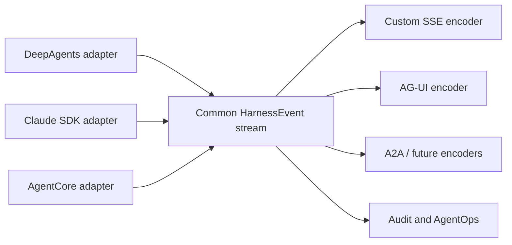

# Phase 0 Research: Dynamic Agent Multi-Harness Support

## Executive conclusion

CAIPE should support DeepAgents, Claude Agent SDK, and AgentCore Harness through a
common harness contract, but it should not model all three as interchangeable
"runtime backends."

Two independent choices are required:

1. **Harness** — owns the agent loop, tools, short-term context, and native events.
2. **Execution provider** — owns hosting, deployment, lifecycle, isolation, and remote
   invocation.

The recommended delivery sequence is:

1. Introduce the common contract and wrap the existing DeepAgents behavior.
2. Implement a Claude Agent SDK adapter against Anthropic's public SDK contract.
3. Add AgentCore Harness plus the AgentCore Runtime control plane.

Claude Agent SDK is the best second implementation because it exercises a second local
agent-loop contract without first introducing AWS provisioning, IAM, ECR, endpoints,
version rollout, and asynchronous managed-resource state.

## R-1 — Separate harness from execution provider

**Decision**: Model harness selection and execution placement as separate fields.

Illustrative configuration:

```yaml
harness:
  type: deepagents | claude_agent_sdk | agentcore_harness
  config: {}

execution:
  provider: local | agentcore_runtime
  config: {}
```

**Rationale**:

- DeepAgents and Claude Agent SDK are agent-loop implementations that CAIPE can host.
- AgentCore Runtime is a serverless hosting environment for agent code.
- AgentCore Harness is a managed Strands-powered loop that runs inside AgentCore
  Runtime.
- AgentCore Runtime can host custom frameworks, including LangGraph-based agents.
- Keeping the axes separate avoids blocking future supported combinations.

**Evidence**:

- AWS distinguishes [AgentCore Harness from AgentCore Runtime](https://docs.aws.amazon.com/bedrock-agentcore/latest/devguide/harness-vs-runtime.html): Runtime provides infrastructure while Harness provides the managed orchestration loop.
- AWS documents AgentCore Runtime as a containerized hosting layer with sessions,
  versions, endpoints, isolation, identity, streaming, and protocol support in
  [How AgentCore Runtime works](https://docs.aws.amazon.com/bedrock-agentcore/latest/devguide/runtime-how-it-works.html).

**Alternatives rejected**:

- One `runtime_backend` enum containing `deepagents`, `claude`, and `agentcore` —
  conflates execution logic with hosting and cannot accurately express AgentCore
  Harness versus Runtime.
- Deployment-wide harness selection — prevents mixed-harness agents in one CAIPE
  installation and contradicts issue #2079.

### Initial compatibility matrix

| Harness | Local execution | AgentCore Runtime | Initial scope |
|---|---:|---:|---|
| DeepAgents | Required | Plausible follow-up | Existing default remains local |
| Claude Agent SDK | Required | Evaluate later | First additional harness |
| AgentCore Harness | Not applicable | Required | Managed AgentCore option |

Unsupported pairs should be rejected by capability validation, not represented as
partially working agents.

## R-2 — Current Dynamic Agents code is coupled to DeepAgents/LangGraph

**Decision**: Introduce the harness boundary before implementing either new harness.
The first adapter wraps existing behavior without changing its user-visible contract.

**Codebase findings**:

- `AgentRuntime` imports `create_deep_agent` and DeepAgents backends directly:
  `ai_platform_engineering/dynamic_agents/src/dynamic_agents/services/agent_runtime.py:23-27`.
- `AgentRuntime` stores the concrete graph in `_graph`:
  `agent_runtime.py:238-284`.
- Initialization constructs the DeepAgents graph directly:
  `agent_runtime.py:750-802`.
- Streaming calls `_graph.astream(..., stream_mode=["messages", "updates", "tasks"])`:
  `agent_runtime.py:1366-1379` and `1699-1712`.
- The stream encoder abstraction still accepts raw LangGraph tuples in `on_chunk`:
  `services/stream_encoders/__init__.py:20-51`.
- Conversation routes reach through the runtime boundary to inspect `_graph`:
  `routes/conversations.py:100-127`.
- `AgentRuntimeCache` constructs the concrete `AgentRuntime` directly:
  `services/runtime_cache.py:240`, `278`, and `327`.
- `AgentBackend` already means filesystem/checkpoint storage strategy, not agentic
  harness: `models.py:180-228`. The new abstraction must not overload this name.

**Implication**: Adding SDK-specific branches inside `AgentRuntime.stream()` would
spread conditionals into caching, conversations, interrupts, streaming, metrics, and
tests. The shared runtime needs to depend on a harness-neutral interface first.

## R-3 — Build the Claude adapter from the public SDK contract

**Decision**: Implement Claude Agent SDK support directly against Anthropic's documented
Python API and isolate all SDK-specific types inside the adapter.

### Public API surface to map

| SDK surface | Adapter responsibility |
|---|---|
| `ClaudeSDKClient` | Continuous conversation lifecycle, query submission, response streaming, interruption, and shutdown |
| `ClaudeAgentOptions` | Model, instructions, working directory, allowed tools, MCP servers, permissions, hooks, skills, limits, environment, and session options |
| Assistant and content-block messages | Text, thinking, tool start, and tool result translation |
| System and result messages | Session initialization, terminal result, usage, cost when available, and error classification |
| Task messages | Subagent start, progress, usage, and terminal translation |
| Session APIs | Capture, resume, fork, and shared-store behavior |

Anthropic documents the Agent SDK as a Python or TypeScript library that provides the
same agent loop, tools, context management, hooks, MCP, subagents, permissions, and
sessions as Claude Code in the
[Agent SDK overview](https://code.claude.com/docs/en/agent-sdk/overview).

The public [Python SDK reference](https://code.claude.com/docs/en/agent-sdk/python)
defines the client, options, message types, task messages, content blocks, hooks,
permissions, MCP configuration, and error taxonomy needed by the adapter.

### Required security controls

- Task-local connector credentials rather than ambient user-token fallback
- Allowed-tool restriction
- Read and write confinement to the run workspace
- Denial or approval of unsafe and interactive tools
- Pre-tool authorization and audit hooks
- Post-tool audit and bounded persistence integration

**Alternatives rejected**:

- Expose SDK-native messages to CAIPE clients — couples public protocols to one SDK.
- Spread Claude-specific branches through the existing runtime — recreates the current
  DeepAgents coupling.
- Depend on undocumented message shapes — makes SDK upgrades unsafe and difficult to
  validate.

## R-4 — Normalize harness events before protocol encoding

**Decision**: Every adapter emits a common `HarnessEvent`. Protocol encoders consume
common events rather than native LangGraph chunks, Claude SDK messages, or AgentCore
events.



### Minimum common event taxonomy

| Event | Required semantics |
|---|---|
| `run_started` | CAIPE run and conversation correlation established |
| `text_delta` | Ordered visible or narrated text fragment |
| `tool_started` | Correlated tool name and redacted input |
| `tool_finished` | Correlated success/error and bounded result |
| `subagent_started` | Child task identity and parent correlation |
| `subagent_progress` | Non-terminal child activity |
| `subagent_finished` | Child terminal result |
| `input_required` | Approval, form input, or other supported human decision |
| `usage_updated` | Tokens, context utilization, cost, or provider usage when available |
| `session_updated` | Native session or binding changed |
| `warning` | Non-terminal degraded behavior |
| `run_completed` | Successful terminal outcome |
| `run_cancelled` | Cancelled terminal outcome |
| `run_failed` | Failed terminal outcome with stable error category |

Each event should carry:

- CAIPE run, conversation, and agent identifiers
- Harness and execution-provider identifiers
- Sequence or ordering data
- Tool/subagent correlation identifiers where relevant
- Timestamp
- Safe structured payload
- Optional bounded and redacted native metadata for diagnosis

**Invariant**: one run produces exactly one terminal event. Translators must tolerate
unknown native message types, but unknown terminal behavior is an error rather than a
silent success.

**Alternatives rejected**:

- Teach every protocol encoder every SDK's native event types — multiplies coupling by
  harnesses × protocols.
- Use the existing raw LangGraph tuple as the common model — cannot accurately represent
  Claude task messages or AgentCore lifecycle events and preserves the current coupling.

## R-5 — Use a composed adapter and execution-provider contract

**Decision**: Use composition and dependency injection rather than subclasses of the
current concrete `AgentRuntime`.

Illustrative responsibilities:

```python
class HarnessAdapter(Protocol):
    def capabilities(self) -> HarnessCapabilities: ...
    def validate(self, spec: AgentSpec) -> None: ...
    async def initialize(self, context: ExecutionContext) -> None: ...
    async def stream(self, turn: AgentTurn) -> AsyncIterator[HarnessEvent]: ...
    async def resume(self, input: ResumeInput) -> AsyncIterator[HarnessEvent]: ...
    async def cancel(self) -> None: ...
    async def close(self) -> None: ...


class ExecutionProvider(Protocol):
    async def reconcile(self, desired: DeploymentSpec) -> ProviderBinding: ...
    async def status(self, binding: ProviderBinding) -> ProviderStatus: ...
    async def invoke(self, binding: ProviderBinding, request: InvokeRequest): ...
    async def delete(self, binding: ProviderBinding) -> None: ...
```

The exact method signatures belong in the implementation plan and contracts. The
research decision is the separation of responsibilities:

- Harness adapter: model/tool/skill translation, native session behavior, native event
  conversion, in-run cancellation and approvals.
- Execution provider: provision, version, endpoint, invoke transport, health, lifecycle,
  and delete.
- Shared Dynamic Agents service: authorization, configuration, conversation identity,
  common events, protocol encoding, audit, and client-facing errors.

## R-6 — Capabilities are explicit; parity does not mean pretending

**Decision**: Each harness declares supported capabilities and constraints. Save-time
validation rejects incompatible configurations.

### Research capability matrix

| Capability | DeepAgents | Claude Agent SDK | AgentCore Harness |
|---|---|---|---|
| Agent loop owner | CAIPE library | Claude Agent SDK | AWS managed harness |
| Initial execution | Local CAIPE service | Local CAIPE service/process | AgentCore Runtime |
| Streaming | LangGraph stream modes | SDK message stream | Managed response stream |
| MCP tools | Existing CAIPE MCP client | SDK MCP server configuration | Remote MCP supported |
| Built-in file/shell tools | DeepAgents backend/tools | SDK built-ins | Managed shell/file tools |
| Hooks | DeepAgents middleware | Pre/post lifecycle hooks | Not supported by Harness |
| Subagents | DeepAgents task delegation | SDK task/subagent messages | Harness-managed features; validate exact configuration |
| Human approval | Existing interrupt model | SDK permissions/input flow; adapter mapping required | Capability-specific; no hook emulation |
| Short-term context | LangGraph checkpointer | SDK session transcript | AgentCore session/memory configuration |
| Durable cross-host resume | Mongo checkpointer | External/shared session persistence required | AgentCore Memory or CAIPE-owned context required |
| Deployment lifecycle | Process/container lifecycle | Process/container lifecycle | AWS create/update/version/endpoint/delete |

Anthropic's [Python SDK reference](https://code.claude.com/docs/en/agent-sdk/python)
recommends `ClaudeSDKClient` for continuous conversations, session control, streaming,
interrupts, hooks, and custom tools. Anthropic's
[session documentation](https://code.claude.com/docs/en/agent-sdk/sessions) states that
Python sessions are written to local disk and that cross-host or ephemeral execution
requires moving the transcript or using shared external session storage.

AWS's current [Harness versus Runtime feature grid](https://docs.aws.amazon.com/bedrock-agentcore/latest/devguide/harness-vs-runtime.html)
shows an important incompatibility: AgentCore Harness does not expose hooks, arbitrary
framework choice, bidirectional streaming, or non-agent-loop graph patterns, while
custom code on AgentCore Runtime can implement those behaviors.

**Implication**: The UI cannot display a single undifferentiated set of controls. It
must derive supported models, tools, approvals, memory, skills, and execution options
from the selected harness and provider.

## R-7 — CAIPE owns identity, conversation, and audit; harnesses own native context

**Decision**: CAIPE remains the canonical control-plane and audit system. Store native
session identifiers as bindings rather than treating native transcripts as the only
conversation record.

### Ownership model

| Concern | Owner |
|---|---|
| Agent definition and access policy | CAIPE |
| User-facing conversation ID | CAIPE |
| Authorization decision | CAIPE/OpenFGA and downstream policy enforcement |
| Normalized event/audit history | CAIPE |
| Native short-term agent context | Selected harness |
| Native session/resource ID | Harness binding stored by CAIPE |
| Durable long-term memory | Explicit configured provider; never implied by a runtime session |

**Rationale**:

- DeepAgents checkpoints, Claude transcripts, and AgentCore sessions have different
  storage and lifetime semantics.
- Continuous bidirectional synchronization would be expensive, lossy, and prone to
  duplicated context.
- A binding lets CAIPE resume the native context when available while retaining stable
  user-facing identity and audit records.

### Claude session implication

Dynamic Agents must capture native session IDs and define explicit behavior for resume
failure, compaction, and unavailable transcripts. Production cross-replica resume must
use the supported shared session-store mechanism or deliberately reconstruct a fresh
prompt from CAIPE-owned state.

### AgentCore session implication

AWS documents runtime sessions as isolated execution environments that can be
terminated after idle or maximum lifetime. Runtime filesystem/context is ephemeral;
durable history must use AgentCore Memory or CAIPE-owned state. A CAIPE conversation
therefore cannot assume its `runtimeSessionId` always points to a live microVM.

## R-8 — Authorization remains outside the harness

**Decision**: All harnesses receive a validated `ExecutionContext`; none may replace
CAIPE/OpenFGA authorization with framework-local tool permissions.

Required controls:

- Authenticate and authorize agent use before adapter initialization or remote invoke.
- Preserve the caller's delegated identity on MCP calls.
- Fail closed when caller identity or required delegated credentials are missing.
- Constrain built-in file and shell tools to an isolated workspace.
- Treat Claude hooks and DeepAgents middleware as defense-in-depth controls.
- Use IAM or OAuth for AgentCore inbound access and least-privilege outbound identity.
- Redact secrets and sensitive tool inputs/results before normalized events, logs, and
  traces are persisted.
- Prevent provider environment variables from becoming an ambient fallback user
  identity.

Task-local connector credentials and filesystem confinement are required regardless of
the selected SDK. Anthropic documents deterministic pre-tool hooks for validation and
audit in [Agent SDK hooks](https://code.claude.com/docs/en/agent-sdk/hooks). AgentCore
Harness does not offer equivalent hooks, which reinforces the need for authorization
at CAIPE and MCP enforcement boundaries.

## R-9 — AgentCore is a first-class requested product path

**Decision**: Treat [#2109](https://github.com/cnoe-io/ai-platform-engineering/issues/2109)
as a high-priority implementation track, not a speculative deployment follow-up.

The initial AgentCore outcome must let an operator:

- Select AgentCore Harness when defining a dynamic agent.
- Provision, update, promote, invoke, observe, and delete the managed resource from
  CAIPE.
- Connect approved MCP tools without losing CAIPE caller identity or policy controls.
- Choose explicit memory behavior and retention.
- Correlate a CAIPE conversation and audit event with its AWS session and trace.
- See readiness, deployment failure, drift, quota, and invocation errors in CAIPE.

This priority comes from the explicit public feature request. The research does not
infer a request count that the public issue tracker does not provide.

## R-10 — Managed Harness is the AgentCore MVP; Runtime stays a separate provider

**Decision**: The first AgentCore option uses the managed, configuration-driven
AgentCore Harness. Hosting arbitrary framework code directly on AgentCore Runtime is a
separate execution-provider capability.

AWS describes Harness as a managed Strands-powered agent loop backed by Runtime. It
manages the execution environment, session isolation, memory, identity, networking,
and observability from declarative model, instruction, tool, and skill configuration.
Runtime supplies hosting but does not supply an agent loop.

### MVP boundary

| Included in the AgentCore MVP | Deferred or separately selectable |
|---|---|
| Create, update, version, promote, invoke, and delete Harness resources | Host DeepAgents or Claude Agent SDK code on Runtime |
| Managed response streaming mapped to common CAIPE events | Bidirectional streaming or hook emulation |
| Remote MCP or AgentCore Gateway tools | Arbitrary non-agent-loop graphs |
| AgentCore Memory modes and CAIPE conversation binding | Automatic migration of existing LangGraph checkpoints |
| IAM/OAuth ingress, delegated tool identity, and AgentOps correlation | Browser and Code Interpreter enabled without an explicit policy |

The capability registry must expose Harness limitations. In particular, CAIPE must not
advertise hooks, arbitrary framework choice, bidirectional streaming, or graph-shaped
execution when the selected resource is managed Harness.

Sources: [AgentCore Harness](https://docs.aws.amazon.com/bedrock-agentcore/latest/devguide/harness.html),
[Harness versus Runtime](https://docs.aws.amazon.com/bedrock-agentcore/latest/devguide/harness-vs-runtime.html),
and [AgentCore tools](https://docs.aws.amazon.com/bedrock-agentcore/latest/devguide/harness-tools.html).

## R-11 — Map CAIPE resources to immutable AgentCore versions and endpoints

**Decision**: Store a durable AgentCore binding and promote immutable versions through
named endpoints. Production traffic must not rely on the `DEFAULT` endpoint following
the latest version automatically.

| CAIPE concept | AgentCore representation |
|---|---|
| Dynamic agent | Harness resource ARN |
| Saved configuration revision | Immutable Harness version |
| Environment or release channel | Named endpoint pinned to a version |
| Conversation | CAIPE conversation ID plus `runtimeSessionId` and optional actor ID |
| Approved tool set | Remote MCP or Gateway tool configuration |
| Managed memory selection | Memory resource/configuration stored in the binding |
| AgentOps execution | AWS session, trace, span, endpoint, and version identifiers |
| Credential reference | Identity provider/workload identity reference; never raw credentials |

Every update creates or identifies an immutable version. Promotion moves a named
endpoint only after validation. Rollback repoints the endpoint to the last known-good
version without rewriting the CAIPE agent definition.

AWS documents immutable Harness versions and `CREATING`, `CREATE_FAILED`, `READY`,
`UPDATING`, and `UPDATE_FAILED` endpoint states in
[Harness versioning and endpoints](https://docs.aws.amazon.com/bedrock-agentcore/latest/devguide/harness-versioning.html).

## R-12 — Preserve CAIPE caller identity through AgentCore

**Decision**: CAIPE remains the authorization boundary. AgentCore provides workload
identity and token exchange for downstream calls; it does not replace CAIPE/OpenFGA or
MCP-server authorization.

The implementation spike must validate two supported connection patterns:

1. AgentCore invokes an approved CAIPE MCP endpoint with a delegated caller token or a
   signed CAIPE execution context.
2. AgentCore Gateway fronts approved tools and AgentCore Identity performs on-behalf-of
   token exchange for the downstream audience.

Select one pattern per deployment. Do not duplicate existing CAIPE/OpenFGA rules in
AgentCore Policy during the MVP; a second policy plane requires its own ownership,
consistency, and audit design.

Required security behavior:

- Choose IAM SigV4 or OAuth/JWT ingress when creating the resource; do not assume both
  are simultaneously active on one Runtime resource.
- Authorize the CAIPE user before the service invokes AgentCore.
- Carry stable workload, actor, conversation, and request identifiers downstream.
- Restrict the AWS execution role and resource policy to the selected account, region,
  resources, and actions.
- Use on-behalf-of exchange only for an allowed issuer, audience, scope, and tool.
- Fail closed when token exchange, identity mapping, or policy context is unavailable.

AgentCore Identity supports OAuth token exchange, including RFC 8693 and RFC 7523
patterns. The spike must prove compatibility with the deployment's identity provider
and the actual CAIPE MCP boundary before implementation is considered unblocked.

Sources: [Runtime OAuth](https://docs.aws.amazon.com/bedrock-agentcore/latest/devguide/runtime-oauth.html),
[on-behalf-of token exchange](https://docs.aws.amazon.com/bedrock-agentcore/latest/devguide/on-behalf-of-token-exchange.html),
[IAM](https://docs.aws.amazon.com/bedrock-agentcore/latest/devguide/security-iam.html),
and [resource-based policies](https://docs.aws.amazon.com/bedrock-agentcore/latest/devguide/resource-based-policies.html).

## R-13 — Make AgentCore memory mode explicit

**Decision**: An AgentCore agent must select one of three memory modes. CAIPE remains
the canonical conversation and audit record in every mode.

| Mode | Behavior | Required binding data |
|---|---|---|
| Disabled | No AgentCore Memory persistence | Session mapping only |
| Managed | CAIPE provisions/configures AgentCore Memory | Memory ARN, actor scope, session mapping, retention policy |
| Bring your own | Operator supplies an allowed existing memory resource | Validated resource reference, actor scope, session mapping, retention owner |

AgentCore Harness enables memory by default, but CAIPE must never silently accept that
default. The operator needs to see the selected mode and its retention/deletion
consequences.

Implementation requirements:

- Use a tenant- and user-safe actor ID mapping; never reuse a global actor ID.
- Keep `runtimeSessionId` separate from durable memory identity.
- Define what deletion removes from CAIPE, Harness, and Memory.
- Define retention, export, legal hold, and region behavior before managed long-term
  memory is generally available.
- Do not place secrets or unrestricted tool results into long-term memory.

AWS distinguishes short-term raw events from long-term semantic, summary, preference,
episodic, and custom strategies in
[AgentCore Harness memory](https://docs.aws.amazon.com/bedrock-agentcore/latest/devguide/harness-memory.html).

## R-14 — AgentCore requires an asynchronous, idempotent control plane

**Decision**: Treat AgentCore configuration changes as desired-state reconciliation,
not synchronous CRUD that assumes the remote resource is immediately ready.

Required managed states include:

- `pending_create`
- `creating`
- `ready`
- `updating`
- `update_failed`
- `deleting`
- `delete_failed`
- `deleted`
- `drifted`

The binding needs, at minimum:

- CAIPE agent ID and desired configuration revision
- AWS account and region reference
- Harness/runtime ARN
- Immutable version and named endpoint
- Memory and identity references
- Observed lifecycle state, reason, and last reconciliation time
- Native session mapping per conversation

Reconciliation must be idempotent. A network timeout after AWS accepts a create,
update, endpoint promotion, or delete request cannot create duplicate resources or
lose the last known-good binding. Deletion must account for retained versions, named
endpoints, memory resources, and externally owned dependencies.

## R-15 — AgentCore needs explicit operational, cost, and quota gates

**Decision**: A managed AgentCore binding cannot become `ready` until deployment
preflight validates region, IAM, networking, MCP reachability, identity exchange,
service quotas, model access, and observability.

### AgentOps mapping

- Propagate CAIPE request, conversation, agent, tenant, endpoint, and version IDs.
- Record AWS session, trace, and span IDs on normalized audit events.
- Enable CloudWatch Transaction Search and OpenTelemetry/ADOT integration where
  required for trace detail.
- Export availability, latency, token/model usage, tool failures, throttling, session
  saturation, and reconciliation errors without copying secrets or unrestricted tool
  content.
- Distinguish Harness, model, Memory, Gateway, and built-in-tool cost attribution.

AWS states that Harness has no separate charge; the deployment pays for the underlying
AgentCore capabilities and model use. CAIPE must still support budgets, usage tags,
and per-agent cost correlation before broad enablement.

### Limits to preflight

AWS documents regional/account quotas and Runtime-backed Harness limits for active
sessions, resource/version/endpoint counts, request rates, compute size, image size,
and synchronous, streaming, and asynchronous execution duration. These values are
deployment inputs, not constants in the CAIPE contract. Discover or configure them at
deployment time and surface actionable failures before traffic is routed.

Sources: [AgentCore quotas](https://docs.aws.amazon.com/bedrock-agentcore/latest/devguide/bedrock-agentcore-limits.html),
[observability](https://docs.aws.amazon.com/bedrock-agentcore/latest/devguide/observability-get-started.html),
and [telemetry model](https://docs.aws.amazon.com/bedrock-agentcore/latest/devguide/observability-telemetry.html).

## R-16 — Claude SDK versioning needs an explicit compatibility gate

**Decision**: Pin a reviewed Claude Agent SDK version and test its native message
contract. Do not depend on undocumented message shapes.

**Rationale**:

- The SDK exposes a broad and evolving message taxonomy.
- The current official Python API includes session stores, interrupts, hooks, custom
  transports, task messages, and multiple tool types.
- An unknown native message should be observable and safely ignored only when it is
  non-terminal; unknown terminal semantics must fail visibly.

Minimum compatibility coverage:

- SDK client startup and shutdown
- Partial text messages
- Tool start/result correlation
- System initialization and session ID
- Successful and failed result messages
- Context/token/cost usage when available
- Task/subagent start, progress, and terminal notifications
- Interrupt and cancellation behavior
- Resume, missing transcript, and shared-store behavior
- Hook allow, deny, mutation, timeout, and failure behavior
- MCP connection and credential propagation

## R-17 — Prove the local abstraction, then deliver AgentCore in gated increments

**Decision**: Use the following delivery order.

### Phase A — Common foundation and DeepAgents wrapper

- Define harness capabilities and configuration validation.
- Define the common event contract.
- Move LangGraph parsing into the DeepAgents adapter.
- Make cache, chat, resume, conversation-state, and encoders depend on the common
  contract.
- Preserve current behavior and protocol output.

### Phase B — Claude Agent SDK adapter

- Implement SDK message translation and option construction from the public API.
- Implement CAIPE workspace, credential, MCP, session, approval, cancellation, and
  telemetry integration.
- Add native SDK compatibility and common conformance tests.
- Enable per-agent selection for DeepAgents and Claude.

### Phase C1 — AgentCore integration spike

- Prove IAM/OAuth ingress and delegated caller identity with the deployment's identity
  provider.
- Prove remote MCP connectivity, DNS, TLS, egress, token exchange, and fail-closed
  behavior.
- Capture real Harness streaming events and map them to the common contract.
- Validate Memory actor/session isolation and AgentOps trace correlation.
- Confirm quotas, regions, model access, and expected cost attribution.

### Phase C2 — AgentCore control plane

- Implement desired-state reconciliation, bindings, immutable versions, named
  endpoints, promotion, rollback, drift detection, and deletion.
- Add lifecycle status and actionable failure details to the API and UI.

### Phase C3 — AgentCore data plane

- Implement Harness configuration and invocation adapters.
- Map sessions, streaming, tools, memory, traces, errors, cancellation, and timeouts.
- Add common conformance and golden-stream tests.

### Phase C4 — AgentCore operational hardening

- Add quota and model-access preflight, cost/usage attribution, dashboards, alerts,
  audit correlation, and failure injection.
- Enable AgentCore only after create, update, promotion, rollback, and deletion tests
  are idempotent and identity/MCP tests fail closed.

### Phase D — Follow-up harnesses and execution combinations

- Evaluate Google ADK and standalone Strands adapters under issue #2079.
- Evaluate DeepAgents or Claude SDK hosted on AgentCore Runtime only when a concrete
  deployment need exists.
- Evaluate cross-harness delegation through an explicit A2A or routing contract.

**Why Claude first**: It is the second concrete implementation needed to prove the
abstraction, aligns with the Constitution's Rule of Three, and isolates adapter design
from remote control-plane complexity.

## R-18 — Estimated effort and staffing

| Workstream | Estimated effort |
|---|---:|
| Common contract, event model, and DeepAgents wrapper | 2–3 engineer-weeks |
| Claude Agent SDK adapter | 3–5 engineer-weeks |
| AgentCore Harness and Runtime control/data plane | 8–12 engineer-weeks |
| Cross-harness UI, conformance, security, and operational hardening | 2–3 engineer-weeks |
| **Total** | **15–23 engineer-weeks** |

Expected elapsed time is approximately **8–12 calendar weeks with two engineers**, with
the Claude-enabled local multi-harness milestone available before AgentCore completion.

The largest uncertainty is AgentCore enterprise integration rather than SDK invocation:

- AWS account and IAM ownership
- VPC/DNS/egress access to CAIPE MCP servers
- Caller identity and credential exchange
- Resource reconciliation and rollback
- Memory ownership and retention
- AgentOps trace/log correlation
- Cost attribution and quotas

### AgentCore estimate decomposition

| AgentCore workstream | Estimated effort |
|---|---:|
| Security, networking, identity, and event-mapping spike | 1–2 engineer-weeks |
| Harness adapter and streaming data plane | 2–3 engineer-weeks |
| Reconciliation, versions, endpoints, promotion, and deletion | 2–3 engineer-weeks |
| MCP identity, memory, AgentOps, quota, and failure hardening | 3–4 engineer-weeks |
| **AgentCore total** | **8–12 engineer-weeks** |

## R-19 — Issue structure

**Decision**:

- Keep [#2079](https://github.com/cnoe-io/ai-platform-engineering/issues/2079) as the multi-harness umbrella.
- Add a child issue for the common harness contract and DeepAgents wrapper.
- Add a child issue for the Claude Agent SDK adapter.
- Split [#2109](https://github.com/cnoe-io/ai-platform-engineering/issues/2109) into:
  - AgentCore security, network, identity, Memory, and event-mapping spike
  - AgentCore Harness adapter
  - AgentCore control plane, versions, endpoints, promotion, and deletion
  - AgentCore MCP identity, AgentOps, quota, cost, and failure hardening

This preserves the distinction already present in the issue intent: #2079 concerns
agentic SDK choice, while #2109 concerns an optional AWS-managed backend.

## Risks and mitigations

| Risk | Impact | Mitigation |
|---|---|---|
| Common contract becomes a lowest-common-denominator API | Harness-native value is lost | Mandatory core events plus declared optional capabilities and bounded native metadata |
| Shared runtime remains coupled to LangGraph | New adapters require invasive branches | Make DeepAgents consume the same contract before adding Claude |
| Claude sessions disappear on replica replacement | Follow-up loses context | Shared `SessionStore` or explicit CAIPE-state recovery policy; test cross-host resume |
| Claude built-in tools bypass CAIPE boundaries | Unauthorized file or command execution | Isolated workspace, tool allowlist, hooks, sandboxing, and authorization outside the SDK |
| AgentCore provisioning and CAIPE state diverge | Leaked or unusable AWS resources | Idempotent desired-state reconciliation and drift detection |
| AgentCore session expiry is mistaken for durable memory | Lost conversation context | Explicit memory policy and CAIPE-owned conversation record |
| AgentCore actor IDs are shared across users or tenants | Cross-user memory disclosure | Tenant-scoped actor mapping and isolation tests |
| MCP servers are unreachable from AgentCore | Agent runs without required tools | Preflight networking/identity validation before marking the managed agent ready |
| Ingress auth mode is chosen incorrectly | Invocation outage or weakened access boundary | Make IAM versus OAuth an immutable, validated deployment decision |
| CAIPE and AgentCore Policy become competing policy planes | Inconsistent allow/deny outcomes | Keep CAIPE/OpenFGA and MCP enforcement canonical in MVP; design policy synchronization separately |
| `DEFAULT` endpoint follows an unvalidated version | Production changes without promotion | Route production through named, pinned endpoints |
| Per-invocation model overrides bypass policy or budgets | Compliance and cost exposure | Capability/model allowlist and normalized usage/cost audit |
| Direct shell command APIs bypass the model loop | Unreviewed command execution | Separate permission, workspace confinement, audit, and default deny |
| Trace or memory content captures secrets | Sensitive-data disclosure | Redaction, retention controls, scoped access, and content-minimizing telemetry |
| AWS quotas or regional limits are exhausted | Provisioning or invocation failure | Deployment preflight, saturation metrics, capacity alerts, and documented quota requests |
| Provider-specific events break clients | UI/protocol regressions | Normalize before encoding; common conformance and golden-stream tests |
| SDK upgrades introduce unknown message types | Missing output or false completion | Pinned versions, compatibility fixtures, unknown-event metrics, terminal-event invariants |
| Capability differences are hidden | Misconfigured or silently degraded agents | Capability registry and save-time validation in UI and API |

## Sources

### CAIPE

- [CAIPE issue #2079: Multiple Agentic Harness SDK Integration](https://github.com/cnoe-io/ai-platform-engineering/issues/2079)
- [CAIPE issue #2109: Amazon Bedrock AgentCore Integration](https://github.com/cnoe-io/ai-platform-engineering/issues/2109)

### Anthropic

- [Claude Agent SDK overview](https://code.claude.com/docs/en/agent-sdk/overview)
- [Claude Agent SDK Python reference](https://code.claude.com/docs/en/agent-sdk/python)
- [Claude Agent SDK sessions](https://code.claude.com/docs/en/agent-sdk/sessions)
- [Claude Agent SDK hooks](https://code.claude.com/docs/en/agent-sdk/hooks)

### AWS

- [Amazon Bedrock AgentCore overview](https://docs.aws.amazon.com/bedrock-agentcore/latest/devguide/)
- [AgentCore Harness](https://docs.aws.amazon.com/bedrock-agentcore/latest/devguide/harness.html)
- [Get started with AgentCore Harness](https://docs.aws.amazon.com/bedrock-agentcore/latest/devguide/harness-get-started.html)
- [AgentCore Harness versus Runtime](https://docs.aws.amazon.com/bedrock-agentcore/latest/devguide/harness-vs-runtime.html)
- [AgentCore Harness tools](https://docs.aws.amazon.com/bedrock-agentcore/latest/devguide/harness-tools.html)
- [AgentCore Harness environment](https://docs.aws.amazon.com/bedrock-agentcore/latest/devguide/harness-environment.html)
- [AgentCore Harness models](https://docs.aws.amazon.com/bedrock-agentcore/latest/devguide/harness-models.html)
- [AgentCore Harness memory](https://docs.aws.amazon.com/bedrock-agentcore/latest/devguide/harness-memory.html)
- [AgentCore Harness versioning and endpoints](https://docs.aws.amazon.com/bedrock-agentcore/latest/devguide/harness-versioning.html)
- [How AgentCore Runtime works](https://docs.aws.amazon.com/bedrock-agentcore/latest/devguide/runtime-how-it-works.html)
- [AgentCore Runtime lifecycle settings](https://docs.aws.amazon.com/bedrock-agentcore/latest/devguide/runtime-lifecycle-settings.html)
- [AgentCore Runtime OAuth](https://docs.aws.amazon.com/bedrock-agentcore/latest/devguide/runtime-oauth.html)
- [AgentCore on-behalf-of token exchange](https://docs.aws.amazon.com/bedrock-agentcore/latest/devguide/on-behalf-of-token-exchange.html)
- [AgentCore Gateway](https://docs.aws.amazon.com/bedrock-agentcore/latest/devguide/gateway.html)
- [AgentCore Policy](https://docs.aws.amazon.com/bedrock-agentcore/latest/devguide/policy.html)
- [AgentCore IAM](https://docs.aws.amazon.com/bedrock-agentcore/latest/devguide/security-iam.html)
- [AgentCore resource-based policies](https://docs.aws.amazon.com/bedrock-agentcore/latest/devguide/resource-based-policies.html)
- [AgentCore observability](https://docs.aws.amazon.com/bedrock-agentcore/latest/devguide/observability-get-started.html)
- [AgentCore telemetry model](https://docs.aws.amazon.com/bedrock-agentcore/latest/devguide/observability-telemetry.html)
- [AgentCore quotas](https://docs.aws.amazon.com/bedrock-agentcore/latest/devguide/bedrock-agentcore-limits.html)
- [AgentCore release notes](https://docs.aws.amazon.com/bedrock-agentcore/latest/devguide/release-notes.html)

**Research date**: 2026-08-03. External product behavior must be revalidated during
implementation because both Claude Agent SDK and AgentCore are actively evolving.
