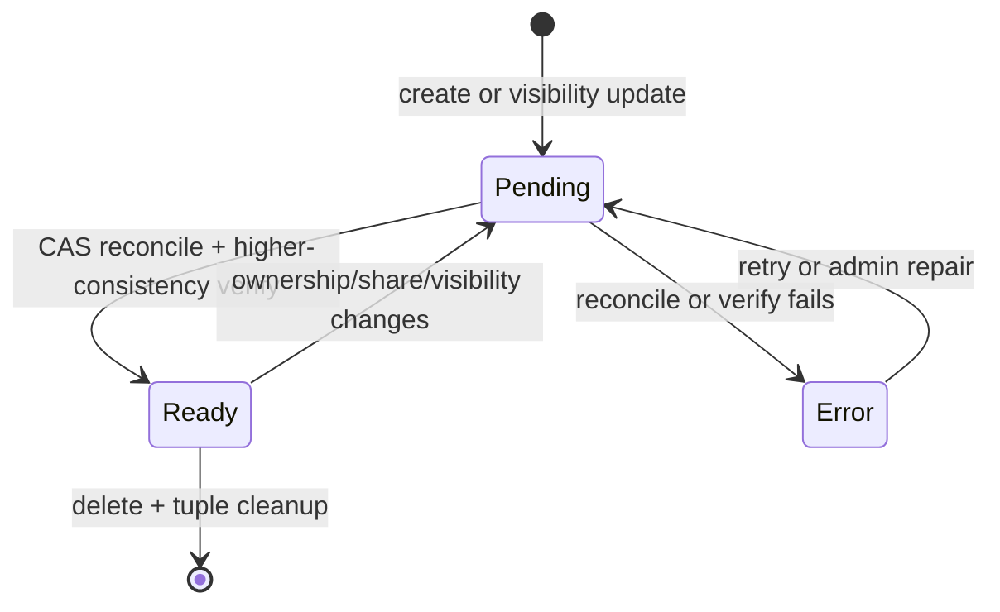

# Data Model: Private Resources and DM-Only Personal Execution

## 1. Persisted Ownership State

The same semantic fields apply to dynamic agents, MCP servers, and secret credential metadata. An adapter may derive them from an existing typed owner record, such as credential `owner.type`, rather than duplicating storage. Secret values remain in the existing encrypted backend and are not copied into resource documents.

| Field | Type | Rule |
|---|---|---|
| `visibility` | `private \| team \| organization \| global` | Resource type accepts only its supported subset |
| `creator_subject` | `string` | Immutable OIDC `sub`; provenance only |
| `owner_subject` | `string?` | Required for private; absent for broader scopes after conversion |
| `owner_team_slug` | `string?` | Required for team; absent for private |
| `owner_organization_id` | `string?` | Required for organization scope; absent for private |
| `shared_with_teams` | `string[]` | Empty for private; normalized/deduplicated |
| `authz_revision` | integer | Incremented on every ownership/visibility/share change |
| `authz_sync_state` | `pending \| ready \| error` | Execution/discovery requires `ready` |
| `authz_last_synced_revision` | integer? | Must equal `authz_revision` when ready |
| `authz_last_error_code` | string? | Sanitized operator diagnostic; no secret data |

### Invariants

| Visibility | `owner_subject` | `owner_team_slug` | `owner_organization_id` | `shared_with_teams` |
|---|---:|---:|---:|---:|
| Private | exactly one human | none | none | empty |
| Team | none | exactly one team | none | zero or more teams |
| Organization | none | none | exactly one organization | policy-defined |
| Global | none | existing policy | existing policy | existing policy |

## 2. Trusted CAS Context

```ts
interface TrustedAuthorizeContext {
  workflowRunId?: string;
  interaction?: {
    surface: "web" | "slack" | "webex" | "api" | "schedule";
    conversationKind: "personal" | "direct" | "group" | "unknown" | "none";
    workspaceId?: string;
    conversationId?: string;
  };
}
```

Rules:

- Only trusted BFF/bot code constructs `interaction`.
- Public `/api/authz/v1` bodies cannot set it.
- Slack/Webex identifiers are audit correlation data, not authority by themselves.
- Unknown or absent interaction context denies private execution.
- Management APIs in the authenticated Web UI use `web/personal`; Web UI chat cannot use this to execute a private resource.
- The DM bot endpoint must pass `slack/direct` or `webex/direct`; it cannot call a context-free helper.

## 3. OpenFGA Projection

Tuple notation below is `subject relation object`.

### Private dynamic agent

```text
user:<sub> creator agent:<id>
user:<sub> owner   agent:<id>
```

Forbidden on a private agent:

```text
team:*#member      user    agent:<id>
team:*#admin       manager agent:<id>
user:*             user    agent:<id>
slack_channel:*    user    agent:<id>
webex_bot_installation:* user agent:<id>
service_account:*  owner   agent:<id>
```

### Private MCP server

Add audit-only `creator: [user]` to the `mcp_server` model, with no `can_*` reference.

```text
user:<sub> creator mcp_server:<id>
user:<sub> owner   mcp_server:<id>
```

The owner relation already derives `can_read`, `can_use`, `can_invoke`, and `can_manage`.

### Private secret credential

Phase 1 preserves the current capability-separated `secret_ref` model:

```text
user:<sub> metadata_reader secret_ref:<id>
user:<sub> user            secret_ref:<id>
user:<sub> manager         secret_ref:<id>
user:<sub> auditor         secret_ref:<id>
```

This keeps metadata discovery, use, management, sharing, and audit separated. Add audit-only `creator` and functional human `owner`; `owner` participates in the existing permissions while `creator` remains provenance-only.

## 4. CAS Decision Matrix

CAS first reads trusted persisted visibility/sync state, applies product policy, then asks OpenFGA for the requested capability.

| Visibility | Subject/context | Product-policy result | OpenFGA principal |
|---|---|---|---|
| Private control-plane read/manage/delete | owner + Web UI personal | continue | `user:<sub>` |
| Private execution | owner + Web UI personal | deny | no check required |
| Private | owner + Slack DM | continue | `user:<sub>` |
| Private | owner + Webex direct | continue | `user:<sub>` |
| Private | owner + any group context | deny | no check required |
| Private | service account/API/schedule/agent | deny | no check required |
| Private | unknown/missing context | deny | no check required |
| Team | DM/Web UI | existing user/team-union policy | user and/or team |
| Team | group channel/space | existing mapped channel/team policy | channel/space + team |
| Organization | supported context | existing organization policy | organization membership |
| Global | supported context | existing global policy | existing principal |

Management recovery is an explicit exception: org administrators may repair ownership metadata and reconciliation state, but this does not grant them credential-value retrieval.

## 5. Dependency Compatibility

Exposure order:

```text
private < team < organization < global
```

The child dependency must be at least as broadly usable as its parent, except that private → private additionally requires the same owner.

| Parent | Private dependency | Team dependency | Organization dependency | Global dependency |
|---|---:|---:|---:|---:|
| Private, same owner | Allow | Allow if owner can use | Allow if owner can use | Allow |
| Private, different owner | Deny | Allow if owner can use | Allow if owner can use | Allow |
| Team | Deny | Allow if all parent teams can use | Allow if the team is covered | Allow |
| Organization | Deny | Deny | Allow if the same organization is covered | Allow |
| Global | Deny | Deny | Deny | Allow |

For a team parent and team dependency, the parent's effective teams must be a subset of the dependency's effective teams. A simple equal-visibility label is not sufficient.

## 6. Visibility Transition State Machine



### Update algorithm

1. Authorize `manage` against the current ready revision.
2. Validate visibility fields and dependency compatibility.
3. Atomically update Mongo with `authz_revision + 1` and `authz_sync_state=pending`.
4. Derive the complete desired tuple set from the stored resource.
5. CAS reconciles previous → desired tuples.
   - Combine deletes and writes in one OpenFGA write when within the operation limit.
   - Use bounded chunks only when required; the resource remains pending throughout.
6. Invalidate CAS decision caches.
7. Verify changed grants/revocations with higher consistency.
8. Conditionally set `ready` only when the current revision still matches the reconciled revision.

### Why the pending state is required

MongoDB and OpenFGA do not share a transaction. Without a pending gate:

- Mongo-first can advertise a visibility that OpenFGA has not enforced.
- OpenFGA-first can leave grants that do not correspond to persisted state.
- Concurrent updates can let an old reconcile publish a new document as ready.

The revisioned pending state makes every mismatch non-usable and recoverable.

## 7. Transition Tuple Effects

### Private → Team

- Keep `creator` unchanged.
- Delete direct human functional-owner/capability tuples.
- Write the existing owner-team and shared-team tuple set.
- Preserve existing team-member/team-admin role semantics.

### Team/Organization/Global → Private

- Keep or backfill `creator` for audit.
- Delete all team, organization, external-group, channel/space, wildcard, and service-account grants.
- Write the direct human owner/capability tuple set.
- Clear owner-team and shared-team fields.
- Reject the transition until every broader dependency is detached or made compatible.

### Delete

- Mark unavailable.
- Delete every tuple whose object is the resource.
- Delete dependent `agent → tool`/wildcard relationships.
- Delete persisted metadata only after cleanup is confirmed, or retain a tombstone until cleanup succeeds.

## 8. Stable Decision Reasons

| Code | Meaning | Retriable |
|---|---|---:|
| `PRIVATE_RESOURCE_CONTEXT_DENIED` | Shared, unattended, or unsupported surface | No |
| `PRIVATE_RESOURCE_OWNER_MISMATCH` | Direct human is not owner | No |
| `PRIVATE_RESOURCE_DEPENDENCY_DENIED` | Parent/child visibility or owner mismatch | No |
| `AUTHZ_SYNC_PENDING` | Desired graph is being reconciled | Yes |
| `AUTHZ_SYNC_ERROR` | Reconcile failed and needs retry/repair | Yes |
| `AUTHZ_UNAVAILABLE` | CAS/OpenFGA unavailable | Yes |
